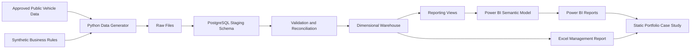
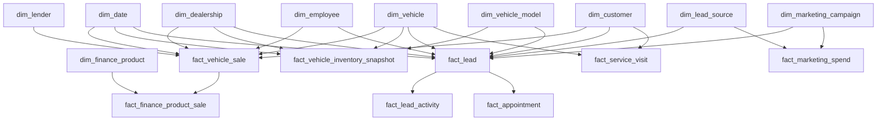

# Automotive Retail Performance Intelligence — Architecture

## 1. Document Purpose

This document defines the technical architecture for **Automotive Retail Performance Intelligence (ARPI)**, a professional automotive dealership analytics portfolio project designed to demonstrate business intelligence, data analysis, data modeling, SQL, Python, Power BI, data quality, and executive communication skills.

This architecture is intentionally opinionated. Its purpose is to prevent uncontrolled scope growth and keep the project focused on the hiring evidence required for Data Analyst, Business Intelligence Analyst, Automotive Data Analyst, Sales Operations Analyst, Product Analyst, Revenue Operations Analyst, and Reporting Analyst roles.

The project is not a production dealership management system, CRM, desking platform, retail website, or AI assistant.

---

## 2. Architecture Status

- **Status:** Approved for implementation
- **Architecture version:** 1.1
- **Last reviewed:** 2026-07-28
- **Primary owner:** Michael Palmer
- **Primary audience:** Hiring managers, technical reviewers, dealership operators, BI professionals, and portfolio reviewers
- **Primary repository:** Public GitHub repository
- **Primary analytical interface:** Microsoft Power BI
- **Primary database:** PostgreSQL
- **Primary data-processing language:** Python
- **Primary data strategy:** Synthetic dealership operations data enriched with approved public vehicle data

---

## 2.1 Naming History

This project was originally drafted under the working title *DealerPulse BI*, the name proposed in the
research phase. Before implementation began, the product identity was changed to **Automotive Retail
Performance Intelligence**, short identifier **ARPI**, with the Python package `arpi` and the database
roles `arpi_admin`, `arpi_loader`, and `arpi_reporter`. The rationale, the alternatives that were weighed,
and the full migration impact are recorded in
[ADR-0001: Project Identity and Naming Convention](docs/architecture-decisions/ADR-0001-project-identity.md).
The former working title is retired and appears in the repository only in that ADR and in the preserved
research document, `docs/research.md`, where it is historical evidence.

---

## 3. Project Summary

Automotive Retail Performance Intelligence (ARPI) is a dealership performance intelligence platform for a fictional three-store automotive group operating in Southern New Hampshire.

The platform integrates synthetic data representing:

- Vehicle inventory
- Retail and wholesale sales
- Front-end and back-end gross profit
- CRM leads
- Lead activities
- Appointments and showroom outcomes
- Marketing spend
- F&I products
- Employees
- Customers
- Service visits
- Service-to-sales opportunities
- Vehicle price changes

The system transforms source data into a dimensional analytical warehouse and exposes management-ready insights through a Power BI semantic model and report.

---

## 4. Business Problem

Dealership data is commonly fragmented across DMS, CRM, inventory, marketing, F&I, and service systems. Managers may receive delayed, inconsistent, or disconnected reports that make it difficult to determine:

- Why sales or gross changed
- Which inventory is becoming financially risky
- Where leads are being lost
- Whether marketing sources generate profitable business
- Which employees are producing balanced results
- Which models have mismatched demand and supply
- Whether F&I performance is sustainable
- Which service customers may represent valid vehicle-replacement opportunities

Automotive Retail Performance Intelligence creates one governed analytical model with consistent KPI definitions and traceable business logic.

---

## 5. Architecture Goals

The architecture must demonstrate the following capabilities:

1. Translate dealership operating questions into measurable KPIs.
2. Design a professional dimensional data model.
3. Generate realistic synthetic operational data.
4. Build reproducible ingestion and transformation workflows.
5. Use SQL for analytical logic and warehouse construction.
6. Use Python for generation, validation, and controlled transformations.
7. Use Power BI for semantic modeling, DAX, and decision-oriented reporting.
8. Validate data quality and metric reconciliation.
9. Document lineage, assumptions, limitations, privacy, and ethics.
10. Produce findings and recommendations that a dealership manager could act on.

---

## 6. Non-Goals

The following are explicitly excluded from the core project:

- Production CRM functionality
- Production DMS integration
- Real dealership data
- Real customer data
- Live lender integration
- Credit application processing
- Payment calculations
- Vehicle shopping or ecommerce features
- Real-time streaming
- Mobile applications
- Multi-tenant SaaS architecture
- AI chatbot functionality
- Machine learning added only for presentation value
- Microservices
- Kubernetes
- Kafka
- Airflow
- Databricks
- Microsoft Fabric
- A second complete dashboard in Tableau
- A second complete dashboard in React or Next.js

A public case-study page may be added after the analytical system is complete, but it must not duplicate the Power BI report.

---

## 7. Key Architecture Decisions

| Decision | Selected option | Rationale |
|---|---|---|
| Core analytical product | Power BI dashboard backed by SQL | Best alignment with target analyst and BI roles |
| Database | PostgreSQL | Professional relational platform with strong SQL support and flexible hosting |
| Hosting | Supabase PostgreSQL or equivalent managed PostgreSQL | Reduces infrastructure overhead while preserving PostgreSQL portability |
| Data generation | Python and pandas | Reproducible synthetic generation, validation, and distribution control |
| Warehouse pattern | Dimensional star schema with multiple facts | Best fit for BI reporting, filtering, grouping, and performance |
| Data source strategy | Synthetic operational data plus approved public enrichment | No public dataset provides complete dealership operations data |
| Public presentation | Static case study, screenshots, and walkthrough video | Avoids dependence on Power BI publishing licenses |
| Excel | Supporting management report only | Demonstrates business operations relevance without duplicating Power BI |
| API layer | Excluded from core release | No business requirement justifies it initially |
| Refresh model | Batch refresh | Real-time processing is unnecessary for the portfolio objective |

---

## 8. Fictional Business Context

### 8.1 Dealer group

**Dealer group:** Granite State Auto Group

### 8.2 Stores

1. Granite Chevrolet of Nashua
2. Granite Subaru of Manchester
3. Granite Used Auto Center of Merrimack

### 8.3 Geographic market

- Southern New Hampshire
- Northern Massachusetts influence
- Southern New England seasonal patterns

### 8.4 Reporting period

- 24 consecutive months
- Daily source-level records
- Monthly executive reporting
- Inventory snapshots captured daily

### 8.5 Expected data scale

| Domain | Target volume |
|---|---:|
| Dealerships | 3 |
| Employees | 35 to 50 |
| Customers | 15,000 to 30,000 |
| Vehicles | 8,000 to 15,000 |
| Retail and wholesale sales | 6,000 to 10,000 |
| Leads | 40,000 to 80,000 |
| Lead activities | 150,000 to 400,000 |
| Appointments | 10,000 to 25,000 |
| Inventory snapshots | 500,000 to 1,500,000 |
| Price-history events | 20,000 to 75,000 |
| F&I product sales | 10,000 to 30,000 |
| Service visits | 60,000 to 150,000 |
| Marketing spend records | 500 to 2,000 |

The generator may create fewer records during local development, but the final portfolio dataset should remain large enough to demonstrate realistic analytical behavior.

---

## 9. System Context



---

## 10. Data Architecture

### 10.1 Database schemas

The PostgreSQL database will use the following schemas:

| Schema | Purpose |
|---|---|
| `raw` | Unmodified imported source records |
| `staging` | Typed, normalized, and deduplicated source records |
| `warehouse` | Dimensions and fact tables |
| `reporting` | Reporting views, summary tables, and approved analytical outputs |
| `audit` | Pipeline-run metadata, validation results, and rejected records |

### 10.2 Layer responsibilities

#### Raw layer

- Preserve source records without business transformations.
- Store ingestion timestamp and source filename.
- Preserve original string values where practical.
- Never serve Power BI directly.

#### Staging layer

- Standardize types and formats.
- Normalize codes and labels.
- Deduplicate records.
- Reject structurally invalid records.
- Assign source-system identifiers.
- Prepare records for warehouse loading.

#### Warehouse layer

- Store conformed dimensions.
- Store facts at explicitly documented grain.
- Use surrogate integer keys.
- Maintain referential integrity.
- Separate measures from descriptive attributes.

#### Reporting layer

- Expose stable, documented views.
- Simplify Power BI ingestion.
- Centralize reusable calculations that belong in SQL.
- Prevent Power BI from accessing raw operational tables.

#### Audit layer

- Record every pipeline execution.
- Record row counts before and after transformations.
- Record rejected rows and validation failures.
- Store reconciliation totals.

---

## 11. Dimensional Model

### 11.1 Modeling rules

1. Every fact table must have a declared grain.
2. Facts must not mix incompatible grains.
3. Dimensions must describe who, what, where, when, and how.
4. Surrogate keys must be used for warehouse relationships.
5. Source-system identifiers must remain available for lineage.
6. Measures that can change over time must remain in facts or snapshots.
7. Slowly changing attributes must be handled deliberately.
8. Customer PII must not be generated or stored.

### 11.2 Core dimensions

#### `warehouse.dim_date`

**Grain:** One row per calendar date.

Key attributes:

- Date key in `YYYYMMDD` integer format
- Full date
- Day of week
- Day name
- Day of month
- Week number
- Month number
- Month name
- Quarter
- Calendar year
- Fiscal month
- Fiscal quarter
- Fiscal year
- Weekend flag
- Month-end flag
- Holiday flag
- Selling-day flag

#### `warehouse.dim_dealership`

**Grain:** One row per dealership store version.

Key attributes:

- Dealership key
- Source dealership ID
- Store name
- Store type
- Franchise brand
- City
- State
- Market region
- Opening date
- Active flag
- Effective date
- Expiration date
- Current-row flag

**History policy:** Slowly changing dimension Type 2.

#### `warehouse.dim_employee`

**Grain:** One row per employee role assignment version.

Key attributes:

- Employee key
- Synthetic employee ID
- Dealership key
- Department
- Job role
- Hire date
- Termination date
- Tenure band
- Manager flag
- Active flag
- Effective date
- Expiration date
- Current-row flag

**History policy:** Slowly changing dimension Type 2 because employees may change stores or roles.

#### `warehouse.dim_customer`

**Grain:** One row per synthetic customer.

Key attributes:

- Customer key
- Synthetic customer ID
- Household key
- Age band
- County
- State
- Market area
- Customer type
- Prior-customer flag
- Service-customer flag
- First interaction date

Prohibited fields:

- Name
- Street address
- Email
- Phone number
- Full birth date
- Social Security number
- Driver's-license number
- Bank information

#### `warehouse.dim_vehicle`

**Grain:** One row per unique physical vehicle.

Key attributes:

- Vehicle key
- Synthetic VIN or masked VIN-like identifier
- Model key
- Model year
- Make
- Model
- Trim
- Body style
- Fuel type
- Drivetrain
- Transmission
- Exterior color
- Interior color
- Odometer band
- New, used, or certified status
- Vehicle source

#### `warehouse.dim_vehicle_model`

**Grain:** One row per model-year, make, model, trim combination.

Key attributes:

- Vehicle model key
- Model year
- Make
- Model
- Trim
- Body style
- Vehicle class
- Fuel type
- Drivetrain
- Franchise alignment

#### `warehouse.dim_lead_source`

**Grain:** One row per normalized lead source.

Key attributes:

- Lead source key
- Source name
- Source category
- Paid or organic flag
- Digital or traditional flag
- Third-party flag
- Internal source flag

#### `warehouse.dim_marketing_campaign`

**Grain:** One row per campaign.

Key attributes:

- Campaign key
- Campaign name
- Channel
- Vendor
- Start date
- End date
- Target department
- Target vehicle category

#### `warehouse.dim_finance_product`

**Grain:** One row per finance product definition.

Key attributes:

- Product key
- Product name
- Product category
- Eligible deal types
- Cancellation-sensitive flag
- Active flag

#### `warehouse.dim_lender`

**Grain:** One row per synthetic lender.

Key attributes:

- Lender key
- Lender name
- Lender type
- Prime, near-prime, or subprime category
- Active flag

#### `warehouse.dim_sale_type`

**Grain:** One row per sale classification.

Values include:

- New retail
- Used retail
- Certified retail
- Lease
- Cash
- Finance
- Wholesale
- Dealer trade

#### `warehouse.dim_inventory_source`

**Grain:** One row per acquisition source.

Values include:

- Customer trade
- Auction
- Off-street purchase
- Lease return
- Dealer trade
- Manufacturer allocation
- Service-lane acquisition

#### `warehouse.dim_geography`

**Grain:** One row per approved geographic market grouping.

Key attributes:

- Geography key
- County
- State
- Market area
- Distance band
- Urban, suburban, or rural classification

---

## 12. Fact Tables and Grain

### 12.1 `warehouse.fact_vehicle_sale`

**Grain:** One row per finalized vehicle transaction.

A transaction includes retail sales, leases, wholesale sales, and dealer trades. Canceled transactions must not remain as finalized sales.

Key foreign keys:

- Sale date key
- Delivery date key
- Dealership key
- Vehicle key
- Customer key
- Salesperson key
- Desk manager key
- Finance manager key
- Lead source key
- Sale type key
- Lender key

Core measures:

- Sale price
- MSRP
- Original asking price
- Final asking price
- Acquisition cost
- Reconditioning cost
- Pack amount
- Front-end gross
- Back-end gross
- Total gross
- Discount from MSRP
- Discount from original asking price
- Days in inventory at sale
- Finance amount
- Cash down payment
- Trade allowance
- Trade actual cash value
- Unit count

Rules:

- `unit_count` equals 1 for finalized retail and wholesale sales.
- `total_gross` equals `front_end_gross + back_end_gross`.
- Sale date cannot precede acquisition date.
- Wholesale transactions may have no customer key.

### 12.2 `warehouse.fact_vehicle_inventory_snapshot`

**Grain:** One row per vehicle per dealership per daily snapshot date while the vehicle is active in inventory.

Key foreign keys:

- Snapshot date key
- Dealership key
- Vehicle key
- Vehicle model key
- Inventory source key

Core measures:

- Current asking price
- Original asking price
- MSRP
- Acquisition cost
- Reconditioning cost
- Inventory investment
- Days in stock
- Market price estimate
- Price-to-market ratio
- Markdown count to date
- Lead count to date
- Appointment count to date
- Inventory unit count

Rules:

- One record per vehicle, store, and date.
- Snapshot generation stops after sale, wholesale disposal, or transfer.
- Historical snapshots are immutable.

### 12.3 `warehouse.fact_inventory_price_history`

**Grain:** One row per vehicle price-change event.

Key foreign keys:

- Effective date key
- Dealership key
- Vehicle key
- Employee key for approving manager

Core measures:

- Previous price
- New price
- Price change amount
- Price change percentage
- Days since prior change
- Days in stock at change

### 12.4 `warehouse.fact_lead`

**Grain:** One row per unique CRM lead.

Key foreign keys:

- Lead-created date key
- Dealership key
- Customer key
- Vehicle key or vehicle model key
- Lead source key
- Campaign key
- Assigned salesperson key
- Assigned BDC employee key

Core measures and flags:

- Lead count
- First-response seconds
- Contacted flag
- Appointment-set flag
- Appointment-show flag
- Sold flag
- Lost flag
- Duplicate flag
- Days to sale

Rules:

- A duplicate lead may reference an original lead ID.
- Sold flag may only be true when a valid transaction is linked.
- First response cannot occur before lead creation.

### 12.5 `warehouse.fact_lead_activity`

**Grain:** One row per CRM activity event.

Activity types include:

- Phone call
- Email
- Text message
- Voicemail
- Appointment confirmation
- Showroom visit
- Manager review
- Lost-lead action

Key foreign keys:

- Activity date key
- Dealership key
- Lead key
- Employee key

Core measures:

- Activity count
- Duration seconds
- Response-delay seconds
- Completed flag

### 12.6 `warehouse.fact_appointment`

**Grain:** One row per scheduled appointment.

Key foreign keys:

- Appointment-created date key
- Scheduled date key
- Show date key
- Dealership key
- Lead key
- Customer key
- Salesperson key
- BDC employee key
- Vehicle key or vehicle model key

Core flags and measures:

- Appointment count
- Confirmed flag
- Showed flag
- Test-drive flag
- Write-up flag
- Sold flag
- Minutes early or late

Rules:

- Show date cannot precede appointment creation.
- Sold appointments must link to a finalized vehicle sale.

### 12.7 `warehouse.fact_marketing_spend`

**Grain:** One row per dealership, campaign, and calendar month.

Key foreign keys:

- Month date key
- Dealership key
- Campaign key
- Lead source key

Core measures:

- Spend amount
- Impressions
- Clicks
- Calls
- Form submissions
- Vendor-reported leads

### 12.8 `warehouse.fact_finance_product_sale`

**Grain:** One row per finance product sold on a finalized vehicle transaction.

Key foreign keys:

- Sale date key
- Dealership key
- Vehicle sale key
- Customer key
- Finance manager key
- Finance product key
- Lender key

Core measures:

- Product sale count
- Product price
- Product cost
- Product gross
- Canceled amount
- Chargeback amount
- Net product gross

Core flags:

- Eligible flag
- Canceled flag
- Charged-back flag

Rules:

- Ineligible product sales are validation failures.
- Net product gross equals product gross minus cancellation and chargeback amounts.

### 12.9 `warehouse.fact_service_visit`

**Grain:** One row per closed repair order visit.

Key foreign keys:

- Open date key
- Close date key
- Dealership key
- Customer key
- Vehicle key
- Service advisor key

Core measures:

- Customer-pay labor
- Customer-pay parts
- Warranty labor
- Warranty parts
- Internal labor
- Internal parts
- Repair estimate
- Declined work amount
- Vehicle mileage
- Visit count

Core flags:

- High-repair-estimate flag
- Declined-work flag
- Replacement-opportunity flag
- Sales-conversion flag

### 12.10 `warehouse.fact_sales_target`

**Grain:** One row per dealership, employee or department, KPI, and calendar month.

Core measures:

- Target value
- Stretch target value

This table supports target attainment without hardcoding goals in DAX.

---

## 13. Fact Constellation Overview



---

## 14. Slowly Changing Dimensions

### Type 1

Use Type 1 replacement when historical reporting does not require the previous value.

Examples:

- Corrected spelling
- Standardized model label
- Corrected campaign description

### Type 2

Use Type 2 history when historical performance must remain attached to the correct attribute version.

Required Type 2 dimensions:

- Dealership
- Employee

Potential Type 2 dimensions:

- Marketing campaign classification
- Lender category

Type 2 rows must contain:

- Effective date
- Expiration date
- Current-row flag

---

## 15. Synthetic Data Architecture

### 15.1 Generation principles

The synthetic-data generator must create statistically plausible but clearly fictional records.

The generator must:

- Use a fixed random seed for reproducibility.
- Support configurable record counts.
- Support development, test, and portfolio data profiles.
- Encode correlations without creating deterministic relationships.
- Produce both normal records and controlled edge cases.
- Generate source files separately from warehouse outputs.
- Log assumptions and generated distributions.

### 15.2 Data-generation profiles

| Profile | Purpose | Approximate size |
|---|---|---:|
| `development` | Fast local iteration | 5 percent of final volume |
| `test` | Automated validation | Small, controlled scenarios |
| `portfolio` | Final public demonstration | Full target volume |

### 15.3 Required business relationships

The generator must model the following relationships:

- Older inventory is more likely to receive markdowns.
- Older inventory generally has lower expected front-end gross.
- Used-vehicle gross has greater variance than new-vehicle gross.
- Response time influences contact probability.
- Contact probability influences appointment probability.
- Appointment shows have a higher sale probability than non-showroom leads.
- Lead sources differ in cost, volume, conversion, and gross.
- Employees differ in volume, closing rate, gross retention, and CRM discipline.
- Stores differ in traffic, inventory mix, and customer profiles.
- Seasonality affects lead volume, vehicle sales, and service visits.
- Some high-volume models have compressed gross because of excessive supply.
- F&I penetration differs by finance manager and deal type.
- Product eligibility affects available F&I opportunities.
- Chargebacks and cancellations occur after the original sale.
- Service-to-sales opportunities increase with vehicle age, mileage, repair amount, and declined work.
- Marketing campaigns may create leads outside their primary target segment.

### 15.4 Prohibited synthetic patterns

The generator must avoid:

- Perfect correlations
- Identical employee performance
- Impossible date sequences
- Flat monthly activity
- Unrealistically clean data
- Unlimited growth
- Uniform pricing
- Identical vehicle-aging behavior across models
- F&I penetration rates above eligible transaction counts
- Sales without inventory or vehicle records

### 15.5 Controlled data-quality defects

A separate test dataset may intentionally include:

- Duplicate source IDs
- Missing foreign-key references
- Invalid date ordering
- Negative monetary amounts where prohibited
- Impossible appointment sequences
- Invalid product eligibility
- Reconciliation mismatches

These defects must not appear in the final portfolio dataset after validation.

---

## 16. Public Data Enrichment

### 16.1 Approved source category

NHTSA vPIC may be used to enrich vehicle attributes such as:

- Make
- Model
- Model year
- Body class
- Fuel type
- Drivetrain
- Manufacturer

### 16.2 Public-data controls

- Raw public data must be stored separately from synthetic dealership data.
- Source and license information must be documented.
- Redistribution rights must be verified before committing raw data.
- Real VINs must not be linked to synthetic customers.
- Any VIN-like identifier published in the repository must be synthetic or masked.

### 16.3 Optional external context

An approved government aggregate dataset may be used for monthly market context.

External context must remain analytically separate from dealership transactions because aggregate market data and dealership-level synthetic data have different grains and provenance.

---

## 17. ETL and ELT Pipeline

### 17.1 Pipeline stages

1. Generate or retrieve approved source data.
2. Write source files to a versioned raw-data directory.
3. Load raw records to PostgreSQL.
4. Standardize fields in staging.
5. Run structural and business-rule validation.
6. Load dimensions.
7. Load fact tables.
8. Run reconciliation tests.
9. Refresh reporting views.
10. Record audit results.
11. Refresh Power BI manually during development.

### 17.2 Pipeline execution model

The project will use batch execution.

Supported refresh modes:

- Full rebuild
- Incremental append for new dates
- Targeted dimension reload
- Validation-only execution

### 17.3 Idempotency

Pipeline executions must be repeatable.

Requirements:

- A rerun with the same source files must not create duplicate warehouse rows.
- Load batches must have unique identifiers.
- Staging tables may be truncated and reloaded.
- Warehouse merges must use source identifiers and effective-date logic.
- Audit records must preserve prior run history.

### 17.4 Failure behavior

A pipeline run must fail when:

- Primary-key uniqueness checks fail.
- Required foreign-key references are missing.
- Critical reconciliation totals differ.
- Invalid date sequences exceed the approved tolerance.
- Fact-table grain is violated.
- Finalized sales contain unresolved vehicle references.

Warnings may be allowed for:

- Optional vehicle attributes
- Missing campaign metadata
- Rare but plausible outliers

---

## 18. KPI Catalog and Calculation Ownership

### 18.1 Calculation layers

| Calculation type | Preferred layer |
|---|---|
| Row-level financial arithmetic | SQL warehouse |
| Data-quality rules | SQL and Python |
| Reusable reporting aggregations | SQL reporting views |
| Filter-responsive business measures | Power BI DAX |
| Exploratory statistics | Python notebook or script |
| Executive reconciliation | SQL plus Power BI comparison |

### 18.2 Core KPI definitions

#### Units sold

Count of finalized retail and lease transactions.

Excludes:

- Canceled deals
- Dealer trades
- Wholesale transactions unless specifically selected

#### Front-end gross

`final sale price - acquisition cost - reconditioning cost - pack amount`

Manufacturer incentives and accounting adjustments are excluded from the initial model unless explicitly generated and documented.

#### Back-end gross

Sum of net finance reserve and net F&I product gross for finalized transactions.

#### Total gross

`front-end gross + back-end gross`

#### Gross per retail unit

`total retail gross / retail units sold`

The denominator must exclude wholesale and dealer-trade transactions.

#### Inventory age

Number of calendar days between the acquisition date and the snapshot date.

#### Days to sale

Number of calendar days between acquisition date and finalized sale date.

#### Aged inventory percentage

`active inventory units above selected age threshold / total active inventory units`

Default threshold: 60 days.

#### Inventory turn

`annualized retail units sold / average active retail inventory`

The reporting period and annualization method must be visible in the KPI catalog.

#### Dealer days supply

`current active inventory / average daily retail sales over the selected trailing period`

Default trailing period: 30 days.

#### Contact rate

`unique contacted leads / valid nonduplicate leads`

#### Appointment-set rate

`unique leads with an appointment set / unique contacted leads`

#### Show rate

`appointments that showed / scheduled appointments eligible to show`

Canceled appointments before the scheduled date may be excluded if documented.

#### Lead-to-sale conversion

`unique leads linked to a finalized retail sale / valid nonduplicate leads`

#### Show-to-sale conversion

`shown appointments linked to a finalized retail sale / shown appointments`

#### Cost per lead

`marketing spend / valid leads attributed to the source or campaign`

#### Cost per sale

`marketing spend / finalized retail sales attributed to the source or campaign`

#### Gross return on advertising spend

`attributed total gross / marketing spend`

Revenue return must not be presented as the primary profitability measure.

#### Product penetration

`eligible retail transactions containing the product / eligible retail transactions`

#### Products per retail unit

`total eligible products sold / eligible retail units`

#### Repeat-customer rate

`customers with a prior completed purchase / customers with a completed purchase in the selected period`

#### Service-to-sales conversion

`replacement-opportunity service customers linked to a finalized retail sale / qualified replacement-opportunity service customers`

### 18.3 KPI governance

Every KPI must document:

- Business definition
- Formula
- Numerator
- Denominator
- Grain
- Time context
- Inclusion rules
- Exclusion rules
- Null behavior
- Source tables
- DAX or SQL ownership
- Known limitations

No KPI may exist only as an unexplained dashboard measure.

---

## 19. Power BI Architecture

### 19.1 Connection mode

Preferred initial mode: **Import**.

Rationale:

- Predictable performance
- Lower dependency on continuous database availability
- Easier portfolio distribution
- Suitable for the planned dataset scale

DirectQuery is excluded from the core version because it adds performance and deployment complexity without improving the portfolio objective.

### 19.2 Semantic model design

The Power BI model must:

- Use a star-schema layout.
- Use one-directional relationships unless a documented requirement justifies otherwise.
- Hide surrogate keys from report users.
- Place measures in dedicated measure tables.
- Use explicit measures rather than implicit aggregation.
- Use a marked date table.
- Use role-playing date relationships where required.
- Avoid many-to-many relationships unless supported by a bridge table.
- Avoid calculated columns when Power Query or SQL is more appropriate.

### 19.3 Measure groups

- Executive measures
- Sales measures
- Gross measures
- Inventory measures
- Lead-funnel measures
- Marketing measures
- F&I measures
- Customer-retention measures
- Service-to-sales measures
- Target-attainment measures
- Data-quality measures

### 19.4 Required report pages

#### 1. Executive Overview

Questions answered:

- Are units, gross, conversion, and inventory health improving?
- Which stores or departments explain material changes?
- Which areas require immediate management attention?

Required components:

- KPI cards
- Period-over-period trends
- Target attainment
- Store comparison
- Exception summary

#### 2. Sales and Gross

Questions answered:

- Which stores, employees, models, and sources drive volume and profit?
- Is discounting reducing front-end gross?
- How do new and used results differ?

#### 3. Inventory Health

Questions answered:

- Which units and models are aging?
- How much capital is tied up in aged inventory?
- How do age, markdowns, and gross interact?

#### 4. Lead Funnel

Questions answered:

- Where are leads lost between creation and sale?
- Which sources and employees produce strong appointment and show outcomes?
- How does response time relate to conversion?

#### 5. Employee Performance

Questions answered:

- Which employees balance volume, conversion, gross, and process compliance?
- Are rankings distorted by lead quality or store assignment?

#### 6. Marketing Performance

Questions answered:

- Which sources produce profitable sales?
- Which campaigns generate volume without acceptable gross return?

#### 7. F&I Performance

Questions answered:

- Which products and managers generate sustainable back-end results?
- Where do cancellations and chargebacks reduce gross?

#### 8. Customer and Service Opportunities

Questions answered:

- Which cohorts return?
- Which service customers represent credible replacement opportunities?

#### 9. Data Quality and Definitions

Questions answered:

- When was the data refreshed?
- Did validation pass?
- What do the KPIs mean?
- What limitations apply?

### 19.5 Drill-through pages

- Vehicle detail
- Employee detail
- Lead-source detail
- Dealership detail
- Vehicle-model detail

### 19.6 Dashboard design rules

- No more than six primary visuals per report page unless justified.
- Every page must have a stated management question.
- Visuals must prioritize comparison, trend, variance, and action.
- Pie and donut charts should be used only for small categorical compositions.
- Tables must support management action, not merely display raw data.
- Color must never be the sole method of communicating status.
- Tooltips must explain unusual calculations.
- Units, currency, dates, and percentages must use consistent formats.
- Negative values must remain visible and interpretable.

---

## 20. Excel Deliverable

The project will include one Excel management report.

Purpose:

- Demonstrate practical operations reporting.
- Show advanced Excel competence.
- Provide a familiar dealership-management format.

Required features:

- Power Query import
- Pivot tables
- XLOOKUP or equivalent lookup logic
- SUMIFS or COUNTIFS
- Conditional formatting
- Monthly summary
- Variance to target
- Reconciliation total matching PostgreSQL and Power BI

The Excel report must not recreate the entire Power BI dashboard.

---

## 21. Data Quality Strategy

### 21.1 Required structural tests

- Primary keys are unique.
- Required fields are non-null.
- Foreign keys resolve.
- Fact-table grain is unique.
- Date keys resolve to the date dimension.
- Numeric types contain valid values.

### 21.2 Required business-rule tests

- Sale date is not before acquisition date.
- Inventory age is nonnegative.
- Total gross reconciles to front-end plus back-end gross.
- Finalized sales reference valid vehicles.
- Appointment show date is not before creation date.
- Sold appointments link to finalized sales.
- First response is not before lead creation.
- Product penetration does not exceed eligible deals.
- Chargebacks do not exceed original product gross unless explicitly modeled.
- Marketing spend is nonnegative.
- Inventory snapshots stop after disposition.
- Daily inventory snapshots contain no duplicate vehicle-store-date rows.

### 21.3 Reconciliation tests

Required reconciliations:

- Retail units by month in SQL equal Power BI totals.
- Total gross by month in SQL equal Power BI totals.
- Inventory count on selected dates matches snapshot records.
- Lead totals by source match source-level staging counts after exclusions.
- F&I product totals reconcile to transaction-level back-end gross.
- Excel summary totals match approved SQL reporting views.

### 21.4 Data-quality output

Every run must produce:

- Pipeline run ID
- Start and completion timestamp
- Source row count
- Staging row count
- Warehouse row count
- Rejected row count
- Warning count
- Failed test count
- Reconciliation status

---

## 22. Security and Privacy Architecture

### 22.1 Data classification

All project data is classified as:

- Synthetic public portfolio data
- Approved public reference data
- Non-sensitive documentation

No real customer or employee data is permitted.

### 22.2 Security requirements

- Store database credentials in environment variables.
- Commit only an example environment file.
- Use separate database roles for administration, loading, and reporting.
- Power BI must use a read-only reporting role.
- Public case-study pages must expose only aggregates and screenshots.
- TLS must be used for remote database connections.
- Secrets must never appear in notebooks, screenshots, or documentation.
- Database schemas must prevent Power BI from accessing raw tables.

### 22.3 Database roles

#### `arpi_admin`

- Owns database objects.
- Used only for schema administration.

#### `arpi_loader`

- Inserts and updates raw, staging, warehouse, and audit tables.
- Cannot administer database-level security.

#### `arpi_reporter`

- Read-only access to approved reporting views.
- Used by Power BI and Excel.

### 22.4 Privacy design

- Customers use synthetic identifiers only.
- Age is stored as a band.
- Geography stops at county or market area.
- Credit information is represented only through broad synthetic tiers when required.
- No communication content is stored.
- No real VIN-to-owner relationship exists.
- Employee records use synthetic identifiers and fictional names if names are used at all.

---

## 23. Ethical Analytics Requirements

The project must not:

- Present synthetic results as real dealership performance.
- Claim causal relationships based only on correlation.
- Use protected characteristics for pricing, lending, or employee evaluation.
- Rank employees without context such as lead quality, store assignment, tenure, and inventory mix.
- Recommend discriminatory F&I practices.
- Conceal data-generation assumptions.

Employee scorecards must include contextual metrics rather than only raw rankings.

Examples of required context:

- Lead volume received
- Lead-source mix
- Store traffic
- Tenure
- New versus used mix
- Inventory availability
- Manager involvement

---

## 24. Repository Structure

The tree below is the Phase 0 repository. Every entry carries an explicit status marker so that the
document never implies a deliverable exists before it does.

**Legend**

| Marker | Meaning |
|---|---|
| `[now]` | Exists in the repository today as part of the Phase 0 foundation |
| `[empty]` | Directory is present and tracked, but intentionally contains no content yet |
| `[planned]` | Not yet created; scheduled for a later phase |

```text
Automotive-Retail-Performance-Intelligence/
├── README.md                              [now]      Entry point and project overview
├── ARCHITECTURE.md                        [now]      This document
├── DATA_DICTIONARY.md                     [now]      Column-level contracts for Phase 0 objects
├── KPI_CATALOG.md                         [now]      Governed KPI definitions
├── DATA_GENERATION.md                     [now]      Synthetic-generation methodology
├── PRIVACY_AND_ETHICS.md                  [now]      Privacy and ethical analytics position
├── LIMITATIONS.md                         [now]      Honest statement of what the data cannot show
├── CONTRIBUTING.md                        [now]      Development workflow and quality gates
├── SECURITY.md                            [now]      Vulnerability reporting and secret handling
├── LICENSE                                [now]      MIT
├── pyproject.toml                         [now]      Single Python configuration file
├── .env.example                           [now]      Example environment variables (no secrets)
├── .editorconfig                          [now]      Cross-editor formatting baseline
├── .gitattributes                         [now]      Line-ending and diff behaviour
├── .gitignore                             [now]
├── .pre-commit-config.yaml                [now]      Local pre-commit hooks
├── .github/
│   └── workflows/                         [now]      Continuous integration definitions
├── scripts/                               [now]      Repository governance checks
│                                                     (naming and documentation-link checks)
├── config/
│   ├── development.yaml                   [now]
│   ├── test.yaml                          [now]
│   └── portfolio.yaml                     [now]
├── data/
│   ├── raw/                               [now]      Generated output, gitignored
│   ├── sample/                            [now]      Small committed synthetic extract
│   └── external/                          [empty]    Approved public reference data
├── docs/
│   ├── index.md                           [now]      Documentation hub
│   ├── research.md                        [now]      Preserved research evidence base
│   ├── database-setup.md                  [now]      Optional local PostgreSQL setup
│   ├── architecture-decisions/            [now]      ADR-0001, ADR-0002
│   ├── diagrams/                          [now]      Mermaid diagrams in Markdown
│   ├── requirements/                      [now]      Phase backlogs
│   ├── source-to-target/                  [now]      Source-to-target mappings
│   ├── findings/                          [empty]    Executive findings memos
│   ├── screenshots/                       [planned]  Dashboard screenshots
│   └── walkthrough/                       [planned]  Walkthrough video assets
├── sql/
│   ├── 00_database/                       [now]      Database, schemas, extensions
│   ├── 01_raw/                            [now]      Raw landing tables
│   ├── 02_staging/                        [now]      Staging views
│   ├── 03_dimensions/                     [now]      dim_date, dim_dealership
│   ├── 04_facts/                          [empty]    Fact tables arrive in Phase 1
│   ├── 05_reporting/                      [now]      Phase 0 reporting views
│   ├── 06_indexes/                        [empty]    Index tuning follows the facts
│   ├── 07_security/                       [now]      arpi_admin / arpi_loader / arpi_reporter
│   └── 08_validation/                     [now]      Audit objects and SQL data-quality checks
├── src/
│   └── arpi/                              [now]      Python package (src layout)
├── tests/
│   ├── unit/                              [now]      No database required
│   ├── data_quality/                      [now]      Runs the generators, no database required
│   ├── integration/                       [now]      Marked `integration`, requires PostgreSQL
│   └── fixtures/                          [now]
├── notebooks/                             [empty]    No notebooks exist yet
├── powerbi/
│   ├── ARPI_Performance_Intelligence.pbix [planned]  (not yet created)
│   ├── model_documentation/               [empty]    (not yet created)
│   └── measures/                          [empty]    (not yet created)
├── excel/
│   └── ARPI_Operating_Report.xlsx         [planned]  (not yet created)
└── portfolio/
    ├── case-study-copy.md                 [planned]  (not yet created)
    ├── resume-bullets.md                  [planned]  (not yet created)
    └── linkedin-launch.md                 [planned]  (not yet created)
```

The `src/arpi/` package holds the Phase 0 runtime: typed profile configuration, logging setup, the
seeded date and dealership generators, the validation framework, the CSV and manifest writer, the
optional PostgreSQL loader, audit recording, and the `arpi` command-line interface. The authoritative
module layout is the package itself; `docs/index.md` and `CONTRIBUTING.md` describe how the pieces fit
together.

Dependency management uses `pyproject.toml` only. There is no `requirements.txt`, no `setup.cfg`, and no
separate lint, type-check, or test configuration file.

### 24.1 Repository rules

- Raw generated portfolio data may be omitted if repository size becomes excessive.
- A representative sample dataset must be included.
- Full data must be reproducible through the generator.
- SQL files must be ordered and executable in sequence.
- Generated output files must not replace source logic.
- The Power BI file may be included if size and licensing permit.
- Screenshots and model documentation must be included even if the PBIX file is omitted.

---

## 25. Testing Strategy

### 25.1 Python unit tests

Test:

- Random-seed reproducibility
- Date generation
- Identifier uniqueness
- Distribution helpers
- Price calculations
- Gross calculations
- Funnel transition logic
- F&I eligibility logic
- Service-opportunity logic

### 25.2 Integration tests

Test:

- Raw-file loading
- Database connectivity
- Staging transformations
- Dimension loading
- Fact loading
- Idempotent reruns
- Audit logging
- Reporting-view refresh

### 25.3 SQL tests

Test:

- Grain uniqueness
- Foreign-key integrity
- Null constraints
- Date validity
- Gross reconciliation
- Snapshot continuity
- Lead-funnel consistency
- Product-eligibility consistency

### 25.4 Power BI validation

Validate:

- Relationship direction
- Role-playing date logic
- Filter behavior
- Totals and subtotals
- Time-intelligence calculations
- Target attainment
- Drill-through context
- Currency and percentage formatting
- SQL-to-DAX reconciliation

### 25.5 Acceptance threshold

The final portfolio release requires:

- Zero critical data-quality failures
- Zero unresolved referential-integrity failures
- Zero unexplained reconciliation differences
- All required report pages completed
- All core KPIs documented
- All synthetic assumptions documented
- All portfolio screenshots updated

---

## 26. Deployment Architecture

### 26.1 Database deployment

Preferred:

- Managed PostgreSQL through Supabase
- Private administrative credentials
- Read-only reporting role
- TLS connections

Fallback:

- Local PostgreSQL for development
- Published SQL scripts and sample data for review

**Phase 0 position:** development and continuous integration run against a locally installed PostgreSQL
instance. Managed hosting on Supabase is deferred until there is a Power BI model that needs a shared
endpoint. See ADR-0002 and `docs/database-setup.md`. Nothing in the Phase 0 workflow — generation,
validation, or the test suite — requires a hosted database or any database credentials.

### 26.2 Power BI deployment

Primary portfolio distribution:

- PBIX file when practical
- High-resolution screenshots
- Model diagram
- DAX measure catalog
- Walkthrough video
- Executive findings memo

Optional:

- Power BI Service publication when account, privacy, and licensing conditions permit

The project must remain reviewable without requiring Power BI Service access.

### 26.3 Public case study

The case study may be implemented as:

- A static Next.js page
- A GitHub Pages site
- A portfolio page within an existing site

It should contain:

- Business problem
- Architecture diagram
- Selected dashboard screenshots
- Key findings
- Technology stack
- Data limitations
- GitHub link
- Walkthrough link

It must not become a second analytics application.

---

## 27. Implementation Phases

### Phase 1: Product Definition

Deliverables:

- Final project name
- Final business problem
- Stakeholder personas
- Analytical questions
- Approved scope
- Architecture document
- Initial KPI catalog

Exit criteria:

- Architecture approved
- Non-goals accepted
- Core KPIs defined

### Phase 2: Data Model

Deliverables:

- Source model
- Dimensional model
- Fact-table grain definitions
- Data dictionary
- Source-to-target mapping
- Data-quality rules

Exit criteria:

- Every fact has one declared grain
- Every relationship is documented
- Required history handling is defined

### Phase 3: Synthetic Data Generator

Deliverables:

- Configurable generator
- Reproducible seeds
- Development, test, and portfolio profiles
- Distribution-validation report
- Approved public enrichment workflow

Exit criteria:

- Generated records are plausible
- Required relationships are visible but not deterministic
- No prohibited PII exists

### Phase 4: PostgreSQL Warehouse

Deliverables:

- Database schemas
- Staging tables
- Dimensions
- Facts
- Reporting views
- Audit tables
- Indexes
- Roles and grants

Exit criteria:

- Loads are repeatable
- Grain tests pass
- Reconciliations pass

### Phase 5: Power BI Semantic Model

Deliverables:

- Imported reporting views
- Relationships
- Date table
- Measure tables
- Core DAX measures
- Model documentation

Exit criteria:

- Core totals reconcile to SQL
- Filter behavior is correct
- No unresolved ambiguous relationships exist

### Phase 6: Dashboard Development

Deliverables:

- Executive overview
- Sales and gross page
- Inventory page
- Lead-funnel page
- Employee page
- Marketing page
- F&I page
- Customer and service page
- Data-quality page

Exit criteria:

- Every page answers a management question
- Required drill-through pages work
- Visual design is consistent

### Phase 7: Findings and Recommendations

Deliverables:

- Executive findings memo
- SQL evidence queries
- Supporting visuals
- Recommended management actions
- Limitations statement

Exit criteria:

- At least five material findings are documented
- Every finding has supporting evidence
- Every recommendation acknowledges limitations

### Phase 8: Portfolio Packaging

Deliverables:

- Final README
- Final diagrams
- Screenshots
- Walkthrough video
- Excel operating report
- Resume bullets
- LinkedIn launch post
- Optional static case study

Exit criteria:

- Repository is understandable without verbal explanation
- Setup and review instructions are complete
- No secrets or real personal data are present

---

## 28. Scope Gates

The following gates prevent overengineering.

### Gate 1

No Power BI development begins until:

- Fact grains are approved.
- Dimensions are documented.
- KPI formulas are documented.

### Gate 2

No web case study begins until:

- Core Power BI pages are complete.
- SQL and Power BI totals reconcile.
- Executive findings are drafted.

### Gate 3

No API, AI, forecasting, or anomaly feature begins until:

- Strong portfolio version is complete.
- The feature answers a documented business question.
- The feature adds hiring evidence not already demonstrated.

### Gate 4

No new data domain is added unless:

- A stakeholder question requires it.
- Fact grain is defined.
- KPI ownership is defined.
- Testing requirements are defined.

---

## 29. Architecture Risks and Mitigations

| Risk | Impact | Mitigation |
|---|---|---|
| Project becomes another software application | Analytics evidence becomes weak | Power BI and warehouse must be completed before web work |
| Synthetic data looks unrealistic | Findings lose credibility | Encode domain relationships, validate distributions, document assumptions |
| KPI definitions drift | Dashboard results become inconsistent | Maintain one governed KPI catalog |
| Power BI sharing is restricted | Reviewers cannot access report | Include PBIX, screenshots, model docs, and walkthrough video |
| Public dataset licensing is unclear | Repository creates legal risk | Use approved official sources and document licenses |
| Warehouse complexity grows too quickly | Development stalls | Implement core facts first, then advanced domains |
| Employee ranking is misleading | Ethical and analytical weakness | Include lead quality, store context, tenure, and mix |
| DAX contains hidden logic | Maintainability declines | Keep row-level logic in SQL and document measures |
| Full dataset is too large for GitHub | Repository becomes unusable | Include samples and regenerate full data through scripts |
| Managed database becomes unavailable | Portfolio breaks | Preserve local setup and full SQL build scripts |

---

## 30. Minimum Viable Product Definition

The minimum viable product includes:

### Required data domains

- Dealerships
- Employees
- Vehicles
- Inventory snapshots
- Vehicle sales
- Leads
- Appointments
- Lead sources
- Marketing spend

### Required warehouse objects

- Core dimensions
- `fact_vehicle_sale`
- `fact_vehicle_inventory_snapshot`
- `fact_lead`
- `fact_appointment`
- `fact_marketing_spend`

### Required Power BI pages

1. Executive Overview
2. Sales and Gross
3. Inventory Health
4. Lead Funnel
5. Employee Performance

### Required documentation

- README
- Architecture
- Data dictionary
- KPI catalog
- Data-generation guide
- Limitations
- Privacy and ethics

### Required quality evidence

- Automated validation results
- SQL-to-Power BI reconciliation
- At least three executive findings

---

## 31. Strong Portfolio Release Definition

The strong portfolio release adds:

- F&I product analysis
- Marketing gross return
- Price-history analysis
- Target attainment
- Customer retention
- Service-to-sales opportunities
- Excel operating report
- Executive findings memo
- Static case-study page
- Walkthrough video
- Resume and LinkedIn materials

---

## 32. Optional Advanced Release

Only after the strong release is complete, consider:

- Inventory-risk scoring
- Sales forecasting
- Anomaly detection
- Scenario analysis for markdown decisions
- Read-only FastAPI aggregate endpoints
- Small Next.js management-summary page
- Row-level security demonstration
- Incremental pipeline execution

These features are optional and may be rejected if they dilute the project’s analytical clarity.

---

## 33. Definition of Done

Automotive Retail Performance Intelligence is complete when:

1. The synthetic dataset is reproducible.
2. Public-data sources and licenses are documented.
3. Every fact table has a documented grain.
4. All required dimensions and facts are implemented.
5. All critical data-quality tests pass.
6. SQL and Power BI totals reconcile.
7. Core KPI definitions are governed and documented.
8. Required report pages are complete.
9. At least five actionable findings are supported by evidence.
10. The Excel operating report reconciles to the warehouse.
11. Privacy and ethical limitations are explicit.
12. The public repository contains no secrets or real PII.
13. The repository is reviewable without Power BI Service access.
14. Resume and LinkedIn materials accurately describe the work.
15. No excluded feature has displaced core analytical work.

---

## 34. Initial Build Order

The implementation sequence is binding unless revised through an architecture decision record.

1. Create repository structure.
2. Create `DATA_DICTIONARY.md` skeleton.
3. Create `KPI_CATALOG.md` skeleton.
4. Define source entities.
5. Implement the date and dealership dimensions.
6. Implement vehicle and employee dimensions.
7. Generate inventory and sales source data.
8. Build inventory and sales facts.
9. Validate sales and inventory KPIs.
10. Generate leads and appointments.
11. Build lead and appointment facts.
12. Create reporting views.
13. Build the Power BI semantic model.
14. Build the five MVP report pages.
15. Write initial findings.
16. Add advanced domains only after MVP acceptance.

---

## 35. Architecture Decision Records

Material changes must be documented in `docs/architecture-decisions/`.

Required format:

```text
ADR-NNNN-kebab-title.md
```

Each record must include:

- Status
- Context
- Decision
- Alternatives considered
- Consequences
- Date

### 35.1 Accepted records

| ADR | Title | Status |
|---|---|---|
| [ADR-0001](docs/architecture-decisions/ADR-0001-project-identity.md) | Project Identity and Naming Convention | Accepted |
| [ADR-0002](docs/architecture-decisions/ADR-0002-phase-0-technology-baseline.md) | Phase 0 Technology Baseline | Accepted |

**ADR-0001 is the naming decision of record.** It fixes the display name *Automotive Retail Performance
Intelligence*, the short identifier *ARPI*, the Python package `arpi`, the `ARPI_` configuration prefix,
and the database roles `arpi_admin`, `arpi_loader`, and `arpi_reporter`. Any future change to the project
identity requires a superseding ADR.

### 35.2 Decisions that require an ADR

The following decisions require an ADR:

- Replacing PostgreSQL
- Changing Power BI connection mode
- Adding a new fact table
- Changing a fact-table grain
- Adding a second user interface
- Adding machine learning
- Adding an API layer
- Using real or restricted data
- Changing the synthetic VIN policy
- Changing the deployment model

---

## 36. Final Architecture Position

Automotive Retail Performance Intelligence is a business intelligence and analytics project first.

Its credibility will come from:

- Strong dimensional modeling
- Explicit fact grains
- Reproducible data generation
- SQL quality
- Reliable reconciliation
- Thoughtful Power BI design
- Dealership-specific KPI knowledge
- Ethical interpretation
- Clear management recommendations

The project must resist the temptation to prove every technical skill at once. The strongest portfolio outcome is a focused analytical system that demonstrates professional judgment, not the largest possible application.
