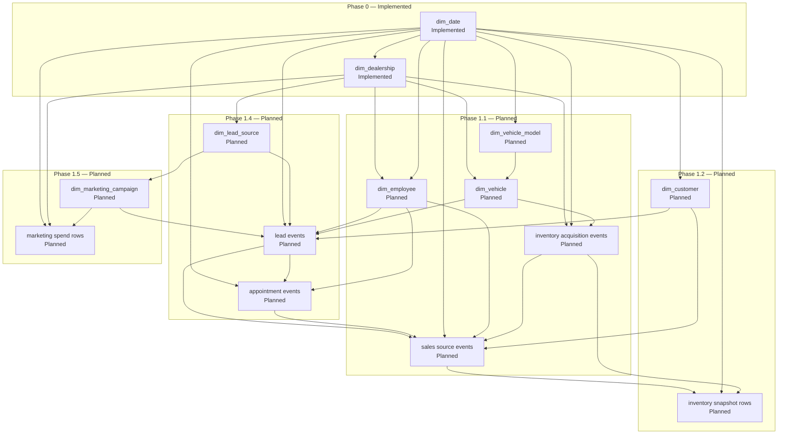

# Data Generation Guide — Automotive Retail Performance Intelligence (ARPI)

**Project:** Automotive Retail Performance Intelligence (ARPI)
**Owner:** Michael Palmer
**Version:** 1.0
**Last reviewed:** 2026-07-28
**Companion documents:** [ARCHITECTURE.md](ARCHITECTURE.md) · [DATA_DICTIONARY.md](DATA_DICTIONARY.md) · [KPI_CATALOG.md](KPI_CATALOG.md) · [PRIVACY_AND_ETHICS.md](PRIVACY_AND_ETHICS.md) · [LIMITATIONS.md](LIMITATIONS.md)

---

## 1. Purpose and scope

Every operational record in ARPI is **synthetic**. There is no real dealership data anywhere in this
repository, and there never will be. `docs/research.md` §5.1 establishes why this is not a compromise but a
necessity: no public dataset contains an integrated dealership record covering CRM leads, appointments,
salespeople, inventory history, deal-level gross, F&I products, marketing spend, service retention, and
customer lifecycle together.

> *"Synthetic data is not merely acceptable. It is necessary."* — `docs/research.md` §5.1

This document specifies **how** that synthetic data is produced: the seeding contract, the profiles, the
generation order, the identifier schemes, the distributions and relationships the data must exhibit, the
patterns it must avoid, the validation that gates it, and the reproducibility guarantees a reviewer can
verify for themselves.

### 1.1 Implementation status of this document

| Generator | Status |
|---|---|
| Calendar date | **Implemented** |
| Dealership | **Implemented** |
| Everything else | Planned or Deferred — see section 12 |

Sections describing employee, vehicle, inventory, sale, lead, appointment, and marketing generation
describe a **specification**, not existing code. Each such section is labelled.

---

## 2. Generation principles

From [ARCHITECTURE.md §15.1](ARCHITECTURE.md), the generator must:

1. Use a fixed random seed for reproducibility.
2. Support configurable record counts.
3. Support development, test, and portfolio data profiles.
4. Encode correlations without creating deterministic relationships.
5. Produce both normal records and controlled edge cases.
6. Generate source files separately from warehouse outputs.
7. Log assumptions and generated distributions.

Two further principles are ARPI-specific and equally binding:

8. **Statistically plausible, unmistakably fictional.** Data must behave like dealership data so that the
   analysis is meaningful, while every record is transparently invented — see the `source_system` marker
   and the synthetic-notice requirements in section 10.
9. **No personally identifiable information is generatable.** Not "not generated by default" —
   *not generatable*. See section 7.

---

## 3. Deterministic seeding contract

### 3.1 The guarantee

**Same seed + same profile + same code ⇒ byte-identical output.**

This is the strongest reproducibility property ARPI offers, and it is deliberately stronger than
"statistically equivalent". A reviewer can regenerate the dataset on their own machine and compare SHA-256
digests against the ones committed in `data/sample/generation_manifest.json`. If the digests match, they
have the exact bytes the author had.

### 3.2 Randomness source

The generator uses the Python standard library's `random.Random` with an explicit seed.

**It does not use `numpy` for randomness, and it does not use the module-level `random` functions.**

| Rule | Reason |
|---|---|
| Explicit `random.Random(seed)` instances only | Module-level `random.*` calls share one hidden global state. Any library, test, or import that touches it perturbs every downstream draw. Explicit instances make the state local and inspectable. |
| No `numpy` random generators | The project's runtime dependency set does not include `numpy` as a direct dependency, and NumPy's bit-generator stream guarantees are versioned separately from Python's. Standard-library `random` gives one fewer moving part in the reproducibility chain. |
| No `faker` or similar | Excluded from the dependency list. Faker's output changes between versions and its locale data is a moving target — both fatal to byte-level reproducibility. It also exists primarily to generate names and addresses, which ARPI prohibits. |
| No wall-clock, no process ID, no environment entropy anywhere in a generated value | Any of these breaks determinism silently. |

### 3.3 Per-entity sub-seed derivation — the contract

A single shared `Random` instance across all entities would be fragile: adding a new entity, or reordering
generation, would change every subsequent draw and rewrite the entire dataset. ARPI therefore derives a
**stable sub-seed per entity** from the root seed.

**The contract is:**

> **Each entity's random stream is derived deterministically from `(root_seed, entity_name)` alone.**
> Adding, removing, or reordering entities does not change any other entity's output.

Properties that follow from that contract, all of which are binding:

| Property | Consequence |
|---|---|
| The derivation depends only on the root seed and a **stable entity name string** | Renaming an entity changes its stream. Entity names are therefore part of the reproducibility contract and are not renamed casually. |
| Each entity gets its **own** `random.Random` instance | Entities never share mutable random state. |
| Sub-seed derivation is **order-independent** | Generating dealerships before dates, or in parallel, yields identical output. |
| The derivation is a **pure function**, using a stable hash (SHA-256 of the entity name combined with the root seed), never Python's built-in `hash()` | `hash()` for `str` is randomized per process by PYTHONHASHSEED and would silently destroy determinism. |
| Adding entity *N+1* does not perturb entities *1..N* | New domains can be added in Phase 1 without invalidating the committed sample data or the digests already published for existing entities. |

**Where this lives.** The implementation belongs in `src/arpi/generation/` (owned by the Python
workstream). This document specifies the contract; the code satisfies it, and
`tests/data_quality/` asserts it.

### 3.4 What determinism does *not* mean

Determinism is a property of the *pipeline*, not of the *values*. The data is still random — it simply
draws from a reproducible stream. Two consequences worth stating plainly:

- Changing the seed produces a **completely different, equally valid** dataset. Findings that survive only
  one seed are artefacts, not findings.
- Determinism does **not** make the data realistic. See [LIMITATIONS.md](LIMITATIONS.md) on the
  determinism-versus-realism trade-off.

---

## 4. Profiles

Three profiles exist, defined in `config/development.yaml`, `config/test.yaml`, and
`config/portfolio.yaml`. All three files carry an identical key structure; only the values below differ.

### 4.1 Profile matrix (authoritative)

| Key | `development` | `test` | `portfolio` |
|---|---|---|---|
| `profile` | `development` | `test` | `portfolio` |
| **`random_seed`** | **`20250701`** | **`424242`** | **`20240101`** |
| **`reporting.start_date`** | **`2025-07-01`** | **`2025-01-01`** | **`2024-01-01`** |
| **`reporting.end_date`** | **`2025-12-31`** | **`2025-02-28`** | **`2025-12-31`** |
| Window length | 184 days (6 months) | 59 days (2 months) | 730 days (24 months) |
| `generation.store_count` | `3` | `3` | `3` |
| `generation.scale_mode` | `development` | `test` | `portfolio` |
| `generation.write_sample_outputs` | `true` | `false` | `false` |
| `generation.sample_row_limit` | `400` | `400` | `400` |
| `logging.level` | `INFO` | `WARNING` | `INFO` |

Every other key is identical across the three profiles.

### 4.2 Profile purposes

| Profile | Purpose | Notes |
|---|---|---|
| `development` | Fast local iteration. [ARCHITECTURE.md §15.2](ARCHITECTURE.md) sizes this at roughly 5 percent of final volume. | The **only** profile that writes committed sample outputs (`write_sample_outputs: true`). |
| `test` | Automated validation. Small, controlled scenarios. | Shortest window (59 days) so the full test suite stays fast. Deliberately spans a **month boundary and a leap-year-adjacent February** so month-end, quarter, and ISO-week logic are exercised. Writes no sample outputs. |
| `portfolio` | Final public demonstration at full target volume. | 24 consecutive months, matching [ARCHITECTURE.md §8.4](ARCHITECTURE.md). **Never generated in CI** — see section 11.3. |

### 4.3 Store count

`generation.store_count` is `3` in every profile. The fictional group has exactly three stores
([DATA_DICTIONARY.md §7.2](DATA_DICTIONARY.md)).

> **The generator must fail if `generation.store_count` does not equal the number of defined stores.**
> This is asserted by `DQ-DLR-003`. A silent mismatch would produce a dataset whose store dimension and
> transaction volumes disagree, which is far worse than a loud failure.

### 4.4 Scale settings (Planned)

`generation.scale_mode` selects the record-count targets for the transactional entities that Phase 1 will
add. The two Implemented generators are **scale-independent**: `dim_date` row count is determined entirely
by the reporting window, and `dim_dealership` is fixed at three rows in every profile.

Portfolio-scale targets come from [ARCHITECTURE.md §8.5](ARCHITECTURE.md) and are corroborated by
`docs/research.md` §5.7. Development scale is approximately 5 percent of portfolio scale, per
[ARCHITECTURE.md §15.2](ARCHITECTURE.md).

| Domain | `portfolio` target | Status |
|---|---:|---|
| Dealerships | 3 | **Implemented** (fixed, all profiles) |
| Calendar dates | Window length | **Implemented** (derived, all profiles) |
| Employees | 35 to 50 | Planned (Phase 1.1) |
| Customers | 15,000 to 30,000 | Planned (Phase 1.2) |
| Vehicles | 8,000 to 15,000 | Planned (Phase 1.1) |
| Retail and wholesale sales | 6,000 to 10,000 | Planned (Phase 1.1 source events, Phase 1.2 fact) |
| Leads | 40,000 to 80,000 | Planned (Phase 1.4) |
| Appointments | 10,000 to 25,000 | Planned (Phase 1.4) |
| Inventory snapshots | 500,000 to 1,500,000 | Planned (Phase 1.1 source events, Phase 1.2 fact) |
| Marketing spend records | 500 to 2,000 | Planned (Phase 1.5) |
| Lead activities | 150,000 to 400,000 | Deferred |
| Price-history events | 20,000 to 75,000 | Deferred |
| F&I product sales | 10,000 to 30,000 | Deferred |
| Service visits | 60,000 to 150,000 | Deferred |

These are **volume targets for a fictional business**. They are not claims about real dealership volumes.

---

## 5. Generation order and dependency graph

### 5.1 Ordering rule

Generation follows a topological order over the dependency graph: an entity is generated only after every
entity it references. Because sub-seeds are derived per entity (section 3.3), **the order affects only
referential validity, never the random values themselves**.

### 5.2 Dependency graph



**Reading the graph:** `dim_date` and `dim_dealership` are the roots and are the only Implemented nodes.
The cycle-looking edges between leads, appointments, and sales are a **generation-order** artefact rather
than a data cycle: leads are generated first with outcome flags, appointments are generated from converted
leads, and sale events are then created for appointments and leads that reached a sale — so the source data
is produced in one pass with outcomes decided top-down.

### 5.3 Ordered generation sequence

| # | Step | Depends on | Status |
|---:|---|---|---|
| 1 | Calendar dates for the reporting window | Configuration only | **Implemented** |
| 2 | Dealership reference data | Configuration only | **Implemented** |
| 3 | Vehicle model catalogue | — | Planned (Phase 1.1) |
| 4 | Employees | Dealerships, dates | Planned (Phase 1.1) |
| 5 | Physical vehicles | Vehicle models, dealerships | Planned (Phase 1.1) |
| 6 | Inventory acquisition events | Vehicles, dealerships, dates | Planned (Phase 1.1) |
| 7 | Customers | Dates | Planned (Phase 1.2) |
| 8 | Lead sources | Dealerships | Planned (Phase 1.4) |
| 9 | Marketing campaigns | Lead sources, dates | Planned (Phase 1.5) |
| 10 | Leads | Sources, campaigns, customers, vehicles, employees, dates | Planned (Phase 1.4) |
| 11 | Appointments | Leads, employees, dates | Planned (Phase 1.4) |
| 12 | Sale events | Acquisitions, leads, appointments, customers, employees, dates | Planned (Phase 1.1 source, Phase 1.2 fact) |
| 13 | Daily inventory snapshots | Acquisitions, sale events, dates | Planned (Phase 1.1 source, Phase 1.2 fact) |
| 14 | Marketing spend | Campaigns, dealerships, dates | Planned (Phase 1.5) |

---

## 6. Date ranges and calendar semantics

The generated calendar spans `reporting.start_date` to `reporting.end_date` **inclusive**, with **no gaps**
(`DQ-DATE-002`) and exactly one row per date (`DQ-DATE-001`).

Holiday computation is arithmetic, deterministic, and uses **no external holiday library** — a third-party
package could change its rule set between versions and silently break byte reproducibility. The full
twelve-holiday rule table and the closure semantics are in
[DATA_DICTIONARY.md §6.2](DATA_DICTIONARY.md).

Two calendar facts that materially affect generated volumes:

- **`is_selling_day = NOT is_closure_holiday`.** Exactly five holidays close the showroom: New Year's Day,
  Easter Sunday, Independence Day, Thanksgiving Day, and Christmas Day. The other seven recognized
  holidays are trading days.
- **Weekends are selling days.** **New Hampshire permits Sunday vehicle sales**, so Sundays in this model
  are ordinary trading days, and the transactional generators must place activity on them. This is a
  deliberate market-specific modelling choice. A reviewer adapting ARPI to a state with Sunday blue laws
  must change the rule rather than reinterpret the flag.

`DQ-DATE-005` asserts the selling-day ratio falls between `validation.min_selling_day_ratio` (0.80) and
`validation.max_selling_day_ratio` (1.00). That is a sanity bound on the holiday arithmetic, **not** a
business benchmark.

---

## 7. No personally identifiable information

### 7.1 The rule

**ARPI does not generate personally identifiable information, and no configuration setting can make it do
so.** There is no flag, no profile, and no environment variable that turns PII generation on, because no
such code path exists.

Every person in the dataset is a fabrication represented by a synthetic key, a role, and a small number of
banded attributes. [ARCHITECTURE.md §11.1 rule 8](ARCHITECTURE.md) states it directly: *customer PII must
not be generated or stored*.

### 7.2 Prohibited field register

None of the following may be generated, stored, loaded, committed, logged, or screenshotted — in any
entity, in any profile, in any layer.

| Prohibited field | Source of prohibition |
|---|---|
| Real or synthetic **customer names** | [ARCHITECTURE.md §11.2](ARCHITECTURE.md); `docs/research.md` §10.2 |
| **Street addresses** | [ARCHITECTURE.md §11.2](ARCHITECTURE.md); `docs/research.md` §10.2 |
| **Email addresses** | [ARCHITECTURE.md §11.2](ARCHITECTURE.md); `docs/research.md` §10.2 |
| **Phone numbers** | [ARCHITECTURE.md §11.2](ARCHITECTURE.md); `docs/research.md` §10.2 |
| **Full birth dates** | [ARCHITECTURE.md §11.2](ARCHITECTURE.md); `docs/research.md` §10.2 |
| **Social Security numbers** | [ARCHITECTURE.md §11.2](ARCHITECTURE.md); `docs/research.md` §4.9, §10.2 |
| **Driver's-license numbers** | [ARCHITECTURE.md §11.2](ARCHITECTURE.md); `docs/research.md` §10.2 |
| **Bank or card account information** | [ARCHITECTURE.md §11.2](ARCHITECTURE.md); `docs/research.md` §4.9, §10.2 |
| **Real VINs** | [ARCHITECTURE.md §16.2](ARCHITECTURE.md); `docs/research.md` §10.3 |
| **Credit scores** and credit-application details | `docs/research.md` §4.9, §10.2 |
| **Real employee compensation** | `docs/research.md` §10.2 |
| **Insurance information**, actual deal jackets, real lender decision data | `docs/research.md` §10.2 |
| **Communication content** — message bodies, call recordings, transcripts, notes | [ARCHITECTURE.md §22.4](ARCHITECTURE.md); `docs/research.md` §10.4 |
| **Authentication secrets and database passwords** | `docs/research.md` §10.2; [PRIVACY_AND_ETHICS.md](PRIVACY_AND_ETHICS.md) |
| **Protected characteristics** — race, ethnicity, religion, national origin, sex, gender identity, sexual orientation, disability, marital status, familial status | [ARCHITECTURE.md §23](ARCHITECTURE.md) |

Also prohibited by ARPI decision, beyond the architecture's minimum: **synthetic employee names**. See
[DATA_DICTIONARY.md §8.1](DATA_DICTIONARY.md) — [ARCHITECTURE.md §22.4](ARCHITECTURE.md) permits fictional
names "if names are used at all", and ARPI's answer is that they are not.

### 7.3 What is generated instead — data minimization

| Instead of | ARPI generates |
|---|---|
| Full birth date | `age_band` |
| Street address | `county`, `state_code`, `market_area` |
| Customer name | `customer_id` (`CUS-########`) |
| Employee name | `employee_id` (`EMP-#####`) |
| Precise credit score | Nothing. A broad synthetic tier is permitted only if a future F&I domain requires one ([ARCHITECTURE.md §22.4](ARCHITECTURE.md)), and that domain is Deferred. |
| Communication content | `first_response_seconds` only |
| Real VIN | `synthetic_vin` — structurally VIN-like, fabricated, never decoded from a real vehicle |
| Household composition | `household_key` only, and only where repeat-purchase analysis requires it |

### 7.4 Enforcement

`DQ-DLR-004` inspects the **schema**, not the values. A prohibited column cannot be introduced accidentally
and pass validation just because it happens to be empty. There are two implementations, both schema-level:
the Python check reads the column list of the generated frame before anything is written, and the SQL check
in `sql/08_validation/02_dim_dealership_checks.sql` reads the PostgreSQL catalogue for
`warehouse.dim_dealership`. **Neither inspects `raw.dealership_load`** — the raw landing table carries
whatever columns the CSV carried, and it is the generated frame and the warehouse dimension that the policy
binds. Section 12 of [PRIVACY_AND_ETHICS.md](PRIVACY_AND_ETHICS.md) records the full
policy-to-control mapping and its honest implementation status.

---

## 8. Synthetic identifier schemes

| Scheme | Entity | Format | Example | Status |
|---|---|---|---|---|
| `GSA-###` | Dealership store | `GSA-` + three digits, zero-padded | `GSA-001` | **Implemented** |
| `EMP-#####` | Employee | `EMP-` + five digits, zero-padded | `EMP-00042` | **Planned** (Phase 1.1) — reserved |
| `VEH-#######` | Physical vehicle | `VEH-` + seven digits, zero-padded | `VEH-0001337` | **Planned** (Phase 1.1) — reserved |
| `CUS-########` | Customer | `CUS-` + eight digits, zero-padded | `CUS-00012345` | **Planned** (Phase 1.2) — reserved |
| `LEAD-#########` | Lead | `LEAD-` + nine digits, zero-padded | `LEAD-000004711` | **Planned** (Phase 1.4) — reserved |

Rules that apply to every scheme:

- **Prefixes are reserved now** so that a future generator cannot collide with an existing one, and so that
  any identifier in a screenshot or query result is instantly recognizable as synthetic.
- **Digit widths are chosen to exceed the portfolio-scale volume of the entity** ([ARCHITECTURE.md
  §8.5](ARCHITECTURE.md)), so identifiers never need re-padding — which would change every byte of the
  output.
- Identifiers are **assigned by deterministic sequence**, never randomly, so they are stable across runs.
- **`GSA` stands for Granite Auto Group. The fictional dealer group is never renamed**, so the prefix
  is permanently stable.
- The **synthetic VIN** is a separate scheme: a 17-character, structurally VIN-like, fabricated string. It
  deliberately does **not** carry the `VEH-` prefix, because it must be shaped like a VIN for modelling
  realism. It is never a real VIN and is never decoded from one. See
  [PRIVACY_AND_ETHICS.md](PRIVACY_AND_ETHICS.md).

---

## 9. Distributions, relationships, and prohibited patterns

### 9.1 Required business relationships — **Planned**

> **Status: Planned.** None of the relationships below are exercised today, because the entities they
> relate do not exist. They are reproduced here as the binding specification for Phase 1.

[ARCHITECTURE.md §15.3](ARCHITECTURE.md) requires the generator to model:

| # | Required relationship | Unlocked by |
|---:|---|---|
| 1 | Older inventory is more likely to receive markdowns | Phase 1.1 / 1.2 |
| 2 | Older inventory generally has lower expected front-end gross | Phase 1.1 / 1.2 |
| 3 | Used-vehicle gross has greater variance than new-vehicle gross | Phase 1.1 / 1.2 |
| 4 | Response time influences contact probability | Phase 1.4 |
| 5 | Contact probability influences appointment probability | Phase 1.4 |
| 6 | Appointment shows have a higher sale probability than non-showroom leads | Phase 1.4 |
| 7 | Lead sources differ in cost, volume, conversion, and gross | Phase 1.4 / 1.5 |
| 8 | Employees differ in volume, closing rate, gross retention, and CRM discipline | Phase 1.1 / 1.4 |
| 9 | Stores differ in traffic, inventory mix, and customer profiles | Phase 1.1 / 1.2 |
| 10 | Seasonality affects lead volume, vehicle sales, and service visits | Phase 1.1 / 1.4 |
| 11 | Some high-volume models have compressed gross because of excessive supply | Phase 1.1 / 1.2 |
| 12 | F&I penetration differs by finance manager and deal type | Deferred |
| 13 | Product eligibility affects available F&I opportunities | Deferred |
| 14 | Chargebacks and cancellations occur after the original sale | Deferred |
| 15 | Service-to-sales opportunities increase with vehicle age, mileage, repair amount, and declined work | Deferred |
| 16 | Marketing campaigns may create leads outside their primary target segment | Phase 1.5 |

**The word that governs all sixteen is *influences*, not *determines*.** [ARCHITECTURE.md
§15.1](ARCHITECTURE.md) requires correlations to be encoded *without creating deterministic relationships*,
and §15.4 lists perfect correlation as a prohibited pattern. A relationship implemented as a hard rule
would make the resulting analysis circular: the dashboard would "discover" exactly the rule the generator
was given.

### 9.2 Controlled distributions — **Planned**

Categorical and numeric attributes are drawn from **explicitly declared, non-uniform** distributions. The
declared distribution for every generated attribute must be logged at generation time
([ARCHITECTURE.md §15.1](ARCHITECTURE.md) rule 7) so that a reviewer can see the assumptions rather than
infer them.

Distribution requirements, all Planned:

- **Seasonality** is applied as a multiplicative monthly factor on lead and sale volume, reflecting
  northern New England seasonal patterns as they present in southern New Hampshire — where all three
  fictional stores sit, `market_region = Southern New Hampshire`
  ([ARCHITECTURE.md §8.3](ARCHITECTURE.md)).
- **Day-of-week effects** are applied to lead arrival and showroom traffic. Weekends are selling days.
- **Gross** is drawn from a skewed distribution with a genuine negative tail — negative-front deals are a
  required measure (`docs/research.md` §4.2), so the generator must produce them.
- **Inventory age** is right-skewed with a genuine aged tail; this is what makes `KPI-INV-003` versus
  `KPI-INV-004` an informative comparison rather than a formality.
- **Response time** is severely right-skewed, with a real population of never-responded leads
  (`first_response_seconds IS NULL`).
- **Store-level differences** are encoded as per-store parameter offsets, not as separate hard-coded
  behaviour.
- **Employee-level differences** are encoded as per-employee latent skill parameters that influence but do
  not determine outcomes.

### 9.3 Prohibited synthetic patterns

From [ARCHITECTURE.md §15.4](ARCHITECTURE.md), the generator must avoid all of the following. Each is
paired with why it damages the analysis.

| Prohibited pattern | Why it matters |
|---|---|
| **Perfect correlations** | Makes every "finding" a restatement of the generator's own rule. The most damaging failure mode in a synthetic portfolio project. |
| **Identical employee performance** | Removes the variance that the entire Employee Performance page exists to analyse, and makes the fairness controls in [ARCHITECTURE.md §23](ARCHITECTURE.md) untestable. |
| **Impossible date sequences** | Sale before acquisition, response before lead creation, show before booking. Invalidates every duration measure. |
| **Flat monthly activity** | Real dealership volume is seasonal. Flat data makes time-intelligence measures and trend visuals meaningless. |
| **Unrealistically clean data** | A dataset with no edge cases cannot demonstrate data-quality capability, which is a core objective of the project. |
| **Unlimited growth** | Monotonic growth over 24 months is not a business, it is a ramp, and it makes period-over-period comparison trivially uninformative. |
| **Uniform pricing** | Destroys discount, markdown, and price-to-market analysis. |
| **Identical vehicle-aging behaviour across models** | Removes the model-level aging signal that `docs/research.md` §4.7 asks the project to surface. |
| **F&I penetration rates above eligible transaction counts** | Arithmetically impossible; a penetration rate over 100% is a validation failure, not an outlier. |
| **Sales without inventory or vehicle records** | Referential impossibility. A finalized sale with an unresolved vehicle reference is a critical pipeline failure ([ARCHITECTURE.md §17.4](ARCHITECTURE.md)). |

### 9.4 Noise and randomness requirements

- **Every modelled relationship carries residual variance.** No generated outcome is a pure function of its
  inputs.
- **Both normal records and controlled edge cases are produced** ([ARCHITECTURE.md
  §15.1](ARCHITECTURE.md) rule 5): negative-front deals, very long-aged units, never-responded leads,
  same-day sales, cash deals with no F&I.
- **Rounding is applied last**, after the arithmetic, and consistently — money to two decimals — so that
  reconciliation tolerances are meaningful rather than absorbing rounding drift.
- **Randomness is bounded.** Draws are clamped to plausible ranges so that a long tail does not produce a
  physically impossible value (a 900-day-old new vehicle, a negative odometer).

### 9.5 Controlled data-quality defects

[ARCHITECTURE.md §15.5](ARCHITECTURE.md) permits a **separate test dataset** to contain intentional
defects: duplicate source IDs, missing foreign-key references, invalid date ordering, negative monetary
amounts where prohibited, impossible appointment sequences, invalid product eligibility, and reconciliation
mismatches.

Two rules govern this:

1. **These defects must never appear in the `portfolio` dataset after validation.**
2. The defect fixtures are a **separate, explicitly-named dataset** used to prove the validation framework
   catches what it claims to catch. They are not produced by the normal profiles.

Status: **Planned.** The Phase 0 validation framework exists; the defect-injection fixtures do not.

---

## 10. Output contract and reproducibility

### 10.1 Generated files

**Raw output — gitignored, not committed:**

```
data/raw/<profile>/dim_date.csv
data/raw/<profile>/dim_dealership.csv
data/raw/<profile>/generation_manifest.json
```

**Sample output — committed to the repository:**

```
data/sample/dim_date.csv
data/sample/dim_dealership.csv
data/sample/generation_manifest.json
data/sample/README.md
```

### 10.2 CSV format

| Property | Value |
|---|---|
| Encoding | UTF-8 |
| Line endings | `\n` (LF), on every platform |
| Header row | Present, column names exactly as in [DATA_DICTIONARY.md](DATA_DICTIONARY.md) |
| Dates | ISO-8601 (`YYYY-MM-DD`) |
| Booleans | Lowercase `true` / `false` |
| Column order | Exactly the order declared in the data dictionary |

Every one of these is a reproducibility requirement, not a style preference. A CRLF line ending or a
locale-formatted date would change the file's bytes and therefore its digest.

### 10.3 `generation_manifest.json`

| Field | Content |
|---|---|
| `project` | `Automotive Retail Performance Intelligence` |
| `short_name` | `ARPI` |
| `arpi_version` | Package version |
| `profile` | Profile name |
| `random_seed` | Root seed in force |
| `reporting_start_date` | Window start |
| `reporting_end_date` | Window end |
| `generated_entities` | List of `{entity, row_count, column_count, content_digest}` |
| `synthetic_data_notice` | Statement that all data is synthetic |
| `generator_module` | Module that produced the output |
| `timestamp_policy` | `"omitted for deterministic output"` |

> **There is no wall-clock timestamp in the manifest.** A generation timestamp would change on every run,
> breaking byte-identical output and producing a spurious diff on every regeneration. The
> `timestamp_policy` field states the omission explicitly so that its absence reads as a decision rather
> than an oversight. Run timing is recorded where it belongs: `audit.pipeline_run.started_at` and
> `completed_at` ([DATA_DICTIONARY.md §19](DATA_DICTIONARY.md)).

### 10.4 `content_digest`

`content_digest` is the **SHA-256 hex digest of the entity's CSV bytes**.

This is the reviewer-facing reproducibility proof. To verify:

1. Regenerate with the same profile and seed.
2. Compute the SHA-256 of the resulting CSV.
3. Compare against the `content_digest` recorded in the committed manifest.

A match proves the pipeline is deterministic on that machine. A mismatch is a genuine defect, not an
environmental quirk — the format rules in 10.2 exist precisely to eliminate environmental variation.

`DQ-GEN-002` asserts that the determinism digest is recorded for every generated entity.

### 10.5 Reproducibility guarantees — summary

| Guarantee | Verified by |
|---|---|
| Same seed + same profile + same code ⇒ byte-identical CSV | `content_digest` comparison; `tests/data_quality/` |
| Adding a new entity does not change existing entities' output | Per-entity sub-seed derivation (section 3.3) |
| Output does not depend on generation order | Order-independent sub-seed derivation |
| Output does not depend on OS, locale, or process | Fixed English name lists, LF endings, ISO dates, no `hash()`, no wall clock |
| Declared schema matches actual output | `DQ-GEN-001` |
| Digest is recorded for every entity | `DQ-GEN-002` |

---

## 11. Data policies

### 11.1 Sample-data policy

- `data/sample/` is **committed**, so that a reviewer can inspect real generated output without running
  anything.
- Sample CSVs are **capped at `generation.sample_row_limit`** (400 rows). The dealership file is exempt: it
  always contains all three stores, because a partial store list would be actively misleading.
- Only the `development` profile writes sample outputs (`write_sample_outputs: true`). `test` and
  `portfolio` do not.
- **`data/sample/README.md` is mandatory** and must state that the data is 100% synthetic and explain how
  to regenerate it.

### 11.2 Raw-data policy

- `data/raw/` is **gitignored**. Full generated datasets are never committed.
- [ARCHITECTURE.md §24.1](ARCHITECTURE.md): raw generated portfolio data may be omitted if repository size
  becomes excessive; a representative sample must be included; **full data must be reproducible through the
  generator**. The seeding contract in section 3 is what makes that promise keepable.
- `data/external/` holds approved public reference data, kept **separate from synthetic dealership data**
  ([ARCHITECTURE.md §16.2](ARCHITECTURE.md)).

### 11.3 Full-data regeneration policy

> **The `portfolio` profile is never generated in CI and never generated by routine tests.**

Reasons:

1. **Time and cost.** At full scale the inventory snapshot alone reaches 500,000 to 1,500,000 rows. Running
   that on every pull request wastes minutes on every commit for no diagnostic benefit.
2. **Nothing is committed from it.** `portfolio` writes no sample outputs, so a CI run of it produces
   nothing the repository keeps.
3. **The `test` profile is designed for this job.** Its 59-day window exercises month-end, quarter, and ISO
   week-boundary logic in seconds.

Full regeneration is therefore an **explicit local command**, run deliberately when the portfolio dataset
is being refreshed.

---

## 12. Currently implemented generators

| Generator | Entity | Output file | Status | Notes |
|---|---|---|---|---|
| Calendar date | `warehouse.dim_date` | `dim_date.csv` | **Implemented** | 26 columns; deterministic holiday arithmetic; no external library. |
| Dealership | `warehouse.dim_dealership` | `dim_dealership.csv` | **Implemented** | 3 rows, all profiles; SCD2 columns and `attribute_hash` populated. |
| Vehicle model | `warehouse.dim_vehicle_model` | — | Planned | Phase 1.1 |
| Vehicle | `warehouse.dim_vehicle` | — | Planned | Phase 1.1 |
| Employee | `warehouse.dim_employee` | — | Planned | Phase 1.1 |
| Inventory acquisition events | source for inventory facts | — | Planned | Phase 1.1 |
| Sales source events | source for `fact_vehicle_sale` | — | Planned | Phase 1.1 |
| Customer | `warehouse.dim_customer` | — | Planned | Phase 1.2 |
| Inventory snapshot | `warehouse.fact_vehicle_inventory_snapshot` | — | Planned | Phase 1.2 |
| Lead source | `warehouse.dim_lead_source` | — | Planned | Phase 1.4 |
| Lead | `warehouse.fact_lead` | — | Planned | Phase 1.4 |
| Appointment | `warehouse.fact_appointment` | — | Planned | Phase 1.4 |
| Marketing campaign | `warehouse.dim_marketing_campaign` | — | Planned | Phase 1.5 |
| Marketing spend | `warehouse.fact_marketing_spend` | — | Planned | Phase 1.5 |
| Lead activity | `warehouse.fact_lead_activity` | — | Deferred | |
| Price history | `warehouse.fact_inventory_price_history` | — | Deferred | |
| F&I product sale | `warehouse.fact_finance_product_sale` | — | Deferred | |
| Service visit | `warehouse.fact_service_visit` | — | Deferred | |
| Sales target | `warehouse.fact_sales_target` | — | Deferred | |

**Two of nineteen generators exist.** Both produce dimensions. **No generator produces a fact table.**

---

## 13. Validation expectations

Generated output is not trusted until it is validated. Results are written to
`audit.validation_result` ([DATA_DICTIONARY.md §21](DATA_DICTIONARY.md)) and surfaced through
`reporting.vw_data_quality_summary`.

| Check ID | What it asserts | Target | Severity |
|---|---|---|---|
| `DQ-DATE-001` | `date_key` is unique — no duplicate calendar rows | `dim_date` | critical |
| `DQ-DATE-002` | The date range is contiguous — no missing days between the minimum and maximum date | `dim_date` | critical |
| `DQ-DATE-003` | `date_key` equals `full_date` formatted `YYYYMMDD` for every row | `dim_date` | critical |
| `DQ-DATE-004` | No required field is NULL (`holiday_name` is the only nullable column) | `dim_date` | critical |
| `DQ-DATE-005` | The selling-day ratio falls within `[min_selling_day_ratio, max_selling_day_ratio]` = `[0.80, 1.00]` — a sanity bound on the holiday arithmetic, **not** a business benchmark | `dim_date` | warning |
| `DQ-DLR-001` | `dealership_key` is unique | `dim_dealership` | critical |
| `DQ-DLR-002` | `dealership_id` is unique among rows where `is_current = true` | `dim_dealership` | critical |
| `DQ-DLR-003` | The distinct current store count equals `generation.store_count` | `dim_dealership` | critical |
| `DQ-DLR-004` | No prohibited PII column is present — inspects the **schema**, so an empty prohibited column still fails | `dim_dealership` | critical |
| `DQ-DLR-005` | `franchise_brand` is non-NULL for `Franchise New and Used` stores and NULL for `Independent Used` | `dim_dealership` | critical |
| `DQ-GEN-001` | The declared schema matches the actual output schema — column names, order, and count | all generated entities | critical |
| `DQ-GEN-002` | The determinism digest (`content_digest`) is computed and recorded for every entity | all generated entities | critical |

Two further check families, `DQ-REF-001` … `005` and `DQ-AUD-001` … `005`, are implemented in the SQL
validation layer only. They assert grain uniqueness, constraint presence, SCD Type 2 timeline integrity, and
audit-schema referential integrity — properties that exist in the database rather than in generator output,
so they gate the **load** rather than the **generation**. See
[DATA_DICTIONARY.md §21.2](DATA_DICTIONARY.md).

**Failure behaviour.** A `critical` failure fails the run: `audit.pipeline_run.status` becomes `failed` and
`critical_failure_count` is non-zero. `validation.max_rejected_record_ratio` is `0.0` for the Phase 0 slice,
so **any rejected record at all fails the run** — the source data is generated by ARPI itself, so there is
no legitimate reason for it to be malformed.

---

## 14. Approved public data enrichment

### 14.1 Current state: **OFF**

```yaml
features:
  enable_public_vehicle_enrichment: false
  enable_external_market_context: false
```

Both feature flags are `false` in every profile. **No external data is fetched, cached, or committed
today.** ARPI performs no network access during generation.

### 14.2 NHTSA vPIC — the only approved vehicle enrichment source

[ARCHITECTURE.md §16.1](ARCHITECTURE.md) approves the NHTSA Product Information Catalog and Vehicle Listing
API to enrich vehicle attributes: make, model, model year, body class, fuel type, drivetrain, manufacturer.

`docs/research.md` §5.3 is clear about the boundary: **use vPIC to enrich the vehicle dimension, not to
supply the transaction dataset.** vPIC contains no acquisition cost, inventory dates, asking prices, sale
dates, sale prices, gross profit, lead activity, employees, F&I products, marketing costs, or customer
behaviour.

### 14.3 Controls when enrichment is enabled

From [ARCHITECTURE.md §16.2](ARCHITECTURE.md), all binding:

1. Raw public data is stored **separately** from synthetic dealership data — in `data/external/`.
2. **Source and license information must be documented.**
3. **Redistribution rights must be verified before committing raw data.**
4. **Real VINs must not be linked to synthetic customers.**
5. **Any VIN-like identifier published in the repository must be synthetic or masked.**

The permitted pattern is: decode during generation if needed, **store only a masked synthetic identifier in
published data** (`docs/research.md` §10.3).

### 14.4 External market context

[ARCHITECTURE.md §16.3](ARCHITECTURE.md) permits an approved government aggregate dataset for monthly
market context, kept **analytically separate** from dealership transactions because aggregate market data
and dealership-level synthetic data have different grains and different provenance. `docs/research.md` §5.5
suggests a Bureau of Transportation Statistics or Bureau of Economic Analysis series.

**This is a context table, not a benchmark.** Comparing synthetic dealership performance against a real
market series and drawing a conclusion about the synthetic dealership's performance would be a category
error. See [LIMITATIONS.md](LIMITATIONS.md).

### 14.5 Kaggle and similar

`docs/research.md` §5.6: **Kaggle hosting does not automatically establish unrestricted reuse rights.** A
missing or ambiguous license is a **blocker for redistribution**. Before any such dataset is included, the
repository must record the named creator, source URL, license, permitted uses, required attribution,
redistribution restrictions, and whether derived files may be committed.

No Kaggle dataset is used in ARPI today.

### 14.6 Sanitized public inventory reference data — **IN USE**

Unlike everything above, this one is not a plan. Three sanitized inventory
workbooks are committed under `data/reference/inventory/`, and the portfolio
website renders them.

They are the single exception to "every record in this project is synthetic", and
the project states the exception rather than absorbing it. They are vehicle
listing attributes captured from a **public** listing source, de-identified, and
reassigned to the fictional stores of Granite Auto Group. Model, trim, condition,
mileage, advertised price and inventory mix are retained from that source; VINs,
source URLs, source listing keys, street addresses and real dealership identity
are not.

**Why they are not in `data/sample/`.** That directory is reserved for fully
machine-generated output and is the basis of the repository's privacy claim.
Filing observed data there would make that claim untrue by directory listing.
`data/reference/` is a separate class with separate rules, consistent with §14.3
control 1 above.

**How they reach the website.** Not through this Python package. A build-time
TypeScript generator, `portfolio/scripts/generate-inventory-data.ts`, reads the
workbooks and the store dimension in `data/sample/dim_dealership.csv`, drops every
identifying column, derives every displayed figure, and writes three JSON
artefacts under `portfolio/src/generated/`. No workbook is parsed in a browser.
The generator refuses to write an artefact whose output still matches a URL, a
domain, an email address, a telephone number or a VIN-shaped token.

**What a row supports, and what it does not.** A row proves a listing was visible
in the source at a capture date. It does not prove a sale, a delivery, physical
on-ground status or dealer ownership. An advertised price is not a transaction
price, an acquisition cost, an inventory investment, a manufacturer suggested
price or a gross figure. A listing that later disappears has been removed from a
feed, which is not the same as sold. Repeated snapshots could support days
observed online; that must never be labelled days in stock.

Full schema, sanitization controls, coverage limitations per store and the
procedure for adding a snapshot are in
[`data/reference/inventory/README.md`](data/reference/inventory/README.md).

---

## 15. Commands

### 15.1 Generation

The generator is exposed through the `arpi` package's command-line interface, built on the standard
library's `argparse` (no `click`, no `typer`). The authoritative, always-current usage is:

```
.venv/bin/python -m arpi --help
```

Commands:

| Command | Purpose |
|---|---|
| `version` | Print the ARPI version. |
| `check-config` | Print the resolved configuration (password redacted) and probe the database. |
| `generate` | Generate and validate the foundation dimensions, then write CSVs. |
| `run-foundation` | Run the full Phase 0 slice, including the optional PostgreSQL load. |

Common options on `generate` and `run-foundation`: `--profile {development,test,portfolio}`,
`--config-dir`, `--log-level {DEBUG,INFO,WARNING,ERROR,CRITICAL}`, `--output-dir`.
`run-foundation` additionally accepts `--load-database` / `--no-load-database`.

Typical invocations:

```
# Development profile — writes data/raw/development/ and refreshes data/sample/
.venv/bin/python -m arpi generate --profile development

# Test profile — small window, no sample outputs
.venv/bin/python -m arpi generate --profile test

# Portfolio profile — full 24-month dataset. Explicit local command only; never run in CI.
.venv/bin/python -m arpi generate --profile portfolio

# Full Phase 0 slice with the PostgreSQL load
.venv/bin/python -m arpi run-foundation --profile development --load-database

# Inspect the resolved configuration without generating anything
.venv/bin/python -m arpi check-config --profile development
```

Configuration precedence is **environment variable > YAML profile file > model default**, using the `ARPI_`
prefix and `__` as the nested delimiter:

```
ARPI_PROFILE=test .venv/bin/python -m arpi generate
ARPI_RANDOM_SEED=999 .venv/bin/python -m arpi generate --profile development
ARPI_LOGGING__LEVEL=DEBUG .venv/bin/python -m arpi generate --profile development
```

> **Password rule.** `database.password` never appears in YAML. It is read only from
> `ARPI_DATABASE__PASSWORD` (with `PGPASSWORD` as a fallback), and configuration `__repr__`, `__str__`, and
> logging redact it as `***REDACTED***`. See [PRIVACY_AND_ETHICS.md](PRIVACY_AND_ETHICS.md).

### 15.2 Canonical quality commands

These are the exact commands the CI pipeline runs, and the exact commands to run locally before
committing:

```
ruff format --check .
ruff check .
mypy src tests
pytest -m "not integration" --cov=arpi --cov-report=term-missing --cov-report=xml
pytest -m "integration"        # only in the optional postgres job
python scripts/check_naming.py
python scripts/check_docs_links.py
python scripts/check_secrets.py
```

Pytest markers: `integration` (requires PostgreSQL), `data_quality` (runs generators, no database),
`slow`. Coverage is measured on `src/arpi` with `fail_under = 85`.

---

## 16. Change control

- Changing a **profile seed** or a **reporting window** invalidates every committed `content_digest` and
  requires regenerating and re-committing `data/sample/`. Do it deliberately, in one change.
- Changing the **sub-seed derivation** changes every entity's output. It is a breaking change and requires
  an ADR ([ARCHITECTURE.md §35](ARCHITECTURE.md)).
- Changing the **synthetic VIN policy** explicitly requires an ADR ([ARCHITECTURE.md §35](ARCHITECTURE.md)).
- Adding a **new generated entity** must not change any existing entity's digest. If it does, the
  per-entity seeding contract has been violated.
- Adding a **new prohibited-field exception** is not permitted. The register in section 7.2 only grows.
