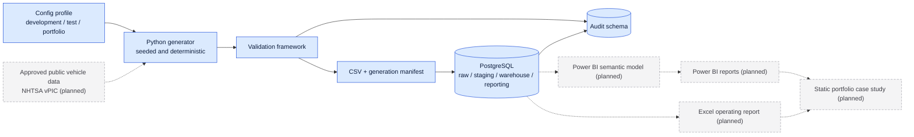

# Automotive Retail Performance Intelligence (ARPI)

**A dealership management intelligence platform.** ARPI gives dealership leadership one operating view of the business — connecting sales, gross, inventory, F&I, marketing, employee activity and accounting — so managers can see what is happening, understand the operating context, drill into the transactions behind it, and know where deeper investigation is required.

It runs on a fictional three-store dealer group and entirely synthetic data. Every figure it produces is reproducible from this repository alone.


> **Release status.** ARPI is **not yet publicly deployed.** A production release is approved and the
> release tooling is built and tested; the only deployed environment is a protected preview that
> correctly answers `Disallow: /` to every crawler, so there is no public origin to link to here yet.
> [§ Deployment](#deployment) is the one place that state is written down, and
> [`deployment/evidence/portfolio_deployment.json`](deployment/evidence/portfolio_deployment.json) is
> the evidence behind it.

### What a manager can do with it

| Question | Where it is answered |
|---|---|
| How is the group performing, and which store is different? | The Executive Command Center at `/` — retail units, gross, gross per retail unit, pace against plan, stock on the lot, the demand funnel and whether the books agree, on one screen |
| Why did gross change? | Sales & Gross — a documented decomposition of what moved between two periods, with the new/used mix, the store contribution and the discount distribution beside it |
| Which transactions sit behind the aggregate? | Deal Explorer, then one Deal Jacket: sale price, front gross, back gross, total gross, trade, F&I itemization and days in stock for one delivery |
| How much capital is standing on the lot, and how old is it? | Inventory — five governed age buckets, investment by band, price position against a synthetic estimate, and drill-through to one unit |
| What did the finance office produce, and what did the store keep? | F&I — reserve against product gross, penetration on each category's own eligible denominator, and adjustments on their own posting dates |
| Where does the funnel lose volume? | Leads & Marketing — the lead-created cohort funnel, response-time distribution with the unanswered leads beside it, and spend against attributed outcomes |
| What was credited to each person, and is the sample big enough to say? | Employees — role-aware activity with governed denominators, withheld below a minimum sample. No ranking, no score |
| Does the stock schedule agree with the general ledger? | Accounting — the signed variance, four comparison states, missing-side positions preserved as missing |

**What it is not:** a dealer management system, a CRM, an accounting suite, a general ledger, a recommendation engine, or artificial intelligence of any kind. What it cannot yet answer — most of it the CFO's questions — is stated in full in [`docs/product/PRODUCT_GAPS.md`](docs/product/PRODUCT_GAPS.md); what it would become with authorized access to real dealership systems is [`docs/product/PRODUCT_VISION.md`](docs/product/PRODUCT_VISION.md).

### How it is engineered

Seeded synthetic data generated in Python, validated in memory, loaded into a PostgreSQL dimensional warehouse, published through reporting views that own every KPI definition, reconciled on every run, exported as content-addressed files, and read by a Next.js operating application as static data at build time. A source-controlled Power BI semantic model sits above the reporting schema, stored as TMDL. The detail is below, and the site's own [Technical destination](portfolio/) renders it interactively.


**Status (plain text):** Python 3.11 or newer. PostgreSQL 16. MIT licensed.

* **Lifecycle Phase 1–4 — complete.** All eight MVP dimensions, all five MVP facts, twenty-eight reporting views, and all 29 KPIs in [`KPI_CATALOG.md`](KPI_CATALOG.md) are implemented, computable and tested. Gate 1 is **OPEN** — [`docs/requirements/GATE_1_READINESS.md`](docs/requirements/GATE_1_READINESS.md).
* **Lifecycle Phase 5 — semantic model built, NOT complete.** A source-controlled Power BI Project exists at [`powerbi/ARPI_Performance_Intelligence/`](powerbi/ARPI_Performance_Intelligence), stored as TMDL: twenty-six tables, forty-two relationships, and all twenty-nine governed KPI measures. **Static validation passes** (9,452 assertions in `scripts/check_powerbi_model.py`). **Real-engine validation is still pending** — no Microsoft semantic-model engine has yet loaded this model, refreshed it, or returned a single number from it, so its DAX is unproven. Phase 5 is not complete until that happens.
* **No Power BI report page or visual exists**, and no analytical finding has been drawn from the
  semantic model. Both are later phases. This is a statement about the **Power BI** deliverable only —
  the `.Report` folder is a PBIR shell with zero pages, zero visuals and zero bookmarks. The **web
  operating application described in the next bullet is built**, and reads governed exports rather than
  the semantic model.
* **Web operating application — built, under [`portfolio/`](portfolio/).** A Next.js application in two
  parts. An **operating console**: `/` (Executive Command Center) plus `/dashboard/sales-gross`,
  `/dashboard/deals` and the Deal Jacket at `/dashboard/deals/[saleId]`, `/dashboard/inventory`,
  `/dashboard/fi`, `/dashboard/leads-marketing`, `/dashboard/employees`, `/dashboard/accounting` and the
  **Management Action Center** at `/dashboard/actions`, behind a navigation rail with URL-addressable
  filters. And a **reference destination**: `/technical` with eight server-addressable views, `/about`,
  `/inventory`, three store pages and a gated `/case-study`. It reads **committed, governed exports** —
  **no database connection at all**, no API route, no charting library, and it computes no KPI of its
  own. It contains **no Power BI report page, visual or bookmark**, because none exists; real-engine
  validation of the semantic model is **still pending on both accepted paths**. **Gate 2 is CLOSED**, all
  three of its conditions unmet, so the **public analytical case study remains gated** — the site ships a
  **locked** case-study shell, not the case study. **Every operating figure it displays is synthetic**,
  and Granite Auto Group is fictional. **A reachable application is not a deployed analytical
  platform:** its being up says nothing about PostgreSQL, which remains **declared and unprovisioned**,
  or about the semantic model, which no engine has run. Deployment state, including which environment is
  public and what has actually been verified from outside, is
  [§ Deployment](#deployment) — recorded in
  [`deployment/evidence/portfolio_deployment.json`](deployment/evidence/portfolio_deployment.json),
  where every field this repository's own automation could not obtain reads `UNVERIFIED` rather than a
  guess. Governed by [ADR-0009](docs/architecture-decisions/ADR-0009-portfolio-ui-foundation-before-gate-2.md)
  and [ADR-0015](docs/architecture-decisions/ADR-0015-product-first-operating-experience.md).

See [Current implementation status](#current-implementation-status).

---

> ### ⚠️ This repository contains no real data
>
> **Every record in this project is synthetic.** There is no real dealership, customer, employee, vehicle-owner, lender, or lending data anywhere in this repository, and none will ever be added.
>
> **Granite Auto Group is fictional.** The group, its three stores, its staff, and its customers do not exist. They were invented to give the data model a coherent business context.
>
> All figures are generated from documented rules and a fixed random seed. Nothing here should be read as, compared against, or cited as the performance of any real automotive retailer. See [PRIVACY_AND_ETHICS.md](PRIVACY_AND_ETHICS.md) and [LIMITATIONS.md](LIMITATIONS.md).

---

## Contents

- [Purpose](#purpose)
- [The business problem](#the-business-problem)
- [Who this is for](#who-this-is-for)
- [Core analytical domains](#core-analytical-domains)
- [Technology stack](#technology-stack)
- [Architecture](#architecture)
- [Repository structure](#repository-structure)
- [Current implementation status](#current-implementation-status)
- [Roadmap](#roadmap)
- [Local development](#local-development)
- [Deployment](#deployment)
- [Testing and quality](#testing-and-quality)
- [Synthetic data and privacy](#synthetic-data-and-privacy)
- [Documentation](#documentation)
- [License](#license)
- [Author](#author)

---

## Purpose

ARPI is a portfolio project built to demonstrate, on real artifacts rather than assertions, the work an analyst actually does: turning operating questions into measurable definitions, modelling the data those definitions need, generating it reproducibly, proving it is correct, and reporting it in a form a manager can act on.

It is deliberately not a production system. It is not a DMS, a CRM, a desking tool, a retail website, or an AI assistant. `ARCHITECTURE.md` §6 lists what is excluded and why, and the scope gates in §28 exist to keep it that way.

The project is opinionated about honesty. Every status label in this repository is literal: if something says **Planned**, it does not exist yet.

---

## The business problem

Dealership data is fragmented across DMS, CRM, inventory, marketing, F&I, and service systems. Each system reports its own version of the truth, on its own schedule, using its own definitions. A general manager asking a straightforward question often cannot get a straightforward answer.

The questions that go unanswered are the expensive ones:

| Question | Why it is hard today |
|---|---|
| Why did sales or gross change this month? | Volume, mix, discounting, and inventory effects live in different systems |
| Which inventory is becoming financially risky? | Age, market position, and markdown history are rarely on one screen |
| Where are leads being lost? | CRM funnel stages do not reconcile to closed deals |
| Does this marketing source generate profitable business? | Spend and attributed gross are never in the same report |
| Which employees produce balanced results? | Rankings ignore lead quality, store traffic, tenure, and mix |
| Which service customers are credible replacement opportunities? | Fixed operations and sales data do not connect |

ARPI answers these from one governed analytical model with consistent KPI definitions and traceable business logic — every number tied to a documented formula, a declared grain, and a validated source. Condensed from [`ARCHITECTURE.md` §4](ARCHITECTURE.md).

---

## Who this is for

| Persona | What they need from the platform |
|---|---|
| **Dealer principal** | Group-level performance, target attainment, and where to direct attention. **Target attainment and selling-day pace are implemented** on the governed web console (`DASH.5`) and answer `SQ-31`; the targets are synthetic operating goals for a fictional group, never benchmarks |
| **General manager** | Store-level variance explanation across sales, gross, inventory, and conversion |
| **General sales manager** | Volume, gross, and closing performance by team, source, and vehicle mix |
| **Used-car manager** | Inventory age, price-to-market position, markdown effectiveness, days supply |
| **Internet / BDC director** | Funnel conversion, response time, appointment show rates by source and rep |
| **Finance director** | F&I penetration, product mix, and the effect of cancellations and chargebacks |
| **Marketing manager** | Cost per lead, cost per sale, and gross return by campaign and channel |
| **Data / BI analyst** | Documented grains, lineage, KPI definitions, and reproducible data quality evidence |

Secondary audiences include regional operations, fixed-operations, and new-car managers. The full persona set is recorded in [`docs/research.md`](docs/research.md) §11.3.

---

## Core analytical domains

| Domain | Central questions |
|---|---|
| **Vehicle sales and gross** | Units, front-end and back-end gross, discounting, new versus used |
| **Inventory health** | Aging, days supply, turn, capital at risk, price-to-market |
| **Lead funnel and BDC** | Contact rate, appointment set and show rates, lead-to-sale conversion, response time |
| **Employee performance** | Balanced volume, conversion, gross, and process compliance — always with context. **Built (`DASH.11`):** `/dashboard/employees`, four role-aware surfaces, every comparative figure withheld below its own governed minimum sample, no ranking and no personnel data |
| **Marketing performance** | Cost per lead, cost per sale, gross return on advertising spend |
| **F&I performance** | Product penetration against **eligible** deals, products per retail unit, finance reserve, cancellations and chargebacks |
| **Customer retention** | Repeat purchase behaviour and cohort return rates |
| **Service-to-sales** | Qualified vehicle-replacement opportunities from the service lane |
| **Data quality** | Validation outcomes, reconciliation status, and pipeline run history |

Definitions, formulas, grains, inclusion and exclusion rules, and known limitations for each KPI live in [KPI_CATALOG.md](KPI_CATALOG.md). No KPI exists in this project as an unexplained dashboard measure.

---

## Technology stack

### In use now

| Technology | Role |
|---|---|
| **Python 3.11+** | Synthetic data generation, validation, orchestration, CLI |
| **pandas** | Tabular shaping and CSV output |
| **pydantic** / **pydantic-settings** | Typed, validated, environment-overridable configuration |
| **PostgreSQL 16** | Raw, staging, warehouse, reporting, and audit schemas (optional for generation) |
| **psycopg 3** | Database driver, installed via the `db` extra |
| **SQL** | Schema definition, dimension loads, reporting views, roles, data-quality checks |
| **pytest** / **pytest-cov** | Unit, data-quality, and integration tests |
| **Ruff** | Linting and formatting — the single tool for both |
| **mypy** | Static type checking of `src` and `tests` |
| **GitHub Actions** | Continuous integration |
| **Markdown** / **Mermaid** | Documentation and source-controlled diagrams |
| **TMDL** | The semantic model's source format — text, diffable, reviewable without a Power BI licence |
| **DAX** | The twenty-nine governed KPI measures |
| **Next.js 16** / **React 19** | The portfolio website under `portfolio/` — App Router, statically rendered, no API route |
| **TypeScript** | Strict-mode types for the website and its build-time manifest generator |
| **Tailwind CSS v4** | The website's design tokens and styling |
| **Motion** | The website's documented motion system |
| **Vitest** | Unit, component, and content-integrity tests for the website |
| **Playwright** / **axe-core** | Accessibility, end-to-end, content-integrity, and design-system tests for the website |

### Planned

| Technology | Role | Phase |
|---|---|---|
| **Microsoft Fabric** / Power BI Service | Real-engine validation of the semantic model, and the eventual publishing target | Now |
| **Excel** | One supporting management operating report | Later |
| **NHTSA vPIC** | Approved public vehicle-attribute enrichment | Phase 1.1 |
| **Supabase** or equivalent managed PostgreSQL 16 | The endpoint a cloud semantic model reads | Now |
| **Power BI Desktop** | An alternative real-engine validation path, for anyone who has Windows | Optional |

Rationale for the non-obvious choices — Ruff over black-plus-isort-plus-flake8, stdlib `argparse` over click or typer, local PostgreSQL over hosted, and the deterministic holiday rule — is recorded in [ADR-0002](docs/architecture-decisions/ADR-0002-phase-0-technology-baseline.md).

---

## Architecture

ARPI is a layered batch pipeline. Synthetic source data is generated deterministically from a seeded configuration profile, validated in memory, written to CSV with a content-digest manifest, and optionally loaded into PostgreSQL, where it passes through `raw` → `staging` → `warehouse` → `reporting`. Every run records its outcome in the `audit` schema.



Solid borders and solid arrows are implemented today. Dashed grey nodes and dashed arrows are planned. A larger version with a full legend is in [`docs/diagrams/01-system-context.md`](docs/diagrams/01-system-context.md); the detailed Phase 0 flow, the dimensional model, and a component map are alongside it in [`docs/diagrams/`](docs/diagrams/).

**Layer responsibilities**

| Schema | Purpose |
|---|---|
| `raw` | Unmodified imported source records, all columns as text, with load lineage |
| `staging` | Typed and deduplicated views over raw, exposing the most recent load batch |
| `warehouse` | Conformed dimensions and facts at explicitly declared grain |
| `reporting` | Stable documented views — the only surface Power BI and Excel may read |
| `audit` | Pipeline runs, row counts, validation results, reconciliations, rejected records |

Full detail is in [ARCHITECTURE.md](ARCHITECTURE.md).

---

## Repository structure

```text
Automotive-Retail-Performance-Intelligence/
├── src/arpi/          Python package: config, logging, generators,
│                      validation, writers, database load, audit, CLI
├── sql/               Ordered, re-runnable build scripts (00_database … 09_migrations)
├── config/            development.yaml, test.yaml, portfolio.yaml,
│                      reference/ (the inventory listing contract)
├── tests/             unit/, data_quality/ (no database) · integration/ (needs PostgreSQL)
├── data/              raw/ (gitignored) · sample/ (committed synthetic) ·
│                      reference/ (committed sanitized public inventory workbooks,
│                      one per store per snapshot) · external/
├── docs/              index.md, research.md, database-setup.md,
│                      architecture-decisions/, diagrams/, requirements/, source-to-target/
├── scripts/           Repository governance checks, Power BI model validators,
│                      SQL baseline generator, Fabric deployment and validation
├── .github/workflows/ Continuous integration
├── notebooks/         Empty — no notebooks exist yet
├── powerbi/           ARPI_Performance_Intelligence/ PBIP project (TMDL semantic model),
│                      model_documentation/, validation/ (SQL baseline and engine evidence)
├── excel/             Empty — the Power BI-reconciled operating report does not exist yet.
│                      The sanitized-listing operating report is exported on demand to
│                      artifacts/inventory/ (gitignored) by the inventory CLI
└── portfolio/         Next.js website: fourteen indexable routes over the documented
                       architecture, data model, KPI definitions, governance and status,
                       plus the Granite Auto Group experience (a group page, three store
                       pages and an inventory explorer) generated from the sanitized
                       workbooks in data/reference/. README.md and docs/ cover the design
                       system, motion, content model, accessibility, performance,
                       deployment and visual review.
                       The case study itself is still not written; its route is a locked shell
```

The annotated tree, with an explicit `[now]` / `[empty]` / `[planned]` marker on every entry, is in [`ARCHITECTURE.md` §24](ARCHITECTURE.md).

---

## Current implementation status

Labels are used strictly. **Implemented** means it exists and runs today.

| Area | Status | Notes |
|---|---|---|
| Typed configuration (`development`, `test`, `portfolio` profiles) | Implemented | pydantic-settings, `ARPI_` environment overrides, password never in YAML |
| Logging | Implemented | Text or JSON, level set per profile, credentials redacted |
| Date dimension generator | Implemented | `warehouse.dim_date`, 26 columns, deterministic holiday and selling-day rules |
| Dealership dimension generator | Implemented | `warehouse.dim_dealership`, SCD Type 2 structure, three fictional stores |
| Twelve further generators | Implemented | Vehicle model, vehicle, employee, customer, lead source, campaign, acquisition, sale, inventory snapshot, lead, appointment, marketing spend |
| Validation framework | Implemented | 114 checks across fourteen `DQ-*` families on a `development` run, with severities, run in memory before any load |
| CSV and manifest writer | Implemented | Deterministic CSV plus `generation_manifest.json` with SHA-256 content digests |
| PostgreSQL load of every dimension and fact | Implemented | Optional; `database.enabled` defaults to `false`. A rerun produces identical warehouse counts. |
| Audit recording | Implemented | Pipeline runs, row counts, validation results, reconciliations, rejected records |
| Command-line interface | Implemented | `arpi version`, `arpi check-config`, `arpi generate`, `arpi run-foundation` |
| SQL: schemas, roles, raw, staging, dimensions, facts, audit, reporting, validation | Implemented | Ordered and re-runnable; `arpi_admin` / `arpi_loader` / `arpi_reporter`, with the reporter provably unable to read any pipeline layer |
| Test suite | Implemented | Unit, data-quality, and integration tests; coverage gate at 85% |
| Continuous integration | Implemented | Lint, format check, types, tests, naming check, documentation-link check |
| Documentation set | Implemented | Architecture, data dictionary, KPI catalog, generation, privacy, limitations, ADRs, diagrams |
| Committed sample dataset | Implemented | Small synthetic extract under `data/sample/` |
| `dim_vehicle_model`, `dim_vehicle`, `dim_employee`, `dim_customer`, `dim_lead_source`, `dim_marketing_campaign` | Implemented | All eight MVP dimensions are built, populated and documented |
| `fact_vehicle_sale`, `fact_vehicle_inventory_snapshot`, `fact_lead`, `fact_appointment`, `fact_marketing_spend` | Implemented | All five MVP facts, each with its grain enforced by a UNIQUE constraint and tested |
| `fact_lead_activity`, `fact_inventory_price_history` | Deferred | Beyond the MVP — [`DATA_DICTIONARY.md` §27](DATA_DICTIONARY.md) |
| `dim_sale_type`, `dim_inventory_source`, `dim_geography` | Deferred | Beyond the MVP — [`DATA_DICTIONARY.md` §27](DATA_DICTIONARY.md) |
| MVP reporting layer | Implemented | Twenty-eight views: eight dimension, five grain-preserving fact, thirteen governed analytical |
| Sanitized public inventory listing lane | Implemented | A **second data lane**, governed by [ADR-0011](docs/architecture-decisions/ADR-0011-sanitized-public-inventory-reference-data.md) and separate from everything above it in this table. A private dealership workbook is sanitized outside the repository into a governed public-reference workbook under [`data/reference/`](data/reference/README.md); the sanitized workbook is validated, imported, modelled as `warehouse.fact_vehicle_listing_snapshot` and `warehouse.dim_observed_vehicle`, published through six `reporting.vw_vehicle_listing_*` views, and exported to a dealership-facing Excel operating report. **It is not synthetic, not DMS data, and not current inventory.** A row proves a listing was visible in a public source at a moment in time — not that the vehicle was on the ground, that the dealership owned it, what it cost, or what it sold for |
| Listing-lane identity, and why no original VIN exists in this repository | Implemented | Vehicle identity is `SHA-256("ARPI\|GSA\|" + normalised VIN)`, one-way and with no reverse mapping produced or producible. The synthetic VIN is `ARPI`-prefixed, and `I` is not a permitted VIN character, so **no identifier this project stores can ever be a valid real VIN**. The unsanitized input workbook, the original VINs and the source URLs are never committed, and the sanitizer's own error messages name a row, a column and a category with the offending value redacted |
| Listing-lane governance | Implemented | 24 `KPI-LST-*` definitions in [`KPI_CATALOG.md` §38](KPI_CATALOG.md), 17 `DQ-LST-*` checks, 10 `RECON-LISTING-*` reconciliations recorded per import, and `scripts/check_reference_data.py` — a standard-library-only CI gate that fails the build on an undeclared artifact, a digest mismatch, a misfiled workbook, a URL or a real-looking VIN in committed reference data, or a document describing the lane as synthetic, as sold data, or as days in stock |
| Listing lane in the semantic model | **Not started, by decision** | No TMDL table, relationship or DAX measure was added for this lane, and the model source hash is unchanged. The model is awaiting its first real-engine validation, and extending it beforehand would change the thing being validated. Recorded as `P2.1-16` in [`docs/requirements/PHASE_2_BACKLOG.md`](docs/requirements/PHASE_2_BACKLOG.md) |
| All 29 MVP KPIs | Implemented | Computable from `reporting`, each tested against an independent derivation from `warehouse` |
| Dashboard-program target and pace lane | Implemented | A **third lane**, governed by [ADR-0013](docs/architecture-decisions/ADR-0013-governed-web-operating-console.md) and delivery increment `DASH.5`, counted separately from the MVP baseline above. `warehouse.fact_sales_target` carries the monthly operating **plan** — store and department scope, the metric being targeted, an exact `numeric(14,2)` goal — and `reporting.vw_target_attainment` publishes it beside the month-to-date actual with the selling-day arithmetic behind ten `KPI-TGT-*` KPIs ([`KPI_CATALOG.md` §39](KPI_CATALOG.md)). It answers `SQ-31`. **Every target is a synthetic internal operating goal for the fictional Granite Auto Group, never an industry benchmark**, and the plan is generated from exogenous inputs only: two tests assert the generator cannot read a realized sale, because a target derived from the month it targets makes attainment a tautology. **The MVP baseline did not move** — still five MVP facts, 29 MVP KPIs, twenty-eight MVP reporting views |
| Dashboard-program F&I lane | Implemented | A **fourth lane**, governed by [ADR-0013](docs/architecture-decisions/ADR-0013-governed-web-operating-console.md) and delivery increment `DASH.6`, counted separately from the MVP baseline above. `warehouse.dim_finance_product` (19 invented products across **ten governed categories, held as rows and never as columns**), `warehouse.dim_lender` (10 invented institutions), `warehouse.fact_finance_product_sale` (one row per product contract) and `warehouse.fact_finance_product_adjustment` (cancellations, chargebacks, reinstatements and approved adjustments as **events on their own dates**, so the original contract is never rewritten). Four `reporting.vw_*` views publish twenty-two `KPI-FNI-*` KPIs ([`KPI_CATALOG.md` §40](KPI_CATALOG.md)). It answers `SQ-21`. **`back_end_gross` was explained, not redefined**: `RECON-FI-001` proves per deal and to the cent that finance reserve plus original product gross accounts for all of it, with no balancing plug — and a diff of the committed sample shows two added columns and **zero changed values**. **ARPI is not a lending model**: no APR, buy rate, sell rate, rate spread, payment, credit score or adverse-action reason exists anywhere, and no customer attribute influences eligibility, pricing, lender assignment, reserve or attachment. **The MVP baseline did not move** — still five MVP facts, 29 MVP KPIs, twenty-eight MVP reporting views |
| F&I presentation surface | Implemented | `DASH.6` delivered the SQL, generation, validation and reporting layers and no surface at all. **`DASH.7` builds the surface**: all four F&I views promoted into the governed browser export, `/dashboard/fi` rendering production, back-gross composition, structure mix, penetration, category economics, adjustments and a finance-manager comparison, and the Deal Jacket itemizing every product contract with a back-gross reconciliation panel. **Penetration is measured against each category's own eligible denominator** — VSC over 558 retail deliveries, GAP over 388 financed ones, Lease Wear over 54 leases — and both sides of every ratio are published, so an average of store penetrations cannot be formed from the data at all. **No leaderboard, no benchmark, no recommendation and no rate field**, asserted rather than intended |
| Inventory accounting and GL control lane | Implemented | A **fifth lane**, governed by [ADR-0013](docs/architecture-decisions/ADR-0013-governed-web-operating-console.md) and delivery increment `DASH.8`, counted separately from the MVP baseline above. `warehouse.dim_gl_account` (a **selected control catalogue of three inventory accounts, never a chart of accounts**), `warehouse.fact_inventory_accounting_snapshot` (the stock schedule, one line per carried unit per month-end, with the book-value identity enforced as a database CHECK so a violating line is **unloadable** rather than merely flagged) and `warehouse.fact_gl_control_balance` (one signed control balance per store per account per month-end, with **no constraint requiring agreement** — a variance is valid data). Three `reporting.vw_*` views publish twelve `KPI-ACC-*` KPIs ([`KPI_CATALOG.md` §41](KPI_CATALOG.md)). It answers `SQ-43`. **ARPI is not building a general ledger**: no journal entry, debit/credit pair, posting batch, trial balance or period close exists anywhere, and `DQ-GLA-009` scans account names for general-ledger vocabulary so the boundary fails a run rather than a review. **Pack stays out of book value and floorplan principal is never netted into it** — `RECON-ACC-PACK-EXCLUDED` re-proves the front-gross identity on every run, so `KPI-GRS-001` cannot change without anyone saying so. **The control balances are generated from the subledger they are reconciled against**, so an exact reconciliation proves the arithmetic and *not* that two independent systems agree ([`LIMITATIONS.md` §16.1](LIMITATIONS.md)). **The MVP baseline did not move** — still five MVP facts, 29 MVP KPIs, twenty-eight MVP reporting views |
| Target lane in the semantic model | **Not started, by decision** | No TMDL table, relationship or DAX measure was added, and the model source hash is unchanged. Target attainment lives in SQL and on the web console only; binding it in Power BI requires renewed real-engine validation. **Gate 2 remains CLOSED** |
| Reconciliation suite | Implemented | 114 results recorded on every database run; every critical rule proven to fail against a corrupted fixture, and the two non-critical rules proven falsifiable in both directions |
| Power BI model documentation | Implemented | `powerbi/model_documentation/` — ten documents: the specification Gate 1 produced, and the as-built record of the model |
| Power BI semantic model (PBIP + TMDL) | Implemented | `powerbi/ARPI_Performance_Intelligence/` — Import mode over `reporting` only; 20 imported tables, 6 measure tables, 42 relationships, 49 measures, `vw_calendar` marked as the date table |
| All 29 KPIs as DAX measures | Implemented | Written and statically validated. **Never evaluated** — see the next row |
| Static semantic-model validation | Implemented | `scripts/check_powerbi_model.py`, 9,452 assertions, plus 212 unit tests; runs on every push |
| SQL-to-DAX baseline | Implemented | `powerbi/validation/sql_baseline.json` — the SQL side of every KPI across twenty-one filter contexts |
| **Real-engine validation of the semantic model** | **Pending** | No Microsoft engine has loaded, refreshed or queried this model. Static parsing cannot substitute. This is the only thing between here and a complete Lifecycle Phase 5 |
| Stakeholder-question traceability matrix | Implemented | [`docs/requirements/STAKEHOLDER_QUESTIONS.md`](docs/requirements/STAKEHOLDER_QUESTIONS.md) |
| Gate 1 readiness review | Implemented | [`docs/requirements/GATE_1_READINESS.md`](docs/requirements/GATE_1_READINESS.md) |
| Web operating application | Implemented | [`portfolio/`](portfolio/) — Next.js 16 App Router, React 19, TypeScript strict mode, Tailwind CSS v4, Motion, lucide-react. Seventeen routes in two information domains, split by [ADR-0015](docs/architecture-decisions/ADR-0015-product-first-operating-experience.md): an **operating application** — `/` (Executive Command Center) plus `/dashboard/sales-gross`, `/dashboard/deals` and `/dashboard/deals/[saleId]`, `/dashboard/inventory`, `/dashboard/fi`, `/dashboard/leads-marketing`, `/dashboard/employees`, `/dashboard/accounting` and the Management Action Center at `/dashboard/actions`, behind a navigation rail with URL-addressable filters — and a **reference destination**: `/technical` with eight server-addressable views, `/about`, `/inventory`, the three store pages and `/case-study`, plus a non-indexed internal `/ui-lab`. Eight retired URLs, including `/dashboard` and the six former documentation routes, are permanent `308` redirects that preserve the query string. Isolated from the Python and PostgreSQL runtime: no API route, no database connection, no query interface, no charting library, and it computes no KPI. Governed by [ADR-0009](docs/architecture-decisions/ADR-0009-portfolio-ui-foundation-before-gate-2.md). Deployment state is [§ Deployment](#deployment) — it is deliberately recorded in one place rather than restated here, so a promotion cannot leave a stale claim in a table. |
| Website evidence generation and its own CI | Implemented | Every engineering count and implementation status the site shows is generated at build time into `portfolio/src/generated/project-manifest.json` by `portfolio/scripts/generate-project-manifest.ts`, from `powerbi/validation/model_expectations.json`, `powerbi/validation/sql_baseline_metadata.json`, both engine evidence files, the TMDL source, `KPI_CATALOG.md`, the readiness documents, and the `sql/` tree. The generator **fails the build** when a status contradicts its evidence. A separate workflow, `.github/workflows/frontend.yml`, runs two jobs — `quality` and `browser` — needs no credential of any kind, and never contacts an engine; `.github/workflows/ci.yml` is unchanged. 385 unit, component, and content-integrity tests and 233 Playwright accessibility, end-to-end, content-integrity, and design-system tests pass, with zero critical or serious axe violations across all ten routes. |
| Gated case-study shell | Implemented, locked | The `/case-study` route exists as a **locked shell**. Gate 2 is **CLOSED** and all three of its conditions are unmet, so the public analytical case study remains gated; the page shows the unmet conditions instead of findings. Unlocking requires five independent conditions, and the environment flag among them is necessary and never sufficient — [ADR-0009](docs/architecture-decisions/ADR-0009-portfolio-ui-foundation-before-gate-2.md). There is no KPI value anywhere on the site. |
| NHTSA vPIC public enrichment | Planned | Phase 1.1 |
| Power BI report pages and dashboards | Planned | Delivery increment `P2.2`, blocked until Lifecycle Phase 5 completes. No page, visual or bookmark exists, and `scripts/check_powerbi_model.py` fails the build if one appears. |
| Excel operating report over the **synthetic warehouse** | Planned | Post-MVP, and gated on a SQL-to-Power BI reconciliation that does not exist yet (`P2.4-03`). **Not the same workbook** as the sanitized-listing operating report, which is built: that one reads the listing views directly and reconciles to no DAX measure, because no DAX measure reads that lane |
| Executive findings and recommendations | Planned | Blocked by Gate 2. Nothing has been analysed, and no conclusion drawn from synthetic data would say anything about the industry. |
| Jupyter notebooks | Planned | Directory exists and is empty |
| Managed cloud PostgreSQL | Planned | Needed so a cloud semantic-model engine can reach the `reporting` schema. Contract and automation are written; the database itself is not provisioned |
| Portfolio case study, walkthrough video, launch material | Deferred | Still outstanding: the case-study copy, the walkthrough video and the launch material. The website foundation that will carry them **is** delivered (`P2.4-06`) — the case study itself is packaging work, after the analytical system is complete, and Gate 2 gates it |
| Real dealership, customer, or lending data | Out of scope | Permanently excluded |
| Production DMS or CRM integration, live lender integration | Out of scope | [`ARCHITECTURE.md` §6](ARCHITECTURE.md) |
| Real-time streaming, Kafka, Airflow, Kubernetes, microservices | Out of scope | Batch refresh is sufficient for the objective |
| Machine learning added for presentation value | Out of scope | Gated behind a documented business question — [`ARCHITECTURE.md` §28](ARCHITECTURE.md) |
| A second dashboard in Tableau, React, or Next.js | Out of scope | Would duplicate the Power BI deliverable |

---

## Roadmap

**Phase 0 — Foundation · complete**
Repository, typed configuration, logging, the date and dealership dimensions end to end, validation, audit, CLI, SQL build scripts, tests, CI, and the governing documentation set.

**Phase 1 — Analytical warehouse and reporting layer · complete**
All eight MVP dimensions, all five MVP facts, twenty-eight reporting views, all 29 KPIs computable and
tested, fifty-eight reconciliations recorded on every run, and a formal Gate 1 review.

| Increment | Focus | Delivered |
|---|---|---|
| **1.1** | Source generation | Vehicle model contract and catalogue, vehicle generator, employee generator, customer generator, inventory acquisition events, sales source events |
| **1.2** | Ingestion, dimensions, and the first two facts | Raw and staging ingestion; `dim_vehicle`, `dim_employee` and `dim_customer`; `fact_vehicle_sale`; `fact_vehicle_inventory_snapshot` |
| **1.3** | Validation, reconciliation, and KPI logic | Sales and inventory validation, gross reconciliation, inventory-age logic, days-to-sale logic, the sales and inventory reporting views |
| **1.4** | Lead funnel | `dim_lead_source`; lead and appointment generators; `fact_lead` and `fact_appointment`; funnel reconciliation |
| **1.5** | Marketing, profitability, and MVP readiness | `dim_marketing_campaign` and `fact_marketing_spend`, source-level profitability, the MVP reporting layer, the stakeholder-question matrix, the Gate 1 readiness review |

**Lifecycle Phase 5 — Power BI semantic model · built, not complete**
Gate 1 opened, and the semantic model was built: a PBIP project with the model stored as TMDL, in Import mode over the `reporting` schema only. Twenty imported tables, six measure tables, forty-two single-direction relationships, `vw_calendar` marked as the date table, and all twenty-nine governed KPI measures with their format strings, display folders and descriptions. Static validation passes and the SQL side of every KPI is committed as a baseline across twenty-one filter contexts.

It is **not complete**, and the reason is worth stating plainly: **no Microsoft semantic-model engine has ever loaded this model.** Every measure in it is text that has never returned a number. Phase 5's own exit criteria require a successful refresh and a SQL-to-DAX reconciliation, and the work in progress is a Microsoft Fabric validation path that delivers exactly that without needing Windows.

| Increment | Focus | Status |
|---|---|---|
| **P2.1** | Power BI semantic model | Built and statically validated; real-engine validation pending |
| **P2.2** | MVP dashboard pages | Not started, and blocked until `P2.1` completes |
| **P2.3** | Findings, recommendations, Gate 2 review | Not started |
| **P2.4** | Portfolio packaging | In progress — website foundation delivered (`P2.4-06`); screenshots, Excel report, walkthrough and case-study copy outstanding |

**Later phases**, aligned to [`ARCHITECTURE.md` §27](ARCHITECTURE.md): the seven unblocked report pages, executive findings and recommendations, the Excel operating report, and portfolio packaging.

The task-level breakdowns are in [`docs/requirements/PHASE_1_BACKLOG.md`](docs/requirements/PHASE_1_BACKLOG.md) and [`docs/requirements/PHASE_2_BACKLOG.md`](docs/requirements/PHASE_2_BACKLOG.md).

---

## Local development

Requires Python 3.11 or newer. Nothing below needs a database.

```
python3 -m venv .venv && source .venv/bin/activate
pip install -e ".[dev,db]"
arpi check-config --profile development
arpi generate --profile development
arpi run-foundation --profile development
```

| Command | What it does |
|---|---|
| `arpi version` | Prints the project name and version and exits |
| `arpi check-config --profile development` | Loads, validates, and prints the resolved configuration with secrets redacted |
| `arpi generate --profile development` | Generates the date and dealership dimensions, validates them, and writes CSV plus the manifest |
| `arpi run-foundation --profile development` | Runs the full foundation pipeline, including the PostgreSQL load when `database.enabled` is `true` |

Commands exit `0` on success and non-zero when a critical validation check fails, so they compose in scripts and CI.

**No Supabase account and no database credentials are required** to generate data, run validation, or run the test suite. The database is entirely optional at this stage: `database.enabled` is `false` by default, and `database.password` is never read from a configuration file — only from `ARPI_DATABASE__PASSWORD` or a `PGPASSWORD` fallback.

To exercise the SQL layer and the integration tests, set up PostgreSQL locally by following [`docs/database-setup.md`](docs/database-setup.md).

Configuration is overridable per key from the environment using the `ARPI_` prefix and `__` as the nested delimiter, for example `ARPI_LOGGING__LEVEL=DEBUG` or `ARPI_DATABASE__HOST=localhost`. See [`.env.example`](.env.example).

---

## Deployment

**This section is the one place the deployment state is written down.** Every other document points
here, because a status restated in five files is a status that goes stale in four of them.

| Environment | Purpose | Source | Public | Indexing | `robots.txt` | Preview notice |
|---|---|---|---|---|---|---|
| `staging` | The reviewable deployment. Safe to point at unfinished work. | `main` | Yes, but unlisted | **`noindex, nofollow`** | `Disallow: /` | Shown |
| `production` | The public release. | `main`, verified green | Yes | `index, follow` | `Allow: /`, `Disallow: /ui-lab` | Never shown |

**Current state.** `staging` is deployed. **A `production` environment has been approved by `DASH.13`
and has not yet been created**, so ARPI has no public, indexable origin at the time of writing, and a
social crawler cannot build a preview card for it — a preview deployment correctly answers
`Disallow: /` to every crawler, which is a working safeguard rather than a defect. What is still
required is recorded in [`docs/reviews/DASH-13-REVIEW.md`](docs/reviews/DASH-13-REVIEW.md).

**What is blocking it, precisely.** One credential. `RAILWAY_API_TOKEN` is not configured in GitHub
Actions: workflow run
[31650259855](https://github.com/mpalmer79/Automotive-Retail-Performance-Intelligence/actions/runs/31650259855)
validated the specification, the declaration and 195 tooling tests, then failed at authentication with
`token : MISSING` and exit `2`, having contacted nothing. The release tooling itself is complete and
was proved offline — the `DASH.13` closeout found that `.railway/railway.ts` threw on *every*
production evaluation including the approved one, which made the documented release command fail
before it read a token, and fixed it. `DASH-13-REVIEW.md` §11 is the record.

Approval makes production a **supported target**, not the default one. The declared default in
[`deployment/railway/project.config.json`](deployment/railway/project.config.json) is still `staging`,
and no edit to that file alone can retarget the tooling: a production run requires
`--environment production --confirm-production` together, and the bootstrap tool refuses with exit `2`
on either flag alone, on an unrecognised environment, or on finding itself linked to production
without having asked for it.

**A production deployment must be a fresh build.** The canonical origin and the indexing policy are
resolved from `RAILWAY_ENVIRONMENT_NAME` and `RAILWAY_PUBLIC_DOMAIN` at **build** time for every
statically prerendered route, and at request time for a dynamic one. Promoting an image built in
another environment therefore ships a deployment whose `robots.txt` and page metadata **disagree** —
`DASH.13` reproduced exactly that, and it fails silently. Verify any deployment from outside with:

```
tsx scripts/railway/verify_release_policy.ts --url <origin> --expect production
tsx scripts/railway/verify_release_policy.ts --url <origin> --expect preview
```

It asserts reachability, one coherent indexing policy across `robots.txt` and page metadata, canonical
correctness, Open Graph completeness, that the 1200x630 social image is fetchable as `image/png`, and
that the sitemap publishes one origin with no retired alias and no internal route. It never claims a
social network has built a card: a crawler's cache is not a property of the deployment.

**What the website is not.** It holds **no database credential**, opens **no connection**, and is not
granted a reference to one — asserted by `scripts/railway/verify_railway_configuration.ts`. A
production database, if one is ever provisioned for the semantic model, stays separate from it. Live
health, remote smoke and security-header results read `UNVERIFIED` in
[`deployment/evidence/portfolio_deployment.json`](deployment/evidence/portfolio_deployment.json):
neither CI nor the environments this project is built in may reach the deployment host, and an
unobtained fact is not recorded as a pass. The full configuration is
[`deployment/railway/README.md`](deployment/railway/README.md).

---

## Testing and quality

```
ruff format --check .
ruff check .
mypy src tests
pytest -m "not integration" --cov=arpi --cov-report=term-missing --cov-report=xml
pytest -m "integration"        # only in the optional postgres job
python scripts/check_naming.py
python scripts/check_docs_links.py
python scripts/check_secrets.py
```

These are exactly the commands continuous integration runs.

- **Unit and data-quality tests need no database.** The default run excludes the `integration` marker explicitly, so a reviewer with a clean checkout gets a green suite without installing PostgreSQL.
- **Coverage** is measured on `src/arpi` with a floor of 85%.
- **`check_naming.py`** fails the build if a retired identifier reappears — the enforcement mechanism behind [ADR-0001](docs/architecture-decisions/ADR-0001-project-identity.md).
- **`check_docs_links.py`** fails the build if a relative documentation link stops resolving.
- **`check_secrets.py`** fails the build if a tracked file looks like it contains a credential — a committed `.env`, a live connection string, or a private key. It is a high-signal safety net, not a full secret scanner.

Contribution workflow and quality expectations are in [CONTRIBUTING.md](CONTRIBUTING.md).

---

## Synthetic data and privacy

Every record is generated by the code in this repository from documented statistical rules and a fixed random seed. No real data of any kind was used, obtained, scraped, or approximated from a real source.

- **No PII is generated.** The data model prohibits names, street addresses, email addresses, phone numbers, full birth dates, government identifiers, and bank information. Age is stored as a band; geography stops at county or market area.
- **No real VIN is linked to a synthetic customer.** Any VIN-like identifier is synthetic or masked.
- **No credentials are committed.** Only `.env.example` is tracked, and it contains no secret values.
- **The only external data is public and approved.** NHTSA vPIC vehicle attributes are planned enrichment; public reference data is stored separately from synthetic dealership data, with its source and license documented.
- **Results are never presented as real performance.** Findings, when they exist, will be labelled as observations about a synthetic dataset.

### The one exception, stated plainly

The inventory reference workbooks under `data/reference/inventory/` are **not synthetic**, and the project does not claim they are. They are vehicle listing attributes captured from a public listing source, de-identified for portfolio use, and reassigned to the fictional stores of Granite Auto Group. Real VINs, source URLs, source listing keys, street addresses and real dealership identity were removed before the workbooks entered this repository; model, trim, condition, mileage, advertised price and inventory mix are retained.

They are governed as a separate class of data, and the boundary is enforced rather than described:

- They live under `data/reference/`, never under `data/sample/`, which is reserved for fully machine-generated output.
- Each workbook carries its own README sheet recording the sanitization controls applied, its coverage status, and what its rows may and may not be used to claim.
- The website reads them only through `portfolio/scripts/generate-inventory-data.ts`, which drops every identifying column and refuses to write a frontend artefact that still contains a VIN, a URL, a domain, an email address or a telephone number.
- A row proves that a listing was visible at a capture date. It does not prove a sale, a delivery, physical on-ground status or dealer ownership, and an advertised price is not a transaction price, an acquisition cost or a gross figure.

See [`data/reference/README.md`](data/reference/README.md) and [`portfolio/docs/CONTENT_MODEL.md`](portfolio/docs/CONTENT_MODEL.md) section 11.

The generator is deterministic: the same profile and seed reproduce byte-identical output, and each entity's manifest entry carries a SHA-256 digest of its CSV bytes.

Full detail in [PRIVACY_AND_ETHICS.md](PRIVACY_AND_ETHICS.md), [DATA_GENERATION.md](DATA_GENERATION.md), and [LIMITATIONS.md](LIMITATIONS.md). Security policy is in [SECURITY.md](SECURITY.md).

---

## Documentation

Start at the [documentation hub](docs/index.md), which explains the hierarchy and offers reading paths by audience.

### Governing

| Document | Purpose |
|---|---|
| [ARCHITECTURE.md](ARCHITECTURE.md) | The binding technical architecture, scope, non-goals, and phase plan |
| [docs/architecture-decisions/ADR-0001-project-identity.md](docs/architecture-decisions/ADR-0001-project-identity.md) | Project identity and naming convention |
| [docs/architecture-decisions/ADR-0002-phase-0-technology-baseline.md](docs/architecture-decisions/ADR-0002-phase-0-technology-baseline.md) | Phase 0 technology choices and their trade-offs |
| [docs/architecture-decisions/ADR-0007-power-bi-project-format.md](docs/architecture-decisions/ADR-0007-power-bi-project-format.md) | Why the semantic model is PBIP and TMDL rather than a binary, and where its validation boundary sits |
| [docs/architecture-decisions/ADR-0009-portfolio-ui-foundation-before-gate-2.md](docs/architecture-decisions/ADR-0009-portfolio-ui-foundation-before-gate-2.md) | Why the portfolio UI foundation is permitted before Gate 2 while the analytical case study is not, and the five controls that enforce the distinction |
| [docs/architecture-decisions/](docs/architecture-decisions/) | ADR index, format, and conventions |

### Contracts

| Document | Purpose |
|---|---|
| [DATA_DICTIONARY.md](DATA_DICTIONARY.md) | Every table and column, with types, nullability, and meaning |
| [KPI_CATALOG.md](KPI_CATALOG.md) | Governed KPI definitions, formulas, grains, and limitations |
| [docs/source-to-target/](docs/source-to-target/) | Source-to-target mappings and transformation lineage |

### Implementation guides

| Document | Purpose |
|---|---|
| [DATA_GENERATION.md](DATA_GENERATION.md) | How the synthetic data is produced and why it behaves as it does |
| [docs/database-setup.md](docs/database-setup.md) | Optional local PostgreSQL setup and the SQL build order |
| [CONTRIBUTING.md](CONTRIBUTING.md) | Development workflow, standards, and quality gates |
| [SECURITY.md](SECURITY.md) | Secret handling and vulnerability reporting |
| [powerbi/model_documentation/](powerbi/model_documentation/) | The semantic model as built: tables, relationships, measures, visibility, formats, parameters, validation |
| [portfolio/README.md](portfolio/README.md) | What the portfolio website is, what it deliberately is not, and how to install, run, test and build it |
| [portfolio/docs/](portfolio/docs/) | The website's engineering records: [DESIGN_SYSTEM.md](portfolio/docs/DESIGN_SYSTEM.md), [MOTION_SYSTEM.md](portfolio/docs/MOTION_SYSTEM.md), [CONTENT_MODEL.md](portfolio/docs/CONTENT_MODEL.md), [ACCESSIBILITY.md](portfolio/docs/ACCESSIBILITY.md), [PERFORMANCE.md](portfolio/docs/PERFORMANCE.md), [DEPLOYMENT.md](portfolio/docs/DEPLOYMENT.md), [VISUAL_REVIEW.md](portfolio/docs/VISUAL_REVIEW.md) |

### Evidence and constraints

| Document | Purpose |
|---|---|
| [LIMITATIONS.md](LIMITATIONS.md) | What this data and analysis genuinely cannot support |
| [PRIVACY_AND_ETHICS.md](PRIVACY_AND_ETHICS.md) | Privacy design and ethical analytics commitments |
| [docs/research.md](docs/research.md) | The preserved research evidence base behind the architecture |
| [docs/diagrams/](docs/diagrams/) | Source-controlled Mermaid diagrams |

### Planning

| Document | Purpose |
|---|---|
| [docs/requirements/PHASE_1_BACKLOG.md](docs/requirements/PHASE_1_BACKLOG.md) | Task-level breakdown of Phase 1.1 through 1.5 |
| [docs/requirements/PHASE_2_BACKLOG.md](docs/requirements/PHASE_2_BACKLOG.md) | Task-level breakdown of `P2.1` through `P2.4` |
| [docs/requirements/GATE_1_READINESS.md](docs/requirements/GATE_1_READINESS.md) | The Gate 1 evaluation and its verdict |
| [docs/index.md](docs/index.md) | Documentation hub and reading paths |

---

## License

Released under the MIT License. Copyright © 2026 Michael Palmer. See [LICENSE](LICENSE).

The license covers the code and documentation in this repository. The synthetic data it produces is likewise free to use, with the obvious caveat that it describes nothing real.

---

## Author

**Michael Palmer**

Built on more than 25 years in automotive retail, combined with SQL, PostgreSQL, Python, and business intelligence work. The domain judgement in this project — what a gross number actually means, why an employee ranking without context is misleading, which service customers are genuinely replacement opportunities — comes from having worked the floor, not from reading about it.

Questions, corrections, and critique are welcome. See [CONTRIBUTING.md](CONTRIBUTING.md).
