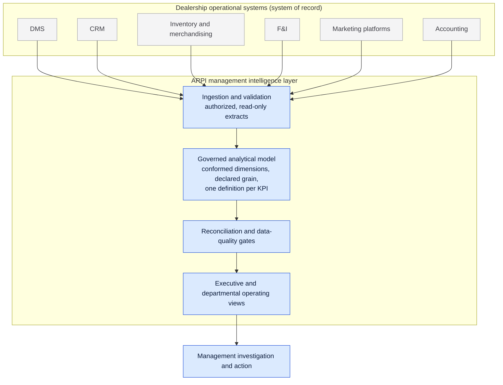
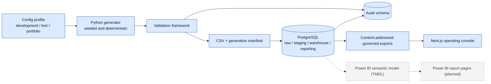

# Automotive Retail Performance Intelligence (ARPI)

**A management intelligence layer for automotive retail.** ARPI takes the operating questions a dealer group actually asks on Monday morning, defines them once, computes them from a governed analytical model, and puts the answers on one screen with the transactions behind them one click away.

---

## Monday Morning at Granite Auto Group

It is 7:40 on a Monday. The General Manager of Granite Auto Group has a meeting with the dealer owner and the CFO at nine, and the agenda is the same as it always is.

How did the group perform last month? Which rooftop drove the change? Did retail volume actually improve, or did a heavier used mix flatter the total? What happened to gross per retail unit? How much capital is standing on the lot in units over ninety days? Where is the lead funnel losing customers before anyone speaks to them? Which specific deals sit behind the aggregate that moved? Do the inventory schedules reconcile with what accounting is carrying? And out of all of it, what genuinely requires management attention this week?

Every one of those answers exists somewhere. That is the problem. Volume and gross are in the DMS. Lead activity and response times are in the CRM. Aging and price position are in the inventory tool. Product penetration is in the F&I system. Spend is in a marketing platform. The stock schedule is in accounting. Six systems, six definitions of a retail unit, six export buttons, and a spreadsheet in the middle of it that somebody rebuilds by hand every month.

So the General Manager spends the first two hours of the week assembling numbers instead of acting on them, and walks into the meeting hoping that when the CFO says "retail units" and the DMS report says "retail units", the two of them mean the same thing.

That is the business problem ARPI is designed to address.


---

## Project links

| | |
|---|---|
| **Live application** | [arpi.up.railway.app](https://arpi.up.railway.app) (preview deployment, see [Deployment status](#deployment-status)) |
| **Repository** | [github.com/mpalmer79/Automotive-Retail-Performance-Intelligence](https://github.com/mpalmer79/Automotive-Retail-Performance-Intelligence) |
| **Author** | [linkedin.com/in/mpalmer1234](https://www.linkedin.com/in/mpalmer1234/) |


> **Every figure in this project is synthetic and Granite Auto Group is fictional.** ARPI is a portfolio demonstration and is not connected to any real dealership system. The full statement is in the [Portfolio demonstration disclaimer](#portfolio-demonstration-disclaimer) at the end of this document.

---

## The problem

Dealership data is not scarce. It is fragmented, and it disagrees with itself.

| The question | Why it is hard to answer today |
|---|---|
| Why did gross change this month? | Volume, mix, discounting and inventory effects live in four different systems |
| Which inventory is becoming financially risky? | Age, market position and markdown history are rarely on one screen |
| Where is the funnel losing customers? | CRM stages do not reconcile to closed deals |
| Does this marketing source produce profitable business? | Spend and attributed gross are never in the same report |
| Which employees produce balanced results? | Rankings ignore lead quality, store traffic, tenure and mix |
| Do the books agree with the lot? | The stock schedule and the general ledger control are reconciled by hand, if at all |

Underneath all six is the same failure. There is no single place where a term is defined, so each system defines it locally, and a management meeting turns into a negotiation about whose number is right instead of a decision about what to do.

---

## The ARPI approach

One governed analytical model, one definition per term, and one operating view over the result.

1. **Define the question before the metric.** Every KPI in ARPI traces to a stated business question, a declared grain, an explicit denominator, and documented inclusion and exclusion rules. All twenty-nine of them are written down in [`KPI_CATALOG.md`](KPI_CATALOG.md) before they appear on any screen.
2. **Compute it once, in one place.** The SQL reporting layer owns every definition. The web console reads governed exports and computes no KPI of its own. The Power BI semantic model reads the same reporting views. Three surfaces, one definition.
3. **Reconcile rather than assert.** Gross, funnel, F&I back gross and the inventory schedule are re-proved on every run against independent derivations, and a failing reconciliation is visible on the screen rather than buried in a log.
4. **Show the transaction behind the number.** An aggregate a manager cannot drill into is a number they have to take on faith. Every headline figure on the console leads to the deals or units that produced it.
5. **Say what is not known.** Withheld small samples, unresolved comparisons, stale exports and unmet validation gates are surfaced as states, not hidden as blanks.

---

## What a manager gets

| Surface | What it answers |
|---|---|
| **Executive Command Center** | Retail units, gross, gross per retail unit, pace against plan, stock on the lot, the demand funnel and whether the books agree, on one screen |
| **Sales & Gross** | A documented decomposition of what moved between two periods, with new and used mix, store contribution and the discount distribution beside it |
| **Deal Explorer and Deal Jacket** | The transactions behind the aggregate, down to one delivery: sale price, front gross, back gross, trade, F&I itemization and days in stock |
| **Inventory** | Five governed age buckets, investment by band, price position against a synthetic estimate, and drill-through to a single unit |
| **F&I** | Reserve against product gross, penetration measured on each category's own eligible denominator, and adjustments on their own posting dates |
| **Leads & Marketing** | The lead-created cohort funnel, response-time distribution with the unanswered leads beside it, and spend against attributed outcomes |
| **Employees** | Role-aware activity with governed denominators, withheld below a minimum sample. No ranking and no score |
| **Accounting** | The signed variance between the stock schedule and the general ledger control, in four comparison states, with missing-side positions preserved as missing |
| **Management Actions** | The queue of what actually requires attention this week, by domain and severity, each item linked to the evidence that raised it |

What ARPI is not: a DMS, a CRM, a desking tool, a general ledger, a recommendation engine, or artificial intelligence of any kind. What it cannot yet answer is written down in [`docs/product/PRODUCT_GAPS.md`](docs/product/PRODUCT_GAPS.md).

---

## How ARPI would fit into a dealership

**This section describes a hypothetical production implementation. It is not what the portfolio demonstration does today.** The distinction is stated precisely below the diagram.

ARPI is designed to sit **above** a dealership's existing systems rather than replace any of them. The DMS remains the operational system of record. Deals are still written in the DMS, customers are still worked in the CRM, and the books are still closed in accounting. What ARPI would add is the layer none of those systems can provide on their own, which is a single governed reading of all of them together.



In an authorized production implementation, ARPI would ingest operational data from the dealership's existing DMS and other approved systems under an agreement with the dealer and the vendor, normalize those sources into the governed analytical model, apply the reconciliation and data-quality gates, and expose the result through the Executive operating console. Nothing would be written back. The dealership's systems would stay authoritative.

**What is true today, stated plainly:**

| | Portfolio implementation today | Authorized dealership deployment (vision) |
|---|---|---|
| Source data | Seeded synthetic data generated by the Python package in this repository | Read-only extracts from the dealership's own systems, under an authorized agreement |
| DMS connection | **None.** No connector, no credential, no API client, no vendor agreement | An approved ingestion path, per vendor and per dealer |
| Analytical model | Built and running against synthetic data | The same model, loaded from real extracts |
| Reconciliation | Runs, against generated sources | Runs, against the dealership's own records |
| Operating console | Built, reading committed governed exports | The same console, reading the deployed warehouse |

The vision is documented in [`docs/product/PRODUCT_VISION.md`](docs/product/PRODUCT_VISION.md). It is a design position, not a shipped integration, and no dealership vendor is affiliated with, endorses, or is connected to this project.

---

## Architecture

ARPI is a layered batch pipeline. Synthetic source data is generated deterministically from a seeded configuration profile, validated in memory, written to CSV with a content-digest manifest, and loaded into PostgreSQL, where it passes through `raw`, `staging`, `warehouse` and `reporting`. Every run records its outcome in the `audit` schema.



Solid arrows are implemented. The dashed path is the semantic model, which is built and statically validated but has never been evaluated by a Microsoft engine (see [Current implementation status](#current-implementation-status)).

**Layer responsibilities**

| Schema | Purpose |
|---|---|
| `raw` | Unmodified imported source records, all columns as text, with load lineage |
| `staging` | Typed and deduplicated views over raw, exposing the most recent load batch |
| `warehouse` | Conformed dimensions and facts at explicitly declared grain |
| `reporting` | Stable documented views, the only surface Power BI, Excel and the export job may read |
| `audit` | Pipeline runs, row counts, validation results, reconciliations, rejected records |

The binding detail is in [ARCHITECTURE.md](ARCHITECTURE.md). Larger diagrams with full legends are in [`docs/diagrams/`](docs/diagrams/).

---

## Technology stack

| Layer | Technology |
|---|---|
| **Data generation** | Python 3.11+, pandas, pydantic and pydantic-settings, a stdlib `argparse` CLI |
| **Warehouse** | PostgreSQL 16, psycopg 3, ordered and re-runnable SQL across five schemas |
| **Semantic model** | Power BI Project (PBIP) stored as TMDL, with the twenty-nine governed KPIs written in DAX |
| **Operating application** | Next.js 16, React 19, TypeScript in strict mode, Tailwind CSS v4, Motion, lucide-react |
| **Testing** | pytest and pytest-cov, Vitest, Playwright, axe-core, plus repository governance checks |
| **Quality** | Ruff for lint and format, mypy for types, ESLint and Prettier for the frontend |
| **CI** | GitHub Actions, with a separate frontend workflow that needs no credential |
| **Documentation** | Markdown and source-controlled Mermaid diagrams |

Planned additions are Microsoft Fabric or Power BI Desktop for real-engine validation, a managed PostgreSQL endpoint for a cloud semantic model, NHTSA vPIC public vehicle-attribute enrichment, and one Excel operating report. Rationale for the non-obvious choices is in [ADR-0002](docs/architecture-decisions/ADR-0002-phase-0-technology-baseline.md).

---

## Governance and data integrity

This repository is opinionated about honesty, and the opinions are enforced by scripts rather than by intention.

- **Status words are literal.** Nothing is labelled `Implemented` until code, SQL, loading, validation, reporting, documentation and tests exist together. `Planned`, `In progress` and `Deferred` mean exactly what they say.
- **Claims are derived from evidence.** `scripts/check_project_capabilities.py` compares every declared and documented status against what the repository actually contains, in both directions, so prose cannot overstate or understate the code.
- **Counts come from the repository.** Capability blocks are generated by `scripts/generate_project_capabilities.py`, not typed by hand.
- **KPIs are second-implemented.** Every governed measure is proved against an independent derivation, and a measure added without one fails the build.
- **Reconciliation is mechanical.** Gross, funnel, F&I back gross and the inventory control are re-proved on every run, and every critical rule has been shown to fail against a deliberately corrupted fixture.
- **No credential is ever committed.** `scripts/check_secrets.py` is a safety net behind a rule, not permission to rely on it.
- **The data is synthetic and says so** on every surface that displays a figure.
- **Privacy is designed in, not bolted on.** The data model prohibits names, street addresses, email addresses, phone numbers, full birth dates, government identifiers and bank information. Age is a band; geography stops at county or market area. No identifier this project stores can be a valid real VIN.

**The one exception, stated plainly.** The inventory reference workbooks under `data/reference/inventory/` are not synthetic. They are vehicle listing attributes captured from a public listing source, de-identified for portfolio use, and reassigned to the fictional stores of Granite Auto Group. Real VINs, source URLs, listing keys, addresses and real dealership identity were removed before the workbooks entered this repository. A row proves a listing was visible at a capture date. It does not prove a sale, a delivery, physical on-ground status or dealer ownership, and an advertised price is not a transaction price. The lane is governed by [ADR-0011](docs/architecture-decisions/ADR-0011-sanitized-public-inventory-reference-data.md) and gated by `scripts/check_reference_data.py`.

Full detail: [PRIVACY_AND_ETHICS.md](PRIVACY_AND_ETHICS.md), [LIMITATIONS.md](LIMITATIONS.md), [SECURITY.md](SECURITY.md).

---

## Current implementation status

| Area | Status | Notes |
|---|---|---|
| Synthetic data generation | Implemented | Fourteen generators, deterministic from a fixed seed, byte-identical output for a given profile |
| Validation framework | Implemented | 114 checks across fourteen `DQ-*` families, run in memory before any load |
| PostgreSQL warehouse | Implemented | Eight MVP dimensions, five MVP facts, grain enforced by constraints, roles with the reporter provably unable to read any pipeline layer |
| Reporting layer | Implemented | Twenty-eight MVP views: one per dimension, one per fact at the fact's own grain, and thirteen governed analytical views that own the SQL side of every KPI |
| All 29 MVP KPIs | Implemented | Computable from `reporting`, each tested against an independent derivation from `warehouse` |
| Reconciliation suite | Implemented | 114 results recorded on every database run, every critical rule proved falsifiable |
| Sanitized public inventory lane | Implemented | A second, separately governed data lane. Not synthetic, not DMS data, not current inventory |
| Target and pace lane | Implemented | Synthetic internal operating goals for a fictional group, never an industry benchmark |
| F&I lane and surface | Implemented | Ten governed product categories held as rows, adjustments as events on their own dates |
| Inventory accounting and GL control lane | Implemented | A selected control catalogue of three inventory accounts. Not a general ledger and not a chart of accounts |
| Web operating application | Implemented | [`portfolio/`](portfolio/), Next.js 16. Reads committed governed exports: no database connection, no API route, no charting library, and it computes no KPI |
| Power BI semantic model | Built, not complete | [`powerbi/ARPI_Performance_Intelligence/`](powerbi/ARPI_Performance_Intelligence), stored as TMDL. Twenty-six tables, forty-two relationships, all twenty-nine governed measures. Static validation passes at 9,452 assertions |
| **Real-engine validation** | **Pending** | No Microsoft semantic-model engine has ever loaded, refreshed or queried this model. Its DAX is unproven text, and static parsing cannot substitute |
| Power BI report pages and visuals | Not started | The PBIR folder is a shell with zero pages, zero visuals and zero bookmarks, and CI fails if one appears |
| Public analytical case study | Gated | Gate 2 is **CLOSED** and all three of its conditions are unmet, so `/case-study` ships as a locked shell that shows the unmet conditions instead of findings |
| Managed cloud PostgreSQL | Planned | Contract and automation written, database not provisioned |
| Real dealership, customer or lending data | Out of scope | Permanently excluded |
| Production DMS or CRM integration | Out of scope for this repository | Described as a vision in [`docs/product/PRODUCT_VISION.md`](docs/product/PRODUCT_VISION.md), implemented nowhere |

There is **no simulated result presented as a real one.** A simulated semantic-model validation layer exists as a development proxy and is labelled `SIMULATED SEMANTIC-MODEL VALIDATION` everywhere it appears; a check fails the build if any document calls it a Power BI, Desktop or Fabric result. See [`powerbi/model_documentation/10-simulated-semantic-model-validation.md`](powerbi/model_documentation/10-simulated-semantic-model-validation.md).

### Deployment status

| Environment | Purpose | Public | Indexing | State |
|---|---|---|---|---|
| `staging` | The reviewable deployment, at [arpi.up.railway.app](https://arpi.up.railway.app) | Reachable but unlisted | `noindex, nofollow`, `robots.txt` answers `Disallow: /` | **Deployed** |
| `production` | The public, indexable release | Yes | `index, follow` | **Approved, not yet created** |

The live link above is the preview deployment. It is a real, reachable build of the operating application, verified from a GitHub-hosted runner, and it is deliberately not in any search index. A reachable website is not a running analytical platform: it holds no database credential and opens no connection, PostgreSQL remains declared and unprovisioned, and the semantic model remains unevaluated. The evidence file is [`deployment/evidence/portfolio_deployment.json`](deployment/evidence/portfolio_deployment.json), where every field this repository's automation could not obtain reads `UNVERIFIED` rather than a guess.

---

## Repository structure

```text
Automotive-Retail-Performance-Intelligence/
├── src/arpi/          Python package: config, logging, generators, validation,
│                      writers, database load, audit, CLI
├── sql/               Ordered, re-runnable build scripts (00_database ... 09_migrations)
├── config/            development.yaml, test.yaml, portfolio.yaml,
│                      reference/ (the inventory listing contract)
├── tests/             unit/, data_quality/ (no database) and integration/ (needs PostgreSQL)
├── data/              raw/ (gitignored), sample/ (committed synthetic),
│                      reference/ (committed sanitized public inventory workbooks)
├── docs/              index.md, research.md, architecture-decisions/, diagrams/,
│                      product/, requirements/, reviews/, source-to-target/
├── scripts/           Governance checks, Power BI model validators, SQL baseline
│                      generator, Fabric deployment and validation
├── powerbi/           PBIP project (TMDL semantic model), model_documentation/,
│                      validation/ (SQL baseline and engine evidence)
├── deployment/        Railway configuration and non-secret deployment evidence
├── excel/             Empty: the Power BI-reconciled operating report does not exist yet
├── notebooks/         Empty: no notebooks exist yet
└── portfolio/         Next.js operating application and reference destination
```

The annotated tree, with an explicit `[now]`, `[empty]` or `[planned]` marker on every entry, is in [`ARCHITECTURE.md` §24](ARCHITECTURE.md).

---

## Running locally

Requires Python 3.11 or newer. Nothing below needs a database.

```bash
python3 -m venv .venv && source .venv/bin/activate
pip install -e ".[dev,db]"
arpi check-config --profile development
arpi generate --profile development
arpi run-foundation --profile development
```

| Command | What it does |
|---|---|
| `arpi version` | Prints the project name and version |
| `arpi check-config --profile development` | Loads, validates and prints the resolved configuration with secrets redacted |
| `arpi generate --profile development` | Generates the dimensions, validates them, writes CSV plus the manifest |
| `arpi run-foundation --profile development` | Runs the full foundation pipeline, including the PostgreSQL load when `database.enabled` is `true` |

Commands exit `0` on success and non-zero when a critical validation check fails, so they compose in scripts and CI. **No database credentials are required** to generate data, run validation, or run the test suite: `database.enabled` is `false` by default, and `database.password` is read only from `ARPI_DATABASE__PASSWORD` or a `PGPASSWORD` fallback, never from a configuration file. To exercise the SQL layer, follow [`docs/database-setup.md`](docs/database-setup.md).

The operating application runs on its own:

```bash
cd portfolio
npm ci
npm run dev        # generates its manifests, then serves the console at localhost:3000
```

---

## Testing and quality

```bash
ruff format --check . && ruff check .
mypy src tests
pytest -m "not integration" --cov=arpi --cov-report=term-missing
python scripts/check_naming.py
python scripts/check_docs_links.py
python scripts/check_secrets.py
python scripts/check_powerbi_model.py
python scripts/check_project_capabilities.py
```

```bash
cd portfolio && npm run verify    # format, lint, typecheck, manifests, unit tests, build
cd portfolio && npm run test:e2e  # Playwright end-to-end, accessibility and content integrity
```

These are the commands continuous integration runs. Unit and data-quality tests need no database; the integration suite is marked `integration` and is excluded by default. Python coverage has a floor of 85%. The frontend suite covers unit, component and content-integrity tests plus Playwright accessibility, end-to-end and design-system tests, with zero critical or serious axe violations across the routes it sweeps.

The governance checks are the unusual part and are worth naming: `check_naming.py` fails the build if a retired identifier reappears, `check_docs_links.py` fails if a relative documentation link stops resolving, `check_secrets.py` fails on a committed credential pattern, `check_project_capabilities.py` fails when a status claim disagrees with the repository, and `check_simulation_labels.py` fails if anything calls the simulated validation a real one.

Contribution workflow and standards are in [CONTRIBUTING.md](CONTRIBUTING.md).

---

## Roadmap and production vision

**Complete.** The foundation, the analytical warehouse and the reporting layer: all eight MVP dimensions, all five MVP facts, twenty-eight reporting views, all twenty-nine KPIs computable and tested, and a formal Gate 1 review that is **OPEN**.

**In progress.** The Power BI semantic model is built and statically validated. It is not complete, and the reason is worth stating plainly: no Microsoft semantic-model engine has ever loaded it. Real-engine validation is an external manual dependency with two accepted paths, both documented in [ADR-0008](docs/architecture-decisions/ADR-0008-real-engine-validation-paths.md), and neither can run on the hardware this project is developed on. Gate 2 stays **CLOSED** until one of them does.

**Next.** The seven unblocked Power BI report pages, executive findings, the Excel operating report, and the public case study, in that order and each gated on the one before it.

**The production vision**, which is a design position rather than a plan with a date, is ARPI as an authorized management intelligence layer over a real dealer group's existing systems: read-only ingestion from the DMS and the other approved platforms, the same governed model, the same reconciliation gates, and the same operating console. Everything material about that vision, including what would have to be true before any of it is responsible, is written in [`docs/product/PRODUCT_VISION.md`](docs/product/PRODUCT_VISION.md), and what the platform genuinely cannot do today is in [`docs/product/PRODUCT_GAPS.md`](docs/product/PRODUCT_GAPS.md).

---

## Documentation

Start at the [documentation hub](docs/index.md), which explains the hierarchy and offers reading paths by audience.

| Document | Purpose |
|---|---|
| [ARCHITECTURE.md](ARCHITECTURE.md) | The binding technical architecture, scope, non-goals and phase plan |
| [KPI_CATALOG.md](KPI_CATALOG.md) | Governed KPI definitions, formulas, grains and limitations |
| [DATA_DICTIONARY.md](DATA_DICTIONARY.md) | Every table and column, with types, nullability and meaning |
| [DATA_GENERATION.md](DATA_GENERATION.md) | How the synthetic data is produced and why it behaves as it does |
| [LIMITATIONS.md](LIMITATIONS.md) | What this data and analysis genuinely cannot support |
| [PRIVACY_AND_ETHICS.md](PRIVACY_AND_ETHICS.md) | Privacy design and ethical analytics commitments |
| [SECURITY.md](SECURITY.md) | Secret handling and vulnerability reporting |
| [CONTRIBUTING.md](CONTRIBUTING.md) | Development workflow, standards and quality gates |
| [docs/architecture-decisions/](docs/architecture-decisions/) | Every ADR, including the ones that constrain this README |
| [docs/product/](docs/product/) | Product vision and the gap register |
| [docs/requirements/](docs/requirements/) | Backlogs, stakeholder-question traceability and gate readiness reviews |
| [docs/diagrams/](docs/diagrams/) | Source-controlled Mermaid diagrams |
| [powerbi/model_documentation/](powerbi/model_documentation/) | The semantic model as built, and the simulated validation layer |
| [portfolio/README.md](portfolio/README.md) | The operating application: what it is, what it is not, and how to run it |
| [portfolio/docs/](portfolio/docs/) | Design system, motion, content model, accessibility, performance, deployment, visual review |

---

## Author

**Michael Palmer**

Built on more than 25 years in automotive retail, combined with SQL, PostgreSQL, Python and business intelligence work. The domain judgement in this project, which is to say what a gross number actually means, why an employee ranking without context is misleading, and which service customers are genuinely replacement opportunities, comes from having worked the floor rather than from reading about it.

| | |
|---|---|
| **GitHub** | [github.com/mpalmer79](https://github.com/mpalmer79) |
| **LinkedIn** | [linkedin.com/in/mpalmer1234](https://www.linkedin.com/in/mpalmer1234/) |
| **Repository** | [Automotive-Retail-Performance-Intelligence](https://github.com/mpalmer79/Automotive-Retail-Performance-Intelligence) |

Questions, corrections and critique are welcome. See [CONTRIBUTING.md](CONTRIBUTING.md).

---

## Portfolio demonstration disclaimer

ARPI is a portfolio demonstration project. Granite Auto Group, its dealerships, employees, customers, transactions, financial results and operating data are entirely fictional and synthetic.

The Monday-morning management scenario described in this README is hypothetical. ARPI is not currently deployed at Granite Auto Group or any real dealership, and is not currently connected to a production dealer management system, CRM, accounting platform, lender, OEM, or other dealership vendor.

References to DMS and third-party system integration describe how the platform could operate in an authorized production implementation. They do not represent an existing commercial integration, affiliation, endorsement, or production deployment.

This project is intended strictly to demonstrate software engineering, data architecture, analytics, dealership-domain knowledge, governance and product-design concepts.

The figures drawn in the card image at the top of this document are illustrative artwork, not governed output ([ADR-0016](docs/architecture-decisions/ADR-0016-social-card-as-an-illustrative-raster.md)). Every figure on the operating console is computed from synthetic data by the code in this repository.

---

## License

Released under the MIT License. Copyright © 2026 Michael Palmer. See [LICENSE](LICENSE).

The license covers the code and documentation in this repository. The synthetic data it produces is likewise free to use, with the obvious caveat that it describes nothing real.
