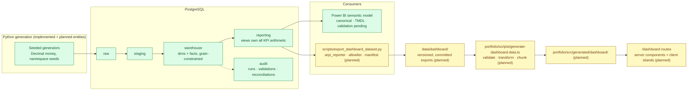

# Dashboard Diagram 01 — Source-to-dashboard lineage

Where every number on the ARPI Dealer Operations Command Center comes from, and the boundaries it
crosses. Planned components are marked; nothing right of the `reporting` schema exists yet.

**Boundary notes.** The browser never crosses into the database: the only runtime data source for a
dashboard route is a build-packaged JSON artifact. `arpi_reporter` is the exporter's identity and can
read exactly the `reporting` schema. The audit schema informs the manifest (reconciliation status)
through `reporting.vw_reconciliation_status`, never directly.
