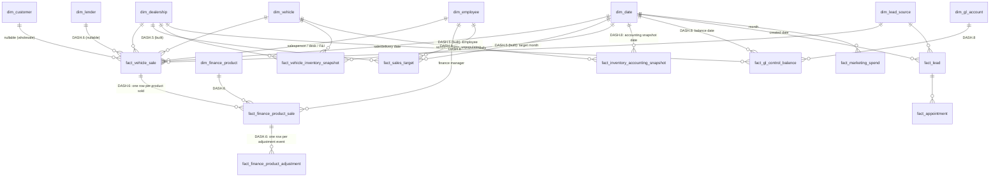

# Dashboard Diagram 02 — Expanded fact constellation

The warehouse star after the program's promotions. Solid nodes exist today; dashed-context nodes are
promoted by the named increments. Grains are the binding declarations from
[`DASHBOARD_PROGRAM.md §9`](../../requirements/DASHBOARD_PROGRAM.md).

**Grain register (new entities).** `fact_sales_target` — **built by `DASH.5`**; grain as built is
dealership × target month × targeted KPI × target scope (scope type + scope id), one column wider than
the "optional scope" this diagram planned, because a nullable scope column cannot enforce a grain in
PostgreSQL. The `dim_employee` edge exists physically and carries no row: `DASH.5` generates no
employee-scope target.
`fact_finance_product_sale`: one row per finance product sold on a finalized transaction.
`fact_finance_product_adjustment`: one row per cancellation/chargeback/reinstatement/adjustment
event. `fact_inventory_accounting_snapshot`: vehicle × dealership × accounting snapshot date while
carried. `fact_gl_control_balance`: dealership × GL control account × balance date. The optional
`fact_trade_in` (`DASH.O-1`) is deliberately absent from this diagram until scheduled.
