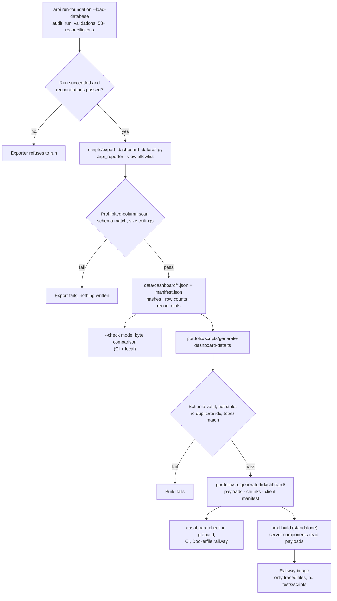

# Dashboard Diagram 03 — Export and build pipeline

How data moves from a green pipeline run to a served dashboard route, and where each check can stop
it. Mirrors the existing manifest/inventory generator pattern (generate mode locally, `--check`
byte-comparison in `prebuild`, CI, and the Docker build).

**Failure philosophy.** Every arrow into a diamond is a place the pipeline prefers stopping over
emitting a number it cannot back. A stale or hand-edited artifact cannot reach a deployment because
the byte-comparison runs inside the Docker build itself.
