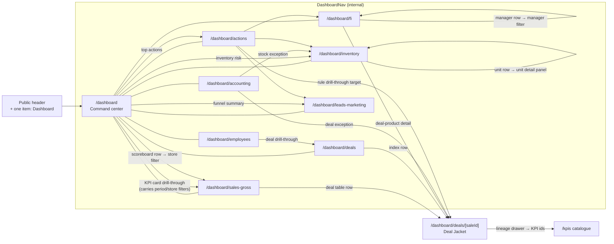

# Dashboard Diagram 04 — Route and drill-through flow

The console's navigation surface: one public-header entry, an internal nav, and the drill-through
paths that keep every aggregate one link away from its detail.

**Rules.** Every drill-through is a plain link with filter state in the URL, so back/forward and
copied links reproduce views. The Deal Jacket is reachable from five surfaces and always renders the
same record for the same `saleId` regardless of entry path.
