# Dashboard Diagram 05 — Deal Jacket data relationships

Every section of the Deal Jacket and the entity that feeds it. Sections marked `DASH.6/7` render
their honest placeholder until those increments land.

```mermaid
flowchart TB
    subgraph jacket["/dashboard/deals/[saleId]"]
        H["Header: identity, dates, store,<br/>structure, reconciliation chip"]
        V["Vehicle section"]
        FG["Front-gross calculation<br/>price − acquisition − recon − pack"]
        TR["Trade section<br/>allowance vs ACV variance"]
        FS["Finance structure<br/>amounts only, no rates"]
        FP["F&I products (DASH.7)<br/>one row per contract"]
        TG["Total gross identity"]
        SA["Staff attribution<br/>synthetic IDs + roles"]
        TL["Lead & appointment timeline"]
        CK["Accounting checks"]
        LN["KPI & lineage drawer"]
    end

    FVS["warehouse.fact_vehicle_sale<br/>(one row per finalized transaction)"] --> H
    FVS --> FG
    FVS --> TR
    FVS --> FS
    FVS --> TG
    FVS --> SA
    DV["dim_vehicle + dim_vehicle_model"] --> V
    DD["dim_dealership"] --> H
    DE2["dim_employee (SCD2 role at sale)"] --> SA
    DL["dim_lender (DASH.6)"] --> FS
    FPS["fact_finance_product_sale (DASH.6)"] --> FP
    FPA["fact_finance_product_adjustment (DASH.6)"] --> FP
    DFP["dim_finance_product (DASH.6)"] --> FP
    FL["fact_lead"] --> TL
    FA["fact_appointment"] --> TL
    FIS["fact_vehicle_inventory_snapshot"] --> CK
    MAN["Export manifest<br/>dataset version + hashes"] --> LN
    KC["KPI_CATALOG.md ids"] --> LN

    FP --> TG
    FG --> TG
```

**Privacy boundary.** Nothing on the jacket resolves to a person: customers never appear (not even
banded), employees are synthetic IDs with roles, the VIN-like identifier is the ADR-0005 synthetic
form, and the timeline carries milestones only — the model contains no message content to leak.
