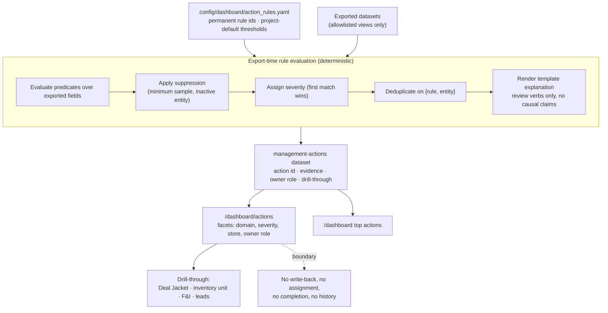

# Dashboard Diagram 06 — Management-action generation

The deterministic path from rule file to rendered action, and the boundaries that keep it a review
queue rather than a fake workflow system.

**Determinism guarantee.** Same dataset version + same rule file → byte-identical queue. Every rule
has a firing fixture and a suppressed fixture in the test suite; a rule that has never fired in a
test is not shipped.
