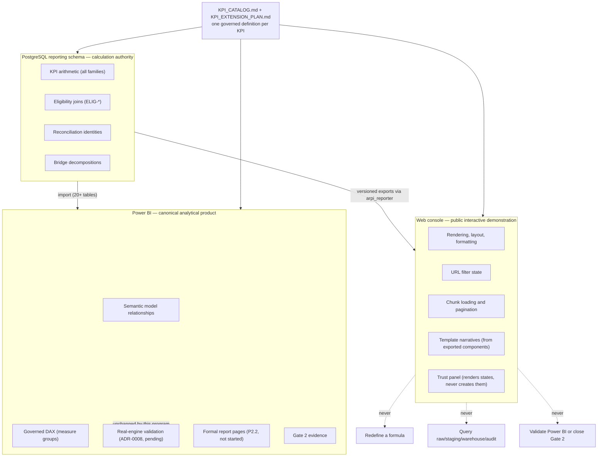

# Dashboard Diagram 07 — SQL, Power BI, and web ownership boundaries

Who owns which calculation, per [ADR-0013](../../architecture-decisions/ADR-0013-governed-web-operating-console.md).
One arithmetic authority, two presentation products, no shared blur.

**Drift control.** The same KPI id resolves to one formula in the catalogue; SQL computes it; the
export carries it with reconciliation totals; the web renders it; the future DAX measure is
reconciled against the same SQL baseline. A number that cannot complete that chain does not ship.
