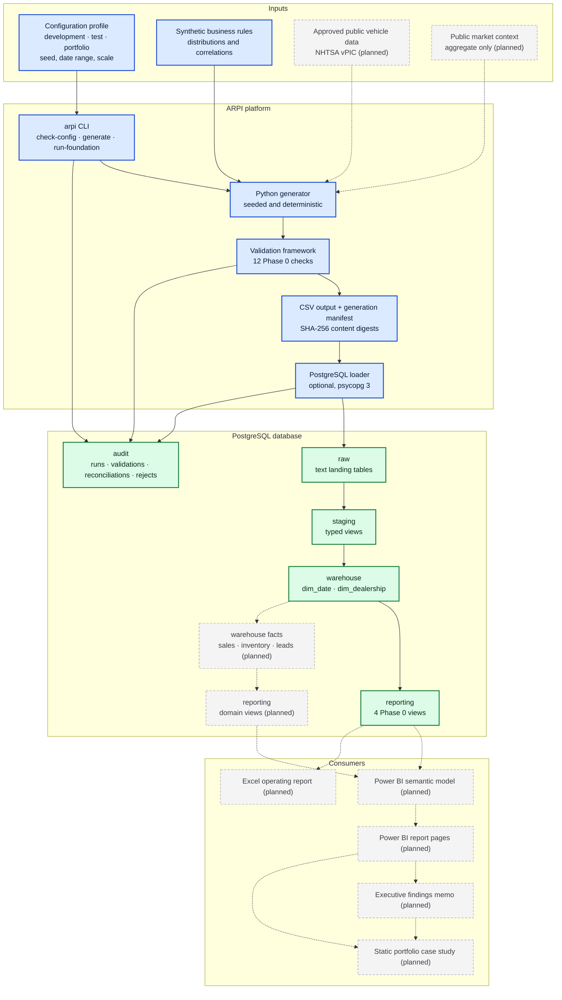

# ARPI — System Context

**Automotive Retail Performance Intelligence (ARPI)** in one view: where data comes from, what the
platform does to it, and who consumes the result.

This is the widest view of the system. It shows every component the project will eventually have, with
implemented and planned components visually distinguished so the diagram never overstates what exists.

---

## Diagram

---

## Legend

| Appearance | Meaning |
|---|---|
| **Blue, solid border** | Implemented process or artifact — exists and runs today |
| **Green, solid border** | Implemented database object — schema exists with content |
| **Grey, dashed border, label marked `(planned)`** | Planned — does not exist yet |
| **Solid arrow** | Data flow that runs today |
| **Dashed arrow** | Planned data flow |

Every node whose label ends in `(planned)` is drawn grey and dashed, and every edge touching one is
dashed. The two encodings agree, so the diagram is readable without colour.

---

## What the diagram says

**The platform runs without a database.** Configuration, generation, validation, and the CSV plus manifest
output are a complete, useful path on their own. The PostgreSQL loader is optional and disabled by default
(`database.enabled: false`). A reviewer can produce and validate the full dataset with no database, no
credentials, and no accounts.

**Validation happens before the load, not after it.** The validation framework runs against in-memory
frames. Bad data never reaches `raw`, and the CLI exits non-zero on a critical failure rather than loading
and reporting afterwards.

**The audit schema is written from three places.** The CLI opens and closes the pipeline run, the
validation framework records check outcomes, and the loader records row counts per layer. Audit is not a
log file — it is queryable history in the database.

**Power BI never touches `raw`, `staging`, or `warehouse`.** The only sanctioned consumption surface is the
`reporting` schema, and the `arpi_reporter` role has read access to nothing else. That constraint is
enforced in `sql/07_security/`, not merely stated here.

**The right-hand column is entirely planned.** No semantic model, no report page, no workbook, no memo, and
no case study exists. Four reporting views exist today — calendar, dealership, pipeline run summary, and
data quality summary — and nothing consumes them yet.

---

## Related

- [`02-phase-0-data-flow.md`](02-phase-0-data-flow.md) — the implemented path in detail, with exit codes
- [`03-initial-dimensional-model.md`](03-initial-dimensional-model.md) — the warehouse and audit objects
- [`04-repository-component-map.md`](04-repository-component-map.md) — which directory owns which artifact
- [`../../ARCHITECTURE.md`](../../ARCHITECTURE.md) §§9–11 — layer responsibilities and the dimensional model

*All data is synthetic. Granite State Auto Group is fictional.*
