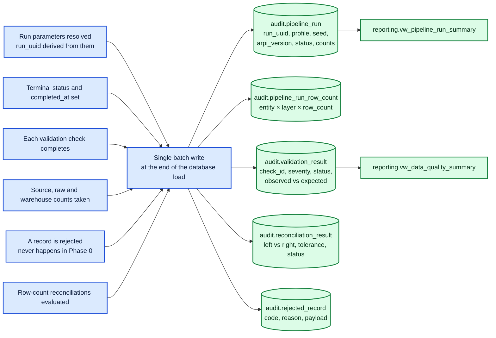

# ARPI — Phase 0 Data Flow

The path a row actually takes in **Automotive Retail Performance Intelligence (ARPI)** today, from a
configuration profile to a reporting view — including what is written to the `audit` schema along the way
and what exit code the CLI returns.

Everything in this diagram is implemented, with one clearly marked optional branch: the PostgreSQL load,
which runs only when `database.enabled` is `true`.

> **Validation does not halt the run.** This is the single most important thing to understand about the
> flow below, and it is easy to assume the opposite. A failed **critical** check does **not** stop the
> pipeline: the CSVs and the manifest are still written, and the optional database load still runs. The
> failure surfaces **only as a nonzero process exit code**, computed after everything else has finished
> (`src/arpi/pipeline.py`, `src/arpi/cli.py`).
>
> That is deliberate. The artefacts of a failed run are exactly what a reviewer needs in order to diagnose
> it — you cannot debug a bad `dim_date` that was never written to disk, and you cannot query an
> `audit.validation_result` row that was never inserted. Phase 0 therefore treats a critical failure as
> *loud*, not as *blocking*. If a future phase needs a genuine quarantine gate, that is a behaviour change
> requiring an ADR, not a documentation fix.

---

## Main flow

```mermaid
flowchart TB
    START(["arpi generate --profile P<br/>or arpi run-foundation --profile P"])

    subgraph config["1 · Configuration"]
        YAML["config/P.yaml"]
        ENV["Environment overrides<br/>ARPI_ prefix, __ delimiter"]
        MODEL["Typed settings model<br/>pydantic-settings"]
        REDACT["Password from<br/>ARPI_DATABASE__PASSWORD only<br/>rendered as ***REDACTED***"]
    end

    subgraph generate["2 · Seeded generation"]
        SEED["random_seed from profile"]
        GDATE["Date generator<br/>reporting.start_date to end_date<br/>26 columns per calendar day"]
        GDLR["Dealership generator<br/>3 fictional stores, SCD Type 2 shape"]
    end

    subgraph validate["3 · In-memory validation — records results, never halts"]
        VD["DQ-DATE-001 … DQ-DATE-005"]
        VL["DQ-DLR-001 … DQ-DLR-005"]
        VG["DQ-GEN-001 · DQ-GEN-002"]
        REPORT["Validation report held in memory<br/>critical_failure_count · warning_count"]
    end

    subgraph write["4 · Output — written unconditionally"]
        RAWCSV["data/raw/P/<br/>dim_date.csv · dim_dealership.csv"]
        SAMPLE["data/sample/<br/>capped extract, committed"]
        MANIFEST["generation_manifest.json<br/>seed, dates, row and column counts,<br/>SHA-256 digest per entity"]
    end

    STATUS["Run reaches its terminal status<br/>succeeded if critical_failure_count = 0<br/>otherwise failed · completed_at set"]

    subgraph load["5 · Optional PostgreSQL load — also unconditional on validation"]
        ENABLED{"database.enabled<br/>and reachable?"}
        RAWT["raw.calendar_date_load<br/>raw.dealership_load<br/>all text + load lineage"]
        STGV["staging.stg_calendar_date<br/>staging.stg_dealership<br/>typed views, latest batch"]
        DIM["warehouse.dim_date<br/>warehouse.dim_dealership"]
        AUDITW["All audit rows written<br/>in one batch at the end"]
        RVIEW["reporting.vw_calendar<br/>reporting.vw_dealership<br/>reporting.vw_pipeline_run_summary<br/>reporting.vw_data_quality_summary"]
    end

    EXIT{"Did any critical<br/>check fail?"}
    OK(["Exit 0"])
    FAIL(["Exit non-zero<br/>output and load already happened"])
    SKIP["Load skipped, not failed<br/>nothing reaches the audit schema"]

    START --> YAML
    YAML --> MODEL
    ENV --> MODEL
    REDACT --> MODEL
    MODEL --> SEED
    SEED --> GDATE
    SEED --> GDLR
    GDATE --> VD
    GDLR --> VL
    GDATE --> VG
    GDLR --> VG
    VD --> REPORT
    VL --> REPORT
    VG --> REPORT

    REPORT --> RAWCSV
    RAWCSV --> MANIFEST
    RAWCSV --> SAMPLE
    MANIFEST --> STATUS
    STATUS --> ENABLED

    ENABLED -->|no| SKIP
    SKIP --> EXIT
    ENABLED -->|yes| RAWT
    RAWT --> STGV
    STGV --> DIM
    DIM --> AUDITW
    AUDITW --> RVIEW
    RVIEW --> EXIT

    EXIT -->|no| OK
    EXIT -->|yes| FAIL

    classDef step fill:#dbeafe,stroke:#1d4ed8,stroke-width:2px,color:#0b1b3a
    classDef store fill:#dcfce7,stroke:#15803d,stroke-width:2px,color:#052e16
    classDef decision fill:#fef9c3,stroke:#a16207,stroke-width:2px,color:#3f2d04
    classDef good fill:#dcfce7,stroke:#15803d,stroke-width:2px,color:#052e16
    classDef bad fill:#fee2e2,stroke:#b91c1c,stroke-width:2px,color:#450a0a

    class YAML,ENV,MODEL,REDACT,SEED,GDATE,GDLR,VD,VL,VG,REPORT,STATUS,SKIP,START step
    class RAWCSV,SAMPLE,MANIFEST,RAWT,STGV,DIM,AUDITW,RVIEW store
    class ENABLED,EXIT decision
    class OK good
    class FAIL bad
```

**Reading the flow.** There is exactly one decision that can divert the path — `database.enabled and
reachable?` — and it is about configuration, not about data quality. Validation contributes a *number*
(`critical_failure_count`) that is carried forward, consulted once at the very end to choose the exit code,
and never used to skip a step. A run in which every critical check failed traverses the same boxes, in the
same order, as a run in which none did.

---

## Audit capture

**Nothing reaches the `audit` schema unless the optional database load runs.** Audit capture is not a
parallel track alongside the main flow — it is a step *inside* step 5. Throughout the run, results are
accumulated in an in-memory recorder; then, at the end of the load and inside a single transaction, **all
audit rows are written in one batch**. A run with `database.enabled = false` produces a complete validation
report on stdout and leaves the `audit` schema untouched.

The left-hand column below shows where each fact is *collected*; the arrows into the tables all fire at the
same moment, at the end of the load.

Consequences of the batch-at-the-end design:

- **A run row is never observed in `status = 'running'`.** The status is settled in memory before the load
  begins, so the single `audit.pipeline_run` write always carries a terminal status — `succeeded` when no
  critical check failed, `failed` when one did — together with its `completed_at` timestamp. That is what
  lets `reporting.vw_pipeline_run_summary` report a real duration for every persisted run.
- **A run that fails before the load leaves no audit trail in the database.** If the process dies during
  generation, or PostgreSQL is unreachable, there is no partial run row to inspect. The CSVs, the manifest
  and the printed validation report are the evidence in that case.
- **`audit.rejected_record` is always empty.** The Phase 0 generators emit only contract-shaped rows, so
  there is no code path that can reject one. The table exists because the schema is a contract for what
  comes next, not because Phase 0 exercises it.
- The `run_uuid` ties every child row back to its run, so a completed run is fully inspectable in SQL after
  the fact.

---

## CLI exit-code behaviour

| Situation | Exit code | What is written |
|---|---:|---|
| All checks pass, database disabled | `0` | CSV, sample extract, manifest. **No audit rows** — the `audit` schema is written only by the database load |
| All checks pass, database enabled, load succeeds | `0` | Everything above, plus `raw` and `warehouse` rows and the audit batch, with the run recorded as `succeeded`. `staging` and `reporting` are views, so they reflect the new rows without being written to |
| A **critical** validation check fails | non-zero | **Full output is still written, and the load still runs.** CSV, sample extract and manifest are complete for every entity; if the database step is enabled the rows are loaded and the run is recorded as `failed` with `critical_failure_count > 0`. The only difference from a passing run is the exit code |
| Only **warning**-severity checks fail | `0` | Full output. The run is `succeeded` with `warning_count > 0`, and the warnings are queryable in `audit.validation_result` once loaded |
| Configuration is invalid or a profile is missing | non-zero | Nothing generated. The failure is reported as a named configuration error |
| Database enabled but unreachable | `0` unless a critical check also failed | CSV, sample extract and manifest are written. The load is reported as **skipped with a reason, not failed** — an unreachable database is not a data-quality defect, and the slice is designed to run on a machine with no PostgreSQL at all |

Warnings never fail the pipeline and critical failures always do — but "fail" here means *the process
returns a nonzero exit code*, not *the pipeline stopped*. That split is a property of each check's declared
severity, not of the caller, so the same command behaves identically in a terminal and in CI.

---

## Determinism

The same profile and the same seed produce byte-identical CSV output on any machine. This is deliberate
and load-bearing:

- The generation manifest carries a SHA-256 digest of each entity's CSV bytes, and `DQ-GEN-002` records
  that digest as evidence.
- The manifest contains **no wall-clock timestamp**. It records
  `"timestamp_policy": "omitted for deterministic output"` instead, because a timestamp would make every
  regeneration produce a diff.
- Holidays are computed in-process from closed-form rules, with no external holiday library whose release
  history could change last year's output. See
  [ADR-0002](../architecture-decisions/ADR-0002-phase-0-technology-baseline.md), decision 10.

Regenerating the committed sample data should therefore produce an empty `git diff`. If it does not,
something changed that deserves a look.

---

## Related

- [`01-system-context.md`](01-system-context.md) — the wider view including planned consumers
- [`03-initial-dimensional-model.md`](03-initial-dimensional-model.md) — the objects this flow populates
- [`../../DATA_GENERATION.md`](../../DATA_GENERATION.md) — generation methodology
- [`../database-setup.md`](../database-setup.md) — enabling the optional PostgreSQL branch

*All data is synthetic. Granite Auto Group is fictional.*
