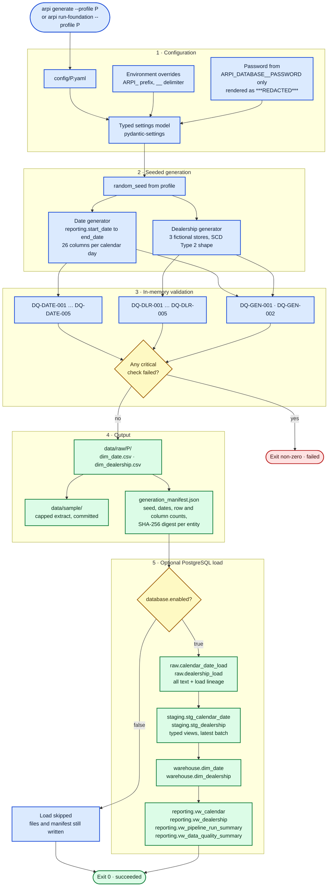
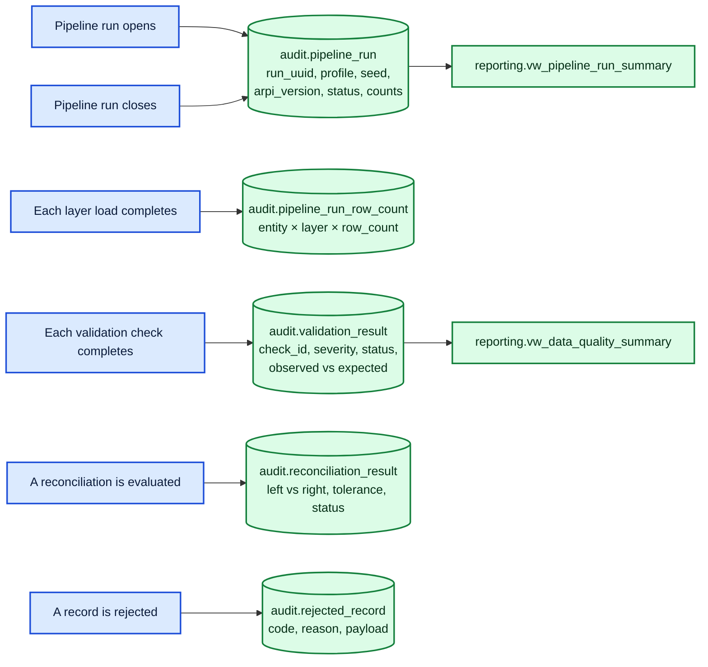

# ARPI — Phase 0 Data Flow

The path a row actually takes in **Automotive Retail Performance Intelligence (ARPI)** today, from a
configuration profile to a reporting view — including what is written to the `audit` schema along the way
and what exit code the CLI returns.

Everything in this diagram is implemented, with one clearly marked optional branch: the PostgreSQL load,
which runs only when `database.enabled` is `true`.

---

## Main flow

---

## Audit capture

The `audit` schema is written alongside the main flow, not at the end of it. If a run fails, the audit
record of why it failed already exists.

A run is opened with `status = 'running'` before any generation happens, and closed as `succeeded`,
`failed`, or `aborted`. The `run_uuid` ties every child row back to its run, so a failed run is fully
inspectable in SQL after the fact.

---

## CLI exit-code behaviour

| Situation | Exit code | What is written |
|---|---:|---|
| All checks pass, database disabled | `0` | CSV, sample extract, manifest. Audit rows only if a database is configured for audit capture |
| All checks pass, database enabled, load succeeds | `0` | Everything above, plus `raw`, `staging`, `warehouse`, `reporting`, and a `succeeded` run |
| A **critical** validation check fails | non-zero | Manifest and CSV are not written for the failed entity; the run is recorded as `failed` with `critical_failure_count > 0` |
| Only **warning**-severity checks fail | `0` | Full output. The run is `succeeded` with `warning_count > 0`, and the warnings are queryable in `audit.validation_result` |
| Configuration is invalid or a profile is missing | non-zero | Nothing generated. The failure is reported as a named configuration error |
| Database enabled but unreachable | non-zero | CSV and manifest are already written; the run is recorded as `failed` |

Warnings never fail the pipeline and critical failures always do. That split is a property of each check's
declared severity, not of the caller, so the same command behaves identically in a terminal and in CI.

---

## Determinism

The same profile and the same seed produce byte-identical CSV output on any machine. This is deliberate
and load-bearing:

- The generation manifest carries a SHA-256 digest of each entity's CSV bytes, and `DQ-GEN-002` records
  that digest as evidence.
- The manifest contains **no wall-clock timestamp**. It records
  `"timestamp_policy": "omitted for deterministic output"` instead, because a timestamp would make every
  regeneration produce a diff.
- Holidays are computed in-process from closed-form rules, with no external holiday library whose release
  history could change last year's output. See
  [ADR-0002](../architecture-decisions/ADR-0002-phase-0-technology-baseline.md), decision 10.

Regenerating the committed sample data should therefore produce an empty `git diff`. If it does not,
something changed that deserves a look.

---

## Related

- [`01-system-context.md`](01-system-context.md) — the wider view including planned consumers
- [`03-initial-dimensional-model.md`](03-initial-dimensional-model.md) — the objects this flow populates
- [`../../DATA_GENERATION.md`](../../DATA_GENERATION.md) — generation methodology
- [`../database-setup.md`](../database-setup.md) — enabling the optional PostgreSQL branch

*All data is synthetic. Granite State Auto Group is fictional.*
