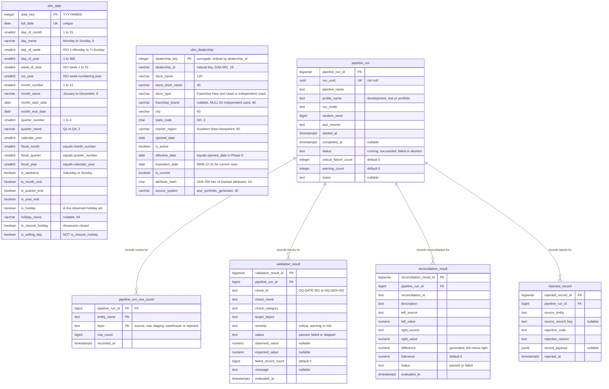

# ARPI — Initial Dimensional Model

The warehouse and audit objects that **Automotive Retail Performance Intelligence (ARPI)** builds today,
followed by the fact constellation they are designed to support.

Phase 0 shipped two conformed dimensions and no facts, deliberately: dimensions are the part of a star
schema that everything else depends on, and getting `dim_date` wrong is expensive to discover later. Phase 1
added the remaining six dimensions and all five facts. **All thirteen warehouse entities now exist, are
populated, and have their grain enforced by a database constraint.**

The first section below keeps the full column detail for the two foundation dimensions. The second shows
the complete fact constellation as it is actually built.

---

## The two foundation dimensions, in full

`warehouse.dim_date` and `warehouse.dim_dealership` exist with exactly the columns below, in exactly this
order, and are populated by the generator and verified by the test suite. Only these two are shown at
column level here; the column contract for the other eleven entities is the DDL under `sql/03_dimensions/`
and `sql/04_facts/`, which is where the database comments live.

**Schema qualification.** Entity names are unqualified above because Mermaid entity identifiers cannot
contain a dot. The real object names are:

| Diagram entity | Real object |
|---|---|
| `dim_date` | `warehouse.dim_date` |
| `dim_dealership` | `warehouse.dim_dealership` |
| `pipeline_run` | `audit.pipeline_run` |
| `pipeline_run_row_count` | `audit.pipeline_run_row_count` |
| `validation_result` | `audit.validation_result` |
| `reconciliation_result` | `audit.reconciliation_result` |
| `rejected_record` | `audit.rejected_record` |

**Grains.** `warehouse.dim_date` is one row per calendar date. `warehouse.dim_dealership` is one row per
store *version* — a Type 2 dimension, though in Phase 0 exactly one current version exists per store.
`(dealership_id, effective_date)` is unique, and a partial unique index enforces one current row per
`dealership_id`.

**Why the dimensions do not join to each other.** They are conformed dimensions. They will be joined
through facts, not to one another. A star schema with dimension-to-dimension relationships is a snowflake
by accident, and the model avoids that deliberately.

**Why `attribute_hash` exists.** It is the SHA-256 of the Type 2 tracked attributes (columns 3 through 11,
joined with `|`, UTF-8). Comparing hashes is how a future load will detect that a store's attributes
changed and a new version row is required, without diffing eleven columns by hand.

---

## The fact constellation, as built

Every entity below exists, is populated, and has its grain enforced by a `UNIQUE` or `PRIMARY KEY`
constraint. Attributes are the relationship keys and the headline measures only; the full column contract
lives in the DDL.

```mermaid
erDiagram
    dim_date {
        integer date_key PK "YYYYMMDD"
    }
    dim_dealership {
        integer dealership_key PK "current version only in reporting"
    }
    dim_vehicle_model {
        integer vehicle_model_key PK "year x make x model x trim"
    }
    dim_vehicle {
        integer vehicle_key PK "one physical vehicle"
        integer vehicle_model_key FK "the one snowflake"
        varchar condition_type "New, Used or Certified"
    }
    dim_employee {
        integer employee_key PK "SCD2, current version in reporting"
    }
    dim_customer {
        integer customer_key PK "banded attributes only"
    }
    dim_lead_source {
        integer lead_source_key PK "normalised source"
        boolean is_paid "cost attributability"
    }
    dim_marketing_campaign {
        integer campaign_key PK "one campaign"
    }

    fact_vehicle_sale {
        bigint sale_key PK "grain: one finalized transaction"
        integer sale_date_key FK "role: sale"
        integer delivery_date_key FK "role: delivery"
        integer dealership_key FK "store"
        integer vehicle_key FK "vehicle"
        integer customer_key FK "nullable on wholesale"
        integer salesperson_key FK "role: seller"
        integer desk_manager_key FK "role: desk"
        integer finance_manager_key FK "role: F and I"
        integer lead_source_key FK "first-touch attribution"
        smallint unit_count "always 1"
        numeric front_end_gross "vehicle profit"
        numeric back_end_gross "F and I profit"
        numeric total_gross "front plus back, to the cent"
        integer days_in_inventory_at_sale "days to sale"
    }
    fact_vehicle_inventory_snapshot {
        bigint inventory_snapshot_key PK "grain: vehicle x store x day"
        integer snapshot_date_key FK "as-of date"
        integer dealership_key FK "store"
        integer vehicle_key FK "vehicle"
        integer vehicle_model_key FK "model line"
        smallint inventory_unit_count "always 1, SEMI-ADDITIVE"
        numeric inventory_investment "acquisition plus reconditioning"
        integer days_in_stock "row-level, for the median"
    }
    fact_lead {
        bigint lead_key PK "grain: one CRM lead"
        integer lead_created_date_key FK "cohort date"
        integer dealership_key FK "store"
        integer lead_source_key FK "source"
        integer campaign_key FK "nullable"
        integer customer_key FK "nullable when anonymous"
        integer assigned_employee_key FK "role: owner"
        bigint sale_key FK "nullable, the deal produced"
        boolean is_duplicate "excluded from every funnel measure"
        integer first_response_seconds "row-level, NULL means never"
    }
    fact_appointment {
        bigint appointment_key PK "grain: one scheduled appointment"
        integer created_date_key FK "role: booked"
        integer scheduled_date_key FK "role: due, show-rate basis"
        integer show_date_key FK "role: arrived, nullable"
        integer dealership_key FK "store"
        bigint lead_key FK "the originating lead"
        integer salesperson_key FK "role: seller"
        integer bdc_employee_key FK "role: setter"
        bigint sale_key FK "nullable, the deal produced"
        boolean is_cancelled_in_advance "excluded from the show denominator"
        boolean is_shown "arrived"
    }
    fact_marketing_spend {
        bigint marketing_spend_key PK "grain: store x campaign x month"
        integer month_date_key FK "always a month start"
        integer dealership_key FK "store"
        integer campaign_key FK "campaign"
        integer lead_source_key FK "source"
        numeric spend_amount "non-negative"
        integer vendor_reported_leads "deliberately differs from the CRM"
    }

    dim_date ||--o{ fact_vehicle_sale : "sale and delivery"
    dim_date ||--o{ fact_vehicle_inventory_snapshot : "snapshot"
    dim_date ||--o{ fact_lead : "created"
    dim_date ||--o{ fact_appointment : "created, scheduled, show"
    dim_date ||--o{ fact_marketing_spend : "month start"

    dim_dealership ||--o{ fact_vehicle_sale : "store"
    dim_dealership ||--o{ fact_vehicle_inventory_snapshot : "store"
    dim_dealership ||--o{ fact_lead : "store"
    dim_dealership ||--o{ fact_appointment : "store"
    dim_dealership ||--o{ fact_marketing_spend : "store"
    dim_dealership ||--o{ dim_employee : "works at"

    dim_vehicle_model ||--o{ dim_vehicle : "model line"
    dim_vehicle ||--o{ fact_vehicle_sale : "vehicle sold"
    dim_vehicle ||--o{ fact_vehicle_inventory_snapshot : "vehicle in stock"

    dim_employee ||--o{ fact_vehicle_sale : "three roles"
    dim_employee ||--o{ fact_lead : "assigned"
    dim_employee ||--o{ fact_appointment : "two roles"

    dim_customer ||--o{ fact_vehicle_sale : "buyer"
    dim_customer ||--o{ fact_lead : "enquirer"
    dim_customer ||--o{ fact_appointment : "visitor"

    dim_lead_source ||--o{ fact_lead : "source"
    dim_lead_source ||--o{ fact_vehicle_sale : "attributed source"
    dim_lead_source ||--o{ fact_marketing_spend : "source"

    dim_marketing_campaign ||--o{ fact_lead : "campaign"
    dim_marketing_campaign ||--o{ fact_marketing_spend : "campaign"

    fact_lead ||--o{ fact_appointment : "one lead, several appointments"
    fact_vehicle_sale ||--o{ fact_lead : "the deal a lead produced"
    fact_vehicle_sale ||--o{ fact_appointment : "the deal a visit produced"
```

### What the diagram does not show

* **The reporting layer.** Twenty-eight views sit above this model, and they are what a semantic model
  reads. Their relationships, cardinality and filter direction are documented in
  [`../../powerbi/model_documentation/02-relationship-plan.md`](../../powerbi/model_documentation/02-relationship-plan.md).
* **Which relationships are active.** In a star schema the role-playing keys — three dates on the
  appointment fact, two on the sale fact, three employee roles on the sale fact — cannot all be active at
  once. The relationship plan records which one is, and which use `USERELATIONSHIP`.
* **The three fact-to-fact relationships**, which exist and are shown here but are **inactive** in the
  semantic model. Activating them would let a sale's period filter the funnel, and a lead counts in the
  period it arrived.
* **The ten Deferred entities**, which do not exist. They are listed in
  [`../../DATA_DICTIONARY.md`](../../DATA_DICTIONARY.md) §27.

---

## Legend

| Marker | Meaning |
|---|---|
| `PK` | Primary key |
| `UK` | Unique constraint |
| `FK` | Foreign key |
| `SEMI-ADDITIVE` | Additive across every dimension except **date**. Summing it over a date range yields unit-days, not units. |

Every entity in both diagrams exists in the database today. There is no `PLANNED` marker in this document
any more, because there is nothing on it left to plan.

---

## The twelve foundation validation checks

These twelve are the original `dim_date` and `dim_dealership` checks. A `development` run now records
**114** results across fourteen `DQ-*` families; the twelve below are shown because they are the ones
implemented in **both** Python and SQL, sharing the identifier verbatim. The two exceptions are
`DQ-GEN-001` and `DQ-GEN-002`, which inspect the generator's in-memory output and so have nothing for SQL
to observe. Results reach `audit.validation_result` only when the optional database load runs, and are
readable through `reporting.vw_data_quality_summary` and `reporting.vw_data_quality_trend`.

| `check_id` | Checks that |
|---|---|
| `DQ-DATE-001` | `date_key` is unique |
| `DQ-DATE-002` | the date range is contiguous with no gaps |
| `DQ-DATE-003` | `date_key` matches `full_date` |
| `DQ-DATE-004` | no required field is null |
| `DQ-DATE-005` | the selling-day ratio falls within the configured tolerance |
| `DQ-DLR-001` | `dealership_key` is unique |
| `DQ-DLR-002` | `dealership_id` is unique among current rows |
| `DQ-DLR-003` | the store count matches the configuration |
| `DQ-DLR-004` | no prohibited PII column is present |
| `DQ-DLR-005` | `franchise_brand` is present for franchise stores |
| `DQ-GEN-001` | the declared schema matches the output schema |
| `DQ-GEN-002` | the determinism digest is recorded (severity `info` — it records, it does not gate) |

`DQ-DLR-004` is worth noting: it does not merely check that PII fields are empty, it checks that the
columns do not exist. A prohibited column cannot be accidentally populated if it was never created. The
Python side inspects the generated frame's column list; the SQL side inspects the PostgreSQL catalogue for
`warehouse.dim_dealership`. Neither reads row data.

---

## Related

- [`02-phase-0-data-flow.md`](02-phase-0-data-flow.md) — how these objects get populated
- [`../../powerbi/model_documentation/02-relationship-plan.md`](../../powerbi/model_documentation/02-relationship-plan.md) — the reporting layer above this model, with cardinality and filter direction
- [`../../DATA_DICTIONARY.md`](../../DATA_DICTIONARY.md) — the authoritative column contract
- [`../../ARCHITECTURE.md`](../../ARCHITECTURE.md) §§11–13 — dimensions, fact grains, and the full constellation
- [`../source-to-target/`](../source-to-target/) — field-level lineage

*All data is synthetic. Granite Auto Group is fictional.*
