# ARPI — Initial Dimensional Model

The warehouse and audit objects that **Automotive Retail Performance Intelligence (ARPI)** builds today,
followed by the fact constellation they are designed to support.

Phase 0 deliberately ships two conformed dimensions and no facts. Dimensions are the part of a star schema
that everything else depends on, and getting `dim_date` wrong is expensive to discover later. The facts
come in Phase 1, once their grains are approved.

---

## Implemented today

`warehouse.dim_date` and `warehouse.dim_dealership` exist with exactly the columns below, in exactly this
order, and are populated by the generator and verified by the test suite.

**Schema qualification.** Entity names are unqualified above because Mermaid entity identifiers cannot
contain a dot. The real object names are:

| Diagram entity | Real object |
|---|---|
| `dim_date` | `warehouse.dim_date` |
| `dim_dealership` | `warehouse.dim_dealership` |
| `pipeline_run` | `audit.pipeline_run` |
| `pipeline_run_row_count` | `audit.pipeline_run_row_count` |
| `validation_result` | `audit.validation_result` |
| `reconciliation_result` | `audit.reconciliation_result` |
| `rejected_record` | `audit.rejected_record` |

**Grains.** `warehouse.dim_date` is one row per calendar date. `warehouse.dim_dealership` is one row per
store *version* — a Type 2 dimension, though in Phase 0 exactly one current version exists per store.
`(dealership_id, effective_date)` is unique, and a partial unique index enforces one current row per
`dealership_id`.

**Why the dimensions do not join to each other.** They are conformed dimensions. They will be joined
through facts, not to one another. A star schema with dimension-to-dimension relationships is a snowflake
by accident, and the model avoids that deliberately.

**Why `attribute_hash` exists.** It is the SHA-256 of the Type 2 tracked attributes (columns 3 through 11,
joined with `|`, UTF-8). Comparing hashes is how a future load will detect that a store's attributes
changed and a new version row is required, without diffing eleven columns by hand.

---

## Planned fact constellation

None of the fact tables below exist. They are shown so the dimensions can be read in context — a date
dimension with 26 columns only makes sense once you can see what will slice by it.

Every planned entity carries an explicit `planned` marker as its first attribute. Nothing in this section
is implemented.

```mermaid
erDiagram
    dim_date {
        integer date_key PK "IMPLEMENTED"
    }

    dim_dealership {
        integer dealership_key PK "IMPLEMENTED"
    }

    dim_vehicle {
        text status "PLANNED - Phase 1.1"
        integer vehicle_key PK "not yet implemented"
    }

    dim_employee {
        text status "PLANNED - Phase 1.1"
        integer employee_key PK "not yet implemented"
    }

    dim_customer {
        text status "PLANNED - Phase 1.1"
        integer customer_key PK "not yet implemented"
    }

    dim_lead_source {
        text status "PLANNED - Phase 1.1"
        integer lead_source_key PK "not yet implemented"
    }

    dim_marketing_campaign {
        text status "PLANNED - Phase 1.1"
        integer campaign_key PK "not yet implemented"
    }

    fact_vehicle_sale {
        text status "PLANNED - Phase 1.2"
        integer sale_date_key FK "grain: one finalized transaction"
        integer dealership_key FK "not yet implemented"
        integer vehicle_key FK "not yet implemented"
        integer customer_key FK "not yet implemented"
        integer salesperson_key FK "not yet implemented"
        numeric front_end_gross "not yet implemented"
        numeric back_end_gross "not yet implemented"
        integer unit_count "not yet implemented"
    }

    fact_vehicle_inventory_snapshot {
        text status "PLANNED - Phase 1.2"
        integer snapshot_date_key FK "grain: vehicle x store x day"
        integer dealership_key FK "not yet implemented"
        integer vehicle_key FK "not yet implemented"
        integer days_in_stock "not yet implemented"
        numeric current_asking_price "not yet implemented"
    }

    fact_lead {
        text status "PLANNED - Phase 1.3"
        integer lead_created_date_key FK "grain: one CRM lead"
        integer dealership_key FK "not yet implemented"
        integer lead_source_key FK "not yet implemented"
        integer first_response_seconds "not yet implemented"
        boolean sold_flag "not yet implemented"
    }

    fact_appointment {
        text status "PLANNED - Phase 1.3"
        integer scheduled_date_key FK "grain: one scheduled appointment"
        integer dealership_key FK "not yet implemented"
        boolean showed_flag "not yet implemented"
    }

    fact_marketing_spend {
        text status "PLANNED - Phase 1.4"
        integer month_date_key FK "grain: store x campaign x month"
        integer dealership_key FK "not yet implemented"
        integer campaign_key FK "not yet implemented"
        numeric spend_amount "not yet implemented"
    }

    dim_date ||--o{ fact_vehicle_sale : "planned"
    dim_date ||--o{ fact_vehicle_inventory_snapshot : "planned"
    dim_date ||--o{ fact_lead : "planned"
    dim_date ||--o{ fact_appointment : "planned"
    dim_date ||--o{ fact_marketing_spend : "planned"

    dim_dealership ||--o{ fact_vehicle_sale : "planned"
    dim_dealership ||--o{ fact_vehicle_inventory_snapshot : "planned"
    dim_dealership ||--o{ fact_lead : "planned"
    dim_dealership ||--o{ fact_appointment : "planned"
    dim_dealership ||--o{ fact_marketing_spend : "planned"

    dim_vehicle ||--o{ fact_vehicle_sale : "planned"
    dim_vehicle ||--o{ fact_vehicle_inventory_snapshot : "planned"
    dim_employee ||--o{ fact_vehicle_sale : "planned"
    dim_customer ||--o{ fact_vehicle_sale : "planned"
    dim_lead_source ||--o{ fact_lead : "planned"
    dim_lead_source ||--o{ fact_marketing_spend : "planned"
    dim_marketing_campaign ||--o{ fact_marketing_spend : "planned"
    fact_lead ||--o{ fact_appointment : "planned"
```

---

## Legend

| Marker | Meaning |
|---|---|
| Attribute comment `IMPLEMENTED` | The entity exists in the database today |
| First attribute `status` with comment `PLANNED - Phase N.N` | The entity does not exist; the comment states the phase that will create it |
| Relationship label `planned` | The relationship does not exist; both sides or one side is unbuilt |
| `PK` | Primary key |
| `UK` | Unique constraint |
| `FK` | Foreign key |

The planned fact attributes above are illustrative of the intended shape only. They are **not** a column
contract. Column contracts are written into [`../../DATA_DICTIONARY.md`](../../DATA_DICTIONARY.md) when the
object is actually built, and never before.

---

## The twelve Phase 0 validation checks

These `check_id` values are shared between the Python validation framework and the SQL checks, and they
are written to `audit.validation_result` on every run.

| `check_id` | Checks that |
|---|---|
| `DQ-DATE-001` | `date_key` is unique |
| `DQ-DATE-002` | the date range is contiguous with no gaps |
| `DQ-DATE-003` | `date_key` matches `full_date` |
| `DQ-DATE-004` | no required field is null |
| `DQ-DATE-005` | the selling-day ratio falls within the configured tolerance |
| `DQ-DLR-001` | `dealership_key` is unique |
| `DQ-DLR-002` | `dealership_id` is unique among current rows |
| `DQ-DLR-003` | the store count matches the configuration |
| `DQ-DLR-004` | no prohibited PII column is present |
| `DQ-DLR-005` | `franchise_brand` is present for franchise stores |
| `DQ-GEN-001` | the declared schema matches the output schema |
| `DQ-GEN-002` | the determinism digest is recorded |

`DQ-DLR-004` is worth noting: it does not merely check that PII fields are empty, it checks that the
columns do not exist. A prohibited column cannot be accidentally populated if it was never created.

---

## Related

- [`02-phase-0-data-flow.md`](02-phase-0-data-flow.md) — how these objects get populated
- [`../../DATA_DICTIONARY.md`](../../DATA_DICTIONARY.md) — the authoritative column contract
- [`../../ARCHITECTURE.md`](../../ARCHITECTURE.md) §§11–13 — dimensions, fact grains, and the full constellation
- [`../source-to-target/`](../source-to-target/) — field-level lineage

*All data is synthetic. Granite State Auto Group is fictional.*
