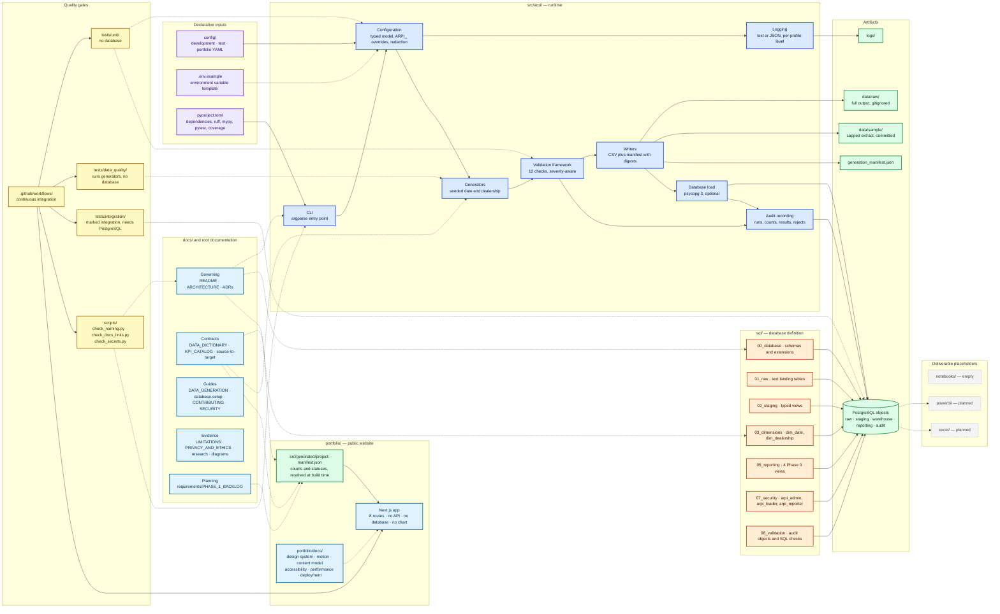

# ARPI — Repository Component Map

Which directory in **Automotive Retail Performance Intelligence (ARPI)** is responsible for what, and
which component owns each artifact.

Use this to answer two questions quickly: *where does this change belong?* and *if this file is wrong,
what produced it?*

---

## Component map

---

## Legend

| Colour | Group |
|---|---|
| Purple | Declarative inputs — configuration and project metadata |
| Blue | Python runtime components in `src/arpi/` |
| Orange | SQL build scripts in `sql/` |
| Green | Artifacts produced by a run |
| Yellow | Quality gates — tests, governance scripts, CI |
| Light blue | Documentation, and the website that renders it |
| Grey, dashed | Placeholder directories for planned deliverables |

Solid arrows are runtime data flow. Dashed arrows are verification, constraint, or planned consumption
relationships — a test exercising code, a script scanning documents, a contract governing an
implementation.

**There is deliberately no arrow from the PostgreSQL objects to `portfolio/`.** The website has no database
connection, no API route, no query interface and no charting library, and it computes no KPI: every number it
shows is a count of repository artifacts resolved at build time into `project-manifest.json`, and the build
fails if a status contradicts the evidence it was read from. See
[`../architecture-decisions/ADR-0009-portfolio-ui-foundation-before-gate-2.md`](../architecture-decisions/ADR-0009-portfolio-ui-foundation-before-gate-2.md).

---

## Artifact ownership

Every generated or tracked artifact has exactly one producer. If an artifact is wrong, this table says
where to look.

| Artifact | Produced by | Tracked in git? |
|---|---|---|
| `data/raw/<profile>/dim_date.csv` | Generators → writers | No — gitignored |
| `data/raw/<profile>/dim_dealership.csv` | Generators → writers | No — gitignored |
| `data/raw/<profile>/generation_manifest.json` | Writers | No — gitignored |
| `data/sample/*.csv` and manifest | Writers, capped at `sample_row_limit` | **Yes** — committed evidence |
| `logs/` | Logging component | No — gitignored |
| `raw.*` tables | `sql/01_raw/` defines · database load populates | Definition yes, data no |
| `staging.*` views | `sql/02_staging/` | Definition only — views hold no data |
| `warehouse.dim_date`, `warehouse.dim_dealership` | `sql/03_dimensions/` defines · database load populates | Definition yes, data no |
| `reporting.vw_*` | `sql/05_reporting/` | Definition only |
| `audit.*` tables | `sql/08_validation/` defines · audit component populates | Definition yes, data no |
| `arpi_admin`, `arpi_loader`, `arpi_reporter` | `sql/07_security/` | Yes |
| Coverage XML | pytest-cov | No — CI artifact |

---

## Where a change belongs

| If you are changing… | Edit | Also update |
|---|---|---|
| A generated column | The generator in `src/arpi/`, plus `sql/03_dimensions/` | `DATA_DICTIONARY.md`, the source-to-target mapping, and the tests |
| A validation rule | The validation framework and `sql/08_validation/` | `DATA_GENERATION.md` and diagram 03's check table |
| A configuration key | The settings model and **all three** profile YAML files | `.env.example` and `CONTRIBUTING.md` |
| A KPI definition | `KPI_CATALOG.md` first | Then the SQL or DAX that implements it |
| A database role or grant | `sql/07_security/` | `docs/database-setup.md` and `SECURITY.md` |
| Anything about the project name | Nothing — read [ADR-0001](../architecture-decisions/ADR-0001-project-identity.md) | A rename requires a superseding ADR |
| A CI command | `.github/workflows/` | `CONTRIBUTING.md` and the README testing section, which must match exactly |

The pattern is consistent: **the contract changes in the same commit as the code**. A pull request that
changes behaviour without changing the document that describes it is incomplete.

---

## Empty by design

Several directories are intentionally empty and are labelled as such everywhere they appear:

| Directory | Why it is empty |
|---|---|
| `notebooks/` | No exploratory analysis has been done. There are no facts to explore yet |
| `powerbi/` | Scope gate 1 blocks Power BI work until fact grains are approved and KPI formulas are written |
| `excel/` | The operating report needs reporting views over facts that do not exist |
| `sql/04_facts/` | Holds a README explaining the boundary, but no DDL. Facts arrive in Phase 1.2 |
| `data/external/` | Public enrichment is planned for Phase 1.1 |
| `docs/findings/` | Findings require analysis, and no analysis has been performed |
| `tests/fixtures/` | Shared fixtures arrive with the Phase 1 facts; Phase 0 tests build their own inputs |

**`portfolio/` is no longer empty.** It holds the website foundation delivered by `P2.4-06`: a Next.js
application, its build-time project manifest, its tests, its own continuous-integration workflow, and its own
documentation set. What is still absent there is the *case study* — the copy, the screenshots, the walkthrough
and the launch material — because Gate 2 is closed and no report page exists. The `/case-study` route is a
locked shell.

**`sql/06_indexes/` is not empty.** It contains `00_indexes.sql`, which creates six secondary indexes that
existing queries actually need and documents, at length, the indexes it deliberately does **not** create.
Further index tuning follows the facts, but the directory is live today.

They are tracked rather than deleted so the intended structure is visible, and each is labelled
`[empty]` or `[planned]` in [`../../ARCHITECTURE.md`](../../ARCHITECTURE.md) §24.

---

## Related

- [`01-system-context.md`](01-system-context.md) — the system boundary
- [`02-phase-0-data-flow.md`](02-phase-0-data-flow.md) — runtime sequence and exit codes
- [`../../CONTRIBUTING.md`](../../CONTRIBUTING.md) — workflow and quality gates
- [`../../ARCHITECTURE.md`](../../ARCHITECTURE.md) §24 — the annotated repository tree

*All data is synthetic. Granite Auto Group is fictional.*
