# ARPI — The Sanitized Public Inventory Listing Lane

The path a **public dealership listing** takes through
**Automotive Retail Performance Intelligence (ARPI)**: from a private workbook that never enters the
repository, through sanitization, validation, the warehouse and the reporting layer, to a
dealership-facing Excel operating report.

This is a **second data lane**, governed by
[ADR-0011](../architecture-decisions/ADR-0011-sanitized-public-inventory-reference-data.md). It shares the
`sql/` tree and the `audit` schema with the synthetic MVP warehouse and shares nothing else — not its
source, not its cadence, not its registry, and not the semantic model.

> **The most important line in this document.** A row in this lane proves that a vehicle listing was
> **visible in a public source at a moment in time**. It does not prove that the vehicle was on the
> ground, that the dealership owned it, what it cost, or what it sold for. Everything below is arranged so
> that no query can quietly claim otherwise.

> **This lane is not synthetic.** `data/sample/` is machine-generated and proves nothing about the world.
> `data/reference/` holds real advertised attributes under a synthetic identity. The two are never mixed
> and never counted together.

---

## Main flow

```mermaid
flowchart TB
    PRIV["Private dealership workbook<br/><b>Never committed. Never in the repository.</b><br/>Original VINs · source URLs · dealership identity"]

    subgraph sanitize["1 · Sanitization — outside the repository"]
        HASH["Deterministic identity<br/>SHA-256 over ARPI|GSA| + normalised VIN<br/><b>One way. No reverse mapping exists.</b>"]
        STRIP["Remove source URL, dealer identity, street address<br/>Resolve store from the fictional registry"]
        GOVERN["Apply the governed contract<br/>19 columns · controlled vocabularies · ranges<br/>Refuse the WHOLE workbook on any failure"]
    end

    SAN["<b>Committed sanitized workbook</b><br/>data/reference/inventory/gsa-00N/&lt;date&gt;/<br/>ARPI_&lt;Store_Descriptor&gt;_Inventory_Sanitized_&lt;yyyy-mm-dd&gt;.xlsx<br/>Declared with its SHA-256 in the contract"]

    subgraph validate["2 · Validation — before anything is loaded"]
        DQ["17 checks · DQ-LST-001 … DQ-LST-017<br/>Fourteen answerable from the workbook alone"]
        CI["scripts/check_reference_data.py<br/><b>Bare interpreter, no dependencies</b><br/>digest · filing · URL · real-VIN · classification"]
    end

    subgraph load["3 · Import — workbook cadence, not pipeline cadence"]
        DIGEST{"File digest<br/>already loaded?"}
        RAW["raw.inventory_listing_snapshot_load<br/>Every business column is text"]
        STG["staging.stg_inventory_listing_snapshot<br/>REJ-TYPE · REJ-NULL · REJ-DOMAIN · REJ-REF · REJ-KEY"]
        CAL["Extend warehouse.dim_date<br/>for the capture dates this fact needs"]
        DIM["warehouse.dim_observed_vehicle<br/>Type 1 · observation window only ever widens"]
        FACT["warehouse.fact_vehicle_listing_snapshot<br/><b>ON CONFLICT DO NOTHING — no UPDATE path</b>"]
    end

    subgraph report["4 · Reporting — six views, counted apart from the twenty-eight"]
        V1["vw_vehicle_listing_current"]
        V2["vw_vehicle_listing_summary"]
        V3["vw_vehicle_listing_model_mix"]
        V4["vw_vehicle_listing_price_completeness"]
        V5["vw_vehicle_listing_observation_span"]
        V6["vw_vehicle_listing_change<br/><b>Removed From Listing, never Sold</b>"]
    end

    XLS["<b>Excel operating report</b><br/>artifacts/inventory/ (gitignored, exported on demand)<br/>README · Summary · Inventory · Model Summary · Snapshot Changes"]

    AUD["audit schema<br/>pipeline_run · rejected_record (redacted)<br/>vw_recon_inventory_listing · RECON-LISTING-001…010"]

    PBI["Power BI semantic model<br/><b>Does not read this lane.</b><br/>Backlog item P2.1-16"]

    PRIV --> HASH --> STRIP --> GOVERN --> SAN
    SAN --> DQ --> DIGEST
    SAN --> CI
    DIGEST -->|"already loaded"| STOP(["No work. Rerun is a no-op."])
    DIGEST -->|"new"| RAW --> STG --> CAL --> DIM --> FACT
    FACT --> V1 & V2 & V3 & V4 & V5 & V6
    V1 & V2 & V3 & V6 --> XLS
    STG -.-> AUD
    FACT -.-> AUD
    FACT -.->|"deliberately not connected"| PBI

    classDef never fill:#fde8e8,stroke:#c53030,stroke-width:2px
    classDef evidence fill:#e6f4ea,stroke:#1e7e34,stroke-width:2px
    classDef absent fill:#f5f5f5,stroke:#999,stroke-dasharray:4 3
    class PRIV never
    class SAN,XLS evidence
    class PBI absent
```



---

## Why the sanitization step is outside the repository

The private workbook is the one artefact that must never be committed, so the step that reads it cannot be
a repository fixture. `scripts/sanitize_inventory_workbook.py` takes a path the operator supplies, and its
output — not its input — is what lands in `data/reference/`.

The sanitizer's **error messages** follow the same rule. A validation failure reports a row number, a
column name and a category, with the offending value **redacted**. A message that helpfully echoed the bad
cell would put an original VIN into a terminal, a CI log, or a pasted bug report, which is exactly the
disclosure the lane exists to prevent.

## Why identity is a hash and not a sequence

```
normalized_vin = uppercase(trim(original VIN))
digest         = SHA256(UTF8("ARPI|GSA|" + normalized_vin)).uppercase_hex
synthetic_vehicle_id = "VEH-" + first 12 hex chars
synthetic_vin        = "ARPI" + first 13 hex chars
```

A sequence would be safe but useless: the same physical vehicle appearing at two group stores would get
two identities, and a cross-store appearance would be invisible. The digest is **group-stable**, so the
same vehicle receives the same identity at every store and on every capture.

Being able to **detect** a cross-store appearance is not the same as being able to **explain** one. ARPI
holds no dealer-trade event and must not infer one.

The `ARPI` prefix is doing real work: `I` is not a permitted character in an ISO 3779 VIN, so **no
identifier this project stores can ever be a valid real VIN**, and a database CHECK constraint enforces
the prefix regardless of what any source claimed.

## Why the fact has no UPDATE path

Every other ARPI fact is loaded with a guarded `ON CONFLICT ... DO UPDATE`, because its source is a
deterministic generator — a corrected row can be recomputed, and the update restores the truth.

A capture is not regenerable. It records what somebody observed at a moment that has passed, and there is
no way to go back and observe it again. An `UPDATE` here would silently rewrite history to match a later
belief about it. So a re-import of a loaded batch is **refused**, and a correction goes through the
supersession procedure in [`../../data/reference/README.md`](../../data/reference/README.md) section 8.

## Why the calendar is extended during the import

`warehouse.dim_date` is conformed, and the fact joins to it on the capture date. A capture date has no
reason to fall inside a synthetic dataset's reporting window — the first one did not, and the fact's inner
join silently dropped every row. The import now extends the calendar for the dates its own fact needs and
reports how many it added, so the failure is impossible rather than merely fixed.

## Why there is no *Sold*

`vw_vehicle_listing_change` compares two captures and emits **New Listing, Still Listed, Removed From
Listing, Price Increase, Price Reduction, Price Unchanged**.

A listing that disappears has disappeared. It may have sold; it may have been wholesaled, moved to another
store, relisted with a different identifier, or pulled because a photo was wrong. The data cannot tell
these apart, and a label that picked one would be a fabrication dressed as a metric. The same reasoning
retires *days in stock*: what this lane can count is **days observed online**, which begins when a listing
first appeared and not when a vehicle arrived.

---

## Where the two lanes diverge

| | MVP warehouse | This lane |
|---|---|---|
| Source | Deterministic generator | Sanitized public listing workbook |
| Committed data | `data/sample/` — synthetic | `data/reference/` — **not** synthetic |
| Cadence | Every pipeline run | Only when an operator imports a workbook |
| Registry | `arpi.ingestion.spec` | `arpi.inventory.spec` |
| Facts | Five | One more, counted apart |
| Dimensions | Eight conformed | One more, deliberately not conformed |
| Reporting views | Twenty-eight | Six more |
| Conflict policy | Guarded `DO UPDATE` | `DO NOTHING`, no UPDATE path |
| Reconciliations | `audit.vw_recon_all`, per run | `audit.vw_recon_inventory_listing`, per import |
| Semantic model | Reads it | **Does not read it** |

`arpi.inventory.spec.INVENTORY_LANE_SQL_FILES` is the single declaration of which SQL files belong to this
lane. The capability register, the portfolio manifest generator and the content-integrity suite all read
that declaration rather than restating it, which is what keeps "five facts, eight dimensions,
twenty-eight views" meaning what the semantic model bound to.

---

## Related

- [`../architecture-decisions/ADR-0011-sanitized-public-inventory-reference-data.md`](../architecture-decisions/ADR-0011-sanitized-public-inventory-reference-data.md) — the decision and the alternatives rejected
- [`../source-to-target/STM-015-inventory-listing-snapshot.md`](../source-to-target/STM-015-inventory-listing-snapshot.md) — column-level mappings and rejection codes
- [`../../data/reference/README.md`](../../data/reference/README.md) — the artifact register, the naming contract, and the supersession procedure
- [`03-initial-dimensional-model.md`](03-initial-dimensional-model.md) — the MVP model this lane is kept separate from
- [`../../PRIVACY_AND_ETHICS.md`](../../PRIVACY_AND_ETHICS.md) — the disclosure boundaries this lane operates under

*The MVP warehouse is synthetic and Granite State Auto Group is fictional. The listings in this lane are
not synthetic: they are real advertised attributes under a synthetic identity, and no row here establishes
a sale, a cost, or a current inventory position.*
