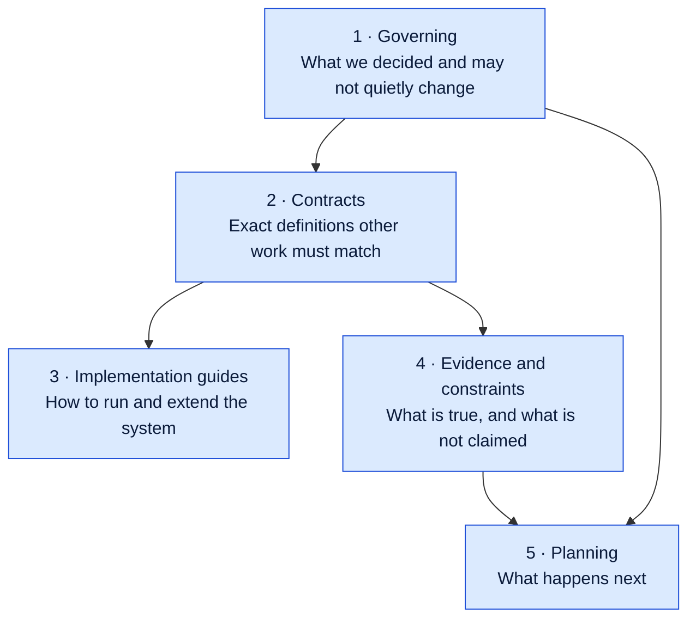

# Documentation Hub

**Automotive Retail Performance Intelligence (ARPI)**

This page is the map. It explains how the documentation is organised, what each document is for, who it is written for, and in what order to read it depending on why you are here.

If you have fifteen minutes, skip to [Reading paths](#reading-paths).

---

## How the documentation is organised

Documents sit in one of five tiers. The tier tells you how much authority a document carries and how often it changes.



1. **Governing** — binding decisions. Architecture and ADRs. Changing one of these requires a deliberate act: a new architecture version or a superseding ADR. Everything else must conform to them.
2. **Contracts** — exact, checkable definitions. Column names, types, KPI formulas, source-to-target lineage. Code and SQL are written against these, and tests enforce them. A contract and the implementation are never allowed to disagree; if they do, one of them is a defect.
3. **Implementation guides** — operational instructions. How to generate data, how to stand up the database, how to contribute. These change whenever the tooling changes.
4. **Evidence and constraints** — the honesty layer. Research that justified the design, the limits of what synthetic data can support, and the privacy and ethics position. Its purpose is to stop the project overclaiming.
5. **Planning** — what is not built yet. Backlogs and phase breakdowns. The most volatile tier by design.

**Status labels** are used identically everywhere in this repository: **Implemented**, **Planned**, **Deferred**, **Out of scope**. They are literal. Nothing labelled Implemented is aspirational.

---

## Tier 1 · Governing

| Document | Purpose | Audience | Status |
|---|---|---|---|
| [`../ARCHITECTURE.md`](../ARCHITECTURE.md) | The binding technical architecture: goals, non-goals, schemas, dimensional model, fact grains, pipeline, security, phases, and scope gates | Technical reviewers, contributors, the author's future self | Implemented — version 1.4, reviewed 2026-07-29 |
| [`architecture-decisions/ADR-0001-project-identity.md`](architecture-decisions/ADR-0001-project-identity.md) | Fixes the project name, short identifier, package, config prefix, and database roles; retires the former working title and defines enforcement | Anyone touching a name, a path, or a role | Accepted |
| [`architecture-decisions/ADR-0002-phase-0-technology-baseline.md`](architecture-decisions/ADR-0002-phase-0-technology-baseline.md) | Records the non-obvious Phase 0 engineering choices and their trade-offs | Technical reviewers, contributors | Accepted |
| [`architecture-decisions/ADR-0009-portfolio-ui-foundation-before-gate-2.md`](architecture-decisions/ADR-0009-portfolio-ui-foundation-before-gate-2.md) | Separates the portfolio UI foundation, which may be built before Gate 2, from the public analytical case study, which may not; records the five controls that enforce the separation | Anyone reviewing the website, or wondering how it coexists with a closed Gate 2 | Accepted |
| [`architecture-decisions/README.md`](architecture-decisions/README.md) | ADR format, `ADR-NNNN-kebab-title.md` convention, required sections, and the index of current records | Contributors writing a new ADR | Implemented |
| [`../README.md`](../README.md) | Project entry point: value proposition, status, stack, structure, and how to run it | Everyone, first | Implemented |

---

## Tier 2 · Contracts

| Document | Purpose | Audience | Status |
|---|---|---|---|
| [`../DATA_DICTIONARY.md`](../DATA_DICTIONARY.md) | Every table and column in the warehouse with names, order, types, nullability, and meaning | Anyone writing SQL, Python, or DAX against the model | Implemented. Exact column contracts for `dim_date` and `dim_dealership`; attribute-level for the other six dimensions, where the DDL is binding |
| [`../KPI_CATALOG.md`](../KPI_CATALOG.md) | Governed KPI definitions — business definition, formula, numerator, denominator, grain, time context, inclusion and exclusion rules, null behaviour, source tables, ownership, limitations | Analysts, reviewers, anyone quoting a number | Definitions written; most measures Planned until the facts exist |
| [`source-to-target/`](source-to-target/) | Source-to-target mappings: how each source field becomes a warehouse column, with transformation rules and lineage | Contributors implementing loads; reviewers auditing lineage | Implemented — all fourteen written, one per MVP entity |

Contracts are the tier most worth reading closely. They are also the tier a reviewer can most easily check against the code, which is the point.

---

## Tier 3 · Implementation guides

| Document | Purpose | Audience | Status |
|---|---|---|---|
| [`../DATA_GENERATION.md`](../DATA_GENERATION.md) | How the synthetic data is produced: seeding, determinism, profiles, the holiday and selling-day rules, the encoded business relationships, and the patterns deliberately avoided | Contributors extending the generator; reviewers assessing realism | Implemented — fourteen generators, one per entity |
| [`database-setup.md`](database-setup.md) | Optional local PostgreSQL setup, role creation, and the ordered SQL build | Contributors running the database layer or the integration tests | Implemented |
| [`../CONTRIBUTING.md`](../CONTRIBUTING.md) | Development workflow, branch and commit conventions, the quality gates, and what CI enforces | Contributors | Implemented |
| [`../SECURITY.md`](../SECURITY.md) | Secret handling, what must never be committed, and how to report a vulnerability | Contributors, security reviewers | Implemented |
| [`diagrams/`](diagrams/) | Source-controlled Mermaid diagrams: system context, Phase 0 data flow, the initial dimensional model, the repository component map, and the sanitized public inventory listing lane | Visual learners; anyone orienting quickly | Implemented |

### Portfolio website

The website under [`../portfolio/`](../portfolio/) is a presentation layer over this documentation set. It has
no API route, no database connection, no query interface and no charting library, it computes no KPI, and it
displays no KPI value. It is governed by [`architecture-decisions/ADR-0009-portfolio-ui-foundation-before-gate-2.md`](architecture-decisions/ADR-0009-portfolio-ui-foundation-before-gate-2.md).
Its own documentation lives beside it, in [`../portfolio/`](../portfolio/) and [`../portfolio/docs/`](../portfolio/docs/).

| Document | Purpose | Audience | Status |
|---|---|---|---|
| [`../portfolio/README.md`](../portfolio/README.md) | What the site is, what it deliberately is not, and how to install, run, test and build it | Anyone running the site locally | Implemented |
| [`../portfolio/docs/DESIGN_SYSTEM.md`](../portfolio/docs/DESIGN_SYSTEM.md) | Design tokens, typography, colour, spacing, elevation, and the component library | Contributors touching the UI | Implemented |
| [`../portfolio/docs/MOTION_SYSTEM.md`](../portfolio/docs/MOTION_SYSTEM.md) | The motion vocabulary, its durations and easings, and the reduced-motion contract | Contributors adding animation | Implemented |
| [`../portfolio/docs/CONTENT_MODEL.md`](../portfolio/docs/CONTENT_MODEL.md) | Where every string and every number on the site comes from, and why no component may hardcode one | Reviewers checking that the site cannot overclaim | Implemented |
| [`../portfolio/docs/ACCESSIBILITY.md`](../portfolio/docs/ACCESSIBILITY.md) | The accessibility target, the automated and manual checks, and the axe results per route | Accessibility reviewers | Implemented |
| [`../portfolio/docs/PERFORMANCE.md`](../portfolio/docs/PERFORMANCE.md) | The performance budget and how the static build is kept within it | Contributors adding weight to a route | Implemented |
| [`../portfolio/docs/DEPLOYMENT.md`](../portfolio/docs/DEPLOYMENT.md) | How the site is built and deployed. **Deployed to Railway `staging`; no production environment exists** | Whoever operates the deployment | Implemented — live verification is **UNVERIFIED** from CI |
| [`../portfolio/docs/VISUAL_REVIEW.md`](../portfolio/docs/VISUAL_REVIEW.md) | The route-by-route visual review record | Reviewers checking the UI against its own rules | Implemented |

---

### Inventory Operations — the sanitized public reference lane

The one part of ARPI whose data is not machine generated, and the documents that govern it.

| Document | What it answers |
|---|---|
| [`architecture-decisions/ADR-0011-sanitized-public-inventory-reference-data.md`](architecture-decisions/ADR-0011-sanitized-public-inventory-reference-data.md) | Why a third data lane exists, what it permits and forbids, and what it may never be presented as |
| [`../data/reference/README.md`](../data/reference/README.md) | The lane's policy: what may be stored, required metadata, sanitization controls, directory and naming conventions, review, supersession and removal |
| [`../config/reference/inventory_listing_contract.yaml`](../config/reference/inventory_listing_contract.yaml) | The versioned workbook contract every consumer reads |
| [`source-to-target/STM-015-inventory-listing-snapshot.md`](source-to-target/STM-015-inventory-listing-snapshot.md) | Workbook to raw to staging to dimension to fact to reporting to Excel |
| [`diagrams/05-inventory-listing-lane.md`](diagrams/05-inventory-listing-lane.md) | The same path as one diagram, with the reasoning behind each boundary |
| [`../KPI_CATALOG.md`](../KPI_CATALOG.md) §38 | The 24 governed Inventory Listings KPIs, and the measures the lane will never define |
| [`../LIMITATIONS.md`](../LIMITATIONS.md) §13 | What a listing snapshot cannot establish |

**Read the boundary first.** Advertised price is not transaction price. A removed listing
is not a sale. Days observed online is not days in stock.

---

## Tier 4 · Evidence and constraints

| Document | Purpose | Audience | Status |
|---|---|---|---|
| [`../LIMITATIONS.md`](../LIMITATIONS.md) | What this dataset and this analysis genuinely cannot support, stated plainly | Everyone, and especially anyone tempted to cite a figure | Implemented |
| [`../PRIVACY_AND_ETHICS.md`](../PRIVACY_AND_ETHICS.md) | Privacy design, prohibited fields, and the ethical analytics commitments — including the rules on employee ranking and protected characteristics | Reviewers, hiring managers, contributors | Implemented |
| [`research.md`](research.md) | The preserved research evidence base: job-market expectations, skill priorities, dealership KPI research, dataset strategy, technology comparison, and the recommendation that produced the architecture | Reviewers wanting to know why the design is what it is | Preserved verbatim — a dated record, not a live document |
| [`findings/`](findings/) | Executive findings memos with supporting evidence | Hiring managers, dealership operators | **Planned** — the directory is empty. The facts exist and every KPI is computable, but nothing has been analysed and Gate 2 gates that work |

`research.md` is deliberately not maintained. It records what was researched and recommended at the time, including the working project name that ADR-0001 subsequently retired. Reading it against the current architecture is a feature: it shows where the design followed the research and where it departed from it.

---

## Tier 5 · Planning

| Document | Purpose | Audience | Status |
|---|---|---|---|
| [`requirements/PHASE_1_BACKLOG.md`](requirements/PHASE_1_BACKLOG.md) | Task-level breakdown of delivery increments `P1.1` through `P1.5`, with acceptance criteria and the Gate 1 checklist | Contributors picking up work | Implemented — all twenty-seven items complete |
| [`requirements/PHASE_2_BACKLOG.md`](requirements/PHASE_2_BACKLOG.md) | Task-level breakdown of delivery increments `P2.1` through `P2.4` — semantic model, dashboard pages, findings and the Gate 2 review, portfolio packaging — with the Gate 2 checklist | Contributors picking up work; reviewers checking Gate 2 | Implemented — `P2.1` delivered except its real-engine validation, **pending on both accepted paths**; `P2.2`–`P2.4` Not started |
| [`requirements/STAKEHOLDER_QUESTIONS.md`](requirements/STAKEHOLDER_QUESTIONS.md) | Persona → business question → KPI → reporting view → report page traceability, including the four questions the MVP cannot answer | Reviewers checking Gate 4; anyone asking what the platform can answer | Implemented |
| [`requirements/GATE_1_READINESS.md`](requirements/GATE_1_READINESS.md) | The formal Gate 1 evaluation: twenty-three conditions, each with evidence, a test or query, limitations, and a verdict | Anyone deciding whether Power BI work may begin | Implemented — verdict **OPEN** |
| [`powerbi/POWER_BI_DESKTOP_HANDOFF.md`](powerbi/POWER_BI_DESKTOP_HANDOFF.md) | One of the two accepted routes through the `P2.1` real-engine validation gate: open, refresh, save and validate the semantic model in Power BI Desktop, which GitHub Actions cannot do. The other route is the Microsoft Fabric Service, per [`architecture-decisions/ADR-0008-real-engine-validation-paths.md`](architecture-decisions/ADR-0008-real-engine-validation-paths.md) | Whoever runs the Desktop validation | Implemented — the validation itself is **pending**, as is the Fabric path |
| [`index.md`](index.md) | This page | Everyone | Implemented |

---

## Reading paths

### Hiring manager — about 15 minutes

You want to know what was built, whether it is real, and whether the judgement behind it is sound.

| # | Read | Minutes | What you get |
|---|---|---|---|
| 1 | [`../README.md`](../README.md) — through **Current implementation status** | 6 | The problem, the approach, and an honest table of exactly what exists and what does not |
| 2 | [`diagrams/01-system-context.md`](diagrams/01-system-context.md) | 2 | The whole system on one screen, implemented and planned distinguished |
| 3 | [`../KPI_CATALOG.md`](../KPI_CATALOG.md) — skim two or three definitions | 4 | Whether the domain knowledge is genuine. Gross per retail unit and show rate are the revealing ones |
| 4 | [`../LIMITATIONS.md`](../LIMITATIONS.md) | 3 | Whether the author knows what their own work does not prove |

**If you only read one thing:** the Current implementation status table in the README. It is the whole claim, and it is deliberately unflattering where it needs to be.

### Technical reviewer — about 45 minutes

You want to assess the modelling, the engineering, and whether the documentation matches the code.

| # | Read | Minutes | What to look for |
|---|---|---|---|
| 1 | [`../README.md`](../README.md) | 5 | Scope and status |
| 2 | [`../ARCHITECTURE.md`](../ARCHITECTURE.md) §§1–14 | 12 | Layer separation, dimensional model, declared fact grains, SCD policy |
| 3 | [`../DATA_DICTIONARY.md`](../DATA_DICTIONARY.md) — `dim_date` and `dim_dealership` | 6 | Whether the documented columns match the SQL and the generator exactly. They should, to the column order |
| 4 | [`diagrams/03-initial-dimensional-model.md`](diagrams/03-initial-dimensional-model.md) | 3 | The implemented model against the planned facts |
| 5 | [`../DATA_GENERATION.md`](../DATA_GENERATION.md) | 8 | Determinism, seeding, and the encoded relationships — this is where synthetic data usually falls apart |
| 6 | [`architecture-decisions/ADR-0002-phase-0-technology-baseline.md`](architecture-decisions/ADR-0002-phase-0-technology-baseline.md) | 5 | Whether the engineering choices were reasoned or defaulted |
| 7 | [`source-to-target/`](source-to-target/) | 4 | Lineage traceability |
| 8 | [`../LIMITATIONS.md`](../LIMITATIONS.md) | 2 | Calibration between claims and reality |

**Worth checking:** all twelve validation `check_id` values in the audit contract appear identically in the Python validation framework and the data dictionary, and **ten of the twelve** also appear in the SQL checks. That consistency is the point of the contracts tier. The two exceptions are `DQ-GEN-001` and `DQ-GEN-002`: both inspect the generator's in-memory output — the declared-versus-actual column schema, and the content digest of the CSV rendering — so there is nothing for SQL to look at. They are Python-only by design, not by omission.

### Reviewer who would rather read the website than the repository — about 10 minutes

You do not want to clone 22,000 lines of Markdown. You want the same claims rendered, in order, in a browser.

**Read this first:** the site is deployed to Railway's `staging` environment at
[`https://arpi.up.railway.app`](https://arpi.up.railway.app), from the configuration reviewable in
[`../deployment/railway/README.md`](../deployment/railway/README.md); no production environment exists. **A
reachable website is not a running analytical platform.** The site has no database connection, so it is
evidence that a static build is served and nothing more: PostgreSQL is still **declared and unprovisioned**,
and no engine has run the semantic model. The three statuses are held apart in
[`../deployment/evidence/portfolio_deployment.json`](../deployment/evidence/portfolio_deployment.json). The
site also shows **no KPI value, no dashboard screenshot and no finding** — it renders definitions, structure
and status, and its `/case-study` route is **locked** because Gate 2 is closed.

| # | Do this | Minutes | What you get |
|---|---|---|---|
| 1 | Open [`https://arpi.up.railway.app`](https://arpi.up.railway.app), or follow [`../portfolio/README.md`](../portfolio/README.md) to run it locally | 1 | The deployed site, or a local build with its project manifest generated from repository evidence |
| 2 | `/` then `/status` | 3 | The honest status in the hero, and then route by route: what exists, what is pending, and what the evidence for each is |
| 3 | `/architecture` and `/data-model` | 2 | The pipeline layer by layer, and the dimensions, facts and declared grains |
| 4 | `/kpis` and `/governance` | 2 | Every governed KPI **definition**, searchable — and the gates, the privacy position and the synthetic-data policy |
| 5 | `/case-study` | 1 | The locked shell, with Gate 2's three unmet conditions and the evidence for each |

**If you only look at one route:** `/status`. It is generated from the same files the README is written
against, and the build fails if it states something those files contradict.

### Contributor

You are going to change something. Read in this order and do not skip step 1.

| # | Read | Why |
|---|---|---|
| 1 | [`../CONTRIBUTING.md`](../CONTRIBUTING.md) | Workflow, standards, and the exact commands CI runs |
| 2 | [`architecture-decisions/ADR-0001-project-identity.md`](architecture-decisions/ADR-0001-project-identity.md) | Naming is mechanically enforced; getting a name wrong fails the build |
| 3 | [`architecture-decisions/ADR-0002-phase-0-technology-baseline.md`](architecture-decisions/ADR-0002-phase-0-technology-baseline.md) | The tooling baseline, and why the alternatives were rejected |
| 4 | [`../ARCHITECTURE.md`](../ARCHITECTURE.md) §§6, 10, 11, 12, 24, 28, 35 | Non-goals, layers, model, repository layout, scope gates, and when an ADR is required |
| 5 | [`../DATA_DICTIONARY.md`](../DATA_DICTIONARY.md) and [`../KPI_CATALOG.md`](../KPI_CATALOG.md) | The contracts your change must not break |
| 6 | [`database-setup.md`](database-setup.md) | Only if you are touching SQL or the integration tests |
| 7 | [`requirements/PHASE_1_BACKLOG.md`](requirements/PHASE_1_BACKLOG.md) | Find work that is already scoped |
| 8 | [`diagrams/04-repository-component-map.md`](diagrams/04-repository-component-map.md) | Which directory owns which artifact |

**Before opening a pull request**, run the full gate locally:

```
ruff format --check .
ruff check .
mypy src tests
pytest -m "not integration" --cov=arpi --cov-report=term-missing --cov-report=xml
python scripts/check_naming.py
python scripts/check_docs_links.py
python scripts/check_secrets.py
```

**If your change adds a column, a KPI, or a table**, the contract document changes in the same commit as the code. A pull request that changes behaviour without changing the contract will be sent back.

---

## Complete document index

| Document | Tier |
|---|---|
| [`../README.md`](../README.md) | Governing |
| [`../ARCHITECTURE.md`](../ARCHITECTURE.md) | Governing |
| [`architecture-decisions/README.md`](architecture-decisions/README.md) | Governing |
| [`architecture-decisions/ADR-0001-project-identity.md`](architecture-decisions/ADR-0001-project-identity.md) | Governing |
| [`architecture-decisions/ADR-0002-phase-0-technology-baseline.md`](architecture-decisions/ADR-0002-phase-0-technology-baseline.md) | Governing |
| [`architecture-decisions/ADR-0008-real-engine-validation-paths.md`](architecture-decisions/ADR-0008-real-engine-validation-paths.md) | Governing |
| [`architecture-decisions/ADR-0009-portfolio-ui-foundation-before-gate-2.md`](architecture-decisions/ADR-0009-portfolio-ui-foundation-before-gate-2.md) | Governing |
| [`../DATA_DICTIONARY.md`](../DATA_DICTIONARY.md) | Contracts |
| [`../KPI_CATALOG.md`](../KPI_CATALOG.md) | Contracts |
| [`source-to-target/README.md`](source-to-target/README.md) | Contracts |
| [`source-to-target/STM-000-template.md`](source-to-target/STM-000-template.md) | Contracts |
| [`source-to-target/STM-001-dim-date.md`](source-to-target/STM-001-dim-date.md) | Contracts |
| [`source-to-target/STM-002-dim-dealership.md`](source-to-target/STM-002-dim-dealership.md) | Contracts |
| [`source-to-target/STM-003-audit-metadata.md`](source-to-target/STM-003-audit-metadata.md) | Contracts |
| [`../DATA_GENERATION.md`](../DATA_GENERATION.md) | Implementation guides |
| [`database-setup.md`](database-setup.md) | Implementation guides |
| [`../CONTRIBUTING.md`](../CONTRIBUTING.md) | Implementation guides |
| [`../SECURITY.md`](../SECURITY.md) | Implementation guides |
| [`../sql/README.md`](../sql/README.md) | Implementation guides |
| [`../sql/04_facts/README.md`](../sql/04_facts/README.md) | Implementation guides |
| [`../config/README.md`](../config/README.md) | Implementation guides |
| [`../scripts/README.md`](../scripts/README.md) | Implementation guides |
| [`../data/sample/README.md`](../data/sample/README.md) | Implementation guides |
| [`diagrams/README.md`](diagrams/README.md) | Implementation guides |
| [`diagrams/01-system-context.md`](diagrams/01-system-context.md) | Implementation guides |
| [`diagrams/02-phase-0-data-flow.md`](diagrams/02-phase-0-data-flow.md) | Implementation guides |
| [`diagrams/03-initial-dimensional-model.md`](diagrams/03-initial-dimensional-model.md) | Implementation guides |
| [`diagrams/04-repository-component-map.md`](diagrams/04-repository-component-map.md) | Implementation guides |
| [`diagrams/05-inventory-listing-lane.md`](diagrams/05-inventory-listing-lane.md) | Implementation guides |
| [`../data/reference/README.md`](../data/reference/README.md) | Evidence and constraints |
| [`source-to-target/STM-015-inventory-listing-snapshot.md`](source-to-target/STM-015-inventory-listing-snapshot.md) | Contracts |
| [`../LIMITATIONS.md`](../LIMITATIONS.md) | Evidence and constraints |
| [`../PRIVACY_AND_ETHICS.md`](../PRIVACY_AND_ETHICS.md) | Evidence and constraints |
| [`research.md`](research.md) | Evidence and constraints |
| [`requirements/README.md`](requirements/README.md) | Planning |
| [`requirements/PHASE_1_BACKLOG.md`](requirements/PHASE_1_BACKLOG.md) | Planning |
| [`requirements/PHASE_2_BACKLOG.md`](requirements/PHASE_2_BACKLOG.md) | Planning |
| [`requirements/DOCUMENTATION_BACKLOG.md`](requirements/DOCUMENTATION_BACKLOG.md) | Planning |
| [`requirements/STAKEHOLDER_QUESTIONS.md`](requirements/STAKEHOLDER_QUESTIONS.md) | Planning |
| [`requirements/GATE_1_READINESS.md`](requirements/GATE_1_READINESS.md) | Planning |
| [`powerbi/POWER_BI_DESKTOP_HANDOFF.md`](powerbi/POWER_BI_DESKTOP_HANDOFF.md) | Operations |
| [`../powerbi/model_documentation/`](../powerbi/model_documentation/) | Design |
| [`../portfolio/README.md`](../portfolio/README.md) | Implementation guides |
| [`../portfolio/docs/`](../portfolio/docs/) | Implementation guides — seven website engineering records |
| [`index.md`](index.md) | Planning |
| [`cloud-database-setup.md`](cloud-database-setup.md) | Implementation guides |

---

*All data referenced in this documentation is synthetic. Granite Auto Group is fictional. See [`../PRIVACY_AND_ETHICS.md`](../PRIVACY_AND_ETHICS.md).*
