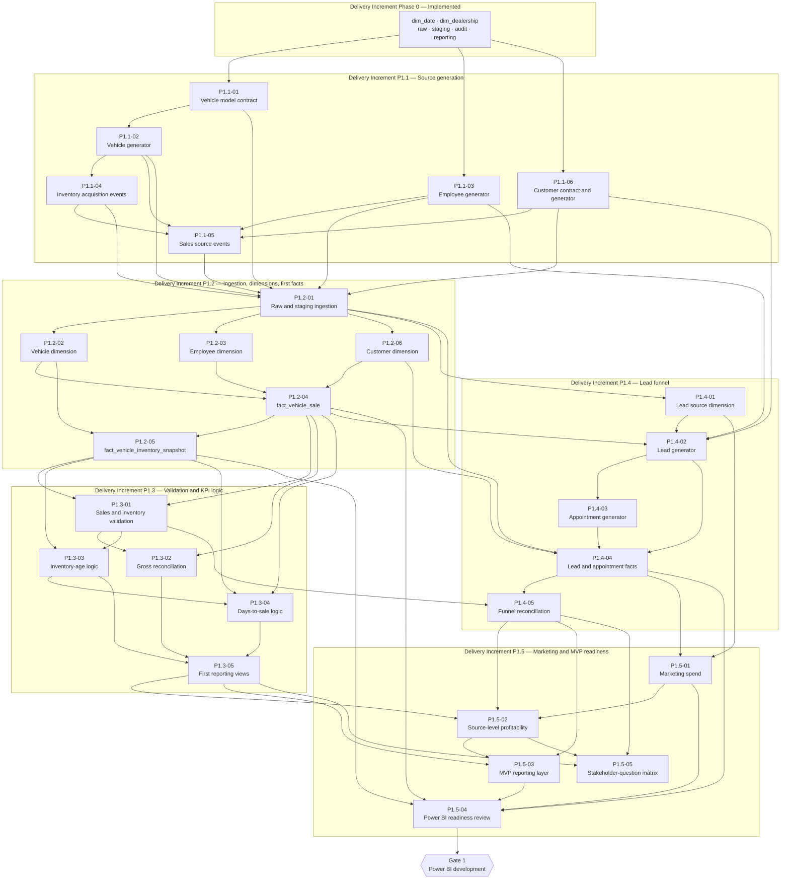

# Phase 1 Backlog — ARPI

**Project:** Automotive Retail Performance Intelligence (ARPI)
**Owner:** Michael Palmer
**Version:** 1.1
**Last reviewed:** 2026-07-28
**Conventions:** [README.md](README.md) · **Parent documents:** [ARCHITECTURE.md](../../ARCHITECTURE.md) · [DATA_DICTIONARY.md](../../DATA_DICTIONARY.md) · [KPI_CATALOG.md](../../KPI_CATALOG.md) · [DATA_GENERATION.md](../../DATA_GENERATION.md)

> **No item in this backlog carries an hour, day, week, or sprint estimate.** Complexity is recorded as
> `Small`, `Medium`, or `Large` only. See [README.md §3.3](README.md).

> **Terminology.** `P1.1` through `P1.5` are **delivery increments**, not lifecycle phases. The eight
> numbered phases in [ARCHITECTURE.md §27](../../ARCHITECTURE.md) are **lifecycle phases** and mean
> something different. [ARCHITECTURE.md §27.1](../../ARCHITECTURE.md) is the authoritative definition and
> carries the mapping in both directions;
> [ADR-0003](../architecture-decisions/ADR-0003-delivery-increment-terminology.md) records why the
> existing identifiers were disambiguated rather than renumbered. Item identifiers such as `P1.2-04` are
> permanent and are never reused or renumbered ([README.md §3.1](README.md)).

---

## 1. Gate 1 readiness checklist

[ARCHITECTURE.md §28](../../ARCHITECTURE.md), **Gate 1** — *no Power BI development begins until:*

| # | Condition | Current status | Evidence |
|---:|---|---|---|
| 1 | **Fact grains are approved** | ✅ **Met** | All five MVP facts are built, populated and **constrained**: `uq_fact_vehicle_sale_sale_id`, `uq_fact_vehicle_inventory_snapshot_grain (snapshot_date_key, dealership_key, vehicle_key)`, `uq_fact_lead_lead_id`, `uq_fact_appointment_appointment_id`, `uq_fact_marketing_spend_grain (month_date_key, dealership_key, campaign_key)`. `tests/integration/test_gate1_readiness.py` reads the constraint columns from `pg_constraint`, compares them with the declared grain, and asserts the loaded data satisfies it. Closed by `P1.2-04`, `P1.2-05`, `P1.4-04`, `P1.5-01`. |
| 2 | **Dimensions are documented** | ✅ **Met** | All eight MVP dimensions are built and populated. Each declares its grain in `COMMENT ON TABLE` and documents **every** column in `COMMENT ON COLUMN`, asserted against `pg_attribute`. Each has a source-to-target mapping (`STM-001`…`STM-014`). [DATA_DICTIONARY.md](../../DATA_DICTIONARY.md) still documents six of the eight at attribute level with indicative types; the binding column contract for those six is the DDL, and that depth gap is recorded as a surviving limitation in [GATE_1_READINESS.md §4](GATE_1_READINESS.md). |
| 3 | **KPI formulas are documented** | ✅ **Met** | [KPI_CATALOG.md](../../KPI_CATALOG.md) specifies 29 KPIs with every field. **All 29 are now `Implemented`** — computable from `reporting` and each verified against an independent derivation from `warehouse` by `tests/integration/test_kpi_verification.py`. Four catalogue fields were corrected in the process; see [KPI_CATALOG.md §37.1](../../KPI_CATALOG.md). |

**Gate 1 verdict: OPEN**, recorded on 2026-07-29 in [GATE_1_READINESS.md](GATE_1_READINESS.md), which
evaluates twenty-three conditions individually with the query or test that proves each one. Power BI
development may begin on the seven unblocked report pages. The F&I Performance page, the Customer and
Service Opportunities page, and the target-attainment component of the Executive Overview remain blocked by
Deferred facts rather than by anything this review found.

**No Power BI artefact exists.** `tests/integration/test_gate1_readiness.py::test_no_power_bi_artefact_has_been_built`
fails the build if a `.pbix`, `.pbip`, `.pbit`, `.tmdl` or `.bim` file appears, so the gate stays enforced
until that test is deliberately and visibly changed.

---

## 2. Delivery Increment P1.1 — Source generation for vehicles, employees, customers, inventory, and sales

*Architecture build-order steps 6 and 7 ([ARCHITECTURE.md §34](../../ARCHITECTURE.md)).*

---

### `P1.1-01` — Vehicle model contract and catalogue

| Field | Value |
|---|---|
| **Purpose** | Establish the configuration-level vehicle dimension that every physical vehicle, inventory snapshot, and sale resolves to. Without a governed model catalogue, model and trim analysis, days-supply by model, and franchise alignment are all ungroupable — and `docs/research.md` §4.7 makes model and trim performance a core analytical requirement. |
| **Dependencies** | None |
| **Estimated complexity** | **Medium** |
| **Blocks Power BI Gate 1** | **Yes** |
| **Architecture references** | §11.2 (`dim_vehicle_model`), §15.3 (relationship 11: high-volume models with compressed gross), §16.1–16.2 (vPIC enrichment boundaries), §34 step 6 |

**Acceptance criteria**

- [ ] `warehouse.dim_vehicle_model` DDL exists in `sql/03_dimensions/` with the declared grain **one row per model-year, make, model, trim combination** enforced by a unique constraint on `(model_year, make, model, trim)`, treating NULL `trim` as a distinct value.
- [ ] A deterministic model catalogue exists covering at minimum Chevrolet and Subaru franchise models plus a used-only long tail, with `franchise_alignment` set to `Chevrolet`, `Subaru`, or NULL.
- [ ] `vehicle_class`, `body_style`, `fuel_type`, and `drivetrain` are populated for every row from a declared enumeration.
- [ ] `drivetrain` distribution is non-uniform and reflects the New England market (elevated AWD share), and the declared distribution is logged at generation time.
- [ ] `vehicle_model_key` is a deterministic ordinal over the natural composite, stable across regenerations.
- [ ] Every row carries `source_system = 'arpi_synthetic_generator'`.
- [ ] `DQ-GEN-001` and `DQ-GEN-002` pass for the entity; `content_digest` is recorded in `generation_manifest.json`.
- [ ] Adding this entity leaves `dim_date` and `dim_dealership` digests **unchanged**, proving the per-entity sub-seed contract ([DATA_GENERATION.md §3.3](../../DATA_GENERATION.md)).
- [ ] No NHTSA vPIC call is made — `features.enable_public_vehicle_enrichment` stays `false` and no network access occurs during generation.
- [ ] [DATA_DICTIONARY.md §11](../../DATA_DICTIONARY.md) is updated from attribute-level to an exact column contract, and `docs/source-to-target/STM-004-dim-vehicle-model.md` is written.

**Tests required**

- `tests/unit/test_vehicle_model_generator.py` — natural-key uniqueness, deterministic key assignment, enumeration conformance, franchise alignment derived from make.
- `tests/data_quality/test_vehicle_model_distributions.py` — non-uniform drivetrain and body-style distributions; declared distributions logged.
- `tests/data_quality/test_seed_isolation.py` — adding this entity does not change existing entities' digests.
- `tests/integration/test_dim_vehicle_model_load.py` — DDL load, unique constraint enforcement, idempotent rerun.

---

### `P1.1-02` — Vehicle generator

| Field | Value |
|---|---|
| **Purpose** | Produce the physical inventory units that every inventory snapshot and every sale references. This is the entity that makes "sales without inventory or vehicle records" — a prohibited synthetic pattern — structurally impossible. |
| **Dependencies** | `P1.1-01` |
| **Estimated complexity** | **Large** |
| **Blocks Power BI Gate 1** | **Yes** |
| **Architecture references** | §11.2 (`dim_vehicle`), §15.3 (relationships 3, 9, 11), §15.4 (no sales without vehicle records; no identical vehicle-aging behaviour across models), §16.2 (VIN controls), §34 step 6 |

**Acceptance criteria**

- [ ] `warehouse.dim_vehicle` DDL exists with the declared grain **one row per unique physical vehicle**.
- [ ] Every vehicle resolves to exactly one `dim_vehicle_model` row via `vehicle_model_key`, enforced by a foreign key.
- [ ] `vehicle_id` follows the reserved scheme `VEH-#######`, assigned by deterministic sequence.
- [ ] `synthetic_vin` is 17 characters, structurally VIN-like, **unique across the dimension**, and **provably not derived from any real VIN** — the generator makes no network call and holds no real-VIN reference data.
- [ ] `vehicle_condition = 'New'` implies `odometer_band = 'New'` and `vehicle_source IN ('Manufacturer Allocation','Dealer Trade')`, asserted by validation.
- [ ] Certified units are Used units at a franchise store only; the independent used store (`GSA-003`) produces no manufacturer-certified unit.
- [ ] New / used / certified mix differs by store, consistent with the fixed store types.
- [ ] Volume is within the `portfolio` target of 8,000 to 15,000 vehicles at portfolio scale, and approximately 5% of that at development scale.
- [ ] A new PII schema check confirms `dim_vehicle` contains no prohibited column.
- [ ] [DATA_DICTIONARY.md §10](../../DATA_DICTIONARY.md) updated to an exact column contract; `docs/source-to-target/STM-005-dim-vehicle.md` written.

**Tests required**

- `tests/unit/test_vehicle_generator.py` — identifier format and uniqueness, VIN length and uniqueness, condition/odometer/source consistency, deterministic reproduction from a fixed seed.
- `tests/data_quality/test_vehicle_distributions.py` — non-uniform colour, trim, and condition distributions; per-store mix differences; volume within scale targets.
- `tests/data_quality/test_vehicle_privacy.py` — no prohibited column; no real-VIN reference data present in the package.
- `tests/integration/test_dim_vehicle_load.py` — FK to `dim_vehicle_model` resolves; unique index on `synthetic_vin`; idempotent rerun.

---

### `P1.1-03` — Employee generator

| Field | Value |
|---|---|
| **Purpose** | Produce the complete synthetic staff population — salespeople, BDC representatives, desk managers, and finance managers — with the tenure and department attributes that [ARCHITECTURE.md §23](../../ARCHITECTURE.md) requires before any employee performance figure may be displayed. Fairness context is a data requirement, not a reporting afterthought. |
| **Dependencies** | None (uses `dim_dealership` and `dim_date`, both Implemented) |
| **Estimated complexity** | **Medium** |
| **Blocks Power BI Gate 1** | **Yes** |
| **Architecture references** | §11.2 (`dim_employee`), §14 (Type 2 required for employee), §15.3 (relationship 8: employees differ in volume, closing rate, gross retention, CRM discipline), §22.4 (privacy design), §23 (employee scorecard fairness), §34 step 6 |

**Acceptance criteria**

- [ ] `warehouse.dim_employee` DDL exists with the declared grain **one row per employee role-assignment version (SCD Type 2)**, with `effective_date`, `expiration_date`, `is_current`, and `attribute_hash`.
- [ ] `attribute_hash` uses the same construction as `dim_dealership` ([DATA_DICTIONARY.md §7.3](../../DATA_DICTIONARY.md)): pipe-joined tracked attributes, UTF-8, SHA-256 hex.
- [ ] A partial unique index on `employee_id WHERE is_current` enforces at most one current version per person.
- [ ] `employee_id` follows the reserved scheme `EMP-#####`.
- [ ] **No name, compensation, pay-plan, commission, or contact field exists in the schema**, verified by a schema-inspecting check, not merely by inspecting values.
- [ ] `tenure_band` is derived from `hire_date` and takes one of the four declared bands.
- [ ] `hire_date` is on or after the assigned store's `opened_date`; `termination_date`, where present, is on or after `hire_date`.
- [ ] Per-employee latent performance parameters exist and **differ between employees** — identical employee performance is a prohibited synthetic pattern.
- [ ] Headcount is within the target of 35 to 50 at portfolio scale, distributed across the three stores and the declared departments.
- [ ] At least one employee has more than one SCD2 version (a store or role change), so the expire-and-insert path is exercised by real generated data rather than only by unit tests.
- [ ] [DATA_DICTIONARY.md §8](../../DATA_DICTIONARY.md) updated to an exact column contract; `docs/source-to-target/STM-006-dim-employee.md` written.

**Tests required**

- `tests/unit/test_employee_generator.py` — identifier format, tenure-band derivation, hire/termination ordering, hire date within store lifetime, latent parameter variance.
- `tests/unit/test_employee_scd2.py` — hash construction, expire-and-insert on change, no-op on unchanged hash.
- `tests/data_quality/test_employee_privacy.py` — schema contains no name, compensation, or contact column.
- `tests/integration/test_dim_employee_load.py` — partial unique index on current rows, non-overlapping version ranges, idempotent rerun.

---

### `P1.1-04` — Inventory acquisition events

| Field | Value |
|---|---|
| **Purpose** | Produce the acquisition event — date, store, cost, reconditioning, initial asking price — that starts every unit's inventory life. This event is the origin of inventory age, days to sale, and inventory investment; without it none of the nine inventory KPIs can be computed. |
| **Dependencies** | `P1.1-02` |
| **Estimated complexity** | **Large** |
| **Blocks Power BI Gate 1** | **Yes** |
| **Architecture references** | §12.2 (snapshot fact measures), §15.3 (relationships 1, 2, 9, 10), §15.4 (no identical vehicle-aging behaviour across models), §18.2 (inventory age, days to sale), §21.2 (inventory age is non-negative), §34 step 7 |

**Acceptance criteria**

- [ ] An acquisition event exists for every vehicle, carrying acquisition date, store, `acquisition_cost`, `reconditioning_cost`, `original_asking_price`, `msrp` (nullable for used), and acquisition source.
- [ ] Acquisition dates fall within the profile's reporting window or a documented pre-window warm-up period, so that units already aged at window start exist and inventory-age measures are not artificially depressed on day one.
- [ ] Acquisition volume exhibits **seasonality** and **day-of-week structure**; monthly activity is not flat.
- [ ] Acquisition cost is correlated with model, model year, and condition, **with residual variance** — no perfect correlation.
- [ ] `reconditioning_cost` is zero or near-zero for new units and materially non-zero for used units.
- [ ] Aging propensity **differs by model** — identical vehicle-aging behaviour across models is prohibited.
- [ ] Monetary values are `numeric`, rounded to two decimals as the final step.
- [ ] Every acquisition resolves to an existing `vehicle_id` and `dealership_id`.
- [ ] Independent used store `GSA-003` produces no `Manufacturer Allocation` acquisitions.

**Tests required**

- `tests/unit/test_acquisition_generator.py` — one acquisition per vehicle, non-negative costs, store/source consistency, deterministic reproduction.
- `tests/data_quality/test_acquisition_distributions.py` — seasonality present, monthly activity not flat, cost correlated with model and year but not deterministic, per-model aging propensity differs.
- `tests/data_quality/test_acquisition_referential.py` — every acquisition resolves to a vehicle and a store.

---

### `P1.1-06` — Synthetic customer contract and generator

> **Sequence note.** This item carries a later identifier than `P1.1-05` because identifiers are allocated
> at creation time and are permanent ([README.md §3.1](README.md)). It is placed here because it **precedes**
> `P1.1-05` in the dependency order: a retail sale cannot be generated without a customer to attach it to.

| Field | Value |
|---|---|
| **Purpose** | Produce the synthetic customer population that retail sales, leads, and appointments all resolve to, under an explicit privacy contract. `warehouse.dim_customer` carries the project's most privacy-sensitive schema, and until now it was delivered as a sub-clause of a fact-table item ([DOCUMENTATION_BACKLOG.md](DOCUMENTATION_BACKLOG.md) `DOC-04`). A dimension whose defining property is what it must *not* contain needs its own acceptance criteria and its own review, because the failure mode is a column nobody noticed. |
| **Dependencies** | None (uses `dim_dealership` and `dim_date`, both Implemented) |
| **Estimated complexity** | **Medium** |
| **Blocks Power BI Gate 1** | **Yes** |
| **Architecture references** | §11.2 (`warehouse.dim_customer` grain, key attributes, prohibited fields), §14 (Type 1), §15.4 (prohibited synthetic patterns), §22.1 (data classification), §22.4 (privacy design), §23 (ethical analytics requirements), §34 step 6 |

**Acceptance criteria**

- [ ] A `customer` source entity is generated by a `BaseGenerator` subclass with its own seed namespace, so that adding it leaves every existing entity's `content_digest` unchanged.
- [ ] `customer_id` follows the reserved scheme `CUS-########` and `household_id` follows `HH-########`, both assigned by deterministic sequence and zero-padded.
- [ ] The declared columns are exactly: `customer_id`, `household_id`, `age_band`, `county`, `state_code`, `market_area`, `customer_type`, `is_prior_customer`, `is_service_customer`, `first_interaction_date`, `source_system`. No other column is emitted.
- [ ] `age_band` takes one of `18-24`, `25-34`, `35-44`, `45-54`, `55-64`, `65+`. **The underlying exact age is never emitted, and no date of birth of any kind is generated or stored.**
- [ ] **Geography stops at county and market area.** `county` is one of `Hillsborough`, `Rockingham`, `Merrimack`, `Strafford`, `Middlesex`, `Essex`; `state_code` is `NH` or `MA`; `market_area` is `Southern New Hampshire` or `Northern Massachusetts`. No street address, no postal code, no latitude or longitude, and no other finer geographic resolution exists anywhere in the entity.
- [ ] **None of the following appears as a column, as part of a column, or in any emitted value:** personal name (given, family, full, or preferred), full birth date, street address, personal email address, phone number, Social Security number, driver's licence number, bank information, payment-card information, exact credit score or any credit-report field, any protected characteristic (race, ethnicity, gender, religion, marital status, national origin, disability, veteran status, sexual orientation, or age as an exact value), and free-form notes, comments, or any other communication content.
- [ ] Multiple customers may share a `household_id`, so household-level analysis is possible without any household attribute that identifies a person.
- [ ] `customer_type` is `Retail` or `Business`; `is_prior_customer` and `is_service_customer` are populated for every row.
- [ ] `first_interaction_date` is on or after the earliest store `opened_date` and within or before the profile's reporting window.
- [ ] Customer attributes are **non-uniform** — age band, county, and customer type distributions differ from a flat distribution, and the declared distributions are logged at generation time.
- [ ] Customer volume matches the profile's `generation.entity_scale` target and is generated at `test` and `development` scale only; portfolio scale is never generated in CI.
- [ ] Every row carries `source_system = 'arpi_synthetic_generator'`.
- [ ] The generalised prohibited-column check runs against the generated frame **and** against the declared column tuple **and** against the written CSV header, and fails closed — an unrecognised column is a failure, not a warning.
- [ ] [DATA_DICTIONARY.md §9](../../DATA_DICTIONARY.md) is updated from attribute level to an exact column contract, and `docs/source-to-target/STM-007-dim-customer.md` is written.
- [ ] [PRIVACY_AND_ETHICS.md](../../PRIVACY_AND_ETHICS.md) records the customer privacy contract, including the geography ceiling and the age-band-only rule.

**Tests required**

- `tests/unit/test_customer_generator.py` — identifier format and uniqueness, household grouping, enumeration conformance, `first_interaction_date` bounds, deterministic reproduction from a fixed seed.
- `tests/data_quality/test_customer_privacy.py` — **a dedicated privacy test**: asserts the exact declared column set, asserts that every prohibited token above is absent from the schema, and asserts that no value in any column matches an email, phone, or postal-code shaped pattern.
- `tests/data_quality/test_customer_distributions.py` — non-uniform age-band, county, and customer-type distributions; declared distributions logged.
- `tests/data_quality/test_seed_isolation.py` — adding this entity does not change any existing entity's `content_digest`.

---

### `P1.1-05` — Sales source events

| Field | Value |
|---|---|
| **Purpose** | Produce the deal events that become `fact_vehicle_sale`: sale date, delivery date, price, gross components, deal type, and participating employees. This is the single most consequential generator in the project — nine of the twenty-nine specified KPIs read directly from it, and every gross measure depends on its arithmetic being right. |
| **Dependencies** | `P1.1-02`, `P1.1-03`, `P1.1-04`, `P1.1-06` |
| **Estimated complexity** | **Large** |
| **Blocks Power BI Gate 1** | **Yes** |
| **Architecture references** | §12.1 (`fact_vehicle_sale` grain, keys, measures, rules), §15.3 (relationships 1, 2, 3, 8, 9, 10, 11), §15.4 (all prohibited patterns), §18.2 (units sold, front-end gross, back-end gross, total gross), §21.2 (sale date not before acquisition; total gross reconciles), §34 step 7 |

**Acceptance criteria**

- [ ] A sale event exists for a plausible subset of acquired vehicles; unsold units remain in inventory, so days-to-sale survivorship bias is genuinely present in the data rather than assumed away.
- [ ] `front_end_gross = sale_price − acquisition_cost − reconditioning_cost − pack_amount` **for every row**, to two decimals.
- [ ] `total_gross = front_end_gross + back_end_gross` **for every row**, to two decimals.
- [ ] **Sale date is never before acquisition date** — zero violations, asserted as a critical check.
- [ ] `unit_count = 1` for every finalized retail and wholesale sale.
- [ ] `is_retail` is derived from `sale_type` and is true for retail and lease, false for wholesale and dealer trade.
- [ ] **Every retail sale resolves to a `customer_id` generated by `P1.1-06`.** Wholesale and dealer-trade transactions may carry none, and that absence is a modelled fact rather than a missing value. No sale invents a customer identifier that the customer entity does not contain.
- [ ] Wholesale transactions may carry a NULL customer key; retail transactions may not.
- [ ] **Canceled deals are excluded from the output entirely** — they never appear as finalized sales.
- [ ] A genuine population of **negative front-end gross deals** exists, since negative-front deals are a required measure (`docs/research.md` §4.2).
- [ ] Used-vehicle gross shows **greater variance** than new-vehicle gross, verified statistically.
- [ ] Front-end gross **declines on average with days in inventory at sale**, with residual variance — not a deterministic function.
- [ ] Per-employee closing rate and gross retention differ, driven by the latent parameters from `P1.1-03`.
- [ ] Manufacturer incentives are **not** modelled, and this exclusion is restated in the generator's logged assumptions.
- [ ] Volume is within the target of 6,000 to 10,000 retail and wholesale transactions at portfolio scale.

**Tests required**

- `tests/unit/test_sale_generator.py` — gross arithmetic identities to the cent, `unit_count`, `is_retail` derivation, wholesale customer nullability, canceled-deal exclusion.
- `tests/unit/test_sale_date_ordering.py` — sale date never precedes acquisition date, across all profiles.
- `tests/data_quality/test_sale_distributions.py` — negative-front population exists, used gross variance exceeds new, gross declines with age but not deterministically, per-employee variance present, seasonality present.
- `tests/data_quality/test_sale_referential.py` — every sale resolves to a vehicle, an acquisition, a store, and an employee.

---

## 3. Delivery Increment P1.2 — Ingestion, dimensions, and the first two facts

*Architecture build-order steps 6 and 8.*

---

### `P1.2-01` — Raw and staging ingestion for the `P1.1` entities

| Field | Value |
|---|---|
| **Purpose** | Extend the Phase 0 raw-and-staging pattern to the vehicle, employee, and transactional source files. Establishing this once, generically, is what prevents each new domain from inventing its own ingestion path — which is how lineage documentation rots. |
| **Dependencies** | `P1.1-01`, `P1.1-02`, `P1.1-03`, `P1.1-04`, `P1.1-05`, `P1.1-06` |
| **Estimated complexity** | **Medium** |
| **Blocks Power BI Gate 1** | **Yes** |
| **Architecture references** | §10.1–10.2 (schemas and layer responsibilities), §17.1 (pipeline stages 2–5), §17.3 (idempotency), §17.4 (failure behaviour), §21.4 (five-layer row-count chain) |

**Acceptance criteria**

- [ ] A `raw.*_load` table exists for every `P1.1` source entity, with **all business columns as `text`** plus `raw_record_id`, `load_batch_id`, `source_file_name`, `source_row_number`, `ingested_at`.
- [ ] A `staging.stg_*` **view** exists for each, casting to warehouse types and exposing only the most recent `load_batch_id`.
- [ ] Structurally invalid records are rejected at staging and written to `audit.rejected_record` with a registered `REJ-*` code and the payload, **with every prohibited field redacted before the payload is persisted** — a rejection must never become the place a prohibited value is stored.
- [ ] Deduplication occurs at staging: a natural key appearing twice in one batch results in one surviving row and one rejection.
- [ ] **The row-count chain is complete across all five layers.** `audit.pipeline_run_row_count` receives a row for `source`, `raw`, `staging`, `warehouse`, **and** `rejected` for **every** ingested entity on **every** run, satisfying [ARCHITECTURE.md §21.4](../../ARCHITECTURE.md). A missing layer for any entity fails the run. This is what closes [DOCUMENTATION_BACKLOG.md](DOCUMENTATION_BACKLOG.md) `DOC-23`, where only `source`, `raw`, and `warehouse` were recorded.
- [ ] **The `staging` count is read from the `staging.stg_*` view itself**, not inferred from the raw count. A staging count that is unconditionally equal to the raw count proves nothing, so the count must come from the object it describes.
- [ ] **A genuine rejected-record path exists and is exercised by a real run**, not only by a unit-test fixture. At least one deliberately malformed source file is loaded in the integration suite and produces a non-zero `rejected` count, a populated `audit.rejected_record`, and a `raw` count that exceeds the `staging` count by exactly the number of rejections.
- [ ] The identity `raw = staging + rejected` holds per entity per run, or the difference is explained by a documented, counted exclusion. A row-count reconciliation asserts this and fails the run when it does not hold.
- [ ] `arpi_reporter` has **no grant** on `raw` or `staging`.
- [ ] A rerun with identical source files produces no duplicate rows at any layer.
- [ ] The generic prohibited-column schema check (generalizing `DQ-DLR-004`) runs against **every** raw table, not only the dealership one, and covers the full prohibited-field list in `P1.1-06`.
- [ ] Every check emitted by this item uses a `check_category` from the constrained vocabulary in [ADR-0004](../architecture-decisions/ADR-0004-validation-category-taxonomy.md).

**Tests required**

- `tests/integration/test_raw_staging_load.py` — load, batch stamping, latest-batch filtering, deduplication, rejection path.
- `tests/integration/test_ingestion_idempotency.py` — repeated load produces no duplicates and no new warehouse rows.
- `tests/integration/test_reporter_role_grants.py` — `arpi_reporter` cannot select from `raw` or `staging`.
- `tests/integration/test_row_count_chain.py` — all five layers recorded per entity per run; `raw = staging + rejected`; a malformed fixture file produces a non-zero `rejected` count and a populated `audit.rejected_record`; the persisted rejection payload contains no prohibited value.
- `tests/data_quality/test_prohibited_columns_all_entities.py` — the generic PII schema check covers every declared entity.

---

### `P1.2-02` — Vehicle dimension load

| Field | Value |
|---|---|
| **Purpose** | Load `warehouse.dim_vehicle` and `warehouse.dim_vehicle_model` from staging with enforced referential integrity, so that every inventory and sales fact has a resolvable vehicle. |
| **Dependencies** | `P1.2-01` |
| **Estimated complexity** | **Medium** |
| **Blocks Power BI Gate 1** | **Yes** |
| **Architecture references** | §10.2 (warehouse layer), §11.1 (surrogate keys, referential integrity), §11.2, §14 (Type 1 rationale), §17.3 |

**Acceptance criteria**

- [ ] Both dimensions load by MERGE on their natural keys — `synthetic_vin` (or `vehicle_id`) and the model composite.
- [ ] `dim_vehicle.vehicle_model_key` foreign key to `dim_vehicle_model` is enforced by the database.
- [ ] Unique index on `dim_vehicle.synthetic_vin`.
- [ ] History policy is Type 1 for both; the decision and its rationale are recorded in [DATA_DICTIONARY.md](../../DATA_DICTIONARY.md).
- [ ] A rerun produces zero new rows and zero updates when the source is unchanged.
- [ ] Structural validation checks (`DQ-VEH-*`, `DQ-VMD-*`) are registered with stable IDs shared between Python and SQL, and each writes a row to `audit.validation_result` on every run — including `skipped`.

**Tests required**

- `tests/integration/test_dim_vehicle_load.py` — MERGE semantics, FK enforcement, unique VIN, idempotent rerun.
- `tests/integration/test_dim_vehicle_model_load.py` — natural-key MERGE, NULL-trim handling in the unique constraint.
- `tests/unit/test_vehicle_validation_checks.py` — each new `DQ-*` check returns the expected outcome for known-good and known-bad fixtures.

---

### `P1.2-03` — Employee dimension load

| Field | Value |
|---|---|
| **Purpose** | Load `warehouse.dim_employee` as a genuine SCD Type 2 dimension, exercising the expire-and-insert path that `dim_dealership` has never triggered with real data. |
| **Dependencies** | `P1.2-01` |
| **Estimated complexity** | **Medium** |
| **Blocks Power BI Gate 1** | **Yes** |
| **Architecture references** | §11.2, §14 (Type 2 required for employee), §17.3, §22.4, §23 |

**Acceptance criteria**

- [ ] SCD2 MERGE on `employee_id` using `attribute_hash` for change detection, following the same three-branch behaviour as [STM-002 §4.3](../source-to-target/STM-002-dim-dealership.md).
- [ ] `(employee_id, effective_date)` unique; partial unique index on `employee_id WHERE is_current`.
- [ ] Version ranges for a given `employee_id` do not overlap; `effective_date <= expiration_date`.
- [ ] `expiration_date = '9999-12-31'` if and only if `is_current = true`.
- [ ] The **expire-and-insert branch is exercised by generated data**, not only by unit-test fixtures — this closes the largest untested path from Phase 0.
- [ ] A rerun with unchanged source produces zero new rows.
- [ ] `dealership_key` foreign key to `dim_dealership` is enforced.
- [ ] The employee PII schema check runs post-load as well as pre-load.

**Tests required**

- `tests/integration/test_dim_employee_scd2_load.py` — no-op on matching hash, expire-and-insert on differing hash, non-overlapping ranges, single current row per person.
- `tests/integration/test_dim_employee_idempotency.py` — repeated load produces zero new rows.
- `tests/data_quality/test_employee_privacy.py` — extended to post-load schema inspection.

---

### `P1.2-06` — Customer dimension load

> **Sequence note.** This item carries a later identifier than `P1.2-04` because identifiers are allocated
> at creation time and are permanent ([README.md §3.1](README.md)). It is placed here because it **precedes**
> `P1.2-04` in the dependency order: `fact_vehicle_sale` cannot enforce "a retail sale has a resolvable
> customer" against a dimension that has not been loaded yet.

| Field | Value |
|---|---|
| **Purpose** | Load `warehouse.dim_customer` as a first-class dimension with its privacy contract enforced at the database boundary, not only at the generator boundary. This is the second half of `DOC-04`: `P1.1-06` governs what is generated, this item governs what is allowed to land in the warehouse — and the two checks are deliberately separate, because a schema drift introduced by a load script would otherwise pass a generator-side test. |
| **Dependencies** | `P1.2-01` |
| **Estimated complexity** | **Medium** |
| **Blocks Power BI Gate 1** | **Yes** |
| **Architecture references** | §10.2 (warehouse layer), §11.1 (surrogate keys, referential integrity), §11.2 (`warehouse.dim_customer` grain, key attributes, prohibited fields), §14 (Type 1 rationale), §17.3 (idempotency), §22.1, §22.4, §23 |

**Acceptance criteria**

- [ ] `warehouse.dim_customer` DDL exists in `sql/03_dimensions/` with the declared grain **one row per synthetic customer**, enforced by a unique constraint on `customer_id`.
- [ ] `customer_key` is a deterministic ordinal over `customer_id`, stable across regenerations.
- [ ] The dimension loads by MERGE on `customer_id`. History policy is **Type 1**, with the rationale recorded in [DATA_DICTIONARY.md](../../DATA_DICTIONARY.md) and in [ADR-0006](../architecture-decisions/ADR-0006-scd-type-selection-phase-1.md).
- [ ] A rerun with unchanged source produces zero new rows and zero updates.
- [ ] The column set matches the contract in `P1.1-06` exactly. Any column present in the table and absent from the contract fails the run.
- [ ] **Privacy validation runs before loading**, against the staging view's column list, and **again after loading**, against `information_schema.columns` for `warehouse.dim_customer`. Both must pass; the post-load check is the one that catches a load script that added a column the generator never produced.
- [ ] The post-load check asserts the absence of every prohibited field named in `P1.1-06` — name, full birth date, street address, personal email, phone, Social Security number, driver's licence, bank information, payment card, exact credit score, protected characteristics, and free-form notes — by schema inspection rather than by sampling values.
- [ ] No geographic column finer than `county` / `market_area` exists in the warehouse table.
- [ ] `DQ-CUS-*` checks are registered with stable IDs shared between Python and SQL, and each writes exactly one row to `audit.validation_result` on every run, including `skipped`.
- [ ] A privacy failure is a **critical** outcome that fails the run. It never degrades to a warning, and the rejection payload never contains the offending value.
- [ ] [DATA_DICTIONARY.md §9](../../DATA_DICTIONARY.md) reflects the loaded table exactly; `docs/source-to-target/STM-007-dim-customer.md` covers the staging-to-warehouse half of the mapping.

**Tests required**

- `tests/integration/test_dim_customer_load.py` — MERGE semantics, unique `customer_id`, deterministic `customer_key`, idempotent rerun.
- `tests/data_quality/test_customer_privacy.py` — extended to post-load schema inspection against `information_schema`, in addition to the pre-load generator assertions from `P1.1-06`.
- `tests/integration/test_dim_customer_privacy_failure.py` — a deliberately prohibited column added to a fixture load fails the run as critical, and the recorded failure payload contains no prohibited value.

---

### `P1.2-04` — Initial vehicle sale fact

| Field | Value |
|---|---|
| **Purpose** | Build the first fact table in ARPI's history. This is the item that converts the project from a documented model into a working analytical warehouse, and it is the primary blocker on Gate 1 condition 1. |
| **Dependencies** | `P1.2-02`, `P1.2-03`, `P1.2-06` |
| **Estimated complexity** | **Large** |
| **Blocks Power BI Gate 1** | **Yes** |
| **Architecture references** | §11.1 (declared grain, surrogate keys, referential integrity), §12.1 (grain, keys, measures, rules), §17.4 (failure behaviour), §21.1–21.2, §34 step 8 |

**Acceptance criteria**

- [ ] `warehouse.fact_vehicle_sale` DDL exists with the declared grain **one row per finalized vehicle transaction**, enforced by a unique constraint on the natural key `sale_id`.
- [ ] All declared foreign keys resolve: `sale_date_key`, `delivery_date_key`, `dealership_key`, `vehicle_key`, `customer_key` (nullable for wholesale), `salesperson_key`, `desk_manager_key`, `finance_manager_key`, `lead_source_key` (nullable until delivery increment `P1.4`).
- [ ] `warehouse.dim_customer` is already loaded by `P1.2-06`, which is a dependency of this item. **This item no longer delivers the customer dimension**; it consumes it. The former arrangement — a privacy-sensitive dimension delivered as a sub-clause of a fact-table item — is recorded and resolved in [DOCUMENTATION_BACKLOG.md](DOCUMENTATION_BACKLOG.md) `DOC-04`.
- [ ] **Every retail sale (`is_retail = true`) has a non-null `customer_key` that resolves to `warehouse.dim_customer`**, enforced by a database `CHECK` and a foreign key. Wholesale and dealer-trade rows may carry NULL.
- [ ] No customer attribute is copied into the fact table. The fact carries `customer_key` and nothing else about the customer, so the privacy contract has exactly one enforcement point.
- [ ] Monetary columns are `numeric`, never floating point.
- [ ] `total_gross = front_end_gross + back_end_gross` holds for **every row** within `validation.numeric_absolute_tolerance` (0.01), asserted as `RECON-GROSS-001`.
- [ ] Grain uniqueness is enforced by the database, and a grain violation fails the run as a critical failure.
- [ ] A finalized sale with an unresolved vehicle reference fails the run ([ARCHITECTURE.md §17.4](../../ARCHITECTURE.md)).
- [ ] Loading is idempotent: a rerun with identical source produces no duplicate fact rows.
- [ ] [DATA_DICTIONARY.md §14](../../DATA_DICTIONARY.md) is updated with the exact column contract; `docs/source-to-target/STM-008-fact-vehicle-sale.md` is written.
- [ ] **The fact grain is recorded as approved**, satisfying Gate 1 condition 1 for this fact.

**Tests required**

- `tests/integration/test_fact_vehicle_sale_load.py` — grain uniqueness, FK resolution, nullability rules, idempotent rerun.
- `tests/integration/test_fact_vehicle_sale_grain_violation.py` — a duplicate `sale_id` fails the run as critical.
- `tests/unit/test_gross_identity.py` — `total_gross` identity to the cent across generated fixtures.
- `tests/integration/test_fact_vehicle_sale_customer_rule.py` — a retail row with a NULL `customer_key` is rejected by the database; a wholesale row with a NULL `customer_key` is accepted. The `dim_customer` privacy tests themselves belong to `P1.1-06` and `P1.2-06`, not here.

---

### `P1.2-05` — Initial vehicle inventory snapshot fact

| Field | Value |
|---|---|
| **Purpose** | Build the daily inventory snapshot — the largest table in the project and the only structure that makes inventory age, aged-inventory percentage, investment, turn, and days supply answerable *as of any date* rather than only as of today. |
| **Dependencies** | `P1.2-02`, `P1.2-04` |
| **Estimated complexity** | **Large** |
| **Blocks Power BI Gate 1** | **Yes** |
| **Architecture references** | §11.1, §12.2 (grain, keys, measures, rules), §17.4, §21.2 (no duplicate vehicle-store-date rows; snapshots stop after disposition; inventory age non-negative), §34 step 8 |

**Acceptance criteria**

- [ ] `warehouse.fact_vehicle_inventory_snapshot` DDL exists with the declared grain **one row per vehicle per dealership per daily snapshot date while the vehicle is active in inventory**, enforced by a primary key on `(snapshot_date_key, dealership_key, vehicle_key)`.
- [ ] **Zero duplicate vehicle-store-date rows** — enforced by the primary key, and asserted by a validation check so that the failure is diagnosable rather than merely blocked.
- [ ] **Snapshot generation stops after sale, wholesale disposal, or transfer.** No snapshot row exists for a vehicle on or after its disposition date.
- [ ] `days_in_stock` is non-negative for every row and increases by exactly 1 per day for a continuously held unit.
- [ ] `inventory_investment = acquisition_cost + reconditioning_cost` for every row.
- [ ] `markdown_count_to_date` is monotonically non-decreasing over a unit's snapshot series.
- [ ] Historical snapshots are **immutable**: a rerun does not modify an existing snapshot row.
- [ ] Indexes support the as-of-date access pattern, which is the dominant query shape for every inventory KPI.
- [ ] Row volume at portfolio scale falls within the 500,000 to 1,500,000 target; the `development` profile stays small enough for routine local iteration.
- [ ] [DATA_DICTIONARY.md §15](../../DATA_DICTIONARY.md) updated; `docs/source-to-target/STM-009-fact-inventory-snapshot.md` written.
- [ ] **The fact grain is recorded as approved.**

**Tests required**

- `tests/integration/test_fact_inventory_snapshot_load.py` — grain uniqueness, FK resolution, idempotent rerun, immutability of historical rows.
- `tests/integration/test_snapshot_stops_after_disposition.py` — no snapshot row on or after the disposition date, for sold, wholesaled, and transferred units.
- `tests/unit/test_days_in_stock.py` — non-negative, increments by one per day, matches acquisition-to-snapshot arithmetic.
- `tests/data_quality/test_snapshot_volume.py` — row volume within scale targets per profile.

---

## 4. Delivery Increment P1.3 — Validation, reconciliation, and the first KPI logic

*Architecture build-order step 9.*

---

### `P1.3-01` — Sales and inventory validation suite

| Field | Value |
|---|---|
| **Purpose** | Extend the Phase 0 validation framework to cover the two new facts. A fact table without validation is an assertion; with validation it becomes evidence. This is also the item that makes the Data Quality report page possible. |
| **Dependencies** | `P1.2-04`, `P1.2-05` |
| **Estimated complexity** | **Medium** |
| **Blocks Power BI Gate 1** | **Yes** |
| **Architecture references** | §17.4 (failure behaviour), §21.1 (structural tests), §21.2 (business-rule tests), §21.4 (data-quality output), §25.3 (SQL tests), §34 step 9 |

**Acceptance criteria**

- [ ] Structural checks exist for both facts: primary keys unique, required fields non-null, foreign keys resolve, fact grain unique, date keys resolve to `dim_date`, numeric types valid.
- [ ] Business-rule checks exist and are registered with stable `DQ-*` IDs shared between Python and SQL: sale date not before acquisition date; inventory age non-negative; total gross reconciles to front plus back; finalized sales reference valid vehicles; inventory snapshots stop after disposition; no duplicate vehicle-store-date rows.
- [ ] Every registered check writes exactly one row to `audit.validation_result` per run, **including `skipped`** rows.
- [ ] Critical failures set `audit.pipeline_run.status = 'failed'` and increment `critical_failure_count`; the counts agree with `audit.validation_result`.
- [ ] A deliberately corrupted fixture dataset ([ARCHITECTURE.md §15.5](../../ARCHITECTURE.md)) is added and **each injected defect is caught by its intended check** — this proves the framework catches what it claims to.
- [ ] `reporting.vw_data_quality_summary` returns the new checks without modification, or is extended in the same change.

**Tests required**

- `tests/data_quality/test_sales_validation_checks.py` — each check passes on clean data and fails on its specific injected defect.
- `tests/data_quality/test_inventory_validation_checks.py` — as above for the snapshot fact.
- `tests/integration/test_validation_audit_recording.py` — one row per registered check per run, including `skipped`; counts agree with `audit.pipeline_run`.
- `tests/fixtures/` — a corrupted dataset fixture with one deliberate defect per business rule.

---

### `P1.3-02` — Gross reconciliation

| Field | Value |
|---|---|
| **Purpose** | Prove that gross adds up. `docs/research.md` §4.2 requires front, back, and total gross to remain separate; this item proves they remain *consistent* while separate, which is the precondition for trusting any profitability figure in the project. |
| **Dependencies** | `P1.2-04`, `P1.3-01` |
| **Estimated complexity** | **Small** |
| **Blocks Power BI Gate 1** | **Yes** |
| **Architecture references** | §18.2 (gross definitions), §21.2 (total gross reconciles), §21.3 (reconciliation tests), §25.3 |

**Acceptance criteria**

- [ ] `RECON-GROSS-001` is implemented: `total_gross = front_end_gross + back_end_gross` at row level, tolerance `validation.numeric_absolute_tolerance` (0.01), writing to `audit.reconciliation_result`.
- [ ] The `difference` column is database-generated, never application-supplied.
- [ ] `status = 'passed'` if and only if `abs(difference) <= tolerance`.
- [ ] A monthly gross aggregate reconciles between the fact table and the reporting view, recorded as the SQL side of `RECON-GROSS-002` (the Power BI side follows Gate 1).
- [ ] Reconciliation failure is a **critical** outcome that fails the run.
- [ ] A deliberately mis-summed fixture row causes the reconciliation to fail, proving the check is live.

**Tests required**

- `tests/integration/test_gross_reconciliation.py` — passes on clean data, fails on an injected mis-sum, writes correctly to `audit.reconciliation_result`.
- `tests/unit/test_reconciliation_tolerance.py` — boundary behaviour at exactly the tolerance, just inside, and just outside.

---

### `P1.3-03` — Inventory-age logic

| Field | Value |
|---|---|
| **Purpose** | Implement the age arithmetic and age-band grouping that four inventory KPIs depend on, and — critically — expose **both** the mean and the median so that the headline figure is the median, as [KPI_CATALOG.md §5](../../KPI_CATALOG.md) requires. |
| **Dependencies** | `P1.2-05`, `P1.3-01` |
| **Estimated complexity** | **Medium** |
| **Blocks Power BI Gate 1** | **Yes** |
| **Architecture references** | §18.2 (inventory age; aged inventory percentage, default threshold 60 days), §18.3 (KPI governance), §21.2 |

**Acceptance criteria**

- [ ] `days_in_stock` arithmetic is implemented once, in SQL, at snapshot load — never recomputed in a report.
- [ ] Age bands `0–15`, `16–30`, `31–45`, `46–60`, `61–90`, `over 90` are available as a grouping (`docs/research.md` §4.3).
- [ ] The aged-inventory threshold is a **parameter with a project default of 60 days**, sourced from [ARCHITECTURE.md §18.2](../../ARCHITECTURE.md), **not hardcoded** and **not labelled as an industry benchmark anywhere**.
- [ ] `KPI-INV-003` (mean) and `KPI-INV-004` (median) are both computable, and the reporting layer exposes **row-level `days_in_stock`** so the median can be recomputed under any filter context.
- [ ] `KPI-INV-005` and `KPI-INV-006` are computable at store × snapshot-date grain, with numerator and denominator exposed as separate additive columns.
- [ ] Semi-additivity of inventory count and investment is **documented in the reporting view's comments**, so a future DAX author cannot miss it.
- [ ] No benchmark, target, or "good" value appears anywhere in the implementation or its documentation.

**Tests required**

- `tests/unit/test_inventory_age.py` — age arithmetic, band boundary assignment at exactly 15, 30, 45, 60, and 90 days.
- `tests/unit/test_inventory_age_statistics.py` — mean and median agree with an independent calculation; even- and odd-sized populations; empty population returns NULL rather than zero.
- `tests/integration/test_inventory_age_views.py` — aged count and aged percentage against a fixture with a known answer; threshold parameterisation works.

---

### `P1.3-04` — Days-to-sale logic

| Field | Value |
|---|---|
| **Purpose** | Implement days to sale, inventory turn, and dealer days supply — the three measures `docs/research.md` §4.4 singles out as varying across vendors and therefore requiring documented method. Getting the seven governance choices right is the whole of this item. |
| **Dependencies** | `P1.2-04`, `P1.2-05`, `P1.3-03` |
| **Estimated complexity** | **Medium** |
| **Blocks Power BI Gate 1** | **Yes** |
| **Architecture references** | §18.2 (days to sale; inventory turn; dealer days supply, default trailing period 30 days), §18.3, §21.2 |

**Acceptance criteria**

- [ ] `days_in_inventory_at_sale` is computed at sale load and is non-negative for every row.
- [ ] `KPI-INV-007` exposes **both median and mean**, with the median as the headline.
- [ ] `KPI-INV-008` (inventory turn) implements exactly the seven documented choices: calendar-day annualization, retail-only numerator, daily-average active denominator, new and used reported separately, sold units excluded from the denominator after disposition, no rolling average, and a stated minimum window of one calendar month.
- [ ] `KPI-INV-009` (dealer days supply) uses a **30-day calendar trailing window as a parameterised project default** from [ARCHITECTURE.md §18.2](../../ARCHITECTURE.md), with the window stated on every output.
- [ ] **Zero sales in the trailing window returns NULL, never infinity and never a sentinel number.**
- [ ] Zero denominators across all three measures return NULL rather than zero.
- [ ] The seven governance choices are documented in the reporting view's comments as well as in [KPI_CATALOG.md](../../KPI_CATALOG.md), so the method travels with the SQL.
- [ ] Survivorship bias in days to sale is documented at the point of implementation.

**Tests required**

- `tests/unit/test_days_to_sale.py` — arithmetic, non-negativity, median and mean against an independent calculation.
- `tests/unit/test_inventory_turn.py` — annualization factor, retail-only numerator, daily-average denominator, short-window behaviour.
- `tests/unit/test_days_supply.py` — trailing-window arithmetic, **NULL on zero sales**, parameterised window.
- `tests/integration/test_inventory_efficiency_views.py` — end-to-end against a fixture with a hand-computed expected answer.

---

### `P1.3-05` — First sales and inventory reporting views

| Field | Value |
|---|---|
| **Purpose** | Create the reporting boundary for the sales and inventory domains, so that Power BI never touches a warehouse fact directly and every KPI has one governed SQL owner. |
| **Dependencies** | `P1.3-02`, `P1.3-03`, `P1.3-04` |
| **Estimated complexity** | **Medium** |
| **Blocks Power BI Gate 1** | **Yes** |
| **Architecture references** | §10.2 (reporting layer), §18.1 (calculation layers), §19.2 (semantic model design), §22.2 (Power BI must not access raw tables), §34 step 12 |

**Acceptance criteria**

- [ ] `reporting.vw_sales_summary`, `reporting.vw_gross_summary`, `reporting.vw_inventory_snapshot`, `reporting.vw_inventory_age_distribution`, `reporting.vw_inventory_turn`, `reporting.vw_days_supply`, and `reporting.vw_days_to_sale_distribution` exist.
- [ ] **Every ratio KPI's numerator and denominator are exposed as separate additive columns**, with the division left to DAX so it recomputes correctly under any filter context.
- [ ] Views required by `KPI-INV-004` and (later) `KPI-FUN-008` expose **row-level values**, because a median cannot be recomputed from a pre-aggregated view.
- [ ] `arpi_reporter` has `SELECT` on `reporting` only, and **no grant on `raw`, `staging`, or `warehouse`**.
- [ ] Each view carries a comment naming the KPI IDs it owns, so the KPI catalogue and the SQL cannot silently diverge.
- [ ] Semi-additive measures are flagged in view comments.
- [ ] All 18 sales, gross, and inventory KPIs (`KPI-SLS-001`…`003`, `KPI-GRS-001`…`006`, `KPI-INV-001`…`009`) are computable from these views.

**Tests required**

- `tests/integration/test_reporting_views_sales.py` — view results match direct fact-table queries.
- `tests/integration/test_reporting_views_inventory.py` — as above for inventory, including as-of-date behaviour.
- `tests/integration/test_reporter_role_grants.py` — extended: `arpi_reporter` can read `reporting` and cannot read `raw`, `staging`, or `warehouse`.
- `tests/integration/test_kpi_coverage.py` — every `P1.3` KPI ID resolves to at least one reporting view.

---

## 5. Delivery Increment P1.4 — Lead funnel

*Architecture build-order steps 10 and 11.*

---

### `P1.4-01` — Lead source dimension

| Field | Value |
|---|---|
| **Purpose** | Normalize lead origin into a governed set of sources. This is the dimension that makes funnel and marketing comparison possible at all — ungoverned CRM source strings are the single most common reason dealership funnel reporting cannot be trusted. |
| **Dependencies** | `P1.2-01` |
| **Estimated complexity** | **Small** |
| **Blocks Power BI Gate 1** | **Yes** |
| **Architecture references** | §11.2 (`dim_lead_source`), §14 (Type 1), §15.3 (relationship 7: sources differ in cost, volume, conversion, gross), §34 step 10 |

**Acceptance criteria**

- [ ] `warehouse.dim_lead_source` DDL exists with the declared grain **one row per normalized lead source**.
- [ ] A governed source list exists covering owned digital, third party, paid search, paid social, traditional media, walk-in, referral, and internal categories.
- [ ] `is_paid`, `is_digital`, `is_third_party`, and `is_internal` are populated for every row.
- [ ] `is_internal = true` implies `is_paid = false`, asserted by validation.
- [ ] Sources carry differing latent conversion and gross parameters, so that relationship 7 is genuinely present in downstream data.
- [ ] History policy is Type 1, documented with its rationale.
- [ ] [DATA_DICTIONARY.md §12](../../DATA_DICTIONARY.md) updated; `docs/source-to-target/STM-010-dim-lead-source.md` written.

**Tests required**

- `tests/unit/test_lead_source_generator.py` — flag consistency, category enumeration, deterministic key assignment.
- `tests/integration/test_dim_lead_source_load.py` — MERGE semantics, idempotent rerun.

---

### `P1.4-02` — Lead generator

| Field | Value |
|---|---|
| **Purpose** | Produce CRM lead events with realistic funnel outcomes and response behaviour. Eight of the twenty-nine specified KPIs read from this entity, and the response-time distribution it produces is what makes the mean-versus-median governance rule meaningful rather than decorative. |
| **Dependencies** | `P1.4-01`, `P1.1-03`, `P1.1-06`, `P1.2-04` |
| **Estimated complexity** | **Large** |
| **Blocks Power BI Gate 1** | **Yes** |
| **Architecture references** | §12.4 (`fact_lead` grain, keys, measures, rules), §15.3 (relationships 4, 5, 6, 7, 8, 10, 16), §15.4, §21.2 (first response not before lead creation), §22.4 (no communication content), §34 step 10 |

**Acceptance criteria**

- [ ] Lead events carry `lead_id` in the reserved scheme `LEAD-#########`, creation date, store, source, campaign (nullable until delivery increment `P1.5`), customer, vehicle or model of interest, and assigned employees.
- [ ] **Every populated customer reference on a lead is a `customer_id` from `P1.1-06`.** Leads reuse the same governed customer population as sales; no lead-specific customer record, and no customer attribute of any kind, is created here. An anonymous lead carries a NULL customer reference rather than a synthesised one.
- [ ] Funnel flags are internally consistent: `is_appointment_shown` implies `is_appointment_set` implies `is_contacted`.
- [ ] `is_sold = true` **only** where a valid finalized retail sale is linked.
- [ ] `first_response_seconds` is non-negative where present, and **NULL for a genuine population of never-responded leads** — NULL must be distinguishable from zero.
- [ ] The response-time distribution is **severely right-skewed**, so that the median is materially below the mean.
- [ ] A duplicate-lead population exists, with `original_lead_id` populated, and duplicates are excluded from every funnel denominator downstream.
- [ ] Response time **influences** contact probability; contact **influences** appointment probability; shown appointments convert at a higher rate than non-showroom leads — all as probabilistic influences, **never deterministic rules**.
- [ ] Sources differ in volume, conversion, and resulting gross.
- [ ] **No communication content of any kind is generated** — no message body, transcript, recording, or note field exists in the schema.
- [ ] Lead volume is within the 40,000 to 80,000 target at portfolio scale.
- [ ] Seasonality and day-of-week structure are present in lead arrival.

**Tests required**

- `tests/unit/test_lead_generator.py` — identifier format, flag consistency chain, sold-flag linkage, non-negative response time.
- `tests/data_quality/test_lead_distributions.py` — right-skewed response time (median materially below mean), never-responded population exists, duplicate population exists, per-source conversion differs, no perfect correlation between response time and contact.
- `tests/data_quality/test_lead_privacy.py` — no communication-content column in the schema.

---

### `P1.4-03` — Appointment generator

| Field | Value |
|---|---|
| **Purpose** | Produce showroom appointments at their own grain — one lead can generate several — with the cancellation semantics that make show rate honest rather than flattering. |
| **Dependencies** | `P1.4-02` |
| **Estimated complexity** | **Medium** |
| **Blocks Power BI Gate 1** | **Yes** |
| **Architecture references** | §12.6 (`fact_appointment` grain, keys, flags, rules), §15.4 (impossible appointment sequences prohibited), §21.2 (show date not before creation; sold appointments link to finalized sales), §34 step 10 |

**Acceptance criteria**

- [ ] Appointment events carry creation date, scheduled date, show date (nullable), store, lead, customer, employees, and vehicle or model of interest.
- [ ] **Show date is never before appointment creation** — zero violations.
- [ ] `is_shown = true` implies `show_date` is populated and `is_canceled_before_scheduled = false`.
- [ ] `is_write_up = true` implies `is_shown = true`.
- [ ] Sold appointments link to a finalized vehicle sale; an unresolvable link is a critical failure.
- [ ] A genuine population of **advance cancellations** exists, distinguishable from no-shows, since the show-rate denominator excludes the former ([KPI_CATALOG.md §27](../../KPI_CATALOG.md)).
- [ ] `minutes_early_or_late` is NULL where the customer did not show.
- [ ] A lead may produce more than one appointment, so the grain difference between `fact_lead` and `fact_appointment` is genuinely exercised.
- [ ] Appointment volume is within the 10,000 to 25,000 target at portfolio scale.

**Tests required**

- `tests/unit/test_appointment_generator.py` — date ordering, flag implication chain, NULL handling on `minutes_early_or_late`.
- `tests/unit/test_appointment_sale_linkage.py` — every sold appointment resolves to a finalized sale.
- `tests/data_quality/test_appointment_distributions.py` — advance-cancellation population exists and is distinguishable from no-shows; multi-appointment leads exist.

---

### `P1.4-04` — Lead and appointment facts

| Field | Value |
|---|---|
| **Purpose** | Load `warehouse.fact_lead` and `warehouse.fact_appointment`, completing the four MVP facts that Gate 1 condition 1 requires, and making all eight funnel KPIs computable. |
| **Dependencies** | `P1.4-02`, `P1.4-03`, `P1.2-01`, `P1.2-06` |
| **Estimated complexity** | **Large** |
| **Blocks Power BI Gate 1** | **Yes** |
| **Architecture references** | §11.1, §12.4, §12.6, §17.4, §21.1–21.2, §34 step 11 |

**Acceptance criteria**

- [ ] `warehouse.fact_lead` exists with the declared grain **one row per unique CRM lead**, enforced by a unique constraint on `lead_id`.
- [ ] `warehouse.fact_appointment` exists with the declared grain **one row per scheduled appointment**, enforced by a unique constraint on `appointment_id`.
- [ ] All declared foreign keys resolve, including role-playing date keys (`appointment_created_date_key`, `scheduled_date_key`, `show_date_key`) into `dim_date`.
- [ ] `fact_lead.vehicle_sale_key` and `fact_appointment.vehicle_sale_key` resolve to `fact_vehicle_sale` where populated, and are NULL where not sold.
- [ ] **`fact_lead.customer_key` and `fact_appointment.customer_key` resolve to the same `warehouse.dim_customer` that `fact_vehicle_sale` uses**, loaded by `P1.2-06`. There is exactly one governed customer dimension in the model; the funnel does not get its own. Both keys are nullable, because an anonymous lead is a real case.
- [ ] Structural and business-rule validation checks are registered with stable `DQ-*` IDs and write to `audit.validation_result` on every run.
- [ ] Loading is idempotent for both facts.
- [ ] [DATA_DICTIONARY.md §16 and §17](../../DATA_DICTIONARY.md) updated; `STM-011` and `STM-012` written.
- [ ] **Both fact grains are recorded as approved.** With `P1.2-04`, `P1.2-05`, and `P1.5-01`, this closes Gate 1 condition 1.

**Tests required**

- `tests/integration/test_fact_lead_load.py` — grain uniqueness, FK resolution, nullability, idempotent rerun.
- `tests/integration/test_fact_appointment_load.py` — as above, including all three role-playing date keys.
- `tests/integration/test_funnel_referential_integrity.py` — sold leads and sold appointments resolve to finalized sales.

---

### `P1.4-05` — Funnel reconciliation

| Field | Value |
|---|---|
| **Purpose** | Implement `RECON-LEAD-001` and the funnel-chain consistency check, so that funnel rates are demonstrably consistent with their source counts and with each other. Without this, the funnel is a set of plausible percentages with nothing behind them. |
| **Dependencies** | `P1.4-04`, `P1.3-01` |
| **Estimated complexity** | **Medium** |
| **Blocks Power BI Gate 1** | **Yes** |
| **Architecture references** | §21.3 (lead totals by source match staging counts after exclusions), §18.2 (funnel KPI definitions), §25.3 (lead-funnel consistency) |

**Acceptance criteria**

- [ ] `RECON-LEAD-001` is implemented: lead totals by source in the reporting view equal staging counts **after documented exclusions**, writing to `audit.reconciliation_result` with tolerance 0.
- [ ] **The excluded duplicate count is reported explicitly**, so the difference is explained rather than merely tolerated.
- [ ] Funnel-chain consistency is asserted: `KPI-FUN-002 × KPI-FUN-003 × KPI-FUN-004 × KPI-FUN-005` approximates `KPI-FUN-006`, and a material gap is surfaced with an explanation rather than suppressed.
- [ ] Every funnel rate's numerator and denominator reconcile **independently** — reconciling only the ratio is insufficient, since two compensating errors produce a correct ratio.
- [ ] Numerator never exceeds denominator for any funnel rate, asserted for all eight KPIs.
- [ ] `reporting.vw_lead_funnel`, `reporting.vw_appointment_funnel`, and `reporting.vw_lead_response` exist, exposing numerators and denominators as separate additive columns and **row-level `first_response_seconds`** for the median.
- [ ] **Zero-denominator cases return NULL, never zero**, across all eight funnel KPIs.

**Tests required**

- `tests/integration/test_funnel_reconciliation.py` — `RECON-LEAD-001` passes on clean data and fails on an injected mismatch; duplicate exclusion is reported.
- `tests/integration/test_funnel_chain_consistency.py` — chain product approximates lead-to-sale conversion within a documented tolerance.
- `tests/unit/test_funnel_null_behaviour.py` — every zero-denominator case returns NULL.
- `tests/integration/test_reporting_views_funnel.py` — view results match direct fact queries.

---

## 6. Delivery Increment P1.5 — Marketing, profitability, and MVP readiness

*Architecture build-order step 12, and the run-up to Gate 1.*

---

### `P1.5-01` — Marketing campaign dimension and marketing spend fact

| Field | Value |
|---|---|
| **Purpose** | Deliver the fifth and final MVP fact. Marketing spend is what turns funnel volume into an economic question: not "how many leads?" but "were they worth what they cost?" |
| **Dependencies** | `P1.4-01`, `P1.4-04` |
| **Estimated complexity** | **Medium** |
| **Blocks Power BI Gate 1** | **Yes** |
| **Architecture references** | §11.2 (`dim_marketing_campaign`), §12.7 (`fact_marketing_spend` grain and measures), §14 (campaign classification as potential Type 2), §15.3 (relationship 16: campaigns create leads outside their target segment), §21.2 (marketing spend non-negative), §30 (MVP required warehouse objects) |

**Acceptance criteria**

- [ ] `warehouse.dim_marketing_campaign` exists with the declared grain **one row per campaign**, Type 1, with the Type 2 option documented as requiring an ADR.
- [ ] `warehouse.fact_marketing_spend` exists with the declared grain **one row per dealership, campaign, and calendar month**, enforced by a primary key on `(month_date_key, dealership_key, campaign_key)`.
- [ ] `month_date_key` always points at the **first day of the month**, so monthly rows join cleanly to `dim_date`.
- [ ] `spend_amount` is non-negative for every row.
- [ ] `vendor_reported_leads` is generated **deliberately differing** from the CRM lead count, since that discrepancy is an intended analytical finding rather than a defect.
- [ ] Campaigns generate leads outside their primary target segment, so attribution logic cannot assume perfect targeting.
- [ ] All vendor names are fictional.
- [ ] Spend-record volume is within the 500 to 2,000 target at portfolio scale.
- [ ] [DATA_DICTIONARY.md §13 and §18](../../DATA_DICTIONARY.md) updated; `STM-013` and `STM-014` written.
- [ ] **The fact grain is recorded as approved.** This is the last of the five MVP facts, closing Gate 1 condition 1.

**Tests required**

- `tests/unit/test_marketing_generator.py` — month-start date keys, non-negative spend, fictional vendor names, campaign date ordering.
- `tests/integration/test_fact_marketing_spend_load.py` — grain uniqueness, FK resolution, idempotent rerun.
- `tests/data_quality/test_marketing_attribution.py` — off-target leads exist; vendor-reported leads differ from CRM counts.

---

### `P1.5-02` — Source-level profitability

| Field | Value |
|---|---|
| **Purpose** | Implement the three marketing KPIs, with the grain, attribution, and zero-denominator discipline that stops them being quietly wrong. `docs/research.md` §4.10 is explicit that revenue-only ROI is misleading; this item is where gross-based return becomes the primary measure. |
| **Dependencies** | `P1.5-01`, `P1.3-05`, `P1.4-05` |
| **Estimated complexity** | **Medium** |
| **Blocks Power BI Gate 1** | No |
| **Architecture references** | §18.2 (cost per lead, cost per sale, gross return on advertising spend), §18.3, §19.3 (marketing measure group), §21.3 |

**Acceptance criteria**

- [ ] `reporting.vw_marketing_performance` exists, exposing spend, attributed leads, attributed sales, and attributed gross as separate additive columns at store × campaign × month.
- [ ] **Cost-per measures are computable at month grain or coarser only.** A day-grain computation must be structurally impossible, not merely discouraged.
- [ ] `KPI-MKT-001`, `KPI-MKT-002`, and `KPI-MKT-003` are computable and match hand-computed expected values on a fixture.
- [ ] **Zero attributed leads or sales with non-zero spend returns NULL, never infinity** — and the view exposes the "spend with no attributed outcome" case explicitly so it can be reported.
- [ ] **Zero spend returns NULL for gross return on advertising spend**, never infinity.
- [ ] Cost-per measures are undefined (NULL) rather than zero for organic and internal sources.
- [ ] **Gross-based return is the primary measure**; if any revenue-based ROAS is exposed at all, it is clearly secondary and labelled with the reason.
- [ ] Attribution is documented as **single-source, first-touch**, at the point of implementation as well as in [KPI_CATALOG.md](../../KPI_CATALOG.md).
- [ ] Cohort-immaturity behaviour is documented in the view's comments.

**Tests required**

- `tests/unit/test_marketing_kpis.py` — hand-computed expected values; NULL on every zero-denominator case; NULL for organic sources.
- `tests/integration/test_marketing_grain_guard.py` — a day-grain cost-per computation is impossible or fails loudly.
- `tests/integration/test_reporting_views_marketing.py` — view results match direct fact queries.

---

### `P1.5-03` — MVP reporting layer

| Field | Value |
|---|---|
| **Purpose** | Consolidate the reporting layer into the complete, coherent surface the semantic model will import, and confirm that Power BI can be built entirely on `reporting` without ever touching `raw`, `staging`, or `warehouse`. |
| **Dependencies** | `P1.3-05`, `P1.4-05`, `P1.5-02` |
| **Estimated complexity** | **Medium** |
| **Blocks Power BI Gate 1** | **Yes** |
| **Architecture references** | §10.2 (reporting layer), §19.1–19.2 (Import mode, star-schema layout, marked date table), §22.2 (Power BI must not access raw tables), §30 (MVP), §34 step 12 |

**Acceptance criteria**

- [ ] `reporting.vw_calendar` is confirmed suitable as the **marked date table**: contiguous, one row per date, covering the full span of every fact date key.
- [ ] Dimension views exist for every MVP dimension: calendar, dealership, employee, customer, vehicle, vehicle model, lead source, marketing campaign.
- [ ] Fact views exist for all five MVP facts, at a grain that supports a **star-schema layout with one-directional relationships**.
- [ ] Every one of the 29 specified KPIs resolves to at least one reporting view, verified by an automated test rather than by inspection.
- [ ] Surrogate keys are present for joins but flagged for hiding in the semantic model.
- [ ] Role-playing date relationships are supported by exposing distinct date-key columns rather than by duplicating the calendar view.
- [ ] `arpi_reporter` can satisfy **every** MVP query using `reporting` alone, proven by a test that runs the full view set as that role.
- [ ] Views are documented in a model-documentation artefact under `powerbi/model_documentation/`.
- [ ] No aggregation that belongs in DAX has been pre-computed into a view in a way that would break filter responsiveness.

**Tests required**

- `tests/integration/test_reporting_layer_completeness.py` — every MVP dimension and fact has a view; every KPI ID resolves.
- `tests/integration/test_reporter_role_end_to_end.py` — the full MVP query set runs as `arpi_reporter` with no grant outside `reporting`.
- `tests/integration/test_date_table_coverage.py` — every fact date key resolves to `reporting.vw_calendar`.

---

### `P1.5-04` — Power BI readiness review

| Field | Value |
|---|---|
| **Purpose** | Formally evaluate Gate 1 and record the verdict. This item exists so that "Gate 1 is open" is a documented decision with evidence behind it, rather than an assumption someone made on the way to opening Power BI. |
| **Dependencies** | `P1.2-04`, `P1.2-05`, `P1.4-04`, `P1.5-01`, `P1.5-03` |
| **Estimated complexity** | **Small** |
| **Blocks Power BI Gate 1** | **Yes** |
| **Architecture references** | §19 (Power BI architecture), §23 (ethical requirements), §28 Gate 1, §30 (MVP definition), §34 step 13 |

**Acceptance criteria**

- [ ] All five MVP fact grains are **built, enforced by a database constraint, and tested** — the definition of "approved" for Gate 1 condition 1.
- [ ] All eight MVP dimensions are documented with exact column contracts in [DATA_DICTIONARY.md](../../DATA_DICTIONARY.md), with a source-to-target mapping for each.
- [ ] All 29 KPI formulas in [KPI_CATALOG.md](../../KPI_CATALOG.md) are computable from the reporting layer, and every status is updated from `Planned` to reflect reality.
- [ ] The Gate 1 checklist in section 1 of this document is updated with evidence and a dated verdict.
- [ ] A fairness review confirms that every contextual metric [ARCHITECTURE.md §23](../../ARCHITECTURE.md) requires — lead volume received, lead-source mix, store traffic, tenure, new-versus-used mix, inventory availability, manager involvement — is **available from the reporting layer** before the Employee Performance page is designed.
- [ ] [LIMITATIONS.md §13](../../LIMITATIONS.md) is updated so the Implemented list matches reality exactly.
- [ ] The measure-group plan is drafted against [ARCHITECTURE.md §19.3](../../ARCHITECTURE.md), mapping each KPI to its group.
- [ ] **A written Gate 1 verdict is recorded** — open or closed, with the specific unmet conditions named if closed.

**Tests required**

- `tests/integration/test_gate1_readiness.py` — automated assertions that all five fact grains are enforced, all eight dimensions exist, and every KPI ID resolves to a reporting view.
- `tests/data_quality/test_employee_context_availability.py` — every required fairness context metric is obtainable from the reporting layer.
- `python scripts/check_docs_links.py` — no broken internal documentation link.

---

### `P1.5-05` — Stakeholder-question traceability matrix

| Field | Value |
|---|---|
| **Purpose** | Produce the artefact that Gate 4 is checked against. `ARCHITECTURE.md` §28 Gate 4 permits a new data domain only when a stakeholder question requires it, and `KPI_CATALOG.md` §37 requires every KPI to trace to at least one such question — but no document records the mapping, so the gate is currently unfalsifiable. This item makes it checkable. It also converts the personas from names in a research document into a governed table that says what each of them can actually ask of the platform today. Registered as `DOC-15`. |
| **Dependencies** | `P1.3-05`, `P1.4-05`, `P1.5-02` |
| **Estimated complexity** | **Small** |
| **Blocks Power BI Gate 1** | No |
| **Architecture references** | §19.4 (required report pages), §23 (ethical analytics requirements), §28 Gate 4, §30 (MVP definition), §35 (decisions that require an ADR) |

**Ownership note:** this document is authored outside the architecture workstream. This item records the
requirement and its acceptance criteria; it does not claim the document exists.

**Acceptance criteria**

- [ ] `docs/requirements/STAKEHOLDER_QUESTIONS.md` exists, is listed in the index at [`docs/requirements/README.md` §2](README.md), and passes `python scripts/check_docs_links.py`.
- [ ] **Every persona in `docs/research.md` §11.3 appears**, primary and secondary: dealer principal, general manager, general sales manager, used-car manager, internet or BDC director, finance director, marketing manager, regional operations manager, data or BI analyst, sales manager, fixed-operations manager, new-car manager.
- [ ] **Every persona in the "Who this is for" table in the [root `README.md`](../../README.md) appears**, and the two lists are reconciled — where the README names a persona the research document does not, or vice versa, the difference is stated rather than silently merged.
- [ ] Each row carries: **persona**, **business question** in the stakeholder's own words, **required entities** (dimensions and facts), **KPI IDs** from [KPI_CATALOG.md](../../KPI_CATALOG.md), **reporting view** that owns the answer, **future report page** from [ARCHITECTURE.md §19.4](../../ARCHITECTURE.md), and **current implementation status**.
- [ ] `Current implementation status` uses only the project's four status values — `Implemented`, `Planned`, `Deferred`, `Out of scope` — and is accurate on the day it is written. A question whose KPIs are all `Planned` is `Planned`, never `Implemented`.
- [ ] Every KPI ID cited resolves to a real entry in [KPI_CATALOG.md](../../KPI_CATALOG.md), and every reporting view cited either exists or is explicitly marked as not yet built.
- [ ] Questions that the MVP **cannot** answer are included and marked, rather than omitted. A traceability matrix that only lists what works is a marketing document.
- [ ] Every one of the 29 specified KPIs is reachable from at least one question, and any KPI that is not is listed explicitly as unattributed so the gap is visible.
- [ ] [DOCUMENTATION_BACKLOG.md](DOCUMENTATION_BACKLOG.md) `DOC-15` is closed with the evidence, or left open with a note stating what is still missing.

**Tests required**

- `tests/integration/test_stakeholder_question_traceability.py` — every KPI ID cited in the matrix resolves to a catalogued KPI; every catalogued KPI ID appears in the matrix or in its explicit unattributed list; every persona in `docs/research.md` §11.3 appears at least once.
- `python scripts/check_docs_links.py` — every link in and to the new document resolves.

---

## 7. Definition of ready / definition of done

### 7.1 Definition of ready

A backlog item may be started only when **all** of the following hold:

- [ ] Every dependency listed on the item is **Done**.
- [ ] The item's grain — if it creates or changes an entity — is declared in [DATA_DICTIONARY.md](../../DATA_DICTIONARY.md).
- [ ] Every acceptance criterion is specific and testable by someone other than the author.
- [ ] The named test files are agreed, and their kind (unit, data quality, integration) is correct for what they assert.
- [ ] Architecture references are present and accurate.
- [ ] Any KPI the item affects is already specified in [KPI_CATALOG.md](../../KPI_CATALOG.md) with numerator, denominator, grain, and null behaviour.
- [ ] If the item adds a new data domain, **Gate 4** is satisfied ([ARCHITECTURE.md §28](../../ARCHITECTURE.md)): a stakeholder question requires it, the fact grain is defined, KPI ownership is defined, and testing requirements are defined.
- [ ] If the item changes a fact grain or adds a fact table, an **ADR exists** ([ARCHITECTURE.md §35](../../ARCHITECTURE.md)).
- [ ] No prohibited field appears anywhere in the item's declared schema.

### 7.2 Definition of done

A backlog item is Done only when **all** of the following hold:

- [ ] Every acceptance criterion is checked, with evidence.
- [ ] Every named test exists, runs in CI, and passes.
- [ ] `ruff format --check .`, `ruff check .`, and `mypy src tests` pass.
- [ ] `pytest -m "not integration" --cov=arpi` passes with coverage at or above `fail_under = 85`.
- [ ] Integration tests pass against a real PostgreSQL instance.
- [ ] `python scripts/check_naming.py` and `python scripts/check_docs_links.py` pass.
- [ ] The pipeline run is **idempotent**: a rerun with identical source produces no duplicate rows at any layer.
- [ ] Zero critical validation failures on the `development` and `test` profiles.
- [ ] All relevant reconciliations pass within tolerance.
- [ ] [DATA_DICTIONARY.md](../../DATA_DICTIONARY.md) is updated, including the entity's implementation status.
- [ ] [KPI_CATALOG.md](../../KPI_CATALOG.md) statuses are updated for any KPI the item makes computable.
- [ ] A source-to-target mapping exists in [docs/source-to-target/](../source-to-target/README.md) for any new target object.
- [ ] [LIMITATIONS.md §13](../../LIMITATIONS.md) is updated so the Implemented list stays exact.
- [ ] `data/sample/` is regenerated and committed **if** the change alters generated output, and the affected `content_digest` values change only as intended.
- [ ] **Adding this entity did not change any other entity's `content_digest`**, proving the per-entity sub-seed contract still holds.
- [ ] No prohibited field, secret, or real identifier has entered the repository.
- [ ] **No document claims anything exists that does not.**

---

## 8. Dependency graph across the five delivery increments

**Reading the two out-of-sequence identifiers.** `P1.1-06` and `P1.2-06` carry the highest numbers in their
increments but sit early in the dependency order. Identifiers are allocated at creation time and are
permanent ([README.md §3.1](README.md)), so promoting the customer dimension to a first-class item could not
reuse `P1.1-04` or `P1.2-02`. The graph, not the number, is the build order.

**Critical path:** `P1.1-01` → `P1.1-02` → `P1.1-04` → `P1.1-05` → `P1.2-01` → `P1.2-02` → `P1.2-04` →
`P1.2-05` → `P1.3-01` → `P1.3-03` → `P1.3-04` → `P1.3-05` → `P1.5-03` → `P1.5-04` → **Gate 1**.

The funnel branch (`P1.4-*`) and the marketing branch (`P1.5-01`, `P1.5-02`) can proceed in parallel with
`P1.3` once their own dependencies are met, but `P1.4-04` and `P1.5-01` are still Gate 1 blockers,
because Gate 1 requires **all five** MVP fact grains to be approved.

The customer chain — `P1.1-06` → `P1.2-01` → `P1.2-06` → `P1.2-04` — is shorter than the vehicle chain that
reaches `P1.2-04`, so promoting the customer dimension to first-class items does **not** lengthen the
critical path. It does add two Gate 1 blockers, because `P1.2-04` cannot enforce its retail-customer rule
until `P1.2-06` has loaded the dimension.

---

## 9. Backlog summary

| Delivery increment | Items | Small | Medium | Large | Gate 1 blockers |
|---|---:|---:|---:|---:|---:|
| `P1.1` | 6 | 0 | 3 | 3 | 6 |
| `P1.2` | 6 | 0 | 4 | 2 | 6 |
| `P1.3` | 5 | 1 | 4 | 0 | 5 |
| `P1.4` | 5 | 1 | 2 | 2 | 5 |
| `P1.5` | 5 | 2 | 3 | 0 | 3 |
| **Total** | **27** | **4** | **16** | **7** | **25** |

Three items were added on 2026-07-28: `P1.1-06` and `P1.2-06` promote the customer dimension to first-class
delivery (`DOC-04`), and `P1.5-05` adds the stakeholder-question traceability matrix (`DOC-15`). No existing
identifier was renumbered.

**All twenty-seven items are Implemented**, and Gate 1 is **OPEN** (see section 1). The twenty-five items
carrying `Blocks Power BI Gate 1: Yes` are complete; the two that do not — `P1.5-02` source-level
profitability and `P1.5-05` the stakeholder-question matrix — are complete as well.

The evidence is not this table. It is
[GATE_1_READINESS.md](GATE_1_READINESS.md), which evaluates each condition against a query or a test, and
the eight integration suites it references. An item's acceptance criteria are marked complete only where a
named test asserts them; where a criterion is met with a caveat, the caveat is recorded in
[GATE_1_READINESS.md §4](GATE_1_READINESS.md) rather than dropped.
