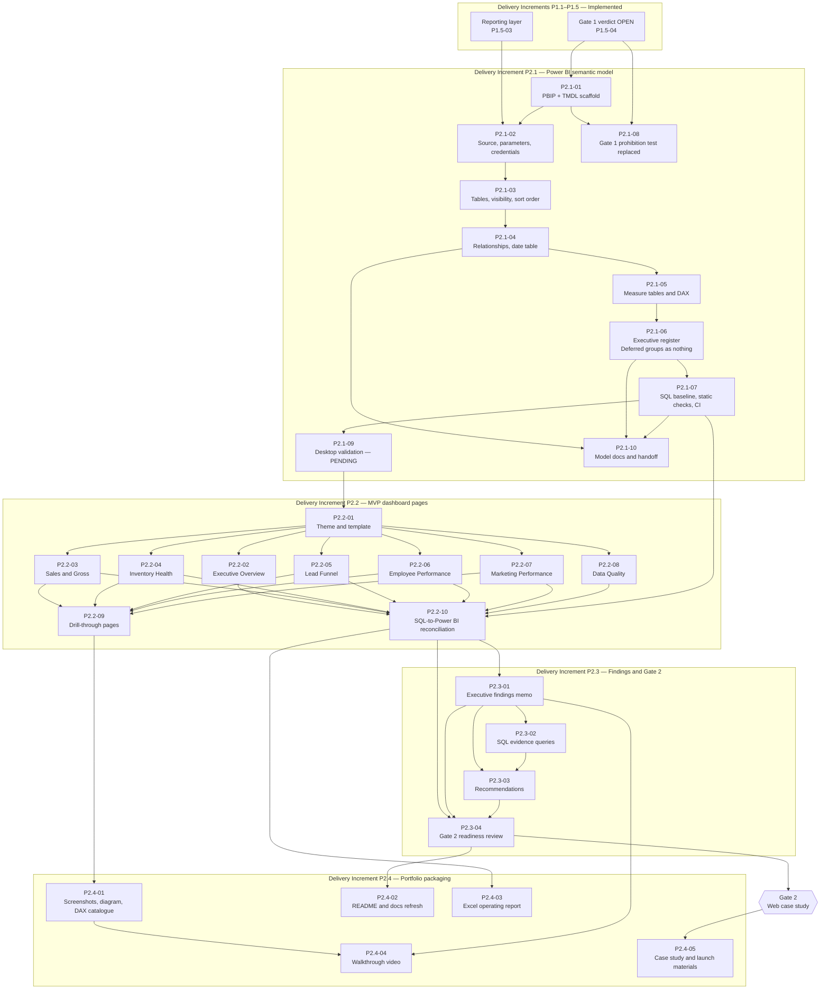

# Phase 2 Backlog — ARPI

**Project:** Automotive Retail Performance Intelligence (ARPI)
**Owner:** Michael Palmer
**Version:** 1.0
**Last reviewed:** 2026-07-29
**Conventions:** [README.md](README.md) · **Parent documents:** [ARCHITECTURE.md](../../ARCHITECTURE.md) · [KPI_CATALOG.md](../../KPI_CATALOG.md) · [DATA_DICTIONARY.md](../../DATA_DICTIONARY.md) · [GATE_1_READINESS.md](GATE_1_READINESS.md)

> **No item in this backlog carries an hour, day, week, or sprint estimate.** Complexity is recorded as
> `Small`, `Medium`, or `Large` only. See [README.md §3.3](README.md).

> **Terminology.** `P2.1` through `P2.4` are **delivery increments**, not lifecycle phases. The eight
> numbered phases in [ARCHITECTURE.md §27](../../ARCHITECTURE.md) are **lifecycle phases** and mean
> something different. [ARCHITECTURE.md §27.1](../../ARCHITECTURE.md) is the authoritative definition and
> carries the mapping in both directions;
> [ADR-0003](../architecture-decisions/ADR-0003-delivery-increment-terminology.md) records why the
> existing identifiers were disambiguated rather than renumbered. Item identifiers such as `P2.1-04` are
> permanent and are never reused or renumbered ([README.md §3.1](README.md)).

> **Two things this document does not claim.** No dashboard page exists. Power BI Desktop has not opened,
> refreshed, or saved the semantic model, because Desktop does not run in the environment the model was
> built in. Both statements are unpleasant and both are load-bearing; see §1.3.

---

## 1. Gate status

### 1.1 Gate 1 — OPEN

[ARCHITECTURE.md §28](../../ARCHITECTURE.md), **Gate 1** — *no Power BI development begins until fact grains
are approved, dimensions are documented, and KPI formulas are documented.*

**Gate 1 verdict: OPEN**, recorded on 2026-07-29 in [GATE_1_READINESS.md](GATE_1_READINESS.md), which
evaluates twenty-three conditions individually with the query or test that proves each one. All twenty-three
are met. Power BI development may begin on the seven unblocked report pages. The F&I Performance page, the
Customer and Service Opportunities page, and the target-attainment component of the Executive Overview
remain blocked by Deferred facts rather than by anything that review found.

`G1-C23` in that review recorded the prohibition test —
`tests/integration/test_gate1_readiness.py::test_no_power_bi_artefact_has_been_built`, which failed the build
if a `.pbix`, `.pbip`, `.pbit`, `.tmdl` or `.bim` file appeared — and stated that once the gate opened, *the
test is the thing to update, deliberately and visibly*. `P2.1-08` is that update. It is a backlog item with
acceptance criteria rather than a quiet deletion, because a prohibition that is removed silently was never a
control.

### 1.2 Gate 2 — CLOSED

[ARCHITECTURE.md §28](../../ARCHITECTURE.md), **Gate 2** — *no web case study begins until:*

| # | Condition | Current status | Evidence |
|---:|---|---|---|
| 1 | **Core Power BI pages are complete** | **Not met** | No report page exists. `powerbi/ARPI_Performance_Intelligence/ARPI_Performance_Intelligence.Report/` is a PBIR **shell**: a `.platform` file and a `definition.pbir` that points at the semantic model. It contains no page, no visual, and no bookmark. Delivered by `P2.2`. |
| 2 | **SQL and Power BI totals reconcile** | **Not met** | The SQL side of the reconciliation exists — `powerbi/validation/sql_baseline.json` holds the expected totals, generated from the database by `scripts/generate_sql_baseline.py`. The Power BI side requires a refreshed model, which requires Desktop. Delivered by `P2.2-10`. |
| 3 | **Executive findings are drafted** | **Not met** | `docs/findings/` is empty. Delivered by `P2.3`. |

**Gate 2 verdict: CLOSED.** `P2.3-04` is the item that evaluates it and records a written verdict, in the
same form [GATE_1_READINESS.md](GATE_1_READINESS.md) uses.

### 1.3 The Power BI Desktop validation gate

Power BI Desktop is a Windows application. The execution environment that built the semantic model is
Ubuntu 24.04 with no Windows layer, no Power BI Desktop, and no Analysis Services instance. Nothing in that
environment can open a PBIP, refresh a model, evaluate a DAX measure, or save a report.

This has three consequences, and they are stated here rather than buried in an item:

1. **Desktop open, refresh and save validation is a manual gate.** It is tracked by `P2.1-09`, its result
   is recorded in `powerbi/validation/desktop_validation_results.json`, and its status is **PENDING**. It is
   never reported as passed on the basis of a static check.
2. **Continuous integration must never attempt to launch Desktop.** The CI additions delivered by `P2.1-07`
   parse and assert the on-disk TMDL; they do not execute it. A CI job that claimed to validate a Power BI
   model without a tabular engine would be asserting something it cannot observe.
3. **Static evidence goes stale.** `P2.1-07` records a hash over the semantic-model source. When the TMDL
   changes after the last recorded Desktop validation, the recorded evidence is marked **STALE** and the
   manual gate must be run again. Evidence with no freshness rule is evidence about a file that no longer
   exists.

**`P2.2` must not begin until the Desktop validation in `P2.1-09` has passed.** Authoring report pages over
a model that has never been opened would put page-level defects and model-level defects into the same
change, and the first refresh failure would then be ambiguous. This is a hard sequencing rule, not a
preference.

---

## 2. Delivery Increment P2.1 — Power BI semantic model

*Lifecycle Phase 5 ([ARCHITECTURE.md §27](../../ARCHITECTURE.md)); architecture build-order step 13
([ARCHITECTURE.md §34](../../ARCHITECTURE.md)).*

| Field | Value |
|---|---|
| **Purpose** | Convert the approved specification in [`powerbi/model_documentation/`](../../powerbi/model_documentation/) into a semantic model that exists as reviewable, diffable source: tables, relationships, a marked date table, measure tables, and core DAX. This is the increment that turns a governed reporting layer into something a report author can point a visual at. |
| **Dependencies** | `P1.5-03` (MVP reporting layer), `P1.5-04` (Gate 1 verdict) |
| **Estimated complexity** | **Large** |
| **Blocking gate** | **Gate 1** — OPEN. This increment is what the gate was gating. |
| **Architecture references** | §19.1–19.3 (connection mode, semantic model design, measure groups), §25.4 (Power BI validation), §26.2 (Power BI deployment), §27 Lifecycle Phase 5, §28 Gate 1, §34 step 13, §35 (ADR requirement) |
| **Status** | **Delivered, except `P2.1-09`**, which is a manual gate and is `Planned`. The increment's exit criteria are not met until it passes. |

**Acceptance criteria (increment level)**

- [ ] The semantic model is stored as **TMDL** under a **PBIP** project, per
      [ADR-0007](../architecture-decisions/ADR-0007-power-bi-project-format.md). No binary model file is
      committed.
- [ ] Twenty tables are imported from the `reporting` schema and no other schema is referenced anywhere in
      the model.
- [ ] Six measure tables own every measure. No measure is defined on a source table.
- [ ] Every relationship in [`02-relationship-plan.md`](../../powerbi/model_documentation/02-relationship-plan.md)
      exists with the documented cardinality, direction and active state, **with the one deliberate
      correction recorded in `P2.1-04`**.
- [ ] Static validation runs in CI and fails the build on a model defect it can observe.
- [ ] Power BI Desktop open, refresh and save validation is **recorded as PENDING** and is not reported as
      passed.

**Required tests (increment level)**

- `tests/unit/test_powerbi_model_structure.py` — the TMDL parses, the declared table set matches, every
  relationship resolves to a column that exists.
- `python3 scripts/check_powerbi_model.py` — the static model check, run in CI.
- `python3 scripts/check_docs_links.py`, `python3 scripts/check_naming.py`, `python3 scripts/check_secrets.py`.

**Explicit non-goals**

- No report page, visual, bookmark, theme or page layout. That is `P2.2`.
- No `.pbix`. See [ADR-0007](../architecture-decisions/ADR-0007-power-bi-project-format.md).
- No Power BI Service workspace, deployment pipeline, dataflow, or scheduled refresh.
- No row-level security. ARPI models one dealer group with no user population; RLS would be an unused
  control described as if it protected something.
- No aggregation table, composite model, or DirectQuery partition. No measured performance problem exists.
- No calculation group. The one place a calculation group would help — aligning the two date bases in
  `vw_inventory_turn` — is already solved in SQL.

---

### `P2.1-01` — Power BI project format and repository scaffold

| Field | Value |
|---|---|
| **Purpose** | Fix how a Power BI artefact is stored in this repository before any of it is written. A semantic model committed as a binary is unreviewable: a pull request that changes one measure and one that rewrites the model look identical in a diff. This item establishes the PBIP-plus-TMDL layout, and records the decision where a reviewer will find it. |
| **Dependencies** | `P1.5-04` |
| **Estimated complexity** | **Medium** |
| **Blocking gate** | Gate 1 — open |
| **Status** | **Implemented** |
| **Architecture references** | §19 (Power BI architecture), §24 (repository structure), §26.2 (Power BI deployment), §35.2 (a change to the Power BI connection or storage model requires an ADR) |

**Acceptance criteria**

- [ ] `powerbi/ARPI_Performance_Intelligence/ARPI_Performance_Intelligence.pbip` exists and references the
      semantic model and the report by relative path.
- [ ] The semantic model lives at
      `powerbi/ARPI_Performance_Intelligence/ARPI_Performance_Intelligence.SemanticModel/` with `.platform`,
      `definition.pbism`, and a `definition/` directory holding `database.tmdl`, `model.tmdl`,
      `expressions.tmdl`, `relationships.tmdl`, and one file per table under `definition/tables/`.
- [ ] The report is a **shell**:
      `powerbi/ARPI_Performance_Intelligence/ARPI_Performance_Intelligence.Report/` holds `.platform` and
      `definition.pbir` and **no page definition of any kind**.
- [ ] **No `.pbix`, `.pbit`, or `.bim` file is committed.**
- [ ] Every model source file is UTF-8 text with a newline-terminated final line, so a diff is line-oriented.
- [ ] [ADR-0007](../architecture-decisions/ADR-0007-power-bi-project-format.md) is written and `Accepted`,
      and is listed in [ARCHITECTURE.md §35.1](../../ARCHITECTURE.md) and in the
      [ADR index](../architecture-decisions/README.md).
- [ ] The preview-feature status of PBIP, TMDL and PBIR is stated in the ADR, along with what happens if a
      future Desktop release changes the on-disk shape.

**Tests required**

- `tests/unit/test_powerbi_model_structure.py` — the expected file set exists at the expected paths; no
  prohibited binary extension appears anywhere under `powerbi/`.
- `python3 scripts/check_docs_links.py` — every link in and to ADR-0007 resolves.

**Explicit non-goals**

- No decision about Power BI Service, Fabric, or a deployment pipeline. ADR-0007 records the conversion path
  and stops there.
- No repository-wide binary policy. This item governs `powerbi/` only.

---

### `P2.1-02` — Source connection, parameters, and the credential boundary

| Field | Value |
|---|---|
| **Purpose** | Make the model's only source the `reporting` schema, connecting as `arpi_reporter`, with the server and database supplied as parameters. The failure mode this prevents is specific and common: a semantic model that carries a hostname, a database name, or worse a credential, in a file that is then pushed to a public repository. |
| **Dependencies** | `P2.1-01`, `P1.5-03` |
| **Estimated complexity** | **Medium** |
| **Blocking gate** | Gate 1 — open |
| **Status** | **Implemented** |
| **Architecture references** | §19.1 (Import mode), §22.2 (Power BI must not access raw tables), §22.3 (`arpi_reporter`), §26.1 (database deployment), §26.2 |

**Acceptance criteria**

- [ ] Storage mode is **Import** for every table. No table is DirectQuery or Dual.
- [ ] `definition/expressions.tmdl` declares Power Query parameters for **Server** and **Database** and
      nothing else that identifies an environment.
- [ ] Every table's partition expression resolves its source through those parameters — no hostname, IP
      address, port, or database name is hardcoded in any table file.
- [ ] **No credential of any kind appears in any file under `powerbi/`** — no username, password, token,
      connection string with embedded authentication, or `.pq` credential cache. Credentials live in the
      user's Power BI credential store and nowhere else.
- [ ] The declared identity is `arpi_reporter`, which holds `SELECT` on `reporting` only and no privilege on
      `raw`, `staging`, `warehouse`, or `audit`. The privilege boundary is enforced by the database, and is
      asserted independently by `tests/integration/test_reporter_role_end_to_end.py`.
- [ ] Every source query names an object in the `reporting` schema. **No query references `raw`, `staging`,
      `warehouse`, or `audit`**, asserted by a text check over the TMDL rather than by inspection.
- [ ] `python3 scripts/check_secrets.py` passes over the new directory.

**Tests required**

- `tests/unit/test_powerbi_model_structure.py` — parameters exist; every partition references a parameter;
  every source object is in `reporting`; storage mode is Import on every table.
- `python3 scripts/check_secrets.py` — no secret-shaped value anywhere under `powerbi/`.

**Explicit non-goals**

- No gateway configuration, no Power BI Service data source registration, no OAuth flow.
- No incremental refresh policy. The model imports in full; the volumes do not justify partitioning, and an
  incremental policy that has never refreshed is a claim rather than a feature.

---

### `P2.1-03` — Imported table set, column visibility, and sort order

| Field | Value |
|---|---|
| **Purpose** | Import exactly the twenty tables the specification calls for, with the visibility rules that stop a report author from building a wrong number by accident: hidden surrogate keys, hidden pre-filtered numerators, hidden materialised ratios, and a sort order on every ordered label. |
| **Dependencies** | `P2.1-02` |
| **Estimated complexity** | **Large** |
| **Blocking gate** | Gate 1 — open |
| **Status** | **Implemented** |
| **Architecture references** | §19.2 (hide surrogate keys, avoid calculated columns where SQL is more appropriate), §11.1, §12.1–12.7, §18.1 (calculation layers) |

**Acceptance criteria**

- [ ] Exactly **twenty** source tables are imported, matching
      [`01-table-inventory.md`](../../powerbi/model_documentation/01-table-inventory.md): eight dimensions,
      five grain-preserving facts, three governed cross-fact analytical views (`vw_inventory_turn`,
      `vw_days_supply`, `vw_marketing_performance`), and four data-quality and operational views
      (`vw_data_quality_trend`, `vw_reconciliation_status`, `vw_pipeline_run_summary`,
      `vw_data_quality_summary`).
- [ ] The ten analytical views that
      [`01-table-inventory.md §3`](../../powerbi/model_documentation/01-table-inventory.md) marks *not* for
      import are **absent from the model**. Importing a pre-aggregation alongside the fact it aggregates is
      how a report starts disagreeing with itself.
- [ ] Every `*_key` column is hidden. Every pre-filtered numerator and every materialised ratio on an
      imported analytical view is hidden.
- [ ] `source_system` is **visible** on every table, so no reader mistakes synthetic data for real dealer
      data.
- [ ] `vw_calendar.year_month_label` is sorted by `year_month_number`.
- [ ] **`vw_inventory_snapshots.age_bucket` has a working sort order.** The reporting layer does not supply
      one: `age_bucket_sort_order` exists only on `reporting.vw_inventory_aging`, which is deliberately not
      imported. A **hidden DAX calculated column** on the imported table supplies the ordinal, and
      `age_bucket` is sorted by it. **The reporting SQL is unchanged.** The contradiction and its resolution
      are recorded in
      [ADR-0007](../architecture-decisions/ADR-0007-power-bi-project-format.md).
- [ ] The calculated column is the **only** calculated column in the model, and its existence is justified
      in the model documentation against [ARCHITECTURE.md §19.2](../../ARCHITECTURE.md), which says to avoid
      calculated columns where Power Query or SQL is more appropriate.
- [ ] Currency, percentage and whole-number formats are set on every column that carries one, per
      [ARCHITECTURE.md §19.6](../../ARCHITECTURE.md).

**Tests required**

- `tests/unit/test_powerbi_model_structure.py` — the imported table set is exactly the declared twenty; no
  non-imported analytical view appears; every `*_key` column is hidden; `source_system` is visible on every
  table.
- `tests/unit/test_powerbi_model_structure.py` — `age_bucket` declares a sort-by column and that column
  exists and is hidden.
- `python3 scripts/check_powerbi_model.py` — the same assertions, runnable outside pytest and in CI.

**Explicit non-goals**

- No change to any `reporting` view. The reporting layer is governed SQL with its own reconciliations; a
  Power BI convenience is not a reason to alter it.
- No column renaming for display. The reporting layer's column names are the contract in
  [DATA_DICTIONARY.md](../../DATA_DICTIONARY.md); renaming in the model would create a second vocabulary.

---

### `P2.1-04` — Relationships, the marked date table, and the ambiguity correction

| Field | Value |
|---|---|
| **Purpose** | Build the star schema: one-directional relationships from dimension to fact, six role-playing employee relationships, role-playing dates handled by inactive relationships and `USERELATIONSHIP`, and `vw_calendar` marked as the date table. This item also carries the one place where the approved specification could not be built as written. |
| **Dependencies** | `P2.1-03` |
| **Estimated complexity** | **Large** |
| **Blocking gate** | Gate 1 — open |
| **Status** | **Implemented** |
| **Architecture references** | §19.2 (star schema, one-directional relationships, marked date table, role-playing dates, no many-to-many), §25.4 (relationship direction, role-playing date logic, filter behaviour), §27 Lifecycle Phase 5 exit criterion "no unresolved ambiguous relationships exist" |

**Acceptance criteria**

- [ ] Every relationship in
      [`02-relationship-plan.md §3`](../../powerbi/model_documentation/02-relationship-plan.md) exists, with
      the documented cardinality, `Single` filter direction, and active state — **except the one correction
      below**.
- [ ] **No bidirectional relationship exists anywhere in the model.**
- [ ] `vw_calendar` is **marked as the date table**, with `calendar_date` as the date column.
- [ ] All three fact-to-fact relationships are **inactive**.
- [ ] Role-playing dates are implemented as inactive relationships activated by `USERELATIONSHIP` inside the
      measures that need them, not by duplicating the calendar table.
- [ ] **The `vw_dealership` → `vw_employee` relationship is created as INACTIVE.**
      [`02-relationship-plan.md §3.2`](../../powerbi/model_documentation/02-relationship-plan.md) marks it
      Active. It cannot be. With the six employee role-playing relationships also active, an active
      dimension-to-dimension relationship creates **two active filter paths** from `vw_dealership` to
      `vw_vehicle_sales` and two from `vw_dealership` to `vw_appointments` — one direct, one through
      `vw_employee` — which the tabular engine rejects as an ambiguous path. Nothing is lost:
      `reporting.vw_employee` already carries `dealership_code` and `store_short_name` denormalised onto
      every row, so filtering or grouping employees by store needs no relationship at all. The relationship
      is created inactive so the intent stays visible and `USERELATIONSHIP` remains available.
- [ ] The correction is recorded in
      [ADR-0007](../architecture-decisions/ADR-0007-power-bi-project-format.md) and in the model
      documentation, and
      [`02-relationship-plan.md`](../../powerbi/model_documentation/02-relationship-plan.md) is updated so
      the specification and the model agree. **A specification and an implementation are never allowed to
      disagree; if they do, one of them is a defect.**
- [ ] A static check asserts that **no two active relationship paths connect the same pair of tables**, so a
      future edit cannot reintroduce the ambiguity unnoticed.

**Tests required**

- `tests/unit/test_powerbi_model_structure.py` — every declared relationship exists with the declared
  cardinality, direction and active state; every relationship column exists on both tables.
- `tests/unit/test_powerbi_model_structure.py` — no bidirectional relationship; no duplicate active path
  between any pair of tables; `vw_dealership` → `vw_employee` is inactive.
- `tests/unit/test_powerbi_model_structure.py` — `vw_calendar` is marked as the date table.
- **Manual, in `P2.1-09`:** Power BI Desktop reports no ambiguous-path error on model load. A static path
  check is an argument; the engine's verdict is the evidence.

**Explicit non-goals**

- No bridge table. No many-to-many relationship exists to require one.
- No calculation group for the role-playing dates. `USERELATIONSHIP` inside the affected measures is
  explicit and readable at this measure count.

---

### `P2.1-05` — Measure tables and core DAX

| Field | Value |
|---|---|
| **Purpose** | Put every measure in a dedicated measure table, written as explicit DAX with the null and semi-additivity behaviour the KPI catalogue requires. The rule that makes this item worth its own acceptance criteria is negative: a zero denominator must render as a gap, never as zero, because `$0` gross per unit in a month with no sales is a false statement. |
| **Dependencies** | `P2.1-04` |
| **Estimated complexity** | **Large** |
| **Blocking gate** | Gate 1 — open |
| **Status** | **Implemented** |
| **Architecture references** | §18.1 (calculation layers), §18.2 (KPI definitions), §18.3 (KPI governance), §19.2 (measures in dedicated measure tables, explicit measures), §19.3 (measure groups), §25.4 (totals and subtotals, time intelligence, formatting) |

**Acceptance criteria**

- [ ] **Six measure tables** exist and own every measure: Sales, Gross, Inventory, Lead Funnel, Marketing,
      Data Quality. No measure is defined on a source table.
- [ ] Every measure is **explicit**. No implicit aggregation is exposed; summarisation is disabled on
      numeric columns that a measure owns.
- [ ] Every measure in
      [`03-measure-groups.md`](../../powerbi/model_documentation/03-measure-groups.md) §§2–6 and §8 exists,
      reading the additive columns that document names.
- [ ] **Every ratio uses `DIVIDE`**, so a zero denominator returns `BLANK()` rather than zero or infinity.
      There is no exception anywhere in the model.
- [ ] Semi-additive inventory measures use `LASTNONBLANKVALUE` or an explicit average of daily values, never
      a plain `SUM` across dates.
- [ ] Medians are computed with `MEDIAN` over the row-level column, never from a pre-aggregated value.
- [ ] Delivery-basis, booking-basis and show-basis measures use `USERELATIONSHIP` and are **named so the
      basis is visible in the field list**, per
      [`02-relationship-plan.md §5`](../../powerbi/model_documentation/02-relationship-plan.md).
- [ ] Every measure carries a description that states its KPI identifier, and format strings are set for
      currency, percentage and whole-number measures.
- [ ] `powerbi/measures/*.dax` holds a reviewable text mirror of each measure group, so the DAX is readable
      in a pull request without a TMDL parser.
- [ ] **No vanity measure exists** — no measure duplicates another under a different name for the
      convenience of a page.

**Tests required**

- `tests/unit/test_powerbi_model_structure.py` — six measure tables; every expected measure present; no
  measure defined outside a measure table.
- `tests/unit/test_powerbi_model_structure.py` — every ratio measure's DAX contains `DIVIDE` and no bare
  `/` division; every measure has a non-empty description and a format string.
- `tests/unit/test_powerbi_model_structure.py` — the `.dax` mirrors in `powerbi/measures/` and the TMDL
  define the same measure set, so the mirror cannot silently drift.
- **Manual, in `P2.1-09`:** every measure evaluates without error against a refreshed model, and the totals
  match `powerbi/validation/sql_baseline.json`.

**Explicit non-goals**

- No measure for a Deferred KPI. See `P2.1-06`.
- No time-intelligence measure that ARPI's six-month `development` window cannot support honestly. A
  year-over-year measure over a window shorter than a year returns blank, which is correct and useless;
  where one is defined, the window limitation travels with it.
- No target-attainment measure. `warehouse.fact_sales_target` is Deferred, so there is nothing to attain
  against.

---

### `P2.1-06` — The Executive curation register, and the four Deferred groups created as nothing

| Field | Value |
|---|---|
| **Purpose** | Resolve what an "Executive measures" group is when it defines no measures of its own, and make the four Deferred measure groups visible as gaps rather than as empty furniture. Both halves of this item exist to avoid the same failure: creating an object that looks like capability and is not. |
| **Dependencies** | `P2.1-05` |
| **Estimated complexity** | **Small** |
| **Blocking gate** | Gate 1 — open |
| **Status** | **Implemented** |
| **Architecture references** | §19.3 (the eleven measure groups), §19.4 (Executive Overview components), §28 (scope gates), §30 (MVP definition), §31 (strong portfolio release) |

**Acceptance criteria**

- [ ] **No "Executive Measures" table exists.**
      [`03-measure-groups.md §7`](../../powerbi/model_documentation/03-measure-groups.md) states that the
      Executive group *reuses* measures from other groups and defines none of its own. Creating a table for
      it would require either duplicating eight measures under new names — vanity measures, forbidden by
      `P2.1-05` — or shipping an empty table that a reviewer would read as an unfinished one.
- [ ] The Executive group is implemented as a **governed curation register**: an `ARPI_ExecutiveCard`
      annotation applied to **exactly the eight measures** that
      [`03-measure-groups.md §7`](../../powerbi/model_documentation/03-measure-groups.md) lists, and nothing
      else.
- [ ] The register is documented in `powerbi/model_documentation/`, so `P2.2-02` can build the Executive
      Overview from a list that the model itself carries rather than from a page author's memory.
- [ ] A static check asserts the annotation appears on exactly eight measures, and that each annotated
      measure is one of the eight named. **Nine annotated measures is a defect**, because the point of a
      curation register is that it is curated.
- [ ] **Target attainment is absent from the Executive register and stays absent.**
      [ARCHITECTURE.md §19.4](../../ARCHITECTURE.md) lists it as an Executive Overview component; it is
      Deferred with `warehouse.fact_sales_target`, and the absence is recorded rather than filled with a
      placeholder.
- [ ] The four measure groups with no MVP measure — **F&I, Customer Retention, Service to Sales, Target
      Attainment** — are created as **nothing at all**: no table, no empty table, no placeholder measure, no
      hidden stub. They exist only in
      [`03-measure-groups.md §9`](../../powerbi/model_documentation/03-measure-groups.md), which names what
      each is blocked by and what unlocks it.
- [ ] A static check asserts that **no table named for a Deferred group exists in the model**, so a future
      edit cannot add an empty one.

**Tests required**

- `tests/unit/test_powerbi_model_structure.py` — the `ARPI_ExecutiveCard` annotation appears on exactly the
  eight named measures.
- `tests/unit/test_powerbi_model_structure.py` — no table exists for any of the four Deferred groups; no
  measure references a Deferred fact.

**Explicit non-goals**

- No display folder hierarchy standing in for the Executive group. A folder is a presentation device; the
  annotation is queryable and testable, and the test is the point.
- No "coming soon" placeholder of any kind.

---

### `P2.1-07` — SQL baseline, static model validation, and CI

| Field | Value |
|---|---|
| **Purpose** | Establish what *can* be validated without a tabular engine, do it in CI, and be explicit about what cannot. This item also produces the SQL side of the eventual SQL-to-Power-BI reconciliation, so that when Desktop finally refreshes the model there is a pre-recorded expected answer rather than a number invented after the fact. |
| **Dependencies** | `P2.1-05`, `P2.1-06` |
| **Estimated complexity** | **Large** |
| **Blocking gate** | Gate 1 — open |
| **Status** | **Implemented** |
| **Architecture references** | §21.3 (reconciliation tests), §25.3 (SQL tests), §25.4 (Power BI validation), §25.5 (acceptance threshold), §27 Lifecycle Phase 5 exit criteria |

**Acceptance criteria**

- [ ] `scripts/generate_sql_baseline.py` reads the `reporting` schema as `arpi_reporter` and writes
      `powerbi/validation/sql_baseline.json` — the expected value of every measure that will be reconciled —
      together with `powerbi/validation/sql_baseline_metadata.json` recording the profile, seed, database
      snapshot and generation timestamp the baseline came from. **A baseline with no provenance is a number
      with no argument behind it.**
- [ ] `powerbi/validation/model_expectations.json` declares the structural facts a static check must hold:
      the table set, the relationship register, the measure inventory, the hidden-column rules.
- [ ] `powerbi/validation/validation_queries.dax` holds the DAX queries a human runs in Desktop or DAX Studio
      to produce the Power BI side of the comparison.
- [ ] `powerbi/validation/validation_results.schema.json` defines the shape of a recorded validation result,
      so a hand-recorded result cannot omit a field.
- [ ] `scripts/check_powerbi_model.py` parses the TMDL and asserts `model_expectations.json`, exiting
      non-zero on any violation.
- [ ] `scripts/validate_powerbi_model.ps1` is the **Windows-side** script a human runs where Desktop exists.
      It is not invoked by CI.
- [ ] **CI runs the static checks and never attempts to launch Power BI Desktop.** The workflow additions in
      `.github/workflows/ci.yml` run `scripts/check_powerbi_model.py` and
      `tests/unit/test_powerbi_model_structure.py` on Linux, and nothing else Power-BI-shaped.
- [ ] A **model-source hash** is computed over the semantic-model definition files and recorded alongside
      the Desktop validation result. When the current hash differs from the recorded one, the Desktop
      evidence is reported as **STALE** and the manual gate must be run again.
- [ ] The check output states plainly which categories of defect it **cannot** detect — anything requiring
      evaluation: a measure that returns the wrong number, a refresh failure, an ambiguous path the engine
      would reject, a formatting error visible only when rendered.

**Tests required**

- `tests/unit/test_powerbi_model_structure.py` — the static checks themselves, including negative fixtures:
  a deliberately broken TMDL fragment must fail the check that is meant to catch it.
- `tests/unit/` — `scripts/check_powerbi_model.py` exits non-zero on each injected defect class.
- CI job — the Power BI static checks run on every push and fail the build on violation.

**Explicit non-goals**

- No attempt to emulate the tabular engine, evaluate DAX, or parse Power Query semantics in Python. A
  partial DAX evaluator would produce confident wrong answers, which is worse than no answer.
- No headless Power BI, no `pbi-tools` invocation, no Windows runner in CI. See
  [ADR-0007](../architecture-decisions/ADR-0007-power-bi-project-format.md).
- No claim in any CI output that the model "passed validation". The static check passes; the model is
  validated by `P2.1-09`.

---

### `P2.1-08` — Replace the Gate 1 Power BI prohibition test

| Field | Value |
|---|---|
| **Purpose** | Retire the test that forbade Power BI artefacts, and replace it with one that constrains them. `G1-C23` in [GATE_1_READINESS.md](GATE_1_READINESS.md) states that once the gate opens, the prohibition test *is the thing to update, deliberately and visibly*. This item is that deliberate, visible update: the control is not deleted, it is narrowed. |
| **Dependencies** | `P2.1-01`, `P1.5-04` |
| **Estimated complexity** | **Small** |
| **Blocking gate** | Gate 1 — open. This item may not be started while Gate 1 is closed. |
| **Status** | **Implemented** |
| **Architecture references** | §28 Gate 1, §25.5 (acceptance threshold), §33 (definition of done) |

**Acceptance criteria**

- [ ] `tests/integration/test_gate1_readiness.py::test_no_power_bi_artefact_has_been_built` is **replaced,
      not deleted**. The replacement asserts the narrowed rule: `.pbip` and `.tmdl` files are permitted only
      under `powerbi/ARPI_Performance_Intelligence/`, and **`.pbix`, `.pbit` and `.bim` remain prohibited
      everywhere**.
- [ ] The replacement fails the build if a model file appears outside the project directory, so the artefact
      surface stays where the repository structure says it is.
- [ ] [GATE_1_READINESS.md](GATE_1_READINESS.md) `G1-C23` is annotated with the date the gate opened, the
      name of the replacement test, and what it now enforces. **The original verdict is not rewritten** — a
      gate review is a dated record, not a live document.
- [ ] No other Gate 1 condition is edited. Opening a gate does not retroactively change the evidence that
      opened it.
- [ ] [`powerbi/model_documentation/README.md`](../../powerbi/model_documentation/README.md) §1 and §4,
      which state that no Power BI artefact exists, are corrected in the same change. A document that says
      the directory is empty while the directory is not is a defect regardless of which half is newer.

**Tests required**

- `tests/integration/test_gate1_readiness.py` — the replacement test passes against the delivered project
  and fails against a fixture `.pbix` placed anywhere, and against a `.tmdl` placed outside the project
  directory.

**Explicit non-goals**

- No relaxation of any other prohibition. The secret check, the naming check and the prohibited-column
  checks are untouched.
- No change to the Gate 1 **verdict**. It was recorded on 2026-07-29 and stands.

---

### `P2.1-09` — Power BI Desktop open, refresh and save validation

| Field | Value |
|---|---|
| **Purpose** | Obtain the only evidence that matters for a semantic model: that Power BI Desktop opens the project, refreshes it against the database, evaluates every measure, reports no ambiguous relationship, and saves without altering the on-disk shape. Every other check in `P2.1` is a proxy for this one. |
| **Dependencies** | `P2.1-07` |
| **Estimated complexity** | **Medium** |
| **Blocking gate** | Gate 1 — open. **This item is the blocking condition on `P2.2`.** |
| **Status** | **Planned — PENDING.** Power BI Desktop is a Windows application and does not exist in the Ubuntu 24.04 environment the model was built in. It has not been run. It has not passed. |
| **Architecture references** | §19.1–19.2, §25.4 (the full Power BI validation list), §26.2, §27 Lifecycle Phase 5 exit criteria |

**Acceptance criteria**

- [ ] Power BI Desktop opens
      `powerbi/ARPI_Performance_Intelligence/ARPI_Performance_Intelligence.pbip` **with the PBIP, TMDL and
      PBIR preview features enabled**, and reports no model-load error.
- [ ] **No ambiguous-relationship error is reported.** This is the engine's verdict on `P2.1-04`.
- [ ] A full refresh completes against a populated PostgreSQL `reporting` schema, connecting as
      `arpi_reporter` with credentials supplied through the Desktop credential prompt and stored in the
      Windows credential store — **not in the project**.
- [ ] Every one of the twenty tables loads with a row count matching `powerbi/validation/sql_baseline.json`
      within tolerance zero.
- [ ] **Every measure evaluates without error**, and every reconciled measure's value matches the SQL
      baseline within `validation.numeric_absolute_tolerance`.
- [ ] The [ARCHITECTURE.md §25.4](../../ARCHITECTURE.md) list is walked item by item: relationship
      direction, role-playing date logic, filter behaviour, totals and subtotals, time-intelligence
      calculations, drill-through context, currency and percentage formatting, and SQL-to-DAX
      reconciliation. Target attainment is recorded **not applicable — Deferred fact**.
- [ ] The project is **saved from Desktop and the resulting diff is reviewed**. A save that rewrites file
      layout, reorders properties, or emits a format version the repository did not commit is a finding,
      recorded in [ADR-0007](../architecture-decisions/ADR-0007-power-bi-project-format.md)'s terms, not a
      surprise absorbed silently.
- [ ] The result is recorded in `powerbi/validation/desktop_validation_results.json` against
      `powerbi/validation/validation_results.schema.json`, including the Desktop version, the date, the
      profile refreshed, the operator, and the **model-source hash at the time of validation**.
- [ ] Until this item passes, **no document states that the semantic model is validated**, and
      [ARCHITECTURE.md §27](../../ARCHITECTURE.md) Lifecycle Phase 5 is not marked complete.

**Tests required**

- **Manual procedure**, documented in `docs/powerbi/POWER_BI_DESKTOP_HANDOFF.md`, with a result recorded as
  structured data rather than as prose.
- `tests/unit/test_powerbi_model_structure.py` — the recorded result validates against
  `powerbi/validation/validation_results.schema.json`, and its status is one of the permitted values.
- `python3 scripts/check_powerbi_model.py` — reports the Desktop evidence as **STALE** when the current
  model-source hash differs from the recorded one.

**Explicit non-goals**

- **No automation of this item.** It is a manual gate by necessity, and pretending otherwise is the specific
  dishonesty this backlog is written to avoid.
- No Windows CI runner. A hosted Windows runner still has no Power BI Desktop licence or installation, so it
  would change the operating system without changing the answer.
- No partial credit. A refresh that loads nineteen of twenty tables is a failure, recorded as one.

---

### `P2.1-10` — Model documentation and the Desktop handoff

| Field | Value |
|---|---|
| **Purpose** | Make the built model reviewable by someone who cannot open it. The specification documents describe what will be built; this item extends them to describe what *was* built, including the two places the specification could not be followed, and hands a Windows operator a procedure they can execute without asking a question. |
| **Dependencies** | `P2.1-04`, `P2.1-06`, `P2.1-07` |
| **Estimated complexity** | **Medium** |
| **Blocking gate** | Gate 1 — open |
| **Status** | **Implemented** |
| **Architecture references** | §19 (Power BI architecture), §24 (repository structure), §25.4, §33 (definition of done: no document claims anything exists that does not) |

**Acceptance criteria**

- [ ] [`powerbi/model_documentation/`](../../powerbi/model_documentation/) documents `01` through `09` plus
      `README.md` exist and are indexed by that README.
- [ ] The documentation distinguishes **specification** from **as-built** throughout, and no document claims
      a report page, a refreshed model, or a passed Desktop validation.
- [ ] The two corrections to the approved specification are documented where a reader will meet them:
      the inactive `vw_dealership` → `vw_employee` relationship in
      [`02-relationship-plan.md`](../../powerbi/model_documentation/02-relationship-plan.md), and the
      `age_bucket` sort-order calculated column in
      [`01-table-inventory.md`](../../powerbi/model_documentation/01-table-inventory.md).
- [ ] The Executive curation register is documented as a register, not as a measure group with measures.
- [ ] `docs/powerbi/POWER_BI_DESKTOP_HANDOFF.md` exists and states: the Desktop version required, the preview
      features to enable, the parameter values to supply, how credentials are provided and where they are
      stored, the exact `P2.1-09` checklist to walk, how to record the result, and what to do when a step
      fails.
- [ ] The handoff document states plainly that the person following it is performing a **gate**, and that a
      failed step is recorded rather than worked around.
- [ ] `python3 scripts/check_docs_links.py` passes across all new documents.

**Tests required**

- `python3 scripts/check_docs_links.py` — every relative link in the new documents resolves.
- `python3 scripts/check_naming.py` — no retired identifier appears.
- `tests/unit/test_powerbi_model_structure.py` — every table and measure named in the model documentation
  exists in the TMDL, so the documentation cannot drift from the model it describes.

**Explicit non-goals**

- No screenshots. There is nothing to screenshot until `P2.2`, and a screenshot of a model diagram taken on
  a machine nobody else has is not evidence.
- No walkthrough video. That is `P2.4`.

---

## 3. Delivery Increment P2.2 — MVP dashboard pages

*Lifecycle Phase 6 ([ARCHITECTURE.md §27](../../ARCHITECTURE.md)).*

| Field | Value |
|---|---|
| **Purpose** | Build the report pages that make the semantic model answerable by a manager rather than by an analyst. [ARCHITECTURE.md §30](../../ARCHITECTURE.md) requires five pages for the MVP; [GATE_1_READINESS.md](GATE_1_READINESS.md) found seven of the nine specified pages unblocked, and this increment builds those seven. |
| **Dependencies** | **`P2.1-09` must have passed.** See §1.3. |
| **Estimated complexity** | **Large** |
| **Blocking gate** | Gate 1 is open. `P2.2` is gated on `P2.1-09` rather than on a scope gate, and it is the first half of **Gate 2** condition 1. |
| **Architecture references** | §19.4 (required report pages), §19.5 (drill-through pages), §19.6 (dashboard design rules), §23 (ethical analytics requirements), §25.4, §30 (required Power BI pages), §27 Lifecycle Phase 6 |
| **Status** | **Not started.** No page, visual, bookmark or theme exists. |

**Acceptance criteria (increment level)**

- [ ] Seven pages exist and each states its management question on the page itself.
- [ ] Every page obeys [ARCHITECTURE.md §19.6](../../ARCHITECTURE.md): no more than six primary visuals
      without justification, colour never the sole status channel, negative values visible and
      interpretable, consistent units and formats.
- [ ] Every number on every page comes from a measure in the semantic model. **No visual-level calculation
      reimplements a KPI.**
- [ ] SQL and Power BI totals reconcile, recorded as evidence rather than asserted.
- [ ] No page displays a figure the MVP cannot support. Where a §19.4 component is Deferred, its absence is
      stated on the page rather than filled.

**Required tests (increment level)**

- `tests/unit/` extensions asserting that every measure referenced by the report definition exists in the
  model.
- The SQL-to-Power BI reconciliation evidence produced by `P2.2-10`.
- Manual Desktop validation of drill-through context and filter behaviour, recorded as in `P2.1-09`.

**Explicit non-goals**

- No F&I Performance page and no Customer and Service Opportunities page. Both are blocked by Deferred facts
  (`fact_finance_product_sale`, `fact_service_visit`), and building them from proxies would be fabrication.
- No target-attainment visual anywhere. `fact_sales_target` is Deferred.
- No employee ranking that omits the fairness context [ARCHITECTURE.md §23](../../ARCHITECTURE.md) requires.
- No mobile layout, no Power BI app, no embedded report.

---

### `P2.2-01` — Report theme, layout grid, and page template

| Field | Value |
|---|---|
| **Purpose** | Fix the visual grammar once — colour, type scale, number formats, grid, header and footer — so that seven pages read as one report and no page invents its own conventions. The accessibility rule from [ARCHITECTURE.md §19.6](../../ARCHITECTURE.md) is a theme concern, not a per-visual concern. |
| **Dependencies** | `P2.1-09` |
| **Estimated complexity** | **Medium** |
| **Blocking gate** | Gated on `P2.1-09` |
| **Status** | **Not started** |
| **Architecture references** | §19.6 (dashboard design rules), §23 (ethical analytics requirements) |

**Acceptance criteria**

- [ ] A committed theme file fixes the palette, type scale, and default formats for currency, percentage,
      whole number and date.
- [ ] **Colour is never the sole channel for status.** Every status encoding carries a shape, a label, or a
      value alongside the colour, and the palette is checked for the common colour-vision deficiencies.
- [ ] Every page carries the same header (page title, stated management question, as-of date) and the same
      footer (synthetic-data statement, KPI definitions link, last refresh).
- [ ] Negative values render visibly and interpretably, per §19.6 — negative front-end gross is a real and
      important population in this data.
- [ ] The theme states the synthetic-data provenance on every page, so no screenshot can circulate without
      it.

**Tests required**

- Manual design review against the nine rules in [ARCHITECTURE.md §19.6](../../ARCHITECTURE.md), recorded as
  a checklist result.

**Explicit non-goals**

- No brand identity work. This is a portfolio report, not a product.
- No custom visual from AppSource. An unmaintained third-party visual is a dependency that outlives the
  project.

---

### `P2.2-02` — Executive Overview page

| Field | Value |
|---|---|
| **Purpose** | Answer the three questions [ARCHITECTURE.md §19.4](../../ARCHITECTURE.md) sets for this page: whether units, gross, conversion and inventory health are improving; which stores or departments explain the change; and what needs attention now. |
| **Dependencies** | `P2.2-01` |
| **Estimated complexity** | **Medium** |
| **Blocking gate** | Gated on `P2.1-09` |
| **Status** | **Not started** |
| **Architecture references** | §19.4 page 1, §19.6, §30 (required page 1) |

**Acceptance criteria**

- [ ] The KPI cards are **exactly the eight measures carrying the `ARPI_ExecutiveCard` annotation** from
      `P2.1-06`. The page reads the register; it does not curate a second one.
- [ ] Period-over-period trend, store comparison and an exception summary are present.
- [ ] **Target attainment is absent, and the page says why** — `fact_sales_target` is Deferred. An empty
      target visual would imply a target exists.
- [ ] Every card renders blank, not zero, where its denominator is zero.

**Tests required**

- Reconciliation of all eight card values against `powerbi/validation/sql_baseline.json`, recorded in
  `P2.2-10`.

**Explicit non-goals**

- No forecast, no trend extrapolation, no "projected" figure. Gate 3 governs forecasting.
- No aggregate score or index combining KPIs. A composite number hides the movement that explains it.

---

### `P2.2-03` — Sales and Gross page

| Field | Value |
|---|---|
| **Purpose** | Show which stores, employees, models and sources drive volume and profit, whether discounting is compressing front-end gross, and how new and used differ. |
| **Dependencies** | `P2.2-01` |
| **Estimated complexity** | **Medium** |
| **Blocking gate** | Gated on `P2.1-09` |
| **Status** | **Not started** |
| **Architecture references** | §19.4 page 2, §18.2 (gross definitions), §30 (required page 2) |

**Acceptance criteria**

- [ ] Front-end, back-end and total gross remain **separate** throughout the page; no visual presents a
      blended gross.
- [ ] The negative-front-gross population is visible rather than clipped by an axis.
- [ ] New and used results are separable on every gross visual.
- [ ] Sale-date basis is the default; any delivery-basis visual is labelled as such.

**Tests required**

- Reconciliation against the SQL baseline for units, front, back and total gross, at store and month grain.

**Explicit non-goals**

- No margin percentage of sale price. `KPI_CATALOG.md` governs the gross measures; inventing a ratio for the
  page is how a definition gets forked.

---

### `P2.2-04` — Inventory Health page

| Field | Value |
|---|---|
| **Purpose** | Show which units and models are aging, how much capital is tied up in aged inventory, and how age, markdowns and gross interact — the analysis the daily snapshot fact was built to support. |
| **Dependencies** | `P2.2-01` |
| **Estimated complexity** | **Medium** |
| **Blocking gate** | Gated on `P2.1-09` |
| **Status** | **Not started** |
| **Architecture references** | §19.4 page 3, §18.2 (inventory age, aged inventory percentage, inventory turn, dealer days supply), §30 (required page 3) |

**Acceptance criteria**

- [ ] Every inventory figure is stated **as of a date**, and the semi-additive time-aggregation rule is
      stated on the visual, per [ARCHITECTURE.md §19.2](../../ARCHITECTURE.md).
- [ ] The headline inventory-age figure is the **median**; the mean is available and labelled.
- [ ] The aged-inventory threshold is shown as the project's 60-day parameter and is **never labelled an
      industry benchmark**.
- [ ] Age buckets sort in age order, which is what the `P2.1-03` calculated column exists for.
- [ ] Days supply renders blank where the trailing window contains no sales, never zero and never infinity.

**Tests required**

- Reconciliation of inventory count, investment, aged percentage, turn and days supply against the SQL
  baseline, at store and as-of-date grain.

**Explicit non-goals**

- No markdown recommendation or pricing suggestion. Scenario analysis for markdown decisions is Gate 3 work
  ([ARCHITECTURE.md §32](../../ARCHITECTURE.md)).

---

### `P2.2-05` — Lead Funnel page

| Field | Value |
|---|---|
| **Purpose** | Show where leads are lost between creation and sale, which sources and employees produce strong appointment and show outcomes, and how response time relates to conversion. |
| **Dependencies** | `P2.2-01` |
| **Estimated complexity** | **Medium** |
| **Blocking gate** | Gated on `P2.1-09` |
| **Status** | **Not started** |
| **Architecture references** | §19.4 page 4, §18.2 (funnel KPI definitions), §30 (required page 4) |

**Acceptance criteria**

- [ ] Every funnel rate shows its numerator and denominator, so a rate over a small base is visibly a rate
      over a small base.
- [ ] Excluded duplicate leads are **reported as a count**, not silently dropped.
- [ ] The headline response-time figure is the **median**, because the distribution is severely
      right-skewed; the mean is shown beside it and labelled.
- [ ] Never-responded leads are distinguishable from zero-second responses.
- [ ] Response time and conversion are presented as an **association**, never as a causal claim.

**Tests required**

- Reconciliation of all eight funnel KPIs, numerators and denominators separately, against the SQL baseline.

**Explicit non-goals**

- No lead scoring, no propensity model. Gate 3.

---

### `P2.2-06` — Employee Performance page

| Field | Value |
|---|---|
| **Purpose** | Present employee results with the context that makes them fair. [ARCHITECTURE.md §23](../../ARCHITECTURE.md) makes contextual metrics a precondition for displaying any employee figure, and `P1.5-04` already confirmed every required context metric is obtainable from the reporting layer. This page is where that requirement is honoured or broken. |
| **Dependencies** | `P2.2-01` |
| **Estimated complexity** | **Large** |
| **Blocking gate** | Gated on `P2.1-09` |
| **Status** | **Not started** |
| **Architecture references** | §19.4 page 5, §23 (ethical analytics requirements), §22.4 (privacy design), §30 (required page 5) |

**Acceptance criteria**

- [ ] Every performance figure is displayed **alongside** lead volume received, lead-source mix, store
      traffic, tenure band, new-versus-used mix, inventory availability, and manager involvement. Not on a
      tooltip, not on a drill-through — on the page.
- [ ] The page states that rankings are distorted by lead quality and store assignment, and shows the
      distortion rather than asserting it.
- [ ] **No employee name, contact detail, compensation, or pay-plan figure appears**, because none exists in
      the model.
- [ ] No protected characteristic is displayed, inferred, or used as a filter. None exists in the data.
- [ ] Employees below a stated minimum deal count are shown with their base, or excluded with the exclusion
      stated.

**Tests required**

- `tests/data_quality/test_employee_context_availability.py` — the required context metrics remain
  obtainable, re-run against the semantic model's measure set.
- Manual review against [ARCHITECTURE.md §23](../../ARCHITECTURE.md), recorded as a checklist result.

**Explicit non-goals**

- No stack ranking as the primary visual, and no single composite performance score.
- No individual-level export intended for a performance-management conversation. This is a portfolio
  demonstration over synthetic people.

---

### `P2.2-07` — Marketing Performance page

| Field | Value |
|---|---|
| **Purpose** | Show which sources produce profitable sales and which campaigns generate volume without acceptable gross return, at the month grain that makes the cost-per measures structurally sound. |
| **Dependencies** | `P2.2-01` |
| **Estimated complexity** | **Medium** |
| **Blocking gate** | Gated on `P2.1-09` |
| **Status** | **Not started** |
| **Architecture references** | §19.4 page 6, §18.2 (cost per lead, cost per sale, gross return on advertising spend), §21.3 |

**Acceptance criteria**

- [ ] Every cost-per figure is displayed at **month grain or coarser**. A day-grain cost figure must be
      impossible to produce on the page.
- [ ] Cost-per measures render **blank** for organic and internal sources, and the page says why.
- [ ] **Gross-based return is the primary measure.** Any revenue-based figure is secondary and labelled with
      the reason.
- [ ] Attribution is stated on the page as **single-source, first-touch**.
- [ ] The deliberate discrepancy between vendor-reported leads and CRM lead counts is **shown as a finding**,
      not reconciled away.

**Tests required**

- Reconciliation of spend, attributed leads, attributed sales, attributed gross and all three marketing KPIs
  against the SQL baseline.

**Explicit non-goals**

- No multi-touch attribution model. The data supports single-source first-touch and nothing else.
- No spend recommendation. A recommendation belongs in the findings memo, with its limitations attached.

---

### `P2.2-08` — Data Quality and Definitions page

| Field | Value |
|---|---|
| **Purpose** | Answer, on the report itself, when the data was refreshed, whether validation passed, what the KPIs mean and what limitations apply. This page is the reason the four data-quality and operational views are imported at all, and it is the page that makes the rest of the report auditable by its reader. |
| **Dependencies** | `P2.2-01` |
| **Estimated complexity** | **Medium** |
| **Blocking gate** | Gated on `P2.1-09` |
| **Status** | **Not started** |
| **Architecture references** | §19.4 page 9, §21.4 (data-quality output), §25.5, §33 |

**Acceptance criteria**

- [ ] Run context is shown from `vw_pipeline_run_summary`: profile, seed, status, duration, row counts.
- [ ] Check outcomes are shown with **passed, failed and skipped separated**. A skipped check is never
      counted as a passing check.
- [ ] **Pass rate is shown beside evaluation coverage.** A high pass rate at low coverage proves very
      little, and showing one without the other is misleading.
- [ ] Failing critical reconciliations are surfaced whenever the count is non-zero.
- [ ] KPI definitions are reachable from the page, and the synthetic-data limitation is stated on it.

**Tests required**

- Reconciliation of check counts and reconciliation status against `audit.validation_result` and
  `audit.reconciliation_result` for the same run.

**Explicit non-goals**

- No alerting, no subscription, no scheduled email. There is no Service deployment.

---

### `P2.2-09` — Drill-through pages

| Field | Value |
|---|---|
| **Purpose** | Provide the five detail views [ARCHITECTURE.md §19.5](../../ARCHITECTURE.md) specifies — vehicle, employee, lead source, dealership, vehicle model — so a manager can move from an aggregate to the rows behind it without leaving the report. |
| **Dependencies** | `P2.2-03`, `P2.2-04`, `P2.2-05`, `P2.2-06`, `P2.2-07` |
| **Estimated complexity** | **Medium** |
| **Blocking gate** | Gated on `P2.1-09` |
| **Status** | **Not started** |
| **Architecture references** | §19.5 (drill-through pages), §25.4 (drill-through context), §22.4 (privacy design) |

**Acceptance criteria**

- [ ] All five drill-through pages exist, each carrying its filter context visibly.
- [ ] The employee drill-through carries the same fairness context `P2.2-06` requires. Context does not stop
      being required because the user drilled into it.
- [ ] Drill-through from every source visual returns the rows the aggregate was built from, verified against
      SQL for at least one case per page.
- [ ] No drill-through exposes a column hidden in the model.

**Tests required**

- Manual Desktop verification of drill-through context for each of the five pages, recorded as a checklist
  result.

**Explicit non-goals**

- No customer-level drill-through. `dim_customer` is minimised by design and a per-person detail page is the
  shape ARPI's privacy position exists to avoid.

---

### `P2.2-10` — SQL-to-Power BI reconciliation evidence

| Field | Value |
|---|---|
| **Purpose** | Close **Gate 2 condition 2** with evidence rather than assertion: every headline number on every page is compared against the governed SQL answer, and the comparison is recorded. This is the Power BI side of `RECON-GROSS-002`, whose SQL side `P1.3-02` already delivered. |
| **Dependencies** | `P2.2-02`…`P2.2-08`, `P2.1-07` |
| **Estimated complexity** | **Medium** |
| **Blocking gate** | **Gate 2** condition 2 |
| **Status** | **Not started** |
| **Architecture references** | §21.3 (reconciliation tests), §25.4 (SQL-to-DAX reconciliation), §25.5 (zero unexplained reconciliation differences), §28 Gate 2 |

**Acceptance criteria**

- [ ] Every measure surfaced on a page is reconciled against `powerbi/validation/sql_baseline.json` at the
      grain the page displays it.
- [ ] `RECON-GROSS-002` is completed on the Power BI side and recorded.
- [ ] Differences are **explained or fixed**, never tolerated. A difference within
      `validation.numeric_absolute_tolerance` is recorded as passing with its magnitude; anything larger is a
      failure.
- [ ] The reconciliation record states the profile, the seed, the refresh timestamp, and the model-source
      hash, so it can be shown stale.
- [ ] The result is committed as structured data, not as a screenshot.

**Tests required**

- `tests/integration/` — the recorded reconciliation validates against its schema and contains an entry for
  every measure the report references.

**Explicit non-goals**

- No reconciliation against a hand-maintained spreadsheet of expected numbers. The database is the source of
  truth; the baseline is generated from it.

---

## 4. Delivery Increment P2.3 — Findings, recommendations, and the Gate 2 review

*Lifecycle Phase 7 ([ARCHITECTURE.md §27](../../ARCHITECTURE.md)).*

| Field | Value |
|---|---|
| **Purpose** | Turn a working report into an argument. [ARCHITECTURE.md §27](../../ARCHITECTURE.md) Lifecycle Phase 7 requires at least five material findings, each with supporting evidence, and every recommendation acknowledging its limitations. This increment also records the Gate 2 verdict, in the same evidenced form `P1.5-04` used for Gate 1. |
| **Dependencies** | `P2.2` complete, including `P2.2-10` |
| **Estimated complexity** | **Large** |
| **Blocking gate** | **Gate 2** conditions 1 and 3 |
| **Architecture references** | §19.4, §23 (ethical analytics requirements), §25.5, §27 Lifecycle Phase 7, §28 Gate 2, §30 (at least three executive findings), §31 |
| **Status** | **Not started.** `docs/findings/` is empty. |

**Acceptance criteria (increment level)**

- [ ] At least five material findings, each with supporting evidence a reader can re-run.
- [ ] Every recommendation states what would falsify it and what the data cannot support.
- [ ] Every finding states that the underlying data is synthetic, so no finding can be quoted as a market
      observation.
- [ ] A written Gate 2 verdict exists.

**Required tests (increment level)**

- `tests/integration/` — every SQL evidence query in the findings runs and returns the figure the memo
  quotes.
- `python3 scripts/check_docs_links.py`.

**Explicit non-goals**

- No finding that requires a Deferred fact. F&I mix, service-to-sales and target attainment are unavailable
  and stay unavailable.
- No benchmark comparison against real-world dealership figures. The data is synthetic; comparing it to a
  real benchmark would be a category error.

---

### `P2.3-01` — Executive findings memo

| Field | Value |
|---|---|
| **Purpose** | Produce the document a general manager would actually read: what the data says, what it means, and what to do about it, in that order. |
| **Dependencies** | `P2.2-10` |
| **Estimated complexity** | **Large** |
| **Blocking gate** | Gate 2 condition 3 |
| **Status** | **Not started** |
| **Architecture references** | §27 Lifecycle Phase 7, §30 (at least three executive findings), §23 |

**Acceptance criteria**

- [ ] At least **five material findings**, each stating the observation, its magnitude, the population it
      holds over, and its confidence.
- [ ] Each finding names the KPI identifiers and reporting views behind it.
- [ ] The synthetic-data limitation is stated **once prominently and again per finding** where the finding
      would otherwise read as a market observation.
- [ ] No finding about an individual employee. Findings are about process, mix, and structure.
- [ ] Findings that contradict a comfortable narrative are included. A memo that only reports good news is a
      marketing document.

**Tests required**

- `python3 scripts/check_docs_links.py`.
- Manual review against [ARCHITECTURE.md §23](../../ARCHITECTURE.md).

**Explicit non-goals**

- No causal claim from observational synthetic data.
- No dollar-value benefit projection. The data generator's parameters are not a business case.

---

### `P2.3-02` — SQL evidence queries

| Field | Value |
|---|---|
| **Purpose** | Make every finding re-runnable. A finding whose number cannot be reproduced by a reader is an assertion with a chart attached. |
| **Dependencies** | `P2.3-01` |
| **Estimated complexity** | **Medium** |
| **Blocking gate** | Gate 2 condition 3 |
| **Status** | **Not started** |
| **Architecture references** | §21.3, §25.3, §27 Lifecycle Phase 7 |

**Acceptance criteria**

- [ ] Every finding has at least one committed SQL query that reproduces its headline number.
- [ ] Every query runs as `arpi_reporter` against `reporting` only.
- [ ] Every query is executed in CI or in the integration suite and its result compared to the quoted figure.
- [ ] Queries are deterministic for a given profile and seed.

**Tests required**

- `tests/integration/` — each evidence query runs and returns the value the memo quotes, within tolerance.

**Explicit non-goals**

- No query requiring `warehouse` or `audit` access. If a finding cannot be evidenced from `reporting`, the
  reporting layer is what needs extending.

---

### `P2.3-03` — Recommendations with stated limitations

| Field | Value |
|---|---|
| **Purpose** | Convert findings into management actions without overclaiming. [ARCHITECTURE.md §27](../../ARCHITECTURE.md) makes "every recommendation acknowledges limitations" an exit criterion, not a courtesy. |
| **Dependencies** | `P2.3-01`, `P2.3-02` |
| **Estimated complexity** | **Medium** |
| **Blocking gate** | Gate 2 condition 3 |
| **Status** | **Not started** |
| **Architecture references** | §23, §27 Lifecycle Phase 7, §31 |

**Acceptance criteria**

- [ ] Every recommendation names the finding it follows from, the action, the owner role, and the measure
      that would show whether it worked.
- [ ] Every recommendation states **what the data cannot tell you** about it.
- [ ] No recommendation depends on a Deferred fact.
- [ ] [LIMITATIONS.md](../../LIMITATIONS.md) is updated where a recommendation exposes a limit not yet
      recorded.

**Tests required**

- `python3 scripts/check_docs_links.py`.
- Manual review that each recommendation traces to a finding and a measure.

**Explicit non-goals**

- No implementation plan, staffing model, or compensation change. Out of scope for an analytics portfolio.

---

### `P2.3-04` — Gate 2 readiness review

| Field | Value |
|---|---|
| **Purpose** | Record the Gate 2 verdict as a dated decision with evidence, in the form [GATE_1_READINESS.md](GATE_1_READINESS.md) established. Gate 2 governs the web case study, and a gate evaluated by assumption is not a gate. |
| **Dependencies** | `P2.2-10`, `P2.3-01`, `P2.3-03` |
| **Estimated complexity** | **Small** |
| **Blocking gate** | **Gate 2** — this item evaluates it |
| **Status** | **Not started** |
| **Architecture references** | §28 Gate 2, §25.5 (acceptance threshold), §30, §33 |

**Acceptance criteria**

- [ ] `docs/requirements/GATE_2_READINESS.md` exists, is listed in the index at
      [README.md §2](README.md), and passes `python3 scripts/check_docs_links.py`.
- [ ] Each Gate 2 condition is evaluated **individually**, with the query, test or artefact that proves it,
      its limitations, and a verdict — the structure [GATE_1_READINESS.md](GATE_1_READINESS.md) uses.
- [ ] The Power BI Desktop validation result from `P2.1-09` is cited with its date and model-source hash, and
      is reported as **STALE** if the model changed after it.
- [ ] Conditions that are met with a caveat carry the caveat rather than being rounded up to met.
- [ ] A **written verdict** is recorded — open or closed — naming any unmet condition specifically.

**Tests required**

- `python3 scripts/check_docs_links.py`.
- `tests/integration/` — every artefact the review cites exists at the path it names.

**Explicit non-goals**

- No verdict issued before `P2.2-10` and `P2.3-01` are complete. A gate reviewed early is a gate reviewed
  twice.

---

## 5. Delivery Increment P2.4 — Portfolio packaging

*Lifecycle Phase 8 ([ARCHITECTURE.md §27](../../ARCHITECTURE.md)).*

| Field | Value |
|---|---|
| **Purpose** | Make the work reviewable by someone with limited time, no database, and no Power BI licence. [ARCHITECTURE.md §27](../../ARCHITECTURE.md) Lifecycle Phase 8 requires the repository to be understandable without verbal explanation. |
| **Dependencies** | `P2.3-04` (for the case study, which Gate 2 governs); `P2.2` for anything showing a page |
| **Estimated complexity** | **Large** |
| **Blocking gate** | **Gate 2** for the case study; the remaining items are gated on `P2.2` and `P2.3` rather than on a scope gate |
| **Architecture references** | §20 (Excel deliverable), §26.2 (Power BI deployment), §26.3 (public case study), §27 Lifecycle Phase 8, §31 (strong portfolio release), §33 |
| **Status** | **Not started.** `portfolio/` and `excel/` are empty. |

**Acceptance criteria (increment level)**

- [ ] Every artefact a reviewer is pointed at exists at the path it is cited by.
- [ ] Nothing in the packaging claims a capability the repository does not have.
- [ ] No secret, credential, or real personal identifier appears in any packaged artefact, asserted by
      `python3 scripts/check_secrets.py`.
- [ ] Every screenshot carries the synthetic-data statement.

**Required tests (increment level)**

- `python3 scripts/check_docs_links.py`, `python3 scripts/check_naming.py`,
  `python3 scripts/check_secrets.py`.

**Explicit non-goals**

- No second analytics application. [ARCHITECTURE.md §26.3](../../ARCHITECTURE.md) is explicit that the case
  study must not become one.
- No Power BI Service publication as a **requirement**. §26.2 keeps it optional, and the project must remain
  reviewable without Service access.

---

### `P2.4-01` — Screenshots, model diagram, and DAX measure catalogue

| Field | Value |
|---|---|
| **Purpose** | Produce the three artefacts that let a reviewer assess the Power BI work without opening Power BI, which is the situation most reviewers are in. |
| **Dependencies** | `P2.2` complete |
| **Estimated complexity** | **Medium** |
| **Blocking gate** | Gated on `P2.2` |
| **Status** | **Not started** |
| **Architecture references** | §26.2 (screenshots, model diagram, DAX measure catalogue), §27 Lifecycle Phase 8 |

**Acceptance criteria**

- [ ] High-resolution screenshots of all seven pages, each carrying the synthetic-data statement.
- [ ] A model diagram showing tables, relationships, active state and the marked date table.
- [ ] A DAX measure catalogue generated **from the TMDL**, not hand-written, so it cannot drift.
- [ ] Every screenshot records the profile and refresh date it was taken from.

**Tests required**

- A check that the measure catalogue matches the model's measure set.

**Explicit non-goals**

- No mock-up, no composite, no retouched screenshot. A screenshot is evidence or it is decoration.

---

### `P2.4-02` — Final README and documentation refresh

| Field | Value |
|---|---|
| **Purpose** | Bring the entry point and the documentation hub into line with what exists, once. The repository's own definition of done says no document claims anything that does not exist; this item is where that is verified across the whole set. |
| **Dependencies** | `P2.3-04` |
| **Estimated complexity** | **Medium** |
| **Blocking gate** | Gated on `P2.3` |
| **Status** | **Not started** |
| **Architecture references** | §27 Lifecycle Phase 8, §33 (definition of done), §30 (required documentation) |

**Acceptance criteria**

- [ ] The README's current-implementation-status table is exact, including what is still Deferred.
- [ ] [`docs/index.md`](../index.md) lists every document, including the Power BI documents and every ADR.
- [ ] [LIMITATIONS.md](../../LIMITATIONS.md) and [PRIVACY_AND_ETHICS.md](../../PRIVACY_AND_ETHICS.md) reflect
      the report layer, including anything the pages made visible that the warehouse did not.
- [ ] [ARCHITECTURE.md §24](../../ARCHITECTURE.md)'s repository structure matches the tree on disk.
- [ ] All three check scripts pass.

**Tests required**

- `python3 scripts/check_docs_links.py`, `python3 scripts/check_naming.py`,
  `python3 scripts/check_secrets.py`.

**Explicit non-goals**

- No rewriting of dated records. Gate reviews and ADRs are historical documents.

---

### `P2.4-03` — Excel operating report

| Field | Value |
|---|---|
| **Purpose** | Deliver the one Excel management report [ARCHITECTURE.md §20](../../ARCHITECTURE.md) specifies, in the format a dealership actually circulates, with a reconciliation total that matches PostgreSQL and Power BI. |
| **Dependencies** | `P2.2-10` |
| **Estimated complexity** | **Large** |
| **Blocking gate** | Gated on `P2.2-10` |
| **Status** | **Not started** |
| **Architecture references** | §20 (Excel deliverable), §31 (strong portfolio release) |

**Acceptance criteria**

- [ ] `excel/ARPI_Operating_Report.xlsx` exists and uses Power Query import, pivot tables, XLOOKUP or
      equivalent, SUMIFS or COUNTIFS, and conditional formatting.
- [ ] A monthly summary and a variance section are present. **Variance to target is omitted while
      `fact_sales_target` is Deferred**, and the omission is stated in the workbook.
- [ ] A reconciliation total **matches PostgreSQL and Power BI**, and the workbook shows the comparison
      rather than asserting it.
- [ ] The workbook contains **no credential and no connection string with embedded authentication**.
- [ ] Every sheet states that the data is synthetic.

**Tests required**

- A recorded comparison of the workbook's reconciliation total against
  `powerbi/validation/sql_baseline.json` and the `P2.2-10` result.
- `python3 scripts/check_secrets.py`.

**Explicit non-goals**

- No VBA, no macro-enabled workbook. A macro is an executable in a portfolio artefact.
- No live database connection shipped in the file.

---

### `P2.4-04` — Walkthrough video

| Field | Value |
|---|---|
| **Purpose** | Give a reviewer the condensed version. [ARCHITECTURE.md §27](../../ARCHITECTURE.md) Lifecycle Phase 8 lists it, and §26.2 lists it as primary portfolio distribution. |
| **Dependencies** | `P2.4-01`, `P2.3-01` |
| **Estimated complexity** | **Small** |
| **Blocking gate** | Gated on `P2.2` and `P2.3` |
| **Status** | **Not started** |
| **Architecture references** | §26.2, §27 Lifecycle Phase 8 |

**Acceptance criteria**

- [ ] The walkthrough covers the business problem, the model, two or three findings, and the limitations.
- [ ] It states that the data is synthetic within the first thirty seconds.
- [ ] It shows no credential, connection string, or local path revealing a personal environment.
- [ ] It claims nothing the repository cannot show.

**Tests required**

- Manual review against the four criteria above.

**Explicit non-goals**

- No narrated feature tour. The video argues a case; it does not demonstrate Power BI.

---

### `P2.4-05` — Case study copy and launch materials

| Field | Value |
|---|---|
| **Purpose** | Produce the public-facing write-up and the résumé and LinkedIn material. This is the only item in the backlog that **Gate 2 gates directly**: [ARCHITECTURE.md §28](../../ARCHITECTURE.md) states no web case study begins until Gate 2's three conditions are met. |
| **Dependencies** | `P2.3-04` with an **OPEN** verdict |
| **Estimated complexity** | **Medium** |
| **Blocking gate** | **Gate 2.** May not begin until `P2.3-04` records an open verdict. |
| **Status** | **Not started** |
| **Architecture references** | §26.3 (public case study), §28 Gate 2, §31 (resume and LinkedIn materials), §27 Lifecycle Phase 8 |

**Acceptance criteria**

- [ ] `portfolio/case-study-copy.md` covers business problem, architecture diagram, selected screenshots,
      key findings, technology stack, data limitations, and links to the repository and walkthrough — the
      seven elements [ARCHITECTURE.md §26.3](../../ARCHITECTURE.md) requires.
- [ ] The copy states the data is synthetic and Granite State Auto Group is fictional, prominently rather
      than in a footnote.
- [ ] `portfolio/resume-bullets.md` contains no claim the repository cannot evidence. Every bullet maps to a
      delivered artefact.
- [ ] The case study **does not become a second analytics application** — no interactive query, no embedded
      live report, no API.
- [ ] The Gate 2 verdict is cited by date.

**Tests required**

- `python3 scripts/check_docs_links.py`, `python3 scripts/check_naming.py`.
- Manual review that every résumé bullet traces to a delivered artefact.

**Explicit non-goals**

- No claim of production deployment, real dealership engagement, or measured business impact. There is none.

---

## 6. Definition of ready / definition of done

The Phase 1 definitions in [PHASE_1_BACKLOG.md §7](PHASE_1_BACKLOG.md) continue to apply. Phase 2 adds the
following, because a semantic model and a report fail in ways a warehouse does not.

### 6.1 Additional definition of ready

- [ ] For any `P2.2` item: **`P2.1-09` has passed** and its recorded model-source hash matches the current
      model.
- [ ] Every KPI the item surfaces is already `Implemented` in [KPI_CATALOG.md](../../KPI_CATALOG.md). A page
      may not be the first place a KPI is defined.
- [ ] Every measure the item needs exists in the semantic model, or the item creates it explicitly.
- [ ] For any item displaying employee results, the fairness context in
      [ARCHITECTURE.md §23](../../ARCHITECTURE.md) is available and the item states how it will be shown.
- [ ] If the item changes the model's on-disk shape or its connection mode, an ADR exists
      ([ARCHITECTURE.md §35.2](../../ARCHITECTURE.md)).

### 6.2 Additional definition of done

- [ ] `python3 scripts/check_powerbi_model.py` passes.
- [ ] `python3 scripts/check_naming.py`, `python3 scripts/check_docs_links.py` and
      `python3 scripts/check_secrets.py` pass.
- [ ] The static model checks pass in CI, and CI made **no attempt** to launch Power BI Desktop.
- [ ] For any change to the semantic model: the Desktop validation record is either **re-run** or explicitly
      marked **STALE**. A stale record is never cited as a pass.
- [ ] Every measure the change touches reconciles to the SQL baseline, or the difference is explained.
- [ ] No zero is displayed where the correct answer is blank.
- [ ] `powerbi/model_documentation/` matches the model as built, including any place the specification was
      corrected.
- [ ] **No document claims anything exists that does not** — the rule from
      [PHASE_1_BACKLOG.md §7.2](PHASE_1_BACKLOG.md), which in Phase 2 most often means a report page or a
      passed Desktop validation.

---

## 7. Dependency graph across the four delivery increments

**Reading the graph.** `P2.1-09` is the single edge between the model and every page. It is a manual gate,
and it is the narrowest point in the whole of Phase 2: nothing in `P2.2`, `P2.3` or `P2.4` can start until a
human with a Windows machine and Power BI Desktop has opened the project, refreshed it, and recorded the
result.

**Critical path:** `P2.1-01` → `P2.1-02` → `P2.1-03` → `P2.1-04` → `P2.1-05` → `P2.1-06` → `P2.1-07` →
**`P2.1-09` (manual gate)** → `P2.2-01` → the seven pages → `P2.2-10` → `P2.3-01` → `P2.3-04` →
**Gate 2** → `P2.4-05`.

`P2.1-08` and `P2.1-10` branch off the critical path and can proceed in parallel. In `P2.4`, only
`P2.4-05` is gated by Gate 2; `P2.4-01` through `P2.4-04` follow their own dependencies.

---

## 8. Backlog summary

| Delivery increment | Items | Small | Medium | Large | Delivered | Not started |
|---|---:|---:|---:|---:|---:|---:|
| `P2.1` | 10 | 2 | 4 | 4 | 9 | 1 |
| `P2.2` | 10 | 0 | 9 | 1 | 0 | 10 |
| `P2.3` | 4 | 1 | 2 | 1 | 0 | 4 |
| `P2.4` | 5 | 1 | 3 | 1 | 0 | 5 |
| **Total** | **29** | **4** | **18** | **7** | **9** | **20** |

**What "Delivered" means in this table.** Nine `P2.1` items have their acceptance criteria met by committed
files that a reviewer can open. It does **not** mean `P2.1` is complete: `P2.1-09` is `Planned` and
**PENDING**, and [ARCHITECTURE.md §27](../../ARCHITECTURE.md) Lifecycle Phase 5 is not marked complete until
it passes. One unmet item in an increment means the increment is unmet.

**What exists at the time of writing.** A PBIP project holding a TMDL semantic model — twenty imported
tables, the relationship set, the marked date table, six measure tables, the core DAX, the Executive
curation register — plus a SQL baseline, a static validation harness that runs in CI, the model
documentation, and a Desktop handoff procedure. The report is a PBIR shell with no pages.

**What does not exist.** Any dashboard page. Any refreshed model. Any evaluated measure. Any
SQL-to-Power-BI reconciliation result. Any finding. Any packaged portfolio artefact. The evidence for that
list is the absence of the files `P2.2` through `P2.4` name.
