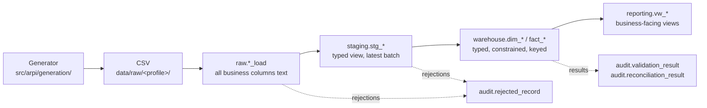

# Source-to-Target Mappings — ARPI

**Project:** Automotive Retail Performance Intelligence (ARPI)
**Owner:** Michael Palmer
**Last reviewed:** 2026-07-28
**Parent documents:** [ARCHITECTURE.md](../../ARCHITECTURE.md) · [DATA_DICTIONARY.md](../../DATA_DICTIONARY.md) · [DATA_GENERATION.md](../../DATA_GENERATION.md)

---

## 1. What a source-to-target mapping is for

A source-to-target mapping (STM) document records, **column by column**, how a value travels from its
origin to its final home in the warehouse: what transformation is applied, what happens when the value is
absent, what validates it, what happens when validation fails, which lineage columns accompany it, and who
owns the rule.

[ARCHITECTURE.md §27](../../ARCHITECTURE.md) Phase 2 names source-to-target mapping as a required
deliverable, and `docs/research.md` §8.4 lists it among the artefacts an intentional data model should
publish. The practical value is narrower and more useful than either statement suggests: **an STM is the
document you read when a number is wrong.** It is the only place that answers "where did this specific
value come from, and what could have changed it?" without reading the code.

---

## 2. Document convention

### 2.1 Naming

```
STM-<NNN>-<target-object-slug>.md
```

`NNN` is a zero-padded, permanently assigned sequence number. `STM-000` is reserved for the blank template.
Numbers are never reused; a retired mapping keeps its number and is marked `Out of scope`.

### 2.2 Required structure

Every mapping document must contain, in this order:

1. **Header block** — ID, title, status, version, date, owner, source system, target object.
2. **Lineage statement or diagram** — the ordered path from generator to warehouse.
3. **Mapping table** — one row per target column, using the exact columns in section 3.
4. **Load strategy** — how the target is written, and with what write semantics.
5. **Idempotency guarantees** — what happens on a rerun.
6. **Rejection handling** — which `REJ-*` codes can be raised and what each means.
7. **Validation checks** — the `DQ-*` checks that gate the load.

A mapping document missing any of those sections is incomplete and must not be marked `Implemented`.

### 2.3 Status values

Exactly four, matching every other ARPI document: **Implemented**, **Planned**, **Deferred**,
**Out of scope**.

---

## 3. Mapping-table column meanings

Every mapping table uses these ten columns, in this exact order.

| Column | Meaning |
|---|---|
| **Source field** | The field as it exists at the origin. For generated data this is the CSV header name; for derived values it is `(derived)`; for values with no origin at all it is `(constant)` or `(database)`. |
| **Source type** | The type as received. For CSV-sourced fields at the raw layer this is almost always `text`, because the raw layer preserves source values without transformation ([ARCHITECTURE.md §10.2](../../ARCHITECTURE.md)). |
| **Target field** | The physical column name in the target object. Must match [DATA_DICTIONARY.md](../../DATA_DICTIONARY.md) exactly. |
| **Target type** | The PostgreSQL type in the target object. |
| **Transformation** | The rule applied between source and target: a cast, a derivation, a lookup, a constant, or `Direct` when the value passes through unchanged. Must be specific enough to reimplement from. |
| **Default behaviour** | What the value becomes when the source is absent, empty, or NULL. `n/a — required` means absence is a rejection, not a default. |
| **Validation** | The `DQ-*` check identifiers and inline constraints that must hold for this column. |
| **Rejection behaviour** | What happens when validation fails: the `REJ-*` code raised, and whether the row is rejected or the run fails. |
| **Lineage field** | The audit or lineage column that lets you trace this value back to the batch and row that produced it. |
| **Owner** | The component accountable for producing and maintaining the value — the generator module, the staging view, the dimension load, or the database. |

---

## 4. Rejection code register

Rejection codes are written to `audit.rejected_record.rejection_code`
([DATA_DICTIONARY.md §23](../../DATA_DICTIONARY.md)). They are stable identifiers shared between Python and
SQL.

| Code | Meaning | Typical cause |
|---|---|---|
| `REJ-PARSE-001` | The source row could not be parsed | Malformed CSV, wrong column count, encoding failure |
| `REJ-SCHEMA-001` | The source file's columns do not match the declared schema | A column added, removed, renamed, or reordered |
| `REJ-TYPE-001` | A value could not be cast to its target type | Non-numeric text in a numeric column, an unparseable date |
| `REJ-NULL-001` | A required field was NULL or empty | A missing mandatory value |
| `REJ-DOMAIN-001` | A value fell outside its allowed domain | An enumeration value that is not in the permitted set, a number outside its range |
| `REJ-KEY-001` | Duplicate natural key within the load batch | Two rows for the same date, or two current rows for the same store |
| `REJ-REF-001` | A foreign key did not resolve | A date key with no matching `dim_date` row |
| `REJ-RULE-001` | A business rule was violated | `date_key` not matching `full_date`; a franchise store with no brand |

**Rejected rows are preserved, never discarded.** The full payload is written to
`audit.rejected_record.record_payload` so the rejection can be diagnosed. Because all ARPI source data is
synthetic, storing the payload carries no privacy risk.

**Phase 0 rejection tolerance is zero.** `validation.max_rejected_record_ratio` is `0.0`, so **any**
rejection fails the run. ARPI generates its own source data, so a malformed row means a generator or
mapping defect, not a data-supplier problem.

---

## 5. Review and versioning

### 5.1 Versioning

- Mapping documents use a simple `major.minor` version in the header block.
- **Minor** increment: clarification, added validation detail, corrected wording — no change to what a
  value becomes.
- **Major** increment: a transformation, default, validation, or rejection rule changes such that the
  loaded value could differ. A major version bump on an `Implemented` mapping requires the SQL, the
  generator, the tests, and [DATA_DICTIONARY.md](../../DATA_DICTIONARY.md) to change in the **same** commit.
- The header `Date` field records the date of the current version.

### 5.2 Review checklist

A mapping is ready for review when all of the following are true:

- [ ] Every column of the target object appears exactly once in the mapping table.
- [ ] Column names and types match [DATA_DICTIONARY.md](../../DATA_DICTIONARY.md) verbatim.
- [ ] Every transformation is specific enough to reimplement without reading the code.
- [ ] Every nullable column states what NULL *means*, not merely that NULL is allowed.
- [ ] Every required column states `n/a — required` in the default column, and names its rejection code.
- [ ] Every `DQ-*` reference exists in the check register
      ([DATA_DICTIONARY.md §21.2](../../DATA_DICTIONARY.md)).
- [ ] Every `REJ-*` reference exists in section 4 above.
- [ ] The load strategy states write semantics and idempotency explicitly.
- [ ] The status is accurate. `Implemented` means the code exists and tests exercise it.

### 5.3 Change control

- Changing a **grain** requires an architecture decision record
  ([ARCHITECTURE.md §35](../../ARCHITECTURE.md)), not just a mapping update.
- Adding a **new fact table** likewise requires an ADR.
- Adding a mapping for a Planned entity is normal Phase 1 work and requires no ADR, provided the grain is
  already declared in [DATA_DICTIONARY.md](../../DATA_DICTIONARY.md).

---

## 6. Index

| ID | Title | Target object(s) | Version | Status |
|---|---|---|---|---|
| [STM-000](STM-000-template.md) | Mapping document template | *(none — reusable template)* | 1.0 | **Implemented** (template) |
| [STM-001](STM-001-dim-date.md) | Calendar date dimension | `warehouse.dim_date` (via `raw.calendar_date_load`, `staging.stg_calendar_date`) | 1.0 | **Implemented** |
| [STM-002](STM-002-dim-dealership.md) | Dealership dimension | `warehouse.dim_dealership` (via `raw.dealership_load`, `staging.stg_dealership`) | 1.0 | **Implemented** |
| [STM-003](STM-003-audit-metadata.md) | Audit and pipeline metadata | `audit.pipeline_run`, `audit.pipeline_run_row_count`, `audit.validation_result`, `audit.reconciliation_result`, `audit.rejected_record` | 1.0 | **Implemented** |
| STM-004 | Vehicle model dimension | `warehouse.dim_vehicle_model` | — | Planned (Phase 1.1) |
| STM-005 | Vehicle dimension | `warehouse.dim_vehicle` | — | Planned (Phase 1.1) |
| STM-006 | Employee dimension | `warehouse.dim_employee` | — | Planned (Phase 1.1) |
| STM-007 | Customer dimension | `warehouse.dim_customer` | — | Planned (Phase 1.2) |
| STM-008 | Vehicle sale fact | `warehouse.fact_vehicle_sale` | — | Planned (Phase 1.2) |
| STM-009 | Vehicle inventory snapshot fact | `warehouse.fact_vehicle_inventory_snapshot` | — | Planned (Phase 1.2) |
| STM-010 | Lead source dimension | `warehouse.dim_lead_source` | — | Planned (Phase 1.4) |
| STM-011 | Lead fact | `warehouse.fact_lead` | — | Planned (Phase 1.4) |
| STM-012 | Appointment fact | `warehouse.fact_appointment` | — | Planned (Phase 1.4) |
| STM-013 | Marketing campaign dimension | `warehouse.dim_marketing_campaign` | — | Planned (Phase 1.5) |
| STM-014 | Marketing spend fact | `warehouse.fact_marketing_spend` | — | Planned (Phase 1.5) |

**Three mappings are written. Eleven are Planned. None cover a fact table, because no fact table exists.**

---

## 7. Common lineage pattern

Every ARPI mapping follows the same five-stage path. Individual documents describe their specifics; the
shape is always this:



Layer responsibilities are fixed by [ARCHITECTURE.md §10.2](../../ARCHITECTURE.md):

- **Raw** preserves source records without business transformation and never serves Power BI.
- **Staging** standardizes types, normalizes codes, deduplicates, rejects structurally invalid records, and
  prepares records for warehouse loading.
- **Warehouse** stores conformed dimensions and facts at explicitly documented grain, with surrogate
  integer keys and enforced referential integrity.
- **Reporting** exposes stable documented views and prevents Power BI from accessing raw operational
  tables.
- **Audit** records every execution, row counts before and after transformation, rejected rows, validation
  failures, and reconciliation totals.
