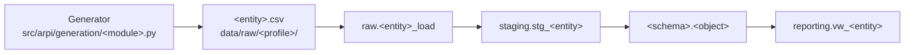

# STM-000 — Source-to-Target Mapping Template

> **This is a reusable blank template, not a mapping.** Copy it to
> `STM-<NNN>-<target-object-slug>.md`, replace every `<placeholder>`, delete this callout and every
> instructional note in italics, and add the new document to the index in [README.md](README.md).
>
> Conventions, column meanings, the `REJ-*` register, and the review checklist live in
> [README.md](README.md). Read it before filling this in.

---

## Header

| Field | Value |
|---|---|
| **Mapping ID** | `STM-<NNN>` |
| **Title** | `<Target object, in business terms>` |
| **Status** | `Implemented` \| `Planned` \| `Deferred` \| `Out of scope` |
| **Version** | `<major>.<minor>` |
| **Date** | `<YYYY-MM-DD>` |
| **Owner** | `<name>` |
| **Source system** | `arpi_synthetic_generator` *(or the approved external source)* |
| **Target object** | `<schema>.<object>` |
| **Declared grain** | `<one row per …>` |
| **Phase** | `<Phase 0 / 1.1 / 1.2 / 1.3 / 1.4 / 1.5>` |

---

## 1. Purpose

*One paragraph: what this object is for in business terms, and why a reader would come to this mapping.*

---

## 2. Lineage

*Either a Mermaid diagram or an ordered lineage statement. Both are acceptable; the ordered statement is
often clearer for a simple path.*

**Ordered lineage statement**

1. `<generator module>` produces `<entity>` rows deterministically from `(random_seed, "<entity>")`.
2. The rows are written to `data/raw/<profile>/<entity>.csv` — UTF-8, LF endings, header row, ISO-8601
   dates, lowercase booleans.
3. `<entity>.csv` is loaded into `raw.<entity>_load` with all business columns as `text`, plus the lineage
   columns.
4. `staging.stg_<entity>` casts to warehouse types and exposes only the most recent `load_batch_id`.
5. `<schema>.<object>` is loaded from staging using `<load strategy>`.
6. `reporting.vw_<entity>` exposes the business-facing projection.

---

## 3. Mapping table

*One row per target column. Every column of the target object must appear exactly once, in the order
declared in [DATA_DICTIONARY.md](../../DATA_DICTIONARY.md).*

| Source field | Source type | Target field | Target type | Transformation | Default behaviour | Validation | Rejection behaviour | Lineage field | Owner |
|---|---|---|---|---|---|---|---|---|---|
| `<field>` | `<type>` | `<field>` | `<type>` | `<rule>` | `<default or "n/a — required">` | `<DQ-* ids and constraints>` | `<REJ-* code and outcome>` | `<lineage column>` | `<component>` |

---

## 4. Load strategy

| Layer | Strategy | Write semantics |
|---|---|---|
| CSV | `<overwrite / append>` | |
| `raw.<entity>_load` | `<truncate-and-reload / append-by-batch>` | |
| `staging.stg_<entity>` | `<view / table>` | |
| `<schema>.<object>` | `<MERGE on natural key / SCD2 / insert-only / delete-and-reload by period>` | |

*State explicitly: what is the natural key used for matching? What is updated on a match? What is inserted
on no match? What, if anything, is expired or deleted?*

---

## 5. Idempotency guarantees

*[ARCHITECTURE.md §17.3](../../ARCHITECTURE.md) requires that a rerun with the same source files must not
create duplicate warehouse rows. State how this mapping achieves that.*

| Guarantee | Mechanism |
|---|---|
| Rerunning with identical source produces no new warehouse rows | `<mechanism>` |
| Load batches are uniquely identified | `load_batch_id uuid` |
| Audit history is preserved across reruns | `audit.pipeline_run` is insert-only |
| `<other>` | `<mechanism>` |

---

## 6. Rejection handling

| Condition | `REJ-*` code | Outcome |
|---|---|---|
| `<condition>` | `REJ-<...>` | `<row rejected / run fails>` |

*Rejected rows are written to `audit.rejected_record` with `source_entity`, `source_record_key`,
`rejection_code`, `rejection_reason`, and `record_payload`. Phase 0 tolerance is zero:
`validation.max_rejected_record_ratio = 0.0`, so any rejection fails the run.*

---

## 7. Validation checks gating the load

| Check ID | Assertion | Severity | Gate |
|---|---|---|---|
| `DQ-<...>` | `<what it asserts>` | `critical` \| `warning` \| `info` | `<pre-load / post-load>` |

---

## 8. Reconciliations

| Reconciliation ID | Description | Left | Right | Tolerance | Status |
|---|---|---|---|---|---|
| `RECON-<...>` | `<description>` | `<left source>` | `<right source>` | `<tolerance>` | `<status>` |

---

## 9. Open questions and known gaps

*List anything unresolved. An empty list is acceptable; an omitted section is not.*

- `<question>`
