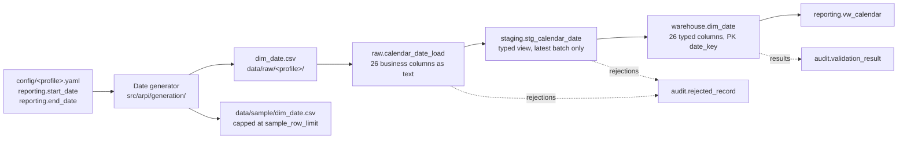

# STM-001 — Calendar Date Dimension

## Header

| Field | Value |
|---|---|
| **Mapping ID** | `STM-001` |
| **Title** | Calendar date dimension |
| **Status** | **Implemented** |
| **Version** | 1.0 |
| **Date** | 2026-07-28 |
| **Owner** | Michael Palmer |
| **Source system** | `arpi_synthetic_generator` |
| **Target object** | `warehouse.dim_date` |
| **Declared grain** | One row per calendar date |
| **Phase** | Phase 0 |
| **Intermediate objects** | `raw.calendar_date_load`, `staging.stg_calendar_date` |
| **Downstream object** | `reporting.vw_calendar` |

---

## 1. Purpose

`warehouse.dim_date` is ARPI's conformed calendar. Every fact table will join to it, every period filter
will resolve through it, and the future Power BI semantic model will mark it as the date table. It is also
the only dimension whose content is derived entirely from configuration — there is no external source
system, only a start date, an end date, and deterministic arithmetic.

This mapping is where the calendar's derivations are pinned down: how `date_key` is formed, how ISO week
numbering is handled, and how the holiday and selling-day flags are computed.

---

## 2. Lineage

**Ordered lineage statement**

1. The date generator reads `reporting.start_date` and `reporting.end_date` from the active profile and
   enumerates every calendar date in that inclusive range.
2. For each date it derives all 26 columns arithmetically. **No randomness is used** — the calendar is fully
   determined by its date range, so its `content_digest` depends only on the profile's window, not on the
   seed.
3. Rows are written to `data/raw/<profile>/dim_date.csv` — UTF-8, LF line endings, header row, ISO-8601
   dates, lowercase `true` / `false` booleans, columns in the declared order.
4. Under the `development` profile a capped copy (`generation.sample_row_limit` = 400 rows) is written to
   `data/sample/dim_date.csv` and committed.
5. `dim_date.csv` is loaded into `raw.calendar_date_load`, all business columns as `text`, plus
   `raw_record_id`, `load_batch_id`, `source_file_name`, `source_row_number`, `ingested_at`.
6. `staging.stg_calendar_date` casts every column to its warehouse type and exposes only the most recent
   `load_batch_id`.
7. `warehouse.dim_date` is loaded by MERGE on the natural key `full_date`.
8. `reporting.vw_calendar` exposes the business-facing projection.

---

## 3. Mapping table

All 26 columns of `warehouse.dim_date`, in declared order. Every column is `NOT NULL` except
`holiday_name`.

| Source field | Source type | Target field | Target type | Transformation | Default behaviour | Validation | Rejection behaviour | Lineage field | Owner |
|---|---|---|---|---|---|---|---|---|---|
| `date_key` | `text` | `date_key` | `integer` PK | Cast to `integer`. Generator derives it as `full_date` formatted `%Y%m%d`, e.g. `2025-07-04` → `20250704`. | `n/a — required` | `DQ-DATE-001` unique; `DQ-DATE-003` equals `full_date` formatted `YYYYMMDD`; `DQ-DATE-004` not null | `REJ-TYPE-001` if not castable; `REJ-KEY-001` on duplicate; `REJ-RULE-001` if it disagrees with `full_date` — row rejected, and any rejection fails the Phase 0 run | `load_batch_id`, `source_row_number` | Date generator |
| `full_date` | `text` | `full_date` | `date` UNIQUE | Cast ISO-8601 `YYYY-MM-DD` to `date`. Generator enumerates day by day from `reporting.start_date` to `reporting.end_date` inclusive. | `n/a — required` | `DQ-DATE-002` range contiguous, no gaps; `DQ-DATE-004` not null; UNIQUE | `REJ-TYPE-001` if unparseable; `REJ-KEY-001` on duplicate | `load_batch_id`, `source_row_number` | Date generator |
| `day_of_month` | `text` | `day_of_month` | `smallint` | Cast to `smallint`. Derived as the day component of `full_date`. | `n/a — required` | `DQ-DATE-004` not null; domain 1–31 | `REJ-TYPE-001`; `REJ-DOMAIN-001` if outside 1–31 | `load_batch_id` | Date generator |
| `day_name` | `text` | `day_name` | `varchar(9)` | Direct. Derived from a **hard-coded English name list**, indexed by ISO weekday — deliberately not from the OS locale, so output is byte-identical on any machine. | `n/a — required` | `DQ-DATE-004` not null; domain `Monday`…`Sunday` | `REJ-DOMAIN-001` if not one of the seven names | `load_batch_id` | Date generator |
| `day_of_week` | `text` | `day_of_week` | `smallint` | Cast to `smallint`. Derived as **ISO** weekday: 1 = Monday … 7 = Sunday. | `n/a — required` | `DQ-DATE-004` not null; domain 1–7 | `REJ-TYPE-001`; `REJ-DOMAIN-001` | `load_batch_id` | Date generator |
| `day_of_year` | `text` | `day_of_year` | `smallint` | Cast to `smallint`. Derived as the ordinal day within the calendar year. | `n/a — required` | `DQ-DATE-004` not null; domain 1–366 | `REJ-TYPE-001`; `REJ-DOMAIN-001` | `load_batch_id` | Date generator |
| `week_of_year` | `text` | `week_of_year` | `smallint` | Cast to `smallint`. Derived as the **ISO** week number (`isocalendar()[1]`). Must be paired with `iso_year`, never with `calendar_year`. | `n/a — required` | `DQ-DATE-004` not null; domain 1–53 | `REJ-TYPE-001`; `REJ-DOMAIN-001` | `load_batch_id` | Date generator |
| `iso_year` | `text` | `iso_year` | `smallint` | Cast to `smallint`. Derived as the ISO week-numbering year (`isocalendar()[0]`). Differs from `calendar_year` for a few days at each year boundary. | `n/a — required` | `DQ-DATE-004` not null; within one year of `calendar_year` | `REJ-TYPE-001`; `REJ-RULE-001` if it differs from `calendar_year` by more than 1 | `load_batch_id` | Date generator |
| `month_number` | `text` | `month_number` | `smallint` | Cast to `smallint`. Derived as the month component of `full_date`. | `n/a — required` | `DQ-DATE-004` not null; domain 1–12 | `REJ-TYPE-001`; `REJ-DOMAIN-001` | `load_batch_id` | Date generator |
| `month_name` | `text` | `month_name` | `varchar(9)` | Direct. Derived from a **hard-coded English name list**, indexed by `month_number`. Locale-independent. | `n/a — required` | `DQ-DATE-004` not null; domain `January`…`December` | `REJ-DOMAIN-001` | `load_batch_id` | Date generator |
| `month_start_date` | `text` | `month_start_date` | `date` | Cast ISO-8601 to `date`. Derived as the first calendar day of the month containing `full_date`. | `n/a — required` | `DQ-DATE-004` not null; `month_start_date <= full_date`; same month and year | `REJ-TYPE-001`; `REJ-RULE-001` on inconsistency | `load_batch_id` | Date generator |
| `month_end_date` | `text` | `month_end_date` | `date` | Cast ISO-8601 to `date`. Derived as the last calendar day of the month containing `full_date`. **Leap-year correct for February.** | `n/a — required` | `DQ-DATE-004` not null; `month_end_date >= full_date`; same month and year | `REJ-TYPE-001`; `REJ-RULE-001` | `load_batch_id` | Date generator |
| `quarter_number` | `text` | `quarter_number` | `smallint` | Cast to `smallint`. Derived as `((month_number − 1) / 3) + 1` using integer division. | `n/a — required` | `DQ-DATE-004` not null; domain 1–4; consistent with `month_number` | `REJ-TYPE-001`; `REJ-DOMAIN-001`; `REJ-RULE-001` | `load_batch_id` | Date generator |
| `quarter_name` | `text` | `quarter_name` | `varchar(2)` | Direct. Derived as `'Q'` concatenated with `quarter_number`. | `n/a — required` | `DQ-DATE-004` not null; domain `Q1`…`Q4` | `REJ-DOMAIN-001` | `load_batch_id` | Date generator |
| `calendar_year` | `text` | `calendar_year` | `smallint` | Cast to `smallint`. Derived as the year component of `full_date`. | `n/a — required` | `DQ-DATE-004` not null; four-digit year | `REJ-TYPE-001`; `REJ-DOMAIN-001` | `load_batch_id` | Date generator |
| `fiscal_month` | `text` | `fiscal_month` | `smallint` | Cast to `smallint`. **Set equal to `month_number`** — ARPI's fictional fiscal year is aligned to the calendar year. Kept as a distinct column so a future fiscal offset needs no schema change. | `n/a — required` | `DQ-DATE-004` not null; must equal `month_number` | `REJ-RULE-001` if it differs from `month_number` | `load_batch_id` | Date generator |
| `fiscal_quarter` | `text` | `fiscal_quarter` | `smallint` | Cast to `smallint`. **Set equal to `quarter_number`.** | `n/a — required` | `DQ-DATE-004` not null; must equal `quarter_number` | `REJ-RULE-001` | `load_batch_id` | Date generator |
| `fiscal_year` | `text` | `fiscal_year` | `smallint` | Cast to `smallint`. **Set equal to `calendar_year`.** | `n/a — required` | `DQ-DATE-004` not null; must equal `calendar_year` | `REJ-RULE-001` | `load_batch_id` | Date generator |
| `is_weekend` | `text` | `is_weekend` | `boolean` | Cast lowercase `true`/`false` to `boolean`. Derived as `day_of_week IN (6, 7)`. **Note: weekends are still selling days.** | `n/a — required` | `DQ-DATE-004` not null; consistent with `day_of_week` | `REJ-TYPE-001` if not `true`/`false`; `REJ-RULE-001` on inconsistency | `load_batch_id` | Date generator |
| `is_month_end` | `text` | `is_month_end` | `boolean` | Cast to `boolean`. Derived as `full_date = month_end_date`. | `n/a — required` | `DQ-DATE-004` not null; consistent with `month_end_date` | `REJ-TYPE-001`; `REJ-RULE-001` | `load_batch_id` | Date generator |
| `is_quarter_end` | `text` | `is_quarter_end` | `boolean` | Cast to `boolean`. Derived as true when `full_date` is the last day of a calendar quarter (31 Mar, 30 Jun, 30 Sep, 31 Dec). | `n/a — required` | `DQ-DATE-004` not null; `is_quarter_end = true` implies `is_month_end = true` | `REJ-TYPE-001`; `REJ-RULE-001` | `load_batch_id` | Date generator |
| `is_year_end` | `text` | `is_year_end` | `boolean` | Cast to `boolean`. Derived as true when `full_date` is 31 December. | `n/a — required` | `DQ-DATE-004` not null; `is_year_end = true` implies `is_quarter_end = true` | `REJ-TYPE-001`; `REJ-RULE-001` | `load_batch_id` | Date generator |
| `is_holiday` | `text` | `is_holiday` | `boolean` | Cast to `boolean`. Derived as true when `full_date` matches any of the twelve recognized-holiday rules (section 4.1). Arithmetic only — **no external holiday library**, so the rule set cannot change beneath the data. | `n/a — required` | `DQ-DATE-004` not null; `is_holiday = false` implies `holiday_name IS NULL` | `REJ-TYPE-001`; `REJ-RULE-001` on flag/name inconsistency | `load_batch_id` | Date generator |
| `holiday_name` | `text` | `holiday_name` | `varchar(64)` | Direct where present. Empty string in the CSV maps to SQL `NULL`. On a same-date collision, takes the **first match in the section 4.1 table order**. | **`NULL` when `is_holiday` is false.** NULL means "not a holiday" — it never means "unknown". This is the only nullable column in the table. | Domain: one of the twelve names, or NULL; must be non-NULL exactly when `is_holiday = true` | `REJ-DOMAIN-001` if not a recognized name; `REJ-RULE-001` if present while `is_holiday = false` | `load_batch_id` | Date generator |
| `is_closure_holiday` | `text` | `is_closure_holiday` | `boolean` | Cast to `boolean`. Derived from the `Closure?` column of section 4.1. On a same-date collision it is the **logical OR** of all matches, which makes it order-independent. | `n/a — required` | `DQ-DATE-004` not null; `is_closure_holiday = true` implies `is_holiday = true` | `REJ-TYPE-001`; `REJ-RULE-001` | `load_batch_id` | Date generator |
| `is_selling_day` | `text` | `is_selling_day` | `boolean` | Cast to `boolean`. Derived as **`NOT is_closure_holiday`**. It is *not* `NOT is_weekend` — New Hampshire permits Sunday vehicle sales, so weekends are trading days. | `n/a — required` | `DQ-DATE-004` not null; `DQ-DATE-005` selling-day ratio within `[0.80, 1.00]`; must equal `NOT is_closure_holiday` | `REJ-RULE-001` if it disagrees with `is_closure_holiday`. `DQ-DATE-005` is `warning` severity and does not by itself fail the run | `load_batch_id` | Date generator |
| *(database)* | — | `raw_record_id` | `bigserial` | Database-assigned. **Raw layer only** — not carried to the warehouse. | `n/a — database-assigned` | PK uniqueness | n/a | itself | Database |
| *(load process)* | — | `load_batch_id` | `uuid` | Assigned once per load. **Raw and staging layers only.** | `n/a — required` | Not null; unique per batch | `REJ-PARSE-001` if the batch cannot be initialised | itself | Loader |
| *(load process)* | — | `source_file_name` | `text` | The name of the file the row came from. **Raw and staging layers only.** | `n/a — required` | Not null | n/a | itself | Loader |
| *(load process)* | — | `source_row_number` | `integer` | 1-based row number within the file, excluding the header. **Raw and staging layers only.** | `n/a — required` | Not null; ≥ 1 | n/a | itself | Loader |
| *(database)* | — | `ingested_at` | `timestamptz` | Database `DEFAULT now()`. **Raw and staging layers only.** | `now()` | Not null | n/a | itself | Database |

---

## 4. Derivation reference

### 4.1 Recognized holidays

Computed arithmetically per calendar year. No external library, so the rule set is versioned with this
repository and cannot drift.

| # | Holiday | Rule | Closure? |
|---:|---|---|---|
| 1 | New Year's Day | January 1 | **yes** |
| 2 | Martin Luther King Jr. Day | 3rd Monday in January | no |
| 3 | Presidents Day | 3rd Monday in February | no |
| 4 | Easter Sunday | Anonymous Gregorian computus | **yes** |
| 5 | Memorial Day | last Monday in May | no |
| 6 | Juneteenth National Independence Day | June 19 | no |
| 7 | Independence Day | July 4 | **yes** |
| 8 | Labor Day | 1st Monday in September | no |
| 9 | Columbus Day | 2nd Monday in October | no |
| 10 | Veterans Day | November 11 | no |
| 11 | Thanksgiving Day | 4th Thursday in November | **yes** |
| 12 | Christmas Day | December 25 | **yes** |

**Collision rule.** If two holidays fall on the same date, `holiday_name` takes the **first match in the
order above**, and `is_closure_holiday` is the **logical OR** of all matches.

**No observance shifting.** A fixed-date holiday falling on a weekend is not moved to an adjacent weekday.

**Five of the twelve close the showroom.** The other seven are recognized trading days — several of them
among the highest-traffic retail automotive days of the year, which is exactly why `is_holiday` and
`is_closure_holiday` are separate columns.

### 4.2 Selling-day semantics

`is_selling_day = NOT is_closure_holiday`.

`DQ-DATE-005` asserts the ratio of selling days to total days falls between
`validation.min_selling_day_ratio` (0.80) and `validation.max_selling_day_ratio` (1.00). This is a **sanity
bound on the holiday arithmetic, not a business benchmark**. With five closure days per year the expected
ratio is close to 0.986.

---

## 5. Load strategy

| Layer | Strategy | Write semantics |
|---|---|---|
| CSV | Overwrite | The generator rewrites `data/raw/<profile>/dim_date.csv` on each run. Because the calendar is fully derived from the date range with no randomness, the file is byte-identical between runs of the same profile. |
| `raw.calendar_date_load` | **Truncate-and-reload per batch** | The raw table is truncated and reloaded from the current CSV, then stamped with a fresh `load_batch_id`. [ARCHITECTURE.md §17.3](../../ARCHITECTURE.md) explicitly permits staging-side truncation. |
| `staging.stg_calendar_date` | **View** (`CREATE OR REPLACE VIEW`) | No data is written. The view casts raw text to warehouse types and filters to the most recent `load_batch_id`, so it can never drift out of sync with raw. |
| `warehouse.dim_date` | **MERGE / UPSERT on the natural key `full_date`** | `INSERT … ON CONFLICT (full_date) DO UPDATE` on the derived attributes. New dates insert; existing dates update in place; nothing is deleted. |

**Why MERGE rather than truncate-and-reload for the warehouse.** Fact tables will hold foreign keys into
`dim_date`. Truncating it would break referential integrity mid-load. MERGE also makes extending the
reporting window a purely additive operation.

**Extending the window.** Widening `reporting.start_date` or `reporting.end_date` appends rows and leaves
existing rows untouched. **Narrowing the window does not delete rows** — the dimension is a superset of any
single profile's window, which is correct behaviour for a conformed calendar.

---

## 6. Idempotency guarantees

| Guarantee | Mechanism |
|---|---|
| Rerunning with the same profile creates **no new warehouse rows** | MERGE on `full_date`; every incoming row matches an existing one, so the operation is a no-op update. |
| Rerunning produces a **byte-identical CSV** | The calendar is fully derived from the date range with no randomness; format rules (UTF-8, LF, ISO dates, lowercase booleans, fixed column order) eliminate environmental variation. |
| Reruns cannot leave a partial state | The raw truncate-and-reload and the dimension MERGE run inside one transaction. A failure rolls back. |
| Load batches are uniquely identified | `load_batch_id uuid NOT NULL` on every raw row. |
| Staging cannot show a stale batch | `staging.stg_calendar_date` filters to the greatest `ingested_at`, with `load_batch_id` as the deterministic tie-break. |
| Audit history is preserved across reruns | `audit.pipeline_run` and its children are insert-only ([ARCHITECTURE.md §17.3](../../ARCHITECTURE.md)). |
| Verifiable by a third party | `content_digest` in `generation_manifest.json` is the SHA-256 of the CSV bytes; regenerate and compare. |

---

## 7. Rejection handling

| Condition | `REJ-*` code | Outcome |
|---|---|---|
| A CSV row cannot be parsed | `REJ-PARSE-001` | Row rejected; run fails (Phase 0 tolerance is zero) |
| The CSV header does not match the 26 declared columns, in order | `REJ-SCHEMA-001` | Load aborts before any row is processed; run fails. Also caught pre-load by `DQ-GEN-001`. |
| A value cannot be cast to its warehouse type | `REJ-TYPE-001` | Row rejected; run fails |
| A required field is NULL or empty | `REJ-NULL-001` | Row rejected; run fails |
| A value is outside its allowed domain | `REJ-DOMAIN-001` | Row rejected; run fails |
| Duplicate `date_key` or `full_date` within a batch | `REJ-KEY-001` | Later row rejected; run fails |
| An internal consistency rule fails (`date_key` versus `full_date`, fiscal versus calendar, flag versus name) | `REJ-RULE-001` | Row rejected; run fails |

Every rejection writes a row to `audit.rejected_record` with `source_entity = 'dim_date'`,
`source_record_key` = the offending `date_key` where identifiable, the code, a human-readable reason, and
the full `record_payload`.

> **Phase 0 rejection tolerance is zero.** `validation.max_rejected_record_ratio = 0.0`. ARPI generates its
> own calendar, so a rejected row means a defect in the generator or in this mapping — never a data-supplier
> problem — and the run must fail loudly.

---

## 8. Validation checks gating the load

| Check ID | Assertion | Severity | Gate |
|---|---|---|---|
| `DQ-GEN-001` | The generated CSV's schema matches the declared 26-column schema — names, order, and count | critical | Pre-load |
| `DQ-GEN-002` | The determinism digest (`content_digest`) is computed and recorded for `dim_date` | critical | Pre-load |
| `DQ-DATE-001` | `date_key` is unique | critical | Post-load |
| `DQ-DATE-002` | The date range is contiguous — no missing days between the minimum and maximum `full_date` | critical | Post-load |
| `DQ-DATE-003` | `date_key` equals `full_date` formatted `YYYYMMDD` for every row | critical | Post-load |
| `DQ-DATE-004` | No required field is NULL (`holiday_name` is the only nullable column) | critical | Post-load |
| `DQ-DATE-005` | The selling-day ratio falls within `[0.80, 1.00]` | **warning** | Post-load |

A `critical` failure sets `audit.pipeline_run.status = 'failed'` and increments `critical_failure_count`.
`DQ-DATE-005` is a warning: it increments `warning_count` without failing the run, because it is a sanity
bound on holiday arithmetic rather than a correctness guarantee.

---

## 9. Reconciliations

| Reconciliation ID | Description | Left | Right | Tolerance | Status |
|---|---|---|---|---|---|
| `RECON-DIM-DATE-ROWCOUNT` | The number of `dim_date` rows the generator produced equals the number of rows in `warehouse.dim_date` after the merge | `generator:dim_date` — the generated frame's row count | `warehouse.dim_date` — a live `count(*)` | 0 (exact) | **Implemented** |

This reconciliation is defined in `src/arpi/constants.py` and evaluated in `src/arpi/ingestion/loader.py`.
It compares **exactly two numbers** and runs **only when the optional database load runs**, because the
right-hand side is a query against PostgreSQL.

> **What it does not cover.** It does not compare the raw layer, it does not compare the staging layer, and
> it does not account for rejected records. The loader records row counts for the `source`, `raw` and
> `warehouse` layers only; **`staging` and `rejected` row counts are not recorded at all**, so
> [ARCHITECTURE.md §21.4](../../ARCHITECTURE.md) is not yet satisfied. See
> [LIMITATIONS.md §9.1](../../LIMITATIONS.md).

Expected row counts by profile:

| Profile | Window | Expected rows |
|---|---|---:|
| `development` | 2025-07-01 → 2025-12-31 | 184 |
| `test` | 2025-01-01 → 2025-02-28 | 59 |
| `portfolio` | 2024-01-01 → 2025-12-31 | 731 |

*(The portfolio window spans 2024, a leap year, so it contains 731 days rather than 730.)*

---

## 10. Open questions and known gaps

- **Fiscal calendar is calendar-aligned.** `fiscal_month`, `fiscal_quarter`, and `fiscal_year` are exact
  copies of their calendar counterparts. The columns exist so that a future non-calendar fiscal year needs
  no schema change, but no such fiscal year is modelled. A reviewer should not read the presence of these
  columns as evidence of a fiscal calendar.
- **Holiday set is US-national and market-agnostic.** No store-specific closure calendar is modelled, and
  no manufacturer-mandated closure day is represented. Real showroom closure varies by store.
- **No observance shifting.** A fixed-date holiday on a weekend is not moved to an adjacent weekday, which
  differs from how many businesses observe holidays.
- **Sunday selling is a market-specific assumption.** New Hampshire permits Sunday vehicle sales. Adapting
  ARPI to a blue-law state requires changing the `is_selling_day` derivation, not reinterpreting the column.
- **The dimension is not narrowed when a profile's window shrinks.** This is intentional but means the
  warehouse may hold dates outside the active profile's reporting range.
