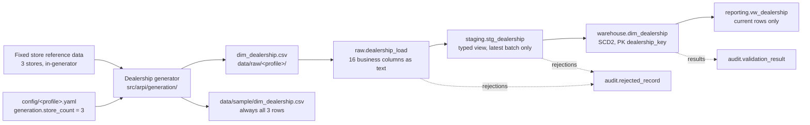

# STM-002 — Dealership Dimension

## Header

| Field | Value |
|---|---|
| **Mapping ID** | `STM-002` |
| **Title** | Dealership dimension (Slowly Changing Dimension Type 2) |
| **Status** | **Implemented** |
| **Version** | 1.0 |
| **Date** | 2026-07-28 |
| **Owner** | Michael Palmer |
| **Source system** | `arpi_synthetic_generator` |
| **Target object** | `warehouse.dim_dealership` |
| **Declared grain** | One row per dealership store **version** (SCD Type 2). In Phase 0 exactly one current version exists per store. |
| **Phase** | Phase 0 |
| **Intermediate objects** | `raw.dealership_load`, `staging.stg_dealership` |
| **Downstream object** | `reporting.vw_dealership` |

---

## 1. Purpose

`warehouse.dim_dealership` is the conformed store dimension for the fictional **Granite State Auto Group**.
Every fact in the model will be sliceable by store, and this dimension carries the attributes — store type,
franchise brand, market region — that drive nearly all comparative analysis.

It is also ARPI's reference implementation of **Slowly Changing Dimension Type 2**, which
[ARCHITECTURE.md §14](../../ARCHITECTURE.md) makes mandatory for the dealership dimension. This mapping is
where the change-detection mechanism (`attribute_hash`) and the version-expiry logic are specified in
enough detail to reimplement.

---

## 2. Lineage



**Ordered lineage statement**

1. The dealership generator reads its fixed three-store reference table (section 4.1) and asserts that the
   row count equals `generation.store_count`. **A mismatch fails the run** — a silent mismatch would produce
   a store dimension and transaction volumes that disagree.
2. It assigns `dealership_key` as a **deterministic ordinal 1..N over `dealership_id` in ascending order**,
   so the same store always receives the same key on regeneration.
3. It computes `attribute_hash` over the Type 2 tracked attributes (section 4.2) and sets the SCD2
   bookkeeping columns for an initial current version.
4. Rows are written to `data/raw/<profile>/dim_dealership.csv` — UTF-8, LF endings, header row, ISO-8601
   dates, lowercase booleans, declared column order.
5. Under the `development` profile a copy is written to `data/sample/dim_dealership.csv` and committed.
   **The dealership sample is exempt from `generation.sample_row_limit` and always contains all three
   stores** — a partial store list would be actively misleading.
6. The CSV is loaded into `raw.dealership_load`, all business columns as `text`, plus `raw_record_id`,
   `load_batch_id`, `source_file_name`, `source_row_number`, `ingested_at`.
7. `staging.stg_dealership` casts to warehouse types and exposes only the most recent `load_batch_id`.
8. `warehouse.dim_dealership` is loaded by **SCD2 MERGE on `dealership_id`**, using `attribute_hash` for
   change detection.
9. `reporting.vw_dealership` exposes current-version rows only.

---

## 3. Mapping table

All 16 columns of `warehouse.dim_dealership`, in declared order. Every column is `NOT NULL` except
`franchise_brand`.

| Source field | Source type | Target field | Target type | Transformation | Default behaviour | Validation | Rejection behaviour | Lineage field | Owner |
|---|---|---|---|---|---|---|---|---|---|
| `dealership_key` | `text` | `dealership_key` | `integer` PK | Cast to `integer`. Generator assigns it as a **deterministic ordinal 1..N by `dealership_id` ascending**, so regeneration is stable. | `n/a — required` | `DQ-DLR-001` unique; PK not null | `REJ-TYPE-001` if not castable; `REJ-KEY-001` on duplicate — row rejected, and any rejection fails the Phase 0 run | `load_batch_id`, `source_row_number` | Dealership generator |
| `dealership_id` | `text` | `dealership_id` | `varchar(16)` | Direct. Natural / source key, format `GSA-###`. | `n/a — required` | `DQ-DLR-002` unique among rows where `is_current = true`; `DQ-DLR-003` distinct current count equals `generation.store_count` | `REJ-NULL-001` if empty; `REJ-KEY-001` on duplicate current row; `REJ-DOMAIN-001` if it does not match `GSA-###` | `load_batch_id`, `source_row_number` | Dealership generator |
| `store_name` | `text` | `store_name` | `varchar(120)` | Direct from reference data. **SCD2 tracked attribute (hash position 1).** | `n/a — required` | Not null; length ≤ 120 | `REJ-NULL-001`; `REJ-DOMAIN-001` if over length | `load_batch_id`, `attribute_hash` | Dealership generator |
| `store_short_name` | `text` | `store_short_name` | `varchar(40)` | Direct from reference data. **SCD2 tracked attribute (hash position 2).** | `n/a — required` | Not null; length ≤ 40 | `REJ-NULL-001`; `REJ-DOMAIN-001` | `load_batch_id`, `attribute_hash` | Dealership generator |
| `store_type` | `text` | `store_type` | `varchar(40)` | Direct from reference data. **SCD2 tracked attribute (hash position 3).** | `n/a — required` | Not null; domain `Franchise New and Used` \| `Independent Used`; consistency with `franchise_brand` via `DQ-DLR-005` | `REJ-NULL-001`; `REJ-DOMAIN-001` if outside the enumeration | `load_batch_id`, `attribute_hash` | Dealership generator |
| `franchise_brand` | `text` | `franchise_brand` | `varchar(40)` | Direct from reference data. Empty string in the CSV maps to SQL `NULL`. **SCD2 tracked attribute (hash position 4)** — the literal `None` is rendered as an empty string inside the hash input so that a NULL is hashed consistently. | **`NULL` means the store holds no franchise** (an independent used operation). It never means "unknown". | `DQ-DLR-005` — non-NULL where `store_type = 'Franchise New and Used'`, NULL where `store_type = 'Independent Used'` | `REJ-RULE-001` if a franchise store has no brand, or an independent store has one | `load_batch_id`, `attribute_hash` | Dealership generator |
| `city` | `text` | `city` | `varchar(60)` | Direct from reference data. **SCD2 tracked attribute (hash position 5).** **City is the finest geography stored — no street address exists.** | `n/a — required` | `DQ-DLR-004` no prohibited PII column present; not null | `REJ-NULL-001` | `load_batch_id`, `attribute_hash` | Dealership generator |
| `state_code` | `text` | `state_code` | `char(2)` | Direct from reference data, uppercase. **SCD2 tracked attribute (hash position 6).** | `n/a — required` | Not null; exactly 2 uppercase characters; domain `NH` for all three fictional stores | `REJ-DOMAIN-001` if not a 2-character uppercase code | `load_batch_id`, `attribute_hash` | Dealership generator |
| `market_region` | `text` | `market_region` | `varchar(60)` | Direct from reference data. **SCD2 tracked attribute (hash position 7).** | `n/a — required` | Not null; domain `Southern New Hampshire` | `REJ-NULL-001`; `REJ-DOMAIN-001` | `load_batch_id`, `attribute_hash` | Dealership generator |
| `opened_date` | `text` | `opened_date` | `date` | Cast ISO-8601 `YYYY-MM-DD` to `date`. **SCD2 tracked attribute (hash position 8)** — rendered as its ISO string inside the hash input. | `n/a — required` | Not null; must be a valid date in the past | `REJ-TYPE-001` if unparseable; `REJ-DOMAIN-001` if in the future | `load_batch_id`, `attribute_hash` | Dealership generator |
| `is_active` | `text` | `is_active` | `boolean` | Cast lowercase `true`/`false` to `boolean`. **SCD2 tracked attribute (hash position 9)** — rendered as `true`/`false` inside the hash input. | `n/a — required` | Not null; all three fictional stores are `true` | `REJ-TYPE-001` if not `true`/`false` | `load_batch_id`, `attribute_hash` | Dealership generator |
| `effective_date` | `text` | `effective_date` | `date` | Cast to `date`. **Set equal to `opened_date` in Phase 0**, because no attribute change has yet occurred. On a later change, set to the date the new attribute values take effect. **Not part of the hash.** | `n/a — required` | Not null; `effective_date <= expiration_date`; `(dealership_id, effective_date)` unique | `REJ-TYPE-001`; `REJ-KEY-001` on duplicate `(dealership_id, effective_date)`; `REJ-RULE-001` if after `expiration_date` | `load_batch_id` | Dimension load |
| `expiration_date` | `text` | `expiration_date` | `date` | Cast to `date`. **`9999-12-31` for current rows.** The high-date sentinel is used rather than NULL so `BETWEEN` range joins work without NULL handling. **Not part of the hash.** | `n/a — required` | Not null; `= '9999-12-31'` if and only if `is_current = true`; version ranges for a `dealership_id` must not overlap | `REJ-TYPE-001`; `REJ-RULE-001` on overlap or sentinel/flag mismatch | `load_batch_id` | Dimension load |
| `is_current` | `text` | `is_current` | `boolean` | Cast to `boolean`. Redundant with `expiration_date` **by design** — it makes the common "current stores only" filter a single index-friendly predicate. A partial unique index on `dealership_id WHERE is_current` enforces at most one current row per store. **Not part of the hash.** | `n/a — required` | Not null; `DQ-DLR-002`; exactly one current row per `dealership_id` | `REJ-TYPE-001`; `REJ-KEY-001` if a second current row appears for the same store | `load_batch_id` | Dimension load |
| `attribute_hash` | `text` | `attribute_hash` | `char(64)` | **SHA-256 hex digest** of the nine tracked attributes (columns 3–11), joined with the pipe character `\|`, encoded UTF-8. See section 4.2. | `n/a — required` | Not null; exactly 64 lowercase hexadecimal characters; must equal the recomputed hash of the row's own tracked attributes | `REJ-DOMAIN-001` if not 64 hex characters; `REJ-RULE-001` if it does not match a recomputation | itself (it *is* the change-detection lineage) | Dealership generator |
| `source_system` | `text` | `source_system` | `varchar(40)` | **Constant** `arpi_synthetic_generator`. Present on every row so no reviewer can mistake this data for a real DMS extract. **Not part of the hash** (a constant would contribute nothing). | `n/a — constant` | Not null; must equal `arpi_synthetic_generator` | `REJ-RULE-001` if any other value appears | itself | Dealership generator |
| *(database)* | — | `raw_record_id` | `bigserial` | Database-assigned. **Raw layer only.** | `n/a — database-assigned` | PK uniqueness | n/a | itself | Database |
| *(load process)* | — | `load_batch_id` | `uuid` | Assigned once per load. **Raw and staging layers only.** | `n/a — required` | Not null; unique per batch | `REJ-PARSE-001` if the batch cannot be initialised | itself | Loader |
| *(load process)* | — | `source_file_name` | `text` | Name of the source file. **Raw and staging layers only.** | `n/a — required` | Not null | n/a | itself | Loader |
| *(load process)* | — | `source_row_number` | `integer` | 1-based row number, excluding the header. **Raw and staging layers only.** | `n/a — required` | Not null; ≥ 1 | n/a | itself | Loader |
| *(database)* | — | `ingested_at` | `timestamptz` | Database `DEFAULT now()`. **Raw and staging layers only.** | `now()` | Not null | n/a | itself | Database |

---

## 4. Derivation reference

### 4.1 Store reference data (authoritative)

Fixed reference data held inside the generator. **The generator fails if the row count does not equal
`generation.store_count`** (`DQ-DLR-003`).

| `dealership_key` | `dealership_id` | `store_name` | `store_short_name` | `store_type` | `franchise_brand` | `city` | `state_code` | `market_region` | `opened_date` |
|---:|---|---|---|---|---|---|---|---|---|
| 1 | `GSA-001` | Granite Chevrolet of Nashua | Granite Chevrolet | Franchise New and Used | Chevrolet | Nashua | NH | Southern New Hampshire | 2009-04-06 |
| 2 | `GSA-002` | Granite Subaru of Manchester | Granite Subaru | Franchise New and Used | Subaru | Manchester | NH | Southern New Hampshire | 2013-08-19 |
| 3 | `GSA-003` | Granite Used Auto Center of Merrimack | Granite Used Auto | Independent Used | *(null)* | Merrimack | NH | Southern New Hampshire | 2017-03-13 |

All three have `is_active = true`, `effective_date = opened_date`, `expiration_date = 9999-12-31`,
`is_current = true`, and `source_system = arpi_synthetic_generator`.

> **No street addresses, phone numbers, or email addresses exist for these stores.** They are omitted
> deliberately, and `DQ-DLR-004` inspects the **schema** — so an accidentally added `email` column fails the
> run even when it holds no values. See [PRIVACY_AND_ETHICS.md](../../PRIVACY_AND_ETHICS.md).

### 4.2 `attribute_hash` construction

```
tracked = [store_name, store_short_name, store_type, franchise_brand,
           city, state_code, market_region, opened_date, is_active]

attribute_hash = sha256( "|".join(render(v) for v in tracked).encode("utf-8") ).hexdigest()
```

Rendering rules, all binding for reproducibility:

| Value type | Rendered as |
|---|---|
| Text | The text itself, unmodified |
| NULL / `None` | The empty string |
| `date` | ISO-8601 `YYYY-MM-DD` |
| `boolean` | Lowercase `true` / `false` |

Ordering is **columns 3 through 11 in declared order**, and the order is part of the contract: changing it
changes every hash.

**Deliberately excluded from the hash**

| Column | Why excluded |
|---|---|
| `dealership_key` | A surrogate, not a business attribute. Including it would defeat change detection, because the key is stable by construction. |
| `dealership_id` | Identity, not a tracked attribute. It is the *matching* key, so hashing it would be circular. |
| `effective_date`, `expiration_date`, `is_current` | SCD bookkeeping. Including them would make every row hash differently and defeat the entire mechanism. |
| `source_system` | A constant; contributes no discriminating information. |

### 4.3 SCD2 load behaviour

| Condition | Action |
|---|---|
| **No current row exists** for the incoming `dealership_id` | Insert a new row: `is_current = true`, `effective_date` = the store's `opened_date` on initial load (or the change date on a later insert), `expiration_date = '9999-12-31'`. |
| A current row exists and the incoming `attribute_hash` **matches** | **No change.** Do not insert, do not update. This is what makes the load idempotent. |
| A current row exists and the incoming `attribute_hash` **differs** | Expire the current row — set `expiration_date` to the day before the change date and `is_current = false` — then insert a new current version with the incoming attributes and a freshly computed hash. |

Because the hash covers business attributes only, rerunning the pipeline against unchanged source data
produces **zero new rows**.

---

## 5. Load strategy

| Layer | Strategy | Write semantics |
|---|---|---|
| CSV | Overwrite | The generator rewrites `data/raw/<profile>/dim_dealership.csv` on each run. Three rows, byte-identical between runs of the same profile. |
| `raw.dealership_load` | **Truncate-and-reload per batch** | Truncated and reloaded from the current CSV, then stamped with a fresh `load_batch_id`. |
| `staging.stg_dealership` | **View** (`CREATE OR REPLACE VIEW`) | No data written. Casts raw text to warehouse types and filters to the most recent `load_batch_id`. |
| `warehouse.dim_dealership` | **SCD Type 2 MERGE on the natural key `dealership_id`**, with `attribute_hash` for change detection | Matched and unchanged → no-op. Matched and changed → expire the current row, insert a new version. Unmatched → insert a new current row. **Nothing is ever deleted.** |

**Why never truncate the warehouse table.** Type 2 history *is* the data. Truncating and reloading would
destroy every prior version and, once facts exist, break their foreign keys into historical versions.

**Constraints enforced in the database**

- `(dealership_id, effective_date)` UNIQUE — a store cannot have two versions starting on the same day.
- **Partial unique index** on `dealership_id WHERE is_current` — at most one current version per store.
- `effective_date <= expiration_date` CHECK.

---

## 6. Idempotency guarantees

| Guarantee | Mechanism |
|---|---|
| Rerunning with unchanged source produces **zero new warehouse rows** | `attribute_hash` comparison: a matching hash is a no-op, not an update. This is the central idempotency mechanism ([ARCHITECTURE.md §17.3](../../ARCHITECTURE.md)). |
| `dealership_key` is stable across regenerations | Deterministic ordinal 1..N by `dealership_id` ascending — no database sequence, no insertion-order dependence. |
| Rerunning produces a **byte-identical CSV** | Fixed reference data, deterministic ordinal keys, deterministic hash, fixed output format. |
| A rerun cannot produce two current rows for a store | Partial unique index on `dealership_id WHERE is_current`, enforced by the database rather than by application logic. |
| Reruns cannot leave a partial state | Raw reload and the SCD2 MERGE run inside one transaction; failure rolls back. |
| Load batches are uniquely identified | `load_batch_id uuid NOT NULL` on every raw row. |
| Audit history is preserved | `audit.pipeline_run` and its children are insert-only. |
| Verifiable by a third party | `content_digest` in `generation_manifest.json` is the SHA-256 of the CSV bytes. |

---

## 7. Rejection handling

| Condition | `REJ-*` code | Outcome |
|---|---|---|
| A CSV row cannot be parsed | `REJ-PARSE-001` | Row rejected; run fails |
| The CSV header does not match the 16 declared columns, in order | `REJ-SCHEMA-001` | Load aborts before any row is processed; run fails. Also caught pre-load by `DQ-GEN-001`. |
| **A prohibited PII column is present in the schema** | `REJ-SCHEMA-001` | Load aborts; run fails. Detected by `DQ-DLR-004`, which inspects the schema rather than the values. |
| A value cannot be cast to its warehouse type | `REJ-TYPE-001` | Row rejected; run fails |
| A required field is NULL or empty | `REJ-NULL-001` | Row rejected; run fails |
| `dealership_id` does not match `GSA-###`, or an enumerated value is outside its domain | `REJ-DOMAIN-001` | Row rejected; run fails |
| Duplicate `dealership_key`, duplicate current `dealership_id`, or duplicate `(dealership_id, effective_date)` | `REJ-KEY-001` | Later row rejected; run fails |
| A franchise store has no `franchise_brand`, or an independent store has one | `REJ-RULE-001` | Row rejected; run fails. Detected by `DQ-DLR-005`. |
| `attribute_hash` does not match a recomputation, or SCD2 version ranges overlap | `REJ-RULE-001` | Row rejected; run fails |
| The store count does not equal `generation.store_count` | `REJ-RULE-001` | **Run fails before load.** Detected by `DQ-DLR-003`. |

Every rejection writes a row to `audit.rejected_record` with `source_entity = 'dim_dealership'`,
`source_record_key` = the offending `dealership_id` where identifiable, the code, a human-readable reason,
and the full `record_payload`. **All store data is synthetic, so storing the payload carries no privacy
risk.**

> **Phase 0 rejection tolerance is zero.** `validation.max_rejected_record_ratio = 0.0`.

---

## 8. Validation checks gating the load

| Check ID | Assertion | Severity | Gate |
|---|---|---|---|
| `DQ-GEN-001` | The generated CSV's schema matches the declared 16-column schema — names, order, and count | critical | Pre-load |
| `DQ-GEN-002` | The determinism digest (`content_digest`) is computed and recorded for `dim_dealership` | critical | Pre-load |
| `DQ-DLR-003` | The distinct current store count equals `generation.store_count` (3) | critical | Pre-load **and** post-load |
| `DQ-DLR-004` | **No prohibited PII column is present** — inspects the schema, so an empty prohibited column still fails | critical | Pre-load **and** post-load |
| `DQ-DLR-001` | `dealership_key` is unique | critical | Post-load |
| `DQ-DLR-002` | `dealership_id` is unique among rows where `is_current = true` | critical | Post-load |
| `DQ-DLR-005` | `franchise_brand` is non-NULL for `Franchise New and Used` stores and NULL for `Independent Used` | critical | Post-load |

**All seven are `critical`.** Any failure sets `audit.pipeline_run.status = 'failed'` and increments
`critical_failure_count`. There is no warning-severity check on this dimension: with three fixed rows,
every deviation is a defect.

---

## 9. Reconciliations

| Reconciliation ID | Description | Left | Right | Tolerance | Status |
|---|---|---|---|---|---|
| `RECON-DIM-DEALERSHIP-ROWCOUNT` | The number of `dim_dealership` rows the generator produced equals the number of rows in `warehouse.dim_dealership` after the merge | `generator:dim_dealership` — the generated frame's row count | `warehouse.dim_dealership` — a live `count(*)` | 0 (exact) | **Implemented** |

This reconciliation is defined in `src/arpi/constants.py` and evaluated in `src/arpi/ingestion/loader.py`.
It compares **exactly two numbers** and runs **only when the optional database load runs**, because the
right-hand side is a query against PostgreSQL.

Expected counts in every profile: **3 generated rows and 3 warehouse rows.** Three rows also land in `raw`
and are visible through the staging view, but those layers are not part of this comparison.

> **What it does not cover.** It does not compare the raw layer, it does not compare the staging layer, and
> it does not account for rejected records. The loader records row counts for the `source`, `raw` and
> `warehouse` layers only; **`staging` and `rejected` row counts are not recorded at all**, so
> [ARCHITECTURE.md §21.4](../../ARCHITECTURE.md) is not yet satisfied. See
> [LIMITATIONS.md §10.1](../../LIMITATIONS.md).

> **The right-hand `count(*)` is unfiltered.** `warehouse.dim_dealership` currently holds exactly one
> version per store, so total rows and current rows are both 3 and the comparison balances. As soon as any
> store's tracked attributes change, SCD Type 2 expires a row and inserts a successor: the **total** row
> count grows while the generator still produces 3 rows, and this reconciliation will fail. Teaching the
> comparison to count only `is_current` rows is Phase 1 work — see section 10.

---

## 10. Open questions and known gaps

- **No SCD2 transition has ever been exercised with real data.** All three stores are on their initial
  version, so the expire-and-insert branch of section 4.3 is proven only by unit tests, not by a production
  load. This is the largest untested path in the Phase 0 slice.
- **`RECON-DIM-DEALERSHIP-ROWCOUNT` counts all versions, not current versions.** The loader's warehouse
  side is an unfiltered `count(*)`, which is correct only while one version per store exists. The first
  SCD2 transition will make it fail. The fix — filter on `is_current`, or reconcile generated rows against
  current rows and total rows separately — belongs with the first change that actually exercises SCD2.
- **Store count is fixed at three.** Adding a fourth store requires changing the reference data and
  `generation.store_count` together; the generator will fail loudly if they diverge, which is the intended
  behaviour but does mean the two must change in one commit.
- **No `geography_key`.** `dim_geography` is Deferred ([DATA_DICTIONARY.md §27.5](../../DATA_DICTIONARY.md)),
  so `city`, `state_code`, and `market_region` are denormalized onto this dimension. If `dim_geography` is
  ever built, this mapping needs a major version bump.
- **`market_region` has a single value.** All three stores share `Southern New Hampshire`, so the column
  carries no analytical variance today. It exists to support a future multi-market group.
- **No store hierarchy.** There is no parent-group or region level above the store. The fictional group is
  flat.
