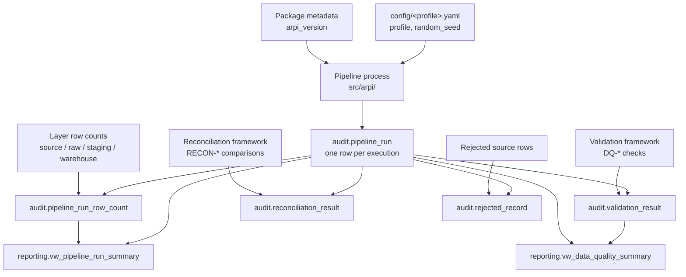

# STM-003 — Audit and Pipeline Metadata

## Header

| Field | Value |
|---|---|
| **Mapping ID** | `STM-003` |
| **Title** | Audit and pipeline metadata |
| **Status** | **Implemented** |
| **Version** | 1.0 |
| **Date** | 2026-07-28 |
| **Owner** | Michael Palmer |
| **Source system** | `arpi_synthetic_generator` (the pipeline process itself, not a data file) |
| **Target objects** | `audit.pipeline_run`, `audit.pipeline_run_row_count`, `audit.validation_result`, `audit.reconciliation_result`, `audit.rejected_record` |
| **Declared grains** | See each section below — one grain per table |
| **Phase** | Phase 0 |
| **Downstream objects** | `reporting.vw_pipeline_run_summary`, `reporting.vw_data_quality_summary` |

---

## 1. Purpose

The audit schema is where ARPI records what it did, whether it worked, and what it threw away. It is the
difference between a pipeline that asserts its data is good and one that can **show** it.

[ARCHITECTURE.md §10.2](../../ARCHITECTURE.md) gives the audit layer four responsibilities: record every
pipeline execution, record row counts before and after transformations, record rejected rows and validation
failures, and store reconciliation totals. §21.4 makes each run's output mandatory: pipeline run ID, start
and completion timestamp, source / staging / warehouse / rejected row counts, warning count, failed test
count, and reconciliation status.

**This mapping is unusual in one respect.** The other STM documents map *file* columns to *table* columns.
Here the "source" is the running process — configuration values, measured counts, check outcomes, and
timing. There is no CSV, no raw layer, and no staging layer. The pipeline writes directly to `audit.*`
using the `arpi_loader` role.

---

## 2. Lineage

**Ordered lineage statement**

1. At the start of a run the pipeline generates a fresh `run_uuid` (execution identity) and derives the
   `logical_run_key` (the deterministic fingerprint of the run's inputs), then inserts a row into
   `audit.pipeline_run` with `status = 'running'` and `completed_at = NULL`. Every subsequent audit row references the
   `pipeline_run_id` returned by that insert.
2. As each layer is loaded, the pipeline counts rows and inserts into `audit.pipeline_run_row_count`, once
   per `(entity_name, layer)`.
3. Structurally invalid source records are written to `audit.rejected_record` with a `REJ-*` code, a reason,
   and the full payload.
4. Each `DQ-*` check writes exactly one row to `audit.validation_result` — **including `skipped` rows**, so
   a silently absent check is distinguishable from a passing one.
5. Each `RECON-*` comparison writes one row to `audit.reconciliation_result`. The `difference` column is
   database-generated and cannot drift from its inputs.
6. At the end of the run the pipeline updates `audit.pipeline_run` with `completed_at`, a terminal
   `status`, `critical_failure_count`, and `warning_count`.
7. `reporting.vw_pipeline_run_summary` and `reporting.vw_data_quality_summary` expose the results to
   `arpi_reporter`.

---

## 3. `audit.pipeline_run`

**Declared grain:** one row per pipeline execution.
**Primary key:** `pipeline_run_id` (`bigserial`). **Natural key:** `run_uuid` (unique) — execution identity,
one value per attempt. `logical_run_key` groups equivalent attempts and is deliberately not unique.

| Source field | Source type | Target field | Target type | Transformation | Default behaviour | Validation | Rejection behaviour | Lineage field | Owner |
|---|---|---|---|---|---|---|---|---|---|
| *(database)* | — | `pipeline_run_id` | `bigserial` PK | Database sequence. Returned to the application so children can reference it. | `n/a — database-assigned` | PK unique, not null | Insert failure aborts the run before any work is done | itself | Database |
| Application-generated UUID | `uuid` | `run_uuid` | `uuid` NOT NULL UNIQUE | Direct. A random UUIDv4 generated by the application at the start of each execution attempt, so the run can be referenced in logs before the database row is visible. | `n/a — required` | Not null; UNIQUE | Unique violation aborts the run | itself | Pipeline |
| Derived run fingerprint | `uuid` | `logical_run_key` | `uuid` NOT NULL | Derived. A UUIDv5 over pipeline name, profile, seed and the reporting window. Shared by every equivalent attempt; not unique. | `n/a — required` | Not null | — | itself | Pipeline |
| Caller argument | `text` | `pipeline_name` | `text` NOT NULL | Direct. Identifies which pipeline ran. | `n/a — required` | Not null | Insert failure aborts the run | `pipeline_run_id` | Pipeline |
| `config.profile` | `text` | `profile_name` | `text` NOT NULL | Direct from the active configuration profile. | `n/a — required` | Not null; expected domain `development` \| `test` \| `portfolio` | Insert failure aborts the run | `pipeline_run_id` | Configuration |
| Caller argument | `text` | `run_mode` | `text` NOT NULL | Direct. The execution mode — full rebuild, incremental append, targeted dimension reload, or validation-only ([ARCHITECTURE.md §17.2](../../ARCHITECTURE.md)). | `n/a — required` | Not null | Insert failure aborts the run | `pipeline_run_id` | Pipeline |
| `config.random_seed` | `integer` | `random_seed` | `bigint` NOT NULL | Direct from configuration. **Recorded so any run is exactly reproducible from its own audit row.** | `n/a — required` | Not null | Insert failure aborts the run | `pipeline_run_id` | Configuration |
| Package metadata | `text` | `arpi_version` | `text` NOT NULL | Direct from the installed package version. | `n/a — required` | Not null | Insert failure aborts the run | `pipeline_run_id` | Package metadata |
| Wall clock | `timestamptz` | `started_at` | `timestamptz` NOT NULL | Current UTC time at run start. **The one place ARPI deliberately admits non-determinism** — it is audit metadata, never a KPI input, which is why it is excluded from `generation_manifest.json`. | `n/a — required` | Not null; `<= completed_at` when both are present | Insert failure aborts the run | itself | Pipeline |
| Wall clock | `timestamptz` | `completed_at` | `timestamptz` NULL | Current UTC time at run end, written by the closing update. | **`NULL` means the run is still in flight or terminated abnormally.** A run left with NULL after the process exits is itself a diagnostic signal. | `completed_at >= started_at`; `status = 'running'` implies NULL | Update failure leaves NULL, which correctly marks the run as unfinished | itself | Pipeline |
| Pipeline state | `text` | `status` | `text` NOT NULL CHECK | Direct. `running` on insert; one of `succeeded`, `failed`, `aborted` on close. | `n/a — required`; `running` on insert | CHECK `status IN ('running','succeeded','failed','aborted')`; **a run with `critical_failure_count > 0` must not end `succeeded`** | CHECK violation aborts the write | itself | Pipeline |
| Validation framework | `integer` | `critical_failure_count` | `integer` NOT NULL DEFAULT 0 | Count of `audit.validation_result` rows for this run with `severity = 'critical'` and `status = 'failed'`. | `0` | Not null; ≥ 0; must agree with `audit.validation_result` | Disagreement is a pipeline defect, not a data rejection | `pipeline_run_id` | Validation framework |
| Validation framework | `integer` | `warning_count` | `integer` NOT NULL DEFAULT 0 | Count of `audit.validation_result` rows for this run with `severity = 'warning'` and `status = 'failed'`. | `0` | Not null; ≥ 0 | As above | `pipeline_run_id` | Validation framework |
| Caller argument | `text` | `notes` | `text` NULL | Direct. Free-text operator note. | **`NULL` when no note was supplied.** | No constraint | n/a | `pipeline_run_id` | Pipeline |

---

## 4. `audit.pipeline_run_row_count`

**Declared grain:** one row per pipeline run, entity, and layer.
**Primary key:** composite `(pipeline_run_id, entity_name, layer)`.

| Source field | Source type | Target field | Target type | Transformation | Default behaviour | Validation | Rejection behaviour | Lineage field | Owner |
|---|---|---|---|---|---|---|---|---|---|
| `audit.pipeline_run.pipeline_run_id` | `bigint` | `pipeline_run_id` | `bigint` FK, part of PK | Direct. FK to `audit.pipeline_run`. | `n/a — required` | Not null; FK resolves; part of the composite PK | FK violation aborts the write | itself | Loader |
| Entity being loaded | `text` | `entity_name` | `text`, part of PK | Direct, e.g. `dim_date`, `dim_dealership`. Uses the **same entity names as the generation manifest and the sub-seed derivation**, so counts, digests, and seeds all key off one vocabulary. | `n/a — required` | Not null | Insert failure aborts the run | `pipeline_run_id` | Loader |
| Layer being counted | `text` | `layer` | `text` CHECK, part of PK | Direct. | `n/a — required` | CHECK `layer IN ('source','raw','staging','warehouse','rejected')` | CHECK violation aborts the write | `pipeline_run_id` | Loader |
| Measured count | `bigint` | `row_count` | `bigint` | Direct measurement at that layer. | `n/a — required` | Not null; ≥ 0 | Insert failure aborts the run | `pipeline_run_id` | Loader |
| Wall clock | `timestamptz` | `recorded_at` | `timestamptz` | Current UTC time at measurement. | `n/a — required` | Not null | Insert failure aborts the run | itself | Loader |

**Which layers are actually written.** The `layer` CHECK admits five values and **all five are recorded**:
`source` (by `src/arpi/pipeline.py`) and `raw`, `staging`, `warehouse` plus `rejected` (by
`src/arpi/ingestion/loader.py`). [ARCHITECTURE.md §21.4](../../ARCHITECTURE.md) is therefore satisfied, and
the chain identity `raw = staging accepted + rejected invalid + deduplicated` is measured term by term
rather than derived — see [LIMITATIONS.md §9.1](../../LIMITATIONS.md), which records the closed gap.

Phase 0 recorded only three of the five, which is what `DOC-23` registered; this paragraph described that
state and is corrected here. Because every layer but `source` is written by the loader, a run that skips
the optional database load still records the `source` layer alone.

**Expected pattern for a clean Phase 0 run with the database load enabled:** `source = raw = warehouse`.
`rejected` would be `0` if it were recorded, because `validation.max_rejected_record_ratio` is `0.0`.

This table is the durable record of the counts behind `RECON-DIM-DATE-ROWCOUNT` and
`RECON-DIM-DEALERSHIP-ROWCOUNT` (section 9). Those reconciliations do not read it: each compares the
generator's in-memory row count with a live `count(*)` against the warehouse table.

---

## 5. `audit.validation_result`

**Declared grain:** one row per validation check evaluation per pipeline run.
**Primary key:** `validation_result_id` (`bigserial`). **Natural key:**
`(pipeline_run_id, check_id, target_object)`.

| Source field | Source type | Target field | Target type | Transformation | Default behaviour | Validation | Rejection behaviour | Lineage field | Owner |
|---|---|---|---|---|---|---|---|---|---|
| *(database)* | — | `validation_result_id` | `bigserial` PK | Database sequence. | `n/a — database-assigned` | PK unique | Insert failure aborts the run | itself | Database |
| `audit.pipeline_run.pipeline_run_id` | `bigint` | `pipeline_run_id` | `bigint` FK | Direct. | `n/a — required` | Not null; FK resolves | FK violation aborts the write | itself | Validation framework |
| Check definition | `text` | `check_id` | `text` | Direct — one of the `DQ-*` identifiers in section 8. **Shared between Python and SQL**, so the same check has the same ID wherever it runs. | `n/a — required` | Not null; must exist in the check register | An unregistered `check_id` is a code defect | `pipeline_run_id` | Validation framework |
| Check definition | `text` | `check_name` | `text` | Direct. Human-readable name. | `n/a — required` | Not null | n/a | `pipeline_run_id` | Validation framework |
| Check definition | `text` | `check_category` | `text` | Direct, e.g. `structural`, `business_rule`, `privacy`, `determinism`. Used to group the data-quality summary. | `n/a — required` | Not null | n/a | `pipeline_run_id` | Validation framework |
| Object under test | `text` | `target_object` | `text` | Direct, e.g. `warehouse.dim_date`. | `n/a — required` | Not null | n/a | `pipeline_run_id` | Validation framework |
| Check definition | `text` | `severity` | `text` CHECK | Direct. **`critical` failures fail the run**; `warning` and `info` do not. | `n/a — required` | CHECK `severity IN ('critical','warning','info')` | CHECK violation aborts the write | `pipeline_run_id` | Validation framework |
| Check outcome | `text` | `status` | `text` CHECK | Direct. `skipped` is written explicitly rather than omitted, so an absent check is distinguishable from a passing one. | `n/a — required` | CHECK `status IN ('passed','failed','skipped')`; `passed` implies `failed_record_count = 0` | CHECK violation aborts the write | `pipeline_run_id` | Validation framework |
| Measurement | `numeric` | `observed_value` | `numeric` NULL | Direct. What was measured. | **`NULL` for non-numeric checks** — it does not mean zero. | No constraint | n/a | `pipeline_run_id` | Validation framework |
| Check definition or config | `numeric` | `expected_value` | `numeric` NULL | Direct. What was expected, from the check definition or from a `validation.*` configuration value. | **`NULL` for non-numeric checks.** | No constraint | n/a | `pipeline_run_id` | Validation framework |
| Measurement | `bigint` | `failed_record_count` | `bigint` NOT NULL DEFAULT 0 | Count of records failing the check. | `0` | Not null; ≥ 0; must be `0` when `status = 'passed'` | Inconsistency is a code defect | `pipeline_run_id` | Validation framework |
| Check outcome | `text` | `message` | `text` NULL | Direct. Explanatory message. | **`NULL` when there is nothing to explain.** | No constraint | n/a | `pipeline_run_id` | Validation framework |
| Wall clock | `timestamptz` | `evaluated_at` | `timestamptz` NOT NULL | Current UTC time at evaluation. | `n/a — required` | Not null | Insert failure aborts the run | itself | Validation framework |

**Completeness rule.** Every check in the register (section 8) must produce a row on every run, including
`skipped` rows. **A check that produces no row is itself a defect** — silence is not a pass.

---

## 6. `audit.reconciliation_result`

**Declared grain:** one row per reconciliation evaluation per pipeline run.
**Primary key:** `reconciliation_result_id` (`bigserial`). **Natural key:**
`(pipeline_run_id, reconciliation_id)`.

| Source field | Source type | Target field | Target type | Transformation | Default behaviour | Validation | Rejection behaviour | Lineage field | Owner |
|---|---|---|---|---|---|---|---|---|---|
| *(database)* | — | `reconciliation_result_id` | `bigserial` PK | Database sequence. | `n/a — database-assigned` | PK unique | Insert failure aborts the run | itself | Database |
| `audit.pipeline_run.pipeline_run_id` | `bigint` | `pipeline_run_id` | `bigint` FK | Direct. | `n/a — required` | Not null; FK resolves | FK violation aborts the write | itself | Reconciliation framework |
| Reconciliation definition | `text` | `reconciliation_id` | `text` NULL | Direct — one of the `RECON-*` identifiers ([KPI_CATALOG.md §36](../../KPI_CATALOG.md)). | `n/a — always supplied` | **Nullable in the DDL**; no database constraint. The reconciliation framework always supplies it, so a NULL here would mean a defective writer, not permitted data. | An unregistered ID is a code defect | `pipeline_run_id` | Reconciliation framework |
| Reconciliation definition | `text` | `description` | `text` NULL | Direct. What is being compared, in business terms. | `n/a — always supplied` | **Nullable in the DDL**; no database constraint. | n/a | `pipeline_run_id` | Reconciliation framework |
| Left-hand query | `text` | `left_source` | `text` NULL | Direct. Identity of the left-hand side, e.g. `generator:dim_date`. | `n/a — always supplied` | **Nullable in the DDL**; no database constraint. | n/a | `pipeline_run_id` | Reconciliation framework |
| Left-hand measurement | `numeric` | `left_value` | `numeric` NULL | Direct. | `n/a — always supplied` | **Nullable in the DDL.** A NULL would silently make the generated `difference` NULL, so the writer never omits it. | Insert failure aborts the run | `pipeline_run_id` | Reconciliation framework |
| Right-hand query | `text` | `right_source` | `text` NULL | Direct. Identity of the right-hand side, e.g. `warehouse.dim_date`. | `n/a — always supplied` | **Nullable in the DDL**; no database constraint. | n/a | `pipeline_run_id` | Reconciliation framework |
| Right-hand measurement | `numeric` | `right_value` | `numeric` NULL | Direct. | `n/a — always supplied` | **Nullable in the DDL.** A NULL would silently make the generated `difference` NULL, so the writer never omits it. | Insert failure aborts the run | `pipeline_run_id` | Reconciliation framework |
| *(database)* | — | `difference` | `numeric` **GENERATED ALWAYS AS (`left_value − right_value`) STORED** | **Database-generated. The application never supplies it**, so it can never drift from its inputs. | `n/a — generated` | Always consistent with its inputs by construction | Attempting to write it is a code defect and is rejected by the database | itself | Database |
| Configuration | `numeric` | `tolerance` | `numeric` NOT NULL DEFAULT 0 | Direct. `0` for count reconciliations; `validation.numeric_absolute_tolerance` (0.01) for monetary ones. | `0` | Not null; ≥ 0 | Insert failure aborts the run | `pipeline_run_id` | Configuration |
| Evaluation | `text` | `status` | `text` NULL, CHECK | `passed` if and only if `abs(difference) <= tolerance`, else `failed`. **There is no `warning`** — totals either reconcile within tolerance or they do not. | `n/a — always supplied` | **Nullable in the DDL** — the CHECK is `status IN ('passed','failed')`, which a NULL satisfies vacuously. The writer always supplies a value, and it must agree with `difference` and `tolerance`. | CHECK violation aborts the write | `pipeline_run_id` | Reconciliation framework |
| *(database)* | — | `evaluated_at` | `timestamptz` NULL DEFAULT `now()` | **Database-supplied.** The loader omits this column from its INSERT, so the DDL default records the UTC instant of the insert. | `now()` | **Nullable in the DDL**; in practice the default always populates it because the column is never written explicitly with NULL. | Insert failure aborts the run | itself | Database |

---

## 7. `audit.rejected_record`

**Declared grain:** one row per rejected source record per pipeline run.
**Primary key:** `rejected_record_id` (`bigserial`). **Natural key:**
`(pipeline_run_id, source_entity, source_record_key)` — where `source_record_key` may be NULL.

| Source field | Source type | Target field | Target type | Transformation | Default behaviour | Validation | Rejection behaviour | Lineage field | Owner |
|---|---|---|---|---|---|---|---|---|---|
| *(database)* | — | `rejected_record_id` | `bigserial` PK | Database sequence. | `n/a — database-assigned` | PK unique | Insert failure aborts the run | itself | Database |
| `audit.pipeline_run.pipeline_run_id` | `bigint` | `pipeline_run_id` | `bigint` FK | Direct. | `n/a — required` | Not null; FK resolves | FK violation aborts the write | itself | Loader |
| Entity being loaded | `text` | `source_entity` | `text` | Direct, e.g. `dim_dealership`. | `n/a — required` | Not null | n/a | `pipeline_run_id` | Loader |
| Offending record's natural key | `text` | `source_record_key` | `text` NULL | Direct where identifiable — the `date_key`, `dealership_id`, or source row number. | **`NULL` when the record is too malformed to identify.** The payload still preserves it, so nothing is lost. | No constraint | n/a | `pipeline_run_id` | Loader |
| Rejection classification | `text` | `rejection_code` | `text` | Direct — one of the `REJ-*` codes in [README.md §4](README.md). | `n/a — required` | Not null; must exist in the code register | An unregistered code is a code defect | `pipeline_run_id` | Loader |
| Rejection detail | `text` | `rejection_reason` | `text` NULL | Direct. Human-readable reason, specific enough to diagnose from. | `n/a — always supplied` | **Nullable in the DDL**; no database constraint. `rejection_code` next to it *is* `NOT NULL`, so a rejection is never wholly unexplained even if the prose reason is absent. | n/a | `pipeline_run_id` | Loader |
| The offending record | `jsonb` | `record_payload` | `jsonb` NULL | The record as received, serialized to JSON. **Because all ARPI source data is synthetic, storing the payload carries no privacy risk** — this would be a materially different decision with real data. | **`NULL` when the payload cannot be serialized.** | No constraint | n/a | `pipeline_run_id` | Loader |
| Wall clock | `timestamptz` | `rejected_at` | `timestamptz` NOT NULL | Current UTC time at rejection. | `n/a — required` | Not null | Insert failure aborts the run | itself | Loader |

---

## 8. Load strategy

| Object | Strategy | Write semantics |
|---|---|---|
| `audit.pipeline_run` | **Insert-only**: plain `INSERT` | The run is tracked in memory for the whole execution and written **once, at the end**, already carrying its terminal `status` and `completed_at`. Every attempt inserts its own row; a rerun adds a row rather than updating one. **Never updated by a later attempt, never deleted, never truncated.** |
| `audit.pipeline_run_row_count` | **Insert-only** | The composite PK `(pipeline_run_id, entity_name, layer)` is now per attempt, so two attempts' counts cannot collide and no upsert is needed. |
| `audit.validation_result` | **Insert-only** | One row per check per attempt, including `skipped`. A rerun records its own results alongside the previous attempt's. |
| `audit.reconciliation_result` | **Insert-only from Python.** `audit.fn_record_all_reconciliations` still deletes by `pipeline_run_id` first, which now guards only a repeat call *within* one execution. | One row per reconciliation per attempt. `difference` is database-generated. |
| `audit.rejected_record` | **Insert-only** | One row per rejected record per run, with the payload preserved. Always empty in Phase 0 — the generators emit only contract-shaped rows and so cannot reject one. |

### 8.1 Why every attempt keeps its own child rows

Before [ADR-0010](../architecture-decisions/ADR-0010-execution-identity-and-logical-run-key.md),
`run_uuid` was a UUIDv5 over the pipeline name, profile, random seed and reporting window, and
`audit.pipeline_run` was written with `INSERT … ON CONFLICT (run_uuid) DO UPDATE`. A rerun with the same
parameters therefore resolved to the *same* `pipeline_run_id`, and the loader had to delete that run's
child rows before re-inserting them or the row-count primary key would have been violated.

That was the wrong trade. It meant:

- `started_at` survived from the first attempt while `completed_at` came from the last, so the recorded
  duration described no real execution;
- `arpi_version` and `run_mode` kept the first attempt's values;
- a failed attempt followed by a successful retry left one `succeeded` row with the failure erased;
- child rows could no longer be attributed to the attempt that produced them.

`run_uuid` is now **execution identity**: random, generated once per attempt, never reused.
`logical_run_key` carries the deterministic fingerprint and groups equivalent attempts without collapsing
them. Because each attempt owns a distinct `pipeline_run_id`, its child rows cannot collide with any other
attempt's, so **no delete-before-insert is needed and none is performed**. Every attempt keeps exactly the
evidence it produced.

Warehouse idempotency is unaffected, because it never depended on this table: it is carried by
deterministic source generation, natural and source keys, surrogate-key resolution, the dimension merges,
attribute hashes and unique grain constraints. A rerun still produces no duplicate warehouse row.

**The SQL write path.** `audit.fn_record_validation_result` and `audit.fn_record_all_dq_checks`
(`sql/08_validation/`) append a row on every call. Previously the loader's `DELETE` could remove
SQL-appended rows along with its own if the loader was rerun for the same logical run, which made
"record the SQL checks after the Python load" a required ordering. With the delete gone and each attempt
scoped to its own `pipeline_run_id`, that hazard no longer exists.
`audit.fn_record_all_reconciliations` retains a delete scoped to `p_pipeline_run_id`, which now guards only
one case: being called twice within a single execution, where it must restate its verdicts rather than
double them.

**Other runs are never touched**, and that now includes every earlier attempt at the same logical run. No
audit object is ever truncated. This satisfies [ARCHITECTURE.md §17.3](../../ARCHITECTURE.md) more fully
than before: prior **run** history was already preserved, and the history of repeated executions *of the
same run* — which the deterministic identifier used to discard — is preserved as well.

**Historical limitation.** Rows written before this change may each represent several collapsed attempts.
The migration backfills `logical_run_key` correctly for them, but the overwritten attempts cannot be
recovered and were not invented.

**Role separation.** `arpi_loader` inserts and updates audit tables; `arpi_reporter` has read access only,
and only through `reporting.vw_pipeline_run_summary` and `reporting.vw_data_quality_summary`
([ARCHITECTURE.md §22.3](../../ARCHITECTURE.md)).

---

## 9. Idempotency guarantees

| Guarantee | Mechanism |
|---|---|
| A rerun never overwrites prior run history | Every audit row is keyed to a distinct `pipeline_run_id`; nothing is truncated. |
| A run cannot be recorded twice | `run_uuid` is `UNIQUE`. |
| Row counts cannot be double-recorded within a run | Composite PK `(pipeline_run_id, entity_name, layer)`, with `ON CONFLICT DO UPDATE` for a corrected measurement. |
| `difference` can never disagree with its inputs | It is a `GENERATED ALWAYS AS … STORED` column; the application cannot write it. |
| An abnormally terminated run is visibly incomplete | `completed_at` stays NULL and `status` stays `running` — which is a diagnostic signal, not a silent success. |
| A run is fully reproducible from its own audit row | `random_seed`, `profile_name`, and `arpi_version` are all recorded on `audit.pipeline_run`. |
| A failed run cannot be mistaken for a successful one | `critical_failure_count > 0` must not coexist with `status = 'succeeded'`. |

> **Deliberate non-determinism.** `started_at`, `completed_at`, `recorded_at`, `evaluated_at`, and
> `rejected_at` are wall-clock values, so **two runs of the same profile produce different audit rows**.
> That is correct: audit metadata is about *when the pipeline ran*, not about the data. It is also exactly
> why `generation_manifest.json` carries no timestamp and instead states
> `"timestamp_policy": "omitted for deterministic output"`. Timing belongs here, not in the data.

---

## 10. Rejection handling

The audit schema is the **destination** of rejection handling rather than a subject of it. Records
rejected while loading `dim_date` (STM-001) or `dim_dealership` (STM-002) are written here.

Failure modes of the audit writes themselves:

| Condition | Outcome |
|---|---|
| `audit.pipeline_run` insert fails | The run aborts immediately. **No pipeline work proceeds without an audit parent** — unaudited work is worse than no work. |
| A child insert fails a FK or CHECK constraint | The write aborts and the enclosing transaction rolls back. This is a code defect, not a data rejection. |
| The process dies mid-run | `completed_at` stays NULL and `status` stays `running`. The next run does not clean this up: the stale row is left as evidence. |
| `run_uuid` collides | A `UNIQUE` violation aborts the run. |

---

## 11. Validation checks gating the load

The audit schema is the **recipient** of validation results, so no `DQ-*` check gates writing to it. The
checks that *write here* are:

| Check ID | Assertion | Severity | Target |
|---|---|---|---|
| `DQ-DATE-001` | `date_key` is unique | critical | `warehouse.dim_date` |
| `DQ-DATE-002` | The date range is contiguous | critical | `warehouse.dim_date` |
| `DQ-DATE-003` | `date_key` matches `full_date` | critical | `warehouse.dim_date` |
| `DQ-DATE-004` | No required field is NULL | critical | `warehouse.dim_date` |
| `DQ-DATE-005` | Selling-day ratio within tolerance | warning | `warehouse.dim_date` |
| `DQ-DLR-001` | `dealership_key` is unique | critical | `warehouse.dim_dealership` |
| `DQ-DLR-002` | `dealership_id` is unique among current rows | critical | `warehouse.dim_dealership` |
| `DQ-DLR-003` | Store count matches configuration | critical | `warehouse.dim_dealership` |
| `DQ-DLR-004` | No prohibited PII column is present | critical | `warehouse.dim_dealership` |
| `DQ-DLR-005` | Franchise brand present for franchise stores | critical | `warehouse.dim_dealership` |
| `DQ-GEN-001` | Declared schema matches output schema | critical | all generated entities |
| `DQ-GEN-002` | Determinism digest recorded | critical | all generated entities |

Two further families are implemented in the SQL validation layer only, because they assert properties that
only the database can observe — see [DATA_DICTIONARY.md §21.2](../../DATA_DICTIONARY.md) for the full list:

| Check family | Assertions | Severity |
|---|---|---|
| `DQ-REF-001` … `DQ-REF-005` | Grain uniqueness on `dim_date` and `dim_dealership`; calendar contiguity by window function; presence of the enforcing constraints in the catalogue; SCD Type 2 timeline contiguity and non-overlap | critical |
| `DQ-AUD-001` … `DQ-AUD-005` | Every `validation_result`, `rejected_record`, `pipeline_run_row_count`, and `reconciliation_result` resolves to a `pipeline_run`; no run is internally inconsistent | critical |

`DQ-AUD-001` … `005` are the audit schema validating **itself** — the referential and self-consistency
guarantees this document relies on are asserted, not assumed.

Self-consistency rules that the audit schema must itself satisfy:

- `audit.pipeline_run.critical_failure_count` equals the count of `audit.validation_result` rows for the run
  with `severity = 'critical'` and `status = 'failed'`.
- `audit.pipeline_run.warning_count` equals the count with `severity = 'warning'` and `status = 'failed'`.
- Every registered check produces exactly one row per run.
- `status = 'succeeded'` requires `critical_failure_count = 0`.

---

## 12. Reconciliations

| Reconciliation ID | Description | Left | Right | Tolerance | Status |
|---|---|---|---|---|---|
| `RECON-DIM-DATE-ROWCOUNT` | Generated `dim_date` row count equals the `warehouse.dim_date` row count after the merge | `generator:dim_date` — the generated frame's row count | `warehouse.dim_date` — a live `count(*)` | 0 (exact) | **Implemented** |
| `RECON-DIM-DEALERSHIP-ROWCOUNT` | Generated `dim_dealership` row count equals the `warehouse.dim_dealership` row count after the merge | `generator:dim_dealership` — the generated frame's row count | `warehouse.dim_dealership` — a live `count(*)` | 0 (exact) | **Implemented** |

**These two are the only reconciliations exercised anywhere in ARPI today.** They are defined in
`src/arpi/constants.py` and evaluated in `src/arpi/ingestion/loader.py`, and they run only when the optional
database load runs. Every other entry in the register
([KPI_CATALOG.md §36](../../KPI_CATALOG.md)) is Planned or Deferred, because the facts they reconcile do not
exist.

> **What they do not cover.** Each compares exactly two numbers — generated rows against warehouse rows. No
> reconciliation spans the raw or staging layers, and none accounts for rejected records, because
> `staging` and `rejected` row counts are not recorded at all (see section 4). Neither of them appears in
> [ARCHITECTURE.md §21.3](../../ARCHITECTURE.md)'s list of six required reconciliations: they are a Phase 0
> addition beyond it.

---

## 13. Open questions and known gaps

- **No retention policy.** Audit rows accumulate indefinitely. At Phase 0 volumes this is irrelevant, but a
  portfolio-scale pipeline run with per-entity counts and per-check results will grow the schema steadily.
  No purge, archive, or partitioning strategy is defined.
- **A run that dies before the database load leaves no trace in the `audit` schema.** All audit rows are
  written in one batch at the end of the load (section 8), so an aborted run, or a run with
  `database.enabled = false`, produces no `audit.pipeline_run` row at all. Nothing is ever observed in
  `status = 'running'`, which is why `reporting.vw_pipeline_run_summary` can always report a real duration
  — but it also means the database holds no evidence of a run that crashed early. In that case the CSVs,
  the manifest, and the printed validation report are the evidence.
- **The Python and SQL write paths disagree on rerun semantics.** The loader replaces a run's
  `audit.validation_result` rows; `audit.fn_record_validation_result` and `audit.fn_record_all_dq_checks`
  append to them. The two have not been reconciled, and `sql/README.md` still describes audit history as
  purely accumulating, which is true of the SQL functions and not of the loader.
- **`check_category` has no agreed vocabulary and no constrained domain.** The Python constants, the SQL
  checks, [DATA_DICTIONARY.md §21.1](../../DATA_DICTIONARY.md) and the DDL comment in
  `sql/00_database/03_audit_tables.sql` each name a different set of category values, and the column
  carries no `CHECK` constraint. Registered as `DOC-24` in
  [DOCUMENTATION_BACKLOG.md](../requirements/DOCUMENTATION_BACKLOG.md).
- **`staging` and `rejected` row counts are not recorded**, so [ARCHITECTURE.md §21.4](../../ARCHITECTURE.md)
  is not satisfied. See section 4 and `DOC-23`.
- **`critical_failure_count` is maintained by the application**, not by a database trigger. It can in
  principle disagree with `audit.validation_result`. The self-consistency rule in section 11 is asserted by
  tests rather than enforced by a constraint.
- **No cross-run trending.** The schema records each run independently. There is no view that trends
  data-quality outcomes across runs, which would be the natural next step for the Power BI Data Quality
  page.
- **Timestamps are wall-clock and therefore non-reproducible.** Intentional, but it means audit tables
  cannot participate in the byte-identical output guarantee that covers the generated CSVs.
