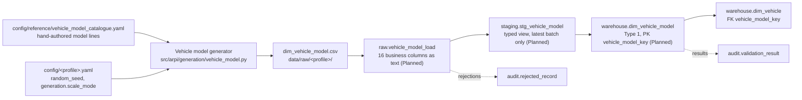

# STM-004 — Vehicle Model Dimension

## Header

| Field | Value |
|---|---|
| **Mapping ID** | `STM-004` |
| **Title** | Vehicle model dimension (Slowly Changing Dimension Type 1) |
| **Status** | **Implemented** — source generation and the pandas data-quality suite. The SQL DDL, the raw/staging objects and the warehouse merge are **Planned** and owned by the SQL delivery increment. |
| **Version** | 1.0 |
| **Date** | 2026-07-28 |
| **Owner** | Michael Palmer |
| **Source system** | `arpi_synthetic_generator` |
| **Target object** | `warehouse.dim_vehicle_model` |
| **Declared grain** | **One row per model year, make, model and trim combination.** |
| **Phase** | Phase 1 (`P1.1-01`) |
| **Reference data** | `config/reference/vehicle_model_catalogue.yaml` |
| **Generator** | `src/arpi/generation/vehicle_model.py` |
| **Intermediate objects** | `raw.vehicle_model_load`, `staging.stg_vehicle_model` (**Planned**) |
| **Downstream objects** | `warehouse.dim_vehicle`, `warehouse.fact_vehicle_inventory_snapshot`, `warehouse.fact_lead`, `warehouse.fact_appointment` |

---

## 1. Purpose

`warehouse.dim_vehicle_model` is the governed vocabulary every physical vehicle resolves to. Without it,
model and trim performance, days supply by model, and franchise-alignment analysis are all ungroupable —
and model and trim performance is a core analytical requirement (`docs/research.md` §4.7).

It is also the project's reference implementation of **source-controlled reference data**: the catalogue
lives in a reviewable YAML file rather than inside the generator, so a change to the model vocabulary shows
up in a diff.

### 1.1 What the catalogue is, and is not

`config/reference/vehicle_model_catalogue.yaml` is a **representative synthetic subset**, hand-authored for
ARPI. It is:

- **not** sourced from any manufacturer feed, dealer management system, NHTSA vPIC extract, or any other
  external source — **no network call is made at any point**, and
  `features.enable_public_vehicle_enrichment` stays `false` and is never read by the generator;
- **not** complete and **not** current: it does not enumerate every model line, trim, model year, or
  specification a manufacturer has offered or offers today, and the specifications are plausible rather
  than verified.

Make, model and trim strings are factual commercial product names. They are product identifiers, not
personal data, and no row here relates to any real vehicle, VIN, owner, or transaction.

---

## 2. Lineage

**Ordered lineage statement**

1. The generator reads `config/reference/vehicle_model_catalogue.yaml` and **expands** each model line into
   one candidate row per `(trim, model year)` pair.
2. **Every expanded row is validated before any of them is used.** A missing field, an unknown enumerated
   value, an out-of-range integer, a repeated model year within one trim, a discontinued line carrying a
   current model year, or a duplicate `(model_year, make, model, trim)` raises `GenerationError` naming the
   offending model line and trim. The run stops; nothing is written.
3. The generator resolves the profile's row target from `generation.scale_mode` — 40 (`test`), 120
   (`development`), 240 (`portfolio`). **If the catalogue holds fewer rows than the target, the run fails
   with both counts in the message.**
4. It selects a **deterministic stratified subset** (section 4.2) using `rng_for(random_seed,
   "dim_vehicle_model")`. The namespace is this entity's alone, so adding or removing any other generator
   cannot perturb this one's output.
5. The selected rows are sorted by the natural key `(model_year, make, model, trim)`. `vehicle_model_id` is
   assigned as `VMD-#####` over that order, and `vehicle_model_key` is the same ordinal — so the key order
   is the `vehicle_model_id` order by construction.
6. The declared drivetrain and body-style shares are logged at INFO on every run.
7. Rows are written to `data/raw/<profile>/dim_vehicle_model.csv` — UTF-8, LF endings, header row, ISO-8601
   dates, lowercase booleans, declared column order.
8. **Planned:** the CSV is loaded into `raw.vehicle_model_load` (all business columns as `text`, plus
   `raw_record_id`, `load_batch_id`, `source_file_name`, `source_row_number`, `ingested_at`),
   `staging.stg_vehicle_model` casts to warehouse types and exposes the latest `load_batch_id` only, and
   `warehouse.dim_vehicle_model` is loaded by a **Type 1 MERGE on `vehicle_model_id`**.

---

## 3. Mapping table

All 16 columns of `warehouse.dim_vehicle_model`, in declared order. **Every column is `NOT NULL`.**

| Source field | Source type | Target field | Target type | Transformation | Default behaviour | Validation | Rejection behaviour | Lineage field | Owner |
|---|---|---|---|---|---|---|---|---|---|
| *(derived)* | — | `vehicle_model_key` | `integer` PK | Deterministic ordinal `1..N` over `vehicle_model_id` ascending. No database sequence, no insertion-order dependence. | `n/a — required` | PK not null and unique; equals the rank of `vehicle_model_id` | `REJ-TYPE-001` if not castable; `REJ-KEY-001` on duplicate | `load_batch_id`, `source_row_number` | Vehicle model generator |
| *(derived)* | `text` | `vehicle_model_id` | `varchar(16)` | `VMD-` plus the five-digit zero-padded ordinal of the row in **sorted natural-key order**. | `n/a — required` | `DQ-VMD-001` unique; matches `^VMD-\d{5}$` | `REJ-NULL-001` if empty; `REJ-KEY-001` on duplicate; `REJ-DOMAIN-001` on a malformed id | `load_batch_id` | Vehicle model generator |
| `model_years[]` | `integer` | `model_year` | `smallint` | Direct, one row per listed year. **Natural-key position 1.** | `n/a — required` | `DQ-VMD-002`; `CHECK model_year BETWEEN 1990 AND 2030` | `REJ-TYPE-001` if not an integer; `REJ-DOMAIN-001` if outside 1990..2030 | `load_batch_id` | Catalogue |
| `make` | `text` | `make` | `varchar(40)` | Direct from the model line. **Natural-key position 2.** A commercial product name, not personal data. | `n/a — required` | `DQ-VMD-002`; `DQ-VMD-005` agreement with `franchise_alignment`; `DQ-VMD-006` schema is PII-free | `REJ-NULL-001`; `REJ-RULE-001` on franchise disagreement | `load_batch_id` | Catalogue |
| `model` | `text` | `model` | `varchar(60)` | Direct from the model line. **Natural-key position 3.** | `n/a — required` | `DQ-VMD-002`; not null; length ≤ 60 | `REJ-NULL-001`; `REJ-DOMAIN-001` if over length | `load_batch_id` | Catalogue |
| `trims[].trim` | `text` | `trim` | `varchar(40)` | Direct from the trim entry. **Natural-key position 4.** ARPI never emits a NULL trim: a model line without a distinguishing trim carries an explicit `Base`. | `n/a — required` | `DQ-VMD-002`; not null; length ≤ 40 | `REJ-NULL-001`; `REJ-DOMAIN-001` | `load_batch_id` | Catalogue |
| `body_style` | `text` | `body_style` | `varchar(30)` | Direct from the model line. | `n/a — required` | `DQ-VMD-004`; domain `Sedan\|Coupe\|Hatchback\|Wagon\|SUV\|Crossover\|Pickup\|Van\|Convertible` | `REJ-DOMAIN-001` if outside the enumeration | `load_batch_id` | Catalogue |
| `vehicle_class` | `text` | `vehicle_class` | `varchar(30)` | Direct from the model line. | `n/a — required` | `DQ-VMD-004`; domain `Compact\|Midsize\|Fullsize\|Luxury\|Sports\|Truck\|SUV\|Van` | `REJ-DOMAIN-001` | `load_batch_id` | Catalogue |
| `trims[].fuel_type` | `text` | `fuel_type` | `varchar(20)` | Direct from the trim entry, so a hybrid or diesel trim of a petrol line is expressible. | `n/a — required` | `DQ-VMD-004`; domain `Gasoline\|Diesel\|Hybrid\|Plug-in Hybrid\|Electric` | `REJ-DOMAIN-001` | `load_batch_id` | Catalogue |
| `trims[].drivetrain` | `text` | `drivetrain` | `varchar(10)` | Direct from the trim entry. Trim-level so the AWD share is a property of the catalogue, not of a rule. | `n/a — required` | `DQ-VMD-004`; domain `FWD\|RWD\|AWD\|4WD`; AWD share asserted as a band by `tests/data_quality/test_vehicle_model_data_quality.py` | `REJ-DOMAIN-001` | `load_batch_id` | Catalogue |
| `trims[].transmission` | `text` | `transmission` | `varchar(20)` | Direct from the trim entry. | `n/a — required` | `DQ-VMD-004`; domain `Automatic\|Manual\|CVT` | `REJ-DOMAIN-001` | `load_batch_id` | Catalogue |
| `doors` | `integer` | `doors` | `smallint` | Model-line value, **overridable per trim**. | `n/a — required` | `CHECK doors BETWEEN 2 AND 5` | `REJ-TYPE-001`; `REJ-DOMAIN-001` if outside 2..5 | `load_batch_id` | Catalogue |
| `seating_capacity` | `integer` | `seating_capacity` | `smallint` | Model-line value, **overridable per trim** (a captain's-chair trim seats 7 where the line seats 8). | `n/a — required` | `CHECK seating_capacity BETWEEN 2 AND 8` | `REJ-TYPE-001`; `REJ-DOMAIN-001` if outside 2..8 | `load_batch_id` | Catalogue |
| `franchise_alignment` | `text` | `franchise_alignment` | `varchar(40)` | Direct from the model line. **Explicit, never NULL.** `Independent Used` means "carried as used inventory only", which is information — a NULL would be an absence of information. | `n/a — required` | `DQ-VMD-004` domain `Chevrolet\|Subaru\|Independent Used`; `DQ-VMD-005` a `Chevrolet`/`Subaru` alignment carries that make and no other alignment carries a franchise make | `REJ-DOMAIN-001`; `REJ-RULE-001` on disagreement with `make` | `load_batch_id` | Catalogue |
| `is_current_model_line` | `boolean` | `is_current_model_line` | `boolean` | Direct from the model line, rendered lowercase `true`/`false`. Gates which models a store may stock **new**. | `n/a — required` | Not null; a `false` line must not carry a model year later than 2025 | `REJ-TYPE-001` if not `true`/`false`; `REJ-RULE-001` on a discontinued current-model-year line | `load_batch_id` | Catalogue |
| *(constant)* | `text` | `source_system` | `varchar(40)` | **Constant** `arpi_synthetic_generator`, on every row, so no reviewer can mistake this for a manufacturer extract. | `n/a — constant` | Must equal `arpi_synthetic_generator` | `REJ-RULE-001` on any other value | itself | Vehicle model generator |
| *(database)* | — | `raw_record_id` | `bigserial` | Database-assigned. **Raw layer only.** | `n/a — database-assigned` | PK uniqueness | n/a | itself | Database |
| *(load process)* | — | `load_batch_id` | `uuid` | Assigned once per load. **Raw and staging layers only.** | `n/a — required` | Not null | `REJ-PARSE-001` if the batch cannot be initialised | itself | Loader |
| *(load process)* | — | `source_file_name` | `text` | Name of the source file. **Raw and staging layers only.** | `n/a — required` | Not null | n/a | itself | Loader |
| *(load process)* | — | `source_row_number` | `integer` | 1-based row number, excluding the header. **Raw and staging layers only.** | `n/a — required` | Not null; ≥ 1 | n/a | itself | Loader |
| *(database)* | — | `ingested_at` | `timestamptz` | Database `DEFAULT now()`. **Raw and staging layers only.** | `now()` | Not null | n/a | itself | Database |

**Uniqueness constraints**

- `vehicle_model_key` — primary key.
- `vehicle_model_id` — UNIQUE.
- `(model_year, make, model, trim)` — UNIQUE. **This is the grain constraint.** No NULL trim exists, so no
  NULL-distinctness question arises.

---

## 4. Derivation reference

### 4.1 Catalogue structure

`model_lines` holds one entry per model line. Each entry declares what the whole line shares plus a `trims`
list; the generator expands the cross product of `(trim, model year)`.

| Level | Key | Required | Notes |
|---|---|:---:|---|
| Line | `make`, `model` | ✅ | Natural-key positions 2 and 3 |
| Line | `franchise_alignment` | ✅ | `Chevrolet` \| `Subaru` \| `Independent Used` |
| Line | `body_style`, `vehicle_class` | ✅ | Enumerated |
| Line | `doors`, `seating_capacity` | ✅ | Trim-overridable |
| Line | `is_current_model_line` | ✅ | `false` ⇒ no model year after 2025 |
| Line | `model_years` | ✅ | Non-empty, no repeats, 1990..2030; trim-overridable |
| Trim | `trim` | ✅ | Natural-key position 4 |
| Trim | `fuel_type`, `drivetrain`, `transmission` | ✅ | Enumerated |
| Trim | `model_years`, `doors`, `seating_capacity` | ⬜ | Override the line value |

Because model years and trim counts differ line by line, the model-year and trim distributions are
non-uniform by construction rather than by a post-hoc weighting rule.

### 4.2 Deterministic subset selection

The catalogue is larger than every profile's target, so the generator selects a subset. Selection is
**stratified by `(franchise_alignment, era)`**, where `era` is:

| Era | Definition |
|---|---|
| `current_new` | `is_current_model_line` **and** `model_year >= 2024` |
| `recent` | `model_year >= 2018` and not `current_new` |
| `legacy` | `model_year <= 2017` |

Allocation, in order:

1. Every non-empty stratum receives **at least 2 rows** (or its whole size, or as many as the target
   affords). This is what guarantees that even the 40-row `test` profile still contains new-eligible
   franchise models, certified-eligible franchise models, and long-tail models — the vehicle generator
   fails loudly if any of those pools is empty.
2. The balance is allocated **in proportion to each stratum's spare capacity**, with fractional
   entitlements resolved largest-remainder first and ties broken on the stratum key.
3. Within a stratum, rows are sorted by natural key and then shuffled with this entity's seeded generator;
   the first `quota` rows are taken.
4. The union is re-sorted by natural key before identifiers are assigned.

Every step is a pure function of `(catalogue contents, target count, random_seed)`, so the subset is
reproducible and a fixed seed always yields the same 40, 120 or 240 rows.

### 4.3 Scale

| Profile | Target rows | Source |
|---|---:|---|
| `test` | 40 | `VEHICLE_MODEL_SCALE` |
| `development` | 120 | `VEHICLE_MODEL_SCALE` |
| `portfolio` | 240 | `VEHICLE_MODEL_SCALE` |

**A catalogue smaller than the target is a hard failure**, not a silent short load: the message names both
the catalogue size and the target.

### 4.4 Declared distributions

Distributions are asserted as **bands**, never as exact figures — pinning an exact share would turn any
future catalogue edit into a false failure. The bands are declared in
`tests/data_quality/test_vehicle_model_data_quality.py`:

| Property | Band | Rationale |
|---|---|---|
| AWD share, whole dimension | 0.32 – 0.68 | New England market: AWD elevated, **not universal** |
| AWD share, Subaru rows | ≥ 0.80 and **< 1.0** | Subaru is heavily AWD, but the BRZ is rear-wheel drive |
| Any single drivetrain | ≤ 0.70 | Non-degeneracy |
| Any single body style | ≤ 0.60, ≥ 6 distinct | Non-degeneracy |
| Any single trim | ≤ 0.20 | Non-degeneracy |
| Any single model year | ≤ 0.30, ≥ 8 distinct | Non-degeneracy |
| Any single fuel type | ≤ 0.95, ≥ 3 distinct | Petrol legitimately dominates a 2016–2026 catalogue; the band records that rather than pretending otherwise |

The realised drivetrain and body-style shares are **logged at INFO on every generation run**.

---

## 5. Load strategy

| Layer | Strategy | Write semantics | Status |
|---|---|---|---|
| CSV | Overwrite | The generator rewrites `data/raw/<profile>/dim_vehicle_model.csv` on each run, byte-identical between runs of the same profile. | **Implemented** |
| `raw.vehicle_model_load` | **Truncate-and-reload per batch** | Truncated, reloaded from the current CSV, stamped with a fresh `load_batch_id`. | **Planned** |
| `staging.stg_vehicle_model` | **View** (`CREATE OR REPLACE VIEW`) | No data written. Casts raw text to warehouse types, filters to the most recent `load_batch_id`. | **Planned** |
| `warehouse.dim_vehicle_model` | **Type 1 MERGE on `vehicle_model_id`** | Matched → update the descriptive attributes in place. Unmatched → insert. **Nothing is deleted**, because `dim_vehicle` rows reference these keys. | **Planned** |

**Why Type 1.** A model's body style, fuel type or drivetrain is a fact about the product, not a state that
changes over time. Correcting a mis-specified trim should correct history, not fork it. Type 2 here would
manufacture versions no one would ever query.

**Why nothing is deleted.** Shrinking the profile target changes which catalogue rows are selected. If the
merge deleted unmatched warehouse rows, every `dim_vehicle` row pointing at a dropped model would lose its
foreign key. Rows leave the dimension only through a deliberate, separately reviewed change.

---

## 6. Idempotency guarantees

| Guarantee | Mechanism |
|---|---|
| Rerunning with the same seed and profile produces a **byte-identical CSV** | Deterministic catalogue expansion, seeded stratified selection, ordinal keys by sorted natural key, fixed output dialect. Asserted by `tests/data_quality/test_vehicle_model_data_quality.py`. |
| `vehicle_model_key` and `vehicle_model_id` are stable across regenerations | Assigned as an ordinal over the sorted natural key — no database sequence, no insertion order. |
| Rerunning the merge with unchanged source produces **zero net change** | Type 1 MERGE on `vehicle_model_id`: matched rows are updated to values they already hold. |
| Adding another entity cannot perturb this one | Per-entity seeding namespace `dim_vehicle_model` via `rng_for`. Asserted against `dim_date`, `dim_dealership` and `dim_vehicle`. |
| Verifiable by a third party | `content_digest` in `generation_manifest.json` is the SHA-256 of the CSV bytes. |

---

## 7. Rejection handling

| Condition | `REJ-*` code | Outcome |
|---|---|---|
| The catalogue file is missing, unreadable, or not a YAML mapping | *(pre-load)* | **`GenerationError`. The run fails before anything is written.** |
| A required catalogue field is missing, or an enumerated value is unknown | *(pre-load)* | **`GenerationError` naming the model line and trim.** |
| A model year is outside 1990..2030, or repeats within one trim | *(pre-load)* | **`GenerationError` naming the model line and trim.** |
| A discontinued model line carries a model year after 2025 | *(pre-load)* | **`GenerationError` naming the model line.** |
| Two expanded rows share `(model_year, make, model, trim)` | *(pre-load)* | **`GenerationError` printing the offending natural key.** |
| The catalogue holds fewer rows than the profile target | *(pre-load)* | **`GenerationError` printing both counts.** |
| A CSV row cannot be parsed | `REJ-PARSE-001` | Row rejected; run fails |
| The CSV header does not match the 16 declared columns, in order | `REJ-SCHEMA-001` | Load aborts before any row is processed. Also caught pre-load by `DQ-VMD-003` and `DQ-GEN-001`. |
| A prohibited PII column is present in the schema | `REJ-SCHEMA-001` | Load aborts. Detected by `DQ-VMD-006`, which inspects the schema rather than the values. |
| A value cannot be cast to its warehouse type | `REJ-TYPE-001` | Row rejected; run fails |
| A required field is NULL or empty | `REJ-NULL-001` | Row rejected; run fails |
| An enumerated value is outside its domain, or `vehicle_model_id` is malformed | `REJ-DOMAIN-001` | Row rejected; run fails |
| Duplicate `vehicle_model_key`, `vehicle_model_id`, or natural key | `REJ-KEY-001` | Later row rejected; run fails |
| `franchise_alignment` disagrees with `make` | `REJ-RULE-001` | Row rejected; run fails. Detected by `DQ-VMD-005`. |

Every rejection writes a row to `audit.rejected_record` with `source_entity = 'dim_vehicle_model'`,
`source_record_key` = the offending `vehicle_model_id` where identifiable, the code, a human-readable
reason, and the full `record_payload`. **All catalogue data is synthetic product metadata, so storing the
payload carries no privacy risk.**

> **Phase 1 rejection tolerance is zero.** `validation.max_rejected_record_ratio = 0.0`.

---

## 8. Validation checks gating the load

All six are registered in `src/arpi/validation/registry.py` and evaluated by
`validate_vehicle_model_dataset()` in `src/arpi/generation/vehicle_model.py`.

| Check ID | Category | Assertion | Severity | Gate |
|---|---|---|---|---|
| `DQ-GEN-001` | `structural` | The generated frame's schema matches the declared 16-column contract | critical | Pre-load |
| `DQ-GEN-002` | `reproducibility` | The determinism digest is computed and recorded for `dim_vehicle_model` | critical | Pre-load |
| `DQ-VMD-003` | `structural` | Column names, order and count match the contract | critical | Pre-load **and** post-load |
| `DQ-VMD-006` | `privacy` | No prohibited PII column is present — inspects the **schema**, so an empty prohibited column still fails | critical | Pre-load **and** post-load |
| `DQ-VMD-001` | `uniqueness` | `vehicle_model_id` is unique | critical | Pre-load **and** post-load |
| `DQ-VMD-002` | `uniqueness` | `(model_year, make, model, trim)` is unique — the grain constraint | critical | Pre-load **and** post-load |
| `DQ-VMD-004` | `business_rule` | `body_style`, `vehicle_class`, `fuel_type`, `drivetrain`, `transmission` and `franchise_alignment` are inside their enumerations | critical | Pre-load **and** post-load |
| `DQ-VMD-005` | `business_rule` | `franchise_alignment` agrees with `make` | critical | Pre-load **and** post-load |

**All are `critical`.** Any failure sets `audit.pipeline_run.status = 'failed'` and increments
`critical_failure_count`. There is no warning-severity check on this dimension: it is governed reference
data, so every deviation is a defect.

---

## 9. Reconciliations

| Reconciliation ID | Description | Left | Right | Tolerance | Status |
|---|---|---|---|---|---|
| `RECON-DIM-VEHICLE-MODEL-ROWCOUNT` | Generated model rows equal `warehouse.dim_vehicle_model` rows after the merge | the generated frame's row count | a live `count(*)` | 0 (exact) | **Planned** — it needs the SQL load, which does not exist yet |

---

## 10. Open questions and known gaps

- **No SQL load exists yet.** The DDL, raw and staging objects, and the Type 1 merge are Planned. Every
  statement in sections 5 and 9 about database behaviour is a specification, not an observation.
- **The catalogue is a subset by design, and the dimension is a subset of the catalogue.** Neither is a
  complete manufacturer product list, and nothing in ARPI may present it as one.
- **`is_current_model_line` is authored, not derived.** It encodes "still sold new as of model year 2026".
  It needs a deliberate edit when the fictional present moves, and no test can detect a stale value.
- **Specifications are plausible, not verified.** A trim's fuel type, drivetrain or seating capacity may not
  match the real product it is named after. That is acceptable for synthetic analytics and unacceptable as
  a product reference.
- **No `msrp` on the model.** Money belongs to the acquisition and sale events, so a model-level list price
  would be a second, conflicting source of truth. Model-level pricing stays out of this dimension.
