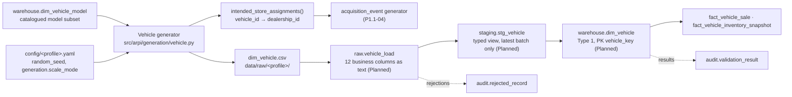

# STM-005 — Vehicle Dimension

## Header

| Field | Value |
|---|---|
| **Mapping ID** | `STM-005` |
| **Title** | Vehicle dimension (Slowly Changing Dimension Type 1) |
| **Status** | **Implemented** — source generation and the pandas data-quality suite. The SQL DDL, the raw/staging objects and the warehouse merge are **Planned** and owned by the SQL delivery increment. |
| **Version** | 1.0 |
| **Date** | 2026-07-28 |
| **Owner** | Michael Palmer |
| **Source system** | `arpi_synthetic_generator` |
| **Target object** | `warehouse.dim_vehicle` |
| **Declared grain** | **One row per unique physical vehicle.** |
| **Phase** | Phase 1 (`P1.1-02`) |
| **Generator** | `src/arpi/generation/vehicle.py` |
| **Upstream object** | `warehouse.dim_vehicle_model` ([STM-004](STM-004-dim-vehicle-model.md)) |
| **Intermediate objects** | `raw.vehicle_load`, `staging.stg_vehicle` (**Planned**) |
| **Downstream objects** | `acquisition_event`, `warehouse.fact_vehicle_inventory_snapshot`, `warehouse.fact_vehicle_sale` |

---

## 1. Purpose

`warehouse.dim_vehicle` is the population of physical units. Every inventory snapshot and every sale
references one, which is what makes "a sale with no inventory or vehicle record" — a prohibited synthetic
pattern (ARCHITECTURE.md §15.4) — **structurally impossible** rather than merely unlikely.

It is also where two governance decisions live: the synthetic VIN policy (section 4.1) and the deliberate
absence of a store column (section 4.5).

---

## 2. Lineage



**Ordered lineage statement**

1. The generator obtains the catalogued model subset for the active profile
   (`catalogued_models_for(config)`), which is the same deterministic subset `dim_vehicle_model` publishes.
2. It pre-computes the eligible model pool for every `(store, condition)` combination (section 4.3). **An
   empty pool is a hard failure** naming the store and the condition, so a shrunken catalogue can never
   silently produce, say, a franchise store with no new inventory.
3. It resolves the profile's row target from `generation.scale_mode` — 60 (`test`), 900 (`development`),
   9,000 (`portfolio`) — and seeds `rng_for(random_seed, "dim_vehicle")`. The namespace is this entity's
   alone.
4. For each vehicle, in order, it draws: the **intended store**, then the **condition** from that store's
   condition mix, then the **model** from that store-and-condition pool, then the **synthetic VIN**, the
   **colours**, the **odometer reading** from the model year and condition, and the **acquisition source**
   from the condition. `odometer_band` is then *derived*, never drawn.
5. `vehicle_id` is `VEH-#######` over the generation order and `vehicle_key` is the same ordinal, so the key
   order is the `vehicle_id` order by construction.
6. The realised condition and intended-store shares are logged at INFO on every run.
7. Rows are written to `data/raw/<profile>/dim_vehicle.csv` — UTF-8, LF endings, header row, lowercase
   booleans, declared column order. **The intended store is not a column** and is published separately
   through `intended_store_assignments()`.
8. **Planned:** the CSV loads into `raw.vehicle_load`, `staging.stg_vehicle` casts and filters to the latest
   batch, and `warehouse.dim_vehicle` is loaded by a **Type 1 MERGE on `vehicle_id`**.

---

## 3. Mapping table

All 12 columns of `warehouse.dim_vehicle`, in declared order. **Every column is `NOT NULL`.**

| Source field | Source type | Target field | Target type | Transformation | Default behaviour | Validation | Rejection behaviour | Lineage field | Owner |
|---|---|---|---|---|---|---|---|---|---|
| *(derived)* | — | `vehicle_key` | `integer` PK | Deterministic ordinal `1..N` over `vehicle_id` ascending. No database sequence. | `n/a — required` | PK not null and unique; equals the rank of `vehicle_id` | `REJ-TYPE-001` if not castable; `REJ-KEY-001` on duplicate | `load_batch_id`, `source_row_number` | Vehicle generator |
| *(derived)* | `text` | `vehicle_id` | `varchar(16)` | `VEH-` plus the seven-digit zero-padded generation ordinal. Natural / source key. | `n/a — required` | `DQ-VEH-001` unique; matches `^VEH-\d{7}$` | `REJ-NULL-001` if empty; `REJ-KEY-001` on duplicate; `REJ-DOMAIN-001` on a malformed id | `load_batch_id` | Vehicle generator |
| *(derived)* | `text` | `synthetic_vin` | `char(17)` | 17 characters: the literal prefix `ARPI` plus 13 characters drawn from `ABCDEFGHJKLMNPRSTUVWXYZ0123456789`. **Deliberately not a valid VIN** — see section 4.1. Collisions are redrawn deterministically. | `n/a — required` | `DQ-VEH-002` unique; `DQ-VEH-007` length, prefix and alphabet | `REJ-KEY-001` on duplicate; `REJ-DOMAIN-001` on a malformed VIN | `load_batch_id` | Vehicle generator |
| `dim_vehicle_model.vehicle_model_key` | `integer` | `vehicle_model_key` | `integer` | Direct from the drawn catalogued model. **Foreign key** to `warehouse.dim_vehicle_model`. | `n/a — required` | `DQ-VEH-004` resolves to an existing model row; FK enforced in the database | `REJ-RULE-001` if it resolves to nothing | `load_batch_id`, `vehicle_model_id` | Vehicle generator |
| `dim_vehicle_model.vehicle_model_id` | `text` | `vehicle_model_id` | `varchar(16)` | Direct from the drawn catalogued model. **Lineage column**: it carries the natural key alongside the surrogate so a reviewer can trace a vehicle to its model without a join. | `n/a — required` | `DQ-VEH-004` the `(key, id)` pair matches one `dim_vehicle_model` row | `REJ-RULE-001` if the pair disagrees | itself | Vehicle generator |
| *(drawn)* | `text` | `condition_type` | `varchar(12)` | Drawn from the intended store's condition mix. `GSA-003` (independent used) draws `Used` with probability 1. | `n/a — required` | `DQ-VEH-005`; domain `New\|Used\|Certified` | `REJ-DOMAIN-001` outside the enumeration; `REJ-RULE-001` on a consistency breach | `load_batch_id` | Vehicle generator |
| *(drawn)* | `text` | `exterior_color` | `varchar(30)` | Drawn from a weighted, non-uniform palette. A paint description, not personal data. | `n/a — required` | Not null; no single value above the documented 0.30 share | `REJ-NULL-001` | `load_batch_id` | Vehicle generator |
| *(drawn)* | `text` | `interior_color` | `varchar(30)` | Drawn from a weighted, non-uniform palette. | `n/a — required` | Not null; no single value above the documented 0.45 share | `REJ-NULL-001` | `load_batch_id` | Vehicle generator |
| *(derived)* | `integer` | `odometer_reading` | `integer` | Derived from `condition_type` and the model's age (section 4.4). New: 2..50. Certified: clamped to 500..80,000. Used: age × a per-year rate plus noise, floored at 200 and capped at 260,000. | `n/a — required` | `DQ-VEH-005`; `CHECK odometer_reading >= 0` | `REJ-TYPE-001` if not an integer; `REJ-DOMAIN-001` if negative | `load_batch_id` | Vehicle generator |
| *(derived)* | `text` | `odometer_band` | `varchar(20)` | **Derived from `odometer_reading`, never drawn** (section 4.4). New units always band `New`. | `n/a — required` | `DQ-VEH-005` the band agrees with the reading on **every** row; domain `New\|Under 10k\|10k-30k\|30k-60k\|60k-100k\|Over 100k` | `REJ-DOMAIN-001`; `REJ-RULE-001` on disagreement | `load_batch_id`, `odometer_reading` | Vehicle generator |
| *(drawn)* | `text` | `acquisition_source` | `varchar(40)` | `New` ⇒ the constant `Manufacturer Allocation`. `Certified` ⇒ a used-derived source. `Used` ⇒ a weighted draw over all five used-derived sources. | `n/a — required` | `DQ-VEH-005`; domain `Customer Trade\|Auction\|Off-street Purchase\|Lease Return\|Dealer Trade\|Manufacturer Allocation`; **never `Manufacturer Allocation` at `GSA-003`** | `REJ-DOMAIN-001`; `REJ-RULE-001` on a condition or store breach | `load_batch_id` | Vehicle generator |
| *(constant)* | `text` | `source_system` | `varchar(40)` | **Constant** `arpi_synthetic_generator`, on every row. | `n/a — constant` | Must equal `arpi_synthetic_generator` | `REJ-RULE-001` on any other value | itself | Vehicle generator |
| *(database)* | — | `raw_record_id` | `bigserial` | Database-assigned. **Raw layer only.** | `n/a — database-assigned` | PK uniqueness | n/a | itself | Database |
| *(load process)* | — | `load_batch_id` | `uuid` | Assigned once per load. **Raw and staging layers only.** | `n/a — required` | Not null | `REJ-PARSE-001` if the batch cannot be initialised | itself | Loader |
| *(load process)* | — | `source_file_name` | `text` | Name of the source file. **Raw and staging layers only.** | `n/a — required` | Not null | n/a | itself | Loader |
| *(load process)* | — | `source_row_number` | `integer` | 1-based row number, excluding the header. **Raw and staging layers only.** | `n/a — required` | Not null; ≥ 1 | n/a | itself | Loader |
| *(database)* | — | `ingested_at` | `timestamptz` | Database `DEFAULT now()`. **Raw and staging layers only.** | `now()` | Not null | n/a | itself | Database |

**Uniqueness and referential constraints**

- `vehicle_key` — primary key.
- `vehicle_id` — UNIQUE.
- `synthetic_vin` — UNIQUE.
- `vehicle_model_key` — FOREIGN KEY to `warehouse.dim_vehicle_model(vehicle_model_key)`.

---

## 4. Derivation reference

### 4.1 Synthetic VIN policy

```
synthetic_vin = "ARPI" + 13 characters drawn from "ABCDEFGHJKLMNPRSTUVWXYZ0123456789"
```

| Property | Value | Why |
|---|---|---|
| Length | Exactly 17 | Matches the shape of a real VIN, so downstream column widths and joins behave realistically |
| Prefix | `ARPI` | **Makes the value structurally invalid as a real VIN.** No real World Manufacturer Identifier is `ARP`, and the ninth character is not a valid ISO 3779 check digit |
| Alphabet | 33 characters, **excluding `I`, `O` and `Q`** | The same exclusion real VINs use, to avoid confusion with `1` and `0` |
| Collision handling | Redraw from the same seeded generator, up to 64 attempts, then fail | Deterministic and bounded. The keyspace is 33¹³ ≈ 5.1 × 10¹⁹, so exhaustion would indicate a defect, not scarcity — and the error says so |

**No real VIN data is held, read, or derived from.** The generator makes no network call, holds no VIN
reference table, decodes nothing, and creates no owner relationship. See
[PRIVACY_AND_ETHICS.md](../../PRIVACY_AND_ETHICS.md).

### 4.2 Store mix

| Store | Type | Share of population | Condition mix |
|---|---|---:|---|
| `GSA-001` Granite Chevrolet | Franchise New and Used | 0.40 | New 0.45 · Used 0.38 · Certified 0.17 |
| `GSA-002` Granite Subaru | Franchise New and Used | 0.35 | New 0.42 · Used 0.36 · Certified 0.22 |
| `GSA-003` Granite Used Auto | Independent Used | 0.25 | **Used 1.00** |

`GSA-003` is an independent used operation: it holds no franchise, so it takes no factory allocation and can
certify nothing. **`condition_type = 'New'` and `acquisition_source = 'Manufacturer Allocation'` can never
occur there** — not because a filter removes them afterwards, but because the condition mix never offers
them. Certified units are likewise franchise-store only.

### 4.3 Model eligibility by store and condition

| Condition | Eligible models |
|---|---|
| `New` | The store's own franchise alignment, `is_current_model_line`, and `model_year >= 2024` |
| `Certified` | The store's own franchise alignment, age 1–8 model years (`model_year` 2018–2025) |
| `Used` | Any catalogued model, weighted by the store's used-inventory alignment mix — a Chevrolet store's used lot is Chevrolet-heavy but carries other makes |

Within a pool, models are drawn with a stable non-uniform popularity weight, so no model is equally likely
and no model dominates. **If a pool is empty, generation fails** with the store and condition named.

### 4.4 Odometer derivation and banding

Reading, where `age = 2026 − model_year`:

| Condition | Reading |
|---|---|
| `New` | 2 – 50 miles (delivery and lot miles only) |
| `Certified` | `age × U(7,000, 13,000) + U(−2,000, 2,000)`, clamped to 500 – 80,000 |
| `Used`, `age = 0` | 1,500 – 14,000 |
| `Used`, `age ≥ 1` | `age × U(6,000, 18,000) + U(−3,000, 4,000)`, floored at 200, capped at 260,000 |

Band, derived by `odometer_band_for(reading, condition)` — **each boundary belongs to the band above it**:

| Condition / reading | Band |
|---|---|
| `condition_type = 'New'` | `New` |
| 0 ≤ reading < 10,000 | `Under 10k` |
| 10,000 ≤ reading < 30,000 | `10k-30k` |
| 30,000 ≤ reading < 60,000 | `30k-60k` |
| 60,000 ≤ reading < 100,000 | `60k-100k` |
| reading ≥ 100,000 | `Over 100k` |

9,999 miles is `Under 10k`; 10,000 miles is `10k-30k`. The function raises rather than returning a wrong
answer on a negative reading, an unknown condition, or a `New` unit showing more than 50 miles.

### 4.5 Why there is no store column

Which store holds a unit is a property of the **acquisition event**, not of the vehicle. A unit can be
dealer-traded between stores; a store column on the dimension would silently rewrite history for every fact
already attached to it. `dim_vehicle` therefore carries **no `dealership_id` and no `dealership_key`**.

The generator still needs a store to decide condition and model — a used-only store cannot be allocated a
new unit — so it makes that decision deterministically and publishes it:

```python
from arpi.generation.vehicle import intended_store_assignments

assignments: dict[str, str] = intended_store_assignments(config)  # vehicle_id → dealership_id
```

`build_vehicle_records(config)` returns the same information as full `VehicleRecord` objects. Both are pure
functions of the configuration, so the acquisition generator reproduces exactly the assignment the vehicle
generator used.

### 4.6 Scale

| Profile | Target rows |
|---|---:|
| `test` | 60 |
| `development` | 900 |
| `portfolio` | 9,000 |

**`portfolio` is never generated in CI or in routine tests.**

### 4.7 Declared distributions

Non-degeneracy thresholds, asserted in `tests/data_quality/test_vehicle_data_quality.py`:

| Property | Threshold |
|---|---|
| Any single exterior colour | ≤ 0.30 share, ≥ 8 distinct |
| Any single interior colour | ≤ 0.45 share, ≥ 5 distinct |
| Any single condition | ≤ 0.70 share, all three present |
| Any single acquisition source | ≤ 0.50 share, all six present |
| Any single model | ≤ 0.15 share |
| Store share | within 0.07 of the declared share |

---

## 5. Load strategy

| Layer | Strategy | Write semantics | Status |
|---|---|---|---|
| CSV | Overwrite | The generator rewrites `data/raw/<profile>/dim_vehicle.csv` on each run, byte-identical between runs of the same profile. | **Implemented** |
| `raw.vehicle_load` | **Truncate-and-reload per batch** | Truncated, reloaded from the current CSV, stamped with a fresh `load_batch_id`. | **Planned** |
| `staging.stg_vehicle` | **View** (`CREATE OR REPLACE VIEW`) | No data written. Casts raw text to warehouse types, filters to the most recent `load_batch_id`. | **Planned** |
| `warehouse.dim_vehicle` | **Type 1 MERGE on `vehicle_id`** | Matched → update the descriptive attributes. Unmatched → insert. **Nothing is deleted**: facts reference these keys. | **Planned** |

**Why Type 1.** A unit's model, VIN and colours never change. Its odometer does — but the reading that
matters analytically is the reading *at a point in time*, which belongs on the inventory snapshot and the
sale, not on the dimension. Versioning the dimension for odometer drift would produce one row per unit per
mile band for no analytical gain. `dim_vehicle` holds the acquisition-time state and Type 1 corrects it in
place.

**Load order.** `dim_vehicle_model` must be merged **before** `dim_vehicle`, or the foreign key fails.

---

## 6. Idempotency guarantees

| Guarantee | Mechanism |
|---|---|
| Rerunning with the same seed and profile produces a **byte-identical CSV** | One seeded generator, drawn in a fixed order, with a deterministic collision redraw. Asserted by `tests/data_quality/test_vehicle_data_quality.py`. |
| `vehicle_key` and `vehicle_id` are stable across regenerations | Ordinal over the generation order, which is itself deterministic. |
| The same store assignment is reproduced for the acquisition generator | `intended_store_assignments()` is a pure function of the configuration. |
| Rerunning the merge with unchanged source produces **zero net change** | Type 1 MERGE on `vehicle_id`. |
| Adding another entity cannot perturb this one | Per-entity seeding namespace `dim_vehicle` via `rng_for`. Asserted against `dim_date`, `dim_dealership` and `dim_vehicle_model`. |
| Verifiable by a third party | `content_digest` in `generation_manifest.json` is the SHA-256 of the CSV bytes. |

> **One documented dependency.** The vehicle population depends on the *contents* of the model subset, so
> changing the model catalogue or the model row target changes `dim_vehicle` too. That is a data dependency,
> not a seed dependency: the two entities' random streams remain independent, and changing the vehicle
> stream leaves `dim_vehicle_model`, `dim_date` and `dim_dealership` byte-identical.

---

## 7. Rejection handling

| Condition | `REJ-*` code | Outcome |
|---|---|---|
| A `(store, condition)` model pool is empty | *(pre-load)* | **`GenerationError` naming the store and condition. The run fails before anything is written.** |
| A unique VIN cannot be drawn within 64 attempts | *(pre-load)* | **`GenerationError`.** Treated as a defect, not as keyspace exhaustion. |
| An identifier ordinal overflows its reserved width | *(pre-load)* | **`GenerationError`** pointing at the identifier scheme. |
| A CSV row cannot be parsed | `REJ-PARSE-001` | Row rejected; run fails |
| The CSV header does not match the 12 declared columns, in order | `REJ-SCHEMA-001` | Load aborts before any row is processed. Also caught pre-load by `DQ-VEH-003` and `DQ-GEN-001`. |
| A prohibited PII column is present in the schema | `REJ-SCHEMA-001` | Load aborts. Detected by `DQ-VEH-006`, which inspects the schema rather than the values. |
| A value cannot be cast to its warehouse type | `REJ-TYPE-001` | Row rejected; run fails |
| A required field is NULL or empty | `REJ-NULL-001` | Row rejected; run fails |
| An enumerated value is outside its domain, a malformed VIN, or a malformed `vehicle_id` | `REJ-DOMAIN-001` | Row rejected; run fails |
| Duplicate `vehicle_key`, `vehicle_id`, or `synthetic_vin` | `REJ-KEY-001` | Later row rejected; run fails |
| `vehicle_model_key` resolves to no model, or disagrees with `vehicle_model_id` | `REJ-RULE-001` | Row rejected; run fails. Detected by `DQ-VEH-004`. |
| A `New` unit without a manufacturer allocation, over 50 miles, or not banded `New`; a non-new unit with a manufacturer allocation; a band that disagrees with its reading | `REJ-RULE-001` | Row rejected; run fails. Detected by `DQ-VEH-005`. |

Every rejection writes a row to `audit.rejected_record` with `source_entity = 'dim_vehicle'`,
`source_record_key` = the offending `vehicle_id` where identifiable, the code, a human-readable reason, and
the full `record_payload`. **The payload contains no personal data of any kind** — there is no owner
relationship on this entity — so storing it carries no privacy risk.

> **Phase 1 rejection tolerance is zero.** `validation.max_rejected_record_ratio = 0.0`.

---

## 8. Validation checks gating the load

All seven are registered in `src/arpi/validation/registry.py` and evaluated by `validate_vehicle_dataset()`
in `src/arpi/generation/vehicle.py`.

| Check ID | Category | Assertion | Severity | Gate |
|---|---|---|---|---|
| `DQ-GEN-001` | `structural` | The generated frame's schema matches the declared column contract | critical | Pre-load |
| `DQ-GEN-002` | `reproducibility` | The determinism digest is computed and recorded for `dim_vehicle` | critical | Pre-load |
| `DQ-VEH-003` | `structural` | Column names, order and count match the contract | critical | Pre-load **and** post-load |
| `DQ-VEH-006` | `privacy` | No prohibited PII column is present — inspects the **schema**, so an empty prohibited column still fails | critical | Pre-load **and** post-load |
| `DQ-VEH-001` | `uniqueness` | `vehicle_id` is unique | critical | Pre-load **and** post-load |
| `DQ-VEH-002` | `uniqueness` | `synthetic_vin` is unique | critical | Pre-load **and** post-load |
| `DQ-VEH-007` | `business_rule` | Every `synthetic_vin` is 17 characters, `ARPI`-prefixed, and drawn from the VIN alphabet | critical | Pre-load **and** post-load |
| `DQ-VEH-004` | `referential` | Every `(vehicle_model_key, vehicle_model_id)` pair resolves to one `dim_vehicle_model` row | critical | Pre-load **and** post-load |
| `DQ-VEH-005` | `business_rule` | Condition, acquisition source and odometer are mutually consistent, and every band agrees with its reading | critical | Pre-load **and** post-load |

**All are `critical`.** Any failure sets `audit.pipeline_run.status = 'failed'` and increments
`critical_failure_count`.

---

## 9. Reconciliations

| Reconciliation ID | Description | Left | Right | Tolerance | Status |
|---|---|---|---|---|---|
| `RECON-DIM-VEHICLE-ROWCOUNT` | Generated vehicle rows equal `warehouse.dim_vehicle` rows after the merge | the generated frame's row count | a live `count(*)` | 0 (exact) | **Planned** — it needs the SQL load, which does not exist yet |

---

## 10. Open questions and known gaps

- **The SQL load exists and is exercised.** The DDL, the raw and staging objects, and the Type 1 merge are
  implemented in `sql/`, run by the loader, and covered by the PostgreSQL integration suite. This entry
  previously recorded them as Planned, which was true when written; the statements in sections 5 and 9 about
  `dim_vehicle` database behaviour are now observations rather than specification.
- **`odometer_reading` is an acquisition-time reading with no timestamp.** It is the reading when the unit
  entered inventory. Once `acquisition_event` exists, that event supplies the date; until then, the column
  is a point-in-time value whose point in time is implicit. A sale-time reading is a separate measure and
  does not belong on this dimension.
- **The intended store lives outside the dimension by design.** Nothing in the schema prevents the
  acquisition generator from ignoring `intended_store_assignments()` and placing a new unit at `GSA-003`.
  The guarantee is upheld by the acquisition generator honouring the helper, and by a cross-entity check
  once `acquisition_event` exists.
- **Certification is modelled as a condition, not as a programme.** There is no certification date,
  inspection record, or warranty term. `Certified` means "sold as a manufacturer-certified used unit at the
  matching franchise store" and nothing more.
- **No trim-level or model-level price.** Money belongs to the acquisition and sale events.
- **Colour palettes are shared across every make.** A real Subaru and a real Chevrolet do not offer the same
  paint names. The palettes are plausible generic descriptions; treating them as manufacturer colour codes
  would be wrong.
