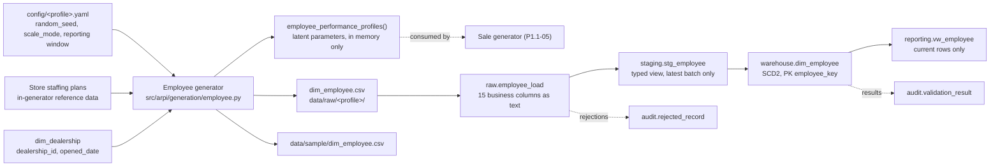

# STM-006 — Employee Dimension

## Header

| Field | Value |
|---|---|
| **Mapping ID** | `STM-006` |
| **Title** | Employee dimension (Slowly Changing Dimension Type 2) |
| **Status** | **Implemented** (generator, column contract, data-quality suite). Ingestion, warehouse DDL and merge are **Planned** in Phase 1.2. |
| **Version** | 1.0 |
| **Date** | 2026-07-28 |
| **Owner** | Michael Palmer |
| **Source system** | `arpi_synthetic_generator` |
| **Target object** | `warehouse.dim_employee` |
| **Declared grain** | One row per employee **role-assignment version** (SCD Type 2). A person who changes role or store produces several rows. |
| **Phase** | Phase 1.1 (delivery increment `P1.1-03`) |
| **Intermediate objects** | `raw.employee_load`, `staging.stg_employee` (Planned, `P1.2-01`) |
| **Downstream object** | `reporting.vw_employee` (Planned) |

---

## 1. Purpose

`warehouse.dim_employee` describes the synthetic sales, BDC, desk-management, finance and service staff
whose activity is attributed in the sales and funnel facts. It carries the **contextual** attributes —
store, department, role, banded tenure — that [ARCHITECTURE.md §23](../../ARCHITECTURE.md) requires before
any employee performance figure may be displayed. Fairness context is a data requirement here, not a
reporting afterthought: if the dimension does not carry tenure, no downstream visual can contextualise a
ranking by it.

It is also the first dimension in ARPI where **SCD Type 2 is genuinely exercised**. `dim_dealership`
established the mechanism but has only ever held one version per store, so the expire-and-insert branch
was proven by unit tests alone. The employee generator produces at least three people with two contiguous
versions each, at every profile, which makes the merge path testable against real data.

### 1.1 What this dimension deliberately does not contain

**No name. No email address. No phone number. No street address. No compensation, pay plan, commission or
bonus. No protected characteristic. No free-form note.**

[ARCHITECTURE.md §22.4](../../ARCHITECTURE.md) permits fictional names "if names are used at all"; ARPI's
answer is that they are not. A synthetic `employee_id` plus role and banded tenure answers every declared
KPI, and fabricated names invite confusion with real staff. Compensation is on the prohibited-data list in
`docs/research.md` §10.2 and adds nothing to any planned measure.

`DQ-EMP-005` enforces this against the **schema**, not the values, so a prohibited column fails the run
even when it is entirely empty. See [PRIVACY_AND_ETHICS.md](../../PRIVACY_AND_ETHICS.md).

### 1.2 Latent performance parameters are inputs, not columns

[ARCHITECTURE.md §15.3](../../ARCHITECTURE.md) requires employees to differ in volume, closing rate and
gross retention. Those per-person parameters exist — they are what stops the sale fact from being
implausibly uniform — and they are exposed to the sale generator by
`arpi.generation.employee.employee_performance_profiles()`.

**They are not columns of this dimension, they are never written to `data/sample/`, and they must never
reach a reporting view.** Two reasons, both binding:

1. **Circularity.** A scorecard built from the generator's own latent "true skill" parameter reports back
   the number used to fabricate the outcome. It would look like a validated measurement of a person and
   would in fact be a tautology.
2. **The fairness rule.** [PRIVACY_AND_ETHICS.md §5](../../PRIVACY_AND_ETHICS.md) requires every employee
   metric to be shown with contextual metrics — lead volume received, lead-source mix, tenure, inventory
   availability — precisely because raw output measures routing and opportunity as much as skill.
   Publishing a "skill index" would quietly defeat that rule by supplying the uncontextualised ranking the
   rule exists to prevent.

`DQ-EMP-005` also fails on a column whose name contains `volume_index`, `closing_rate`,
`gross_retention`, `crm_discipline`, `skill_index`, `performance_index` or `latent`, so a leak is a
failing run rather than a code-review question.

---

## 2. Lineage



**Ordered lineage statement**

1. The generator resolves the headcount for the active `generation.scale_mode` — 12 (test), 30
   (development), 45 (portfolio) — and splits it across the three stores by the declared shares
   `GSA-001` 0.40, `GSA-002` 0.36, `GSA-003` 0.24, using the largest-remainder method with a
   `dealership_id` tie-break so the split is deterministic and always sums to the headcount.
2. Each store's slots are filled from its **staffing plan** in hiring-priority order (section 4.1).
   `GSA-003`, the independent used operation, has the smallest and most sales-weighted plan: no franchise
   service drive and a leaner management desk.
3. `employee_id` is assigned as `EMP-#####` in store order then slot order, so the same person always
   receives the same identifier.
4. A hire date is drawn per person from a **role-dependent** triangular tenure distribution, then clamped
   to the assigned store's `opened_date`. Managers are longer-tenured than the sales floor.
5. A deterministic subset leaves during the window — `max(1, round(headcount × 0.10))` people, chosen by a
   role-weighted churn score — and receives a `termination_date` inside the reporting window.
6. A deterministic subset changes role or store — `max(3, round(headcount × 0.12))` people, chosen from
   those with at least two years of tenure who are still employed and who have a valid predecessor
   assignment. **The floor of three is a contract requirement**, so the SCD2 expire-and-insert path is
   exercised by real generated data.
7. Each person is rendered as one or two contiguous versions (section 4.3), `attribute_hash` is computed
   over the seven tracked attributes (section 4.2), and rows are sorted by `employee_id` then
   `effective_date`.
8. `employee_key` is assigned as a **deterministic ordinal 1..N over that sorted order**.
9. Rows are written to `data/raw/<profile>/dim_employee.csv` — UTF-8, LF endings, header row, ISO-8601
   dates, lowercase booleans, declared column order.
10. **Planned (`P1.2-01`)**: the CSV loads into `raw.employee_load`, all business columns as `text`, plus
    `raw_record_id`, `load_batch_id`, `source_file_name`, `source_row_number`, `ingested_at`.
11. **Planned**: `staging.stg_employee` casts to warehouse types and exposes only the most recent
    `load_batch_id`.
12. **Planned**: `warehouse.dim_employee` is loaded by **SCD2 MERGE on `employee_id`**, using
    `attribute_hash` for change detection.

**Latent parameters branch off at step 3 and never rejoin.** `employee_performance_profiles()` draws from
its own seeding namespace (`dim_employee_performance`), so tuning the parameters cannot move a single
value inside `dim_employee`, and reading them cannot perturb the dimension's content digest.

---

## 3. Mapping table

All 15 columns of `warehouse.dim_employee`, in declared order. Every column is `NOT NULL` except
`termination_date`.

| Source field | Source type | Target field | Target type | Transformation | Default behaviour | Validation | Rejection behaviour | Lineage field | Owner |
|---|---|---|---|---|---|---|---|---|---|
| `employee_key` | `text` | `employee_key` | `integer` PK | Cast to `integer`. Generator assigns it as a **deterministic ordinal 1..N over `(employee_id, effective_date)` ascending**, so regeneration is stable. | `n/a — required` | PK not null and unique | `REJ-TYPE-001` if not castable; `REJ-KEY-001` on duplicate | `load_batch_id`, `source_row_number` | Employee generator |
| `employee_id` | `text` | `employee_id` | `varchar(16)` | Direct. Natural / source key, format `EMP-#####`. **Stable across every version of the same person** — it is the SCD2 matching key. | `n/a — required` | `DQ-EMP-001` `(employee_id, effective_date)` unique; `DQ-EMP-002` exactly one row per `employee_id` where `is_current`; `DQ-EMP-007` distinct count within the configured band | `REJ-NULL-001` if empty; `REJ-DOMAIN-001` if it does not match `EMP-#####`; `REJ-KEY-001` on a duplicate current row | `load_batch_id`, `source_row_number` | Employee generator |
| `dealership_id` | `text` | `dealership_id` | `varchar(16)` | Direct. Resolved to `dealership_key` against `dim_dealership` during the dimension load. **SCD2 tracked attribute (hash position 1)** — a store transfer opens a new version. | `n/a — required` | Must resolve to a current `dim_dealership` row; `DQ-EMP-006` `hire_date >= dim_dealership.opened_date` | `REJ-REF-001` if it does not resolve; `REJ-RULE-001` if the hire predates the store | `load_batch_id`, `attribute_hash` | Employee generator |
| `department` | `text` | `department` | `varchar(30)` | **Derived from `job_role`**, never drawn independently (section 4.4). Domain `Sales` \| `Finance` \| `BDC` \| `Management` \| `Service`. **SCD2 tracked attribute (hash position 2).** | `n/a — required` | `DQ-EMP-009` inside the declared enumeration; must equal the mapping of its own `job_role` | `REJ-DOMAIN-001` outside the enumeration; `REJ-RULE-001` if it contradicts `job_role` | `load_batch_id`, `attribute_hash` | Employee generator |
| `job_role` | `text` | `job_role` | `varchar(40)` | Direct from the store staffing plan. Domain `Salesperson` \| `Sales Manager` \| `Desk Manager` \| `Finance Manager` \| `BDC Representative` \| `BDC Manager` \| `General Manager` \| `Service Advisor`. **SCD2 tracked attribute (hash position 3)** — a promotion opens a new version. | `n/a — required` | `DQ-EMP-009` inside the declared enumeration | `REJ-DOMAIN-001` outside the enumeration | `load_batch_id`, `attribute_hash` | Employee generator |
| `hire_date` | `text` | `hire_date` | `date` | Cast ISO-8601 `YYYY-MM-DD` to `date`. Drawn from a role-dependent tenure distribution, clamped to the store's `opened_date`. **Identical across every version of one person.** **SCD2 tracked attribute (hash position 4).** | `n/a — required` | `DQ-EMP-006` on or after the store's `opened_date`; on or before `effective_date` | `REJ-TYPE-001` if unparseable; `REJ-RULE-001` if before the store opened | `load_batch_id`, `attribute_hash` | Employee generator |
| `termination_date` | `text` | `termination_date` | `date` NULL | Cast to `date`. Empty string in the CSV maps to SQL `NULL`. **SCD2 tracked attribute (hash position 5)** — rendered as the **empty string** inside the hash input when NULL. | **`NULL` means still employed.** It never means "unknown". | `DQ-EMP-006` on or after `hire_date` when present; agrees with `is_active` | `REJ-RULE-001` if before `hire_date`, or if it disagrees with `is_active` | `load_batch_id`, `attribute_hash` | Employee generator |
| `is_active` | `text` | `is_active` | `boolean` | Cast lowercase `true`/`false` to `boolean`. **Derived**: `is_active = (termination_date IS NULL)`. **SCD2 tracked attribute (hash position 6).** | `n/a — required` | `DQ-EMP-006` must equal `termination_date IS NULL` | `REJ-TYPE-001` if not `true`/`false`; `REJ-RULE-001` on disagreement | `load_batch_id`, `attribute_hash` | Employee generator |
| `is_manager` | `text` | `is_manager` | `boolean` | Cast to `boolean`. **Derived from `job_role`**, never drawn independently: true for `Sales Manager`, `Desk Manager`, `Finance Manager`, `BDC Manager`, `General Manager`. **SCD2 tracked attribute (hash position 7).** | `n/a — required` | Must equal the derivation from its own `job_role` | `REJ-RULE-001` if it contradicts `job_role` | `load_batch_id`, `attribute_hash` | Employee generator |
| `tenure_band` | `text` | `tenure_band` | `varchar(20)` | **Derived from `hire_date` relative to `reporting.end_date`**, never drawn (section 4.5). Domain `Under 1 Year` \| `1-3 Years` \| `3-5 Years` \| `5-10 Years` \| `Over 10 Years`. Banded rather than exact so scorecards can be contextualised without implying a precise personnel record. **Not part of the hash** — it is a function of `hire_date`, which is already tracked. | `n/a — required` | `DQ-EMP-009` inside the declared enumeration; must equal the recomputed band | `REJ-DOMAIN-001` outside the enumeration; `REJ-RULE-001` if it does not recompute | `load_batch_id` | Employee generator |
| `effective_date` | `text` | `effective_date` | `date` | Cast to `date`. Equals `hire_date` for a person's first version, and the change date for a later one. **Not part of the hash.** | `n/a — required` | `DQ-EMP-001` `(employee_id, effective_date)` unique; `DQ-EMP-006` on or after `hire_date`, on or before `expiration_date` | `REJ-KEY-001` on duplicate; `REJ-RULE-001` on inversion | `load_batch_id` | Dimension load |
| `expiration_date` | `text` | `expiration_date` | `date` | Cast to `date`. **`9999-12-31` for the current version.** The high-date sentinel is used rather than NULL so `BETWEEN` range joins work without NULL handling. **Not part of the hash.** | `n/a — required` | `DQ-EMP-002` equals the sentinel if and only if `is_current`; `DQ-EMP-003` the previous version's `expiration_date` is exactly one day before the next version's `effective_date` | `REJ-RULE-001` on a gap, an overlap, or a sentinel/flag mismatch | `load_batch_id` | Dimension load |
| `is_current` | `text` | `is_current` | `boolean` | Cast to `boolean`. Redundant with `expiration_date` **by design** — it makes "current staff" a single index-friendly predicate. A partial unique index on `employee_id WHERE is_current` enforces at most one current row per person. **Not part of the hash.** | `n/a — required` | `DQ-EMP-002` exactly one current row per `employee_id` | `REJ-KEY-001` if a second current row appears for one person | `load_batch_id` | Dimension load |
| `attribute_hash` | `text` | `attribute_hash` | `char(64)` | **SHA-256 hex digest** of the seven tracked attributes (columns 3–9), joined with the pipe character `\|`, encoded UTF-8. See section 4.2. | `n/a — required` | `DQ-EMP-008` exactly 64 lowercase hexadecimal characters, and equal to a recomputation from the row's own tracked attributes | `REJ-DOMAIN-001` if not 64 hex characters; `REJ-RULE-001` if it does not recompute | itself (it *is* the change-detection lineage) | Employee generator |
| `source_system` | `text` | `source_system` | `varchar(40)` | **Constant** `arpi_synthetic_generator`. Present on every row so no reviewer can mistake this data for a real DMS or payroll extract. **Not part of the hash** (a constant contributes nothing). | `n/a — constant` | Must equal `arpi_synthetic_generator` | `REJ-RULE-001` if any other value appears | itself | Employee generator |
| *(database)* | — | `dealership_key` | `integer` FK | Resolved from `dealership_id` against the current `dim_dealership` row at load time. **Warehouse layer only.** | `n/a — required` | FK enforced by the database | `REJ-REF-001` if unresolvable | `load_batch_id` | Dimension load |
| *(database)* | — | `raw_record_id` | `bigserial` | Database-assigned. **Raw layer only.** | `n/a — database-assigned` | PK uniqueness | n/a | itself | Database |
| *(load process)* | — | `load_batch_id` | `uuid` | Assigned once per load. **Raw and staging layers only.** | `n/a — required` | Not null; unique per batch | `REJ-PARSE-001` if the batch cannot be initialised | itself | Loader |
| *(load process)* | — | `source_file_name` | `text` | Name of the source file. **Raw and staging layers only.** | `n/a — required` | Not null | n/a | itself | Loader |
| *(load process)* | — | `source_row_number` | `integer` | 1-based row number, excluding the header. **Raw and staging layers only.** | `n/a — required` | Not null; ≥ 1 | n/a | itself | Loader |
| *(database)* | — | `ingested_at` | `timestamptz` | Database `DEFAULT now()`. **Raw and staging layers only.** | `now()` | Not null | n/a | itself | Database |

> **Prohibited target fields.** `employee_name`, `first_name`, `last_name`, `email`, `phone`,
> `home_address`, `salary`, `compensation`, `commission_rate`, `pay_plan`, `bonus`, `date_of_birth`,
> `race`, `ethnicity`, `gender`, `religion`, `marital_status`, `veteran_status`, `notes`, `comments`, and
> any latent performance parameter. None of these exists at any layer. `DQ-EMP-005` inspects the schema
> and fails the run if one appears.

---

## 4. Derivation reference

### 4.1 Store staffing plans (authoritative)

Each store's slots are filled from its plan in order until the allocated headcount is reached. Where the
headcount exceeds the explicit plan, the store's tail pattern repeats.

| Position | `GSA-001` Granite Chevrolet | `GSA-002` Granite Subaru | `GSA-003` Granite Pre-Owned |
|---:|---|---|---|
| 1 | General Manager | General Manager | General Manager |
| 2 | Sales Manager | Sales Manager | Salesperson |
| 3 | Salesperson | Salesperson | Salesperson |
| 4 | Salesperson | Salesperson | Salesperson |
| 5 | Finance Manager | Finance Manager | Finance Manager |
| 6 | Salesperson | Salesperson | Salesperson |
| 7 | Salesperson | BDC Representative | Sales Manager |
| 8 | Desk Manager | Salesperson | Salesperson |
| 9 | Service Advisor | Service Advisor | Salesperson |
| 10 | Salesperson | Salesperson | BDC Representative |
| 11 | BDC Representative | Desk Manager | Salesperson |
| 12 | Salesperson | Salesperson | *(tail repeats)* |
| 13 | Salesperson | Salesperson | |
| 14 | Service Advisor | Service Advisor | |
| 15 | BDC Manager | BDC Manager | |
| 16 | Salesperson | Salesperson | |
| 17 | Finance Manager | *(tail repeats)* | |
| 18 | Salesperson | | |

Resulting headcount split:

| Scale mode | Total | `GSA-001` | `GSA-002` | `GSA-003` |
|---|---:|---:|---:|---:|
| `test` | 12 | 5 | 4 | 3 |
| `development` | 30 | 12 | 11 | 7 |
| `portfolio` | 45 | 18 | 16 | 11 |

> **`GSA-003` is deliberately smaller and more sales-weighted.** It is an independent used operation with
> no franchise service drive, so it staffs no `Service Advisor`, carries a leaner management desk, and
> runs a materially higher salesperson share than either franchise store. `test` scale is too small to
> staff every department; the `development` profile staffs all five.

### 4.2 `attribute_hash` construction

**This is the byte-for-byte contract with the SQL merge. Reproduce it exactly.**

```
tracked = [dealership_id, department, job_role, hire_date,
           termination_date, is_active, is_manager]

attribute_hash = sha256( "|".join(render(v) for v in tracked).encode("utf-8") ).hexdigest()
```

Rendering rules, all binding for reproducibility:

| Value type | Rendered as |
|---|---|
| Text | The text itself, unmodified |
| NULL / `None` (i.e. `termination_date`) | The **empty string** |
| `date` | ISO-8601 `YYYY-MM-DD` |
| `boolean` | Lowercase `true` / `false` |

Ordering is **columns 3 through 9 in declared order**, and the order is part of the contract: changing it
changes every hash.

**Worked example.** A salesperson at `GSA-003`, hired 2021-05-04, still employed, produces the payload

```
GSA-003|Sales|Salesperson|2021-05-04||true|false
```

Note the empty field between `2021-05-04` and `true`: a NULL `termination_date` contributes an empty
token, not the literal `None`. The SHA-256 hex digest of those bytes is the row's `attribute_hash`, and
`tests/unit/test_generation_employee.py` asserts the digest of this exact payload.

**Deliberately excluded from the hash**

| Column | Why excluded |
|---|---|
| `employee_key` | A surrogate, not a business attribute. It is stable by construction, so including it would defeat change detection. |
| `employee_id` | Identity, not a tracked attribute. It is the *matching* key, so hashing it would be circular. |
| `tenure_band` | A pure function of `hire_date`, which is already tracked. Including it would add no discriminating information and would couple the hash to `reporting.end_date`. |
| `effective_date`, `expiration_date`, `is_current` | SCD bookkeeping. Including them would make every row hash differently and defeat the entire mechanism. |
| `source_system` | A constant; contributes no discriminating information. |

### 4.3 Version construction

A person with no role or store change produces **one** version:

| Column | Value |
|---|---|
| `effective_date` | `hire_date` |
| `expiration_date` | `9999-12-31` |
| `is_current` | `true` |

A person with a change produces **two** contiguous versions:

| | Version 1 (prior assignment) | Version 2 (current assignment) |
|---|---|---|
| `dealership_id`, `job_role` | The predecessor assignment (section 4.6) | The staffing-plan assignment |
| `termination_date`, `is_active` | `NULL`, `true` | The person's actual status |
| `effective_date` | `hire_date` | `change_date` |
| `expiration_date` | `change_date − 1 day` | `9999-12-31` |
| `is_current` | `false` | `true` |

**Termination does not expire a version.** Employment status is carried by `is_active` and
`termination_date`; `is_current` means "the latest known version of this person's record". A terminated
employee therefore still has exactly one `is_current` row carrying the sentinel, so historical facts keep
resolving and the partial unique index holds for everyone. Role and store changes are modelled only for
people still on the roster, which keeps the two histories independent.

### 4.4 `department` and `is_manager` derivation

Both are pure functions of `job_role` and are never drawn independently, so a BDC representative can never
land in the Finance department and a salesperson can never be flagged as a manager.

| `job_role` | `department` | `is_manager` |
|---|---|---|
| `Salesperson` | `Sales` | `false` |
| `Sales Manager` | `Management` | `true` |
| `Desk Manager` | `Management` | `true` |
| `General Manager` | `Management` | `true` |
| `Finance Manager` | `Finance` | `true` |
| `BDC Representative` | `BDC` | `false` |
| `BDC Manager` | `BDC` | `true` |
| `Service Advisor` | `Service` | `false` |

### 4.5 `tenure_band` derivation

Measured from `hire_date` to **`reporting.end_date`**, not to wall-clock time, so the generated data does
not change meaning as the calendar advances. Years are `(end_date − hire_date).days ÷ 365.25`.

| Years of tenure | `tenure_band` |
|---|---|
| `< 1` | `Under 1 Year` |
| `1 ≤ y < 3` | `1-3 Years` |
| `3 ≤ y < 5` | `3-5 Years` |
| `5 ≤ y < 10` | `5-10 Years` |
| `≥ 10` | `Over 10 Years` |

### 4.6 Predecessor assignment

Two change shapes are modelled, chosen deterministically from the current role:

| Current `job_role` | Change shape | Prior assignment |
|---|---|---|
| `Sales Manager`, `Desk Manager`, `Finance Manager` | Promotion | `Salesperson` at the **same** store |
| `BDC Manager` | Promotion | `BDC Representative` at the **same** store |
| `General Manager` | Promotion | `Sales Manager` at the **same** store |
| `Salesperson`, `BDC Representative`, `Service Advisor` | Store transfer | The **same role** at the first other store (by `dealership_id`) whose `opened_date` is on or before this person's `hire_date` |

A transfer is impossible for anyone hired before a second store existed — `GSA-002` opened 2013-08-19 and
`GSA-003` 2017-03-13 — and such a person is simply not eligible to change.

---

## 5. Load strategy

| Layer | Strategy | Write semantics |
|---|---|---|
| CSV | Overwrite | The generator rewrites `data/raw/<profile>/dim_employee.csv` on each run. Byte-identical between runs of the same profile and seed. |
| `raw.employee_load` | **Truncate-and-reload per batch** (Planned) | Truncated and reloaded from the current CSV, then stamped with a fresh `load_batch_id`. |
| `staging.stg_employee` | **View** (`CREATE OR REPLACE VIEW`) (Planned) | No data written. Casts raw text to warehouse types and filters to the most recent `load_batch_id`. |
| `warehouse.dim_employee` | **SCD Type 2 expire-and-insert MERGE on the natural key `employee_id`**, with `attribute_hash` for change detection (Planned) | Matched and unchanged → no-op. Matched and changed → expire the current row, insert a new version. Unmatched → insert a new current row. **Nothing is ever deleted.** |

**Expire-and-insert, precisely**

| Condition | Action |
|---|---|
| No current row exists for the incoming `employee_id` | Insert: `is_current = true`, `effective_date` = the incoming `effective_date`, `expiration_date = '9999-12-31'`. |
| A current row exists and the incoming `attribute_hash` **matches** | **No change.** Do not insert, do not update. This is what makes the load idempotent. |
| A current row exists and the incoming `attribute_hash` **differs** | Expire the current row — set `expiration_date` to the day before the incoming `effective_date` and `is_current = false` — then insert a new current version with the incoming attributes and hash. |

**Why never truncate the warehouse table.** Type 2 history *is* the data. Truncating and reloading would
destroy every prior version and, once sales facts exist, break their foreign keys into historical
versions — which is exactly how a salesperson's history silently reattaches to the wrong store.

**Constraints enforced in the database**

- `(employee_id, effective_date)` UNIQUE — a person cannot have two versions starting on the same day.
- **Partial unique index** on `employee_id WHERE is_current` — at most one current version per person.
- `effective_date <= expiration_date` CHECK.
- `termination_date IS NULL OR termination_date >= hire_date` CHECK.
- `is_active = (termination_date IS NULL)` CHECK.
- `department`, `job_role` and `tenure_band` CHECK constraints over their declared enumerations.
- `dealership_key` FOREIGN KEY to `warehouse.dim_dealership`.

---

## 6. Idempotency guarantees

| Guarantee | Mechanism |
|---|---|
| Rerunning with unchanged source produces **zero new warehouse rows** | `attribute_hash` comparison: a matching hash is a no-op, not an update. |
| `employee_key` is stable across regenerations | Deterministic ordinal 1..N over `(employee_id, effective_date)` ascending — no database sequence, no insertion-order dependence. |
| `employee_id` is stable across regenerations | Assigned in store order then staffing-plan slot order, both fixed. |
| Rerunning produces a **byte-identical CSV** | A dedicated seeding namespace, deterministic allocation and ordinals, a deterministic hash and a fixed output format. Asserted by `tests/data_quality/test_employee_quality.py`. |
| Generating employees cannot move another entity's digest | `rng_for(master_seed, "dim_employee")` hashes the namespace rather than consuming a shared stream. Asserted against `dim_date`, `dim_dealership` and `dim_customer`. |
| Reading the latent parameters cannot move this entity's digest | They draw from the separate `dim_employee_performance` namespace. |
| A rerun cannot produce two current rows for a person | Partial unique index on `employee_id WHERE is_current`, enforced by the database rather than by application logic. |
| Verifiable by a third party | `content_digest` in `generation_manifest.json` is the SHA-256 of the CSV bytes. |

---

## 7. Rejection handling

| Condition | `REJ-*` code | Outcome |
|---|---|---|
| A CSV row cannot be parsed | `REJ-PARSE-001` | Row rejected; run fails |
| The CSV header does not match the 15 declared columns, in order | `REJ-SCHEMA-001` | Load aborts before any row is processed; run fails. Also caught pre-load by `DQ-EMP-004`. |
| **A prohibited PII, compensation or latent-parameter column is present in the schema** | `REJ-SCHEMA-001` | Load aborts; run fails. Detected by `DQ-EMP-005`, which inspects the schema rather than the values. |
| A value cannot be cast to its warehouse type | `REJ-TYPE-001` | Row rejected; run fails |
| A required field is NULL or empty | `REJ-NULL-001` | Row rejected; run fails |
| `employee_id` does not match `EMP-#####`, or an enumerated value is outside its domain | `REJ-DOMAIN-001` | Row rejected; run fails. Enumerations detected by `DQ-EMP-009`. |
| Duplicate `employee_key`, duplicate `(employee_id, effective_date)`, or a second current row for one person | `REJ-KEY-001` | Later row rejected; run fails. Detected by `DQ-EMP-001` and `DQ-EMP-002`. |
| `dealership_id` does not resolve to a store | `REJ-REF-001` | Row rejected; run fails |
| `hire_date` precedes the store's `opened_date`, `termination_date` precedes `hire_date`, `is_active` disagrees with `termination_date`, or `effective_date` precedes `hire_date` | `REJ-RULE-001` | Row rejected; run fails. Detected by `DQ-EMP-006`. |
| SCD2 version ranges are not contiguous, or overlap | `REJ-RULE-001` | Row rejected; run fails. Detected by `DQ-EMP-003`. |
| `attribute_hash` does not match a recomputation | `REJ-RULE-001` | Row rejected; run fails. Detected by `DQ-EMP-008`. |
| Distinct headcount falls outside the configured band for the scale mode | `REJ-RULE-001` | **Run fails before load.** Detected by `DQ-EMP-007`. |

Every rejection writes a row to `audit.rejected_record` with `source_entity = 'dim_employee'`,
`source_record_key` = the offending `employee_id` where identifiable, the code, a human-readable reason,
and the `record_payload`. **All employee data is synthetic and contains no personal data, so storing the
payload carries no privacy risk** — but the payload is still passed through the redaction helper in
`arpi.validation.privacy`, because a rejection path that trusts its own input is exactly where a
prohibited value would first be persisted.

> **Phase 1 rejection tolerance is zero.** `validation.max_rejected_record_ratio = 0.0`.

---

## 8. Validation checks gating the load

| Check ID | Assertion | Category | Severity | Gate |
|---|---|---|---|---|
| `DQ-EMP-004` | The generated frame's schema matches the declared 15-column contract — names, order and count | `structural` | critical | Pre-load |
| `DQ-EMP-005` | **No prohibited personal-data, compensation or latent-parameter column is present** — inspects the schema, so an empty prohibited column still fails | `privacy` | critical | Pre-load **and** post-load |
| `DQ-EMP-007` | Distinct headcount is within the configured band for the active scale mode | `business_rule` | critical | Pre-load **and** post-load |
| `DQ-EMP-001` | `(employee_id, effective_date)` is unique | `uniqueness` | critical | Pre-load **and** post-load |
| `DQ-EMP-002` | Exactly one row per `employee_id` has `is_current = true`, and every current row carries the `9999-12-31` sentinel | `uniqueness` | critical | Pre-load **and** post-load |
| `DQ-EMP-003` | Version ranges per person are contiguous and non-overlapping | `business_rule` | critical | Pre-load **and** post-load |
| `DQ-EMP-006` | Hire, termination and version dates are correctly ordered, and `hire_date` is on or after the store's `opened_date` | `business_rule` | critical | Pre-load **and** post-load |
| `DQ-EMP-008` | Every `attribute_hash` equals a recomputation from its own tracked attributes | `reproducibility` | critical | Pre-load **and** post-load |
| `DQ-EMP-009` | `department`, `job_role` and `tenure_band` are inside their declared enumerations | `business_rule` | critical | Pre-load **and** post-load |

Cross-entity checks that also apply: `DQ-GEN-001` (schema matches) and `DQ-GEN-002` (determinism digest).

**All nine are `critical`.** Any failure sets `audit.pipeline_run.status = 'failed'` and increments
`critical_failure_count`. Each identifier is declared once, in
`src/arpi/generation/employee.py`, and registered at import time with
`arpi.validation.registry.register_checks()`.

---

## 9. Reconciliations

| Reconciliation ID | Description | Left | Right | Tolerance | Status |
|---|---|---|---|---|---|
| `RECON-DIM-EMPLOYEE-ROWCOUNT` | Generated `dim_employee` rows equal `warehouse.dim_employee` rows after the merge | `generator:dim_employee` row count | `warehouse.dim_employee` `count(*)` | 0 (exact) | **Planned** (`P1.2-01`) |

> **The row count is versions, not people.** Unlike `dim_dealership`, this dimension holds more rows than
> entities from its first load: at `test` scale, 12 people produce 15 rows. Any reconciliation written
> against it must compare **versions to versions**, and a separate comparison of `count(DISTINCT
> employee_id) WHERE is_current` against the configured headcount is what checks the people count. The
> known defect in `RECON-DIM-DEALERSHIP-ROWCOUNT` — an unfiltered `count(*)` that breaks on the first
> SCD2 transition ([STM-002 §10](STM-002-dim-dealership.md)) — must not be repeated here.

---

## 10. Open questions and known gaps

- **The warehouse table does not exist yet.** The generator, contract, data-quality suite and this mapping
  are Implemented; `sql/03_dimensions/04_dim_employee.sql` and its merge are **Planned** in Phase 1.2. The
  merge behaviour in section 5 is a specification, not a description of running code.
- **Only two versions per person are ever produced.** The model supports N contiguous versions and the
  checks are written for N, but the generator produces at most one change per person. A person with three
  assignments is untested against real data.
- **A terminated person's version is never expired.** By design (section 4.3), but it does mean the
  "expire on termination" variant of SCD2 that some warehouses use is not exercised.
- **`tenure_band` is frozen at `reporting.end_date`.** It is therefore not a slowly-changing attribute in
  this model even though real tenure crosses band boundaries continuously. Making it time-varying would
  require a version per band crossing and would triple the row count for no analytical gain; if trade-off
  ever changes, that is an ADR.
- **Headcount is exact at `test` and `development` scale.** `DQ-EMP-007` bands them at 12..12 and 30..30
  because a drift there is a defect, not variation. Only `portfolio` carries the 35..50 band from the
  backlog, and **portfolio is never generated in CI**.
- **The latent performance parameters are unvalidated against realised outcomes.** Nothing yet checks that
  an employee with a high `volume_index` actually sells more units, because the sale fact does not exist.
  That check belongs with `P1.1-05` and is the acceptance criterion "per-employee closing rate and gross
  retention differ".
- **No `Service Advisor` at `test` scale.** The `test` roster of 12 staffs only Sales, Finance and
  Management. Tests that need every department run against the `development` profile.
