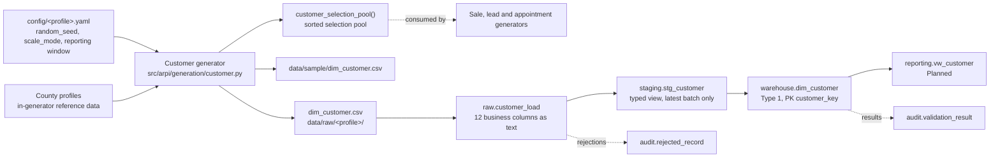

# STM-007 — Customer Dimension

## Header

| Field | Value |
|---|---|
| **Mapping ID** | `STM-007` |
| **Title** | Customer dimension (Slowly Changing Dimension Type 1) |
| **Status** | **Implemented** (generator, column contract, data-quality suite). Ingestion, warehouse DDL and merge are **Planned** in Phase 1.2. |
| **Version** | 1.0 |
| **Date** | 2026-07-28 |
| **Owner** | Michael Palmer |
| **Source system** | `arpi_synthetic_generator` |
| **Target object** | `warehouse.dim_customer` |
| **Declared grain** | One row per synthetic customer. |
| **Phase** | Phase 1.1 (delivery increment `P1.1-06`) |
| **Intermediate objects** | `raw.customer_load`, `staging.stg_customer` (Planned, `P1.2-01`) |
| **Downstream object** | `reporting.vw_customer` (Planned) |

---

## 1. Purpose

`warehouse.dim_customer` represents the synthetic buying party on a sale, lead or appointment. It exists to
support **repeat-purchase, household and cohort analysis** — and nothing else.

It is deliberately the thinnest dimension in the model. Every attribute earns its place by answering a
declared question: `age_band` and `county` for cohort and market analysis, `household_id` for
household-level repeat purchase, `is_prior_customer` so repeat-rate measures are not artificially
depressed at the start of the reporting window, `is_service_customer` for the Deferred service-to-sales
domain, and `first_interaction_date` so no fact can reference a customer before they existed.

### 1.1 What this dimension deliberately does not contain

**No name. No full birth date. No street address, postal code or coordinates. No email address. No phone
number. No Social Security number. No driver's licence number. No bank or payment-card details. No exact
credit score, credit application or credit-report field. No insurance detail. No protected characteristic.
No free-form note, comment or transcript.**

This is not squeamishness; it is the data-minimisation position stated in
[ARCHITECTURE.md §11.2 and §22.4](../../ARCHITECTURE.md), [PRIVACY_AND_ETHICS.md](../../PRIVACY_AND_ETHICS.md)
and `docs/research.md` §10.2. Two decisions carry most of the weight:

- **Age is banded, never exact.** A full birth date is a classic quasi-identifier; a six-way band answers
  every cohort question ARPI asks.
- **Geography stops at county and market area.** County is the finest geography ARPI stores anywhere. A
  street address, a postal code or a coordinate pair would each make a synthetic record shaped like a real
  one, which is the specific failure mode a synthetic portfolio dataset must avoid.

`DQ-CUS-003` enforces this against the **schema**, not the values, so a prohibited column fails the run
even when it is entirely empty.

---

## 2. Lineage



**Ordered lineage statement**

1. The generator resolves the customer count for the active `generation.scale_mode` — 80 (test), 2,500
   (development), 22,000 (portfolio).
2. Customers are drawn in `customer_id` order. Each either **founds a new household** or **joins the most
   recently created one**, with a 0.22 join probability capped at three members per household.
3. A **household** draws its county once, from the weighted trading-area list (section 4.1). Every member
   inherits it, so a household can never span two counties.
4. `state_code` and `market_area` are **derived from the county**, never drawn separately, which makes an
   inconsistent geography triple unrepresentable rather than merely invalid.
5. `age_band`, `customer_type`, `is_prior_customer` and `is_service_customer` are drawn per customer from
   the declared, deliberately non-uniform distributions (section 4.2).
6. `first_interaction_date` is placed inside the permitted window (section 4.3). Prior customers are
   placed strictly **before** `reporting.start_date`, inside the acquisition warm-up period.
7. `customer_key` is assigned as a **deterministic ordinal 1..N over `customer_id`**.
8. Rows are written to `data/raw/<profile>/dim_customer.csv` — UTF-8, LF endings, header row, ISO-8601
   dates, lowercase booleans, declared column order.
9. **Planned (`P1.2-01`)**: the CSV loads into `raw.customer_load`, all business columns as `text`, plus
   the five load-lineage columns.
10. **Planned**: `staging.stg_customer` casts to warehouse types and exposes only the most recent
    `load_batch_id`.
11. **Planned**: `warehouse.dim_customer` is loaded by **Type 1 upsert (MERGE) on `customer_id`**.

**The selection pool branches off at step 8 and never rejoins.**
`arpi.generation.customer.customer_selection_pool()` returns the same population sorted by
`(first_interaction_date, customer_id)`, and `select_customer_for_sale()` binary-searches it so a fact
generator can only ever be offered a customer who already existed on the transaction date. That is the
mechanism behind the `first_interaction_date <= sale_date` guarantee; it is not left to the caller.

---

## 3. Mapping table

All 12 columns of `warehouse.dim_customer`, in declared order. **Every column is `NOT NULL`.**

| Source field | Source type | Target field | Target type | Transformation | Default behaviour | Validation | Rejection behaviour | Lineage field | Owner |
|---|---|---|---|---|---|---|---|---|---|
| `customer_key` | `text` | `customer_key` | `integer` PK | Cast to `integer`. Generator assigns it as a **deterministic ordinal 1..N over `customer_id` ascending**, so regeneration is stable. | `n/a — required` | PK not null and unique | `REJ-TYPE-001` if not castable; `REJ-KEY-001` on duplicate | `load_batch_id`, `source_row_number` | Customer generator |
| `customer_id` | `text` | `customer_id` | `varchar(16)` U | Direct. Natural / source key, format `CUS-########`. **Purely synthetic** — it encodes nothing about any person and cannot be reversed into one. | `n/a — required` | `DQ-CUS-001` unique | `REJ-NULL-001` if empty; `REJ-DOMAIN-001` if it does not match `CUS-########`; `REJ-KEY-001` on duplicate | `load_batch_id`, `source_row_number` | Customer generator |
| `household_id` | `text` | `household_id` | `varchar(16)` | Direct, format `HH-########`. Groups customers for household-level repeat-purchase analysis. A one-person household carries its own id rather than NULL, so the grouping is total and downstream aggregates need no NULL handling. | `n/a — required` | `DQ-CUS-006` every member of a household shares one `county`, `state_code` and `market_area` | `REJ-DOMAIN-001` if it does not match `HH-########`; `REJ-RULE-001` if a household spans two geographies | `load_batch_id` | Customer generator |
| `age_band` | `text` | `age_band` | `varchar(20)` | Direct. Domain `18-24` \| `25-34` \| `35-44` \| `45-54` \| `55-64` \| `65+`. **Banded, never exact — a full birth date is prohibited.** Drawn from a deliberately non-uniform distribution. | `n/a — required` | `DQ-CUS-005` inside the declared enumeration | `REJ-DOMAIN-001` outside the enumeration | `load_batch_id` | Customer generator |
| `county` | `text` | `county` | `varchar(40)` | Direct. Domain `Hillsborough` \| `Rockingham` \| `Merrimack` \| `Strafford` \| `Middlesex` \| `Essex`. **The finest geography ARPI stores — no street address, postal code or coordinate exists at any layer.** Drawn once per household. | `n/a — required` | `DQ-CUS-004` inside the declared trading area | `REJ-DOMAIN-001` outside the enumeration | `load_batch_id` | Customer generator |
| `state_code` | `char(2)` | `state_code` | `char(2)` | **Derived from `county`**, never drawn separately. Domain `NH` \| `MA`. | `n/a — required` | `DQ-CUS-004` must equal the mapping of its own `county` | `REJ-RULE-001` if it does not follow from `county` | `load_batch_id` | Customer generator |
| `market_area` | `text` | `market_area` | `varchar(40)` | **Derived from `county`**, never drawn separately. Domain `Southern New Hampshire` \| `Northern Massachusetts`. Coarse analytical grouping, explicitly allowed by the prohibited-field policy. | `n/a — required` | `DQ-CUS-004` must equal the mapping of its own `county` | `REJ-RULE-001` if it does not follow from `county` | `load_batch_id` | Customer generator |
| `customer_type` | `text` | `customer_type` | `varchar(20)` | Direct. Domain `Retail` \| `Business`. Business buyers are a deliberate minority (about 7%). | `n/a — required` | `DQ-CUS-008` inside the declared enumeration | `REJ-DOMAIN-001` outside the enumeration | `load_batch_id` | Customer generator |
| `is_prior_customer` | `text` | `is_prior_customer` | `boolean` | Cast lowercase `true`/`false` to `boolean`. True where the synthetic customer bought before the reporting window opened. **Exists so repeat-rate measures are not artificially depressed on day one of the window.** | `n/a — required` | Not null; where true, `first_interaction_date < reporting.start_date` | `REJ-TYPE-001` if not `true`/`false`; `REJ-RULE-001` on disagreement with `first_interaction_date` | `load_batch_id` | Customer generator |
| `is_service_customer` | `text` | `is_service_customer` | `boolean` | Cast to `boolean`. True where the synthetic customer also has service history. Supports the **Deferred** service-to-sales domain; no service fact exists yet. | `n/a — required` | Not null | `REJ-TYPE-001` if not `true`/`false` | `load_batch_id` | Customer generator |
| `first_interaction_date` | `text` | `first_interaction_date` | `date` | Cast ISO-8601 `YYYY-MM-DD` to `date`. **The earliest date any fact may reference this customer.** Placed inside `[reporting.start_date − 180 days, reporting.end_date]`. | `n/a — required` | `DQ-CUS-007` inside the permitted window; on or before the earliest referencing fact date | `REJ-TYPE-001` if unparseable; `REJ-RULE-001` if outside the window | `load_batch_id` | Customer generator |
| `source_system` | `text` | `source_system` | `varchar(40)` | **Constant** `arpi_synthetic_generator`. Present on every row so no reviewer can mistake this data for a real CRM or DMS extract. | `n/a — constant` | Must equal `arpi_synthetic_generator` | `REJ-RULE-001` if any other value appears | itself | Customer generator |
| *(database)* | — | `raw_record_id` | `bigserial` | Database-assigned. **Raw layer only.** | `n/a — database-assigned` | PK uniqueness | n/a | itself | Database |
| *(load process)* | — | `load_batch_id` | `uuid` | Assigned once per load. **Raw and staging layers only.** | `n/a — required` | Not null; unique per batch | `REJ-PARSE-001` if the batch cannot be initialised | itself | Loader |
| *(load process)* | — | `source_file_name` | `text` | Name of the source file. **Raw and staging layers only.** | `n/a — required` | Not null | n/a | itself | Loader |
| *(load process)* | — | `source_row_number` | `integer` | 1-based row number, excluding the header. **Raw and staging layers only.** | `n/a — required` | Not null; ≥ 1 | n/a | itself | Loader |
| *(database)* | — | `ingested_at` | `timestamptz` | Database `DEFAULT now()`. **Raw and staging layers only.** | `now()` | Not null | n/a | itself | Database |

> **Prohibited target fields.** `customer_name`, `first_name`, `last_name`, `full_name`, `email`, `phone`,
> `street_address`, `address_line_1`, `postal_code`, `zip_code`, `latitude`, `longitude`,
> `date_of_birth`, `dob`, `age` (exact), `ssn`, `social_security_number`, `drivers_license`,
> `bank_account`, `routing_number`, `credit_card`, `credit_score`, `credit_application_status`,
> `credit_report_*`, `insurance_*`, `household_income`, `deal_jacket_*`, `race`, `ethnicity`, `gender`,
> `religion`, `marital_status`, `veteran_status`, `national_origin`, `disability`, `notes`, `comments`,
> `transcript`, `recording`. None of these exists at any layer. `DQ-CUS-003` inspects the schema and fails
> the run if one appears.
>
> Where a credit dimension is ever required, only a **broad synthetic tier** is permissible
> ([ARCHITECTURE.md §22.4](../../ARCHITECTURE.md)) — and that is **Deferred**, not Planned.

---

## 4. Derivation reference

### 4.1 Trading-area counties (authoritative)

The three stores sit in Nashua, Manchester and Merrimack, all in Hillsborough County, so the customer base
is centred there. The two Massachusetts counties are the cross-border shoppers the fictional group
genuinely competes for.

| `county` | `state_code` | `market_area` | Draw weight |
|---|---|---|---:|
| Hillsborough | `NH` | Southern New Hampshire | 0.42 |
| Rockingham | `NH` | Southern New Hampshire | 0.20 |
| Merrimack | `NH` | Southern New Hampshire | 0.12 |
| Strafford | `NH` | Southern New Hampshire | 0.06 |
| Middlesex | `MA` | Northern Massachusetts | 0.13 |
| Essex | `MA` | Northern Massachusetts | 0.07 |

`state_code` and `market_area` are looked up from this table, never drawn. A row whose triple does not
agree with this table is a defect, not a variation, and `DQ-CUS-004` fails on it.

### 4.2 Attribute distributions

| Attribute | Distribution | Why not uniform |
|---|---|---|
| `age_band` | `18-24` 0.06, `25-34` 0.20, `35-44` 0.22, `45-54` 0.20, `55-64` 0.18, `65+` 0.14 | A flat age distribution is a **prohibited synthetic pattern** ([ARCHITECTURE.md §15.4](../../ARCHITECTURE.md)) and is the single most obvious tell of fabricated data. |
| `customer_type` | `Business` 0.07, `Retail` 0.93 | Business buyers behave differently in every funnel measure, so the segment has to exist — but a franchise store's floor traffic is overwhelmingly retail. |
| `is_prior_customer` | 0.18 base, +0.10 for the `45-54`, `55-64` and `65+` bands; 0.30 for business buyers | Older cohorts and fleet buyers are materially more likely to be repeat purchasers. |
| `is_service_customer` | 0.75 where `is_prior_customer`, 0.34 otherwise, 0.28 for business buyers | Service retention follows a prior purchase; it does not precede one. |
| Household size | 1 member with probability 0.78, otherwise joins the most recent household, capped at 3 | Produces the long tail of one-person households with a minority of two- and three-person ones. Beyond three, a "household" stops being a repeat-purchase grouping and starts looking like a fabricated family record. |

### 4.3 `first_interaction_date` placement

The permitted window is

```
[ reporting.start_date − 180 days , reporting.end_date ]
```

The 180-day opening is the **acquisition warm-up period** already used by the inventory acquisition
contract, so inventory and customers both exist on day one of the reporting window.

| Customer | Placed uniformly in |
|---|---|
| `is_prior_customer = true` | `[start − 180 days, start − 1 day]` — strictly before the window opens |
| `is_prior_customer = false` | `[start − 180 days, end]` |

**This is what guarantees `first_interaction_date <= sale_date` for every fact.** The guarantee is not
enforced by asking fact generators to be careful; it is enforced by `select_customer_for_sale()`, which
binary-searches the pool and can only return a customer whose first interaction is on or before the
transaction date. A transaction earlier than every customer's first interaction returns `None` rather than
an ineligible customer.

### 4.4 Helper contract for downstream fact generators

```python
customer_selection_pool(config, *, customer_type=None) -> tuple[CustomerSelection, ...]
select_customer_for_sale(pool, sale_date, rng) -> CustomerSelection | None
```

`CustomerSelection` carries `customer_id`, `household_id`, `customer_type`, `is_prior_customer` and
`first_interaction_date` — and nothing else, because nothing else is needed and everything else would be
a wider surface for a privacy mistake.

Build the pool **once** per run: it regenerates the whole population, so calling it per transaction is
quadratic. `select_customer_for_sale` is `O(log n)` and draws from the caller's own generator, so the
choice stays inside the caller's seed stream and does not perturb this entity.

---

## 5. Load strategy

| Layer | Strategy | Write semantics |
|---|---|---|
| CSV | Overwrite | The generator rewrites `data/raw/<profile>/dim_customer.csv` on each run. Byte-identical between runs of the same profile and seed. |
| `raw.customer_load` | **Truncate-and-reload per batch** (Planned) | Truncated and reloaded from the current CSV, then stamped with a fresh `load_batch_id`. |
| `staging.stg_customer` | **View** (`CREATE OR REPLACE VIEW`) (Planned) | No data written. Casts raw text to warehouse types and filters to the most recent `load_batch_id`. |
| `warehouse.dim_customer` | **Type 1 upsert (MERGE) on the natural key `customer_id`** (Planned) | Matched → update the attribute columns in place. Unmatched → insert. **Nothing is ever deleted**, because a deleted customer would orphan its facts. |

**Why Type 1 and not Type 2.** ARPI has no question that requires the value an age band or county held
historically. Trade-cycle analysis, if it is ever built, would need it — and that is an ADR, not a quiet
schema change. Type 1 also keeps the dimension small enough that the whole population fits comfortably in
a Power BI model at portfolio scale.

**Constraints enforced in the database**

- `customer_id` UNIQUE.
- `age_band`, `county`, `state_code`, `market_area` and `customer_type` CHECK constraints over their
  declared enumerations.
- A CHECK tying `state_code` and `market_area` to `county`, so the derivation cannot be bypassed by a
  direct `INSERT`.
- Every column `NOT NULL`.

---

## 6. Idempotency guarantees

| Guarantee | Mechanism |
|---|---|
| Rerunning with unchanged source produces **no new warehouse rows** | Type 1 MERGE on `customer_id`: a matched row is updated in place, never duplicated. |
| `customer_key` is stable across regenerations | Deterministic ordinal 1..N over `customer_id` — no database sequence, no insertion-order dependence. |
| `customer_id` and `household_id` are stable across regenerations | Both are assigned from monotonic counters over a deterministic draw order. |
| Rerunning produces a **byte-identical CSV** | A dedicated seeding namespace, deterministic ordinals and a fixed output format. Asserted by `tests/data_quality/test_customer_quality.py`. |
| Generating customers cannot move another entity's digest | `rng_for(master_seed, "dim_customer")` hashes the namespace rather than consuming a shared stream. Asserted against `dim_date`, `dim_dealership` and `dim_employee`. |
| A rerun cannot produce two rows for one customer | `customer_id` UNIQUE, enforced by the database rather than by application logic. |
| Verifiable by a third party | `content_digest` in `generation_manifest.json` is the SHA-256 of the CSV bytes. |

---

## 7. Rejection handling

| Condition | `REJ-*` code | Outcome |
|---|---|---|
| A CSV row cannot be parsed | `REJ-PARSE-001` | Row rejected; run fails |
| The CSV header does not match the 12 declared columns, in order | `REJ-SCHEMA-001` | Load aborts before any row is processed; run fails. Also caught pre-load by `DQ-CUS-002`. |
| **A prohibited PII, credit, insurance or free-text column is present in the schema** | `REJ-SCHEMA-001` | Load aborts; run fails. Detected by `DQ-CUS-003`, which inspects the schema rather than the values. |
| A value cannot be cast to its warehouse type | `REJ-TYPE-001` | Row rejected; run fails |
| Any field is NULL or empty | `REJ-NULL-001` | Row rejected; run fails — every column is `NOT NULL` |
| `customer_id` or `household_id` does not match its format, or an enumerated value is outside its domain | `REJ-DOMAIN-001` | Row rejected; run fails. Detected by `DQ-CUS-004`, `DQ-CUS-005` and `DQ-CUS-008`. |
| Duplicate `customer_key` or duplicate `customer_id` | `REJ-KEY-001` | Later row rejected; run fails. Detected by `DQ-CUS-001`. |
| `state_code` or `market_area` does not follow from `county` | `REJ-RULE-001` | Row rejected; run fails. Detected by `DQ-CUS-004`. |
| A household spans more than one county, state or market area | `REJ-RULE-001` | Row rejected; run fails. Detected by `DQ-CUS-006`. |
| `first_interaction_date` falls outside the permitted window | `REJ-RULE-001` | Row rejected; run fails. Detected by `DQ-CUS-007`. |

Every rejection writes a row to `audit.rejected_record` with `source_entity = 'dim_customer'`,
`source_record_key` = the offending `customer_id` where identifiable, the code, a human-readable reason,
and the `record_payload`.

> **The rejection payload is redacted before it is persisted.** All customer data here is synthetic and
> minimised, so no prohibited value should ever reach this path — but a rejection path handles input that
> has already failed validation, which makes it precisely the place a prohibited value would first be
> written to disk. `arpi.validation.privacy.redact_payload()` masks the value of any prohibited key while
> preserving the key, so a reviewer can still see *what* the record carried. **Fail closed.**

> **Phase 1 rejection tolerance is zero.** `validation.max_rejected_record_ratio = 0.0`.

---

## 8. Validation checks gating the load

| Check ID | Assertion | Category | Severity | Gate |
|---|---|---|---|---|
| `DQ-CUS-002` | The generated frame's schema matches the declared 12-column contract — names, order and count | `structural` | critical | Pre-load |
| `DQ-CUS-003` | **No prohibited personal-data column is present** — inspects the schema, so an empty prohibited column still fails | `privacy` | critical | Pre-load **and** post-load |
| `DQ-CUS-001` | `customer_id` is unique | `uniqueness` | critical | Pre-load **and** post-load |
| `DQ-CUS-004` | `county` is inside the declared trading area, and `state_code` and `market_area` follow from it | `business_rule` | critical | Pre-load **and** post-load |
| `DQ-CUS-005` | `age_band` is inside its declared enumeration | `business_rule` | critical | Pre-load **and** post-load |
| `DQ-CUS-006` | Every member of a household shares one county, state and market area | `business_rule` | critical | Pre-load **and** post-load |
| `DQ-CUS-007` | `first_interaction_date` is inside the permitted window | `business_rule` | critical | Pre-load **and** post-load |
| `DQ-CUS-008` | `customer_type` is inside its declared enumeration | `business_rule` | critical | Pre-load **and** post-load |

Cross-entity checks that also apply: `DQ-GEN-001` (schema matches) and `DQ-GEN-002` (determinism digest).

**All eight are `critical`.** Any failure sets `audit.pipeline_run.status = 'failed'` and increments
`critical_failure_count`. Each identifier is declared once, in
`src/arpi/generation/customer.py`, and registered at import time with
`arpi.validation.registry.register_checks()`.

---

## 9. Reconciliations

| Reconciliation ID | Description | Left | Right | Tolerance | Status |
|---|---|---|---|---|---|
| `RECON-DIM-CUSTOMER-ROWCOUNT` | Generated `dim_customer` rows equal `warehouse.dim_customer` rows after the merge | `generator:dim_customer` row count | `warehouse.dim_customer` `count(*)` | 0 (exact) | **Planned** (`P1.2-01`) |

Because the history policy is Type 1, generated rows and warehouse rows stay equal indefinitely — an
unfiltered `count(*)` is correct here in a way it is not for `dim_employee` or `dim_dealership`. Expected
counts: 80 (test), 2,500 (development), 22,000 (portfolio).

---

## 10. Open questions and known gaps

- **The warehouse table does not exist yet.** The generator, contract, data-quality suite and this mapping
  are Implemented; `sql/03_dimensions/05_dim_customer.sql` and its merge are **Planned** in Phase 1.2. The
  merge behaviour in section 5 is a specification, not a description of running code.
- **`first_interaction_date <= fact date` is guaranteed by construction, not yet asserted end to end.**
  The selection helper cannot offer an ineligible customer, but no cross-entity check exists because no
  fact references a customer yet. That check belongs with `P1.1-05` and is `DQ-REF-*` work owned by the
  agent building the sale fact.
- **`is_service_customer` supports a Deferred domain.** No service fact exists, so the flag is currently
  unjoined to anything. It is generated now because retrofitting it later would change every customer's
  content digest.
- **Households are geographically consistent but not otherwise modelled.** Members share a county and
  nothing else; ages are drawn independently, so a three-person household can be entirely `18-24`. Adding
  a household age structure would imply a family record, which is precisely the shape of inference this
  dimension is designed to avoid.
- **The customer base is generated once, not accrued over time.** Every customer exists from the start of
  the run, with `first_interaction_date` distributed across the window. A genuinely accrued base — where
  customer count grows with marketing spend and lead volume — would couple this entity to `P1.4`, and is
  Deferred.
- **`customer_type` has no `Wholesale Buyer` value.** [DATA_DICTIONARY.md §9.1](../../DATA_DICTIONARY.md)
  listed one at Planned stage; the implemented contract does not, because a wholesale disposal carries a
  **NULL** `customer_key` rather than a customer of a special type. Modelling the buyer of a wholesale
  unit as a customer would put a party ARPI knows nothing about into a dimension designed for retail
  cohort analysis.
- **Portfolio scale is never generated in CI.** 22,000 customers is asserted only by contract, not by a
  routine test run.
