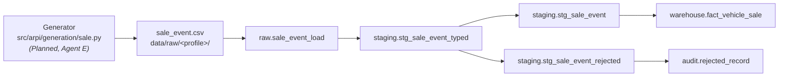

# STM-008 — Vehicle Sale Fact

## Header

| Field | Value |
|---|---|
| **Mapping ID** | `STM-008` |
| **Title** | Vehicle sale transactions |
| **Status** | **Planned** — the target table is created and constrained; **no row has ever been loaded** |
| **Version** | 0.9 |
| **Date** | 2026-07-28 |
| **Owner** | Agent F (ingestion and warehouse) |
| **Source system** | `arpi_synthetic_generator` |
| **Target object** | `warehouse.fact_vehicle_sale` |
| **Declared grain** | One row per finalized vehicle transaction |
| **Phase** | Phase 1.2 |

> **Status, stated precisely.** `sql/04_facts/00_fact_vehicle_sale.sql` exists, runs, and
> enforces every constraint below. The generator (`sale_event`) and the load script
> (`sql/04_facts/10_fact_vehicle_sale_load.sql`) do **not** exist yet. The version is 0.9
> rather than 1.0 for exactly that reason: the mapping is complete as a specification and
> unproven as an implementation. It becomes 1.0 in the change that loads the first row.

---

## 1. Purpose

This is the fact a dealer group runs on. Every volume, gross, PVR (per-vehicle retail) and
salesperson-productivity number in the whole project is an aggregate of this table. It
answers "how many did we sell, at what gross, by whom, at which store, out of which
inventory" — and it is deliberately the *narrowest* answer to that question: one row per
**finalized** deal, nothing else.

---

## 2. Lineage

**Ordered lineage statement**

1. The sale generator produces `sale_event` rows deterministically from
   `(random_seed, "sale_event")`. **Planned.**
2. Rows are written to `data/raw/<profile>/sale_event.csv` — UTF-8, LF endings, header
   row, ISO-8601 dates, lower-case booleans, money to the cent.
3. `sale_event.csv` is loaded into `raw.sale_event_load` with all 29 business columns as
   `text`, plus `load_batch_id`, `source_file_name`, `source_row_number`, `ingested_at`.
   **Implemented.**
4. `staging.stg_sale_event_typed` casts every column with a non-throwing expression and
   classifies each row as accepted or rejected. **Implemented.**
5. `staging.stg_sale_event` exposes the accepted rows of the newest batch, deduplicated on
   `sale_id`. **Implemented.**
6. `warehouse.fact_vehicle_sale` is loaded from staging by resolving natural ids to
   surrogate keys and real dates to `dim_date` keys. **Planned.**

---

## 3. Mapping table

Source type is `text` for every field: the raw layer preserves source values without
transformation ([ARCHITECTURE.md §10.2](../../ARCHITECTURE.md)). "Owner" names the
component accountable for producing the value.

| Source field | Source type | Target field | Target type | Transformation | Default behaviour | Validation | Rejection behaviour | Lineage field | Owner |
|---|---|---|---|---|---|---|---|---|---|
| (derived) | — | `sale_key` | `bigint` | `max(sale_key) + row_number() OVER (ORDER BY sale_id)` over rows new to the fact | n/a — assigned | `DQ-SLE-001` unique, `> 0` | n/a | `sale_id` | fact load script |
| `sale_id` | `text` | `sale_id` | `varchar(16)` | Trim; reject if longer than 16 | n/a — required | `DQ-SLE-001` unique, matches `SLE-########` | `REJ-NULL-001` / `REJ-TYPE-001`, row rejected | `raw_record_id` | generator |
| `sale_date` | `text` | `sale_date_key` | `integer` | Cast to `date`, then look up `dim_date.date_key` | n/a — required | FK to `dim_date` | `REJ-TYPE-001` on bad cast; `REJ-REF-001` if the calendar has no such day | `raw_record_id` | fact load script |
| `delivery_date` | `text` | `delivery_date_key` | `integer` | Cast to `date`, then look up `dim_date.date_key` | n/a — required | FK to `dim_date`; `>= sale_date_key` | `REJ-TYPE-001`; `REJ-RULE-001` if before the sale date | `raw_record_id` | fact load script |
| `dealership_id` | `text` | `dealership_key` | `integer` | Look up the **current** row of `dim_dealership` by `dealership_id` | n/a — required | FK to `dim_dealership` | `REJ-REF-001`, row rejected | `raw_record_id` | fact load script |
| `vehicle_id` | `text` | `vehicle_key` | `integer` | Look up `dim_vehicle` by `vehicle_id` | n/a — required | FK to `dim_vehicle` | `REJ-REF-001`, row rejected | `raw_record_id` | fact load script |
| `customer_id` | `text` | `customer_key` | `integer` NULL | Look up `dim_customer` by `customer_id` | NULL — **means the deal had no retail buyer**, never "buyer unknown" | Required when `is_retail`; `ck_fact_vehicle_sale_retail_requires_customer` | `REJ-RULE-001` if a retail deal has none | `raw_record_id` | fact load script |
| `salesperson_id` | `text` | `salesperson_key` | `integer` NULL | Look up the `dim_employee` version **current as at `sale_date`** | NULL — no salesperson was credited | FK to `dim_employee` | `REJ-REF-001` when the id exists but no version covers the date | `raw_record_id` | fact load script |
| `desk_manager_id` | `text` | `desk_manager_key` | `integer` NULL | As `salesperson_key` | NULL — none credited | FK to `dim_employee` | `REJ-REF-001` | `raw_record_id` | fact load script |
| `finance_manager_id` | `text` | `finance_manager_key` | `integer` NULL | As `salesperson_key` | NULL — none credited | FK to `dim_employee` | `REJ-REF-001` | `raw_record_id` | fact load script |
| `lead_source_id` | `text` | `lead_source_key` | `integer` NULL | Look up `dim_lead_source` by `lead_source_id` | NULL — **not yet attributed**; attribution is populated in P1.4 | FK to `dim_lead_source` | `REJ-REF-001` | `raw_record_id` | fact load script |
| `sale_type` | `text` | `sale_type` | `varchar(20)` | Trim; must be in the six-value domain | n/a — required | `ck_fact_vehicle_sale_sale_type_domain` | `REJ-DOMAIN-001`, row rejected | `raw_record_id` | generator |
| (derived) | — | `is_retail` | `boolean` | `sale_type IN ('New Retail','Used Retail','Certified Retail','Lease')`. **Derived, never random, never taken from the source** | n/a — derived | `ck_fact_vehicle_sale_is_retail_derivation` | `REJ-RULE-001` if the source disagrees with the derivation | `raw_record_id` | fact load script |
| `unit_count` | `text` | `unit_count` | `smallint` | Cast; always exactly `1` | n/a — required | `ck_fact_vehicle_sale_unit_count_is_one` | `REJ-DOMAIN-001` | `raw_record_id` | generator |
| `sale_price` | `text` | `sale_price` | `numeric(12,2)` | Cast to `numeric(12,2)` | n/a — required | `DQ-SLE-002` `>= 0` | `REJ-TYPE-001` | `raw_record_id` | generator |
| `msrp` | `text` | `msrp` | `numeric(12,2)` NULL | Cast to `numeric(12,2)` | NULL — **the vehicle has no MSRP** (typically a used unit), never "unknown" | — | `REJ-TYPE-001` | `raw_record_id` | generator |
| `original_asking_price` | `text` | `original_asking_price` | `numeric(12,2)` | Cast | n/a — required | `DQ-SLE-002` | `REJ-TYPE-001` | `raw_record_id` | generator |
| `final_asking_price` | `text` | `final_asking_price` | `numeric(12,2)` | Cast | n/a — required | `<= original_asking_price` (`DQ-SLE-003`) | `REJ-TYPE-001` | `raw_record_id` | generator |
| `acquisition_cost` | `text` | `acquisition_cost` | `numeric(12,2)` | Cast | n/a — required | `DQ-SLE-002` | `REJ-TYPE-001` | `raw_record_id` | generator |
| `reconditioning_cost` | `text` | `reconditioning_cost` | `numeric(12,2)` | Cast | n/a — required | `DQ-SLE-002` | `REJ-TYPE-001` | `raw_record_id` | generator |
| `pack_amount` | `text` | `pack_amount` | `numeric(12,2)` | Cast | n/a — required | `DQ-SLE-002` | `REJ-TYPE-001` | `raw_record_id` | generator |
| `front_end_gross` | `text` | `front_end_gross` | `numeric(12,2)` | Cast. **Must equal** `sale_price - acquisition_cost - reconditioning_cost - pack_amount` | n/a — required | `ck_fact_vehicle_sale_front_end_gross_identity` | `REJ-RULE-001`, row rejected | `raw_record_id` | generator |
| `back_end_gross` | `text` | `back_end_gross` | `numeric(12,2)` | Cast | n/a — required | — | `REJ-TYPE-001` | `raw_record_id` | generator |
| `total_gross` | `text` | `total_gross` | `numeric(12,2)` | Cast. **Must equal** `front_end_gross + back_end_gross` | n/a — required | `ck_fact_vehicle_sale_total_gross_identity` | `REJ-RULE-001`, row rejected | `raw_record_id` | generator |
| `trade_allowance` | `text` | `trade_allowance` | `numeric(12,2)` | Cast | n/a — required; `0.00` when there was no trade | `DQ-SLE-002` | `REJ-TYPE-001` | `raw_record_id` | generator |
| `trade_acv` | `text` | `trade_acv` | `numeric(12,2)` | Cast | n/a — required; `0.00` when there was no trade | `DQ-SLE-002` | `REJ-TYPE-001` | `raw_record_id` | generator |
| `cash_down` | `text` | `cash_down` | `numeric(12,2)` | Cast | n/a — required; `0.00` when nothing was put down | `DQ-SLE-002` | `REJ-TYPE-001` | `raw_record_id` | generator |
| `amount_financed` | `text` | `amount_financed` | `numeric(12,2)` | Cast | n/a — required; `0.00` on a cash deal | `DQ-SLE-002` | `REJ-TYPE-001` | `raw_record_id` | generator |
| `days_in_inventory_at_sale` | `text` | `days_in_inventory_at_sale` | `integer` | Cast | n/a — required | `>= 0` | `REJ-TYPE-001` / `REJ-DOMAIN-001` | `raw_record_id` | generator |
| `source_system` | `text` | `source_system` | `varchar(40)` | Trim | n/a — required; constant `arpi_synthetic_generator` | not blank | `REJ-NULL-001` | `raw_record_id` | generator |

---

## 4. Load strategy

| Layer | Strategy | Write semantics |
|---|---|---|
| CSV | Overwrite | The generator rewrites the file every run |
| `raw.sale_event_load` | Append by batch | Every load appends rows under a fresh `load_batch_id`; nothing is ever deleted |
| `staging.stg_sale_event` | View | Newest batch only, typed, domain-filtered, deduplicated on `sale_id` |
| `warehouse.fact_vehicle_sale` | Insert-only, matched on `sale_id` | A `sale_id` already present is left untouched; a new one is inserted |

**Natural key for matching:** `sale_id`.
**On match:** nothing. A finalized deal does not change. If a deal is unwound it is not
updated here — it never should have been in the table, and the correction is a deletion
plus a data-quality finding, not an in-place edit.
**On no match:** insert, after resolving every surrogate key.
**Expiry/deletion:** none. This is a transaction fact; it has no versions.

---

## 5. Idempotency guarantees

| Guarantee | Mechanism |
|---|---|
| Rerunning with identical source produces no new warehouse rows | `INSERT ... ON CONFLICT (sale_id) DO NOTHING`; the surrogate key is only consumed by rows new to the fact |
| Load batches are uniquely identified | `load_batch_id uuid`, indexed on the raw table |
| Surrogate keys are reproducible from the same CSVs | `max(sale_key) + row_number() OVER (ORDER BY sale_id)`, not a sequence — sequences are non-transactional and drift after a rolled-back load |
| Audit history is preserved across reruns | `audit.pipeline_run` is keyed on a deterministic `run_uuid`; a rerun updates the run and replaces only its own child rows |

---

## 6. Rejection handling

| Condition | `REJ-*` code | Outcome |
|---|---|---|
| A money, date or integer value cannot be represented in its governed type | `REJ-TYPE-001` | Row rejected |
| A required value is absent | `REJ-NULL-001` | Row rejected |
| `sale_type` is outside its six-value domain, or a numeric measure is outside its range | `REJ-DOMAIN-001` | Row rejected |
| Two rows share a `sale_id` within one batch | `REJ-KEY-001` | The row with the lower `raw_record_id` is rejected; the later one survives |
| A natural id does not resolve to a dimension row, or no `dim_employee` version covers the sale date | `REJ-REF-001` | Row rejected |
| A gross identity does not hold, a retail deal has no customer, or delivery precedes the sale | `REJ-RULE-001` | Row rejected |

Rejected rows are written to `audit.rejected_record` with `source_entity`,
`source_record_key`, `rejection_code`, `rejection_reason` (prefixed with its canonical
validation category) and a **redacted** `record_payload`. Tolerance is zero:
`validation.max_rejected_record_ratio = 0.0`, so any rejection fails the run. ARPI
generates its own source data, so a rejected row is a generator or mapping defect, not a
data-supplier problem.

---

## 7. Validation checks gating the load

| Check ID | Assertion | Severity | Gate |
|---|---|---|---|
| `DQ-SLE-001` | `sale_id` is unique and matches `^SLE-\d{8}$` | `critical` | pre-load |
| `DQ-SLE-002` | No money measure that must be non-negative is negative | `critical` | pre-load |
| `DQ-SLE-003` | `final_asking_price <= original_asking_price` | `warning` | pre-load |
| `DQ-SLE-004` | `front_end_gross` equals its identity for every row | `critical` | pre-load and post-load |
| `DQ-SLE-005` | `is_retail` equals its derivation from `sale_type` for every row | `critical` | pre-load and post-load |
| `DQ-REF-*` | Every surrogate key resolves; no orphan rows | `critical` | post-load |

`DQ-SLE-*` identifiers belong to Agent E per the contract's DQ registry; they are named
here so the mapping is complete, and their definitive wording lives in
`src/arpi/validation/registry.py`.

---

## 8. Reconciliations

| Reconciliation ID | Description | Left | Right | Tolerance | Status |
|---|---|---|---|---|---|
| `RECON-INGEST-SALE-EVENT-CHAIN` | Every raw row is accepted, rejected or deduplicated | `raw.sale_event_load` (newest batch) | `staging.stg_sale_event` + rejected + deduplicated | `0` | **Implemented** |
| `RECON-INGEST-SALE-EVENT-WAREHOUSE` | Every accepted `sale_id` reached the warehouse | `staging.stg_sale_event` | `warehouse.fact_vehicle_sale` | `0` | Planned — activates when the fact load script lands |
| `RECON-SALE-GROSS` | Total gross in the fact equals the sum of the source's gross | `sale_event.csv` | `warehouse.fact_vehicle_sale` | `0.00` | Planned |

---

## 9. Query patterns this table is indexed for

Recorded here because `sql/06_indexes/01_phase1_indexes.sql` cites this section as the
justification for each index it creates.

| Pattern | Index |
|---|---|
| Filter a sale-date range, then group by store ("MTD by store", "last 90 days by store", "this quarter vs last") | `ix_fact_vehicle_sale_sale_date_dealership (sale_date_key, dealership_key)` |
| Filter a sale-date range only | Same index, leading column |
| Join a sale back to the vehicle's inventory history | `ix_fact_vehicle_sale_vehicle_key (vehicle_key)` |
| Look up one deal by its natural key | `uq_fact_vehicle_sale_sale_id` |

---

## 10. Deliberate exclusions

**Manufacturer incentives, holdback and floorplan credits are excluded from every gross
measure.** They arrive on a different cadence than the deal, are frequently not
attributable to a single vehicle at the moment of sale, and including them would make
`front_end_gross` disagree with the deal jacket a manager actually reads. Excluding them
means ARPI's front-end gross is *conservative* and comparable across stores. Anyone
comparing an ARPI gross figure with a manufacturer statement must expect a difference,
and the difference is this.

**Cancelled and unwound deals never appear.** A deal that did not complete is not a sale.

---

## 11. Open questions and known gaps

- The load script `sql/04_facts/10_fact_vehicle_sale_load.sql` does not exist. Until it
  does, `warehouse.fact_vehicle_sale` is empty and this mapping is a specification rather
  than a description of running code.
- `lead_source_key` stays NULL until P1.4. That is a scope boundary, not a data-quality
  finding, and any attribution report before then must state the coverage explicitly
  rather than silently treating NULL as "direct".
- Employee point-in-time resolution ("the `dim_employee` version current as at
  `sale_date`") is specified here but not yet implemented anywhere. The alternative — the
  employee's *current* version regardless of sale date — would silently re-attribute
  historical deals whenever somebody changes role, so the point-in-time join is the
  requirement and the simpler join is not an acceptable substitute.
- Whether a wholesale deal should carry `days_in_inventory_at_sale` at all is unresolved;
  it currently must, and `0` is a legitimate value for a unit wholesaled on arrival.
