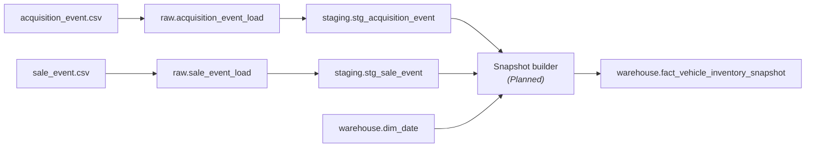

# STM-009 — Vehicle Inventory Snapshot Fact

## Header

| Field | Value |
|---|---|
| **Mapping ID** | `STM-009` |
| **Title** | Daily vehicle inventory snapshot |
| **Status** | **Planned** — the target table is created and constrained; **no row has ever been loaded** |
| **Version** | 0.9 |
| **Date** | 2026-07-28 |
| **Owner** | Agent F (ingestion and warehouse) |
| **Source system** | `arpi_synthetic_generator` |
| **Target object** | `warehouse.fact_vehicle_inventory_snapshot` |
| **Declared grain** | One row per vehicle per dealership per snapshot date, while the vehicle is in stock |
| **Phase** | Phase 1.2 |

> **Status, stated precisely.** `sql/04_facts/01_fact_vehicle_inventory_snapshot.sql`
> exists, runs, and enforces every constraint below. The snapshot builder and the load
> script do **not** exist yet. Version 0.9 records that the mapping is complete as a
> specification and unproven as an implementation; it becomes 1.0 in the change that loads
> the first row.

---

## 1. Purpose

Inventory is a dealer group's largest working-capital commitment and its fastest-decaying
asset. This fact answers "what did we own, where, at what cost, at what asking price, and
how old was it" for **every day**, so that aging, turn, markdown behaviour and inventory
investment can be measured as they actually moved rather than reconstructed from the
sales that eventually happened.

It is a **periodic snapshot**: it is materialised daily rather than derived on the fly,
because the alternative — reconstructing "what was in stock on 14 August" from acquisition
and sale events at query time — is both slow and quietly wrong the moment any event is
backdated.

---

## 2. Lineage



**Ordered lineage statement**

1. `acquisition_event` supplies, for each vehicle, the store, the date it entered stock,
   its cost, its reconditioning spend and its original asking price. Exactly one
   acquisition exists per vehicle. **Raw and staging Implemented; generator Planned.**
2. `sale_event` supplies the disposition date (`delivery_date`) for vehicles that left.
   **Raw and staging Implemented; generator Planned.**
3. For each vehicle and each `dim_date` day in
   `[acquisition_date, disposition_date - 1]` intersected with the reporting window, the
   builder emits exactly one row. **Planned.**
4. `warehouse.fact_vehicle_inventory_snapshot` is insert-only on the grain key.
   **Table Implemented; load Planned.**

Acquisitions may precede `reporting.start_date` by up to **180 warm-up days** so that
inventory genuinely exists on day one of the reporting window. Snapshots are only emitted
from `reporting.start_date` onward; the warm-up affects `days_in_stock`, not row volume.

---

## 3. Mapping table

| Source field | Source type | Target field | Target type | Transformation | Default behaviour | Validation | Rejection behaviour | Lineage field | Owner |
|---|---|---|---|---|---|---|---|---|---|
| (derived) | — | `inventory_snapshot_key` | `bigint` | `max(key) + row_number() OVER (ORDER BY snapshot_date_key, dealership_key, vehicle_key)` over rows new to the fact | n/a — assigned | `> 0`, unique | n/a | grain columns | load script |
| (derived) | — | `snapshot_date_key` | `integer` | The `dim_date.date_key` of the day being snapshotted | n/a — required | FK to `dim_date` | `REJ-REF-001` | `raw_record_id` of the acquisition | load script |
| `acquisition_event.dealership_id` | `text` | `dealership_key` | `integer` | Look up the **current** row of `dim_dealership` | n/a — required | FK to `dim_dealership` | `REJ-REF-001` | `raw_record_id` | load script |
| `acquisition_event.vehicle_id` | `text` | `vehicle_key` | `integer` | Look up `dim_vehicle` by `vehicle_id` | n/a — required | FK to `dim_vehicle` | `REJ-REF-001` | `raw_record_id` | load script |
| (derived) | — | `vehicle_model_key` | `integer` | `dim_vehicle.vehicle_model_key` of the resolved vehicle. Denormalised onto the fact so model-level inventory reports need no second join | n/a — required | FK to `dim_vehicle_model` | `REJ-REF-001` | `raw_record_id` | load script |
| (derived) | — | `current_asking_price` | `numeric(12,2)` | The asking price in force on the snapshot date, after any markdowns taken to date | n/a — required | `>= 0` | `REJ-TYPE-001` | `raw_record_id` | snapshot builder |
| `acquisition_event.original_asking_price` | `text` | `original_asking_price` | `numeric(12,2)` | Cast; carried unchanged on every snapshot so markdown depth needs no self-join | n/a — required | `>= 0` | `REJ-TYPE-001` | `raw_record_id` | generator |
| `acquisition_event.msrp` | `text` | `msrp` | `numeric(12,2)` NULL | Cast | NULL — **the vehicle has no MSRP** (typically a used unit), never "unknown" | — | `REJ-TYPE-001` | `raw_record_id` | generator |
| `acquisition_event.acquisition_cost` | `text` | `acquisition_cost` | `numeric(12,2)` | Cast | n/a — required | `>= 0` | `REJ-TYPE-001` | `raw_record_id` | generator |
| `acquisition_event.reconditioning_cost` | `text` | `reconditioning_cost` | `numeric(12,2)` | Cast; reconditioning is materially higher for used than for new | n/a — required | `>= 0` | `REJ-TYPE-001` | `raw_record_id` | generator |
| (derived) | — | `inventory_investment` | `numeric(12,2)` | `acquisition_cost + reconditioning_cost` | n/a — derived | `ck_..._investment_identity` | `REJ-RULE-001` | `raw_record_id` | load script |
| (derived) | — | `days_in_stock` | `integer` | `snapshot_date - acquisition_date`, in whole days | n/a — required | `>= 0` | `REJ-DOMAIN-001` | `raw_record_id` | snapshot builder |
| (derived) | — | `age_bucket` | `varchar(16)` | Band `days_in_stock`: `0-30 / 31-60 / 61-90 / 91-120 / Over 120`. Stored so every aging report bands identically | n/a — derived | `ck_..._age_bucket_domain` | `REJ-DOMAIN-001` | `raw_record_id` | load script |
| (derived) | — | `markdown_count_to_date` | `smallint` | Count of price reductions taken on or before the snapshot date | n/a — required; `0` on day one | `>= 0` | `REJ-DOMAIN-001` | `raw_record_id` | snapshot builder |
| (constant) | — | `inventory_unit_count` | `smallint` | Always `1` | n/a — constant | `ck_..._unit_count_is_one` | `REJ-DOMAIN-001` | — | load script |
| `acquisition_event.source_system` | `text` | `source_system` | `varchar(40)` | Trim | n/a — required; constant `arpi_synthetic_generator` | not blank | `REJ-NULL-001` | `raw_record_id` | generator |

---

## 4. Load strategy

| Layer | Strategy | Write semantics |
|---|---|---|
| CSV | Overwrite | `acquisition_event.csv` and `sale_event.csv` are rewritten every run |
| `raw.acquisition_event_load`, `raw.sale_event_load` | Append by batch | Fresh `load_batch_id` per load; nothing is deleted |
| `staging.stg_acquisition_event`, `staging.stg_sale_event` | Views | Newest batch, typed, domain-filtered, deduplicated |
| `warehouse.fact_vehicle_inventory_snapshot` | Insert-only on the grain key | A `(snapshot_date_key, dealership_key, vehicle_key)` already present is left untouched |

**Natural key for matching:** `(snapshot_date_key, dealership_key, vehicle_key)` — the
declared grain, enforced by `uq_fact_vehicle_inventory_snapshot_grain`.
**On match:** nothing. **Historical snapshots are immutable.** Yesterday's aged inventory
is what it was; a reload must reproduce it, never restate it.
**On no match:** insert.
**Expiry/deletion:** none. A vehicle leaving stock simply stops producing new rows.

---

## 5. Idempotency guarantees

| Guarantee | Mechanism |
|---|---|
| Rerunning with identical source produces no new warehouse rows | `INSERT ... ON CONFLICT (snapshot_date_key, dealership_key, vehicle_key) DO NOTHING` |
| A rerun cannot restate history | The conflict action is `DO NOTHING`, not `DO UPDATE`. There is no code path that rewrites a past snapshot |
| Load batches are uniquely identified | `load_batch_id uuid` |
| Surrogate keys are reproducible from the same CSVs | Deterministic `max(key) + row_number()` over the sorted grain, not a sequence |

---

## 6. Rejection handling

| Condition | `REJ-*` code | Outcome |
|---|---|---|
| A money or date value cannot be represented in its governed type | `REJ-TYPE-001` | Row rejected |
| A required value is absent | `REJ-NULL-001` | Row rejected |
| `acquisition_source` is outside its domain, or a derived count is negative | `REJ-DOMAIN-001` | Row rejected |
| Two acquisitions share an `acquisition_id` within one batch | `REJ-KEY-001` | The lower `raw_record_id` is rejected |
| A vehicle, store, model or date does not resolve | `REJ-REF-001` | Row rejected |
| `inventory_investment` does not equal its identity, or a snapshot falls on or after the disposition date | `REJ-RULE-001` | Row rejected |

Rejected rows go to `audit.rejected_record` with a **redacted** payload. Tolerance is zero.

---

## 7. Validation checks gating the load

| Check ID | Assertion | Severity | Gate |
|---|---|---|---|
| `DQ-INV-001` | The grain is unique: no two rows share `(snapshot_date_key, dealership_key, vehicle_key)` | `critical` | post-load |
| `DQ-INV-002` | No snapshot exists on or after a vehicle's disposition date | `critical` | post-load |
| `DQ-INV-003` | `inventory_investment = acquisition_cost + reconditioning_cost` for every row | `critical` | post-load |
| `DQ-INV-004` | `age_bucket` agrees with `days_in_stock` for every row | `critical` | post-load |
| `DQ-INV-005` | Every vehicle in stock on a day has exactly one row for that day — no gaps in a vehicle's run of snapshots | `critical` | post-load |
| `DQ-ACQ-*` | Exactly one acquisition exists per vehicle | `critical` | pre-load |

---

## 8. Reconciliations

| Reconciliation ID | Description | Left | Right | Tolerance | Status |
|---|---|---|---|---|---|
| `RECON-INGEST-ACQUISITION-EVENT-CHAIN` | Every raw acquisition row is accepted, rejected or deduplicated | `raw.acquisition_event_load` (newest batch) | `staging.stg_acquisition_event` + rejected + deduplicated | `0` | **Implemented** |
| `RECON-INGEST-ACQUISITION-EVENT-WAREHOUSE` | Every accepted `acquisition_id` reached the warehouse | `staging.stg_acquisition_event` | `warehouse.fact_vehicle_inventory_snapshot` | `0` | Planned |
| `RECON-INVENTORY-UNITS` | Units in stock on the final snapshot date equal acquisitions minus dispositions to that date | derived from `staging.stg_acquisition_event` and `staging.stg_sale_event` | `warehouse.fact_vehicle_inventory_snapshot` | `0` | Planned |

---

## 9. Query patterns this table is indexed for

Cited by `sql/06_indexes/01_phase1_indexes.sql`.

| Pattern | Index |
|---|---|
| As-of-date inventory ("what was in stock on 14 August?") | `uq_fact_vehicle_inventory_snapshot_grain`, leading column `snapshot_date_key` |
| As-of-date inventory for one store | Same index, `(snapshot_date_key, dealership_key)` prefix |
| One vehicle's aging and markdown walk across consecutive dates | `ix_fact_inventory_snapshot_vehicle_date (vehicle_key, snapshot_date_key)` |

The as-of-date paths are **deliberately not** given a second index: they are already a
prefix scan of the grain constraint, and duplicating them would slow every snapshot insert
for no planner benefit. That decision is recorded in the index file's
DELIBERATELY NOT CREATED section rather than left implicit.

---

## 10. Semi-additivity — read this before aggregating anything

Every money measure here is **semi-additive**: additive across vehicles, stores and models
on a single date, and **never** additive across time.

```
-- CORRECT: inventory investment on one day
SELECT sum(inventory_investment) FROM warehouse.fact_vehicle_inventory_snapshot
WHERE snapshot_date_key = 20250814;

-- WRONG: reports thirty times the money the group actually has
SELECT sum(inventory_investment) FROM warehouse.fact_vehicle_inventory_snapshot
WHERE snapshot_date_key BETWEEN 20250801 AND 20250831;
```

Aggregate across a date range with a last-non-empty or explicit as-of-date rule.
`days_in_stock` and `markdown_count_to_date` are non-additive in every direction: average
them or take the latest; a sum of ages is meaningless.

**The absence of a row is meaningful.** A vehicle that is not in stock has no row for that
date — it does not appear with zeroed measures. A left join from `dim_date` that fills
missing days with `0` would therefore be reporting a fact the warehouse never asserted.

---

## 11. Open questions and known gaps

- The snapshot builder and the load script do not exist. The table is empty.
- **Volume.** The development profile must stay under roughly 200,000 snapshot rows
  (900 vehicles × 184 days, less dispositions). The portfolio profile is far larger —
  9,000 vehicles over 731 days is on the order of several million rows before
  dispositions — which is why the contract states plainly that **portfolio is never
  generated in CI or in routine tests**. No portfolio-scale run has ever been performed.
- Whether a vehicle in transit (acquired but not yet physically at the store) should
  appear in the snapshot is unresolved. `acquisition_event.initial_inventory_status`
  carries the information; the current specification snapshots from `acquisition_date`
  regardless, which slightly overstates on-the-ground units for in-transit stock.
- Dealer trades move a vehicle between stores. The current specification assumes a vehicle
  belongs to exactly one store for its whole life, which the grain permits but the
  business does not. Modelling the move requires a store-change event this phase does not
  generate.
