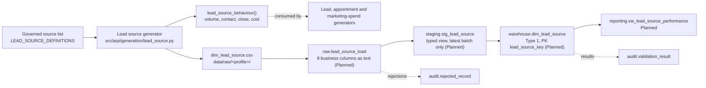

# STM-010 — Lead Source Dimension

## Header

| Field | Value |
|---|---|
| **Mapping ID** | `STM-010` |
| **Title** | Lead source dimension (Slowly Changing Dimension Type 1) |
| **Status** | **Implemented** (generator, column contract, data-quality suite). Ingestion, warehouse DDL and merge are **Planned**. |
| **Version** | 1.0 |
| **Date** | 2026-07-28 |
| **Owner** | Michael Palmer |
| **Source system** | `arpi_synthetic_generator` |
| **Target object** | `warehouse.dim_lead_source` |
| **Declared grain** | One row per normalised lead source. |
| **Phase** | Phase 1.4 (delivery increment `P1.4-01`) |
| **Intermediate objects** | `raw.lead_source_load`, `staging.stg_lead_source` (**Planned**) |
| **Downstream object** | `reporting.vw_lead_source_performance` (**Planned**) |

---

## 1. Purpose

`warehouse.dim_lead_source` normalises where an opportunity came from into a governed set of sources.

Ungoverned CRM source strings are the single most common reason dealership funnel reporting cannot be
trusted: one month of real CRM data will carry `Website`, `web site`, `WEBSITE FORM` and `Internet` as
four separate values for one channel, and every funnel measure built on them is wrong in a way nobody can
see. This dimension is where that is fixed **once**, so that close rate, cost per lead and response time
are comparable across the three fictional stores.

### 1.1 Every source name is fictional and generic

The governed list names channels — `Dealer Website Form`, `Third-Party Marketplace Listing`, `Paid Search
Non-Brand`, `Service Lane Opportunity` — and never a company. **No real lead vendor, marketplace or media
company is named anywhere in ARPI.**

This is not cosmetic. The generator attaches invented conversion rates and invented cost levels to every
source. Attaching invented commercial behaviour to a **named real company** would be a fabricated claim
about that company, which no portfolio dataset is entitled to make.

### 1.2 What this dimension deliberately does not contain

**No conversion rate. No cost. No volume weight.** Those four latents exist — they are what make sources
genuinely differ downstream — but they are generation *inputs* and are exposed only through a helper
(section 4.3). A close rate stored on a dimension row would be an assumption dressed as a measured fact,
and a report reading it would be reporting the generator's own inputs back to itself.

No personal data of any kind appears here: the entity describes channels, not people. `DQ-LDS-006`
enforces that against the **schema**, so a prohibited column fails the run even when it holds no values.

---

## 2. Lineage



**Ordered lineage statement**

1. The generator reads the fixed governed source list. It draws **no random numbers**: the list is
   reference data, so the dimension is identical under every profile and every `random_seed`.
2. Sources are ordered by `lead_source_id`, and `lead_source_key` is assigned as a **deterministic
   ordinal 1..N** over that order.
3. The nine dimension columns are emitted. The four latents on the same definition are **not** copied
   into the row.
4. Rows are written to `data/raw/<profile>/dim_lead_source.csv` — UTF-8, LF endings, header row,
   lowercase booleans, declared column order.
5. **Planned**: the CSV loads into `raw.lead_source_load`, all business columns as `text`, plus the five
   load-lineage columns.
6. **Planned**: `staging.stg_lead_source` casts to warehouse types and exposes only the most recent
   `load_batch_id`.
7. **Planned**: `warehouse.dim_lead_source` is loaded by **Type 1 upsert (MERGE) on `lead_source_id`**.

**The latent branch leaves at step 3 and never rejoins.** `lead_source_behaviour()` returns the four
generation inputs to the lead, appointment and marketing-spend generators. Nothing in the warehouse ever
reads them.

---

## 3. Mapping table

All 9 columns of `warehouse.dim_lead_source`, in declared order. **Every column is `NOT NULL`.**

| Source field | Source type | Target field | Target type | Transformation | Default behaviour | Validation | Rejection behaviour | Lineage field | Owner |
|---|---|---|---|---|---|---|---|---|---|
| `lead_source_key` | `text` | `lead_source_key` | `integer` PK | Cast to `integer`. Generator assigns it as a **deterministic ordinal 1..N over `lead_source_id` ascending**, so regeneration is stable. | `n/a — required` | PK not null and unique | `REJ-TYPE-001` if not castable; `REJ-KEY-001` on duplicate | `load_batch_id`, `source_row_number` | Lead source generator |
| `lead_source_id` | `text` | `lead_source_id` | `varchar(16)` U | Direct. Natural key, format `LDS-###`. | `n/a — required` | `DQ-LDS-001` unique | `REJ-NULL-001` if empty; `REJ-DOMAIN-001` if it does not match `LDS-###`; `REJ-KEY-001` on duplicate | `load_batch_id`, `source_row_number` | Lead source generator |
| `lead_source_name` | `text` | `lead_source_name` | `varchar(60)` U | Direct. **Generic, invented channel label — never a real company.** Allowlisted in the prohibited-field policy as a channel label rather than a person's name. | `n/a — required` | `DQ-LDS-002` unique | `REJ-NULL-001` if empty; `REJ-KEY-001` on duplicate | `load_batch_id` | Lead source generator |
| `source_category` | `text` | `source_category` | `varchar(30)` | Direct. Domain `Owned Digital` \| `Third Party` \| `Paid Search` \| `Paid Social` \| `Traditional Media` \| `Walk-in` \| `Referral` \| `Internal` \| `Organic Web`. All nine are represented. | `n/a — required` | `DQ-LDS-004` inside the enumeration | `REJ-DOMAIN-001` outside the enumeration | `load_batch_id` | Lead source generator |
| `is_paid` | `text` | `is_paid` | `boolean` | Cast lowercase `true`/`false` to `boolean`. True where the source carries media cost. **Cost per lead is undefined (NULL, not zero) where this is false.** | `n/a — required` | `DQ-LDS-005` with `is_internal` | `REJ-TYPE-001` if not `true`/`false`; `REJ-RULE-001` if a source is both internal and paid | `load_batch_id` | Lead source generator |
| `is_digital` | `text` | `is_digital` | `boolean` | Cast to `boolean`. Follows from the category: the five online categories are digital, the four offline and in-person ones are not. | `n/a — required` | Not null; agrees with `source_category` | `REJ-TYPE-001` if not `true`/`false`; `REJ-RULE-001` on disagreement with the category | `load_batch_id` | Lead source generator |
| `is_third_party` | `text` | `is_third_party` | `boolean` | Cast to `boolean`. True **exactly** for the `Third Party` category. | `n/a — required` | Not null; equals `source_category = 'Third Party'` | `REJ-TYPE-001` if not `true`/`false`; `REJ-RULE-001` on disagreement | `load_batch_id` | Lead source generator |
| `is_internal` | `text` | `is_internal` | `boolean` | Cast to `boolean`. True where the opportunity is generated inside the store — showroom floor, service drive, owner base. | `n/a — required` | `DQ-LDS-005`: **implies `NOT is_paid`** | `REJ-TYPE-001` if not `true`/`false`; `REJ-RULE-001` if also paid | `load_batch_id` | Lead source generator |
| `source_system` | `text` | `source_system` | `varchar(40)` | **Constant** `arpi_synthetic_generator`. Present on every row so no reviewer can mistake this data for a real CRM extract. | `n/a — constant` | Must equal `arpi_synthetic_generator` | `REJ-RULE-001` if any other value appears | itself | Lead source generator |
| *(database)* | — | `raw_record_id` | `bigserial` | Database-assigned. **Raw layer only.** | `n/a — database-assigned` | PK uniqueness | n/a | itself | Database |
| *(load process)* | — | `load_batch_id` | `uuid` | Assigned once per load. **Raw and staging layers only.** | `n/a — required` | Not null; unique per batch | `REJ-PARSE-001` if the batch cannot be initialised | itself | Loader |
| *(load process)* | — | `source_file_name` | `text` | Name of the source file. **Raw and staging layers only.** | `n/a — required` | Not null | n/a | itself | Loader |
| *(load process)* | — | `source_row_number` | `integer` | 1-based row number, excluding the header. **Raw and staging layers only.** | `n/a — required` | Not null; ≥ 1 | n/a | itself | Loader |
| *(database)* | — | `ingested_at` | `timestamptz` | Database `DEFAULT now()`. **Raw and staging layers only.** | `now()` | Not null | n/a | itself | Database |

> **Prohibited target fields.** Any personal name, contact detail, address, birth date, government or
> financial identifier, protected characteristic or free-form note. None exists at any layer, and
> `DQ-LDS-006` inspects the schema rather than the values, so an empty prohibited column still fails the
> run. `lead_source_name` passes only because it is explicitly allowlisted as a channel label with a
> written justification.

---

## 4. Derivation reference

### 4.1 The governed source list (authoritative)

Nineteen sources covering all nine categories. Flags are reference data, not draws.

| `lead_source_id` | `lead_source_name` | `source_category` | paid | digital | third party | internal |
|---|---|---|:--:|:--:|:--:|:--:|
| `LDS-001` | Dealer Website Form | Owned Digital | ✗ | ✓ | ✗ | ✗ |
| `LDS-002` | Dealer Website Chat | Owned Digital | ✗ | ✓ | ✗ | ✗ |
| `LDS-003` | Email Marketing Response | Owned Digital | ✓ | ✓ | ✗ | ✗ |
| `LDS-004` | Organic Search Landing | Organic Web | ✗ | ✓ | ✗ | ✗ |
| `LDS-005` | Direct Site Visit | Organic Web | ✗ | ✓ | ✗ | ✗ |
| `LDS-006` | Paid Search Brand | Paid Search | ✓ | ✓ | ✗ | ✗ |
| `LDS-007` | Paid Search Non-Brand | Paid Search | ✓ | ✓ | ✗ | ✗ |
| `LDS-008` | Paid Social Feed Campaign | Paid Social | ✓ | ✓ | ✗ | ✗ |
| `LDS-009` | Paid Social Video Campaign | Paid Social | ✓ | ✓ | ✗ | ✗ |
| `LDS-010` | Third-Party Marketplace Listing | Third Party | ✓ | ✓ | ✓ | ✗ |
| `LDS-011` | Third-Party Trade Valuation Portal | Third Party | ✓ | ✓ | ✓ | ✗ |
| `LDS-012` | Radio Spot Response | Traditional Media | ✓ | ✗ | ✗ | ✗ |
| `LDS-013` | Direct Mail Response | Traditional Media | ✓ | ✗ | ✗ | ✗ |
| `LDS-014` | Television Spot Response | Traditional Media | ✓ | ✗ | ✗ | ✗ |
| `LDS-015` | Showroom Walk-in | Walk-in | ✗ | ✗ | ✗ | ✓ |
| `LDS-016` | Customer Referral | Referral | ✗ | ✗ | ✗ | ✗ |
| `LDS-017` | Community Partner Referral | Referral | ✗ | ✗ | ✗ | ✗ |
| `LDS-018` | Service Lane Opportunity | Internal | ✗ | ✗ | ✗ | ✓ |
| `LDS-019` | Repeat Customer Outreach | Internal | ✗ | ✗ | ✗ | ✓ |

**`is_internal` means the opportunity originated on the premises or from the store's own owner base.** A
website form is owned digital rather than internal: the store owns the channel, but the shopper arrived
through it from outside. A referral is earned rather than internal, because the person doing the
referring is not the store.

### 4.2 Latent behaviour (generation inputs, never columns)

| `lead_source_id` | volume weight | contact rate | close rate | cost per lead |
|---|---:|---:|---:|---:|
| `LDS-001` | 0.14 | 0.82 | 0.11 | 0.00 |
| `LDS-002` | 0.06 | 0.88 | 0.09 | 0.00 |
| `LDS-003` | 0.04 | 0.72 | 0.08 | 6.00 |
| `LDS-004` | 0.05 | 0.78 | 0.10 | 0.00 |
| `LDS-005` | 0.03 | 0.75 | 0.09 | 0.00 |
| `LDS-006` | 0.07 | 0.80 | 0.12 | 28.00 |
| `LDS-007` | 0.09 | 0.74 | 0.08 | 46.00 |
| `LDS-008` | 0.05 | 0.62 | 0.05 | 34.00 |
| `LDS-009` | 0.03 | 0.58 | 0.04 | 39.00 |
| `LDS-010` | 0.13 | 0.68 | 0.07 | 24.00 |
| `LDS-011` | 0.05 | 0.70 | 0.09 | 31.00 |
| `LDS-012` | 0.02 | 0.66 | 0.07 | 52.00 |
| `LDS-013` | 0.03 | 0.64 | 0.09 | 41.00 |
| `LDS-014` | 0.02 | 0.60 | 0.06 | 68.00 |
| `LDS-015` | 0.09 | 1.00 | 0.24 | 0.00 |
| `LDS-016` | 0.04 | 0.92 | 0.26 | 0.00 |
| `LDS-017` | 0.02 | 0.86 | 0.18 | 0.00 |
| `LDS-018` | 0.03 | 0.90 | 0.15 | 0.00 |
| `LDS-019` | 0.01 | 0.85 | 0.17 | 0.00 |

The weights sum to `1.0`, asserted by a test. Every cost is a cent-quantized `Decimal`, exactly `0.00`
where the source is unpaid — a small non-zero placeholder would make cost per lead look defined where it
is not.

**The shape, and why it is not flat.** In-person and earned sources are low volume, cost nothing and
close several times better than purchased traffic; third-party marketplaces deliver high volume at a low
close rate; paid social is the most expensive traffic per closed unit. A flat set of rates would be a
prohibited synthetic pattern ([ARCHITECTURE.md §15.4](../../ARCHITECTURE.md)) and would make every
marketing comparison in the model vacuous. **These are modelling assumptions, not measurements.**

### 4.3 Helper contract for downstream generators

```python
lead_source_behaviour(lead_source_id: str) -> LeadSourceBehaviour
lead_source_behaviours() -> tuple[LeadSourceBehaviour, ...]
lead_source_definition(lead_source_id: str) -> LeadSourceDefinition
lead_source_key_for(lead_source_id: str) -> int
```

`LeadSourceBehaviour` carries `lead_source_id`, `volume_weight`, `contact_rate`, `close_rate` and
`cost_per_lead` — and nothing else. `lead_source_behaviours()` returns them ordered by identifier, ready
for a weighted draw:

```python
behaviours = lead_source_behaviours()
chosen = rng.choices(
    [item.lead_source_id for item in behaviours],
    weights=[item.volume_weight for item in behaviours],
    k=1,
)[0]
```

An unknown identifier raises `GenerationError` rather than returning a default, so a typo in a downstream
generator fails loudly instead of quietly producing a source nobody governs.

`TOTAL_LEAD_COUNT_BY_SCALE` lives in the same module — 200 (test), 6,000 (development), 55,000
(portfolio). It sits beside the volume weights because it is the other half of the same calibration: the
weights say how the funnel divides, that constant says how large it is.

---

## 5. Load strategy

| Layer | Strategy | Write semantics |
|---|---|---|
| CSV | Overwrite | The generator rewrites `data/raw/<profile>/dim_lead_source.csv` on each run. Byte-identical between runs, and identical between profiles. |
| `raw.lead_source_load` | **Truncate-and-reload per batch** (**Planned**) | Truncated and reloaded from the current CSV, then stamped with a fresh `load_batch_id`. |
| `staging.stg_lead_source` | **View** (`CREATE OR REPLACE VIEW`) (**Planned**) | No data written. Casts raw text to warehouse types and filters to the most recent `load_batch_id`. |
| `warehouse.dim_lead_source` | **Type 1 upsert (MERGE) on `lead_source_id`** (**Planned**) | Matched → update the attribute columns in place. Unmatched → insert. **Nothing is ever deleted**: a deleted source would orphan every lead that came through it. |

**Why Type 1 and not Type 2.** Reclassifying a source — deciding that a channel is third party after all
— is a **correction**, not a historical fact worth preserving. No ARPI question asks what category a
source was classified as last quarter. Promoting this dimension to Type 2 would require an ADR.

**Constraints to be enforced in the database — all `Planned`, because the DDL is owned by another agent
and does not exist yet:**

- `lead_source_id` UNIQUE, `lead_source_name` UNIQUE.
- `source_category` CHECK over the nine declared values.
- `CHECK (NOT is_internal OR NOT is_paid)` — the rule of section 4.1 in the database rather than only in
  the generator.
- Every column `NOT NULL`.

---

## 6. Idempotency guarantees

| Guarantee | Mechanism |
|---|---|
| Rerunning with unchanged source produces **no new warehouse rows** | Type 1 MERGE on `lead_source_id`: a matched row is updated in place, never duplicated (**Planned**). |
| `lead_source_key` is stable across regenerations | Deterministic ordinal 1..N over `lead_source_id` — no database sequence, no insertion-order dependence. |
| Rerunning produces a **byte-identical CSV** | Fixed reference data, deterministic ordinals and a fixed output format. Asserted by `tests/data_quality/test_lead_source_quality.py`. |
| Changing `random_seed` does not move a single value | The generator draws no random numbers. Asserted. |
| Generating lead sources cannot move another entity's digest | A dedicated `dim_lead_source` namespace is declared, and no shared stream is consumed. Asserted against `dim_date`, `dim_dealership`, `dim_employee` and `dim_customer`. |
| Verifiable by a third party | `content_digest` in `generation_manifest.json` is the SHA-256 of the CSV bytes. |

---

## 7. Rejection handling

| Condition | `REJ-*` code | Outcome |
|---|---|---|
| A CSV row cannot be parsed | `REJ-PARSE-001` | Row rejected; run fails |
| The CSV header does not match the 9 declared columns, in order | `REJ-SCHEMA-001` | Load aborts before any row is processed; run fails. Also caught pre-load by `DQ-LDS-003`. |
| **A prohibited PII column is present in the schema** | `REJ-SCHEMA-001` | Load aborts; run fails. Detected by `DQ-LDS-006`, which inspects the schema rather than the values. |
| A value cannot be cast to its warehouse type | `REJ-TYPE-001` | Row rejected; run fails |
| Any field is NULL or empty | `REJ-NULL-001` | Row rejected; run fails — every column is `NOT NULL` |
| `lead_source_id` does not match `LDS-###`, or `source_category` is outside its domain | `REJ-DOMAIN-001` | Row rejected; run fails. Detected by `DQ-LDS-004`. |
| Duplicate `lead_source_key`, `lead_source_id` or `lead_source_name` | `REJ-KEY-001` | Later row rejected; run fails. Detected by `DQ-LDS-001` and `DQ-LDS-002`. |
| A source is both `is_internal` and `is_paid` | `REJ-RULE-001` | Row rejected; run fails. Detected by `DQ-LDS-005`. |
| `is_digital` or `is_third_party` disagrees with `source_category` | `REJ-RULE-001` | Row rejected; run fails |

Every rejection writes a row to `audit.rejected_record` with `source_entity = 'dim_lead_source'`,
`source_record_key` = the offending `lead_source_id` where identifiable, the code, a human-readable
reason, and the `record_payload`. The payload is passed through
`arpi.validation.privacy.redact_payload()` first: nothing personal should ever reach this path, and the
rejection path is exactly where an unexpected value would first be written to disk. **Fail closed.**

> **Phase 1 rejection tolerance is zero.** `validation.max_rejected_record_ratio = 0.0`.

---

## 8. Validation checks gating the load

| Check ID | Assertion | Category | Severity | Gate |
|---|---|---|---|---|
| `DQ-LDS-003` | The generated frame's schema matches the declared 9-column contract — names, order and count | `structural` | critical | Pre-load |
| `DQ-LDS-006` | **No prohibited personal-data column is present** — inspects the schema, so an empty prohibited column still fails | `privacy` | critical | Pre-load **and** post-load |
| `DQ-LDS-001` | `lead_source_id` is unique | `uniqueness` | critical | Pre-load **and** post-load |
| `DQ-LDS-002` | `lead_source_name` is unique | `uniqueness` | critical | Pre-load **and** post-load |
| `DQ-LDS-004` | `source_category` is inside the nine-value enumeration | `business_rule` | critical | Pre-load **and** post-load |
| `DQ-LDS-005` | **`is_internal` implies `NOT is_paid`** | `business_rule` | critical | Pre-load **and** post-load |

Cross-entity checks that also apply: `DQ-GEN-001` (schema matches) and `DQ-GEN-002` (determinism digest).

**All six are `critical`.** Any failure sets `audit.pipeline_run.status = 'failed'` and increments
`critical_failure_count`. Each identifier is declared once, in `src/arpi/generation/lead_source.py`, and
registered at import time with `arpi.validation.registry.register_checks()`. Their `layer` is `python`:
the SQL implementations arrive with the DDL and are **Planned**.

---

## 9. Reconciliations

| Reconciliation ID | Description | Left | Right | Tolerance | Status |
|---|---|---|---|---|---|
| `RECON-DIM-LEAD-SOURCE-ROWCOUNT` | Generated `dim_lead_source` rows equal `warehouse.dim_lead_source` rows after the merge | `generator:dim_lead_source` row count | `warehouse.dim_lead_source` `count(*)` | 0 (exact) | **Planned** |

Because the history policy is Type 1, generated rows and warehouse rows stay equal indefinitely. Expected
count: **19 at every scale**.

---

## 10. Open questions and known gaps

- **The warehouse table does not exist yet.** The generator, contract, data-quality suite and this
  mapping are Implemented; `sql/03_dimensions/06_dim_lead_source.sql` and its merge are **Planned** and
  owned by another agent. Everything in sections 5 and 7 that touches the database is a specification,
  not a description of running code.
- **The latents are assumptions, not measurements.** The conversion and cost figures in section 4.2 are
  plausible for the segment `docs/research.md` describes, and they are internally consistent — but they
  are invented. Nothing in ARPI should be read as evidence about how any real channel performs.
- **The flags cannot yet be checked against behaviour.** `DQ-LDS-005` asserts the internal-versus-paid
  rule structurally. Asserting that paid sources actually cost money in the fact data requires
  `fact_marketing_spend` and `fact_lead` to be joined, which is `DQ-REF-*` work owned by the agent
  building the cross-object checks.
- **No source-hierarchy dimension exists.** `source_category` is a flat attribute rather than a parent
  dimension. A two-level hierarchy would be justified only if the marketing page needed drill-through
  between them; it does not, and adding one now would change every content digest for no analytical gain.
- **The list does not grow over time.** Real dealer groups add and retire sources; ARPI's list is fixed
  for the whole reporting window. Modelling source churn would need Type 2 history, which section 5
  explains is deliberately not the policy here.
