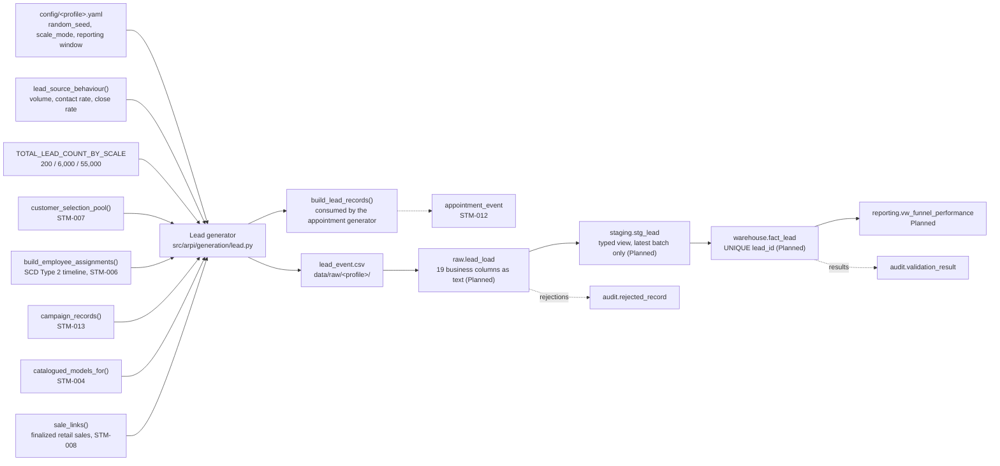

# STM-011 — Lead Fact

## Header

| Field | Value |
|---|---|
| **Mapping ID** | `STM-011` |
| **Title** | CRM lead (transactional fact) |
| **Status** | **Implemented** (source generator, column contract, data-quality suite). The raw table, the staging view and `warehouse.fact_lead` are **Planned** and owned by another agent — **no row has been loaded, and no fact load script exists.** |
| **Version** | 1.0 |
| **Date** | 2026-07-28 |
| **Owner** | Michael Palmer |
| **Source system** | `arpi_synthetic_generator` |
| **Source entity** | `lead_event` (`src/arpi/generation/lead.py`) |
| **Target object** | `warehouse.fact_lead` |
| **Declared grain** | **One row per unique CRM lead.** |
| **Phase** | Phase 1.4 (delivery increment `P1.4-02`) |
| **Intermediate objects** | `raw.lead_load`, `staging.stg_lead` (**Planned**) |
| **Downstream objects** | `warehouse.fact_appointment` ([STM-012](STM-012-fact-appointment.md)); `reporting.vw_funnel_performance` (**Planned**); the eight funnel KPIs (**Planned**) |

---

## 1. Purpose

`warehouse.fact_lead` is the top of the sales funnel: every opportunity the three fictional stores
recorded, what was done with it, and whether it became a car.

Eight of the twenty-nine specified KPIs read this fact. It is also where two governance rules stop being
decorative and start being load-bearing.

### 1.1 The property this mapping exists to protect: NULL is not zero

A lead that was **never responded to** carries `first_response_seconds = NULL`. It never carries `0`.

Zero would mean the store answered *instantaneously*, which is the exact opposite of what happened.
Averaging those zeros into a response-time measure makes the stores that ignore leads look like the
fastest stores in the group — and because the number moves in the flattering direction, nobody
investigates it. This is the single most common way dealership response-time reporting goes wrong.

So the encoding is enforced rather than assumed:

| Situation | `first_response_seconds` | `is_contacted` |
|---|---|---|
| Nobody ever responded | `NULL` | `false` |
| Somebody responded | integer ≥ 30 | drawn, influenced by the response time |

`DQ-LED-004` asserts all three halves of that: no response time is zero or negative, a genuine
never-responded population exists, and every contacted lead has a response time.

### 1.2 The second property: the median is materially below the mean

Response times are drawn from a lognormal, so the distribution is **right-skewed**. A handful of leads
answered two days later drag the average far above the typical experience. Reporting the mean alone is
therefore misleading here in the same way it is misleading in a real store, which is what makes the
mean-versus-median rule in [KPI_CATALOG.md](../../KPI_CATALOG.md) worth stating. `DQ-LED-008` asserts
the direction and a band, never a point value.

### 1.3 No communication content of any kind

A real CRM lead record is mostly *text about a person*: the message they sent, the transcript of the
call, the note the salesperson typed. **None of it exists here, at any layer.** There is no
`message_body`, no `transcript`, no `recording`, no `note`, no `comment` and no free-text field of any
kind. `DQ-LED-007` inspects the **schema**, so a prohibited column fails the run even when it holds no
values — that is intended behaviour, not an inconvenience.

---

## 2. Lineage



**Ordered lineage statement**

1. The generator seeds a dedicated `lead_event` random stream from `random_seed`, so generating leads
   cannot move any other entity's content digest.
2. `TOTAL_LEAD_COUNT_BY_SCALE` — the same constant the marketing-spend generator calibrates against —
   fixes the population size. Arrival dates are drawn across the reporting window weighted by a
   month-of-year shape and a day-of-week shape.
3. Each lead draws a governed source (weighted by `volume_weight`), a store, and an owning employee
   resolved against the **SCD Type 2 employee timeline** on the arrival date. A share of leads are
   deliberately left unowned.
4. The response is drawn: first whether there was one at all, then — only if there was — how long it
   took. **The never-responded branch produces `NULL`, never a number.**
5. Contact, appointment set and appointment shown are drawn in that order, each conditioned on the
   previous stage, so the funnel nests by construction.
6. **Finalized retail sales are attributed to leads.** Each retail sale from `sale_links()` is offered
   to the eligible leads at its own store; the winner takes the sale's `sale_id`, its `customer_id` and
   its `vehicle_model_id`. Only retail sales carry a customer, so only retail sales are linkable — that
   is intended, because a wholesale unit went to the auction and no shopper ever sat at a desk for it.
7. Remaining leads receive a shopper (or stay anonymous), a model of interest, a campaign, and — for a
   modelled share — the duplicate flag and its original reference.
8. Leads are ordered by arrival and `lead_id` is assigned as a deterministic ordinal `LED-#########`.
9. Rows are written to `data/raw/<profile>/lead_event.csv` — UTF-8, LF endings, header row, lowercase
   booleans, ISO dates, empty field for NULL, declared column order.
10. **Planned**: the CSV loads into `raw.lead_load`, all business columns as `text`, plus the five
    load-lineage columns.
11. **Planned**: `staging.stg_lead` casts to warehouse types, filters to the most recent
    `load_batch_id`, and resolves the natural identifiers into surrogate keys.
12. **Planned**: `warehouse.fact_lead` is loaded **insert-only, keyed on `lead_id`**.

---

## 3. Mapping table

All 19 columns of the `lead_event` source entity, in declared order, against
`warehouse.fact_lead`. The source entity carries **natural identifiers and real dates**; the fact
carries surrogate keys and date keys, and the staging view is where the two meet.

| Source field | Source type | Target field | Target type | Transformation | Default behaviour | Validation | Rejection behaviour | Lineage field | Owner |
|---|---|---|---|---|---|---|---|---|---|
| *(load process)* | — | `lead_key` | `bigint` PK | Database-assigned surrogate. **Planned.** | `n/a — database-assigned` | PK not null and unique | `REJ-KEY-001` on duplicate | `load_batch_id` | Loader |
| `lead_id` | `text` | `lead_id` | `varchar(20)` NN U | Direct. Natural key, format `LED-#########`, assigned as a deterministic ordinal over arrival order. | `n/a — required` | `DQ-LED-001` unique | `REJ-NULL-001` if empty; `REJ-DOMAIN-001` if it does not match `LED-#########`; `REJ-KEY-001` on duplicate | `load_batch_id`, `source_row_number` | Lead generator |
| `lead_created_date` | `text` | `lead_created_date_key` | `integer` NN | Parse ISO date, then encode as `YYYYMMDD`. Always inside the reporting window, so it always resolves in `dim_date`. | `n/a — required` | FK to `dim_date`; inside the reporting window | `REJ-TYPE-001` if not a date; `REJ-REF-001` if it does not resolve | `load_batch_id` | Lead generator |
| `dealership_id` | `text` | `dealership_key` | `integer` NN | Resolve `GSA-00N` against `dim_dealership`. | `n/a — required` | FK resolves | `REJ-REF-001` if it does not resolve | `load_batch_id` | Lead generator |
| `customer_id` | `text` | `customer_key` | `integer` NULL | Resolve `CUS-########` against **the one governed `dim_customer`** — the same dimension `fact_vehicle_sale` uses. **NULL is a modelled fact**: an anonymous enquiry never identifies the shopper, and the generator must not invent one. | `NULL — anonymous enquiry` | FK resolves where populated; `first_interaction_date <= lead_created_date` | `REJ-REF-001` if a populated value does not resolve | `load_batch_id` | Lead generator |
| `vehicle_model_id` | `text` | `vehicle_model_key` | `integer` NULL | Resolve `VMD-#####` against `dim_vehicle_model`. NULL where the shopper named no unit. On a sold lead this is **the model that was actually sold**, carried from the deal. | `NULL — no model named` | FK resolves where populated | `REJ-REF-001` if a populated value does not resolve | `load_batch_id` | Lead generator |
| `lead_source_id` | `text` | `lead_source_key` | `integer` NN | Resolve `LDS-###` against `dim_lead_source`. All nineteen governed sources are represented. | `n/a — required` | FK resolves; `DQ-LDS-001` upstream | `REJ-REF-001` if it does not resolve | `load_batch_id` | Lead generator |
| `campaign_id` | `text` | `campaign_key` | `integer` NULL | Resolve `CMP-#####` against `dim_marketing_campaign`. NULL where the source is unpaid, no campaign was running, or attribution simply failed — all three are real. | `NULL — unattributed` | FK resolves where populated; the campaign was active on `lead_created_date`, buys the same source, and is funded by the same store | `REJ-REF-001` if a populated value does not resolve; `REJ-RULE-001` if the campaign was not running that day | `load_batch_id` | Lead generator |
| `assigned_employee_id` | `text` | `assigned_employee_key` | `integer` NULL | Resolve `EMP-#####` against `dim_employee` **as of `lead_created_date`**, so a lead is never assigned to somebody at a store they had not joined. NULL where nobody owned the lead — a real and consequential case. | `NULL — unowned lead` | FK resolves where populated; the person held an eligible role at that store on that date | `REJ-REF-001` if a populated value does not resolve; `REJ-RULE-001` on a role or store mismatch | `load_batch_id` | Lead generator |
| `sale_id` | `text` | `sale_key` | `bigint` NULL | Resolve `SLE-########` against `fact_vehicle_sale`. Populated **exactly when** `is_sold` is true. | `NULL — did not sell` | `DQ-LED-005`: resolves to a finalized **retail** sale at the same store, for the same customer, struck on or after the lead arrived | `REJ-REF-001` if unresolvable; `REJ-RULE-001` if the sale predates the lead or belongs to another store or shopper | `load_batch_id` | Lead generator |
| `lead_count` | `text` | `lead_count` | `smallint` NN | Cast to `smallint`. **Constant `1`** — the additive unit measure at this grain. | `1 — constant` | CHECK `lead_count = 1` | `REJ-RULE-001` if any other value appears | `load_batch_id` | Lead generator |
| `first_response_seconds` | `text` | `first_response_seconds` | `integer` NULL | Cast to `integer`. **Empty field becomes NULL, and NULL means nobody ever responded.** It must never be coerced to `0`, and a loader that fills NULLs with zero is a defect, not a convenience. | `NULL — never responded` | `DQ-LED-004`; CHECK `first_response_seconds IS NULL OR first_response_seconds >= 0` | `REJ-TYPE-001` if not castable; `REJ-RULE-001` if negative | `load_batch_id` | Lead generator |
| `is_contacted` | `text` | `is_contacted` | `boolean` NN | Cast lowercase `true`/`false`. False on every never-responded lead: nobody can make contact without a response. | `n/a — required` | `DQ-LED-003`; `DQ-LED-004` | `REJ-TYPE-001` if not `true`/`false` | `load_batch_id` | Lead generator |
| `is_appointment_set` | `text` | `is_appointment_set` | `boolean` NN | Cast to `boolean`. **Implies `is_contacted`.** | `n/a — required` | `DQ-LED-003`; CHECK `NOT is_contacted ⇒ NOT is_appointment_set` | `REJ-TYPE-001`; `REJ-RULE-001` on a broken implication | `load_batch_id` | Lead generator |
| `is_appointment_shown` | `text` | `is_appointment_shown` | `boolean` NN | Cast to `boolean`. **Implies `is_appointment_set`.** Agrees row-for-row with `fact_appointment`: a lead flagged shown has exactly one shown appointment. | `n/a — required` | `DQ-LED-003`; CHECK `NOT is_appointment_set ⇒ NOT is_appointment_shown` | `REJ-TYPE-001`; `REJ-RULE-001` on a broken implication | `load_batch_id` | Lead generator |
| `is_sold` | `text` | `is_sold` | `boolean` NN | Cast to `boolean`. **Derived from the presence of a sale reference**, never drawn separately. | `n/a — required` | `DQ-LED-003`; CHECK `is_sold ⇒ sale_key IS NOT NULL` | `REJ-TYPE-001`; `REJ-RULE-001` if it disagrees with the sale reference | `load_batch_id` | Lead generator |
| `is_duplicate` | `text` | `is_duplicate` | `boolean` NN | Cast to `boolean`. True where the same shopper enquired again at the same store inside 60 days. **Excluded from every funnel numerator and denominator** — see section 4.4. | `n/a — required` | `DQ-LED-006` | `REJ-TYPE-001` if not `true`/`false` | `load_batch_id` | Lead generator |
| `original_lead_id` | `text` | `original_lead_id` | `varchar(20)` NULL | Direct. Populated **exactly when** `is_duplicate` is true, and always points at an earlier lead that is **not itself a duplicate**, so following it is a single hop rather than a chain. | `NULL — not a duplicate` | `DQ-LED-006`: resolves, and resolves to a non-duplicate | `REJ-REF-001` if unresolvable; `REJ-RULE-001` if present on a non-duplicate or absent on a duplicate | `load_batch_id` | Lead generator |
| `days_to_sale` | `text` | `days_to_sale` | `integer` NULL | Cast to `integer`. Derived as `sale_date - lead_created_date`, so it is never negative. NULL exactly when the lead did not sell. | `NULL — did not sell` | CHECK `days_to_sale IS NULL OR days_to_sale >= 0`; NULL iff `sale_key IS NULL` | `REJ-RULE-001` if negative, or present without a sale | `load_batch_id` | Lead generator |
| `source_system` | `text` | `source_system` | `varchar(40)` NN | **Constant** `arpi_synthetic_generator`. Present on every row so no reviewer can mistake this for a real CRM extract. | `n/a — constant` | Must equal `arpi_synthetic_generator` | `REJ-RULE-001` if any other value appears | itself | Lead generator |
| *(database)* | — | `raw_record_id` | `bigserial` | Database-assigned. **Raw layer only.** | `n/a — database-assigned` | PK uniqueness | n/a | itself | Database |
| *(load process)* | — | `load_batch_id` | `uuid` | Assigned once per load. **Raw and staging layers only.** | `n/a — required` | Not null | `REJ-PARSE-001` if the batch cannot be initialised | itself | Loader |
| *(load process)* | — | `source_file_name` | `text` | Name of the source file. **Raw and staging layers only.** | `n/a — required` | Not null | n/a | itself | Loader |
| *(load process)* | — | `source_row_number` | `integer` | 1-based row number, excluding the header. **Raw and staging layers only.** | `n/a — required` | Not null; ≥ 1 | n/a | itself | Loader |
| *(database)* | — | `ingested_at` | `timestamptz` | Database `DEFAULT now()`. **Raw and staging layers only.** | `now()` | Not null | n/a | itself | Database |

> **Prohibited target fields.** Any personal name, contact detail, address, birth date, government or
> financial identifier, protected characteristic — **and any communication content whatsoever**:
> `message_body`, `message`, `subject`, `transcript`, `recording`, `call_recording`, `note`, `notes`,
> `comment`, `comments`, `chat_log`, `voicemail`. None exists at any layer. `DQ-LED-007` inspects the
> schema rather than the values, so an empty `message_body` column still fails the run.

---

## 4. Derivation reference

### 4.1 Response time, and the two things it must never be

The response is drawn in two steps, and the order matters.

**Step one: was there a response at all?** The probability is the source's `contact_rate` latent plus
`RESPONSE_UPLIFT_OVER_CONTACT` (0.14) — responding is the store's decision, whereas making contact needs
the shopper too — scaled by the owner's normalised CRM discipline, or by
`UNASSIGNED_RESPONSE_FACTOR` (0.45) when nobody owns the lead. A lead nobody owns is a lead nobody
answers, and that is modelled rather than asserted.

**Step two, only if the answer to step one was yes: how long did it take?** A lognormal draw with
median 1,500 seconds and `sigma = 1.35`, multiplied by

* a per-source factor `(0.80 / contact_rate) ** 2` — sources that are worse at making contact are also
  slower to try, so one latent drives both;
* a day-of-week factor, peaking at **2.10 on a Sunday**: the showroom is shut, the website is not, and
  the Sunday enquiry is the one that waits for Monday morning;
* the inverse of the owner's CRM discipline, and `UNASSIGNED_RESPONSE_DELAY` (3.5) when unowned;

then clamped into `[30, 259200]` seconds. The floor exists because **no human answers in zero seconds**,
so a genuine response can never round down onto the value that means "never responded".

### 4.2 Response time influences contact; it does not decide it

`response_time_influence(seconds)` returns

```
clamp(1.26 - 0.17 * log10(1 + minutes), 0.52, 1.26)
```

which multiplies the source's contact rate. The shape is logarithmic because the difference between four
minutes and forty matters far more than the difference between two days and three. **The lower bound is
0.52, well above zero**: a slow response reduces the odds of contact, it never makes contact impossible.
A test asserts the direction across response-time quartiles *and* that neither the fastest nor the
slowest quartile is all-or-nothing, so the residual variance is provably retained.

### 4.3 Sale attribution

`SALE_ATTRIBUTION_SHARE` is **0.72**: roughly seven finalized retail deals in ten are attributable to a
CRM lead. Pretending it were 1.0 would make lead-to-sale conversion look like a complete picture of the
store, which it is not — plenty of deals are written without a lead record ever existing.

Each eligible sale is offered to the leads that

* belong to the same store,
* arrived on or before the sale date and inside `MAXIMUM_DAYS_TO_SALE` (120 days) of it,
* were contacted,
* are not already credited with a deal,
* and whose buyer had already interacted with the group by the day the lead arrived.

The winner is drawn **weighted** by the source's `close_rate`, the owner's closing-rate index, and the
funnel stage the lead reached: `1.0` for no appointment, `1.7` for one set, **`4.2` for one shown**. That
weighting is what makes "appointment-shown leads convert at a higher rate" true *in the data* rather than
asserted in prose — and it stays probabilistic, because a lead that never booked can still buy.

The sale then supplies the lead's `customer_id` and `vehicle_model_id`, so a sold lead can never disagree
with the deal it claims.

### 4.4 Duplicates, and where they are excluded

`DUPLICATE_SHARE` is **0.08**. A duplicate is **constructed** rather than discovered: the generator
deliberately reuses a shopper who enquired at the same store inside the last 60 days, which is exactly
what a duplicate is. Waiting for two independent draws to collide on one customer instead would make the
duplicate share a function of the customer-population size and the window length, so it would collapse at
portfolio scale and the exclusion rule would go untested there.

**Where the numerator and denominator are defined:** `arpi.generation.lead.funnel_population(frame)`.
Every funnel measure in ARPI is

* **numerator** — rows of that population whose stage flag is true;
* **denominator** — rows of that population.

**Duplicate leads are excluded from both.** Leaving them in the denominator understates every conversion
rate, because the same shopper counts twice as an opportunity. Leaving them in the numerator
double-counts one opportunity's outcome. There is no measure for which including them is correct, so
they are removed **once, in that one function**, rather than filtered ad hoc by each consumer. A test
asserts that excluding them raises every conversion rate, which is the whole point.

A lead credited with a sale is **never** marked a duplicate, because excluding it would drop a real sale
out of the numerator.

### 4.5 Arrival shape

Month weights range from 0.88 (January) to 1.18 (May); shopping intent leads deliveries, so the monthly
shape is close to — deliberately not identical to — the sale shape. Day-of-week weights run 1.12 (Monday)
down to 0.78 (Sunday). **Sunday is not near zero**, unlike the sale fact: the showroom is shut but the
website is not.

### 4.6 Measured behaviour

Generated with the profile-pinned seed. **These are measurements of the `test` and `development`
profiles only. No portfolio-scale run is claimed**; the portfolio row count below is the declared scale
constant, not an observation.

| | test | development | portfolio |
|---|---:|---:|---:|
| Leads | 200 | 6,000 | 55,000 *(declared)* |
| Never-responded share | 0.215 | 0.113 | — |
| Median response (s) | 1,630 | 1,714 | — |
| Mean response (s) | 4,273 | 4,707 | — |
| Mean ÷ median | 2.62 | 2.75 | — |
| Duplicate share | 0.085 | 0.077 | — |
| Contact rate *(non-duplicate)* | 0.612 | 0.719 | — |
| Appointment set *(non-duplicate)* | 0.284 | 0.266 | — |
| Appointment shown *(non-duplicate)* | 0.137 | 0.175 | — |
| Lead-to-sale conversion *(non-duplicate)* | 0.115 | 0.072 | — |
| Anonymous share | 0.095 | 0.096 | — |

The `test` profile's never-responded share is roughly twice the `development` profile's. That is not
noise: its twelve-person roster genuinely draws a lower average CRM discipline than the thirty-person
one, and response probability is scaled by it. A small store answering fewer leads is a real effect, not
a defect, which is why the check is a band rather than a point value.

---

## 5. Load strategy

| Layer | Strategy | Write semantics |
|---|---|---|
| CSV | Overwrite | The generator rewrites `data/raw/<profile>/lead_event.csv` on each run. Byte-identical between runs at the same seed. |
| `raw.lead_load` | **Truncate-and-reload per batch** (**Planned**) | Truncated and reloaded from the current CSV, then stamped with a fresh `load_batch_id`. |
| `staging.stg_lead` | **View** (`CREATE OR REPLACE VIEW`) (**Planned**) | No data written. Casts raw text to warehouse types, filters to the most recent `load_batch_id`, and resolves natural identifiers into surrogate keys. |
| `warehouse.fact_lead` | **Insert-only, keyed on `lead_id`** (**Planned**) | A lead already present is skipped, not duplicated. A restated lead is handled by deleting that `lead_id` and reinserting it. |

**Constraints to be enforced in the database — all `Planned`, because the DDL is owned by another agent
and does not exist yet:**

- `lead_id` UNIQUE — the grain constraint.
- `CHECK (lead_count = 1)`.
- `CHECK (first_response_seconds IS NULL OR first_response_seconds >= 0)`.
- `CHECK (is_contacted OR NOT is_appointment_set)`.
- `CHECK (is_appointment_set OR NOT is_appointment_shown)`.
- `CHECK (NOT is_sold OR sale_key IS NOT NULL)`.
- `CHECK (days_to_sale IS NULL OR days_to_sale >= 0)`.
- Foreign keys on `lead_created_date_key`, `dealership_key`, `customer_key`, `vehicle_model_key`,
  `lead_source_key`, `campaign_key`, `assigned_employee_key` and `sale_key`.

> **No `NOT NULL DEFAULT 0` on `first_response_seconds`, ever.** That single piece of DDL would silently
> destroy the distinction section 1.1 exists to protect, and it would do so in a way no report could
> detect afterwards.

---

## 6. Idempotency guarantees

| Guarantee | Mechanism |
|---|---|
| Rerunning with unchanged source produces **no new fact rows** | Insert-only keyed on `lead_id`; an existing lead is skipped (**Planned**). |
| `lead_id` is stable across regenerations | Deterministic ordinal over arrival order — no database sequence, no insertion-order dependence. |
| Rerunning produces a **byte-identical CSV** | A dedicated seeding namespace, a fixed draw order and a fixed output format. Asserted by `tests/data_quality/test_lead_quality.py`. |
| Generating leads cannot move another entity's digest | One namespace per entity. Asserted against `dim_date`, `dim_dealership`, `dim_employee`, `dim_customer`, `dim_lead_source` and `dim_marketing_campaign`. |
| Generating appointments cannot move the lead digest | The appointment generator reads lead records and draws from its own namespace. Asserted. |
| Verifiable by a third party | `content_digest` in `generation_manifest.json` is the SHA-256 of the CSV bytes. |

---

## 7. Rejection handling

| Condition | `REJ-*` code | Outcome |
|---|---|---|
| A CSV row cannot be parsed | `REJ-PARSE-001` | Row rejected; run fails |
| The CSV header does not match the 19 declared columns, in order | `REJ-SCHEMA-001` | Load aborts before any row is processed; run fails. Also caught pre-load by `DQ-LED-002`. |
| **A prohibited PII or communication-content column is present in the schema** | `REJ-SCHEMA-001` | Load aborts; run fails. Detected by `DQ-LED-007`, which inspects the schema rather than the values. |
| A value cannot be cast to its warehouse type | `REJ-TYPE-001` | Row rejected; run fails |
| A `NOT NULL` field is empty | `REJ-NULL-001` | Row rejected; run fails |
| `lead_id` does not match `LED-#########` | `REJ-DOMAIN-001` | Row rejected; run fails |
| Duplicate `lead_id` | `REJ-KEY-001` | Later row rejected; run fails. Detected by `DQ-LED-001`. |
| A populated foreign key does not resolve | `REJ-REF-001` | Row rejected; run fails. Detected by `DQ-LED-005` for the sale reference and `DQ-LED-006` for the duplicate reference. |
| The funnel implication chain is broken | `REJ-RULE-001` | Row rejected; run fails. Detected by `DQ-LED-003`. |
| `first_response_seconds` is negative, **or zero on a lead that was never responded to** | `REJ-RULE-001` | Row rejected; run fails. Detected by `DQ-LED-004`. |
| `is_duplicate` without `original_lead_id`, or the reverse | `REJ-RULE-001` | Row rejected; run fails. Detected by `DQ-LED-006`. |
| A campaign that was not running on the lead date | `REJ-RULE-001` | Row rejected; run fails |

Every rejection writes a row to `audit.rejected_record` with `source_entity = 'lead_event'`,
`source_record_key` = the offending `lead_id` where identifiable, the code, a human-readable reason, and
the `record_payload`. The payload is passed through `arpi.validation.privacy.redact_payload()` first.
**Fail closed.**

> **Phase 1 rejection tolerance is zero.** `validation.max_rejected_record_ratio = 0.0`.

---

## 8. Validation checks gating the load

| Check ID | Assertion | Category | Severity | Gate |
|---|---|---|---|---|
| `DQ-LED-002` | The generated frame's schema matches the declared 19-column contract — names, order and count | `structural` | critical | Pre-load |
| `DQ-LED-007` | **No prohibited personal-data or communication-content column is present** — inspects the schema, so an empty prohibited column still fails | `privacy` | critical | Pre-load **and** post-load |
| `DQ-LED-001` | `lead_id` is unique | `uniqueness` | critical | Pre-load **and** post-load |
| `DQ-LED-003` | **The funnel implication chain holds**: not contacted ⇒ not appointment-set; not appointment-set ⇒ not shown; sold ⇒ a sale reference, and a sale reference ⇒ sold | `business_rule` | critical | Pre-load **and** post-load |
| `DQ-LED-004` | **Never-responded leads carry NULL, never zero**; no response time is zero or negative; a genuine never-responded population exists; every contacted lead has a response time | `completeness` | critical | Pre-load **and** post-load |
| `DQ-LED-005` | Every sold lead resolves to a finalized **retail** sale at the same store, for the same shopper, struck on or after the lead arrived | `referential` | critical | Pre-load **and** post-load |
| `DQ-LED-006` | Duplicates carry a resolvable `original_lead_id` that points at an earlier **non-duplicate** lead | `business_rule` | critical | Pre-load **and** post-load |
| `DQ-LED-008` | The response-time distribution is **right-skewed**: mean ÷ median inside `[1.40, 4.50]` | `business_rule` | warning | Pre-load |

Cross-entity checks that also apply: `DQ-GEN-001` (schema matches) and `DQ-GEN-002` (determinism digest).

**Seven of the eight are `critical`.** Any critical failure sets `audit.pipeline_run.status = 'failed'`
and increments `critical_failure_count`. `DQ-LED-008` is a `warning` because the exact skew ratio is a
modelling choice — its *absence*, however, is a defect, which is why it is checked at all. Each
identifier is declared once, in `src/arpi/generation/lead.py`, and registered at import time with
`arpi.validation.registry.register_checks()`. Their `layer` is `python`: the SQL implementations arrive
with the DDL and are **Planned**.

---

## 9. Reconciliations

| Reconciliation ID | Description | Left | Right | Tolerance | Status |
|---|---|---|---|---|---|
| `RECON-FACT-LEAD-ROWCOUNT` | Generated `lead_event` rows equal `warehouse.fact_lead` rows after the load | `generator:lead_event` row count | `warehouse.fact_lead` `count(*)` | 0 (exact) | **Planned** |
| `RECON-FACT-LEAD-SOLD` | Sold leads equal the distinct sales they resolve to | `count(*) WHERE is_sold` | `count(DISTINCT sale_key) WHERE is_sold` | 0 (exact) | **Planned** |
| `RECON-FUNNEL-LEAD-APPOINTMENT` | Leads flagged appointment-shown equal leads with exactly one shown appointment | `fact_lead WHERE is_appointment_shown` | `fact_appointment WHERE is_shown`, distinct `lead_key` | 0 (exact) | **Planned** (`P1.4-05`) |
| `RECON-VENDOR-VERSUS-CRM` | Vendor-reported leads exceed the CRM count, per campaign-month | `fact_marketing_spend.vendor_reported_leads` | `fact_lead` count by campaign-month | Directional | **Planned** (`P1.4-05`) |

---

## 10. Open questions and known gaps

- **The warehouse table does not exist yet.** The generator, contract, data-quality suite and this
  mapping are Implemented; `sql/04_facts/02_fact_lead.sql`, the raw table, the staging view and the load
  are **Planned** and owned by another agent. Everything in sections 5 and 7 that touches the database is
  a specification, not a description of running code.
- **`fact_vehicle_sale.lead_source_key` is still unpopulated.** Attribution is made here, on the lead,
  so the sale fact's column stays NULL until a `P1.4` follow-up joins the two. Two independent
  attributions would mean two sources of truth for one relationship.
- **No lead-activity grain exists.** Every call, email and text on a lead is a separate event in a real
  CRM. ARPI models the *first response only*, and `warehouse.fact_lead_activity` remains
  **Out of scope** for Phase 1 (DATA_DICTIONARY §27.6). The consequence is honest but real: no
  measure of working cadence, follow-up count or time-to-second-touch is computable.
- **Contact is impossible without a response, by construction.** A shopper who submits a form, is
  ignored, and walks in anyway would in a real CRM often be logged as contact on the same lead. Here that
  arrival is a separate lead. The rule keeps the funnel coherent, and it means `is_contacted` is a
  slightly stricter measure than some CRMs report.
- **Response time is a duration, not a timestamp.** ARPI stores no clock time of day, so nothing can be
  said about after-hours coverage beyond the day-of-week effect in section 4.1.
- **Every latent is an assumption, not a measurement.** Contact rates, close rates, the 0.72 attribution
  share and the 0.08 duplicate share are plausible for the segment `docs/research.md` describes and are
  internally consistent — but they are invented. Nothing here is evidence about how any real channel,
  store or vendor performs.
