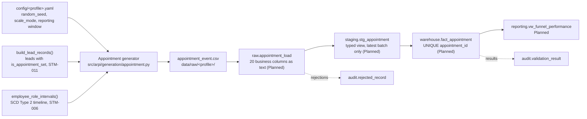

# STM-012 — Appointment Fact

## Header

| Field | Value |
|---|---|
| **Mapping ID** | `STM-012` |
| **Title** | Showroom appointment (transactional fact) |
| **Status** | **Implemented** (source generator, column contract, data-quality suite). The raw table, the staging view and `warehouse.fact_appointment` are **Planned** and owned by another agent — **no row has been loaded, and no fact load script exists.** |
| **Version** | 1.0 |
| **Date** | 2026-07-28 |
| **Owner** | Michael Palmer |
| **Source system** | `arpi_synthetic_generator` |
| **Source entity** | `appointment_event` (`src/arpi/generation/appointment.py`) |
| **Target object** | `warehouse.fact_appointment` |
| **Declared grain** | **One row per scheduled appointment.** |
| **Phase** | Phase 1.4 (delivery increment `P1.4-03`) |
| **Intermediate objects** | `raw.appointment_load`, `staging.stg_appointment` (**Planned**) |
| **Upstream object** | `lead_event` ([STM-011](STM-011-fact-lead.md)) |
| **Downstream objects** | `reporting.vw_funnel_performance` (**Planned**); the show-rate KPI (**Planned**) |

---

## 1. Purpose

`warehouse.fact_appointment` exists so that show rate can be honest rather than flattering.

### 1.1 Why this is a separate grain from `fact_lead`

**One lead can produce several appointments.** A shopper books for Thursday, cancels on Wednesday,
rebooks for Saturday and finally comes in. That is *one lead* and *three appointments*. Collapsing it to
one row per lead hides two broken appointments and overstates the show rate by a third.

So `fact_lead` counts opportunities and `fact_appointment` counts bookings, and the two are reconciled
rather than merged: a lead flagged `is_appointment_shown` has exactly **one** shown appointment, and a
lead not so flagged has none.

### 1.2 The distinction this mapping exists to protect: cancellation ≠ no-show

`is_cancelled_in_advance` and `is_shown` are separate, **mutually exclusive** flags rather than one
status column, because the three outcomes are genuinely three different events:

| Outcome | `is_cancelled_in_advance` | `is_shown` | What happened to the store's time |
|---|:--:|:--:|---|
| **Advance cancellation** | `true` | `false` | Returned. The slot could be rebooked. |
| **No-show** | `false` | `false` | Held and lost. Nobody rang, nobody came. |
| **Shown** | `false` | `true` | Used. |

**A no-show is neither cancelled nor shown.** Conflating the two understates broken appointments, and it
lets the show rate be flattered in whichever direction the analyst prefers: put advance cancellations in
the denominator and it collapses; drop no-shows from it and it looks excellent. Keeping the flags apart
forces a reporting view to state which denominator it means
([KPI_CATALOG.md](../../KPI_CATALOG.md) §27). `DQ-APT-004` fails the run on any row that claims both.

At development scale the two denominators differ materially — 0.486 against all appointments, 0.633
excluding advance cancellations — and a test asserts that they differ, because if they agreed, keeping
the flags apart would be decorative.

### 1.3 `minutes_early_or_late` is NULL when nobody showed

Same rule as `fact_lead.first_response_seconds`, for the same reason. **Zero means the shopper arrived
exactly on time.** A no-show has no arrival at all, so it carries `NULL`. Encoding the second as the
first would make every broken appointment look like the most punctual in the dataset. `DQ-APT-007`
enforces both directions: NULL whenever not shown, populated whenever shown.

---

## 2. Lineage

**Ordered lineage statement**

1. The generator seeds a dedicated `appointment_event` random stream, so generating appointments cannot
   move the lead digest or any other entity's.
2. It reads the lead population and keeps only leads with `is_appointment_set`. Everything downstream is
   an expansion of that set, which is why the two facts cannot contradict each other.
3. Each such lead draws an appointment count of 1, 2 or 3 (weights 0.72 / 0.21 / 0.07).
4. The first appointment is **created** a short lag after the lead arrived, and **scheduled** a short lag
   after that. Subsequent appointments are created a few days after the previous slot. Every date is
   clamped into the reporting window, and — for a sold lead — on or before the sale date.
5. The **last** appointment of a lead carries the lead's outcome: if the shopper eventually showed, they
   showed for the final booking, and every earlier one is broken. A broken appointment is then either an
   advance cancellation or a no-show.
6. Shown appointments draw a test drive, a write-up and a punctuality value. A sold appointment is always
   written up, because the paperwork *is* the deal.
7. Appointments are ordered by `(created_date, lead_id, sequence)` and `appointment_id` is assigned as a
   deterministic ordinal `APT-########`.
8. A salesperson and a business development representative are resolved against the **SCD Type 2
   employee timeline** — the salesperson as of the scheduled date, the representative as of the created
   date. Either may be NULL when the store had nobody in that role that day.
9. Rows are written to `data/raw/<profile>/appointment_event.csv` — UTF-8, LF endings, header row,
   lowercase booleans, ISO dates, empty field for NULL, declared column order.
10. **Planned**: raw load, staging view, and an insert-only load into `warehouse.fact_appointment`.

---

## 3. Mapping table

All 20 columns of the `appointment_event` source entity, in declared order, against
`warehouse.fact_appointment`. The source entity carries **natural identifiers and real dates**; the fact
carries surrogate keys and three role-playing date keys.

| Source field | Source type | Target field | Target type | Transformation | Default behaviour | Validation | Rejection behaviour | Lineage field | Owner |
|---|---|---|---|---|---|---|---|---|---|
| *(load process)* | — | `appointment_key` | `bigint` PK | Database-assigned surrogate. **Planned.** | `n/a — database-assigned` | PK not null and unique | `REJ-KEY-001` on duplicate | `load_batch_id` | Loader |
| `appointment_id` | `text` | `appointment_id` | `varchar(20)` NN U | Direct. Natural key, format `APT-########`, a deterministic ordinal over `(created_date, lead_id, sequence)`. | `n/a — required` | `DQ-APT-001` unique | `REJ-NULL-001` if empty; `REJ-DOMAIN-001` if it does not match `APT-########`; `REJ-KEY-001` on duplicate | `load_batch_id`, `source_row_number` | Appointment generator |
| `created_date` | `text` | `created_date_key` | `integer` NN | Parse ISO date, encode `YYYYMMDD`. Never before the originating lead arrived. | `n/a — required` | FK to `dim_date`; `DQ-APT-003` | `REJ-TYPE-001` if not a date; `REJ-REF-001` if it does not resolve | `load_batch_id` | Appointment generator |
| `scheduled_date` | `text` | `scheduled_date_key` | `integer` NN | Parse ISO date, encode `YYYYMMDD`. **Role-playing date key.** | `n/a — required` | FK to `dim_date`; `DQ-APT-003`: `scheduled_date_key >= created_date_key` | `REJ-TYPE-001`; `REJ-RULE-001` if it precedes creation | `load_batch_id` | Appointment generator |
| `show_date` | `text` | `show_date_key` | `integer` NULL | Parse ISO date, encode `YYYYMMDD`. **Role-playing date key.** Populated **exactly when** `is_shown` is true, and equal to `scheduled_date`: the appointment is the slot, and intra-day variance lives in `minutes_early_or_late`. | `NULL — nobody arrived` | FK where populated; `DQ-APT-003`: NULL iff not shown, and never before creation | `REJ-TYPE-001`; `REJ-RULE-001` if it precedes creation or disagrees with `is_shown` | `load_batch_id` | Appointment generator |
| `dealership_id` | `text` | `dealership_key` | `integer` NN | Resolve `GSA-00N` against `dim_dealership`. Always the originating lead's store. | `n/a — required` | FK resolves | `REJ-REF-001` if it does not resolve | `load_batch_id` | Appointment generator |
| `lead_id` | `text` | `lead_key` | `bigint` NN | Resolve `LED-#########` against `fact_lead`. **Never NULL**: an appointment without an opportunity behind it has no place in the funnel. | `n/a — required` | FK resolves; the lead carries `is_appointment_set` | `REJ-REF-001` if unresolvable; `REJ-RULE-001` if the lead did not set an appointment | `load_batch_id` | Appointment generator |
| `customer_id` | `text` | `customer_key` | `integer` NULL | Resolve `CUS-########` against **the one governed `dim_customer`**. Carried verbatim from the lead, so the two facts always name the same shopper. NULL where the lead was anonymous. | `NULL — anonymous lead` | FK resolves where populated; equals the lead's customer | `REJ-REF-001` if a populated value does not resolve | `load_batch_id` | Appointment generator |
| `salesperson_id` | `text` | `salesperson_key` | `integer` NULL | Resolve `EMP-#####` against `dim_employee` **as of `scheduled_date`**. NULL where the store had no eligible salesperson that day. | `NULL — nobody on the floor` | FK resolves where populated; eligible role at that store on that date | `REJ-REF-001` if unresolvable; `REJ-RULE-001` on a role or store mismatch | `load_batch_id` | Appointment generator |
| `bdc_employee_id` | `text` | `bdc_employee_key` | `integer` NULL | Resolve `EMP-#####` against `dim_employee` **as of `created_date`**. NULL is common and modelled: a store with no business development centre books its appointments off the floor. | `NULL — no BDC on staff` | FK resolves where populated; `BDC Representative` or `BDC Manager` at that store on that date | `REJ-REF-001` if unresolvable; `REJ-RULE-001` on a role or store mismatch | `load_batch_id` | Appointment generator |
| `vehicle_model_id` | `text` | `vehicle_model_key` | `integer` NULL | Resolve `VMD-#####` against `dim_vehicle_model`. Carried verbatim from the lead. | `NULL — no model named` | FK resolves where populated | `REJ-REF-001` if a populated value does not resolve | `load_batch_id` | Appointment generator |
| `sale_id` | `text` | `sale_key` | `bigint` NULL | Resolve `SLE-########` against `fact_vehicle_sale`. Populated **exactly when** `is_sold` is true, and always the same sale the originating lead was credited with. | `NULL — no deal` | `DQ-APT-006`: resolves to a finalized **retail** sale at the same store, struck on or after the show date | `REJ-REF-001` if unresolvable; `REJ-RULE-001` if the sale precedes the show or belongs to another store | `load_batch_id` | Appointment generator |
| `appointment_count` | `text` | `appointment_count` | `smallint` NN | Cast to `smallint`. **Constant `1`** — the additive unit measure at this grain. | `1 — constant` | CHECK `appointment_count = 1` | `REJ-RULE-001` if any other value appears | `load_batch_id` | Appointment generator |
| `is_confirmed` | `text` | `is_confirmed` | `boolean` NN | Cast lowercase `true`/`false`. Confirmation genuinely predicts attendance without determining it. | `n/a — required` | Not null | `REJ-TYPE-001` if not `true`/`false` | `load_batch_id` | Appointment generator |
| `is_cancelled_in_advance` | `text` | `is_cancelled_in_advance` | `boolean` NN | Cast to `boolean`. **The shopper rang ahead.** Mutually exclusive with `is_shown`; a no-show is neither. | `n/a — required` | `DQ-APT-004`; CHECK `NOT (is_shown AND is_cancelled_in_advance)` | `REJ-TYPE-001`; `REJ-RULE-001` if both flags are set | `load_batch_id` | Appointment generator |
| `is_shown` | `text` | `is_shown` | `boolean` NN | Cast to `boolean`. **The shopper arrived.** | `n/a — required` | `DQ-APT-003`, `DQ-APT-004`, `DQ-APT-007`; CHECK `is_shown ⇒ show_date_key IS NOT NULL` | `REJ-TYPE-001`; `REJ-RULE-001` on a broken implication | `load_batch_id` | Appointment generator |
| `is_test_drive` | `text` | `is_test_drive` | `boolean` NN | Cast to `boolean`. Implies `is_shown`. | `n/a — required` | CHECK `is_test_drive ⇒ is_shown` | `REJ-TYPE-001`; `REJ-RULE-001` on a broken implication | `load_batch_id` | Appointment generator |
| `is_write_up` | `text` | `is_write_up` | `boolean` NN | Cast to `boolean`. **Implies `is_shown`** — a deal cannot be written on somebody who never arrived, and a write-up rate above the show rate is impossible. | `n/a — required` | `DQ-APT-005`; CHECK `is_write_up ⇒ is_shown` | `REJ-TYPE-001`; `REJ-RULE-001` on a broken implication | `load_batch_id` | Appointment generator |
| `is_sold` | `text` | `is_sold` | `boolean` NN | Cast to `boolean`. **Derived from the presence of a sale reference**, never drawn separately. Implies `is_shown` and `is_write_up`. | `n/a — required` | `DQ-APT-006`; CHECK `is_sold ⇒ sale_key IS NOT NULL AND is_shown` | `REJ-TYPE-001`; `REJ-RULE-001` on a broken implication | `load_batch_id` | Appointment generator |
| `minutes_early_or_late` | `text` | `minutes_early_or_late` | `integer` NULL | Cast to `integer`; negative means early. **Empty field becomes NULL, and NULL means nobody arrived.** It must never be coerced to `0`: zero is a real value meaning exactly on time. | `NULL — nobody arrived` | `DQ-APT-007`; CHECK `NOT is_shown ⇒ minutes_early_or_late IS NULL` | `REJ-TYPE-001` if not castable; `REJ-RULE-001` if populated on a broken appointment | `load_batch_id` | Appointment generator |
| `source_system` | `text` | `source_system` | `varchar(40)` NN | **Constant** `arpi_synthetic_generator`. | `n/a — constant` | Must equal `arpi_synthetic_generator` | `REJ-RULE-001` if any other value appears | itself | Appointment generator |
| *(database)* | — | `raw_record_id` | `bigserial` | Database-assigned. **Raw layer only.** | `n/a — database-assigned` | PK uniqueness | n/a | itself | Database |
| *(load process)* | — | `load_batch_id` | `uuid` | Assigned once per load. **Raw and staging layers only.** | `n/a — required` | Not null | `REJ-PARSE-001` if the batch cannot be initialised | itself | Loader |
| *(load process)* | — | `source_file_name` | `text` | Name of the source file. **Raw and staging layers only.** | `n/a — required` | Not null | n/a | itself | Loader |
| *(load process)* | — | `source_row_number` | `integer` | 1-based row number, excluding the header. **Raw and staging layers only.** | `n/a — required` | Not null; ≥ 1 | n/a | itself | Loader |
| *(database)* | — | `ingested_at` | `timestamptz` | Database `DEFAULT now()`. **Raw and staging layers only.** | `now()` | Not null | n/a | itself | Database |

> **Prohibited target fields.** Any personal name, contact detail, address, birth date, government or
> financial identifier, protected characteristic — **and any communication content whatsoever**. An
> appointment record in a real CRM carries the confirmation-call note and the reminder message text;
> ARPI generates neither. `DQ-APT-008` inspects the schema rather than the values, so an empty
> `confirmation_notes` column still fails the run.

---

## 4. Derivation reference

### 4.1 How many appointments a lead produces

| Appointments | Weight |
|---:|---:|
| 1 | 0.72 |
| 2 | 0.21 |
| 3 | 0.07 |

At development scale that yields **1.345 appointments per appointment-setting lead**, and **27% of those
leads book more than once** — enough that the grain difference against `fact_lead` is genuinely
exercised rather than merely declared.

### 4.2 Timing

| Interval | Days, with weights |
|---|---|
| Lead arrival → first booking | 0 (0.46), 1 (0.24), 2 (0.12), 3 (0.08), 5 (0.06), 8 (0.04) |
| Booking → slot | 0 (0.31), 1 (0.27), 2 (0.15), 3 (0.10), 4 (0.08), 6 (0.06), 9 (0.03) |
| Broken slot → rebooking | 1 (0.42), 2 (0.28), 3 (0.19), 5 (0.11) |

A booking lead time of zero is common, and correctly so: a great many appointments are set for later the
same day. Every resulting date is clamped into `[lead arrival, reporting window end]`, and on a sold lead
also to `[…, sale date]`, so **`scheduled_date >= created_date` holds by construction** rather than by
correction after the fact.

### 4.3 Outcomes

The **last** appointment of a lead carries the lead's outcome. Every earlier one is broken, and each
broken appointment is an advance cancellation with probability `ADVANCE_CANCELLATION_SHARE` (0.45) and a
no-show otherwise.

Confirmation is drawn **conditioned on the outcome** — 0.84 for an appointment that will be shown, 0.52
for one that will be broken. The conditioning runs backwards from the outcome because the lead-grain
funnel already fixed whether the shopper arrived, and the two facts must not disagree. The direction is
the one a store would observe: confirmed appointments show more often. A test asserts that direction and
that neither group is all-or-nothing.

Shown appointments then draw a test drive (0.63) and a write-up (0.55). **A sold appointment is always
written up**, because the paperwork is the deal, so the write-up rate is always at or above the sold
rate.

### 4.4 Punctuality

`minutes_early_or_late` is `round(gauss(7, 16))` clamped into `[-45, 120]`. The mean is slightly positive
because more shoppers run late than early, and the distribution reaches both signs, so **early arrivals
are real negative values rather than an absent case**. Zero occurs and means exactly on time. Beyond the
clamp the appointment would have been rebooked rather than logged as an arrival.

### 4.5 Measured behaviour

Generated with the profile-pinned seed. **These are measurements of the `test` and `development`
profiles only. No portfolio-scale run is claimed**; the portfolio figure below is a projection from the
development profile scaled by the declared lead counts, and it is labelled as such.

| | test | development | portfolio |
|---|---:|---:|---:|
| Appointments | 76 | 2,111 | ≈19,400 *(projected)* |
| Appointment-setting leads | 55 | 1,569 | — |
| Appointments per setting lead | 1.382 | 1.345 | — |
| Shown share of all appointments | 0.329 | 0.486 | — |
| **Advance cancellation share** | 0.250 | 0.233 | — |
| **No-show share** | 0.421 | 0.282 | — |
| Show rate excluding advance cancellations | 0.439 | 0.633 | — |

The projected portfolio figure sits inside the `P1.4-03` target band of 10,000 to 25,000, and a test
asserts the projection. ``PHASE1_CONTRACT.md`` §11 forbids generating portfolio scale in CI or routine
tests, so the band is checked against the projection rather than against an observation.

---

## 5. Load strategy

| Layer | Strategy | Write semantics |
|---|---|---|
| CSV | Overwrite | The generator rewrites `data/raw/<profile>/appointment_event.csv` on each run. Byte-identical between runs at the same seed. |
| `raw.appointment_load` | **Truncate-and-reload per batch** (**Planned**) | Truncated and reloaded from the current CSV, then stamped with a fresh `load_batch_id`. |
| `staging.stg_appointment` | **View** (`CREATE OR REPLACE VIEW`) (**Planned**) | No data written. Casts raw text to warehouse types, filters to the most recent `load_batch_id`, and resolves natural identifiers into surrogate keys — including all **three** role-playing date keys. |
| `warehouse.fact_appointment` | **Insert-only, keyed on `appointment_id`** (**Planned**) | An appointment already present is skipped, not duplicated. Load order matters: `fact_lead` must be loaded first, because `lead_key` is `NOT NULL`. |

**Constraints to be enforced in the database — all `Planned`, because the DDL is owned by another agent
and does not exist yet:**

- `appointment_id` UNIQUE — the grain constraint.
- `CHECK (appointment_count = 1)`.
- `CHECK (scheduled_date_key >= created_date_key)`.
- `CHECK (NOT is_shown OR show_date_key IS NOT NULL)`.
- `CHECK (NOT is_shown OR NOT is_cancelled_in_advance)`.
- `CHECK (NOT is_write_up OR is_shown)`.
- `CHECK (NOT is_sold OR (is_shown AND sale_key IS NOT NULL))`.
- `CHECK (is_shown OR minutes_early_or_late IS NULL)`.
- Foreign keys on `created_date_key`, `scheduled_date_key`, `show_date_key`, `dealership_key`,
  `lead_key`, `customer_key`, `salesperson_key`, `bdc_employee_key`, `vehicle_model_key` and `sale_key`.

> **No `NOT NULL DEFAULT 0` on `minutes_early_or_late`, ever.** It would turn every no-show into the
> most punctual appointment in the dataset, silently and irreversibly.

---

## 6. Idempotency guarantees

| Guarantee | Mechanism |
|---|---|
| Rerunning with unchanged source produces **no new fact rows** | Insert-only keyed on `appointment_id`; an existing appointment is skipped (**Planned**). |
| `appointment_id` is stable across regenerations | Deterministic ordinal over `(created_date, lead_id, sequence)` — no database sequence, no insertion-order dependence. |
| Rerunning produces a **byte-identical CSV** | A dedicated seeding namespace, a fixed draw order and a fixed output format. Asserted by `tests/data_quality/test_appointment_quality.py`. |
| Generating appointments cannot move another entity's digest | One namespace per entity. Asserted against `dim_date`, `dim_dealership`, `dim_employee`, `dim_customer`, `dim_lead_source` **and `lead_event`**. |
| The two funnel facts cannot disagree | Appointments are expanded from lead records rather than drawn independently. Asserted: the shown-appointment lead set equals the `is_appointment_shown` lead set exactly. |
| Verifiable by a third party | `content_digest` in `generation_manifest.json` is the SHA-256 of the CSV bytes. |

---

## 7. Rejection handling

| Condition | `REJ-*` code | Outcome |
|---|---|---|
| A CSV row cannot be parsed | `REJ-PARSE-001` | Row rejected; run fails |
| The CSV header does not match the 20 declared columns, in order | `REJ-SCHEMA-001` | Load aborts before any row is processed; run fails. Also caught pre-load by `DQ-APT-002`. |
| **A prohibited PII or communication-content column is present in the schema** | `REJ-SCHEMA-001` | Load aborts; run fails. Detected by `DQ-APT-008`. |
| A value cannot be cast to its warehouse type | `REJ-TYPE-001` | Row rejected; run fails |
| A `NOT NULL` field is empty | `REJ-NULL-001` | Row rejected; run fails |
| `appointment_id` does not match `APT-########` | `REJ-DOMAIN-001` | Row rejected; run fails |
| Duplicate `appointment_id` | `REJ-KEY-001` | Later row rejected; run fails. Detected by `DQ-APT-001`. |
| A populated foreign key does not resolve | `REJ-REF-001` | Row rejected; run fails |
| `scheduled_date` before `created_date`, or a show date before creation | `REJ-RULE-001` | Row rejected; run fails. Detected by `DQ-APT-003`. |
| **An appointment claims to be both shown and cancelled in advance** | `REJ-RULE-001` | Row rejected; run fails. Detected by `DQ-APT-004`. |
| A write-up, test drive or sale without a show | `REJ-RULE-001` | Row rejected; run fails. Detected by `DQ-APT-005` and `DQ-APT-006`. |
| **`minutes_early_or_late` populated on an appointment nobody showed for** | `REJ-RULE-001` | Row rejected; run fails. Detected by `DQ-APT-007`. |
| A sold appointment whose sale predates the show, or belongs to another store | `REJ-RULE-001` | Row rejected; run fails. Detected by `DQ-APT-006`. |

Every rejection writes a row to `audit.rejected_record` with `source_entity = 'appointment_event'`,
`source_record_key` = the offending `appointment_id` where identifiable, the code, a human-readable
reason, and the `record_payload`, passed through `arpi.validation.privacy.redact_payload()` first.
**Fail closed.**

> **Phase 1 rejection tolerance is zero.** `validation.max_rejected_record_ratio = 0.0`.

---

## 8. Validation checks gating the load

| Check ID | Assertion | Category | Severity | Gate |
|---|---|---|---|---|
| `DQ-APT-002` | The generated frame's schema matches the declared 20-column contract — names, order and count | `structural` | critical | Pre-load |
| `DQ-APT-008` | **No prohibited personal-data or communication-content column is present** — inspects the schema | `privacy` | critical | Pre-load **and** post-load |
| `DQ-APT-001` | `appointment_id` is unique | `uniqueness` | critical | Pre-load **and** post-load |
| `DQ-APT-003` | **Date ordering**: scheduled on or after created, shown on or after created, a show date exactly when shown | `business_rule` | critical | Pre-load **and** post-load |
| `DQ-APT-004` | **Shown implies not cancelled in advance** — the cancellation-versus-no-show distinction | `business_rule` | critical | Pre-load **and** post-load |
| `DQ-APT-005` | A write-up implies a show | `business_rule` | critical | Pre-load **and** post-load |
| `DQ-APT-006` | Sold implies shown and resolves to a finalized retail sale at the same store, on or after the show date | `referential` | critical | Pre-load **and** post-load |
| `DQ-APT-007` | **`minutes_early_or_late` is NULL when not shown**, and populated when shown | `completeness` | critical | Pre-load **and** post-load |

Cross-entity checks that also apply: `DQ-GEN-001` (schema matches) and `DQ-GEN-002` (determinism digest).

**All eight are `critical`.** Any failure sets `audit.pipeline_run.status = 'failed'` and increments
`critical_failure_count`. Each identifier is declared once, in `src/arpi/generation/appointment.py`, and
registered at import time with `arpi.validation.registry.register_checks()`. Their `layer` is `python`:
the SQL implementations arrive with the DDL and are **Planned**.

---

## 9. Reconciliations

| Reconciliation ID | Description | Left | Right | Tolerance | Status |
|---|---|---|---|---|---|
| `RECON-FACT-APPOINTMENT-ROWCOUNT` | Generated `appointment_event` rows equal `warehouse.fact_appointment` rows after the load | `generator:appointment_event` row count | `warehouse.fact_appointment` `count(*)` | 0 (exact) | **Planned** |
| `RECON-FUNNEL-LEAD-APPOINTMENT` | Leads flagged appointment-shown equal the distinct leads with a shown appointment | `fact_lead WHERE is_appointment_shown` | `fact_appointment WHERE is_shown`, distinct `lead_key` | 0 (exact) | **Planned** (`P1.4-05`) |
| `RECON-APPOINTMENT-SOLD` | Sold appointments equal the distinct sales they resolve to | `count(*) WHERE is_sold` | `count(DISTINCT sale_key) WHERE is_sold` | 0 (exact) | **Planned** |

---

## 10. Open questions and known gaps

- **The warehouse table does not exist yet.** The generator, contract, data-quality suite and this
  mapping are Implemented; `sql/04_facts/03_fact_appointment.sql`, the raw table, the staging view and
  the load are **Planned** and owned by another agent. Everything in sections 5 and 7 that touches the
  database is a specification, not a description of running code.
- **`show_date` always equals `scheduled_date`.** A shopper who arrives a day late is modelled as a
  broken appointment plus a rebooking, not as a same-appointment slip. That keeps
  `minutes_early_or_late` unambiguously an intra-day quantity, at the cost of not modelling the
  walk-in-on-the-wrong-day case.
- **No appointment time of day exists.** ARPI stores dates, not timestamps, so nothing can be said about
  morning-versus-evening show rates or about appointment density through the day.
- **Cancellation reason is deliberately absent.** The obvious next column would be a free-text or coded
  reason; the free-text version is prohibited outright, and a coded version would be an invented
  taxonomy with no analytical question behind it in Phase 1.
- **Confirmation is drawn from the outcome, not the other way round.** Section 4.3 explains why. The
  measured association between confirmation and attendance is therefore a property the generator was
  told to produce, not one that emerged — a modelling assumption, and not evidence about how
  confirmation calls perform anywhere.
- **A no-show and a shopper who cancelled ten minutes before the slot are the same row here.** Real
  systems sometimes distinguish "cancelled same day" from "cancelled in advance"; ARPI does not, so the
  advance-cancellation population is slightly broader than the strictest reading of the term.
