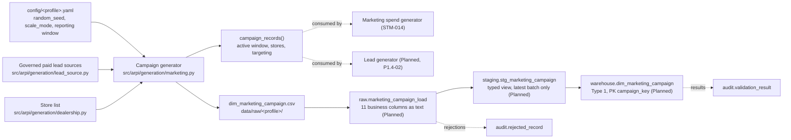

# STM-013 — Marketing Campaign Dimension

## Header

| Field | Value |
|---|---|
| **Mapping ID** | `STM-013` |
| **Title** | Marketing campaign dimension (Slowly Changing Dimension Type 1) |
| **Status** | **Implemented** (generator, column contract, data-quality suite). Ingestion, warehouse DDL and merge are **Planned**. |
| **Version** | 1.0 |
| **Date** | 2026-07-28 |
| **Owner** | Michael Palmer |
| **Source system** | `arpi_synthetic_generator` |
| **Target object** | `warehouse.dim_marketing_campaign` |
| **Declared grain** | One row per campaign. |
| **Phase** | Phase 1.5 (delivery increment `P1.5-01`) |
| **Intermediate objects** | `raw.marketing_campaign_load`, `staging.stg_marketing_campaign` (**Planned**) |
| **Downstream objects** | `warehouse.fact_marketing_spend` ([STM-014](STM-014-fact-marketing-spend.md)), `warehouse.fact_lead` (**Planned**, `P1.4-02`) |

---

## 1. Purpose

`warehouse.dim_marketing_campaign` names the initiative that spend belongs to, so that cost, leads and
resulting gross can be attributed to something more specific than a channel.

Without it the marketing page can only answer "what did paid search cost?". With it the page can answer
"which of the four things we ran on paid search was worth running?" — which is the question a dealer
group actually asks.

### 1.1 Every vendor name is fictional

`vendor_name` values such as `Granite Ridge Digital`, `Riverwalk Listings Network` and `Millyard
Broadcast Sales` are **invented**, built from the fictional group's own New Hampshire geography so that a
reader can see at a glance that they are placeholders. **No real advertising agency, marketplace,
broadcaster or mail house is named anywhere in ARPI.**

The reasoning is the same as for lead sources ([STM-010 §1.1](STM-010-dim-lead-source.md)): this
generator attaches invented spend, invented delivery and invented lead counts to every vendor, and
attaching invented commercial behaviour to a **named real company** would be a fabricated claim about
that company.

An in-house campaign carries `In-House Marketing Team` rather than a NULL, because the column is
`NOT NULL` and because "we ran it ourselves" is information rather than an absence of it.

---

## 2. Lineage



**Ordered lineage statement**

1. The generator resolves the campaign count for the active `generation.scale_mode` — 8 (test), 24
   (development), 60 (portfolio) — and seeds a generator from the `dim_marketing_campaign` namespace.
2. For each campaign in `campaign_id` order it draws a **lead source** from the campaign-eligible
   (paid) sources, weighted by section 4.1.
3. `channel` is **derived from the lead source**, never drawn separately, so an incoherent
   source/channel pair is unrepresentable.
4. The **active window** is placed (section 4.2): a channel-dependent probability makes the campaign
   always-on, otherwise it is a one-to-four-month burst.
5. `target_department` and `target_vehicle_category` are drawn (section 4.3); a service campaign records
   `Both` for the vehicle category rather than a NULL the contract does not allow.
6. **Funding stores** are drawn (section 4.4). The independent used store `GSA-003` is not eligible for a
   campaign targeting new vehicles.
7. `vendor_name` is drawn from the channel's invented vendor list, and `campaign_name` is composed from a
   theme appropriate to the start quarter.
8. A per-campaign **intensity** is drawn and then normalised into `source_share`: within one lead source
   the shares sum to `1.0`, so campaigns bought against a source divide that source's expected lead
   volume between them rather than each claiming all of it. **`source_share` is a latent, not a column.**
9. `campaign_key` is assigned as a **deterministic ordinal 1..N over `campaign_id`**.
10. Rows are written to `data/raw/<profile>/dim_marketing_campaign.csv`.
11. **Planned**: raw load, staging view, then a **Type 1 upsert (MERGE) on `campaign_id`**.

---

## 3. Mapping table

All 11 columns of `warehouse.dim_marketing_campaign`, in declared order. **`end_date` is the only
nullable column.**

| Source field | Source type | Target field | Target type | Transformation | Default behaviour | Validation | Rejection behaviour | Lineage field | Owner |
|---|---|---|---|---|---|---|---|---|---|
| `campaign_key` | `text` | `campaign_key` | `integer` PK | Cast to `integer`. **Deterministic ordinal 1..N over `campaign_id` ascending.** | `n/a — required` | PK not null and unique | `REJ-TYPE-001` if not castable; `REJ-KEY-001` on duplicate | `load_batch_id`, `source_row_number` | Campaign generator |
| `campaign_id` | `text` | `campaign_id` | `varchar(16)` U | Direct. Natural key, format `CMP-#####`. | `n/a — required` | `DQ-CMP-001` unique | `REJ-NULL-001` if empty; `REJ-DOMAIN-001` if it does not match `CMP-#####`; `REJ-KEY-001` on duplicate | `load_batch_id`, `source_row_number` | Campaign generator |
| `campaign_name` | `text` | `campaign_name` | `varchar(80)` | Direct. Composed as `<theme> <year> - <channel>`, e.g. `Summer Clearance 2025 - Paid Search`. **Fictional.** Allowlisted in the prohibited-field policy as a campaign label rather than a person's name. | `n/a — required` | Not null | `REJ-NULL-001` if empty | `load_batch_id` | Campaign generator |
| `channel` | `text` | `channel` | `varchar(30)` | Direct. Domain `Paid Search` \| `Paid Social` \| `Third-Party Listings` \| `Direct Mail` \| `Radio` \| `Television` \| `Email`. **Derived from `lead_source_id`.** | `n/a — required` | `DQ-CMP-005` inside the enumeration | `REJ-DOMAIN-001` outside the enumeration; `REJ-RULE-001` if it does not follow from the lead source | `load_batch_id` | Campaign generator |
| `vendor_name` | `text` | `vendor_name` | `varchar(60)` | Direct. **Every value is invented; no real vendor is referenced.** `In-House Marketing Team` where the campaign is run internally. | `n/a — required` | Not null | `REJ-NULL-001` if empty | `load_batch_id` | Campaign generator |
| `lead_source_id` | `text` | `lead_source_key` | `integer` FK | Resolved to `dim_lead_source.lead_source_key` at load; `lead_source_id` is retained on the source row for lineage. Only **paid** sources appear. | `n/a — required` | `DQ-CMP-004` resolves to a governed source | `REJ-FK-001` if it does not resolve | `load_batch_id` | Campaign generator |
| `start_date` | `text` | `start_date` | `date` | Cast ISO-8601 `YYYY-MM-DD` to `date`. Inside the reporting window. | `n/a — required` | `DQ-CMP-003` with `end_date` | `REJ-TYPE-001` if unparseable; `REJ-NULL-001` if empty | `load_batch_id` | Campaign generator |
| `end_date` | `text` | `end_date` | `date` **NULL** | Cast to `date`, or NULL from an empty field. **NULL means the campaign was still running when the reporting window closed** — it is not a missing value. | `NULL — still running` | `DQ-CMP-003`: NULL or ≥ `start_date` | `REJ-TYPE-001` if unparseable; `REJ-RULE-001` if earlier than `start_date` | `load_batch_id` | Campaign generator |
| `target_department` | `text` | `target_department` | `varchar(30)` | Direct. Domain `Sales` \| `Service` \| `Both`. | `n/a — required` | `DQ-CMP-005` inside the enumeration | `REJ-DOMAIN-001` outside the enumeration | `load_batch_id` | Campaign generator |
| `target_vehicle_category` | `text` | `target_vehicle_category` | `varchar(30)` | Direct. Domain `New` \| `Used` \| `Both`. A service campaign records `Both`. | `n/a — required` | `DQ-CMP-005` inside the enumeration | `REJ-DOMAIN-001` outside the enumeration | `load_batch_id` | Campaign generator |
| `source_system` | `text` | `source_system` | `varchar(40)` | **Constant** `arpi_synthetic_generator`. | `n/a — constant` | Must equal `arpi_synthetic_generator` | `REJ-RULE-001` if any other value appears | itself | Campaign generator |
| *(database)* | — | `raw_record_id` | `bigserial` | Database-assigned. **Raw layer only.** | `n/a — database-assigned` | PK uniqueness | n/a | itself | Database |
| *(load process)* | — | `load_batch_id` | `uuid` | Assigned once per load. **Raw and staging layers only.** | `n/a — required` | Not null | `REJ-PARSE-001` if the batch cannot be initialised | itself | Loader |
| *(load process)* | — | `source_file_name` | `text` | Name of the source file. **Raw and staging layers only.** | `n/a — required` | Not null | n/a | itself | Loader |
| *(load process)* | — | `source_row_number` | `integer` | 1-based row number, excluding the header. **Raw and staging layers only.** | `n/a — required` | Not null; ≥ 1 | n/a | itself | Loader |
| *(database)* | — | `ingested_at` | `timestamptz` | Database `DEFAULT now()`. **Raw and staging layers only.** | `now()` | Not null | n/a | itself | Database |

> **Prohibited target fields.** No audience definition, targeting radius, postal or geofence column
> exists, and no personal data of any kind. Marketing metadata is where audience attributes creep in, so
> `DQ-CMP-006` inspects the **schema** and fails the run on a prohibited column even when it is empty.
> `campaign_name` and `vendor_name` pass only because both are explicitly allowlisted, each with a
> written justification, as labels for a campaign and a business rather than for a person.

---

## 4. Derivation reference

### 4.1 Campaign-eligible lead sources and their channels

Only **paid** sources are eligible. A campaign against an unpaid source would attach spend to a channel
whose cost per lead is undefined by rule, which is how a marketing report starts dividing by nothing.

| `lead_source_id` | Channel | Draw weight | Always-on probability | Vendors (all invented) |
|---|---|---:|---:|---|
| `LDS-003` Email Marketing Response | Email | 0.08 | 0.30 | In-House Marketing Team |
| `LDS-006` Paid Search Brand | Paid Search | 0.12 | 0.75 | Granite Ridge Digital · Souhegan Media Partners |
| `LDS-007` Paid Search Non-Brand | Paid Search | 0.14 | 0.75 | Granite Ridge Digital · Souhegan Media Partners |
| `LDS-008` Paid Social Feed Campaign | Paid Social | 0.12 | 0.35 | Granite Ridge Digital · Souhegan Media Partners |
| `LDS-009` Paid Social Video Campaign | Paid Social | 0.07 | 0.35 | Granite Ridge Digital · Souhegan Media Partners |
| `LDS-010` Third-Party Marketplace Listing | Third-Party Listings | 0.16 | 0.85 | Riverwalk Listings Network · Kearsarge Auto Marketplace |
| `LDS-011` Third-Party Trade Valuation Portal | Third-Party Listings | 0.07 | 0.85 | Riverwalk Listings Network · Kearsarge Auto Marketplace |
| `LDS-012` Radio Spot Response | Radio | 0.08 | 0.25 | Millyard Broadcast Sales · North Bank Broadcast Group |
| `LDS-013` Direct Mail Response | Direct Mail | 0.09 | 0.10 | Sable Peak Direct Marketing |
| `LDS-014` Television Spot Response | Television | 0.07 | 0.20 | North Bank Broadcast Group |

The weights sum to `1.0`. Always-on probability reflects how the channels are bought: search and
marketplace listings are subscriptions that run continuously, while mail and broadcast are placed as
bursts.

### 4.2 Active-window placement

| Campaign shape | `start_date` | `end_date` |
|---|---|---|
| **Always-on** | The first day of the reporting window | `NULL` |
| **Burst** | The 1st, 8th or 15th of a month drawn from the window (weights 0.6 / 0.2 / 0.2) | Last day of the month one to four months later (weights 0.30 / 0.34 / 0.22 / 0.14), or `NULL` where that would fall on or after the window's last day |

**Always-on campaigns start on the window's first day, and that is a deliberate simplification.** They
would realistically have started earlier, but ARPI holds no history before the reporting window, so an
earlier start date would assert something the dataset cannot support. It is recorded here rather than
hidden, and it is listed again in section 10.

Media buys are placed on period boundaries rather than on arbitrary days, which is why burst campaigns
start on the 1st, 8th or 15th.

### 4.3 Targeting

| Attribute | Distribution | Why |
|---|---|---|
| `target_department`, on Paid Search and Third-Party Listings | `Sales` 0.85, `Both` 0.15 | Shopper-intent channels are not bought for the service drive. |
| `target_department`, on every other channel | `Sales` 0.60, `Both` 0.22, `Service` 0.18 | Broadcast, mail and email are the channels a service department actually buys. |
| `target_vehicle_category`, where the department is `Service` | `Both` | A service campaign is not bought against a vehicle category at all. |
| `target_vehicle_category`, otherwise | `New` 0.34, `Used` 0.40, `Both` 0.26 | Two of the three stores sell new; all three sell used. |

**Targeting is an intention, not a constraint.** [ARCHITECTURE.md §15.3](../../ARCHITECTURE.md)
relationship 16 requires campaigns to create leads outside their target segment, so attribution logic
cannot assume perfect targeting. This dimension records what the campaign was *for*; producing the
off-target leads themselves belongs to `fact_lead` and is **Planned** (`P1.4-02`).

### 4.4 Funding stores

Each eligible store joins a campaign with probability 0.62, and a campaign that would end up with no
store gets one drawn by store size. Store shares of group lead volume are `GSA-001` 0.42, `GSA-002` 0.35,
`GSA-003` 0.23.

**`GSA-003` is never eligible for a campaign whose `target_vehicle_category` is `New`**: the independent
used store stocks no new inventory, so it cannot be buying new-vehicle advertising. Asserted by a test.

`dealership_ids` is a **latent**, not a column: the dimension is one row per campaign, and which stores
funded it is expressed as spend rows in `fact_marketing_spend`.

### 4.5 Helper contract for downstream generators

```python
campaign_records(config: ArpiConfig) -> tuple[CampaignRecord, ...]
CampaignRecord.is_active_on(day: date) -> bool
```

`CampaignRecord` carries the eleven dimension attributes plus `dealership_ids` and `source_share`. The
lead generator uses it to attach a campaign that was genuinely running on the day a lead arrived, and to
choose — deliberately — a campaign running outside the lead's own segment.

Build the population **once** per run: `campaign_records()` regenerates it from the seed, so calling it
per lead would be quadratic.

---

## 5. Load strategy

| Layer | Strategy | Write semantics |
|---|---|---|
| CSV | Overwrite | The generator rewrites `data/raw/<profile>/dim_marketing_campaign.csv` on each run. Byte-identical between runs of the same profile and seed. |
| `raw.marketing_campaign_load` | **Truncate-and-reload per batch** (**Planned**) | Truncated and reloaded from the current CSV, then stamped with a fresh `load_batch_id`. |
| `staging.stg_marketing_campaign` | **View** (`CREATE OR REPLACE VIEW`) (**Planned**) | No data written. Casts raw text to warehouse types, resolves `lead_source_key`, and filters to the most recent `load_batch_id`. |
| `warehouse.dim_marketing_campaign` | **Type 1 upsert (MERGE) on `campaign_id`** (**Planned**) | Matched → update in place. Unmatched → insert. **Nothing is ever deleted**: a deleted campaign would orphan its spend rows. |

**Why Type 1.** A campaign's classification changing is a correction rather than a fact worth preserving,
and no ARPI measure asks what a campaign's channel was last quarter.
[ARCHITECTURE.md §14](../../ARCHITECTURE.md) lists campaign classification as a *potential* Type 2
dimension; **promoting it requires an ADR**, not a quiet schema change.

**Constraints to be enforced in the database — all `Planned`, because the DDL is owned by another agent
and does not exist yet:**

- `campaign_id` UNIQUE.
- `CHECK (end_date IS NULL OR end_date >= start_date)`.
- CHECK constraints over `channel`, `target_department` and `target_vehicle_category`.
- `lead_source_key` FOREIGN KEY to `warehouse.dim_lead_source`.
- Every column except `end_date` `NOT NULL`.

---

## 6. Idempotency guarantees

| Guarantee | Mechanism |
|---|---|
| Rerunning with unchanged source produces **no new warehouse rows** | Type 1 MERGE on `campaign_id` (**Planned**). |
| `campaign_key` is stable across regenerations | Deterministic ordinal 1..N over `campaign_id`. |
| `campaign_id` is stable across regenerations | Assigned from a monotonic counter over a deterministic draw order. |
| Rerunning produces a **byte-identical CSV** | A dedicated `dim_marketing_campaign` seeding namespace, deterministic ordinals and a fixed output format. Asserted by `tests/data_quality/test_marketing_quality.py`. |
| Generating campaigns cannot move another entity's digest | `rng_for(master_seed, "dim_marketing_campaign")` hashes the namespace rather than consuming a shared stream. Asserted against `dim_date`, `dim_dealership`, `dim_employee`, `dim_customer` and `dim_lead_source`. |
| Generating spend cannot move the campaign digest | The spend generator draws from its own `marketing_spend_event` namespace and only *reads* the campaign population. Asserted. |
| Verifiable by a third party | `content_digest` in `generation_manifest.json` is the SHA-256 of the CSV bytes. |

---

## 7. Rejection handling

| Condition | `REJ-*` code | Outcome |
|---|---|---|
| A CSV row cannot be parsed | `REJ-PARSE-001` | Row rejected; run fails |
| The CSV header does not match the 11 declared columns, in order | `REJ-SCHEMA-001` | Load aborts before any row is processed; run fails. Also caught pre-load by `DQ-CMP-002`. |
| **A prohibited PII, audience or targeting column is present in the schema** | `REJ-SCHEMA-001` | Load aborts; run fails. Detected by `DQ-CMP-006`. |
| A value cannot be cast to its warehouse type | `REJ-TYPE-001` | Row rejected; run fails |
| Any field other than `end_date` is NULL or empty | `REJ-NULL-001` | Row rejected; run fails |
| `campaign_id` does not match its format, or an enumerated value is outside its domain | `REJ-DOMAIN-001` | Row rejected; run fails. Detected by `DQ-CMP-005`. |
| Duplicate `campaign_key` or `campaign_id` | `REJ-KEY-001` | Later row rejected; run fails. Detected by `DQ-CMP-001`. |
| `lead_source_id` does not resolve to a governed source | `REJ-FK-001` | Row rejected; run fails. Detected by `DQ-CMP-004`. |
| `end_date` is earlier than `start_date` | `REJ-RULE-001` | Row rejected; run fails. Detected by `DQ-CMP-003`. |
| `channel` does not follow from `lead_source_id` | `REJ-RULE-001` | Row rejected; run fails |

Every rejection writes a row to `audit.rejected_record` with `source_entity = 'dim_marketing_campaign'`,
`source_record_key` = the offending `campaign_id` where identifiable, and a redacted `record_payload`.

> **Phase 1 rejection tolerance is zero.** `validation.max_rejected_record_ratio = 0.0`.

---

## 8. Validation checks gating the load

| Check ID | Assertion | Category | Severity | Gate |
|---|---|---|---|---|
| `DQ-CMP-002` | The generated frame's schema matches the declared 11-column contract — names, order and count | `structural` | critical | Pre-load |
| `DQ-CMP-006` | **No prohibited personal-data column is present** — schema inspection | `privacy` | critical | Pre-load **and** post-load |
| `DQ-CMP-001` | `campaign_id` is unique | `uniqueness` | critical | Pre-load **and** post-load |
| `DQ-CMP-003` | `end_date` is NULL or on or after `start_date` | `business_rule` | critical | Pre-load **and** post-load |
| `DQ-CMP-004` | `lead_source_id` resolves to a governed source | `referential` | critical | Pre-load **and** post-load |
| `DQ-CMP-005` | `channel`, `target_department` and `target_vehicle_category` are inside their enumerations | `business_rule` | critical | Pre-load **and** post-load |

Cross-entity checks that also apply: `DQ-GEN-001` (schema matches) and `DQ-GEN-002` (determinism digest).

**All six are `critical`.** Each identifier is declared once, in `src/arpi/generation/marketing.py`, and
registered at import time with `arpi.validation.registry.register_checks()`. Their `layer` is `python`;
the SQL implementations arrive with the DDL and are **Planned**.

---

## 9. Reconciliations

| Reconciliation ID | Description | Left | Right | Tolerance | Status |
|---|---|---|---|---|---|
| `RECON-DIM-CAMPAIGN-ROWCOUNT` | Generated campaign rows equal `warehouse.dim_marketing_campaign` rows after the merge | `generator:dim_marketing_campaign` row count | `warehouse.dim_marketing_campaign` `count(*)` | 0 (exact) | **Planned** |

Expected counts: 8 (test), 24 (development), 60 (portfolio).

---

## 10. Open questions and known gaps

- **The warehouse table does not exist yet.** `sql/03_dimensions/07_dim_marketing_campaign.sql` and its
  merge are **Planned** and owned by another agent. Sections 5 and 7 are a specification, not a
  description of running code.
- **Always-on campaigns all start on the same day.** Section 4.2 explains why: ARPI holds no history
  before the reporting window. The consequence is a cluster of identical `start_date` values, which a
  reader should not mistake for a real launch pattern.
- **Off-target lead generation is not implemented here.** The dimension records targeting; producing
  leads that fall outside it is `fact_lead` work (**Planned**, `P1.4-02`). Until then, relationship 16 is
  supported by the model but not yet demonstrated in data.
- **Campaign classification is Type 1 by decision, not by default.** Promoting it to Type 2 requires an
  ADR ([ARCHITECTURE.md §14](../../ARCHITECTURE.md)).
- **No creative, placement or daypart detail exists.** A campaign is a name, a channel, a vendor, a
  window and a target. Anything finer would be invented detail with no measure reading it.
- **Portfolio scale is never generated in CI.** 60 campaigns is asserted by contract, and the campaign
  and spend entities are small enough to be generated inside a routine test — but the full portfolio
  dataset is not.
