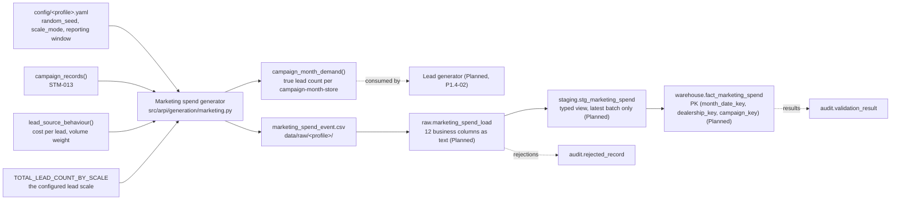

# STM-014 — Marketing Spend Fact

## Header

| Field | Value |
|---|---|
| **Mapping ID** | `STM-014` |
| **Title** | Marketing spend (monthly periodic fact) |
| **Status** | **Implemented** (source generator, column contract, data-quality suite). Ingestion, warehouse DDL and load are **Planned**. |
| **Version** | 1.0 |
| **Date** | 2026-07-28 |
| **Owner** | Michael Palmer |
| **Source system** | `arpi_synthetic_generator` |
| **Source entity** | `marketing_spend_event` |
| **Target object** | `warehouse.fact_marketing_spend` |
| **Declared grain** | **One row per dealership, campaign and calendar month.** |
| **Phase** | Phase 1.5 (delivery increment `P1.5-01`) |
| **Intermediate objects** | `raw.marketing_spend_load`, `staging.stg_marketing_spend` (**Planned**) |
| **Downstream objects** | `reporting.vw_marketing_performance` (**Planned**), the three marketing KPIs (**Planned**, `P1.5-02`) |

---

## 1. Purpose

`warehouse.fact_marketing_spend` is what turns funnel volume into an economic question: not "how many
leads?" but "were they worth what they cost?"

It is the denominator for cost per lead and cost per sale, and the divisor for gross return on
advertising spend. It is the fifth and final MVP fact.

### 1.1 The two properties this mapping exists to protect

**`month_date_key` is always the first day of the month.** A month-grain fact keyed on `20250731`
instead of `20250701` joins to a single day of `dim_date`, so every monthly total silently lands in the
wrong bucket — or in none at all. This is the single most common way a month-grain fact goes wrong, and
`DQ-MKT-003` fails the run on it.

**`vendor_reported_leads` deliberately differs from the CRM count.** That gap is an intended analytical
finding, not a defect; section 4.4 states the assumption behind it in full.

---

## 2. Lineage



**Ordered lineage statement**

1. The generator computes the group's **expected monthly lead volume** from the configured lead scale:
   `TOTAL_LEAD_COUNT_BY_SCALE[scale_mode] ÷ months in the reporting window`. Spend is therefore
   calibrated against the same number the lead fact is, rather than invented independently.
2. It rebuilds the campaign population from [STM-013](STM-013-dim-marketing-campaign.md) — deterministic,
   so no coordination between the two generators is needed — and seeds its own generator from the
   `marketing_spend_event` namespace.
3. For each calendar month in the window, each campaign, and each store funding that campaign, it
   computes the **active fraction** of the month (section 4.1). A fraction of zero produces **no row**:
   only months inside the campaign's window get spend.
4. **Expected leads** for the row = monthly group volume × the source's volume weight × the store's share
   × the campaign's share of its source × the active fraction (section 4.2).
5. **`true_lead_count`** = expected leads × an independent volume draw, rounded and floored at zero.
6. **`spend_amount`** = expected leads × the source's cost per lead × an **independently drawn**
   efficiency factor, as a `Decimal` quantized to cents. Two independent draws are what keep spend
   correlated with volume without being a function of it (section 4.3).
7. **`vendor_reported_leads`** = `true_lead_count` inflated by 1.28 with a spread that never falls to or
   below 1.0 (section 4.4).
8. Delivery counts are derived from spend and from the vendor's own reported total (section 4.5).
9. Rows are sorted by `(month_date_key, dealership_id, campaign_id)` and `marketing_spend_id` is
   assigned as an ordinal over that order.
10. **Planned**: raw load, staging view resolving `month_date_key`, `dealership_key`, `campaign_key` and
    `lead_source_key`, then an **insert of the month** into `warehouse.fact_marketing_spend`.

---

## 3. Mapping table

All 12 columns of the source entity, in declared order, and how each lands in the fact. **Every column is
`NOT NULL`.**

| Source field | Source type | Target field | Target type | Transformation | Default behaviour | Validation | Rejection behaviour | Lineage field | Owner |
|---|---|---|---|---|---|---|---|---|---|
| `marketing_spend_id` | `text` | *(natural key, retained for lineage)* | `varchar(16)` | Direct, format `MKT-########`. The fact's surrogate `marketing_spend_key` is database-assigned; this is the natural key a rejection or reconciliation names. | `n/a — required` | Format; unique | `REJ-DOMAIN-001` if it does not match `MKT-########`; `REJ-KEY-001` on duplicate | `load_batch_id`, `source_row_number` | Spend generator |
| `month_date_key` | `text` | `month_date_key` | `integer` FK | Cast to `integer`. **`YYYYMM01` — always the first day of the month.** Resolves to `dim_date.date_key`. | `n/a — required` | `DQ-MKT-003` first of month; `DQ-MKT-001` grain | `REJ-TYPE-001` if not castable; `REJ-RULE-001` if it is not a month start; `REJ-FK-001` if it is not in `dim_date` | `load_batch_id` | Spend generator |
| `dealership_id` | `text` | `dealership_key` | `integer` FK | Resolved to `dim_dealership.dealership_key` (current version) at load. | `n/a — required` | `DQ-MKT-005` resolves | `REJ-FK-001` if it does not resolve | `load_batch_id` | Spend generator |
| `campaign_id` | `text` | `campaign_key` | `integer` FK | Resolved to `dim_marketing_campaign.campaign_key` at load. | `n/a — required` | `DQ-MKT-005` resolves | `REJ-FK-001` if it does not resolve | `load_batch_id` | Spend generator |
| `lead_source_id` | `text` | `lead_source_key` | `integer` FK | Resolved to `dim_lead_source.lead_source_key`. Carried **denormalised from the campaign** so the fact resolves its source without joining the campaign dimension at load; it always equals the campaign's own source. | `n/a — required` | `DQ-MKT-005` resolves; equals the campaign's source | `REJ-FK-001` if it does not resolve; `REJ-RULE-001` if it disagrees with the campaign | `load_batch_id` | Spend generator |
| `spend_amount` | `text` | `spend_amount` | `numeric(12,2)` | Cast to `numeric(12,2)`. Generated as a **`Decimal` quantized to cents with `ROUND_HALF_UP`** — no float ever touches it. **Non-negative by rule** ([ARCHITECTURE.md §21.2](../../ARCHITECTURE.md)). | `n/a — required` | `DQ-MKT-004` ≥ 0 | `REJ-TYPE-001` if not castable; `REJ-RULE-001` if negative | `load_batch_id` | Spend generator |
| `impressions` | `text` | `impressions` | `bigint` | Cast to `bigint`. Derived from spend and the channel's cost per thousand. For `Direct Mail` an impression is a **delivered piece**. | `n/a — required` | `DQ-MKT-004` ≥ 0 | `REJ-TYPE-001`; `REJ-RULE-001` if negative | `load_batch_id` | Spend generator |
| `clicks` | `text` | `clicks` | `bigint` | Cast to `bigint`. **Exactly `0` on Radio, Television and Direct Mail**, which have no click to report. Zero rather than NULL, so additive measures need no NULL handling. | `0 — offline channels` | `DQ-MKT-004` ≥ 0 | `REJ-TYPE-001`; `REJ-RULE-001` if negative | `load_batch_id` | Spend generator |
| `calls` | `text` | `calls` | `integer` | Cast to `integer`. The share of the **vendor's own** reported leads the vendor attributes to inbound calls. | `n/a — required` | `DQ-MKT-004` ≥ 0 | `REJ-TYPE-001`; `REJ-RULE-001` if negative | `load_batch_id` | Spend generator |
| `form_submissions` | `text` | `form_submissions` | `integer` | Cast to `integer`. The share the vendor attributes to form submissions. `calls + form_submissions <= vendor_reported_leads` on every row. | `n/a — required` | `DQ-MKT-004` ≥ 0 | `REJ-TYPE-001`; `REJ-RULE-001` if negative | `load_batch_id` | Spend generator |
| `vendor_reported_leads` | `text` | `vendor_reported_leads` | `integer` | Cast to `integer`. **Deliberately differs from the CRM lead count** — generated as a documented inflation over the same true count the lead fact draws from, never as an independent number and never by subtraction. See section 4.4. | `n/a — required` | `DQ-MKT-006` ≥ 0 | `REJ-TYPE-001`; `REJ-RULE-001` if negative | `load_batch_id` | Spend generator |
| `source_system` | `text` | `source_system` | `varchar(40)` | **Constant** `arpi_synthetic_generator`. | `n/a — constant` | Must equal `arpi_synthetic_generator` | `REJ-RULE-001` if any other value appears | itself | Spend generator |
| *(database)* | — | `marketing_spend_key` | `bigint` PK | Database-assigned surrogate. **Warehouse layer only.** | `n/a — database-assigned` | PK uniqueness | n/a | itself | Database |
| *(database)* | — | `raw_record_id` | `bigserial` | Database-assigned. **Raw layer only.** | `n/a — database-assigned` | PK uniqueness | n/a | itself | Database |
| *(load process)* | — | `load_batch_id` | `uuid` | Assigned once per load. **Raw and staging layers only.** | `n/a — required` | Not null | `REJ-PARSE-001` if the batch cannot be initialised | itself | Loader |
| *(load process)* | — | `source_file_name` | `text` | Name of the source file. **Raw and staging layers only.** | `n/a — required` | Not null | n/a | itself | Loader |
| *(load process)* | — | `source_row_number` | `integer` | 1-based row number, excluding the header. **Raw and staging layers only.** | `n/a — required` | Not null; ≥ 1 | n/a | itself | Loader |
| *(database)* | — | `ingested_at` | `timestamptz` | Database `DEFAULT now()`. **Raw and staging layers only.** | `now()` | Not null | n/a | itself | Database |

> **Prohibited target fields.** No audience, targeting, postal, geofence or device column, and no personal
> data of any kind. Marketing data is precisely where audience attributes creep in, so `DQ-MKT-007`
> inspects the **schema** and fails the run even when a prohibited column is empty.

---

## 4. Derivation reference

### 4.1 Which months receive spend

A row exists for a `(month, store, campaign)` triple only when the campaign was active during that month
at that store. The **active fraction** is

```
active days in the month ÷ days in the month
```

where an open-ended campaign is treated as running to the last day of the reporting window and no
further. A campaign starting on the 15th of a 31-day month therefore funds `17/31` of that month, which
is what stops the first and last month of a burst from looking like full months of spend.

### 4.2 Expected lead volume for a row

```
expected_leads = monthly_group_lead_volume
               × lead_source.volume_weight
               × store_share[dealership_id]
               × campaign.source_share
               × active_fraction
```

- `monthly_group_lead_volume` = the configured lead scale ÷ months in the window — 100/month (test),
  1,000/month (development), ~2,292/month (portfolio).
- `volume_weight` comes from `lead_source_behaviour()` ([STM-010 §4.2](STM-010-dim-lead-source.md)).
- `store_share` is `GSA-001` 0.42, `GSA-002` 0.35, `GSA-003` 0.23.
- `campaign.source_share` divides a source's volume between the campaigns bought against it, summing to
  `1.0` within each source.

### 4.3 Spend, and why it is not proportional to leads

```
true_lead_count = round(expected_leads × Uniform(0.80, 1.20))
spend_amount    = Decimal(expected_leads × Uniform(0.82, 1.24)) × cost_per_lead   → quantized to 0.01
```

The two uniform draws are **independent**. That is deliberate: spend correlates with campaign activity —
a bigger campaign in a fuller month costs more — but is not a deterministic function of the lead count.
Perfect proportionality would make every observed cost per lead identical and the entire marketing
analysis vacuous. A test asserts that the observed cost-per-lead spread is a meaningful fraction of its
mean, and that almost every row has a distinct value.

`spend_amount` is a `decimal.Decimal` from end to end, quantized once with `ROUND_HALF_UP` at the point
of emission. **A float would reintroduce binary rounding into the one column where cents have to be
exact.**

### 4.4 `vendor_reported_leads` — the assumption, stated

```
vendor_reported_leads = round(true_lead_count × 1.28 × Uniform(0.90, 1.12))
```

The multiplier's lower bound is `1.28 × 0.90 = 1.152`, strictly above 1.0, so the over-reporting is
**systematic** — a vendor never reports fewer leads than the CRM records — rather than noise in both
directions. A test asserts this on every row, and asserts the aggregate ratio falls in a band around
1.28 rather than at a point value.

**The assumption behind 1.28.** A vendor counts *submission events*; a CRM counts *unique contactable
shoppers*. Duplicate submissions from one shopper, form fills with unusable contact details, and very
short inbound calls are all commonly billed as leads and are not leads in the CRM. `docs/research.md`
§4.10 describes a 20–35% gap for third-party and paid media reconciliation; **1.28 sits in the middle of
that range and is a modelling assumption, not a measurement.** Nothing here is evidence about any real
vendor's reporting.

**Why it is generated as an inflation rather than as a second random number.**
`arpi.generation.marketing.campaign_month_demand(config)` publishes `true_lead_count` per
campaign-month-store, and the lead generator (**Planned**, `P1.4-02`) draws its campaign-attributed
volume from the same figure. The gap is therefore a reproducible property of the dataset that a reviewer
can recompute, rather than an accident of two unrelated draws that happen not to match. A reconciliation
between the vendor's number and the CRM's number is a **documented objective** of the portfolio, not a
defect to be tuned away.

### 4.5 Delivery counts

| Channel | Cost per thousand impressions | Click-through rate | Call share | Form share |
|---|---:|---:|---:|---:|
| Paid Search | 22.00 | 0.042 | 0.22 | 0.62 |
| Paid Social | 11.00 | 0.011 | 0.19 | 0.58 |
| Third-Party Listings | 17.00 | 0.019 | 0.28 | 0.66 |
| Direct Mail | 520.00 | 0.000 | 0.68 | 0.16 |
| Radio | 14.00 | 0.000 | 0.82 | 0.06 |
| Television | 27.00 | 0.000 | 0.74 | 0.10 |
| Email | 3.50 | 0.026 | 0.18 | 0.64 |

`impressions` follows from spend and the cost per thousand; `clicks` from impressions and the
click-through rate; `calls` and `form_submissions` are shares of the **vendor's own** reported total,
each with variance and each clipped so that `calls + form_submissions <= vendor_reported_leads`. The
remainder is chat, text and other events a vendor counts as leads but reports under neither heading.

Direct mail's rate is two orders of magnitude higher than a digital one because its "impression" is a
physically delivered piece.

### 4.6 Row volume

| Profile | Window | Campaigns | Spend rows |
|---|---|---:|---:|
| test | 2025-01-01 .. 2025-02-28 | 8 | 16 |
| development | 2025-07-01 .. 2025-12-31 | 24 | 212 |
| portfolio | 2024-01-01 .. 2025-12-31 | 60 | 1,691 |

The portfolio figure sits inside the **500–2,000** band the `P1.5-01` acceptance criteria set, and it is
asserted by a test — the campaign and spend entities are small enough to generate at portfolio scale in
under a second, so this one band does not require a portfolio data run.

---

## 5. Load strategy

| Layer | Strategy | Write semantics |
|---|---|---|
| CSV | Overwrite | The generator rewrites `data/raw/<profile>/marketing_spend_event.csv` on each run. Byte-identical between runs of the same profile and seed. |
| `raw.marketing_spend_load` | **Truncate-and-reload per batch** (**Planned**) | Truncated and reloaded from the current CSV, then stamped with a fresh `load_batch_id`. |
| `staging.stg_marketing_spend` | **View** (`CREATE OR REPLACE VIEW`) (**Planned**) | No data written. Casts raw text to warehouse types, resolves the four keys, and filters to the most recent `load_batch_id`. |
| `warehouse.fact_marketing_spend` | **Insert-only periodic fact, restated by month** (**Planned**) | A month is loaded once. A restated month is handled by **deleting that `month_date_key` and reloading it**, never by updating rows in place — which is what keeps a partial reload from leaving two versions of one month behind. |

**Constraints to be enforced in the database — all `Planned`, because the DDL is owned by another agent
and does not exist yet:**

- PRIMARY KEY or UNIQUE on `(month_date_key, dealership_key, campaign_key)` — **the grain constraint**.
- `CHECK (spend_amount >= 0)`, and `>= 0` on `impressions`, `clicks`, `calls`, `form_submissions` and
  `vendor_reported_leads`.
- `CHECK (month_date_key % 100 = 1)` — the month-start rule in the database rather than only in the
  generator.
- FOREIGN KEYs to `dim_date`, `dim_dealership`, `dim_marketing_campaign` and `dim_lead_source`.
- Every column `NOT NULL`.

---

## 6. Idempotency guarantees

| Guarantee | Mechanism |
|---|---|
| Rerunning with unchanged source produces **no new warehouse rows** | Delete-and-reload by `month_date_key` under a grain constraint that makes a duplicate physically impossible (**Planned**). |
| `marketing_spend_id` is stable across regenerations | An ordinal over the deterministic grain order `(month_date_key, dealership_id, campaign_id)`, not an insertion counter. |
| Rerunning produces a **byte-identical CSV** | A dedicated `marketing_spend_event` seeding namespace, a deterministic row order and a fixed output format. Asserted by `tests/data_quality/test_marketing_quality.py`. |
| Generating spend cannot move another entity's digest | `rng_for(master_seed, "marketing_spend_event")` hashes the namespace rather than consuming a shared stream. Asserted against `dim_date`, `dim_dealership`, `dim_employee`, `dim_customer`, `dim_lead_source` and `dim_marketing_campaign`. |
| The published `vendor_reported_leads` always equals the helper's | Both come from the same drawn row; a test asserts the two agree key by key, so the fact and the lead generator cannot drift apart. |
| Verifiable by a third party | `content_digest` in `generation_manifest.json` is the SHA-256 of the CSV bytes. |

---

## 7. Rejection handling

| Condition | `REJ-*` code | Outcome |
|---|---|---|
| A CSV row cannot be parsed | `REJ-PARSE-001` | Row rejected; run fails |
| The CSV header does not match the 12 declared columns, in order | `REJ-SCHEMA-001` | Load aborts before any row is processed; run fails. Also caught pre-load by `DQ-MKT-002`. |
| **A prohibited PII, audience or targeting column is present in the schema** | `REJ-SCHEMA-001` | Load aborts; run fails. Detected by `DQ-MKT-007`. |
| A value cannot be cast to its warehouse type | `REJ-TYPE-001` | Row rejected; run fails |
| Any field is NULL or empty | `REJ-NULL-001` | Row rejected; run fails — every column is `NOT NULL` |
| **`month_date_key` is not the first day of a month** | `REJ-RULE-001` | Row rejected; run fails. Detected by `DQ-MKT-003`. |
| Duplicate `(month_date_key, dealership_id, campaign_id)` | `REJ-KEY-001` | Later row rejected; run fails. Detected by `DQ-MKT-001`. |
| `dealership_id`, `campaign_id` or `lead_source_id` does not resolve | `REJ-FK-001` | Row rejected; run fails. Detected by `DQ-MKT-005`. |
| A negative `spend_amount` or delivery count | `REJ-RULE-001` | Row rejected; run fails. Detected by `DQ-MKT-004` and `DQ-MKT-006`. |
| `lead_source_id` disagrees with its campaign's source | `REJ-RULE-001` | Row rejected; run fails |

Every rejection writes a row to `audit.rejected_record` with `source_entity = 'marketing_spend_event'`,
`source_record_key` = the offending `marketing_spend_id`, and a redacted `record_payload`.

> **Phase 1 rejection tolerance is zero.** `validation.max_rejected_record_ratio = 0.0`.

---

## 8. Validation checks gating the load

| Check ID | Assertion | Category | Severity | Gate |
|---|---|---|---|---|
| `DQ-MKT-002` | The generated frame's schema matches the declared 12-column contract — names, order and count | `structural` | critical | Pre-load |
| `DQ-MKT-007` | **No prohibited personal-data column is present** — schema inspection | `privacy` | critical | Pre-load **and** post-load |
| `DQ-MKT-001` | The grain `(month_date_key, dealership_id, campaign_id)` is unique | `uniqueness` | critical | Pre-load **and** post-load |
| `DQ-MKT-003` | **`month_date_key` is the first day of its month** | `business_rule` | critical | Pre-load **and** post-load |
| `DQ-MKT-004` | No negative `spend_amount`, `impressions`, `clicks`, `calls` or `form_submissions` | `business_rule` | critical | Pre-load **and** post-load |
| `DQ-MKT-005` | Campaign, dealership and lead source all resolve | `referential` | critical | Pre-load **and** post-load |
| `DQ-MKT-006` | `vendor_reported_leads` is non-negative | `business_rule` | critical | Pre-load **and** post-load |

Cross-entity checks that also apply: `DQ-GEN-001` (schema matches) and `DQ-GEN-002` (determinism digest).

**All seven are `critical`.** Each identifier is declared once, in `src/arpi/generation/marketing.py`,
and registered at import time with `arpi.validation.registry.register_checks()`. Their `layer` is
`python`; the SQL implementations, including the grain constraint that makes `DQ-MKT-001` structurally
unfalsifiable, arrive with the DDL and are **Planned**.

---

## 9. Reconciliations

| Reconciliation ID | Description | Left | Right | Tolerance | Status |
|---|---|---|---|---|---|
| `RECON-FACT-MARKETING-SPEND-ROWCOUNT` | Generated spend rows equal `warehouse.fact_marketing_spend` rows after the load | `generator:marketing_spend_event` row count | `warehouse.fact_marketing_spend` `count(*)` | 0 (exact) | **Planned** |
| `RECON-FACT-MARKETING-SPEND-AMOUNT` | Total generated spend equals total loaded spend | `sum(spend_amount)` in the CSV | `sum(spend_amount)` in the fact | 0.01 (one cent) | **Planned** |
| `RECON-VENDOR-VERSUS-CRM-LEADS` | Vendor-reported leads compared with CRM leads per campaign-month | `sum(vendor_reported_leads)` | `count(*)` in `fact_lead` for the same campaign-month | **No tolerance — a difference is the expected finding**, reported rather than gated | **Planned** (`P1.5-02`) |

The third reconciliation is unusual and deliberately so: it exists to **quantify** a difference rather
than to assert its absence. It cannot be implemented until `fact_lead` exists.

---

## 10. Open questions and known gaps

- **The warehouse table does not exist yet.** `sql/04_facts/04_fact_marketing_spend.sql` and its load are
  **Planned** and owned by another agent. Every database statement in sections 5 and 7 is a
  specification, not a description of running code. **The grain is enforced today only by the generator
  and by `DQ-MKT-001`; the acceptance criterion that calls for a primary key on
  `(month_date_key, dealership_key, campaign_key)` is not yet met.**
- **`fact_lead` does not exist yet**, so the vendor-versus-CRM gap is currently demonstrated against the
  generator's own `campaign_month_demand()` figures rather than against loaded CRM rows. The comparison
  becomes an end-to-end reconciliation with `P1.4-02` and `P1.5-02`.
- **Campaign-attributed spend is not all paid spend.** A campaign funds only the stores that joined it,
  so the spend rows cover the campaign-attributed portion of paid lead volume and not the whole of it.
  Cost-per-lead computed from this fact is therefore a cost per **campaign-attributed** lead. Stating it
  is preferable to silently implying full coverage.
- **Spend is monthly, leads and sales are daily.** Cost per lead must be computed at month grain or
  coarser. This is recorded as an interpretation caution in [KPI_CATALOG.md](../../KPI_CATALOG.md), and
  no reporting view enforces it yet.
- **No manufacturer co-op, agency fee or production cost is modelled.** `spend_amount` is media spend
  only. A real dealer group's marketing expense includes co-op reimbursement and production, both of
  which materially change return on advertising spend. Modelling them is **Deferred** and would need its
  own source contract.
- **The delivery figures in section 4.5 are assumptions.** They are internally consistent and plausible
  for the segment, and they are invented. No figure here should be read as evidence about what any real
  channel delivers.
