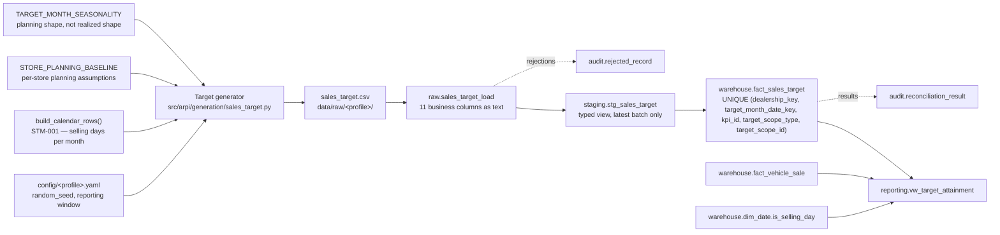

# STM-016 — Sales Target Fact

## Header

| Field | Value |
|---|---|
| **Mapping ID** | `STM-016` |
| **Title** | Sales target (monthly operating plan) |
| **Status** | **Implemented** — generator, column contract, data-quality suite, raw table, staging views, warehouse fact, fact load, reconciliations and reporting view all exist and run on every pipeline execution. |
| **Version** | 1.0 |
| **Date** | 2026-08-07 |
| **Owner** | Michael Palmer |
| **Source system** | `arpi_synthetic_generator` |
| **Source entity** | `sales_target` |
| **Target object** | `warehouse.fact_sales_target` |
| **Declared grain** | **One row per dealership, per target scope, per targeted KPI, per calendar month.** |
| **Phase** | Dealer Operations Command Center, delivery increment `DASH.5` |
| **Intermediate objects** | `raw.sales_target_load` (`sql/01_raw/15_raw_sales_target_load.sql`), `staging.stg_sales_target` (`sql/02_staging/16_stg_sales_target.sql`) |
| **Downstream objects** | `reporting.vw_target_attainment` (`sql/05_reporting/44_vw_target_attainment.sql`), `KPI-TGT-001` … `KPI-TGT-010`, the `target-attainment` dashboard dataset |
| **Authorizing decision** | [ADR-0013 §Decision](../architecture-decisions/ADR-0013-governed-web-operating-console.md) and [DASHBOARD_PROGRAM.md §9.8](../requirements/DASHBOARD_PROGRAM.md). Gate 4 evidence: [STAKEHOLDER_QUESTIONS.md `SQ-31`](../requirements/STAKEHOLDER_QUESTIONS.md). |

---

## 1. Purpose

`warehouse.fact_sales_target` is ARPI's first management-planning domain. Every other fact records
what happened; this one records what was **committed to**. It is the denominator of attainment and
the reference line of pace, and it is what makes `SQ-31` — *are we hitting our operating targets, by
store and by department?* — answerable.

### 1.1 The three properties this mapping exists to protect

**Every value is a synthetic internal operating goal for the fictional Granite Auto Group.** It is
not an industry benchmark, not a manufacturer objective, not a market standard and not any real
dealership's plan. No surface may describe a target — or an attainment against one — as good,
average, standard or recommended. The constraint is stated on the table's `COMMENT`, on the view's
`COMMENT`, in the export's dataset notes, and visibly on every console surface that shows one.

**The plan is computed without reading the result.** A target derived from the outcome it measures is
a tautology dressed as a measurement. Section 4.1 states the rule and section 8 states how it is
enforced.

**`kpi_id` names the metric being TARGETED, never the target KPI.** A row planning the month's retail
units carries `KPI-SLS-001`; `KPI-TGT-001` is the governed measure computed *from* such rows. Storing
`KPI-TGT-001` here would make the fact describe its own consumer, and a `CHECK` constraint refuses it.

---

## 2. Lineage



**Ordered lineage statement**

1. The generator rebuilds the **selling-day calendar** with `build_calendar_rows()` — the one
   implementation of the ADR-0002 rule — and counts governed selling days per month. No second
   calendar is defined anywhere.
2. It reads the store list from `arpi.generation.dealership.STORE_DEFINITIONS` and each store's
   planning assumptions from `STORE_PLANNING_BASELINE`.
3. It seeds a dedicated generator from the `sales_target` namespace, so adding this entity perturbs
   no other entity's draws.
4. For each active store and each month in the window it computes the **unit plan** (section 4.2),
   the **gross plan** (section 4.3), and the **two department gross plans** that partition the gross
   plan exactly (section 4.4).
5. Rows are sorted by `(dealership_id, target_month_date_key, target_scope_type, target_scope_id,
   kpi_id)` and `sales_target_id` is assigned as an ordinal over that order.
6. The CSV lands in `raw.sales_target_load`; `staging.stg_sales_target` types, validates and
   deduplicates it; `sql/04_facts/16_fact_sales_target_load.sql` resolves the surrogate keys and
   upserts on the declared grain.
7. `reporting.vw_target_attainment` publishes the plan beside the month-to-date actual and the
   selling-day arithmetic.

**The direction the arrow does NOT go.** Nothing in this lineage reads `sale_event`,
`warehouse.fact_vehicle_sale` or any realized figure. The sale fact appears in the diagram only
where it belongs: at the **reporting** layer, as the actual the plan is compared against.

---

## 3. Mapping table

All 11 columns of the source entity, in declared order.

| Source field | Source type | Target field | Target type | Transformation | Default behaviour | Validation | Rejection behaviour | Lineage field | Owner |
|---|---|---|---|---|---|---|---|---|---|
| `sales_target_id` | `text` | *(natural key, retained for lineage)* | `varchar(16)` | Direct, format `TGT-########`. The fact's surrogate `sales_target_key` is warehouse-assigned; this is the natural key a rejection names. | `n/a — required` | Unique within the batch | `REJ-KEY-001` on duplicate; the highest `raw_record_id` survives | `load_batch_id`, `source_row_number` | Target generator |
| `target_month_date_key` | `text` | `target_month_date_key` | `integer` FK | Cast to `integer`. **`YYYYMM01` — always the first day of the month.** Resolves to `dim_date.date_key`. | `n/a — required` | `DQ-TGT-003` first of month; `DQ-TGT-004` inside the window | `REJ-TYPE-001` if not castable; `REJ-DOMAIN-001` if not a month start; excluded by the load's inner join if absent from `dim_date` | `load_batch_id` | Target generator |
| `dealership_id` | `text` | `dealership_key` | `integer` FK | Resolved to `dim_dealership.dealership_key` **as at the first day of the target month** (SCD Type 2). | `n/a — required` | `DQ-TGT-008` resolves | Excluded by the load's inner join if it does not resolve | `load_batch_id` | Target generator |
| `target_scope_type` | `text` | `target_scope_type` | `varchar(12)` | Direct. `Store`, `Department` or `Employee`. **Part of the declared grain.** | `n/a — required` | `DQ-TGT-005`; `ck_fact_sales_target_scope_type_domain` | `REJ-DOMAIN-001` outside the vocabulary | `load_batch_id` | Target generator |
| `target_scope_id` | `text` | `target_scope_id` | `varchar(40)` | Direct. The scope's own business identity: the `dealership_id`, the department name, or the `employee_id`. **NOT NULL on every scope type** — see section 4.6. **Part of the declared grain.** | `n/a — required` | `DQ-TGT-006`; staging's cross-table rule | `REJ-DOMAIN-001` when it contradicts the scope type | `load_batch_id` | Target generator |
| `department_name` | `text` | `department_name` | `varchar(20)` | Direct, `Sales` or `Finance`. **Populated exactly on Department scope**, NULL on every other. | `NULL — non-Department scopes` | `DQ-TGT-006`; `ck_fact_sales_target_department_scope_coupling`, `ck_fact_sales_target_department_identity` | `REJ-DOMAIN-001` when present on the wrong scope, absent on Department scope, or disagreeing with `target_scope_id` | `load_batch_id` | Target generator |
| `employee_id` | `text` | `employee_key` | `integer` FK, nullable | Resolved to `dim_employee.employee_key`. **Populated exactly on Employee scope**, NULL on every other. **DASH.5 emits none** (section 6). | `NULL — non-Employee scopes` | `DQ-TGT-006`; `ck_fact_sales_target_employee_scope_coupling` | `REJ-DOMAIN-001` when present on the wrong scope or absent on Employee scope; an Employee-scope row whose employee does not resolve is dropped by the load rather than violating the coupling constraint | `load_batch_id` | Target generator |
| `kpi_id` | `text` | `kpi_id` | `varchar(16)` | Direct. **The metric BEING TARGETED**: `KPI-SLS-001`, `KPI-GRS-001`, `KPI-GRS-002` or `KPI-GRS-003`. **Never a `KPI-TGT` identifier.** **Part of the declared grain.** | `n/a — required` | `DQ-TGT-007`; `ck_fact_sales_target_kpi_domain`, `ck_fact_sales_target_scope_metric` | `REJ-DOMAIN-001` outside the vocabulary or outside the scope's permitted metrics | `load_batch_id` | Target generator |
| `target_value` | `text` | `target_value` | `numeric(14,2)` | Cast to `numeric(14,2)`. Generated as a **`Decimal` quantized once with `ROUND_HALF_UP`** — no Python float ever touches it. A unit target is a whole number carried at cent scale (`57.00`). | `n/a — required` | `DQ-TGT-009` ≥ 0; `DQ-TGT-011` exact to two places | `REJ-TYPE-001` if not castable; `REJ-DOMAIN-001` if negative | `load_batch_id` | Target generator |
| `stretch_target_value` | `text` | `stretch_target_value` | `numeric(14,2)` | Cast to `numeric(14,2)`. Never below `target_value`; equality is permitted (section 4.5). | `n/a — required` | `DQ-TGT-010`; `ck_fact_sales_target_stretch_not_below_target` | `REJ-DOMAIN-001` if beneath the committed target | `load_batch_id` | Target generator |
| `source_system` | `text` | `source_system` | `varchar(40)` | **Constant** `arpi_synthetic_generator`. | `n/a — constant` | `DQ-TGT-013` | `REJ-NULL-001` if absent | itself | Target generator |
| *(database)* | — | `sales_target_key` | `bigint` PK | Warehouse-assigned surrogate, deterministic by the declared grain order. | `n/a — database-assigned` | PK uniqueness | n/a | itself | Database |
| *(database)* | — | `raw_record_id` | `bigserial` | Database-assigned. **Raw layer only.** | `n/a — database-assigned` | PK uniqueness | n/a | itself | Database |
| *(load process)* | — | `load_batch_id` | `uuid` | Assigned once per load. **Raw and staging layers only.** | `n/a — required` | Not null | n/a | itself | Loader |
| *(load process)* | — | `source_file_name` | `text` | `sales_target.csv`. **Raw and staging layers only.** | `n/a — required` | Not null | n/a | itself | Loader |
| *(load process)* | — | `source_row_number` | `integer` | 1-based data-row number. **Raw and staging layers only.** | `n/a — required` | Not null; ≥ 1 | n/a | itself | Loader |
| *(database)* | — | `ingested_at` | `timestamptz` | `DEFAULT now()`. **Raw and staging layers only.** | `now()` | Not null | n/a | itself | Database |

> **Prohibited target fields.** No employee name, pay plan, commission, quota-attainment bonus,
> compensation figure or contact detail, and no real dealership's or manufacturer's target. `DQ-TGT-014`
> inspects the **schema** and fails the run even when a prohibited column is empty.
> `department_name` is allowlisted in `arpi.constants.APPROVED_NAME_COLUMNS` with a written
> justification: it names an organisational unit, never a person.

---

## 4. Derivation reference

### 4.1 The rule that shapes the whole generator: no outcome leakage

A plan computed from the result it measures is not a plan. If the generator emitted
`actual × 1.05`, every attainment figure on the console would be a restatement of the same number,
and the page would present a tautology as a management measurement.

The generator's inputs are therefore **exogenous only**:

| Input | Source | Why it is exogenous |
|---|---|---|
| Governed selling days per month | `arpi.generation.calendar.build_calendar_rows` | Deterministic, seed-free, owned by ADR-0002. A calendar is knowable before a month starts. |
| Store planning baseline | `STORE_PLANNING_BASELINE` | Fixed per-store operating-model assumptions, the same class of input `arpi.generation.vehicle.STORE_SHARE` is. |
| Planning seasonality | `TARGET_MONTH_SEASONALITY` | A declared month-of-year planning shape. Deliberately **smoother** than the realized weighting in `arpi.generation.sale.SALE_MONTH_WEIGHT`: a plan written before the month cannot know the month's actual shape, and copying the realized weights would be a subtler form of the same leakage. |
| Seeded planning variation | `rng_for(master_seed, "sales_target")` | The desk's judgement, modelled as bounded reproducible noise. |

**It is a permitted design that the target generator and the sale generator consume the same
exogenous store-scale assumptions.** It is not permitted for target generation to consume finalized
sale rows. Section 8 records how the rule is enforced rather than promised.

### 4.2 The unit plan

```
target_units = round_half_up(
    units_per_selling_day[store]
  × selling_days_in_month
  × planning_seasonality[month]
  × (1 + Uniform(-0.055, +0.055))
)
```

Planning by **selling day** rather than by calendar day is how a dealership actually writes a monthly
plan: a 30-selling-day month is a bigger commitment than a 28-selling-day one, and the difference is
knowable in advance.

The result is quantized to a whole number and restated at cent scale, so `57` is emitted as `57.00`.
A store does not commit to two-fifths of a car.

### 4.3 The gross plan

```
target_gross = round_half_up_to_cents(
    target_units
  × planned_total_gross_per_unit[store]
  × (1 + Uniform(-0.060, +0.060))
)
```

The unit variation and the gross variation are **independent draws**. Perfect proportionality would
make every planned per-unit gross identical and the plan structurally uninformative.

### 4.4 The department split, and why it is exact

```
sales_department_target   = round_half_up_to_cents(target_gross × planned_front_gross_share[store])
finance_department_target = target_gross − sales_department_target
```

Finance carries the **remainder** rather than an independently rounded share, so the two sum to the
store plan to the cent by construction rather than by a rounding coincidence. That mirrors the sale
fact's own `total_gross = front_end_gross + back_end_gross` CHECK constraint, which is what makes the
two department **actuals** an exact partition of the store actual as well.

### 4.5 The stretch target

```
stretch = round_half_up(target × 1.08)
```

Whole units for a unit plan, cents for a gross plan. `ck_fact_sales_target_stretch_not_below_target`
permits equality: a one-unit target multiplied by the stretch factor rounds back to one unit, and
refusing that would forbid a legitimate small-store plan.

### 4.6 The scope model, and the NULL problem it solves

PostgreSQL treats NULLs as **distinct** in a UNIQUE constraint. A grain expressed over a nullable
scope column would therefore permit unlimited duplicate logical rows while the constraint sat on the
table looking like it was working.

So `target_scope_id` is **NOT NULL on every scope type** and carries the scope's own business
identity. The grain constraint is over five NOT NULL columns and really enforces the declared grain.

| Scope | `target_scope_id` | `department_name` | `employee_key` | Permitted metrics |
|---|---|---|---|---|
| `Store` | the store's own `dealership_id` | NULL | NULL | `KPI-SLS-001`, `KPI-GRS-003` |
| `Department` | the department name | `Sales` or `Finance` | NULL | `Sales` → `KPI-GRS-001`; `Finance` → `KPI-GRS-002` |
| `Employee` | the employee's synthetic identifier | NULL | the resolved key | `KPI-SLS-001` |

**Every rule above that can be decided from one row's own columns is a CHECK constraint.** Exactly
one cannot: a Store-scope row's `target_scope_id` must be its OWN store's `dealership_id`, and
`dealership_id` lives in another table. A CHECK cannot read another table and a trigger would be a
hidden second load path, so that rule is a `REJ-DOMAIN-001` rejection in
`staging.stg_sales_target`, asserted by `DQ-TGT-006` and by
`tests/integration/test_target_ingestion.py::test_a_store_scope_row_naming_another_store_is_rejected`.

### 4.7 Why retail units are store-scope only

A retail unit is delivered **once**. A Sales-department unit target would reproduce the store target
and a Finance-department one would count the same car a second time. Dealership practice is the same:
F&I measures are computed *per* the sales department's unit count, never on a second unit count of
their own. `ck_fact_sales_target_scope_metric` refuses the row.

### 4.8 Which departments the domain supports, and why only two

`dim_employee.department` carries five values. A department target needs a department **actual**, and
the actual must be attributable without double counting.

| Department | Owns a component of the store's result? | Target permitted |
|---|---|---|
| Sales | Yes — front-end gross | **Yes** (`KPI-GRS-001`) |
| Finance | Yes — back-end gross | **Yes** (`KPI-GRS-002`) |
| BDC | No — measured in the lead funnel, produces no gross line | No |
| Management | No — accountable for the store line rather than a separate one | No |
| Service | No — `warehouse.fact_service_visit` is Deferred (`SQ-29`) | No |

A target for a department with no numerator would be a denominator with nothing to divide into it.
The `CHECK` constraint refuses one, so the boundary is physical rather than conventional.

### 4.9 Row volume

| Profile | Window | Store-months | Target rows |
|---|---|---:|---:|
| test | 2025-01-01 .. 2025-02-28 | 6 | 24 |
| development | 2025-07-01 .. 2025-12-31 | 18 | 72 |
| portfolio | 2024-01-01 .. 2025-12-31 | 72 | 288 |

Four rows per store-month: two store plans and two department refinements.

### 4.10 Plausibility of the committed development profile

The plan is calibrated from exogenous inputs, and the committed profile contains **both operating
states in both measures**: store-months above the unit plan and below it, and store-months above the
gross plan and below it. Group attainment lands in the low-to-mid nineties for both measures, which is
a credible operating story for a group that planned slightly ahead of what it delivered.

**None of that was achieved by reading the actuals during generation.** The baselines were tuned as
generator calibration — an author choosing plausible planning assumptions — and the generator itself
has never seen a sale row.

---

## 5. Load strategy

| Layer | Strategy | Write semantics |
|---|---|---|
| CSV | Overwrite | Byte-identical between runs of the same profile and seed. |
| `raw.sales_target_load` | **Truncate-and-reload per batch** | Reloaded from the current CSV and stamped with a fresh `load_batch_id`. |
| `staging.stg_sales_target` | **View** (`CREATE OR REPLACE VIEW`) | No data written. Casts, validates, enforces the cross-table scope rule, deduplicates, and filters to the newest batch. |
| `warehouse.fact_sales_target` | **Upsert on the declared grain** | `ON CONFLICT (dealership_key, target_month_date_key, kpi_id, target_scope_type, target_scope_id) DO UPDATE`, guarded by an `IS DISTINCT FROM` predicate so an unchanged rerun writes zero rows. |

**A later planning revision replaces the row rather than adding one.** A plan is a current statement,
not an event log. Plan history is **Out of scope**; a future increment that needs it would add an
effective-dated scope through an ADR, not by relaxing the grain.

---

## 6. The Employee scope decision, recorded

`DASH.5` generates **no** employee-scope target row, and the decision is deliberate rather than an
omission:

- **No registered stakeholder question requires one.** `SQ-31` asks for attainment by store and by
  department. Gate 4 permits a domain only where a question requires it, and that applies to a scope
  within a domain as much as to the domain itself.
- **`DASH.11` owns the employee-performance surface.** Shipping employee plans with no consumer would
  be data nobody can read, and a future increment would then inherit a population it did not design.
- **Privacy.** An employee-scope plan is still non-personal — `dim_employee` holds a synthetic
  identifier and no name, pay plan or contact detail — but a target attached to an individual invites
  the ranking `PRIVACY_AND_ETHICS.md` forbids, and the console has no surface that would frame it
  correctly yet.

The scope is nevertheless **physically supported**: the vocabulary is permanent, `employee_key` is
CHECK-coupled to the scope type and foreign-keyed to `warehouse.dim_employee`, the fact-load script
resolves it, and `reporting.vw_target_attainment` carries an employee row when one exists.
`tests/integration/test_kpi_verification.py::test_an_employee_scope_row_is_supported_and_is_not_a_store_addend`
plants one, proves the view resolves its numerator, and proves the store total ignores it. A later
increment can populate the scope without a migration.

---

## 7. Idempotency guarantees

| Guarantee | Mechanism |
|---|---|
| Rerunning with unchanged source produces **no new warehouse rows** | Upsert on the grain constraint with an `IS DISTINCT FROM` guard. Asserted by `test_target_ingestion.py::test_reloading_an_unchanged_plan_writes_nothing`. |
| A revised plan **replaces** its row | Same upsert. Asserted by `test_a_revised_plan_replaces_the_row_rather_than_adding_one`. |
| `sales_target_id` is stable across regenerations | An ordinal over the deterministic grain order, not an insertion counter. |
| Rerunning produces a **byte-identical CSV** | A dedicated `sales_target` seeding namespace, a deterministic row order and a fixed output format. |
| Generating targets cannot move another entity's digest | `rng_for(master_seed, "sales_target")` hashes the namespace rather than consuming a shared stream. |
| Verifiable by a third party | `content_digest` in `generation_manifest.json` is the SHA-256 of the CSV bytes. |

---

## 8. Validation checks gating the load

| Check ID | Assertion | Category | Severity |
|---|---|---|---|
| `DQ-TGT-001` | The declared grain is unique | `uniqueness` | critical |
| `DQ-TGT-002` | The frame matches the declared 11-column contract | `structural` | critical |
| `DQ-TGT-003` | `target_month_date_key` is the first day of its month | `business_rule` | critical |
| `DQ-TGT-004` | Every target month lies inside the reporting window | `referential` | critical |
| `DQ-TGT-005` | `target_scope_type` is in its governed vocabulary | `business_rule` | critical |
| `DQ-TGT-006` | The scope identity columns agree with the scope type | `completeness` | critical |
| `DQ-TGT-007` | `kpi_id` names a metric the row's scope may target | `business_rule` | critical |
| `DQ-TGT-008` | `dealership_id` resolves to a governed store | `referential` | critical |
| `DQ-TGT-009` | No target or stretch target is negative | `business_rule` | critical |
| `DQ-TGT-010` | The stretch goal is never beneath the committed goal | `business_rule` | critical |
| `DQ-TGT-011` | Every value is an exact `Decimal` at two decimal places | `business_rule` | critical |
| `DQ-TGT-012` | Department gross plans sum exactly to the store gross plan | `business_rule` | critical |
| `DQ-TGT-013` | `source_system` is the synthetic generator | `business_rule` | critical |
| `DQ-TGT-014` | No prohibited personal-data column is present (schema inspection) | `privacy` | critical |

All fourteen are `critical` and `python`-layer: they are declared once in
`src/arpi/generation/sales_target.py` and registered at import time. The SQL-side guards are the
fact's `CHECK` constraints, the staging domain rules and the `RECON-TGT-*` family, which are
different mechanisms rather than a second implementation of the same identifiers.

**Two additional guards prove the no-leakage rule** in
`tests/unit/test_sales_target_generation.py`:

- `test_the_generator_never_reads_a_realized_sale` walks the module's import graph — directly and one
  level transitively — and fails on any dependency that carries realized sales.
- `test_the_plan_is_unchanged_when_the_sale_generator_is_unavailable` makes
  `arpi.generation.sale` unimportable and requires the emitted plan to be byte-identical, which
  catches a lazy or deferred read that a static scan would miss.

---

## 9. Reconciliations

| Reconciliation ID | Description | Left | Right | Tolerance |
|---|---|---|---|---|
| `RECON-FACT-SALES-TARGET-WAREHOUSE` | Every accepted staging row reaches the warehouse | `staging.stg_sales_target` count | `warehouse.fact_sales_target` count | 0 (exact) |
| `RECON-TGT-GRAIN` | The declared grain is the real grain | fact row count | distinct grain count | 0 (exact) |
| `RECON-TGT-UNITS` | Store-scope unit plan, warehouse against reporting | fact sum | view sum | 0 (exact) |
| `RECON-TGT-GROSS` | Store-scope gross plan, warehouse against reporting | fact sum | view sum | 0.01 |
| `RECON-TGT-DEPT-SPLIT` | Department plans partition the store gross plan, per store-month | conforming store-months | store-months | 0 (exact) |
| `RECON-TGT-STORE-TOTALS` | Plan totals agree per store | conforming stores | stores | 0 (exact) |
| `RECON-TGT-MONTH-TOTALS` | Plan totals agree per month | conforming months | months | 0 (exact) |
| `RECON-REPORT-TARGET-ROWS` | The reporting view does not fan out, and carries every plan row | view rows | distinct declared grain | 0 (exact) |
| `RECON-TGT-ACTUAL-UNITS` | The unit numerator IS `KPI-SLS-001` | view numerator sum | `fact_vehicle_sale` retail units | 0 (exact) |
| `RECON-TGT-ACTUAL-GROSS` | The gross numerator IS `KPI-GRS-003` | view numerator sum | `fact_vehicle_sale` retail total gross | 0.01 |

All ten are unioned into `audit.vw_recon_all` and recorded on every pipeline run. Every one carries a
**seeded corruption case** in `tests/integration/test_reconciliations.py`: a rule that cannot fail is
decoration.

---

## 10. Rejection handling

| Condition | `REJ-*` code | Outcome |
|---|---|---|
| A value cannot be cast to its governed type | `REJ-TYPE-001` | Row rejected; run fails |
| A required value is absent | `REJ-NULL-001` | Row rejected; run fails |
| `target_scope_type` or `kpi_id` outside its vocabulary | `REJ-DOMAIN-001` | Row rejected; run fails |
| `target_month_date_key` is not the first day of a month | `REJ-DOMAIN-001` | Row rejected; run fails |
| A negative target, or a stretch beneath the target | `REJ-DOMAIN-001` | Row rejected; run fails |
| **A Store-scope row naming another store** | `REJ-DOMAIN-001` | Row rejected; run fails. The cross-table rule a CHECK cannot express. |
| A scope carrying the wrong refinement column | `REJ-DOMAIN-001` | Row rejected; run fails |
| A scope targeting a metric it does not own | `REJ-DOMAIN-001` | Row rejected; run fails |
| Duplicate `sales_target_id` in the batch | `REJ-KEY-001` | Later row rejected; the highest `raw_record_id` survives |

Every rejection writes a row to `audit.rejected_record` with `source_entity = 'sales_target'`,
`source_record_key` = the offending `sales_target_id`, and a redacted `record_payload`.

> **Rejection tolerance is zero.** `validation.max_rejected_record_ratio = 0.0`.

---

## 11. Privacy class

**Non-personal.** The fact carries no name, no compensation, no contact detail and no customer
reference. An employee-scope row — which `DASH.5` does not generate — would carry a surrogate key into
`warehouse.dim_employee`, which itself holds a synthetic identifier and none of those things.

**The dashboard export publishes no employee column at all**, and
`tests/integration/test_target_ingestion.py::test_the_view_publishes_no_person_and_no_surrogate_employee_key`
asserts it against the reporting view rather than against the intent.

---

## 12. Downstream reporting ownership

`reporting.vw_target_attainment` owns every governed measure computed from this fact:
`KPI-TGT-001` … `KPI-TGT-010`, specified in [KPI_CATALOG.md §39](../../KPI_CATALOG.md). The view
publishes **numerators and denominators separately** so a group figure is `SUM(numerator) /
SUM(denominator)` and an average of store percentages cannot be formed from the exported data at all.

The `target-attainment` dashboard dataset is the console's only door to this domain; its contract is
in [DATA_CONTRACT.md §3.2](../dashboard/DATA_CONTRACT.md).

---

## 13. Open questions and known gaps

- **No plan history.** A revised plan replaces its row. The question "what did we commit to at the
  start of the month, before the revision?" is not answerable, and a future increment that needs it
  must add an effective-dated scope through an ADR rather than by relaxing the grain.
- **One selling-day calendar for three stores.** ADR-0002's rule is group-wide. A real group would
  carry a calendar per store, and every pace figure here inherits the simplification.
- **No Power BI measure.** The semantic model has no relationship to this fact and no `KPI-TGT`
  measure. That is deliberate: the model is awaiting real-engine validation and adding measures before
  it would change what is being validated. See [KPI_CATALOG.md §39.2](../../KPI_CATALOG.md).
- **Employee scope is unpopulated.** Recorded in section 6.
