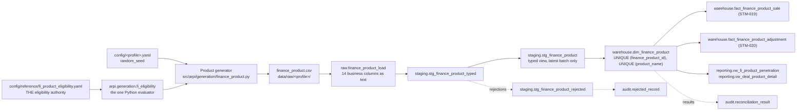

# STM-017 — Finance Product Dimension

## Header

| Field | Value |
|---|---|
| **Mapping ID** | `STM-017` |
| **Title** | Finance product catalogue (the governed F&I menu) |
| **Status** | **Implemented** — generator, column contract, data-quality suite, raw table, staging views, warehouse dimension and merge all exist and run on every pipeline execution. |
| **Version** | 1.0 |
| **Date** | 2026-08-08 |
| **Owner** | Michael Palmer |
| **Source system** | `arpi_synthetic_generator` |
| **Source entity** | `finance_product` |
| **Target object** | `warehouse.dim_finance_product` |
| **Declared grain** | **One row per finance product definition.** |
| **Phase** | Dealer Operations Command Center, delivery increment `DASH.6` |
| **Intermediate objects** | `raw.finance_product_load` (`sql/01_raw/16_raw_finance_product_load.sql`), `staging.stg_finance_product_typed` / `staging.stg_finance_product` / `staging.stg_finance_product_rejected` (`sql/02_staging/17_stg_finance_product.sql`) |
| **Load script** | `sql/03_dimensions/21_dim_finance_product_merge.sql` |
| **Downstream objects** | `warehouse.fact_finance_product_sale` (STM-019), `warehouse.fact_finance_product_adjustment` (STM-020), `reporting.vw_deal_product_detail`, `reporting.vw_fi_product_penetration`, `reporting.vw_fi_adjustment_summary`, `KPI-FNI-003` … `KPI-FNI-011`, `KPI-FNI-020`, `KPI-FNI-021` |
| **Authorizing decision** | [ADR-0006 §Decision](../architecture-decisions/ADR-0006-scd-type-selection-phase-1.md) (SCD Type 1) and [ADR-0013 §Decision](../architecture-decisions/ADR-0013-governed-web-operating-console.md). Programme scope: [DASHBOARD_PROGRAM.md §9](../requirements/DASHBOARD_PROGRAM.md). Gate 4 evidence: [STAKEHOLDER_QUESTIONS.md `SQ-21`](../requirements/STAKEHOLDER_QUESTIONS.md). |

---

## 1. Purpose

`warehouse.dim_finance_product` is the catalogue of every F&I product the fictional Granite Auto
Group offers. It is the dimension that makes `SQ-21` — *what is our F&I performance, by product and
by store?* — answerable at all, because without it a product contract has a price and no identity.

It is also the object that decides the shape of the entire F&I domain, and three of those decisions
are load-bearing enough to state before the mapping table.

### 1.1 Categories are rows, never columns

`product_category` takes one of the **ten governed values** in
`arpi.constants.FINANCE_PRODUCT_CATEGORIES`, and there is no `vsc_gross`, `gap_gross` or
`tire_wheel_gross` column anywhere in ARPI. A category-per-column model makes the eleventh category
a schema migration instead of a catalogue row, and it cannot answer "which categories exist?"
without reading the schema. `ck_dim_finance_product_category_domain` closes the vocabulary;
`DQ-FPD-005` proves all ten are represented.

**"Extended warranty" is a permitted user-facing alias for Vehicle Service Contract and never a
stored value.** The stored value is always `Vehicle Service Contract`.

### 1.2 The provider decision (DASH.6-01): an attribute, not a dimension

`provider_name` is a **column here, not a foreign key** into a
`warehouse.dim_finance_product_provider` that does not exist. In ARPI's model a provider has no
behaviour independent of the product it administers: cancellation and chargeback sensitivity belong
to the product, the provider mix *is* the product mix, and no fact needs a provider key that
`finance_product_key` does not already resolve. A dimension would add a join, a merge script, an
STM and a `DQ-*` family in exchange for an attribute lookup.

**Consequence, recorded honestly:** a provider-level rollup joins through the product rather than
directly, and a provider that administered zero products could not be represented. Neither costs
anything at this scale. Promoting the provider later requires **no change to any fact**, because no
fact carries a provider key today. **STM-021 is reserved for that promotion and remains Deferred.**

### 1.3 Eligibility has one authority, and it is not this table

[`config/reference/fi_product_eligibility.yaml`](../../config/reference/fi_product_eligibility.yaml)
is the single authority for "could this product have been written on this deal?".
`eligibility_rule_id` is **stamped** from it, and `eligible_finance_structures` /
`eligible_vehicle_conditions` are **derived** from it as descriptive metadata. Because they are
derived they cannot disagree with it, and `DQ-FPD-006` proves they do not.

Every one of the ten categories resolves to **exactly one** rule — not zero, and not two. Zero would
leave a penetration figure with no denominator; two would let the same figure be computed two ways.

### 1.4 What is deliberately absent

No price, no cost, no rate, no commission, no remittance schedule, no reserve formula. A price here
would be a **second authority** beside the price actually struck on the contract, and the day the
two disagreed nobody could say which one was the sale. The catalogue carries only latent generation
parameters (`gross_weight`, `dealer_cost_ratio`, `attach_affinity`) which live in Python and **are
never columns** — the CSV contract in section 3 is the whole of what leaves the generator.

---

## 2. Lineage

**Ordered lineage statement**

1. `arpi.generation.fi_eligibility` loads the governed eligibility configuration, refuses a file
   that is not a partition over the ten categories, and refuses a rule naming `Wholesale` or
   `Dealer Trade`.
2. `arpi.generation.finance_product` declares **19 product definitions** across all ten categories,
   each naming one of four **fictional administrators**. Each definition asks the evaluator for its
   category's rule and stamps `eligibility_rule_id`; `eligible_finance_structures` and
   `eligible_vehicle_conditions` are rendered from the same rule as sorted pipe-delimited text.
3. The catalogue is **deterministic and non-random**: it consumes no variate at all. There is no
   `rng_for(seed, "finance_product")` call, because a menu is a declared fact about the group and
   not a sampled one. Reseeding the profile does not change one byte of it.
4. Rows are ordered by `finance_product_id` and the generator-side `finance_product_key` ordinal is
   assigned over that order.
5. The CSV lands in `raw.finance_product_load` with every business column as `text`.
6. `staging.stg_finance_product_typed` casts, validates and classifies; `staging.stg_finance_product`
   exposes the accepted rows of the most recent `load_batch_id`;
   `staging.stg_finance_product_rejected` carries the rest with a `REJ-*` code and payload.
7. `sql/03_dimensions/21_dim_finance_product_merge.sql` performs a **Type 1** merge on
   `finance_product_id`.
8. The fact tables in STM-019 and STM-020 resolve `finance_product_key` against it; the reporting
   views join it for category, name and eligibility rule.

---

## 3. Mapping table

All 14 business columns of the source entity, in declared order, plus the lineage columns.

| Source field | Source type | Target field | Target type | Transformation | Default behaviour | Validation | Rejection behaviour | Lineage field | Owner |
|---|---|---|---|---|---|---|---|---|---|
| `finance_product_key` | `text` | *(ignored on load)* | — | **Deliberately discarded.** The generator emits an ordinal for readability of the committed CSV; the warehouse assigns its own surrogate. Staging exposes it as lineage only. | `n/a — required in the CSV` | Positive integer in staging | `REJ-TYPE-001` if not castable | `load_batch_id` | Generator (value), Database (authority) |
| `finance_product_id` | `text` | `finance_product_id` | `varchar(16)` | Direct, format `FP-###`. **The natural key** every product contract resolves through and the merge matches on. | `n/a — required` | `DQ-FPD-001` unique; `uq_dim_finance_product_finance_product_id`; `ck_dim_finance_product_id_not_blank` | `REJ-NULL-001` if blank; `REJ-KEY-001` on duplicate within the batch — the highest `raw_record_id` survives | `load_batch_id`, `source_row_number` | Product generator |
| `product_name` | `text` | `product_name` | `varchar(80)` | Direct. A **fictional** product label such as `Granite Shield Powertrain Plus`. **Unique** — two identical names make a category mix unreadable. | `n/a — required` | `uq_dim_finance_product_product_name` | `REJ-NULL-001` if blank; `REJ-KEY-001` on duplicate | `load_batch_id` | Product generator |
| `product_category` | `text` | `product_category` | `varchar(40)` | Direct. One of the **ten governed categories**. **A row value, never a column.** | `n/a — required` | `DQ-FPD-003`; `DQ-FPD-005` (all ten present); `ck_dim_finance_product_category_domain` | `REJ-DOMAIN-001` outside the vocabulary | `load_batch_id` | Product generator |
| `provider_name` | `text` | `provider_name` | `varchar(60)` | Direct. One of the four declared **fictional administrators**. An **attribute by deliberate decision** (§1.2). | `n/a — required` | `DQ-FPD-004` (closed set); `ck_dim_finance_product_provider_not_blank` | `REJ-DOMAIN-001` outside the declared set | `load_batch_id` | Product generator |
| `eligibility_rule_id` | `text` | `eligibility_rule_id` | `varchar(16)` | **Stamped** from `config/reference/fi_product_eligibility.yaml` by looking up the product's category. One of `ELIG-VSC`, `ELIG-GAP`, `ELIG-TW`, `ELIG-PPM`, `ELIG-LWP`, `ELIG-OTH`. | `n/a — required` | `DQ-FPD-006`; `ck_dim_finance_product_eligibility_rule_domain` | `REJ-DOMAIN-001` outside the vocabulary; a rule that is not the category's own is a `DQ-FPD-006` critical failure, not a row rejection | `load_batch_id` | Eligibility configuration |
| `eligible_finance_structures` | `text` | `eligible_finance_structures` | `varchar(60)` | **Derived** from the stamped rule: the rule's structures, sorted, joined with `' \| '` (e.g. `Cash \| Lease \| Retail Finance`). **Descriptive metadata, not an authority.** | `n/a — required` | `DQ-FPD-006` (must reproduce the configuration exactly) | `REJ-NULL-001` if blank | `load_batch_id` | Eligibility configuration |
| `eligible_vehicle_conditions` | `text` | `eligible_vehicle_conditions` | `varchar(40)` | **Derived** the same way (e.g. `Certified \| New \| Used`). `ELIG-PPM` narrows to `Certified \| New`, which is why a used-heavy store has a structurally smaller Prepaid Maintenance denominator. | `n/a — required` | `DQ-FPD-006` | `REJ-NULL-001` if blank | `load_batch_id` | Eligibility configuration |
| `default_contract_term_months` | `text` | `default_contract_term_months` | `smallint` | Cast to `smallint`. **The PRODUCT CONTRACT's default coverage term.** **This is not a finance loan term** — ARPI models no loan term, no APR, no payment and no rate, and the two must never be conflated. | `n/a — required` | `DQ-FPD-008` in `[12, 120]`; `ck_dim_finance_product_contract_term_range` | `REJ-TYPE-001` if not castable; `REJ-DOMAIN-001` outside the range | `load_batch_id` | Product generator |
| `cancellation_sensitive` | `text` | `cancellation_sensitive` | `boolean` | Cast from lowercase `true`/`false`. **Behavioural, not descriptive**: STM-020's generator emits no `Cancellation` against a product where this is `false`, and `DQ-FPA-011` asserts it. A `false` value means a cancellation on this product is a **defect**, not an unusual event. | `n/a — required` | `DQ-FPD-009` (boolean, and both values occur) | `REJ-TYPE-001` if not castable | `load_batch_id` | Product generator |
| `chargeback_sensitive` | `text` | `chargeback_sensitive` | `boolean` | Cast the same way. Behavioural in the same way: no `Chargeback` is emitted against a product where this is `false`. | `n/a — required` | `DQ-FPD-009` | `REJ-TYPE-001` if not castable | `load_batch_id` | Product generator |
| `active_start_date` | `text` | `active_start_date` | `date` | Cast to `date`. First date the product was **offered**. **An attribute of the product, not an SCD Type 2 effective date** — this table keeps no row history. | `n/a — required` | `DQ-FPD-007`; `ck_dim_finance_product_active_window_ordered` | `REJ-TYPE-001` if not castable | `load_batch_id` | Product generator |
| `active_end_date` | `text` | `active_end_date` | `date` | Cast to `date`. Last date offered, or the open-ended sentinel `9999-12-31`. | `n/a — required` | `DQ-FPD-007`; `ck_dim_finance_product_active_window_ordered` | `REJ-TYPE-001` if not castable; `REJ-DOMAIN-001` if before `active_start_date` | `load_batch_id` | Product generator |
| `is_active` | `text` | `is_active` | `boolean` | Cast from lowercase boolean. **Derived** as `active_end_date = DATE '9999-12-31'` and never assigned independently — a flag that can contradict its own dates lets a withdrawn product back into a current menu. | `n/a — required` | `DQ-FPD-007`; `ck_dim_finance_product_is_active_derivation` | `REJ-DOMAIN-001` when it disagrees with the dates | `load_batch_id` | Product generator |
| `source_system` | `text` | `source_system` | `varchar(40)` | **Constant** `arpi_synthetic_generator`. The lineage marker that stops an invented catalogue being read as a real dealership's menu. | `n/a — constant` | `DQ-FPD-011`; `ck_dim_finance_product_source_system_not_blank` | `REJ-NULL-001` if absent | itself | Product generator |
| *(database)* | — | `finance_product_key` | `integer` PK | Warehouse-assigned surrogate: `max(existing) + row_number() OVER (ORDER BY finance_product_id)` over rows new to the dimension. | `n/a — database-assigned` | `pk_dim_finance_product`; `ck_dim_finance_product_key_positive` | n/a | itself | Merge script |
| *(database)* | — | `raw_record_id` | `bigserial` | Database-assigned. **Raw layer only.** | `n/a — database-assigned` | PK uniqueness | n/a | itself | Database |
| *(load process)* | — | `load_batch_id` | `uuid` | Assigned once per load. **Raw and staging layers only.** | `n/a — required` | Not null | n/a | itself | Loader |
| *(load process)* | — | `source_file_name` | `text` | `finance_product.csv`. **Raw and staging layers only.** | `n/a — required` | Not null | n/a | itself | Loader |
| *(load process)* | — | `source_row_number` | `integer` | 1-based data-row number. **Raw and staging layers only.** | `n/a — required` | Not null; ≥ 1 | n/a | itself | Loader |
| *(database)* | — | `ingested_at` | `timestamptz` | `DEFAULT now()`. **Raw and staging layers only.** | `now()` | Not null | n/a | itself | Database |

> **Prohibited product fields.** No price, cost, rate, commission, reserve formula, remittance
> schedule or vendor contact detail, and **no personal data of any kind** — a product row describes a
> product. `DQ-FPD-012` inspects the **schema** and fails the run even when a prohibited column is
> empty, because the defect is claiming to model a mechanic the platform does not have.

---

## 4. Derivation reference

### 4.1 The catalogue is declared, not sampled

19 definitions across the ten categories, hard-declared in
`arpi.generation.finance_product.PRODUCT_DEFINITIONS`. The module consumes **no random variate**,
which is why the committed catalogue is byte-identical across every profile and across every seed
change. A menu is a statement about the group, not a draw from a distribution.

### 4.2 Category coverage, and why some categories have two products

| Category | Products | Rule |
|---|---|---|
| Vehicle Service Contract | `FP-001`, `FP-002`, `FP-003` | `ELIG-VSC` |
| GAP | `FP-004`, `FP-005` | `ELIG-GAP` |
| Tire & Wheel | `FP-006`, `FP-007` | `ELIG-TW` |
| Prepaid Maintenance | `FP-008`, `FP-009` | `ELIG-PPM` |
| Appearance Protection | `FP-010`, `FP-011` | `ELIG-OTH` |
| Key Replacement | `FP-012` | `ELIG-OTH` |
| Theft or Security Product | `FP-013` | `ELIG-OTH` |
| Paintless Dent Protection | `FP-014`, `FP-015` | `ELIG-OTH` |
| Lease Wear Protection | `FP-016`, `FP-017` | `ELIG-LWP` |
| Other Aftermarket Product | `FP-018`, `FP-019` | `ELIG-OTH` |

**Two distinct products inside one category is deliberate and load-bearing.** A windscreen plan and
a roadside plan are both Other Aftermarket Products, and STM-019's grain permits both on one deal.
That is precisely why every penetration measure counts **distinct deals** rather than contract rows.
Without it, "count the deal once" would be an identity on this dataset and the rule would be
untestable.

### 4.3 The four fictional administrators

`Granite Shield Administrators`, `Northbridge Protection Services`, `Keystone Vehicle Programs`,
`Summit Assurance Group`. Each appears on products in several categories, so a provider rollup is
not a category rollup wearing a different name. `DQ-FPD-004` closes the set;
`tests/unit/test_fi_privacy.py` asserts no committed provider name collides with a real
administrator a reader would recognise.

### 4.4 Sensitivity flags and what they license

`cancellation_sensitive` and `chargeback_sensitive` are the **only** behavioural attributes on the
catalogue, and both are consumed exclusively by STM-020's generator. Both values occur across the
catalogue (`DQ-FPD-009`), so the constraint they impose is actually exercised: cancellations
concentrate on the long-dated coverage products and never appear against, for example,
`Key Replacement`.

### 4.5 Row volume

**19 rows, on every profile.** The catalogue does not scale with the reporting window, the store
count or the seed.

---

## 5. Load strategy

| Layer | Strategy | Write semantics |
|---|---|---|
| CSV | overwrite | The generator rewrites `finance_product.csv` in full on every run. |
| `raw.finance_product_load` | append-by-batch | Every load appends with a new `load_batch_id`; prior batches are retained for lineage. |
| `staging.stg_finance_product` | view | Non-materialized. Exposes accepted rows of the **latest** `load_batch_id` only. |
| `warehouse.dim_finance_product` | **MERGE on natural key (SCD Type 1)** | `INSERT … ON CONFLICT (finance_product_id) DO UPDATE`, guarded so the update fires only when at least one attribute is `IS DISTINCT FROM` its stored value. |

**Matching:** on `finance_product_id`.
**On match:** every non-key attribute is overwritten **in place**; `finance_product_key` is never
reassigned.
**On no match:** a row is inserted with `finance_product_key = max(existing) + row_number() OVER
(ORDER BY finance_product_id)`.
**Expired or deleted:** nothing. A product withdrawn from the menu is expressed by
`active_end_date`, not by deleting the row — every historical contract still points at it.

### 5.1 Why Type 1 (ADR-0006)

A corrected product name, a restated eligibility rule or a repriced cost ratio describes what was
**always** true of the product, so it must apply retroactively. A Type 2 table here would produce
version rows no contract could meaningfully point at, and a consumer filtering on `is_current` would
silently lose every row. `DQ-FPD-010` asserts the absence of `effective_date`, `expiration_date`,
`is_current` and `attribute_hash`, so a future change that quietly introduced versioning fails the
run rather than the reader.

`active_start_date` / `active_end_date` are **not** versioning: they record when the product was
*offered*, which is an attribute of the product rather than of the row.

### 5.2 Why the surrogate key is computed rather than sequenced

Rebuilding a database from the same CSVs reproduces identical keys. A sequence would drift after any
rolled-back load, because sequences are non-transactional.

---

## 6. Idempotency guarantees

| Guarantee | Mechanism |
|---|---|
| Rerunning with identical source produces no new warehouse rows | `ON CONFLICT (finance_product_id) DO UPDATE`, with the update guarded by an `IS DISTINCT FROM` predicate over every attribute — an unchanged rerun writes **zero** rows and produces no dead tuples |
| Rerunning produces identical surrogate keys on a rebuilt database | Keys are `max(existing) + row_number() OVER (ORDER BY finance_product_id)`, not a sequence |
| A key is never reused or reassigned | Rows already present keep the key they were given; the source-side ordinal is discarded |
| An empty staging view is a no-op | The merge's `WITH src` produces no rows, so nothing is written |
| Load batches are uniquely identified | `load_batch_id uuid` |
| Audit history is preserved across reruns | `audit.pipeline_run` is insert-only |

---

## 7. Rejection handling

| Condition | `REJ-*` code | Outcome |
|---|---|---|
| A `text` value cannot be cast to its target type (`smallint`, `boolean`, `date`) | `REJ-TYPE-001` | Row rejected |
| A required business column is NULL or blank | `REJ-NULL-001` | Row rejected |
| `product_category` outside the ten governed values | `REJ-DOMAIN-001` | Row rejected |
| `eligibility_rule_id` outside the six governed rules | `REJ-DOMAIN-001` | Row rejected |
| `provider_name` outside the four declared administrators | `REJ-DOMAIN-001` | Row rejected |
| `default_contract_term_months` outside `[12, 120]` | `REJ-DOMAIN-001` | Row rejected |
| `active_end_date < active_start_date` | `REJ-DOMAIN-001` | Row rejected |
| `is_active` disagrees with `active_end_date` | `REJ-DOMAIN-001` | Row rejected |
| Duplicate `finance_product_id` within the load batch | `REJ-KEY-001` | The highest `raw_record_id` survives; the rest are rejected |
| Duplicate `product_name` within the load batch | `REJ-KEY-001` | Same resolution |

Rejected rows are written to `audit.rejected_record` with `source_entity`, `source_record_key`,
`rejection_code`, `rejection_reason` and `record_payload`. Tolerance is zero
(`validation.max_rejected_record_ratio = 0.0`), so **any** rejection fails the run: ARPI generates
its own source data, and a malformed catalogue row means a generator or mapping defect.

---

## 8. Validation checks gating the load

| Check ID | Assertion | Severity | Gate |
|---|---|---|---|
| `DQ-FPD-001` | `finance_product_id` is unique | critical | pre-load |
| `DQ-FPD-002` | The frame matches its declared column contract, in order | critical | pre-load |
| `DQ-FPD-003` | Every `product_category` is one of the ten governed categories | critical | pre-load |
| `DQ-FPD-004` | Every provider is one of the declared fictional administrators | critical | pre-load |
| `DQ-FPD-005` | All ten governed categories are represented by at least one product | critical | pre-load |
| `DQ-FPD-006` | Every product's `eligibility_rule_id` is its category's governed rule, and the derived structure/condition text reproduces the configuration exactly | critical | pre-load |
| `DQ-FPD-007` | `active_end_date` is never before `active_start_date`, and `is_active` agrees | critical | pre-load |
| `DQ-FPD-008` | `default_contract_term_months` is a plausible **product** contract term | critical | pre-load |
| `DQ-FPD-009` | `cancellation_sensitive` and `chargeback_sensitive` are booleans and both values occur | critical | pre-load |
| `DQ-FPD-010` | The dimension carries no Type 2 history columns | critical | pre-load |
| `DQ-FPD-011` | `source_system` is the synthetic generator | critical | pre-load |
| `DQ-FPD-012` | The dimension declares no prohibited personal-data column | critical | pre-load |

`DQ-FPD-001`, `-002`, `-003`, `-004` and `-012` are additionally re-evaluated **post-load** against
the warehouse table, so a defect introduced by the merge itself cannot pass.

---

## 9. Reconciliations

| Reconciliation ID | Description | Left | Right | Tolerance | Status |
|---|---|---|---|---|---|
| `RECON-FI-ELIGIBILITY` | Every contract's category is eligible under the rule this dimension stamps | `warehouse.fact_finance_product_sale` ⋈ `dim_finance_product` | `warehouse.fn_product_category_is_eligible` | `0` | **Implemented** |
| `RECON-FI-PRODUCT-GRAIN` | No deal carries the same `finance_product_key` twice | `warehouse.fact_finance_product_sale` | declared grain | `0` | **Implemented** |
| `RECON-REPORT-FI-PENETRATION-ROWS` | The penetration view neither invents nor loses a category row | `reporting.vw_fi_product_penetration` | `warehouse` | `0` | **Implemented** |

The dimension has **no row-count reconciliation of its own** by design: a declared 19-row catalogue
compared against itself is a tautology. What is worth reconciling is whether the catalogue's
*claims* hold downstream, which is what the three rules above do.

---

## 10. Privacy class

**Class: none.** A product row describes a product. There is no customer reference, no employee
reference, no free-text field and no personal data of any kind. `DQ-FPD-012` enforces this on the
schema.

**Every product and every administrator is fictional.** No real F&I product, program,
administrator, underwriter or vendor is named, and none may be added. The catalogue attaches
invented economics and invented cancellation behaviour to every row, and attaching those to a real
company's name would be a fabricated claim about that company.
`tests/unit/test_fi_privacy.py::test_no_committed_provider_name_collides_with_a_real_administrator`
is a **synthetic-catalogue contract test**, deliberately not a claim to detect every real
administrator in the world.

---

## 11. Downstream reporting ownership

| View | What it takes from this dimension |
|---|---|
| `reporting.vw_deal_product_detail` | `product_name`, `product_category`, `provider_name` — the contract's identity |
| `reporting.vw_fi_product_penetration` | `product_category` (the group-by), `eligibility_rule_id` (published beside every numerator and denominator, so a penetration figure names its own denominator) |
| `reporting.vw_fi_adjustment_summary` | `product_category`, and the sensitivity flags' consequences |

KPIs whose category dimension comes from here: `KPI-FNI-007` … `KPI-FNI-011`, `KPI-FNI-020`,
`KPI-FNI-021`; and `KPI-FNI-003`/`KPI-FNI-004` wherever they are read by category.

**No F&I browser dataset is exported.** `DASH.7` owns the F&I presentation surface;
`tests/integration/test_fi_reporting_views.py` asserts no F&I view appears in
`arpi.dashboard.contract.DATASETS`.

---

## 12. Open questions and known gaps

- **STM-021 (`dim_finance_product_provider`) is reserved and Deferred.** It becomes worth writing
  the moment a provider acquires behaviour independent of its products — a remittance cadence, a
  cancellation-processing SLA, an administrator-level reconciliation. None exists today.
- The catalogue has **no product-level price or cost**, so a "list price versus struck price"
  analysis is impossible by construction. That is the intended trade: one authority for what the
  contract sold for.
- `active_start_date` is `2015-01-01` on every product, so **no product enters or leaves the menu
  inside the reporting window**. A menu-change analysis has no signal to find. Adding one is a
  generator change, not a schema change.
- The catalogue is **not** an industry menu. No penetration figure computed over it may be compared
  to a published market figure, and no surface may describe a product as standard or recommended.
