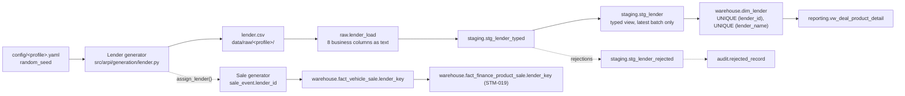

# STM-018 — Lender Dimension

## Header

| Field | Value |
|---|---|
| **Mapping ID** | `STM-018` |
| **Title** | Lender catalogue (the fictional institutions behind financed deals) |
| **Status** | **Implemented** — generator, column contract, data-quality suite, raw table, staging views, warehouse dimension and merge all exist and run on every pipeline execution. |
| **Version** | 1.0 |
| **Date** | 2026-08-08 |
| **Owner** | Michael Palmer |
| **Source system** | `arpi_synthetic_generator` |
| **Source entity** | `lender` |
| **Target object** | `warehouse.dim_lender` |
| **Declared grain** | **One row per lender.** |
| **Phase** | Dealer Operations Command Center, delivery increment `DASH.6` |
| **Intermediate objects** | `raw.lender_load` (`sql/01_raw/17_raw_lender_load.sql`), `staging.stg_lender_typed` / `staging.stg_lender` / `staging.stg_lender_rejected` (`sql/02_staging/18_stg_lender.sql`) |
| **Load script** | `sql/03_dimensions/22_dim_lender_merge.sql` |
| **Downstream objects** | `warehouse.fact_vehicle_sale.lender_key` (STM-008), `warehouse.fact_finance_product_sale.lender_key` (STM-019), `reporting.vw_deal_product_detail` |
| **Authorizing decision** | [ADR-0006 §Decision](../architecture-decisions/ADR-0006-scd-type-selection-phase-1.md) (SCD Type 1) and [ADR-0013 §Decision](../architecture-decisions/ADR-0013-governed-web-operating-console.md). Programme scope: [DASHBOARD_PROGRAM.md §9](../requirements/DASHBOARD_PROGRAM.md). |

---

## 1. Purpose

`warehouse.dim_lender` names the institution behind a financed or leased transaction, so lender mix
becomes a store-level operating observation rather than an unlabelled `lender_id` string on a fact.

It is the single most dangerous object in the F&I domain to get wrong, and the whole of this mapping
exists to hold two promises.

### 1.1 ARPI is not a lending model

**No APR, buy rate, sell rate, rate spread, money factor, payment, loan term, approval, decline,
stipulation, adverse-action reason, credit score, credit file, income or debt-to-income figure
exists in this dimension, in the facts that reference it, or anywhere in ARPI.** ARPI approves
nothing, declines nothing, tiers nobody, recommends no lender, optimizes no rate and prices nothing.

`DQ-LND-007` inspects the **schema** and fails the run even when such a column is empty, because the
defect is claiming to model a mechanic the platform does not have — not that a value is wrong.

**`program_tier` classifies the LENDER'S PROGRAM, never a customer.** `Prime`, `Near-prime` and
`Subprime` here describe the kind of paper an invented institution's program is built around. They
are not a credit grade, they are not assigned to any person, and no customer attribute of any kind
determines which lender a deal carries. The vocabulary is closed by
`ck_dim_lender_program_tier_domain` deliberately: an open vocabulary would eventually admit a value
that reads like a credit grade — `A+`, `Tier 3` — and a reader would take it for one.

### 1.2 Every institution is invented

No real bank, captive, credit union or finance company is named, and none may be added. ARPI
attaches an invented lender mix and an invented program tier to every row, and attaching those to a
real company would be a fabricated claim about that company. `DQ-LND-002` closes the name set;
`tests/unit/test_fi_privacy.py::test_no_committed_lender_name_collides_with_a_real_institution` is a
**synthetic-catalogue contract test** — deliberately not a claim to detect every real institution in
the world, because no such check is possible and pretending otherwise would be the dishonest
version.

### 1.3 Lender assignment reads the deal, never the person

The assignment's **entire input set** is the selling store, the derived finance structure and seeded
randomness. No customer attribute participates and none may: a lender chosen from anything about a
person would be a credit decision wearing an analytics costume. Section 4.2 states the mechanism.

---

## 2. Lineage

**Ordered lineage statement**

1. `arpi.generation.lender` declares **ten fictional lenders** across the four governed categories
   and the three governed program tiers. The catalogue is **deterministic and non-random**: it
   consumes no variate, and `generate_lender_dataset` explicitly discards the config
   (`del config  # Reference data; no draw depends on the seed`).
2. Rows are ordered by `lender_id`, and the generator-side `lender_key` ordinal is assigned over
   that order.
3. Separately, the **sale generator** calls `assign_lender(rng, dealership_id=…,
   finance_structure=…)` from its own namespace to stamp `sale_event.lender_id`. That draw is the
   only place lender assignment happens in the whole platform.
4. The CSV lands in `raw.lender_load` with every business column as `text`.
5. `staging.stg_lender_typed` casts, validates and classifies; `staging.stg_lender` exposes the
   accepted rows of the latest `load_batch_id`; `staging.stg_lender_rejected` carries the rest.
6. `sql/03_dimensions/22_dim_lender_merge.sql` performs a **Type 1** merge on `lender_id`.
7. `sql/04_facts/10_fact_vehicle_sale_load.sql` resolves `lender_key` against it with a **LEFT**
   join, and `sql/04_facts/17_fact_finance_product_sale_load.sql` does the same — `NULL` means
   **no lender exists**, never "lender unknown".

---

## 3. Mapping table

All 8 business columns of the source entity, in declared order, plus the lineage columns.

| Source field | Source type | Target field | Target type | Transformation | Default behaviour | Validation | Rejection behaviour | Lineage field | Owner |
|---|---|---|---|---|---|---|---|---|---|
| `lender_key` | `text` | *(ignored on load)* | — | **Deliberately discarded.** The generator emits an ordinal for readability of the committed CSV; the warehouse assigns its own surrogate. | `n/a — required in the CSV` | Positive integer in staging | `REJ-TYPE-001` if not castable | `load_batch_id` | Generator (value), Database (authority) |
| `lender_id` | `text` | `lender_id` | `varchar(16)` | Direct, format `LND-###`. **The natural key** the merge matches on and every fact resolves through. | `n/a — required` | `DQ-LND-001` unique; `uq_dim_lender_lender_id`; `ck_dim_lender_id_not_blank` | `REJ-NULL-001` if blank; `REJ-KEY-001` on duplicate within the batch — the highest `raw_record_id` survives | `load_batch_id`, `source_row_number` | Lender generator |
| `lender_name` | `text` | `lender_name` | `varchar(80)` | Direct. An **invented institution label** such as `Merrimack Valley Bank`. **Unique** — two identical names make a lender mix unreadable. | `n/a — required` | `DQ-LND-002` (closed fictional set); `uq_dim_lender_lender_name` | `REJ-NULL-001` if blank; `REJ-KEY-001` on duplicate; `REJ-DOMAIN-001` outside the declared set | `load_batch_id` | Lender generator |
| `lender_category` | `text` | `lender_category` | `varchar(40)` | Direct. One of `Captive`, `Bank`, `Credit Union`, `Independent Finance Company`. | `n/a — required` | `DQ-LND-004`; `DQ-LND-008` (all four represented); `ck_dim_lender_category_domain` | `REJ-DOMAIN-001` outside the vocabulary | `load_batch_id` | Lender generator |
| `program_tier` | `text` | `program_tier` | `varchar(20)` | Direct. One of `Prime`, `Near-prime`, `Subprime`. **Classifies the LENDER'S PROGRAM, never a customer.** Not a credit grade and never assigned to a person. | `n/a — required` | `DQ-LND-005`; `ck_dim_lender_program_tier_domain` | `REJ-DOMAIN-001` outside the vocabulary | `load_batch_id` | Lender generator |
| `active_start_date` | `text` | `active_start_date` | `date` | Cast to `date`. First date the lender's program was available. **An attribute of the lender, not an SCD Type 2 effective date.** | `n/a — required` | `DQ-LND-006`; `ck_dim_lender_active_window_ordered` | `REJ-TYPE-001` if not castable | `load_batch_id` | Lender generator |
| `active_end_date` | `text` | `active_end_date` | `date` | Cast to `date`. Last date available, or the open-ended sentinel `9999-12-31`. | `n/a — required` | `DQ-LND-006`; `ck_dim_lender_active_window_ordered` | `REJ-TYPE-001` if not castable; `REJ-DOMAIN-001` if before `active_start_date` | `load_batch_id` | Lender generator |
| `is_active` | `text` | `is_active` | `boolean` | Cast from lowercase boolean. **Derived** as `active_end_date = DATE '9999-12-31'`, never assigned independently. | `n/a — required` | `DQ-LND-006`; `ck_dim_lender_is_active_derivation` | `REJ-DOMAIN-001` when it disagrees with the dates | `load_batch_id` | Lender generator |
| `source_system` | `text` | `source_system` | `varchar(40)` | **Constant** `arpi_synthetic_generator`. The lineage marker that stops an invented catalogue being read as a real dealership's lender panel. | `n/a — constant` | `DQ-LND-009`; `ck_dim_lender_source_system_not_blank` | `REJ-NULL-001` if absent | itself | Lender generator |
| *(database)* | — | `lender_key` | `integer` PK | Warehouse-assigned surrogate: `max(existing) + row_number() OVER (ORDER BY lender_id)` over rows new to the dimension. | `n/a — database-assigned` | `pk_dim_lender`; `ck_dim_lender_key_positive` | n/a | itself | Merge script |
| *(database)* | — | `raw_record_id` | `bigserial` | Database-assigned. **Raw layer only.** | `n/a — database-assigned` | PK uniqueness | n/a | itself | Database |
| *(load process)* | — | `load_batch_id` | `uuid` | Assigned once per load. **Raw and staging layers only.** | `n/a — required` | Not null | n/a | itself | Loader |
| *(load process)* | — | `source_file_name` | `text` | `lender.csv`. **Raw and staging layers only.** | `n/a — required` | Not null | n/a | itself | Loader |
| *(load process)* | — | `source_row_number` | `integer` | 1-based data-row number. **Raw and staging layers only.** | `n/a — required` | Not null; ≥ 1 | n/a | itself | Loader |
| *(database)* | — | `ingested_at` | `timestamptz` | `DEFAULT now()`. **Raw and staging layers only.** | `now()` | Not null | n/a | itself | Database |

> **Prohibited lender fields — the binding list.** No `apr`, `buy_rate`, `sell_rate`, `rate_spread`,
> `rate_markup`, `money_factor`, `monthly_payment`, `loan_term`, `loan_to_value`, `credit_score`,
> `fico`, `credit_tier`, `credit_application`, `debt_to_income`, `stipulation`, `adverse_action`,
> approval, decline, funding delay, remittance schedule, dealer agreement, reserve formula or
> contact detail — and **no personal data of any kind**. `DQ-LND-007` and `DQ-LND-010` inspect the
> **schema** and fail the run even when the column is empty.

---

## 4. Derivation reference

### 4.1 The catalogue is declared, not sampled

Ten definitions, hard-declared in `arpi.generation.lender.LENDER_DEFINITIONS`. The module consumes
no random variate, so the committed catalogue is byte-identical across every profile and every seed.

| `lender_id` | Name | Category | Program tier | Retail weight | Lease weight | Franchise affinity |
|---|---|---|---|---|---|---|
| `LND-001` | Granite Motors Acceptance | Captive | Prime | 0.30 | 0.46 | `GSA-001` |
| `LND-002` | Northstar Automotive Credit | Captive | Prime | 0.22 | 0.38 | `GSA-002` |
| `LND-003` | Merrimack Valley Bank | Bank | Prime | 0.34 | 0.10 | — |
| `LND-004` | Pinnacle Ridge Bank | Bank | Prime | 0.26 | 0.06 | — |
| `LND-005` | Harborline Bank | Bank | Near-prime | 0.18 | 0.00 | — |
| `LND-006` | Granite State Members Credit Union | Credit Union | Prime | 0.24 | 0.00 | — |
| `LND-007` | Riverbend Community Credit Union | Credit Union | Prime | 0.16 | 0.00 | — |
| `LND-008` | Kearsarge Federal Credit Union | Credit Union | Near-prime | 0.11 | 0.00 | — |
| `LND-009` | Sablewood Acceptance Company | Independent Finance Company | Near-prime | 0.14 | 0.00 | — |
| `LND-010` | Ledgemont Finance Company | Independent Finance Company | Subprime | 0.09 | 0.00 | — |

**The three right-hand columns are generation inputs and are never columns of any table.** They live
in Python beside the code that reads them, exactly as `PACK_AMOUNT_BY_STORE` and
`STORE_PLANNING_BASELINE` do. A zero lease weight is recorded visibly rather than hidden in a
branch: a credit union writing no lease is a modelling choice, and it should be readable as one.

### 4.2 How a deal acquires a lender

`assign_lender(rng, *, dealership_id, finance_structure)` is the **only** lender assignment in ARPI.

1. If `finance_structure` is `Cash`, or the structure is a non-retail disposal, it returns `None`.
   A cash deal borrowed nothing, and a Wholesale or Dealer Trade disposal has no consumer at all.
   **`None` means no lender exists, never "lender unknown".**
2. Otherwise it takes each lender's `retail_weight` or `lease_weight` for the structure and
   multiplies by the store affinity below.
3. It draws one lender with `rng.choices(..., weights=…, k=1)`.

**Store affinity** (`_affinity`): a lender with no captive tie returns `1.0`. A captive returns
**`3.2` at its own franchise** and **`0.05` anywhere else** — which is what a captive relationship
actually looks like.

**This is the one respect in which lender assignment is not uniform across the group, and it is a
property of the STORE, not of any customer.** That is the whole point: it gives lender mix a genuine
store-to-store difference without any consumer attribute participating in the draw.

### 4.3 What the assignment deliberately does not do

It does not read the customer, the vehicle, the amount financed, the deal's gross, the month, the
salesperson or the finance manager. It cannot approve, decline, tier, price or recommend, because it
produces exactly one thing: a `lender_id`. There is nothing else to produce.

### 4.4 Coverage, and why the tier mix is what it is

All four categories and all three tiers are represented (`DQ-LND-008`, `DQ-LND-005`), so a category
or tier rollup has something in every bucket. `Subprime` appears once. That is a deliberate
modelling choice for the fictional group and **not** a claim about any real market's composition.

### 4.5 Row volume

**10 rows, on every profile.** The catalogue does not scale with the reporting window, the store
count or the seed.

---

## 5. Load strategy

| Layer | Strategy | Write semantics |
|---|---|---|
| CSV | overwrite | The generator rewrites `lender.csv` in full on every run. |
| `raw.lender_load` | append-by-batch | Every load appends with a new `load_batch_id`. |
| `staging.stg_lender` | view | Non-materialized. Accepted rows of the **latest** `load_batch_id` only. |
| `warehouse.dim_lender` | **MERGE on natural key (SCD Type 1)** | `INSERT … ON CONFLICT (lender_id) DO UPDATE`, guarded so the update fires only when at least one attribute is `IS DISTINCT FROM` its stored value. |

**Matching:** on `lender_id`.
**On match:** every non-key attribute is overwritten **in place**; `lender_key` is never reassigned.
**On no match:** a row is inserted with `lender_key = max(existing) + row_number() OVER (ORDER BY
lender_id)`.
**Expired or deleted:** nothing. A lender that stops writing is expressed by `active_end_date`, not
by deleting the row — every historical deal still points at it.

### 5.1 Why Type 1 (ADR-0006)

A corrected institution name or a restated category describes what was always true of the lender, so
it applies retroactively. A Type 2 table here would produce version rows no deal could meaningfully
point at. `active_start_date` / `active_end_date` are **not** versioning: they record when the
program was *available*.

**A tier change is deliberately Type 1 too, and that is a recorded trade.** If an institution's
program moved from `Near-prime` to `Prime`, the change would apply retroactively across the whole
history, and a lender-mix-by-tier series would restate. That is the correct behaviour for a
correction and the wrong behaviour for a genuine repositioning. ARPI's catalogue is static, so the
case does not arise; promoting `dim_lender` to Type 2 later would need an ADR, not a mapping edit.

---

## 6. Idempotency guarantees

| Guarantee | Mechanism |
|---|---|
| Rerunning with identical source produces no new warehouse rows | `ON CONFLICT (lender_id) DO UPDATE`, guarded by an `IS DISTINCT FROM` predicate over every attribute — an unchanged rerun writes **zero** rows |
| Rerunning produces identical surrogate keys on a rebuilt database | Keys are `max(existing) + row_number() OVER (ORDER BY lender_id)`, not a sequence |
| A key is never reused or reassigned | Rows already present keep the key they were given |
| An empty staging view is a no-op | The merge's `WITH src` produces no rows |
| Load batches are uniquely identified | `load_batch_id uuid` |
| Audit history is preserved across reruns | `audit.pipeline_run` is insert-only |

---

## 7. Rejection handling

| Condition | `REJ-*` code | Outcome |
|---|---|---|
| A `text` value cannot be cast (`date`, `boolean`) | `REJ-TYPE-001` | Row rejected |
| A required business column is NULL or blank | `REJ-NULL-001` | Row rejected |
| `lender_category` outside the four governed values | `REJ-DOMAIN-001` | Row rejected |
| `program_tier` outside the three governed values | `REJ-DOMAIN-001` | Row rejected |
| `lender_name` outside the declared fictional set | `REJ-DOMAIN-001` | Row rejected |
| `active_end_date < active_start_date` | `REJ-DOMAIN-001` | Row rejected |
| `is_active` disagrees with `active_end_date` | `REJ-DOMAIN-001` | Row rejected |
| Duplicate `lender_id` within the load batch | `REJ-KEY-001` | The highest `raw_record_id` survives |
| Duplicate `lender_name` within the load batch | `REJ-KEY-001` | Same resolution |

Tolerance is zero (`validation.max_rejected_record_ratio = 0.0`): **any** rejection fails the run.

---

## 8. Validation checks gating the load

| Check ID | Assertion | Severity | Gate |
|---|---|---|---|
| `DQ-LND-001` | `lender_id` is unique | critical | pre-load |
| `DQ-LND-002` | Every lender name is one of the declared fictional institutions | critical | pre-load |
| `DQ-LND-003` | The frame matches its declared column contract, in order | critical | pre-load |
| `DQ-LND-004` | `lender_category` is in the governed four-value vocabulary | critical | pre-load |
| `DQ-LND-005` | `program_tier` is in the governed three-value vocabulary | critical | pre-load |
| `DQ-LND-006` | The active window is ordered and `is_active` agrees with it | critical | pre-load |
| `DQ-LND-007` | The dimension declares **no rate, payment, credit or decisioning column** | critical | pre-load |
| `DQ-LND-008` | Every governed lender category is represented | critical | pre-load |
| `DQ-LND-009` | `source_system` is the synthetic generator | critical | pre-load |
| `DQ-LND-010` | The dimension declares no prohibited personal-data column | critical | pre-load |

`DQ-LND-001`, `-002`, `-003`, `-004`, `-005` and `-010` are additionally re-evaluated **post-load**
against the warehouse table.

**`DQ-SLE-012`** belongs to STM-008 but exists because of this dimension: it asserts that a `Cash`
deal carries no lender and that a financed or leased deal does. The rule spans two entities, so it
lives with the sale.

---

## 9. Reconciliations

| Reconciliation ID | Description | Left | Right | Tolerance | Status |
|---|---|---|---|---|---|
| `RECON-FI-RESERVE-STRUCTURE` | No `Cash` deal carries a lender or finance reserve, and every financed deal that earned reserve carries one | `warehouse.fact_vehicle_sale` | its own structure derivation | `0` | **Implemented** |

The dimension has **no row-count reconciliation of its own**: a declared ten-row catalogue compared
against itself is a tautology. What matters is whether a lender appears where the structure says it
must, which is what the rule above proves, jointly with
`ck_fact_finance_product_sale_cash_has_no_lender` and `DQ-FPS-007`.

---

## 10. Privacy class

**Class: none.** A lender row describes an invented institution's program. There is no customer
reference, no employee reference, no free-text field, no contact detail and no personal data of any
kind.

**The lending-mechanic boundary is the load-bearing promise here**, and it is enforced three ways:
`DQ-LND-007` on the generated frame, `tests/unit/test_fi_privacy.py` on the committed DDL of every
F&I SQL object, and the platform-wide `PROHIBITED_PII_*` vocabulary in `arpi.constants` — which
DASH.6 extended with `apr`, `buy_rate`, `sell_rate`, `rate_spread`, `credit_score`, `fico`,
`income`, `stipulation`, `adverse_action` and `payment` so that a future column carrying any of them
fails on the **schema** before it reaches the warehouse.

`lender_name` is on the `APPROVED_NAME_COLUMNS` allow-list precisely because it names a **synthetic
institution that does not exist**, never a person and never a real financial institution — the
allow-list entry says so, so the exemption is documented at the point it is granted rather than
assumed. `program_tier` needs no entry: it is a closed three-value vocabulary, not a name.

---

## 11. Downstream reporting ownership

| Consumer | What it takes from this dimension |
|---|---|
| `warehouse.fact_vehicle_sale.lender_key` | Nullable FK; NULL means **no lender exists** |
| `warehouse.fact_finance_product_sale.lender_key` | The parent deal's own lender, carried for convenience and proved equal to it by `DQ-FPS-007` |
| `reporting.vw_deal_product_detail` | `lender_name`, `lender_category`, `program_tier` at contract grain |

**No F&I browser dataset is exported.** `DASH.7` owns the F&I presentation surface.

**No lender-level KPI exists.** Lender mix is available as a dimension of the detail view and is
deliberately not promoted to a governed measure: a "lender penetration" KPI would be one short step
from a lender recommendation, and ARPI recommends no lender.

---

## 12. Open questions and known gaps

- **No lender decision record exists, and none will.** ARPI has no application, no approval, no
  decline, no counter-offer, no stipulation and no funding event. A store cannot ask "which lender
  approves more of my paper?" of this model, and that is the intended limit, not an omission to fill.
- `active_start_date` is `2015-01-01` on every lender, so **no lender enters or leaves the panel
  inside the reporting window**. A panel-change analysis has no signal to find.
- The catalogue is **static across profiles**. Store-to-store lender mix differs only through the
  captive affinity in §4.2; there is no seasonal, volume or program-driven variation.
- `program_tier` is an attribute of the lender and therefore **constant across that lender's deals**.
  A tier mix is consequently a lender mix by another name, and no surface may read it as a portfolio
  credit profile.
- Promoting `dim_lender` to SCD Type 2 — the only way a genuine repositioning could be recorded
  without restating history — would require an ADR.
