# STM-019 — Finance Product Sale Fact

## Header

| Field | Value |
|---|---|
| **Mapping ID** | `STM-019` |
| **Title** | Finance product contract (what the back-end gross is actually made of) |
| **Status** | **Implemented** — decomposition engine, generator, column contract, data-quality suite, raw table, staging views, warehouse fact, fact load, reconciliations and three reporting views all exist and run on every pipeline execution. |
| **Version** | 1.0 |
| **Date** | 2026-08-08 |
| **Owner** | Michael Palmer |
| **Source system** | `arpi_synthetic_generator` |
| **Source entity** | `finance_product_sale` |
| **Target object** | `warehouse.fact_finance_product_sale` |
| **Declared grain** | **One row per finance product contract sold on a finalized vehicle transaction** — one contract per product definition per deal. |
| **Phase** | Dealer Operations Command Center, delivery increment `DASH.6` |
| **Intermediate objects** | `raw.finance_product_sale_load` (`sql/01_raw/18_raw_finance_product_sale_load.sql`), `staging.stg_finance_product_sale_typed` / `staging.stg_finance_product_sale` / `staging.stg_finance_product_sale_rejected` (`sql/02_staging/19_stg_finance_product_sale.sql`) |
| **Load script** | `sql/04_facts/17_fact_finance_product_sale_load.sql` |
| **Upstream objects** | `warehouse.fact_vehicle_sale` (STM-008), `warehouse.dim_finance_product` (STM-017), `warehouse.dim_lender` (STM-018), `warehouse.dim_dealership`, `warehouse.dim_employee`, `warehouse.dim_date` |
| **Downstream objects** | `warehouse.fact_finance_product_adjustment` (STM-020), `reporting.vw_deal_product_detail`, `reporting.vw_fi_summary`, `reporting.vw_fi_product_penetration`, `KPI-FNI-001` … `KPI-FNI-011`, `KPI-FNI-019` … `KPI-FNI-022` |
| **Authorizing decision** | [ADR-0013 §Decision](../architecture-decisions/ADR-0013-governed-web-operating-console.md) and [DASHBOARD_PROGRAM.md §9](../requirements/DASHBOARD_PROGRAM.md). Gate 4 evidence: [STAKEHOLDER_QUESTIONS.md `SQ-21`](../requirements/STAKEHOLDER_QUESTIONS.md). |

---

## 1. Purpose

`warehouse.fact_finance_product_sale` is the row-level record of every F&I product contract written
on a delivered vehicle. Before DASH.6, `fact_vehicle_sale.back_end_gross` was a number with no
explanation: a store could see that its F&I office produced $1,024 per unit and could not see what
of. This fact is the explanation.

### 1.1 The identity this fact exists to make true

For **every retail deal**, exactly:

```
back_end_gross  =  finance_reserve_gross
                 + SUM(original_product_gross) over this fact
                 + other_fi_income               (exactly 0.00; not a column anywhere)
```

**`RECON-FI-001` proves it per deal, to the cent, with tolerance `0`.** `DQ-FPS-014` proves the same
identity in Python over every generated deal before a row is ever written.

`back_end_gross` was **not redefined** by DASH.6. `KPI-GRS-002` means exactly what it meant before.
What changed is that it is now *explained* rather than merely *stated*.

### 1.2 The generation strategy, recorded (DASH.6-01)

Two strategies were available and both are defensible:

**A — Component-first rebase.** Draw reserve and products first, then set `back_end_gross =
finance_reserve_gross + SUM(original_product_gross)`. Honest and simple, and it **moves the synthetic
baseline of every retail deal in the repository**.

**B — Decomposition-preserving. CHOSEN.** The existing back-end gross draw in
`arpi.generation.sale` stays exactly as it is, and the decomposition engine *explains* it: every
cent of a deal's `back_end_gross` is allocated to a named component.

**B was chosen** because what DASH.6 was asked for is an explanation of an aggregate that already
exists, and because a rebase would have moved several hundred committed artifact values for no
analytical gain. DASH.2 through DASH.5 — the committed dashboard exports, the target attainment
figures, the gross bridge, the deal jacket — keep the numbers they were built and reviewed against.

**The measured consequence, stated rather than asserted.** Diffing the committed
`data/sample/sale_event.csv` before and after DASH.6 reports: added columns
`['finance_reserve_gross', 'lender_id']`, removed columns `[]`, and **pre-existing values changed:
0**.

**The cost of B, stated plainly.** The reserve and product amounts on a deal are *shares of a total
that was drawn first*, so they are decompositions rather than independent draws. What that does not
cost is correctness: every component still obeys its own generation rule, every category still has
its own economics, and **no component is a plug**.

### 1.3 There is no balancing plug

`other_fi_income` is exactly `0.00` and **is not a column anywhere**. The allocation reaches the cent
by **largest remainder** over the basket's declared gross weights, which distributes the rounding
residue across real product lines instead of parking it in a residual bucket. A
"give-the-remainder-to-the-last-product" rule would make the final line of every basket a disguised
plug; largest remainder does not.

### 1.4 No circularity

The dependency runs one way. `back_end_gross` is an **input** to the decomposition and is never
written back. `arpi.generation.finance_deal` **does not import** `arpi.generation.sale` — which
makes the guarantee structural rather than promised. `sale.py` imports the engine, builds
lightweight `DealInput` records from its own draws, and takes the reserve and lender back.

The engine draws from a **dedicated RNG namespace** (`fi_deal_finance`), which is what preserves
every pre-DASH.6 draw bit-for-bit.

### 1.5 What drives attachment, and what may never

Attachment probability varies with the store's operating model, the finance manager's synthetic
skill index, the derived finance structure, the product category, the vehicle's condition through
eligibility, and seeded randomness.

It varies with **nothing about a customer**: no demographic, no protected characteristic, no credit
datum, no income, no age, no geography and no inferred willingness to buy. **There is no such
attribute anywhere in the inputs**, which is the strongest form the guarantee can take.

Nothing here is a recommendation. The model describes synthetic outcomes; it does not say what a
store should sell, what it should charge, or what any penetration ought to be.

---

## 2. Lineage

```mermaid
flowchart LR
    CFG["config/&lt;profile&gt;.yaml<br/>random_seed"] --> S["Sale generator<br/>src/arpi/generation/sale.py"]
    S -->|"DealInput: sale_id, date, store,<br/>manager, sale_type, amount_financed,<br/>condition, back_end_gross"| E["Decomposition engine<br/>src/arpi/generation/finance_deal.py<br/>namespace 'fi_deal_finance'"]
    ELG["config/reference/fi_product_eligibility.yaml"] --> E
    CAT["dim_finance_product catalogue (STM-017)"] --> E
    LND["assign_lender() (STM-018)"] --> E
    E -->|"finance_reserve_gross, lender_id"| S
    E --> FPS["Contract generator<br/>src/arpi/generation/finance_product_sale.py"]
    S --> CSV1["sale_event.csv<br/>+ finance_reserve_gross, lender_id"]
    FPS --> CSV2["finance_product_sale.csv"]
    CSV2 --> R["raw.finance_product_sale_load<br/>17 business columns as text"]
    R --> T["staging.stg_finance_product_sale_typed"]
    T --> ST["staging.stg_finance_product_sale"]
    T -.rejections.-> RJ["staging.stg_finance_product_sale_rejected"]
    ST --> W["warehouse.fact_finance_product_sale<br/>UNIQUE (sale_key, finance_product_key)"]
    CSV1 --> FV["warehouse.fact_vehicle_sale"]
    FV --> W
    W --> ADJ["warehouse.fact_finance_product_adjustment (STM-020)"]
    W --> V["reporting.vw_deal_product_detail<br/>reporting.vw_fi_summary<br/>reporting.vw_fi_product_penetration"]
    W -.results.-> AV["audit.reconciliation_result<br/>RECON-FI-001"]
```



**Ordered lineage statement**

1. The sale generator draws every finalized transaction exactly as it did before DASH.6 —
   `sale_type`, `amount_financed`, `back_end_gross`, the credited finance manager — using its own
   namespaces, untouched.
2. It builds a `DealInput` per deal and calls `decompose_deals()` from the **separate**
   `fi_deal_finance` namespace.
3. The engine derives the deal's **finance structure** (§4.1), assigns a **lender** (STM-018 §4.2),
   splits `back_end_gross` into **reserve** and **product budget** (§4.2), chooses the **basket** of
   eligible categories (§4.3), picks a product within each chosen category, and allocates the
   product budget across the basket by **largest remainder** (§4.4).
4. It **asserts the identity on every deal** before returning.
5. `sale.py` writes `finance_reserve_gross` and `lender_id` onto `sale_event.csv`;
   `finance_product_sale.py` writes one CSV row per product line.
6. Rows are ordered by `(sale_id, line_ordinal)` and `product_sale_id` is assigned as an ordinal
   `FPS-########` over that order.
7. The CSV lands in `raw.finance_product_sale_load`; the three-view staging pattern types, validates
   and deduplicates it.
8. `sql/04_facts/17_fact_finance_product_sale_load.sql` — numbered **17 so it sorts after
   `10_fact_vehicle_sale_load.sql`** — resolves every surrogate key and upserts on `product_sale_id`.
9. `RECON-FI-001` re-proves the identity in SQL, against the loaded warehouse rows.

---

## 3. Mapping table

All 17 business columns of the source entity, in declared order, plus the lineage columns.

| Source field | Source type | Target field | Target type | Transformation | Default behaviour | Validation | Rejection behaviour | Lineage field | Owner |
|---|---|---|---|---|---|---|---|---|---|
| `product_sale_id` | `text` | `product_sale_id` | `varchar(16)` | Direct, format `FPS-########`. **The natural key** the load's conflict target uses and every adjustment resolves through. | `n/a — required` | `DQ-FPS-001` unique; `uq_fact_finance_product_sale_product_sale_id`; `ck_fact_finance_product_sale_id_not_blank` | `REJ-NULL-001` if blank; `REJ-KEY-001` on duplicate — the highest `raw_record_id` survives | `load_batch_id`, `source_row_number` | Contract generator |
| `sale_id` | `text` | `sale_key` | `bigint` FK | Resolved against **`warehouse.fact_vehicle_sale` by `sale_id`**, not re-derived from the dimensions. **Part of the declared grain.** | `n/a — required` | `DQ-FPS-003`; `fk_fact_fi_product_sale_sale` | Dropped by the load's **inner** join if the deal is absent, recorded as `REJ-REF-001` | `load_batch_id` | Contract generator |
| `sale_date` | `text` | `sale_date_key` | `integer` FK | Cast to `date`, resolved to `dim_date.date_key`. **The DEAL DATE — the day the contract was struck.** Never rewritten by a later event. | `n/a — required` | `DQ-FPS-004`; `fk_fact_fi_product_sale_sale_date` | `REJ-TYPE-001` if not castable; dropped by the inner join if absent from `dim_date` | `load_batch_id` | Contract generator |
| `dealership_id` | `text` | `dealership_key` | `integer` FK | Resolved to `dim_dealership.dealership_key` **as at the sale date** (SCD Type 2). Must equal the parent deal's store. | `n/a — required` | `DQ-FPS-004`; `fk_fact_fi_product_sale_dealership` | Dropped by the inner join if it does not resolve | `load_batch_id` | Contract generator |
| `finance_manager_id` | `text`, nullable | `finance_manager_key` | `integer` FK, **nullable** | Resolved to `dim_employee.employee_key` as at the sale date. **NULL means nobody was on the F&I desk** — a modelled state, not a missing value. Always the parent deal's own manager. | `NULL — no manager was credited on the deal` | `DQ-FPS-006`; `fk_fact_fi_product_sale_finance_manager` | **LEFT** join: an unresolvable manager does not delete the contract | `load_batch_id` | Contract generator |
| `finance_product_id` | `text` | `finance_product_key` | `integer` FK | Resolved to `dim_finance_product.finance_product_key`. **Part of the declared grain.** | `n/a — required` | `DQ-FPS-005`; `fk_fact_fi_product_sale_product` | Dropped by the inner join if the product is absent, recorded as `REJ-REF-001` | `load_batch_id` | Contract generator |
| `lender_id` | `text`, nullable | `lender_key` | `integer` FK, **nullable** | Resolved to `dim_lender.lender_key`. **NULL means NO LENDER EXISTS**, never "lender unknown". Always the parent deal's own lender. | `NULL — a Cash deal borrowed nothing` | `DQ-FPS-007`; `ck_fact_finance_product_sale_cash_has_no_lender`; `fk_fact_fi_product_sale_lender` | **LEFT** join | `load_batch_id` | Contract generator |
| `finance_structure` | `text` | `finance_structure` | `varchar(20)` | **Derived** from the parent deal's `sale_type` and `amount_financed` (§4.1). One of `Cash`, `Retail Finance`, `Lease`. **`sale_type` is unchanged and no `dim_sale_type` exists.** | `n/a — required` | `DQ-FPS-004`; `ck_fact_finance_product_sale_structure_domain` | `REJ-DOMAIN-001` outside the three retail structures | `load_batch_id` | Eligibility module |
| `product_category` | `text` | *(not stored — resolved through `finance_product_key`)* | — | Carried on the CSV so a rejection payload is readable and staging can validate eligibility without a join. **Not duplicated onto the fact**: the category is the product's, and storing it twice invites the two to disagree. | `n/a — required` | Staging cross-check against the catalogue | `REJ-DOMAIN-001` when it contradicts the product | `load_batch_id` | Contract generator |
| `eligibility_rule_id` | `text` | `eligibility_rule_id` | `varchar(16)` | Stamped from the category's governed rule. Stored on the fact so a penetration figure can name its own denominator without a second join. | `n/a — required` | `DQ-FPS-011`; `ck_fact_finance_product_sale_eligibility_rule_domain` | `REJ-DOMAIN-001` outside the vocabulary | `load_batch_id` | Eligibility configuration |
| `line_ordinal` | `text` | `line_ordinal` | `smallint` | Cast to `smallint`. 1-based position of the contract within the deal's basket, ordered by category. Makes the basket reproducible and readable. | `n/a — required` | `ck_fact_finance_product_sale_line_ordinal_positive` | `REJ-TYPE-001` if not castable; `REJ-DOMAIN-001` if < 1 | `load_batch_id` | Contract generator |
| `product_sale_count` | `text` | `product_sale_count` | `smallint` | Cast to `smallint`. **Always `1`.** The grain is one contract, so the additive contract measure is 1; any other value means the grain was violated upstream. | `n/a — required` | `DQ-FPS-008`; `ck_fact_finance_product_sale_count_is_one` | `REJ-DOMAIN-001` if not 1 | `load_batch_id` | Contract generator |
| `product_retail_price` | `text` | `product_retail_price` | `numeric(12,2)` | Cast to `numeric(12,2)`. `Decimal`, quantized once with `ROUND_HALF_UP`; **no Python float touches it.** | `n/a — required` | `DQ-FPS-009` ≥ 0; `ck_fact_finance_product_sale_price_nonnegative` | `REJ-TYPE-001` if not castable; `REJ-DOMAIN-001` if negative | `load_batch_id` | Decomposition engine |
| `product_dealer_cost` | `text` | `product_dealer_cost` | `numeric(12,2)` | Cast to `numeric(12,2)`. The catalogue's declared cost ratio with a `(0.90, 1.10)` jitter, applied to the retail price. | `n/a — required` | `DQ-FPS-009` ≥ 0; `ck_fact_finance_product_sale_cost_nonnegative` | `REJ-TYPE-001` if not castable; `REJ-DOMAIN-001` if negative | `load_batch_id` | Decomposition engine |
| `original_product_gross` | `text` | `original_product_gross` | `numeric(12,2)` | Cast to `numeric(12,2)`. **`= product_retail_price − product_dealer_cost`, exact to the cent.** **The DEAL-DATE figure: never rewritten by a later cancellation or chargeback.** Deliberately **not** constrained non-negative — a product sold below cost is a real event, and suppressing it would be the fabrication. | `n/a — required` | `DQ-FPS-010`; `ck_fact_finance_product_sale_gross_identity`; `RECON-FI-PRODUCT-IDENTITY` | `REJ-TYPE-001` if not castable; `REJ-RULE-001` if the identity fails | `load_batch_id` | Decomposition engine |
| `contract_term_months` | `text` | `contract_term_months` | `smallint` | Cast to `smallint`. The catalogue default offset by one of `(-12, 0, 0, 0, +12)`. **The COVERAGE's term — not a loan term. ARPI models none.** | `n/a — required` | `DQ-FPS-012` in `[12, 120]`; `ck_fact_finance_product_sale_contract_term_range` | `REJ-TYPE-001` if not castable; `REJ-DOMAIN-001` outside the range | `load_batch_id` | Decomposition engine |
| `source_system` | `text` | `source_system` | `varchar(40)` | **Constant** `arpi_synthetic_generator`. | `n/a — constant` | `DQ-FPS-015`; `ck_fact_finance_product_sale_source_system_not_blank` | `REJ-NULL-001` if absent | itself | Contract generator |
| *(database)* | — | `product_sale_key` | `bigint` PK | Warehouse-assigned surrogate, deterministic by the declared grain order. | `n/a — database-assigned` | `pk_fact_finance_product_sale`; `ck_fact_finance_product_sale_key_positive` | n/a | itself | Fact load |
| *(database)* | — | `raw_record_id` | `bigserial` | Database-assigned. **Raw layer only.** | `n/a — database-assigned` | PK uniqueness | n/a | itself | Database |
| *(load process)* | — | `load_batch_id` | `uuid` | Assigned once per load. **Raw and staging layers only.** | `n/a — required` | Not null | n/a | itself | Loader |
| *(load process)* | — | `source_file_name` | `text` | `finance_product_sale.csv`. **Raw and staging layers only.** | `n/a — required` | Not null | n/a | itself | Loader |
| *(load process)* | — | `source_row_number` | `integer` | 1-based data-row number. **Raw and staging layers only.** | `n/a — required` | Not null; ≥ 1 | n/a | itself | Loader |
| *(database)* | — | `ingested_at` | `timestamptz` | `DEFAULT now()`. **Raw and staging layers only.** | `now()` | Not null | n/a | itself | Database |

> **Prohibited contract fields.** No APR, buy rate, sell rate, rate spread, money factor, monthly
> payment, loan term, loan-to-value, credit score, credit tier, credit application, income,
> debt-to-income, stipulation, adverse-action reason, approval or decline; **no customer reference of
> any kind** — an F&I contract is the richest source of personal data in a real dealership, and
> ARPI's carries none; and **no free-text field**, because free text is where somebody eventually
> writes something about a customer. `DQ-FPS-016` inspects the **schema** and fails the run even when
> the column is empty.

---

## 4. Derivation reference

### 4.1 The finance structure, and the one calculation authority

`finance_structure_for(sale_type, amount_financed)` in `arpi.generation.fi_eligibility` is the
**only** Python implementation, and `warehouse.fn_finance_structure` (IMMUTABLE) is the only SQL
one. `tests/integration/test_fi_reporting_views.py` proves them equal **over the whole input cross
product**.

| `sale_type` | `amount_financed` | Structure |
|---|---|---|
| `New Retail`, `Used Retail`, `Certified Retail` | `> 0.00` | `Retail Finance` |
| `New Retail`, `Used Retail`, `Certified Retail` | `0.00` | `Cash` |
| `Lease` | any | `Lease` — a lease is a lease however it was funded |
| `Wholesale`, `Dealer Trade` | any | *(non-retail: no consumer, so no product and no consumer lender may attach, and neither is part of the structure mix)* |

**`sale_type` was not changed and no `dim_sale_type` was created.** The structure is derived, not
stored on the sale, and it is a low-cardinality closed vocabulary that a dimension would only
indirect. An unknown `sale_type` raises `GenerationError` rather than defaulting to `Cash` — a
silent default would put products on a disposal.

### 4.2 The reserve split

For a `Retail Finance` deal, with probability `NO_RESERVE_SHARE = 0.09` the deal earns **no reserve
at all** — a flat-fee or no-reserve program is ordinary, and a dataset where every financed deal
earned reserve would make `finance_reserve_gross = 0.00` look like missing data rather than a
modelled outcome.

Otherwise the reserve is `back_end_gross ×` a triangular draw over
`RESERVE_SHARE_OF_BACK_GROSS = (low 0.10, high 0.55, mode 0.28)`. The remainder is the **product
budget**.

`Cash` and `Lease` deals earn **no reserve**: `finance_reserve_gross` is `0.00` and the whole
back-end gross is product budget. `ck_fact_vehicle_sale_reserve_requires_financing` and `DQ-SLE-011`
enforce it on the sale fact, and `ck_fact_vehicle_sale_lender_requires_funding` with `DQ-SLE-012`
enforce the lender's converse.

**Reserve is an amount, not a rate.** It is never divided by anything financed, and no rate, spread
or markup is derivable from it.

### 4.3 The basket

For each **eligible** category — eligibility evaluated by the one authority against the deal's
structure and the vehicle's condition — the engine draws one variate and attaches with probability:

```
CATEGORY_ATTACH_BASE[category]
  × STRUCTURE_ATTACH_FACTOR[structure]     Cash 0.62 · Retail Finance 1.00 · Lease 0.85
  × STORE_ATTACH_FACTOR[dealership_id]     GSA-001 1.00 · GSA-002 0.92 · GSA-003 1.12
  × manager skill index                    clamped to [0.70, 1.30]
  × UNSTAFFED_ATTACH_FACTOR                0.55, applied only when no manager was credited
```

**One variate is consumed per eligible category on every deal, whether or not it attaches**, so
adding a category cannot shift an earlier category's stream.

`Other Aftermarket Product` may attach a **second, distinct** product with probability
`SECOND_OTHER_PRODUCT_SHARE = 0.18`. That is the one category where two contracts on one deal is
realistic, and it is why every penetration measure counts **distinct deals** rather than contract
rows — without it, that rule would be untestable because the two counts would coincide on every row.

The basket is then **trimmed** to what the product budget can carry at
`MINIMUM_PRODUCT_GROSS = 75.00` per line, so a thin deal produces one product rather than six
three-dollar ones.

### 4.4 The allocation, and why it is exact

`_allocate(total, weights)` splits the product budget across the basket by **largest remainder**:
each line receives the floor of its exact share in cents, and the leftover cents go one at a time to
the lines with the largest fractional parts, ties broken by position. `sum(result) == total` holds
**exactly**, and no line absorbs the whole rounding error.

Retail price and dealer cost are then recovered from the allocated gross and the catalogue's
jittered cost ratio, so `original_product_gross = product_retail_price − product_dealer_cost` is an
identity by construction rather than a rounding coincidence.

**Every branch sums to the deal's stored `back_end_gross` exactly**, and `decompose_deals()` asserts
it per deal before returning:

- Empty basket, reserve possible → the whole amount is the reserve.
- Empty basket, reserve impossible (`Cash`/`Lease` with back-end gross) → a **forced line**: a single
  eligible product carries the whole amount.
- Non-empty basket → reserve plus a largest-remainder allocation across the lines.

### 4.5 The date basis, which is stated on every measure

Every column of this fact is on the **deal-date basis**: attributed to the day the deal was struck,
and **never rewritten** by a later event. `original_product_gross` on a June contract stays what it
was after an August chargeback posts. The difference between that and the as-of net figure is the
whole point of STM-020, and `KPI_CATALOG.md` §40 labels every F&I KPI with its basis.

### 4.6 Measured row volume (development profile)

650 sales → **1,012 product contracts** and **57 adjustments**. Basket sizes:
`{0: 124, 1: 228, 2: 166, 3: 86, 4: 36, 5: 10}`. All ten categories are represented.

Reserve total `160,244.79` + product gross total `505,828.54` = back-end gross `666,073.33`
**exactly**. 57 reconciliations, **0 failing**; 186 DQ checks passed.

---

## 5. Load strategy

| Layer | Strategy | Write semantics |
|---|---|---|
| CSV | overwrite | The generator rewrites `finance_product_sale.csv` in full on every run. |
| `raw.finance_product_sale_load` | append-by-batch | Every load appends with a new `load_batch_id`. |
| `staging.stg_finance_product_sale` | view | Non-materialized. Accepted rows of the **latest** `load_batch_id` only. |
| `warehouse.fact_finance_product_sale` | **UPSERT on the natural key** | `INSERT … ON CONFLICT (product_sale_id) DO UPDATE`, guarded so the update fires only when at least one column actually differs. |

**Matching:** on `product_sale_id`, the contract's own business identity.
**On match:** every non-key column is overwritten; `product_sale_key` is never reassigned.
**On no match:** a row is inserted with a warehouse-assigned `product_sale_key`.
**Expired or deleted:** nothing. A cancelled contract is expressed by an **event** in STM-020, not by
deleting the row — deleting it would silently reduce the deal-date figure and break `RECON-FI-001`.

### 5.1 Why the file number is load-bearing

`17_fact_finance_product_sale_load.sql` sorts **after** `10_fact_vehicle_sale_load.sql`, so
`warehouse.fact_vehicle_sale` is populated before this script resolves `sale_key` against it. A
contract whose parent deal had not been loaded yet would be dropped by the inner join and recorded
as `REJ-REF-001` — correct behaviour for a genuinely missing deal, and a silent catastrophe if the
only reason the deal is missing is that its load script had not run.

### 5.2 Why the parent is resolved against the fact, not re-derived

`sale_key` comes from `warehouse.fact_vehicle_sale` by `sale_id`, rather than the contract
re-deriving a date and store key of its own. That is what makes it **impossible** for a contract to
point at a deal the sale fact does not contain, and it is why `RECON-FI-001` compares two rows
already known to be about the same transaction.

### 5.3 Why the manager and lender joins are LEFT and the others are not

`finance_manager_key` is NULL when the deal was written with nobody on the F&I desk, and
`lender_key` is NULL when **no lender exists**. Both are modelled states, so an inner join would
silently delete legitimate contracts. Everything else — deal, date, store, product — is required: a
contract missing any of them cannot be attributed and is a rejection rather than a row with a
defaulted key.

**Nothing is calculated in the load.** No penetration, no net gross, no PVR — those belong to the
reporting views. The script moves contracts and resolves keys.

---

## 6. The lease reserve decision, recorded

`arpi.generation.finance_deal` points here for it, so it is stated here rather than in a commit
message.

**A Lease earns no finance reserve, and still carries a lender.**

Those two halves look inconsistent and are not. ARPI models **no money factor and no lease rate
mechanic of any kind**, so there is no mechanism a lease reserve could be attributed to. Inventing
one would mean assuming that retail-finance mechanics apply to a lease — a substantive claim about
how lease business earns income, made silently, in a generator. The honest position is that the
model has nothing to say about it, so the value is `0.00` and the whole back-end gross is product
gross.

The lender is a different question. A lease has a **funding source**, that source is a real
attribute of the transaction, and lender mix is analytically useful independently of how income is
earned. Dropping it would lose a true fact to avoid an unrelated one.

**A Cash deal earns no reserve for a simpler reason:** there is nothing financed to earn it on. That
is the rule, not a rounding choice, and `ck_fact_vehicle_sale_reserve_requires_financing` enforces it.

**The consequence, stated:** `KPI-FNI-001` (finance reserve gross) and `KPI-FNI-002` (reserve PVR)
are structurally zero on Lease and Cash volume, so a store with a heavy lease mix shows a lower
reserve PVR **for reasons that have nothing to do with its F&I office**. That is a property of the
model, not a finding about the store, and no surface may read it as one.

---

## 7. Idempotency guarantees

| Guarantee | Mechanism |
|---|---|
| Rerunning with identical source produces no new warehouse rows | `ON CONFLICT (product_sale_id) DO UPDATE`, guarded by an `IS DISTINCT FROM` predicate over every column |
| The declared grain cannot be violated even by a defective load | `uq_fact_finance_product_sale_grain UNIQUE (sale_key, finance_product_key)` |
| Contracts cannot outlive their parent deal | `fk_fact_fi_product_sale_sale`, which is also why the KPI-verification harness must delete F&I facts before deleting sale rows |
| An empty staging view is a no-op | The load's `WITH src` produces no rows |
| Load batches are uniquely identified | `load_batch_id uuid` |
| Audit history is preserved across reruns | `audit.pipeline_run` is insert-only |

---

## 8. Rejection handling

| Condition | `REJ-*` code | Outcome |
|---|---|---|
| A `text` value cannot be cast (`date`, `smallint`, `numeric`) | `REJ-TYPE-001` | Row rejected |
| A required business column is NULL or blank | `REJ-NULL-001` | Row rejected |
| `finance_structure` outside the three retail structures | `REJ-DOMAIN-001` | Row rejected |
| `eligibility_rule_id` outside the six governed rules | `REJ-DOMAIN-001` | Row rejected |
| `product_sale_count <> 1` | `REJ-DOMAIN-001` | Row rejected |
| `product_retail_price` or `product_dealer_cost` negative | `REJ-DOMAIN-001` | Row rejected (enforced in **staging** as well as on the fact) |
| `contract_term_months` outside `[12, 120]` | `REJ-DOMAIN-001` | Row rejected |
| `product_category` contradicts the resolved product | `REJ-DOMAIN-001` | Row rejected |
| `original_product_gross <> product_retail_price − product_dealer_cost` | `REJ-RULE-001` | Row rejected |
| Duplicate `product_sale_id` within the load batch | `REJ-KEY-001` | The highest `raw_record_id` survives |
| `sale_id` does not resolve to a loaded deal | `REJ-REF-001` | Row dropped by the inner join and recorded |
| `finance_product_id` does not resolve to a catalogued product | `REJ-REF-001` | Row dropped by the inner join and recorded |

Tolerance is zero (`validation.max_rejected_record_ratio = 0.0`): **any** rejection fails the run.

---

## 9. Validation checks gating the load

| Check ID | Assertion | Severity | Gate |
|---|---|---|---|
| `DQ-FPS-001` | `product_sale_id` is unique | critical | pre-load |
| `DQ-FPS-002` | The frame matches its declared column contract, in order | critical | pre-load |
| `DQ-FPS-003` | Every contract resolves to one finalized vehicle transaction | critical | pre-load |
| `DQ-FPS-004` | Store, sale date and finance structure match the parent deal | critical | pre-load |
| `DQ-FPS-005` | Every contract resolves to a catalogued finance product | critical | pre-load |
| `DQ-FPS-006` | The credited finance manager is the parent deal's own | critical | pre-load |
| `DQ-FPS-007` | The lender carried on a contract is the parent deal's own | critical | pre-load |
| `DQ-FPS-008` | `product_sale_count` is 1 on every contract | critical | pre-load |
| `DQ-FPS-009` | Retail price and dealer cost are never negative | critical | pre-load |
| `DQ-FPS-010` | `original_product_gross = product_retail_price − product_dealer_cost` | critical | pre-load |
| `DQ-FPS-011` | **Every contract satisfies its category's governed eligibility rule** — re-asked of the same evaluator the generator used, so an ineligible row is a critical failure | critical | pre-load |
| `DQ-FPS-012` | `contract_term_months` is a plausible **product** contract term | critical | pre-load |
| `DQ-FPS-013` | One deal never carries the same product definition twice | critical | pre-load |
| `DQ-FPS-014` | **Reserve plus product gross equals the deal's stored back-end gross**, over every deal | critical | pre-load |
| `DQ-FPS-015` | `source_system` is the synthetic generator | critical | pre-load |
| `DQ-FPS-016` | The fact declares no prohibited personal-data column | critical | pre-load |

`DQ-FPS-001`, `-002` and `-016` are additionally re-evaluated **post-load** against the warehouse
table.

---

## 10. Reconciliations

| Reconciliation ID | Description | Left | Right | Tolerance | Status |
|---|---|---|---|---|---|
| `RECON-FI-001` | **The headline identity, per deal**: `back_end_gross = finance_reserve_gross + SUM(original_product_gross)` | `warehouse.fact_vehicle_sale` | `warehouse.fact_finance_product_sale` | `0` | **Implemented** |
| `RECON-FI-DEAL-LEVEL` | The same identity as a group total | `fact_vehicle_sale` | `fact_finance_product_sale` | `0.01` | **Implemented** |
| `RECON-FI-TOTAL-GROSS` | The pre-existing `total = front + back` identity still holds | `fact_vehicle_sale` | itself | `0.01` | **Implemented** |
| `RECON-FI-PRODUCT-IDENTITY` | Price minus cost equals gross on every contract | `fact_finance_product_sale` | itself | `0` | **Implemented** |
| `RECON-FI-PRODUCT-GRAIN` | No deal carries the same product definition twice | `fact_finance_product_sale` | declared grain | `0` | **Implemented** |
| `RECON-FI-STORE-TOTALS` | Store totals agree between the sale fact and the contract fact | `fact_vehicle_sale` | `fact_finance_product_sale` | `0.01` | **Implemented** |
| `RECON-FI-PERIOD-TOTALS` | Period totals agree between the same two | `fact_vehicle_sale` | `fact_finance_product_sale` | `0.01` | **Implemented** |
| `RECON-FI-RESERVE-STRUCTURE` | No `Cash` deal carries reserve or a lender | `fact_vehicle_sale` | its structure derivation | `0` | **Implemented** |
| `RECON-FI-ELIGIBILITY` | Every contract's category is eligible under its stamped rule | `fact_finance_product_sale` | `warehouse.fn_product_category_is_eligible` | `0` | **Implemented** |
| `RECON-FACT-FINANCE-PRODUCT-SALE-WAREHOUSE` | Staging row count equals warehouse row count | `staging.stg_finance_product_sale` | `warehouse.fact_finance_product_sale` | `0` | **Implemented** |
| `RECON-REPORT-FI-DETAIL-ROWS` | The detail view neither invents nor loses a contract row | `reporting.vw_deal_product_detail` | `warehouse.fact_finance_product_sale` | `0` | **Implemented** |
| `RECON-REPORT-FI-SUMMARY-ROWS` | The summary view's totals equal the warehouse's, unmultiplied | `reporting.vw_fi_summary` | `warehouse` | `0.01` | **Implemented** |
| `RECON-REPORT-FI-PENETRATION-ROWS` | The penetration view neither invents nor loses a category row | `reporting.vw_fi_product_penetration` | `warehouse` | `0` | **Implemented** |

**What `RECON-FI-001` must not do.** It must not "fix" a mismatch, and it must not be tolerant. It
compares the stored back-end gross against its explanation with tolerance `0`, per deal. A generator
change that reduced product gross without reducing the stored back-end gross would fail it — which
is exactly the seeded corruption `tests/integration/test_reconciliations.py` uses to prove the rule
can fail.

---

## 11. Privacy class

**Class: none.** The fact carries **no customer reference of any kind** — no customer key, no
customer identifier, nothing — and no free-text field. An F&I contract is the richest source of
personal data in a real dealership; ARPI's carries none.

Employee attribution exists only as `finance_manager_key`, which is the same governed reference
every other fact carries and is subject to the same rules: **no manager leaderboard, ranking, label
or best/worst designation exists anywhere in the model**, and the **minimum-sample floor**
(`warehouse.fn_minimum_sample_floor()`, project default **10** eligible deals, sourced from
`arpi.constants.MINIMUM_SAMPLE_ELIGIBLE_DEALS`) governs every manager-grain read.

`DQ-FPS-016` inspects the schema and fails the run even when a prohibited column is empty.

---

## 12. Downstream reporting ownership

| View | Grain | What it carries |
|---|---|---|
| `reporting.vw_deal_product_detail` | Contract | Product, provider, lender, category, deal-date gross, as-of net gross |
| `reporting.vw_fi_summary` | Store × sale date × finance manager (including the "nobody on the F&I desk" group, carried as `finance_manager_grain_key = 0` so the grain is NOT NULL and therefore testable) | Reserve, retail units, product gross — and **no category column** |
| `reporting.vw_fi_product_penetration` | Store × sale date × finance manager × **governed product category** that was eligible on at least one of that group's retail deals | Numerator, denominator, eligibility rule — and **no reserve and no retail-unit column**. Rows are built from the **deals**, not the contracts, so a category with an eligible population and no sales produces a zero-numerator row rather than vanishing. |

**This split is the grain discipline, and it is asserted.** `vw_fi_summary` holds the measures that
would fan out across category rows; `vw_fi_product_penetration` holds the category and therefore may
not hold them. `tests/integration/test_fi_reporting_views.py` asserts that
`vw_fi_product_penetration` carries none of `finance_reserve_gross`, `retail_units` or
`back_end_gross_deal_date`.

**As-built owner correction, recorded:** `KPI-FNI-020` is owned by `vw_fi_product_penetration`, not
by `vw_fi_summary` as the extension plan first proposed. It is a category-grain measure and belongs
with the category-grain view.

KPIs: `KPI-FNI-001` … `KPI-FNI-011`, `KPI-FNI-019` … `KPI-FNI-022`.

**No F&I browser dataset is exported.** `DASH.7` owns the F&I presentation surface.

---

## 13. Open questions and known gaps

- **The decomposition is a decomposition.** Reserve and product amounts are shares of a total drawn
  first (§1.2 B). They are internally consistent and independently rule-governed, but they are not
  independent draws, and a study of "does reserve co-vary with product gross?" would be measuring the
  allocation, not a dealership.
- **`other_fi_income` is exactly `0.00` and is not a column.** A dealer group with a genuine
  fourth back-end component — a documentation fee treated as F&I income, say — has nothing here to
  map it to. Adding one would be a new component, not a plug.
- **No product menu, presentation or offer is modelled.** ARPI records what was sold, never what was
  offered and declined, so "menu-to-close" analysis is impossible by construction. A declined offer
  is a customer interaction, and modelling it would be the first step toward modelling the customer.
- **The forced-line branch** (`Cash`/`Lease` deals with back-end gross and an empty eligible basket)
  puts the whole amount on a single product. It is rare, it is deterministic, and it is the one place
  where a basket is not the outcome of the attachment draws.
- **No lender-level or provider-level KPI exists**, deliberately. Both are available as dimensions of
  the detail view.
- **The eligibility rule is synthetic.** No penetration figure computed over it may be compared to a
  published market figure, and no surface may describe a penetration as good, bad, standard or
  recommended.
