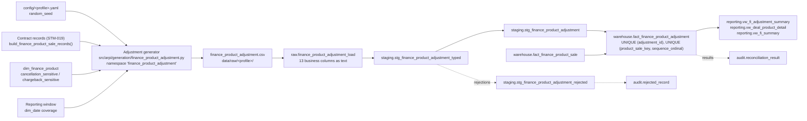

# STM-020 — Finance Product Adjustment Fact

## Header

| Field | Value |
|---|---|
| **Mapping ID** | `STM-020` |
| **Title** | Finance product adjustment (what happened to the contract afterwards) |
| **Status** | **Implemented** — generator, column contract, data-quality suite, raw table, staging views, warehouse fact, fact load, reconciliations and reporting view all exist and run on every pipeline execution. |
| **Version** | 1.0 |
| **Date** | 2026-08-08 |
| **Owner** | Michael Palmer |
| **Source system** | `arpi_synthetic_generator` |
| **Source entity** | `finance_product_adjustment` |
| **Target object** | `warehouse.fact_finance_product_adjustment` |
| **Declared grain** | **One row per product adjustment event.** |
| **Phase** | Dealer Operations Command Center, delivery increment `DASH.6` |
| **Intermediate objects** | `raw.finance_product_adjustment_load` (`sql/01_raw/19_raw_finance_product_adjustment_load.sql`), `staging.stg_finance_product_adjustment_typed` / `staging.stg_finance_product_adjustment` / `staging.stg_finance_product_adjustment_rejected` (`sql/02_staging/20_stg_finance_product_adjustment.sql`) |
| **Load script** | `sql/04_facts/18_fact_finance_product_adjustment_load.sql` |
| **Upstream objects** | `warehouse.fact_finance_product_sale` (STM-019), `warehouse.fact_vehicle_sale` (STM-008), `warehouse.dim_finance_product` (STM-017), `warehouse.dim_dealership`, `warehouse.dim_employee`, `warehouse.dim_date` |
| **Downstream objects** | `reporting.vw_fi_adjustment_summary`, `reporting.vw_deal_product_detail`, `reporting.vw_fi_summary`, `KPI-FNI-004`, `KPI-FNI-012` … `KPI-FNI-018`, `KPI-FNI-022` |
| **Authorizing decision** | [ADR-0013 §Decision](../architecture-decisions/ADR-0013-governed-web-operating-console.md) and [DASHBOARD_PROGRAM.md §9](../requirements/DASHBOARD_PROGRAM.md). Gate 4 evidence: [STAKEHOLDER_QUESTIONS.md `SQ-21`](../requirements/STAKEHOLDER_QUESTIONS.md). |

---

## 1. Purpose

`warehouse.fact_finance_product_adjustment` records what happened to an F&I contract **after** it
was written: cancellations, chargebacks, reinstatements and approved adjustments. It is what makes
the difference between what the F&I office **produced** and what the store **retained** measurable
rather than rhetorical.

### 1.1 The original contract is never rewritten

**This is the whole design.** An adjustment is an **event with its own business date**; the
`fact_finance_product_sale` row it refers to keeps the gross it was written with, forever. A June
contract charged back in August stays a June contract with June's gross, and **August** carries the
chargeback.

Restating the June row would be easier and would be wrong twice over. It would move production out
of the month it happened in, so every historical month would change whenever a later event posted.
And it would destroy the distinction between produced and retained, which is the distinction the
whole domain exists to make.

### 1.2 Three date bases, never blended silently

| Basis | Meaning | KPIs |
|---|---|---|
| **Deal date** | What the F&I office produced, attributed to the day the deal was struck. Never rewritten. | `KPI-FNI-001`, `-002`, `-003`, `-005`, `-006`, `-007`…`-011`, `-019`, `-020` |
| **As-of** | What the store retained as at a stated as-of date: original gross minus cumulative adjustments with `adjustment_date <= as_of_date`. | `KPI-FNI-004`, `-022` |
| **Adjustment period** | Adjustment events grouped by **their own** business date. An August chargeback on a June contract belongs to August. | `KPI-FNI-012`, `-013`, `-016`, `-017` |
| **Mixed, and disclosed** | An adjustment-period numerator over a sale-date denominator. A **period proxy**, never a cohort loss rate. | `KPI-FNI-014`, `-015`, `-018` |

**Every reporting view and every KPI names which of the four it is on**, and
`tests/integration/test_fi_reporting_views.py` asserts the date bases are published *as data* on the
views — not merely described in a comment.

The governed as-of date is `max(sale date, snapshot date, lead-created date)` across the warehouse —
**never the wall clock** — so a rerun on a different day produces the same as-of figure.

### 1.3 The sign convention

Declared once in `arpi.constants.ADJUSTMENT_SIGN_CONVENTION`:

```
net_product_gross_as_of = original_product_gross
                        − SUM(adjustment_amount WHERE adjustment_date <= as_of_date)
```

**A positive amount reduces retained gross; a negative one restores it.**

| Type | Sign | Constraint |
|---|---|---|
| `Cancellation` | positive | `> 0` |
| `Chargeback` | positive | `> 0` |
| `Reinstatement` | negative | `< 0` |
| `Approved Adjustment` | either | `<> 0` — a zero-amount adjustment is not an adjustment |

`ck_fact_fi_adjustment_sign_convention` enforces it per type in the warehouse; `DQ-FPA-006` enforces
it in the generator.

### 1.4 The cap

**Cumulative net reduction stays inside `[0, original_product_gross]` after *every* event in a
contract's sequence, not merely at the end.** An ordinary adjustment cannot take back more than was
produced, and a reinstatement cannot restore more than was taken — retained gross may never exceed
the original, and an "administrative correction" is not a governed exception to that.

Capped behaviour is **the default and the only behaviour this generator produces**. The cap is
enforced in the generator, asserted by `DQ-FPA-007`, proved in the warehouse by
`RECON-FI-ADJUSTMENT-CAP`, and exercised by a seeded corruption case in
`tests/integration/test_reconciliations.py`.

### 1.5 Nothing here is about a person

Reason categories are a **closed vocabulary describing what happened to a CONTRACT**. **No free-text
field exists**, because a free-text reason is where somebody eventually writes something about a
customer. There is no customer reference of any kind.

---

## 2. Lineage



**Ordered lineage statement**

1. The generator rebuilds the **contract records** from STM-019's builder — the same records, from
   the same seed — so an adjustment can never refer to a contract that does not exist.
2. It seeds a dedicated generator from the `finance_product_adjustment` namespace, so adding this
   entity perturbs no other entity's draws.
3. For each contract, in `product_sale_id` order, it draws a **fixed number of variates** whether or
   not an event results (§4.1), so adding an event type cannot shift an earlier contract's stream.
4. It reads the product's `cancellation_sensitive` / `chargeback_sensitive` flags and emits **no**
   `Cancellation` or `Chargeback` against a product that does not carry the corresponding flag.
5. Each drawn event gets a lag in days from the contract's sale date; an event dated past the
   reporting window is **not emitted** (§4.4).
6. Events on one contract are ordered by date and assigned `sequence_ordinal` from 1; the running
   cap is applied **after every event**.
7. Rows are ordered by `(adjustment_date, product_sale_id, sequence_ordinal)` and `adjustment_id` is
   assigned as an ordinal `FPA-########` over that order.
8. The CSV lands in `raw.finance_product_adjustment_load`; the three-view staging pattern types,
   validates and deduplicates it.
9. `sql/04_facts/18_fact_finance_product_adjustment_load.sql` — numbered **18 so it sorts after
   `17`** — resolves every surrogate key and upserts on `adjustment_id`.

---

## 3. Mapping table

All 13 business columns of the source entity, in declared order, plus the lineage columns.

| Source field | Source type | Target field | Target type | Transformation | Default behaviour | Validation | Rejection behaviour | Lineage field | Owner |
|---|---|---|---|---|---|---|---|---|---|
| `adjustment_id` | `text` | `adjustment_id` | `varchar(16)` | Direct, format `FPA-########`. **The natural key and the declared grain's identity** — the load's conflict target. | `n/a — required` | `DQ-FPA-001` unique; `uq_fact_finance_product_adjustment_adjustment_id`; `ck_fact_fi_adjustment_id_not_blank` | `REJ-NULL-001` if blank; `REJ-KEY-001` on duplicate — the highest `raw_record_id` survives | `load_batch_id`, `source_row_number` | Adjustment generator |
| `product_sale_id` | `text` | `product_sale_key` | `bigint` FK | Resolved against **`warehouse.fact_finance_product_sale` by `product_sale_id`**. The contract this event acts on. | `n/a — required` | `DQ-FPA-003`; `fk_fact_fi_adjustment_product_sale` | Dropped by the load's **inner** join if the contract is absent, recorded as `REJ-REF-001` — an orphaned adjustment is a number with nothing to reduce | `load_batch_id` | Adjustment generator |
| `sale_id` | `text` | `sale_key` | `bigint` FK | **Taken from the resolved contract**, not re-resolved from the CSV, so the event's deal cannot disagree with its contract's deal. | `n/a — required` | `DQ-FPA-010`; `fk_fact_fi_adjustment_sale` | Inherited from the contract join | `load_batch_id` | Fact load |
| `adjustment_date` | `text` | `adjustment_date_key` | `integer` FK | Cast to `date`, resolved to `dim_date.date_key`. **The EVENT'S OWN business date** — the adjustment-period basis. **Never before the contract's sale date.** | `n/a — required` | `DQ-FPA-004`; `fk_fact_fi_adjustment_date` | `REJ-TYPE-001` if not castable; `REJ-RULE-001` if it predates the contract; dropped by the inner join if absent from `dim_date` | `load_batch_id` | Adjustment generator |
| `dealership_id` | `text` | `dealership_key` | `integer` FK | Resolved to `dim_dealership.dealership_key` **as at the event date** (SCD Type 2). Must equal the adjusted contract's store. | `n/a — required` | `DQ-FPA-010`; `fk_fact_fi_adjustment_dealership` | Dropped by the inner join if it does not resolve | `load_batch_id` | Adjustment generator |
| `finance_manager_id` | `text`, nullable | `finance_manager_key` | `integer` FK, **nullable** | Resolved to `dim_employee.employee_key`. **The contract's own credited manager**, carried so an adjustment can be attributed to the desk that wrote it. NULL means nobody was credited — a modelled state. | `NULL — no manager was credited on the contract` | `DQ-FPA-010`; `fk_fact_fi_adjustment_finance_manager` | **LEFT** join: an unresolvable manager does not delete the event | `load_batch_id` | Adjustment generator |
| `finance_product_id` | `text` | `finance_product_key` | `integer` FK | Resolved to `dim_finance_product.finance_product_key`. **The contract's own product** — the sensitivity flags that licensed this event live on it. | `n/a — required` | `DQ-FPA-010`, `DQ-FPA-011`; `fk_fact_fi_adjustment_product` | Dropped by the inner join if the product is absent | `load_batch_id` | Adjustment generator |
| `product_category` | `text` | *(not stored — resolved through `finance_product_key`)* | — | Carried on the CSV so a rejection payload is readable and staging can validate without a join. **Not duplicated onto the fact**: storing the category twice invites the two to disagree. | `n/a — required` | Staging cross-check against the catalogue | `REJ-DOMAIN-001` when it contradicts the product | `load_batch_id` | Adjustment generator |
| `adjustment_type` | `text` | `adjustment_type` | `varchar(24)` | Direct. One of `Cancellation`, `Chargeback`, `Reinstatement`, `Approved Adjustment`. | `n/a — required` | `DQ-FPA-005`; `ck_fact_fi_adjustment_type_domain` | `REJ-DOMAIN-001` outside the vocabulary | `load_batch_id` | Adjustment generator |
| `adjustment_amount` | `text` | `adjustment_amount` | `numeric(12,2)` | Cast to `numeric(12,2)`. `Decimal`, quantized once with `ROUND_HALF_UP`. **Signed by the convention in §1.3.** | `n/a — required` | `DQ-FPA-006`, `DQ-FPA-007`, `DQ-FPA-008`; `ck_fact_fi_adjustment_sign_convention` | `REJ-TYPE-001` if not castable; `REJ-DOMAIN-001` if the sign contradicts the type | `load_batch_id` | Adjustment generator |
| `adjustment_reason_category` | `text` | `adjustment_reason_category` | `varchar(40)` | Direct, from the **closed** vocabulary in `arpi.constants.ADJUSTMENT_REASON_CATEGORIES`. **The reason must belong to its own type**, not merely to the vocabulary: `Repossession` is a governed reason — for a `Chargeback`; against a `Reinstatement` it would be a governed word in a nonsensical place. | `n/a — required` | `DQ-FPA-009`; `ck_fact_fi_adjustment_reason_belongs_to_type` | `REJ-DOMAIN-001` outside the vocabulary or outside its type's permitted reasons | `load_batch_id` | Adjustment generator |
| `sequence_ordinal` | `text` | `sequence_ordinal` | `smallint` | Cast to `smallint`. 1-based position of the event within its contract's ordered event sequence. **Part of what makes "a reinstatement follows a reduction" checkable.** | `n/a — required` | `DQ-FPA-008`; `uq_fact_finance_product_adjustment_sequence`; `ck_fact_fi_adjustment_sequence_ordinal_positive` | `REJ-TYPE-001` if not castable; `REJ-KEY-001` if two events share a position on one contract | `load_batch_id` | Adjustment generator |
| `source_system` | `text` | `source_system` | `varchar(40)` | **Constant** `arpi_synthetic_generator`. | `n/a — constant` | `DQ-FPA-012`; `ck_fact_fi_adjustment_source_system_not_blank` | `REJ-NULL-001` if absent | itself | Adjustment generator |
| *(database)* | — | `adjustment_key` | `bigint` PK | Warehouse-assigned surrogate, deterministic by the declared grain order. | `n/a — database-assigned` | `pk_fact_finance_product_adjustment`; `ck_fact_fi_adjustment_key_positive` | n/a | itself | Fact load |
| *(database)* | — | `raw_record_id` | `bigserial` | Database-assigned. **Raw layer only.** | `n/a — database-assigned` | PK uniqueness | n/a | itself | Database |
| *(load process)* | — | `load_batch_id` | `uuid` | Assigned once per load. **Raw and staging layers only.** | `n/a — required` | Not null | n/a | itself | Loader |
| *(load process)* | — | `source_file_name` | `text` | `finance_product_adjustment.csv`. **Raw and staging layers only.** | `n/a — required` | Not null | n/a | itself | Loader |
| *(load process)* | — | `source_row_number` | `integer` | 1-based data-row number. **Raw and staging layers only.** | `n/a — required` | Not null; ≥ 1 | n/a | itself | Loader |
| *(database)* | — | `ingested_at` | `timestamptz` | `DEFAULT now()`. **Raw and staging layers only.** | `now()` | Not null | n/a | itself | Database |

> **Prohibited adjustment fields.** No free-text `note`, `comment`, `reason_text` or `description`;
> **no customer reference of any kind**; no refund cheque, remittance, bank detail, communication
> record, repossession narrative or collection activity; and none of the lending mechanics ARPI does
> not model. `DQ-FPA-013` inspects the **schema** and fails the run even when the column is empty,
> and `tests/unit/test_fi_privacy.py::test_the_adjustment_entity_carries_no_free_text_field` asserts
> the free-text absence directly.

---

## 4. Derivation reference

### 4.1 Event draws, and why the variate count is fixed

Per contract, the generator consumes a **fixed number of variates** regardless of outcome. That is
what makes the entity stable under change: adding an event type or reordering a branch cannot shift
an earlier contract's stream.

| Event | Base probability | Applies to |
|---|---|---|
| `Cancellation` | `CANCELLATION_BASE[category]` — VSC `0.085`, GAP `0.070`, Prepaid Maintenance `0.065`, Tire & Wheel `0.055`, Lease Wear Protection `0.040` | Only `cancellation_sensitive` products, and only these five categories |
| `Chargeback` | `CHARGEBACK_BASE[category]` — GAP `0.095`, VSC `0.070`, Prepaid Maintenance `0.055` | Only `chargeback_sensitive` products, and only these three categories |
| `Reinstatement` | `REINSTATEMENT_SHARE = 0.14` of cancellations | Only where a cancellation exists to rescind |
| `Approved Adjustment` | `APPROVED_ADJUSTMENT_SHARE = 0.012` | Any contract, independently of any reduction |

**A category absent from a table contributes nothing even if its product carries the flag.** That
is deliberate: the flag says the mechanism is possible, the table says whether this model produces
it.

### 4.2 Amounts

| Event | Fraction drawn `(low, high, mode)` | Of what |
|---|---|---|
| `Cancellation` | `(0.30, 1.00, 0.75)` | The original product gross |
| `Chargeback` | `(0.45, 1.00, 0.85)` | The original product gross |
| `Reinstatement` | `(0.35, 1.00, 0.70)` | The **prior reduction**, negated |
| `Approved Adjustment` | `(0.02, 0.15, 0.06)` | The original product gross, in either direction |

`APPROVED_RESTORES_SHARE = 0.45` is the probability an Approved Adjustment restores rather than
reduces — and **a restoring adjustment is only emitted when there is a prior reduction to restore**,
because net retained gross may never exceed the original.

Every amount is quantized once to the cent with `ROUND_HALF_UP`, then **clamped by the running cap**
(§1.4) before it is written. A clamp that would leave a zero amount drops the event rather than
writing a zero-amount adjustment.

### 4.3 Reason vocabulary, by type

| Type | Permitted reasons |
|---|---|
| `Cancellation` | `Customer Request`, `Vehicle Sold or Traded`, `Total Loss`, `Early Payoff` |
| `Chargeback` | `Early Payoff`, `Contract Cancelled`, `Repossession`, `Total Loss` |
| `Reinstatement` | `Cancellation Rescinded`, `Administrative Correction` |
| `Approved Adjustment` | `Administrative Correction`, `Pricing Correction`, `Remittance Correction` |

Each describes what happened to a **contract**. None describes a person, and none is free text.

### 4.4 Lags, and the truncation that is a property rather than a defect

Days between the deal and the event, drawn `(low, high, mode)`:

| Event | Lag days |
|---|---|
| `Cancellation` | `(8, 300, 40)` |
| `Chargeback` | `(12, 280, 55)` |
| `Reinstatement` | `(5, 90, 20)` |
| `Approved Adjustment` | `(3, 150, 25)` |

The modes sit early because a cancellation or chargeback that is going to happen usually happens in
the first months. The long right tails are kept: a contract cancelled a year in is a real event.

**The reporting window truncates this distribution, and that is a real property of the dataset, not
a defect.** An event dated past the window's end has no `dim_date` row to resolve and is not
emitted, so the **most recent months of sales carry structurally fewer adjustments than the earliest
ones** — exactly as a real store's most recent cohort does, because those contracts have not had
time to fail.

**Any comparison of adjustment volume between an early month and a late one is reading that
truncation.** `LIMITATIONS.md` records it, and `KPI-FNI-014`, `-015` and `-018` are labelled
**period proxies, never cohort loss rates**, for exactly this reason.

### 4.5 Sequence integrity

Events on one contract are ordered by date and numbered from 1. `DQ-FPA-008` asserts that a
`Reinstatement` **follows a reduction and never exceeds it**;
`uq_fact_finance_product_adjustment_sequence` makes two events at one position impossible, so the
sequence is never ambiguous. `RECON-FI-ADJUSTMENT-SEQUENCE` re-proves the two impossible sequences
in the warehouse: an event that predates its own contract, and a reinstatement with nothing to
reinstate.

### 4.6 As-of arithmetic

`net_product_gross_as_of(contract, adjustments, as_of)` is the single Python implementation, and the
reporting views implement the same expression in SQL:

```
original_product_gross − SUM(adjustment_amount WHERE adjustment_date <= as_of_date)
```

Because of the cap, this figure **never goes negative and never exceeds the original**.

### 4.7 Measured row volume

**Development profile: 57 adjustment events over 1,012 contracts.** The `test` profile's two-month
window produces very few — which is why five of the reconciliation corruption cases are written as
self-contained `INSERT`s rather than as mutations of rows that may not exist.

---

## 5. Load strategy

| Layer | Strategy | Write semantics |
|---|---|---|
| CSV | overwrite | The generator rewrites `finance_product_adjustment.csv` in full on every run. |
| `raw.finance_product_adjustment_load` | append-by-batch | Every load appends with a new `load_batch_id`. |
| `staging.stg_finance_product_adjustment` | view | Non-materialized. Accepted rows of the **latest** `load_batch_id` only. |
| `warehouse.fact_finance_product_adjustment` | **UPSERT on the event's own identity** | `INSERT … ON CONFLICT (adjustment_id) DO UPDATE`, guarded so the update fires only when at least one column actually differs. |

**Matching:** on `adjustment_id`.
**On match:** every non-key column is overwritten; `adjustment_key` is never reassigned.
**On no match:** a row is inserted with a warehouse-assigned `adjustment_key`.
**Expired or deleted:** nothing, ever. An adjustment that was itself reversed is expressed by a
**further event** (a `Reinstatement`), not by deleting the row.

### 5.1 Idempotency on an event fact, which is not the same as on a plan

`fact_sales_target` (STM-016) upserts because a plan is a **current statement** and a later revision
replaces it. An adjustment is an **event** and history is the point, so the conflict target here is
`adjustment_id` — the event's own identity — and a rerun of the same generated population rewrites
the same events rather than appending a second copy of them.

It is deliberately **not** `(product_sale_key, adjustment_date)`: two genuine events on one contract
on one day would then collapse into one, which is a silent loss of an event rather than a
deduplication.

### 5.2 Why the contract join is inner and unforgiving

An adjustment whose contract does not exist is dropped and recorded as `REJ-REF-001`, because **an
orphaned adjustment is a number with nothing to reduce**. It would appear in the adjustment-period
total and in no contract's net gross, and the two reads of the same domain would then disagree with
nothing to explain why.

`18` sorts after `17`, so `warehouse.fact_finance_product_sale` is populated before this script runs.

**Nothing is calculated in the load.** No cumulative cap, no net gross, no rate. The cap belongs to
`DQ-FPA-007` and `RECON-FI-ADJUSTMENT-CAP`; net gross belongs to the reporting layer.

---

## 6. Idempotency guarantees

| Guarantee | Mechanism |
|---|---|
| Rerunning with identical source produces no new warehouse rows | `ON CONFLICT (adjustment_id) DO UPDATE`, guarded by an `IS DISTINCT FROM` predicate over every column |
| Two events cannot occupy one position on a contract | `uq_fact_finance_product_adjustment_sequence UNIQUE (product_sale_key, sequence_ordinal)` |
| Two genuine same-day events are preserved, not deduplicated | The conflict target is `adjustment_id`, not `(product_sale_key, adjustment_date)` |
| An adjustment cannot outlive its contract | `fk_fact_fi_adjustment_product_sale` with `ON DELETE RESTRICT` |
| An empty staging view is a no-op | The load's `WITH src` produces no rows |
| Load batches are uniquely identified | `load_batch_id uuid` |
| Audit history is preserved across reruns | `audit.pipeline_run` is insert-only |

---

## 7. Rejection handling

| Condition | `REJ-*` code | Outcome |
|---|---|---|
| A `text` value cannot be cast (`date`, `smallint`, `numeric`) | `REJ-TYPE-001` | Row rejected |
| A required business column is NULL or blank | `REJ-NULL-001` | Row rejected |
| `adjustment_type` outside the four governed types | `REJ-DOMAIN-001` | Row rejected |
| `adjustment_reason_category` outside the governed vocabulary, or outside its **own type's** permitted reasons | `REJ-DOMAIN-001` | Row rejected |
| The amount's sign contradicts its type, or is zero | `REJ-DOMAIN-001` | Row rejected |
| `sequence_ordinal < 1` | `REJ-DOMAIN-001` | Row rejected |
| `product_category` contradicts the resolved product | `REJ-DOMAIN-001` | Row rejected |
| `adjustment_date` precedes the contract's sale date | `REJ-RULE-001` | Row rejected |
| Duplicate `adjustment_id` within the load batch | `REJ-KEY-001` | The highest `raw_record_id` survives |
| Two events at one `(product_sale_id, sequence_ordinal)` | `REJ-KEY-001` | Same resolution |
| `product_sale_id` does not resolve to a loaded contract | `REJ-REF-001` | Row dropped by the inner join and recorded |

**The cumulative cap and the reinstatement sequence rule are deliberately NOT staging rejections.**
Both are properties of a contract's whole event sequence, not of one row, and staging validates rows.
They are enforced in the generator (`DQ-FPA-007`, `DQ-FPA-008`) and re-proved in the warehouse
(`RECON-FI-ADJUSTMENT-CAP`, `RECON-FI-ADJUSTMENT-SEQUENCE`).

Tolerance is zero (`validation.max_rejected_record_ratio = 0.0`): **any** rejection fails the run.

---

## 8. Validation checks gating the load

| Check ID | Assertion | Severity | Gate |
|---|---|---|---|
| `DQ-FPA-001` | `adjustment_id` is unique | critical | pre-load |
| `DQ-FPA-002` | The frame matches its declared column contract, in order | critical | pre-load |
| `DQ-FPA-003` | Every adjustment resolves to an existing product contract | critical | pre-load |
| `DQ-FPA-004` | No adjustment predates the contract it adjusts | critical | pre-load |
| `DQ-FPA-005` | `adjustment_type` is one of the four governed event types | critical | pre-load |
| `DQ-FPA-006` | Each adjustment type moves net gross in its declared direction | critical | pre-load |
| `DQ-FPA-007` | **Cumulative net reduction stays inside `[0, original product gross]`** after every event | critical | pre-load |
| `DQ-FPA-008` | A reinstatement follows a reduction and never exceeds it | critical | pre-load |
| `DQ-FPA-009` | The reason category is governed **and belongs to its adjustment type** | critical | pre-load |
| `DQ-FPA-010` | Store, manager, product and deal match the adjusted contract | critical | pre-load |
| `DQ-FPA-011` | Cancellations and chargebacks respect the product's sensitivity flags | critical | pre-load |
| `DQ-FPA-012` | `source_system` is the synthetic generator | critical | pre-load |
| `DQ-FPA-013` | The fact declares no prohibited personal-data column | critical | pre-load |

`DQ-FPA-001`, `-002` and `-013` are additionally re-evaluated **post-load** against the warehouse
table.

---

## 9. Reconciliations

| Reconciliation ID | Description | Left | Right | Tolerance | Status |
|---|---|---|---|---|---|
| `RECON-FI-ADJUSTMENT-CAP` | Cumulative net reduction stays inside `[0, original_product_gross]` on every contract | `fact_finance_product_adjustment` | `fact_finance_product_sale` | `0` | **Implemented** |
| `RECON-FI-ADJUSTMENT-SEQUENCE` | No event predates its own contract, and no contract carries a reinstatement with no reduction to reinstate | `fact_finance_product_adjustment` | `fact_finance_product_sale` | `0` | **Implemented** |
| `RECON-FI-ADJUSTMENT-GRAIN` | Row count equals distinct `adjustment_id` — the grain is the **event**, because a contract may legitimately carry several and two may legitimately share a date | `fact_finance_product_adjustment` | declared grain | `0` | **Implemented** |
| `RECON-FI-NET-GROSS` | As-of net product gross agrees between an independent warehouse derivation and the reporting view — reconciled on its **own** basis | warehouse net as of the governed date | `reporting.vw_fi_summary.net_product_gross_as_of` | `0.01` | **Implemented** |
| `RECON-FACT-FINANCE-PRODUCT-ADJUSTMENT-WAREHOUSE` | Staging row count equals warehouse row count | `staging.stg_finance_product_adjustment` | `warehouse.fact_finance_product_adjustment` | `0` | **Implemented** |
| `RECON-REPORT-FI-ADJUSTMENT-ROWS` | The adjustment view neither invents nor loses a row | `reporting.vw_fi_adjustment_summary` | `warehouse` | `0` | **Implemented** |

**`RECON-FI-001` is deliberately not affected by this fact.** The deal-date identity reconciles the
produced side; `RECON-FI-NET-GROSS` reconciles the as-of side **separately**. Blending them would
make an ordinary cancellation into a permanent failing check — which is precisely the mistake the
three-date-basis discipline exists to prevent.

---

## 10. Privacy class

**Class: none.** The fact carries **no customer reference of any kind** and **no free-text field**.
Reason categories are a closed vocabulary describing what happened to a contract.

A cancellation in a real dealership is accompanied by a refund cheque, a customer conversation and
often a repossession or total-loss narrative. **ARPI models none of them.** Data minimization
applies: a field is not created merely because it could exist in a real DMS.

Employee attribution exists only as `finance_manager_key`, subject to the same rules as everywhere
else in ARPI: **no manager leaderboard, ranking, label or best/worst designation**, and the
minimum-sample floor (`warehouse.fn_minimum_sample_floor()`, project default **10**) governs every
manager-grain read. A chargeback rate is not a performance judgement and no surface may present it
as one.

`DQ-FPA-013` inspects the schema and fails the run even when a prohibited column is empty.

---

## 11. Downstream reporting ownership

| View | Grain | What it carries |
|---|---|---|
| `reporting.vw_fi_adjustment_summary` | Store × **adjustment date** × finance manager × product category × adjustment type | Adjustment-period counts and amounts, `adjusted_contract_original_gross`, and **no sale-date gross column** — asserted by test. The only F&I view on the adjustment-date basis, and a separate view for exactly that reason. |
| `reporting.vw_deal_product_detail` | Contract | The as-of net gross derived from this fact |
| `reporting.vw_fi_summary` | Store × sale date × finance manager | The as-of net total and the mixed-basis period proxies |

KPIs: `KPI-FNI-004`, `KPI-FNI-012` … `KPI-FNI-018`, `KPI-FNI-022`.

`tests/integration/test_fi_reporting_views.py` asserts that every view publishes its date basis **as
data**, and that a rate's `numerator_date_basis` and `rate_denominator_date_basis` differ wherever
the rate is a mixed-basis proxy — so a reader cannot mistake a period proxy for a cohort rate.

**No F&I browser dataset is exported.** `DASH.7` owns the F&I presentation surface.

---

## 12. Open questions and known gaps

- **Window truncation is structural** (§4.4). The most recent sale months carry fewer adjustments
  than the earliest, because their contracts have not had time to fail. No cohort loss rate is
  computable from this dataset, and `KPI-FNI-014`, `-015`, `-018` are labelled period proxies rather
  than being quietly presented as one.
- **No refund, remittance or settlement amount exists.** The adjustment records the effect on the
  store's retained gross and nothing about money moving to anybody.
- **No customer-side event exists** — no complaint, no communication, no cancellation request record.
  A free-text reason is where those eventually appear, so there is no free-text field.
- **`Approved Adjustment` is a single governed type** covering three reason categories. A dealer
  group that distinguishes a pricing correction from a remittance correction *structurally* would
  need a fourth and fifth type, not a wider reason list.
- **The event rates are synthetic parameters for a fictional group.** They are not industry
  cancellation or chargeback rates, and no figure computed over them may be compared to a published
  market figure or described as good, bad, standard or acceptable.
- **The adjustment lag distributions were tuned** so the `development` profile produces a workable
  event population (57 events). They are a modelling choice, recorded here and in the module, not an
  empirical finding.
