# STM-022 — Inventory Accounting Snapshot Fact

## Header

| Field | Value |
|---|---|
| **Mapping ID** | `STM-022` |
| **Title** | Inventory control schedule (what each carried unit is worth on the books) |
| **Status** | **Implemented** — generator, data-quality suite, raw table, staging views, warehouse fact, fact load, reconciliations and reporting view all exist and run on every pipeline execution. |
| **Version** | 1.0 |
| **Date** | 2026-08-08 |
| **Owner** | Michael Palmer |
| **Source system** | `arpi_synthetic_generator` |
| **Source entity** | `inventory_accounting_snapshot` |
| **Target object** | `warehouse.fact_inventory_accounting_snapshot` |
| **Declared grain** | **One row per vehicle, per dealership, per accounting date**, while the unit is carried. |
| **Phase** | Dealer Operations Command Center, delivery increment `DASH.8` |
| **Intermediate objects** | `raw.inventory_accounting_load` (`sql/01_raw/20_raw_inventory_accounting_load.sql`), `staging.stg_inventory_accounting_typed` / `staging.stg_inventory_accounting` / `staging.stg_inventory_accounting_rejected` (`sql/02_staging/21_stg_inventory_accounting.sql`) |
| **Load script** | `sql/04_facts/19_fact_inventory_accounting_snapshot_load.sql` |
| **Upstream objects** | `warehouse.dim_vehicle` (STM-005), `warehouse.dim_dealership` (STM-002), `warehouse.dim_date` (STM-001), `warehouse.dim_gl_account` (STM-023) |
| **Downstream objects** | `reporting.vw_inventory_accounting`, `reporting.vw_inventory_gl_reconciliation`, `reporting.vw_accounting_exceptions`, `KPI-ACC-001`, `KPI-ACC-003`, `KPI-ACC-004`, `KPI-ACC-010`, `KPI-ACC-011` |
| **Authorizing decision** | [ADR-0013 §Decision](../architecture-decisions/ADR-0013-governed-web-operating-console.md) and [DASHBOARD_PROGRAM.md](../requirements/DASHBOARD_PROGRAM.md). Gate 4 evidence: [STAKEHOLDER_QUESTIONS.md `SQ-43`](../requirements/STAKEHOLDER_QUESTIONS.md). |

---

## 1. Purpose

`warehouse.fact_inventory_accounting_snapshot` is the controller's **stock schedule**: one line per
carried unit per month-end, stating what the store has in that unit and what is owed against it. It
is the subledger the GL inventory control account is reconciled against.

**ARPI is building a focused inventory control schedule and its reconciliation. It is not building a
general ledger.** There is no journal, no journal line, no debit/credit pair, no posting batch, no
trial balance, no period-close state and no financial statement anywhere in this project, and this
fact is where that boundary is easiest to breach — a schedule that grows a `journal_entry_id` looks
more impressive and proves less.

### 1.1 The identity this fact exists to make true

For **every schedule line**, exactly:

```
current_book_value  =  acquisition_cost
                     + capitalized_transportation
                     + capitalized_reconditioning
                     + capitalized_accessories
                     + other_capitalized_costs
                     - write_down_amount
```

Exact equality. No tolerance, no plug, no residual column. Every component is `numeric(14,2)`
produced by exact `Decimal` arithmetic, so a penny of difference is a defect rather than a rounding
artefact.

It is enforced as `ck_fact_inventory_accounting_book_value_identity` — a **CHECK**, not a staging
rule — because a violation must be **unloadable** rather than merely quarantined. The whole domain
rests on this one line. `RECON-ACC-BOOK-IDENTITY` then re-proves it over the loaded rows, so a
constraint dropped from a deployed database fails a run rather than passing one.

### 1.2 Six concepts that must never merge

| Concept | Where it lives | What it is |
|---|---|---|
| **Inventory book value** | `current_book_value` here | An asset carrying amount |
| **Floorplan principal** | `floorplan_principal` here | A **liability**, carried as context |
| **GL inventory control balance** | `warehouse.fact_gl_control_balance` (STM-024) | The ledger side |
| **Front-end gross cost basis** | `warehouse.fact_vehicle_sale` (STM-008) | A different basis at the point of sale |
| **Reconciliation variance** | `reporting.vw_inventory_gl_reconciliation` | A store-account-date measure |
| **Data-quality exception** | `reporting.vw_accounting_exceptions` | A rule the model asserts about itself |

Collapsing any two of these produces a number that is true of nothing. The schema keeps them apart
structurally: the variance is not a column on this fact, the control balance is a different table,
and the front-gross cost basis is a different fact on a different grain.

### 1.3 Pack is not a book component

Pack is an internal gross-allocation device withheld from front-end gross **at the point of sale**.
It is not a capitalized cost of the vehicle and it is not part of what the store has in the unit.
There is deliberately no pack column here.

Moving pack into book value would redefine the front-gross identity on every deal and change
`KPI-GRS-001` without anyone saying so, which `DASH.8` is forbidden to do.
`RECON-ACC-PACK-EXCLUDED` re-proves `front_end_gross = sale_price − acquisition_cost −
reconditioning_cost − pack_amount` over every deal on every run, so the boundary fails a run rather
than a review.

### 1.4 Floorplan principal is carried and never netted

`floorplan_principal` sits on the same row because a controller reading a stock schedule wants what
is owed against the unit next to what the unit is carried at. It is a separate column. It is never
added to, subtracted from or netted against any book figure, and **ARPI publishes no
"net inventory position" anywhere** — that number would net an asset against a liability and mean
nothing a controller would recognise.

`0.00` is a **legitimate, unfloored, owned unit** — never missing data. After a write-down a unit may
legitimately owe more than it is carried at, which is precisely why the two are never netted. ARPI
models no rate, no interest, no curtailment, no maturity and no lender terms, so nothing here can be
read as floorplan cost analysis.

### 1.5 No future-outcome leakage

Nothing on this row depends on what eventually happened to the unit:

* `control_account_category` comes from the unit's **condition**, knowable at acquisition.
* `write_down_amount` comes from **days in stock at the accounting date**.
* `floorplan_principal` comes from the unit's **acquisition source and funding**.

None consults the sale. The carrying **span** is bounded by the disposition date exactly as
`fact_vehicle_inventory_snapshot` bounds it, because that is the *population* — which units were on
the floor — rather than a classification of a unit that was.

This is also why there is no `Wholesale Inventory` control category. Nothing observable at a
month-end distinguishes a unit held for wholesale from a unit held for retail; only the eventual
disposal would, and reading it would be exactly the leakage this section forbids. See STM-023 §6.

### 1.6 Semi-additivity — the rule that matters most downstream

`current_book_value` and `floorplan_principal` are **additive across vehicles, stores and control
categories at one accounting date**, and are **never additive across dates**. Summing two month-ends
produces a number that is not a balance of anything. A period-ending balance is the **last**
applicable accounting date, not a sum over the period.

`days_in_stock` is an age and is never additive at all.

---

## 2. Lineage

```mermaid
flowchart LR
    CFG["config/&lt;profile&gt;.yaml<br/>random_seed, reporting window"] --> ACQ["Acquisition generator<br/>src/arpi/generation/acquisition.py"]
    ACQ -->|"acquisition date, cost,<br/>source, store"| IA["Accounting generator<br/>src/arpi/generation/inventory_accounting.py<br/>namespace 'inventory_accounting'"]
    VEH["dim_vehicle (STM-005)<br/>condition_type"] --> IA
    SNAP["inventory_snapshot_event<br/>(carrying span)"] --> IA
    IA --> CSV["inventory_accounting_snapshot.csv<br/>16 business columns"]
    CSV --> R["raw.inventory_accounting_load<br/>16 business columns as text"]
    R --> T["staging.stg_inventory_accounting_typed"]
    T --> ST["staging.stg_inventory_accounting"]
    T -.rejections.-> RJ["staging.stg_inventory_accounting_rejected"]
    ST --> W["warehouse.fact_inventory_accounting_snapshot<br/>UNIQUE (accounting_date_key, dealership_key, vehicle_key)<br/>CHECK book-value identity"]
    GLA["warehouse.dim_gl_account (STM-023)"] --> W
    W --> V["reporting.vw_inventory_accounting"]
    V --> RECV["reporting.vw_inventory_gl_reconciliation"]
    V --> EXC["reporting.vw_accounting_exceptions"]
    W -.results.-> AV["audit.reconciliation_result<br/>RECON-ACC-BOOK-IDENTITY"]
```



**Ordered lineage statement**

1. The acquisition generator produces every unit's entry into stock exactly as it did before
   `DASH.8` — date, cost, source, store — using its own namespace, untouched.
2. The inventory snapshot generator establishes each unit's **carrying span**: the dates on which it
   was on the floor.
3. `inventory_accounting.py` computes the **month-end accounting calendar**, a deliberate subset of
   the inventory calendar (§4.1), and emits one schedule line per unit carried on each of those
   dates.
4. For each line it derives the capitalized components (§4.2), the write-down (§4.3), the floorplan
   principal (§4.4) and the control category (§4.5), then computes `current_book_value` from the
   identity and **asserts the identity before returning**.
5. Rows are ordered by `(accounting_date, dealership_id, vehicle_id)` and
   `inventory_accounting_id` is assigned as an ordinal `IAS-########` over that order.
6. The CSV lands in `raw.inventory_accounting_load`; the three-view staging pattern types, validates
   and deduplicates it.
7. `sql/04_facts/19_fact_inventory_accounting_snapshot_load.sql` — numbered **19 so it sorts after
   the dimension merges and after `11_fact_vehicle_inventory_snapshot_load.sql`** — resolves every
   surrogate key and upserts on the declared grain.
8. `RECON-ACC-BOOK-IDENTITY` re-proves the identity in SQL against the loaded warehouse rows.

---

## 3. Mapping table

All 16 business columns of the source entity, in declared order, plus the lineage columns.

| Source field | Source type | Target field | Target type | Transformation | Default behaviour | Validation | Rejection behaviour | Lineage field | Owner |
|---|---|---|---|---|---|---|---|---|---|
| `inventory_accounting_id` | `text` | *(not stored — the grain is the identity)* | — | Format `IAS-########`. The **staging** natural key. Deliberately **not** a fact column: the fact's identity is `(accounting date, store, vehicle)`, and carrying a second identifier would invite the two to disagree. | `n/a — required` | `DQ-IAS-001` unique | `REJ-NULL-001` if blank; `REJ-KEY-001` on duplicate — the highest `raw_record_id` survives | `load_batch_id`, `source_row_number` | Accounting generator |
| `dealership_id` | `text` | `dealership_key` | `integer` FK | Resolved to `dim_dealership.dealership_key` **as at the accounting date** (SCD Type 2). **Part of the declared grain.** | `n/a — required` | `DQ-IAS-002`; `fk_fact_inventory_accounting_dealership` | Dropped by the load's **inner** join if it does not resolve, recorded as `REJ-REF-001` | `load_batch_id` | Accounting generator |
| `vehicle_id` | `text` | `vehicle_key` | `integer` FK | Resolved to `dim_vehicle.vehicle_key`. **Part of the declared grain.** | `n/a — required` | `DQ-IAS-003`; `fk_fact_inventory_accounting_vehicle` | Dropped by the inner join, recorded as `REJ-REF-001` | `load_batch_id` | Accounting generator |
| `accounting_date` | `text` | `accounting_date_key` | `integer` FK | Cast to `date`, resolved to `dim_date.date_key`. **Always a month-end** (§4.1). **Part of the declared grain.** Comparable with a control balance only at the **same** date. | `n/a — required` | `DQ-IAS-004`, `DQ-IAS-005` month-end; `fk_fact_inventory_accounting_date` | `REJ-TYPE-001` if not castable; dropped by the inner join if absent from `dim_date` | `load_batch_id` | Accounting generator |
| `acquisition_date` | `text` | *(not stored — see §4.6)* | — | Cast to `date` in staging, where `DQ-IAS-016` proves `days_in_stock` is its difference from `accounting_date`. **Deliberately not keyed onto the fact**: it routinely predates the governed calendar, and `days_in_stock` already carries the whole of what `KPI-ACC-011` needs. | `n/a — required` | `DQ-IAS-016` | `REJ-TYPE-001` if not castable | `load_batch_id` | Acquisition generator |
| `control_account_category` | `text` | `control_account_category` | `varchar(40)` | Direct. One of `New Vehicle Inventory`, `Used Vehicle Inventory`, `Certified Vehicle Inventory`, derived from `dim_vehicle.condition_type` (§4.5). Also resolves `gl_account_key`. | `n/a — required` | `DQ-IAS-008`; `ck_fact_inventory_accounting_category_domain` | `REJ-DOMAIN-001` outside the three governed categories | `load_batch_id` | Accounting generator |
| `acquisition_cost` | `text` | `acquisition_cost` | `numeric(14,2)` | Cast to `numeric(14,2)`. What the store paid — the acquisition event's own figure, never re-derived. **A book-value component.** | `n/a — required` | `DQ-IAS-009` ≥ 0; `ck_fact_inventory_accounting_components_nonnegative` | `REJ-TYPE-001` if not castable; `REJ-DOMAIN-001` if negative | `load_batch_id` | Acquisition generator |
| `capitalized_transportation` | `text` | `capitalized_transportation` | `numeric(14,2)` | Cast to `numeric(14,2)`. Driven by acquisition source (§4.2). `0.00` where the source incurs none. **A book-value component.** | `n/a — required` | `DQ-IAS-010` ≥ 0; `ck_..._components_nonnegative` | `REJ-TYPE-001` / `REJ-DOMAIN-001` | `load_batch_id` | Accounting generator |
| `capitalized_reconditioning` | `text` | `capitalized_reconditioning` | `numeric(14,2)` | Cast to `numeric(14,2)`. The unit's own reconditioning, capitalized. **A book-value component.** | `n/a — required` | `DQ-IAS-011` ≥ 0; `ck_..._components_nonnegative` | `REJ-TYPE-001` / `REJ-DOMAIN-001` | `load_batch_id` | Accounting generator |
| `capitalized_accessories` | `text` | `capitalized_accessories` | `numeric(14,2)` | Cast to `numeric(14,2)`. Dealer-installed accessories on a modelled share of units (§4.2). **A book-value component.** | `n/a — required` | `DQ-IAS-012` ≥ 0; `ck_..._components_nonnegative` | `REJ-TYPE-001` / `REJ-DOMAIN-001` | `load_batch_id` | Accounting generator |
| `other_capitalized_costs` | `text` | `other_capitalized_costs` | `numeric(14,2)` | Cast to `numeric(14,2)`. Includes the certification cost on a certified unit. **A book-value component — never a balancing plug**: it is derived from named rules, and `DQ-IAS-013` asserts it is not the residual of the identity. | `n/a — required` | `DQ-IAS-013`; `ck_..._components_nonnegative` | `REJ-TYPE-001` / `REJ-DOMAIN-001` | `load_batch_id` | Accounting generator |
| `write_down_amount` | `text` | `write_down_amount` | `numeric(14,2)` | Cast to `numeric(14,2)`. Age-driven (§4.3). **Subtracted** in the identity. Always ≥ 0: a negative write-down is a write-**up**, which this model does not represent. | `n/a — required` | `DQ-IAS-015`; `ck_fact_inventory_accounting_write_down_nonnegative` | `REJ-TYPE-001` / `REJ-DOMAIN-001` | `load_batch_id` | Accounting generator |
| `current_book_value` | `text` | `current_book_value` | `numeric(14,2)` | Cast to `numeric(14,2)`. **The identity, computed once in the generator and never recomputed by the load.** The CHECK re-derives it in the database and refuses the row if the two disagree — recomputing it in the load would make the constraint tautological. | `n/a — required` | `DQ-IAS-006`; `ck_fact_inventory_accounting_book_value_identity`; `ck_..._book_value_nonnegative`; `RECON-ACC-BOOK-IDENTITY` | `REJ-TYPE-001` if not castable; `REJ-RULE-001` if the identity fails | `load_batch_id` | Accounting generator |
| `floorplan_principal` | `text` | `floorplan_principal` | `numeric(14,2)` | Cast to `numeric(14,2)`. **A LIABILITY, carried as context.** Never in the identity, never netted. `0.00` means genuinely unfloored. | `n/a — required` | `DQ-IAS-014`; `ck_fact_inventory_accounting_floorplan_nonnegative`; `RECON-ACC-FLOORPLAN-EXCLUDED` | `REJ-TYPE-001` / `REJ-DOMAIN-001` | `load_batch_id` | Accounting generator |
| `days_in_stock` | `text` | `days_in_stock` | `integer` | Cast to `integer`. `accounting_date − acquisition_date`. Drives the write-down rule and **is** `KPI-ACC-011`'s posting lag (§4.6). **Never additive** — an age, not a quantity. | `n/a — required` | `DQ-IAS-016`; `ck_fact_inventory_accounting_days_in_stock_nonnegative` | `REJ-TYPE-001` / `REJ-DOMAIN-001` | `load_batch_id` | Accounting generator |
| `source_system` | `text` | `source_system` | `varchar(40)` | **Constant** `SYNTHETIC-DMS-ACC`. | `n/a — constant` | `DQ-IAS-018`; `ck_fact_inventory_accounting_source_system_not_blank` | `REJ-NULL-001` if absent | itself | Accounting generator |
| *(database)* | — | `gl_account_key` | `integer` FK | Resolved from `control_account_category` against `warehouse.dim_gl_account` (STM-023). **The generator never names an account**: the category is the contract between the subledger and the catalogue. | `n/a — required` | `fk_fact_inventory_accounting_account`; `RECON-ACC-CATEGORY-TOTALS` | Dropped by the inner join if the category has no control account | itself | Fact load |
| *(database)* | — | `inventory_accounting_key` | `bigint` PK | Warehouse-assigned surrogate, deterministic by the declared grain order. | `n/a — database-assigned` | `pk_fact_inventory_accounting_snapshot`; `ck_fact_inventory_accounting_key_positive` | n/a | itself | Fact load |
| *(database)* | — | `raw_record_id` | `bigserial` | Database-assigned. **Raw layer only.** | `n/a — database-assigned` | PK uniqueness | n/a | itself | Database |
| *(load process)* | — | `load_batch_id` | `uuid` | Assigned once per load. **Raw and staging layers only.** | `n/a — required` | Not null | n/a | itself | Loader |
| *(load process)* | — | `source_file_name` | `text` | `inventory_accounting_snapshot.csv`. **Raw and staging layers only.** | `n/a — required` | Not null | n/a | itself | Loader |
| *(load process)* | — | `source_row_number` | `integer` | 1-based data-row number. **Raw and staging layers only.** | `n/a — required` | Not null; ≥ 1 | n/a | itself | Loader |
| *(database)* | — | `ingested_at` | `timestamptz` | `DEFAULT now()`. **Raw and staging layers only.** | `now()` | Not null | n/a | itself | Database |

> **Prohibited schedule fields.** No journal entry identifier, journal line, debit amount, credit
> amount, posting batch, posting timestamp, period-close state, trial-balance bucket, suspense
> account, approval or sign-off; no floorplan rate, interest, curtailment, maturity or lender terms;
> no pack column; no "net inventory position"; and **no customer or employee reference of any kind**.
> `DQ-IAS-017` inspects the **schema** and fails the run even when such a column is empty, because a
> column that exists will eventually be populated.

---

## 4. Derivation reference

### 4.1 The accounting calendar is a month-end subset

`fact_vehicle_inventory_snapshot` is **daily** — 184 dates in the development profile. The
accounting schedule is **month-end only**: six dates.

That is a deliberate narrowing, not an omission. A control account is reconciled at a period end;
producing a daily schedule would quadruple the row count, would invite a reader to compare a
mid-month schedule with a month-end control balance, and would answer no question `SQ-43` asks.
Restricting the schedule to month-ends makes the matched-date rule structural: both sides of every
reconciliation are month-end by construction, so the classic reconciliation error is not available.

`reporting.vw_inventory_accounting.is_month_end` is published so a consumer can see the property
rather than be told it.

### 4.2 The capitalized components

| Component | Rule |
|---|---|
| `acquisition_cost` | The acquisition event's own figure. Never re-derived. |
| `capitalized_transportation` | By acquisition source: Manufacturer Allocation `895.00`, Auction `450.00`, Dealer Trade `325.00`, every other source `0.00`. A customer trade driven onto the lot incurs no transport, and inventing one would be fabrication. |
| `capitalized_reconditioning` | The unit's own reconditioning cost, capitalized in full. |
| `capitalized_accessories` | Drawn per vehicle from the `inventory_accounting:accessories:<vehicle_id>` namespace on an 18% attachment rate, from a governed amount table. Deterministic: the same seed reproduces the same units. |
| `other_capitalized_costs` | The certification cost of `425.00` on a **Certified** unit, `0.00` otherwise. |

`other_capitalized_costs` is the column a balancing plug would hide in, so it is derived from a named
rule and `DQ-IAS-013` asserts it is not the residual of the identity.

### 4.3 The write-down

A unit carried longer than **120 days** at the accounting date recognises a write-down of **4%** of
its capitalized cost, quantized once with `ROUND_HALF_UP`. It is cumulative, it applies from its
effective accounting date forward, and **earlier snapshots are never rewritten** — `acquisition_cost`
keeps its original value and the write-down is carried as its own column, so both are visible.

The rule reads `days_in_stock` at the accounting date and nothing else. It never consults a sale
price, which would be future-outcome leakage dressed as impairment.

### 4.4 Floorplan principal

New and Manufacturer Allocation units are floorplanned at their acquisition cost. Used units are
floorplanned at **62%** of acquisition cost, reflecting a used line advance rate. Off-street
purchases and customer trades are **unfloored** and carry `0.00`.

Principal does not amortise in this model: ARPI carries no rate, no curtailment schedule and no
maturity, so an amortisation curve would be an invented operational fact.

### 4.5 The control category

One condition, one control account, and the mapping is **total** over `dim_vehicle.condition_type`:

| `condition_type` | `control_account_category` |
|---|---|
| `New` | `New Vehicle Inventory` |
| `Used` | `Used Vehicle Inventory` |
| `Certified` | `Certified Vehicle Inventory` |

A unit cannot land in two inventory control balances and cannot land in none.

**This is deliberately not the sales grouping.** The sales domain groups Certified with Used; the
accounting domain does not, because a certified unit carries a capitalized certification cost the
others do not. Two domains, two correct groupings, and conflating them would put a cost in the wrong
control account.

### 4.6 Posting lag, and what it honestly measures

`KPI-ACC-011` is the **mean of `days_in_stock` over each unit's first schedule appearance**:
the elapsed days between a unit entering stock and the first month-end on which it appears on the
schedule.

It is **not** a measure of how long a clerk took to post a journal entry. ARPI holds no separate
posting timestamp, and manufacturing one would invent an operational fact the synthetic data does not
contain. The narrowing is recorded in LIMITATIONS.md and repeated on the column comment, and
`tests/integration/test_kpi_verification.py` asserts that no column named for a posting timestamp
exists anywhere in `warehouse` or `reporting`.

**Why there is no `acquisition_date_key`.** `warehouse.dim_date` spans the governed 184-day reporting
window. Roughly 28% of units entered stock during the warm-up period *before* that window opens —
inventory has to exist on the first reporting day for the first month-end schedule to mean anything.
A `NOT NULL` acquisition date key with a foreign key into `dim_date` would reject about a quarter of
the schedule: 360 legitimate lines whose carrying amount belongs in the control balance. The
alternatives were to widen a calendar baseline measured against a specific run, or to hand every
consumer a nullable key whose NULL means "before the calendar" rather than "unknown". Neither was
necessary, because `days_in_stock` **is** `accounting_date − acquisition_date`. The acquisition date
is carried and validated in raw and staging, where `DQ-IAS-016` proves that derivation; the warehouse
carries the derived duration, which is the convention `fact_vehicle_inventory_snapshot` already
follows.

### 4.7 Measured row volume (development profile)

| Figure | Value |
|---|---|
| Accounting dates | 6 month-ends |
| Schedule lines | 1,501 |
| Distinct units scheduled | 900 (each appearing on the month-ends it was carried) |
| Lines carrying floorplan principal | non-zero on every run — `RECON-ACC-FLOORPLAN-EXCLUDED` fails if it reaches zero |

---

## 5. Load strategy

`sql/04_facts/19_fact_inventory_accounting_snapshot_load.sql`, executed by the Python loader after
every dimension merge including `25_dim_gl_account_merge.sql`.

### 5.1 Nothing is calculated in the load

`current_book_value` is **not** recomputed. It arrives from staging as the generator produced it, and
the CHECK re-derives the identity in the database and refuses the row if the two disagree.
Recomputing the total in the load would make that constraint tautological — the load would always
satisfy a rule it had just enforced on itself, and a generator defect in a component would land
silently. **The constraint has to be able to fail.**

The same applies to `control_account_category`: it is carried through unchanged and checked against
the account it resolves to, rather than being re-derived from `dim_vehicle.condition_type` in the
load.

### 5.2 Why every join is an inner join

Every key on this fact is `NOT NULL` by contract and none has a defensible default. A row that fails
any lookup is excluded and recorded as `REJ-REF-001` rather than being defaulted to a nearby date,
store or account. Defaulting would move book value onto the wrong control account, which is the
single most damaging error this model can make.

### 5.3 Deterministic surrogate keys

`inventory_accounting_key` is `max(existing) + row_number() OVER (ORDER BY accounting_date_key,
dealership_key, vehicle_key)` over rows new to the fact, so rebuilding from the same CSVs reproduces
identical keys. A sequence would drift after any rolled-back load, because sequences are not
transactional.

---

## 6. Idempotency guarantees

Rerunning with unchanged source writes **zero** rows: `ON CONFLICT (accounting_date_key,
dealership_key, vehicle_key) DO UPDATE` fires only when at least one column actually differs, and the
comparison uses `IS DISTINCT FROM`. An empty staging view is a no-op. Rows already present keep the
key they were assigned on their first load, so a key is never reused and never reassigned.

---

## 7. Rejection handling

`staging.stg_inventory_accounting_rejected` carries every row the staging pattern refused, with its
`rejection_code`, `rejection_category`, `rejection_reason` and the full source payload as `jsonb`:

| Code | Cause |
|---|---|
| `REJ-TYPE-001` | A value that would not cast — a date, an amount or a day count |
| `REJ-NULL-001` | A required column absent or blank |
| `REJ-DOMAIN-001` | A value outside its governed domain — a category, a negative component |
| `REJ-KEY-001` | A duplicate `inventory_accounting_id`; the highest `raw_record_id` survives |
| `REJ-REF-001` | Recorded by the loader when the fact load's inner join drops the row |

---

## 8. Validation checks gating the load

`DQ-IAS-001` … `DQ-IAS-018`, in `src/arpi/generation/accounting_validation.py`. They run against the
generated frame **before** anything is written, so a defect never reaches the database. The four that
carry the domain are:

| Check | What it proves |
|---|---|
| `DQ-IAS-006` | The book-value identity holds on every row, exactly, in `Decimal` |
| `DQ-IAS-013` | `other_capitalized_costs` is derived from named rules and is not the residual of the identity |
| `DQ-IAS-014` | `floorplan_principal` is outside the identity — a liability is not part of an asset carrying amount |
| `DQ-IAS-017` | No prohibited column exists in the schema, even empty |

---

## 9. Reconciliations

| Rule | What it proves |
|---|---|
| `RECON-FACT-INVENTORY-ACCOUNTING-WAREHOUSE` | Every accepted staging line reaches the warehouse |
| `RECON-ACC-BOOK-IDENTITY` | The identity holds **per line**, exactly, over the loaded rows |
| `RECON-ACC-BOOK-COMPONENTS` | No component, write-down, carrying value or floorplan balance is negative |
| `RECON-ACC-PACK-EXCLUDED` | The front-gross identity is exactly as true after `DASH.8` as before it |
| `RECON-ACC-FLOORPLAN-EXCLUDED` | The identity holds **while** floorplan principal is materially non-zero |
| `RECON-ACC-POPULATION` | The schedule covers the stock it claims to, at matched dates only |
| `RECON-ACC-CATEGORY-TOTALS` | Per-account totals add back to the schedule **and** no line is misrouted |
| `RECON-ACC-GRAIN` | The declared grain is still enforced on the deployed table |
| `RECON-REPORT-ACCOUNTING-ROWS` | `reporting.vw_inventory_accounting` neither fans out nor drops a row |

---

## 10. Privacy class

**No personal data of any kind.** A schedule line names a store, a unit and a date. The unit is a
surrogate key into `warehouse.dim_vehicle`, which holds a synthetic identifier and a synthetic VIN
that is check-digit invalid by construction. There is no customer reference, no employee reference,
no free-text field and no monetary value attributable to a person.

---

## 11. Downstream reporting ownership

| Object | What it owns |
|---|---|
| `reporting.vw_inventory_accounting` | `KPI-ACC-001` (subledger balance), `KPI-ACC-011` (posting lag) |
| `reporting.vw_inventory_gl_reconciliation` | `KPI-ACC-001` at the account grain, `KPI-ACC-002`, `KPI-ACC-003` |
| `reporting.vw_accounting_exceptions` | `KPI-ACC-004`, `KPI-ACC-010` |

**Export boundary.** `DASH.8` exports **no** browser dataset from this fact and adds **no** console
route. `src/arpi/dashboard/contract.py` is deliberately unchanged.

---

## 12. Open questions and known gaps

1. **The GL side is generated from this subledger.** An exact reconciliation proves the reconciliation
   *arithmetic*, not that two independent accounting systems agree. Recorded in LIMITATIONS.md and
   repeated on every surface that publishes a variance. See STM-024 §1.2.
2. **No `Wholesale Inventory` control category.** Nothing observable at a month-end distinguishes a
   unit held for wholesale, and only the eventual disposal would. Recorded in STM-023 §6.
3. **Posting lag is acquisition-to-schedule, not clerk-to-journal.** §4.6.
4. **Daily schedules are out of scope.** §4.1.
5. **No floorplan cost analysis.** No rate, interest, curtailment or maturity is modelled, so no
   carrying-cost measure can be built from `floorplan_principal`.
