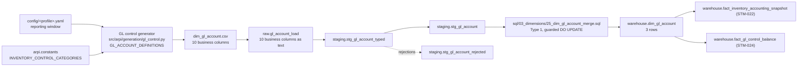

# STM-023 — GL Control Account Dimension

## Header

| Field | Value |
|---|---|
| **Mapping ID** | `STM-023` |
| **Title** | Selected synthetic control-account catalogue (never a chart of accounts) |
| **Status** | **Implemented** — generator, data-quality suite, raw table, staging views, warehouse dimension, Type 1 merge and reconciliations all exist and run on every pipeline execution. |
| **Version** | 1.0 |
| **Date** | 2026-08-08 |
| **Owner** | Michael Palmer |
| **Source system** | `arpi_synthetic_generator` |
| **Source entity** | `dim_gl_account` |
| **Target object** | `warehouse.dim_gl_account` |
| **Declared grain** | **One row per selected synthetic GL control account definition.** |
| **Phase** | Dealer Operations Command Center, delivery increment `DASH.8` |
| **Intermediate objects** | `raw.gl_account_load` (`sql/01_raw/21_raw_gl_account_load.sql`), `staging.stg_gl_account_typed` / `staging.stg_gl_account` / `staging.stg_gl_account_rejected` (`sql/02_staging/22_stg_gl_account.sql`) |
| **Merge script** | `sql/03_dimensions/25_dim_gl_account_merge.sql` |
| **Upstream objects** | None — the catalogue is a governed constant of the synthetic model |
| **Downstream objects** | `warehouse.fact_inventory_accounting_snapshot` (STM-022), `warehouse.fact_gl_control_balance` (STM-024), `reporting.vw_inventory_accounting`, `reporting.vw_inventory_gl_reconciliation` |
| **SCD policy** | **Type 1** ([ADR-0006](../architecture-decisions/ADR-0006-scd-type-selection-phase-1.md)) |
| **Authorizing decision** | [ADR-0013 §Decision](../architecture-decisions/ADR-0013-governed-web-operating-console.md) and [DASHBOARD_PROGRAM.md](../requirements/DASHBOARD_PROGRAM.md). Gate 4 evidence: [STAKEHOLDER_QUESTIONS.md `SQ-43`](../requirements/STAKEHOLDER_QUESTIONS.md). |

---

## 1. Purpose

`warehouse.dim_gl_account` names the inventory control accounts the stock schedule totals into. It
is **three rows**, and the smallness is the design.

**This is a selected control catalogue. It is not a chart of accounts.** A chart of accounts is a
long list, and a long list looks impressive; ARPI is building a focused inventory control schedule
and its reconciliation, and this table is where that boundary is easiest to breach. A control
catalogue that reconciles is worth more than a fake full COA that does not.

### 1.1 What is deliberately absent

There is no Cash, no Sales Revenue, no Cost of Sales, no Payroll, no Parts, no Service, no Rent, no
Accounts Payable, no Accounts Receivable, no Equity, no Retained Earnings and no Tax account,
because answering `SQ-43` needs none of them.

The boundary is enforced **physically**, not advisorily:

* `ck_dim_gl_account_category_domain` closes `account_category` to the three governed inventory
  control categories, so an account outside them cannot be inserted at all.
* `DQ-GLA-009` additionally scans the account **name** for general-ledger vocabulary, so a row that
  slipped past the category CHECK by mislabelling itself still fails a run rather than a review.

### 1.2 Every account is fictional

The account numbers sit in a conventional dealership inventory block so the shape is recognisable to
a controller, and every one of them is invented. No real dealer group's chart of accounts was
consulted, copied or approximated, and none may be.

---

## 2. Lineage

**Ordered lineage statement**

1. `GL_ACCOUNT_DEFINITIONS` in `src/arpi/generation/gl_control.py` declares the three accounts, one
   per governed inventory control category, with their invented numbers and names.
2. The generator stamps the active window from the configured reporting window and emits
   `dim_gl_account.csv`.
3. The CSV lands in `raw.gl_account_load`; the three-view staging pattern types, validates and
   deduplicates it.
4. `sql/03_dimensions/25_dim_gl_account_merge.sql` merges it into `warehouse.dim_gl_account`,
   assigning surrogate keys deterministically and updating in place only when an attribute actually
   differs.
5. `fact_inventory_accounting_snapshot` resolves `gl_account_key` from its
   `control_account_category`; `fact_gl_control_balance` resolves it from `gl_account_id`.

---

## 3. Mapping table

All 10 business columns of the source entity, in declared order, plus the lineage columns.

| Source field | Source type | Target field | Target type | Transformation | Default behaviour | Validation | Rejection behaviour | Lineage field | Owner |
|---|---|---|---|---|---|---|---|---|---|
| `gl_account_id` | `text` | `gl_account_id` | `varchar(16)` | Direct, format `GLA-####`. **The business key** and the merge's conflict target. Stable across loads. | `n/a — required` | `DQ-GLA-001` unique; `uq_dim_gl_account_gl_account_id` | `REJ-NULL-001` if blank; `REJ-KEY-001` on duplicate — the highest `raw_record_id` survives | `load_batch_id`, `source_row_number` | GL control generator |
| `account_number` | `text` | `account_number` | `varchar(20)` | Direct. Synthetic number in a conventional dealership inventory block. **Invented; never a real dealer group's.** Unique. | `n/a — required` | `DQ-GLA-003` unique; `uq_dim_gl_account_account_number` | `REJ-NULL-001` / `REJ-KEY-001` | `load_batch_id` | GL control generator |
| `account_name` | `text` | `account_name` | `varchar(60)` | Direct. Human-readable, invented. | `n/a — required` | `DQ-GLA-009` scans for general-ledger vocabulary | `REJ-NULL-001` if blank; `REJ-DOMAIN-001` when the name names a non-control account | `load_batch_id` | GL control generator |
| `account_category` | `text` | `account_category` | `varchar(40)` | Direct. One of `New Vehicle Inventory`, `Used Vehicle Inventory`, `Certified Vehicle Inventory`. **The scope boundary, closed by CHECK.** | `n/a — required` | `DQ-GLA-004`; `ck_dim_gl_account_category_domain` | `REJ-DOMAIN-001` outside the three categories | `load_batch_id` | GL control generator |
| `account_type` | `text` | `account_type` | `varchar(20)` | Direct. `Asset` or `Liability`. **Every DASH.8 account is an Asset**; `Liability` is permitted so a later increment can add a floorplan control account without a domain migration (§5). | `n/a — required` | `DQ-GLA-005`; `ck_dim_gl_account_type_domain` | `REJ-DOMAIN-001` | `load_batch_id` | GL control generator |
| `normal_balance` | `text` | `normal_balance` | `varchar(10)` | Direct. `Debit` or `Credit`. What makes the sign of a balance unambiguous. | `n/a — required` | `DQ-GLA-006`; `ck_dim_gl_account_normal_balance_domain` | `REJ-DOMAIN-001` | `load_batch_id` | GL control generator |
| `inventory_control_flag` | `text` | `inventory_control_flag` | `boolean` | Cast to `boolean`. **CHECK-coupled to `account_category`** so it cannot contradict the thing it summarises — a flag that disagrees with its own category is worse than no flag, because a consumer trusts it precisely because it looks authoritative. | `n/a — required` | `DQ-GLA-007`; `ck_dim_gl_account_control_flag_agrees` | `REJ-TYPE-001` if not castable; `REJ-RULE-001` if it contradicts the category | `load_batch_id` | GL control generator |
| `active_start_date` | `text` | `active_start_date` | `date` | Cast to `date`. First date the account is active. **A business date from the synthetic dataset, never a wall clock.** | `n/a — required` | `DQ-GLA-008`; `ck_dim_gl_account_active_window_ordered` | `REJ-TYPE-001` if not castable | `load_batch_id` | GL control generator |
| `active_end_date` | `text`, nullable | `active_end_date` | `date`, **nullable** | Cast to `date`. **NULL means still open, never "unknown".** | `NULL — the account is open` | `DQ-GLA-008`; `ck_dim_gl_account_active_window_ordered` | `REJ-TYPE-001` if present and not castable; `REJ-RULE-001` if it precedes the start | `load_batch_id` | GL control generator |
| `source_system` | `text` | `source_system` | `varchar(40)` | **Constant** `SYNTHETIC-DMS-GL`. | `n/a — constant` | `DQ-GLA-010`; `ck_dim_gl_account_source_system_not_blank` | `REJ-NULL-001` if absent | itself | GL control generator |
| *(database)* | — | `gl_account_key` | `integer` PK | Warehouse-assigned surrogate, `max(existing) + row_number() OVER (ORDER BY gl_account_id)` over rows new to the dimension. | `n/a — database-assigned` | `pk_dim_gl_account`; `ck_dim_gl_account_key_positive` | n/a | itself | Merge |
| *(database)* | — | `raw_record_id` | `bigserial` | Database-assigned. **Raw layer only.** | `n/a — database-assigned` | PK uniqueness | n/a | itself | Database |
| *(load process)* | — | `load_batch_id` | `uuid` | Assigned once per load. **Raw and staging layers only.** | `n/a — required` | Not null | n/a | itself | Loader |
| *(load process)* | — | `source_file_name` | `text` | `dim_gl_account.csv`. **Raw and staging layers only.** | `n/a — required` | Not null | n/a | itself | Loader |
| *(load process)* | — | `source_row_number` | `integer` | 1-based data-row number. **Raw and staging layers only.** | `n/a — required` | Not null; ≥ 1 | n/a | itself | Loader |
| *(database)* | — | `ingested_at` | `timestamptz` | `DEFAULT now()`. **Raw and staging layers only.** | `now()` | Not null | n/a | itself | Database |

> **Prohibited catalogue fields.** No parent account, account hierarchy level, roll-up node,
> statement classification, department or cost-centre segment, budget amount, opening balance or
> closing balance. Each of those is a general-ledger structure, and adding one would turn a control
> catalogue into a chart of accounts a column at a time. `DQ-GLA-002` holds the column contract to exactly the declared
> list and fails the run even when the extra column is empty.

---

## 4. The catalogue as built

| `gl_account_id` | `account_number` | `account_name` | `account_category` | `account_type` | `normal_balance` |
|---|---|---|---|---|---|
| `GLA-1210` | `1210` | New Vehicle Inventory Control | `New Vehicle Inventory` | `Asset` | `Debit` |
| `GLA-1220` | `1220` | Used Vehicle Inventory Control | `Used Vehicle Inventory` | `Asset` | `Debit` |
| `GLA-1230` | `1230` | Certified Vehicle Inventory Control | `Certified Vehicle Inventory` | `Asset` | `Debit` |

Certified is its own control account, and that is deliberately **not** the sales rule, which groups
Certified with Used. A certified unit carries a capitalized certification cost the others do not, so
the accounting domain separates what the sales domain combines. Two domains, two correct groupings.

---

## 5. Floorplan Liability is absent, and that is a recorded decision

`warehouse.fact_inventory_accounting_snapshot` carries `floorplan_principal`, so a Floorplan
Liability control account is available to model. It is deliberately **not** in the catalogue.

`KPI-ACC-001` is an inventory **asset** subledger measure. Putting a liability into the same
reconciliation invites exactly one mistake: netting the two into a "net inventory" figure that means
nothing and that no controller would recognise. No registered stakeholder question requires liability
reconciliation. Floorplan principal stays on the stock-level schedule as liability **context**, which
is what it is.

`account_type` permits `Liability` so a later increment can add one **without** a migration to the
domain. If it does, it must be a separate liability class reconciling against
`SUM(floorplan_principal)`, never against `current_book_value`, and it must never enter
`KPI-ACC-001`.

---

## 6. There is no Wholesale Inventory category, and that is also a recorded decision

Three control categories, not four. A `Wholesale Inventory` control account was considered and
rejected.

Nothing observable **at a month-end** distinguishes a unit held for wholesale from a unit held for
retail. The only thing that would distinguish them is how the unit was eventually disposed of — and
reading that would be exactly the future-outcome leakage STM-022 §1.5 forbids. A category that can
only be assigned by consulting the future is not a classification; it is a label applied in
hindsight, and a schedule built on one would be quietly wrong in a way no reconciliation could
detect.

If a later increment introduces an observable held-for-wholesale signal — a marked disposition
intent recorded at the time, not inferred afterwards — the category can be added, because
`account_category` is a CHECK domain and the addition is a one-line migration.

---

## 7. SCD policy: Type 1

An account's number, name and category are properties of the invented account, and a correction to
any of them describes what was always true. No fact points at a historical version of an account
definition — `fact_gl_control_balance` resolves the account **as it is** — so there is no history
requirement and the merge overwrites in place. The active window is carried as attributes rather
than as Type 2 rows for the same reason.

### 7.1 Why the update is guarded

Without the `WHERE` clause on `DO UPDATE`, every rerun would rewrite every row, producing dead
tuples, pointless WAL and a misleading row count. The comparison uses `IS DISTINCT FROM` so that a
NULL on both sides counts as equal — `active_end_date` is NULL on every open account, and an
unguarded comparison would rewrite the whole catalogue every run.

---

## 8. Idempotency guarantees

Rerunning with unchanged source writes **zero** rows. An empty staging view is a no-op. Rows already
present keep the key they were assigned on their first load, so a key is never reused and never
reassigned; rebuilding a database from the same CSVs reproduces identical keys.

---

## 9. Rejection handling

`staging.stg_gl_account_rejected` carries every refused row with its `rejection_code`,
`rejection_category`, `rejection_reason` and the full source payload as `jsonb`:
`REJ-TYPE-001`, `REJ-NULL-001`, `REJ-DOMAIN-001`, `REJ-KEY-001`.

---

## 10. Validation checks gating the load

`DQ-GLA-001` … `DQ-GLA-010`, in `src/arpi/generation/accounting_validation.py`. The three that carry
the scope boundary are:

| Check | What it proves |
|---|---|
| `DQ-GLA-004` | Every account category is one of the three governed inventory control categories |
| `DQ-GLA-009` | No account **name** contains general-ledger vocabulary — the catalogue cannot quietly become a chart of accounts |
| `DQ-GLA-002` | The column contract holds exactly, so no hierarchy, statement or balance column can be added even empty |

---

## 11. Reconciliations

| Rule | What it proves |
|---|---|
| `RECON-INGEST-DIM-GL-ACCOUNT-CHAIN` | Every generated row reaches staging |
| `RECON-INGEST-DIM-GL-ACCOUNT-WAREHOUSE` | Every accepted staging row reaches the dimension |
| `RECON-DIM-GL-ACCOUNT-ROWCOUNT` | The dimension holds exactly the catalogue |
| `RECON-ACC-CATEGORY-TOTALS` | No schedule line is routed to an account whose category contradicts the unit's condition |

---

## 12. Privacy class

**No personal data.** An account definition names a number, a name, a category and a window.

---

## 13. Open questions and known gaps

1. **Floorplan Liability deferred.** §5.
2. **No Wholesale Inventory category.** §6.
3. **No account hierarchy.** A control catalogue has no parent, no roll-up and no statement
   classification, because none is needed to reconcile a schedule and each would be a step towards a
   general ledger this project does not build.
4. **Three accounts, one store group.** The catalogue is not per-store: every store reconciles
   against the same three control accounts, and the store is part of the *balance's* grain rather
   than the account's.
