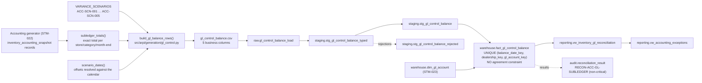

# STM-024 — GL Control Balance Fact

## Header

| Field | Value |
|---|---|
| **Mapping ID** | `STM-024` |
| **Title** | GL inventory control balance (the ledger side of the reconciliation) |
| **Status** | **Implemented** — generator, data-quality suite, raw table, staging views, warehouse fact, fact load, reconciliations and reporting views all exist and run on every pipeline execution. |
| **Version** | 1.0 |
| **Date** | 2026-08-08 |
| **Owner** | Michael Palmer |
| **Source system** | `arpi_synthetic_generator` |
| **Source entity** | `gl_control_balance` |
| **Target object** | `warehouse.fact_gl_control_balance` |
| **Declared grain** | **One row per dealership, per GL control account, per balance date.** |
| **Phase** | Dealer Operations Command Center, delivery increment `DASH.8` |
| **Intermediate objects** | `raw.gl_control_balance_load` (`sql/01_raw/22_raw_gl_control_balance_load.sql`), `staging.stg_gl_control_balance_typed` / `staging.stg_gl_control_balance` / `staging.stg_gl_control_balance_rejected` (`sql/02_staging/23_stg_gl_control_balance.sql`) |
| **Load script** | `sql/04_facts/20_fact_gl_control_balance_load.sql` |
| **Upstream objects** | `warehouse.dim_gl_account` (STM-023), `warehouse.dim_dealership` (STM-002), `warehouse.dim_date` (STM-001), `warehouse.fact_inventory_accounting_snapshot` (STM-022, as the generation basis) |
| **Downstream objects** | `reporting.vw_inventory_gl_reconciliation`, `reporting.vw_accounting_exceptions`, `KPI-ACC-002`, `KPI-ACC-003` |
| **Authorizing decision** | [ADR-0013 §Decision](../architecture-decisions/ADR-0013-governed-web-operating-console.md) and [DASHBOARD_PROGRAM.md](../requirements/DASHBOARD_PROGRAM.md). Gate 4 evidence: [STAKEHOLDER_QUESTIONS.md `SQ-43`](../requirements/STAKEHOLDER_QUESTIONS.md). |

---

## 1. Purpose

`warehouse.fact_gl_control_balance` is one control-account balance per store per account per
month-end: the **GL side** of the reconciliation the stock schedule (STM-022) is compared against.

### 1.1 One signed balance, and that is deliberate

There is no `debit_balance`, no `credit_balance`, no journal reference and no posting batch. The
governed question — *does the control account agree with the schedule?* — is answered by **one signed
balance**, and manufacturing debit/credit detail to look accounting-like would be inventing a general
ledger one column at a time. `dim_gl_account.normal_balance` states the account's natural side, which
is what makes the sign unambiguous.

### 1.2 What an exact reconciliation proves, and what it does not

**These balances are generated from the same subledger they are reconciled against**, plus a governed
table of deliberate variances, so the reconciliation surface can be seen working in both its states.
That is the whole reason the fact exists.

It is **not** an independently ingested second accounting system. An exact reconciliation proves the
reconciliation **arithmetic** is correct; it does **not** prove that two independent sources agree,
because there is only one source.

This is recorded in LIMITATIONS.md, repeated on the table comment, repeated on every reporting view
that publishes a variance, and repeated in `RECON-ACC-GL-SUBLEDGER`'s own description. No surface may
claim otherwise.

### 1.3 A variance is not a defect

A balance that differs from the schedule is **structurally valid data**. Whether the two agree is a
reconciliation question answered by `RECON-ACC-GL-SUBLEDGER` and rendered by
`reporting.vw_inventory_gl_reconciliation`. There is deliberately **no constraint on this table
requiring agreement**, and `RECON-ACC-GL-SUBLEDGER` is registered in
`NON_CRITICAL_RECONCILIATION_IDS`: failing a pipeline run because a controlled accounting variance
exists would make the exception surface unusable and would teach a reader that a variance means
broken data. It does not. The variance is still calculated, recorded and rendered — it is the
**status** that is not critical.

### 1.4 Semi-additivity

`net_balance` is **additive across accounts and stores at one balance date**, and is **never
additive across dates**. Summing two month-ends produces a number that is not a balance. A
period-ending balance is the **last** comparable date, not a sum.

### 1.5 Comparability: matched dates only

A GL balance and a subledger balance are comparable only when the store, the control account **and
the date** all match. Comparing a month-end control balance with a mid-month schedule and calling the
difference a variance is the classic reconciliation error, and it is prevented here by both sides
being month-end **by construction** rather than by a caution in a document.

---

## 2. Lineage



**Ordered lineage statement**

1. The accounting generator produces the stock schedule (STM-022).
2. `subledger_totals()` totals it to `(store, control category, month-end)` — the exact figure the
   control account is expected to carry.
3. `scenario_dates()` resolves each planted scenario's month-end **offset** against the accounting
   calendar the current profile actually produced (§4.2).
4. `build_gl_balance_rows()` writes one balance per position: the subledger total plus the scenario's
   signed variance, or **no row at all** where a scenario omits the GL side, or a balance at a
   position the subledger does not carry where a scenario plants an orphan.
5. Rows are ordered by `(balance_date, dealership_id, category)` and `gl_control_balance_id` is
   assigned as an ordinal `GLB-########`.
6. The CSV lands in `raw.gl_control_balance_load`; the three-view staging pattern types, validates
   and deduplicates it.
7. `sql/04_facts/20_fact_gl_control_balance_load.sql` resolves every surrogate key and upserts on the
   declared grain. **It reconciles nothing and corrects nothing** (§5.1).
8. `reporting.vw_inventory_gl_reconciliation` FULL JOINs the two sides and publishes the signed
   variance and the comparison state.

---

## 3. Mapping table

All 5 business columns of the source entity, in declared order, plus the lineage columns.

| Source field | Source type | Target field | Target type | Transformation | Default behaviour | Validation | Rejection behaviour | Lineage field | Owner |
|---|---|---|---|---|---|---|---|---|---|
| `gl_control_balance_id` | `text` | *(not stored — the grain is the identity)* | — | Format `GLB-########`. The **staging** natural key. Deliberately not a fact column: the fact's identity is `(balance date, store, account)`. | `n/a — required` | `DQ-GLB-001` unique | `REJ-NULL-001` if blank; `REJ-KEY-001` on duplicate — the highest `raw_record_id` survives | `load_batch_id`, `source_row_number` | GL control generator |
| `dealership_id` | `text` | `dealership_key` | `integer` FK | Resolved to `dim_dealership.dealership_key` **as at the balance date** (SCD Type 2) — the same basis the schedule uses, so both sides land on the same key. **Part of the declared grain.** | `n/a — required` | `DQ-GLB-003`; `fk_fact_gl_control_balance_dealership` | Dropped by the load's **inner** join, recorded as `REJ-REF-001` | `load_batch_id` | GL control generator |
| `gl_account_id` | `text` | `gl_account_key` | `integer` FK | Resolved to `dim_gl_account.gl_account_key` by business key. **Part of the declared grain.** An account the catalogue does not contain is a **scope breach**, not a lookup miss: the catalogue's category CHECK is what keeps a general-ledger account out of this fact. | `n/a — required` | `DQ-GLB-004`; `fk_fact_gl_control_balance_account` | Dropped by the inner join, recorded as `REJ-REF-001` | `load_batch_id` | GL control generator |
| `balance_date` | `text` | `balance_date_key` | `integer` FK | Cast to `date`, resolved to `dim_date.date_key`. **Always a month-end.** **Part of the declared grain.** Comparable with a schedule only at the **same** date. | `n/a — required` | `DQ-GLB-005` in window, `DQ-GLB-006` month-end; `fk_fact_gl_control_balance_date` | `REJ-TYPE-001` if not castable; dropped by the inner join if absent from `dim_date` | `load_batch_id` | GL control generator |
| `net_balance` | `text` | `net_balance` | `numeric(16,2)` | Cast to `numeric(16,2)`. **Loaded exactly as it arrives.** May legitimately differ from the subledger: that difference is `KPI-ACC-003`'s signed variance and an exception to investigate, never proof of an accounting error. | `n/a — required` | `DQ-GLB-007`; **no** agreement constraint by design | `REJ-TYPE-001` if not castable | `load_batch_id` | GL control generator |
| `source_system` | `text` | `source_system` | `varchar(40)` | **Constant** `SYNTHETIC-DMS-GL`. | `n/a — constant` | `DQ-GLB-008`; `ck_fact_gl_control_balance_source_system_not_blank` | `REJ-NULL-001` if absent | itself | GL control generator |
| *(database)* | — | `gl_control_balance_key` | `bigint` PK | Warehouse-assigned surrogate, deterministic by the declared grain order. | `n/a — database-assigned` | `pk_fact_gl_control_balance`; `ck_fact_gl_control_balance_key_positive` | n/a | itself | Fact load |
| *(database)* | — | `raw_record_id` | `bigserial` | Database-assigned. **Raw layer only.** | `n/a — database-assigned` | PK uniqueness | n/a | itself | Database |
| *(load process)* | — | `load_batch_id` | `uuid` | Assigned once per load. **Raw and staging layers only.** | `n/a — required` | Not null | n/a | itself | Loader |
| *(load process)* | — | `source_file_name` | `text` | `gl_control_balance.csv`. **Raw and staging layers only.** | `n/a — required` | Not null | n/a | itself | Loader |
| *(load process)* | — | `source_row_number` | `integer` | 1-based data-row number. **Raw and staging layers only.** | `n/a — required` | Not null; ≥ 1 | n/a | itself | Loader |
| *(database)* | — | `ingested_at` | `timestamptz` | `DEFAULT now()`. **Raw and staging layers only.** | `now()` | Not null | n/a | itself | Database |

> **Prohibited balance fields.** No debit amount, credit amount, journal entry identifier, journal
> line, posting batch, posting timestamp, period-close state, trial-balance bucket, opening or
> closing balance pair, adjusting-entry flag, suspense account or reversal reference. `DQ-GLB-002` holds the column
> contract to exactly the declared list and fails the run even when the extra column is empty. One signed balance answers
> the governed question; each of these would be a step into a general ledger this project does not
> build.

---

## 4. Derivation reference

### 4.1 The balance is the subledger plus a governed variance

For each `(store, control category, month-end)` the subledger carries, the generator writes

```
net_balance  =  SUM(current_book_value) at that position
              + the planted variance, or 0.00
```

Most positions carry `0.00` and reconcile exactly, because a reconciliation surface where everything
is broken teaches a reader nothing.

### 4.2 The planted scenarios

Five, declared once in `VARIANCE_SCENARIOS`, producing **all four** comparison states.

| Scenario | Store | Category | Month-end offset | Effect |
|---|---|---|---|---|
| `ACC-SCN-001` | `GSA-001` | Used Vehicle Inventory | 3 back from last | `+1,250.00` — GL above the schedule |
| `ACC-SCN-002` | `GSA-002` | New Vehicle Inventory | 2 back from last | `−865.40` — GL below the schedule |
| `ACC-SCN-003` | `GSA-003` | Certified Vehicle Inventory | 1 back from last | `+412.75` |
| `ACC-SCN-004` | `GSA-002` | Certified Vehicle Inventory | 4 back from last | **No GL row at all** → `Missing GL balance` |
| `ACC-SCN-005` | `GSA-003` | New Vehicle Inventory | last month-end | **GL balance with no schedule behind it** → `Missing subledger balance` |

Both signs are represented so `KPI-ACC-003`'s group rollup can be proved to sum **signed** values
rather than absolute ones. `ACC-SCN-004` omits the GL row entirely, because the only way to test that
a missing side reports NULL rather than zero is for the row to genuinely be absent. `ACC-SCN-005` is
the exception a controller actually hunts — a control account carrying a balance the schedule has
nothing behind it — and it is reachable only at a store/category the store does not stock, which is
why it is planted rather than waited for.

**These are synthetic demonstration conditions. They are not discovered business findings and no
document may describe them as such.**

**Why offsets and not dates.** The scenarios were originally written with literal month-end dates in
the development window. The shorter `test` profile — the profile the integration suite runs on —
never reached them, so every reconciliation state the increment exists to demonstrate was absent from
the profile that tests it, and `test_kpi_acc_002_is_never_defaulted_to_zero_when_a_balance_is_absent`
failed for exactly that reason. Expressing each scenario as an offset back from the last month-end,
taken modulo the number of month-ends the profile produced, lands every scenario in every profile and
reproduces the original development dates exactly.

### 4.3 Measured row volume (development profile)

| Figure | Value |
|---|---|
| Control accounts | 3 |
| Balance rows | 42 |
| Comparison rows published by the reporting view | 43 |
| Reconciled exactly | 39 |
| Carrying a variance | 2 (one of each sign) |
| Missing GL balance | 1 |
| Missing subledger balance | 1 |

---

## 5. Load strategy

`sql/04_facts/20_fact_gl_control_balance_load.sql`, executed by the Python loader after every
dimension merge including `25_dim_gl_account_merge.sql`.

### 5.1 Nothing is reconciled here, and nothing is corrected here

`net_balance` is loaded exactly as it arrives. The load does **not** compare it with the subledger,
does **not** adjust it towards the subledger, and does **not** drop a row because the two disagree.
Silently repairing a variance in the load would leave a reconciliation surface that can only ever
show agreement, which proves nothing.

### 5.2 No side is ever fabricated

If the generator withheld a balance for a store-account-month, no row is invented. The reconciliation
surface reports that as a **missing GL side with a NULL variance**, never as a zero balance —
`COALESCE`-ing an absent balance to `0.00` would report a full-inventory variance as though the
account had genuinely been zeroed.

### 5.3 Why every join is an inner join

Every key is `NOT NULL` by contract. A balance for a date the calendar does not carry has no schedule
to be compared against; a balance for a store that does not exist reconciles to nothing; and an
account the catalogue does not contain is a scope breach that defaulting past would route around.

---

## 6. Idempotency guarantees

Rerunning with unchanged source writes **zero** rows: `ON CONFLICT (balance_date_key, dealership_key,
gl_account_key) DO UPDATE` fires only when `net_balance` or `source_system` actually differs. An empty
staging view is a no-op. Rows already present keep their original key.

---

## 7. Rejection handling

`staging.stg_gl_control_balance_rejected` carries every refused row with its `rejection_code`,
`rejection_category`, `rejection_reason` and the full source payload as `jsonb`: `REJ-TYPE-001`,
`REJ-NULL-001`, `REJ-DOMAIN-001`, `REJ-KEY-001`, plus `REJ-REF-001` recorded by the loader.

**A variance is never a rejection.** A balance that differs from the schedule passes staging
untouched; the difference is reported, not quarantined.

---

## 8. Validation checks gating the load

`DQ-GLB-001` … `DQ-GLB-008`, in `src/arpi/generation/accounting_validation.py`. The three that carry the
domain are:

| Check | What it proves |
|---|---|
| `DQ-GLB-004` | Every balance names an account the catalogue contains |
| `DQ-GLB-005`, `DQ-GLB-006` | Every balance date is inside the governed window and is a month-end, so matched-date comparability holds by construction |
| `DQ-GLB-002` | The column contract holds exactly, so no debit/credit, journal, posting or period-close column can be added even empty |

---

## 9. Reconciliations

| Rule | What it proves |
|---|---|
| `RECON-FACT-GL-CONTROL-BALANCE-WAREHOUSE` | Every accepted staging balance reaches the warehouse |
| `RECON-GLB-GRAIN` | The declared grain is still enforced on the deployed table |
| `RECON-ACC-GL-SUBLEDGER` | **Not an equality.** Every comparison row is *well formed*: a comparable row carries a variance and a non-null reconciled flag whose value agrees with whether that variance is zero, and a row with a missing side carries neither. Registered **non-critical**. |
| `RECON-REPORT-GL-RECON-ROWS` | The FULL JOIN in the reporting view duplicates no comparison |

---

## 10. Privacy class

**No personal data.** A control balance names a store, an account and a date.

---

## 11. Downstream reporting ownership

| Object | What it owns |
|---|---|
| `reporting.vw_inventory_gl_reconciliation` | `KPI-ACC-002` (control balance), `KPI-ACC-003` (signed variance) |
| `reporting.vw_accounting_exceptions` | `ACC-GL-VARIANCE`, `ACC-MISSING-GL-BALANCE`, `ACC-MISSING-SUBLEDGER-BALANCE` |

**Export boundary.** `DASH.8` exports **no** browser dataset from this fact and adds **no** console
route.

---

## 12. Open questions and known gaps

1. **The GL side is generated from the subledger.** §1.2. This is the single most important
   limitation of the increment and it is repeated on every surface.
2. **No debit/credit detail.** §1.1.
3. **No liability control account.** Floorplan principal is carried on the schedule as context and
   has no control balance to reconcile against. STM-023 §5.
4. **The catalogue is not per-store.** Every store reconciles against the same three accounts; the
   store is part of the balance's grain rather than the account's.
5. **No posting lag on the GL side.** ARPI holds no posting timestamp, so the only supportable lag is
   acquisition-to-schedule (STM-022 §4.6). No `KPI-ACC-011` variant measures a journal delay.
