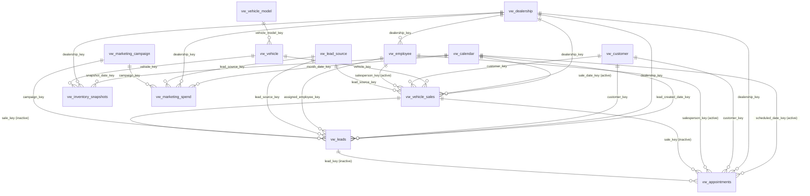

# Relationship Plan — ARPI Semantic Model

**Last reviewed:** 2026-07-29
**Parent:** [README.md](README.md)

Every relationship in the planned model, with its cardinality, its filter direction, and whether it is
active. Each one is asserted to resolve against real data by
`tests/integration/test_reporting_layer_completeness.py`, which fails if any non-NULL key on any fact view
does not find its dimension row.

---

## 1. The rule, stated once

**Every relationship is many-to-one from the fact to the dimension, and filters in a single direction from
the dimension to the fact. No relationship in this model is bidirectional.**

That is a design constraint, not a default that happens to hold. Bidirectional filtering is how a model
starts producing different answers depending on which visual asked, and it is almost always a symptom of a
dimension that is not really a dimension. The reporting layer was built so it is never needed:

* Every dimension key is unique. `tests/integration/test_reporting_layer_completeness.py` asserts this per
  dimension, so no relationship is ever forced into many-to-many.
* Every measure's numerator and denominator live on the **same** fact table, as separate additive columns.
  Nothing needs to filter a dimension from one fact in order to count rows of another.
* Where two facts genuinely relate — a lead to the sale it produced — the relationship exists but is
  **inactive**, because activating it would change what a funnel measure means.

---

## 2. Star-schema diagram

---

## 3. Relationship register

`1:*` is many-to-one from the fact side. **Direction** is always `Single`, from the "from" table to the
"to" table. **Blank row** says whether the key is nullable on the fact, which decides the model's blank-row
policy rather than requiring a bidirectional filter.

### 3.1 Calendar

| From | To | Column | Cardinality | Direction | Active | Blank row | Notes |
|---|---|---|---|---|---|---|---|
| `vw_calendar` | `vw_vehicle_sales` | `sale_date_key` | 1:* | Single | **Active** | No | The governed date basis for every sales and gross KPI. |
| `vw_calendar` | `vw_vehicle_sales` | `delivery_date_key` | 1:* | Single | Inactive | No | Delivery-basis reporting only, via `USERELATIONSHIP`, and must be labelled as such. |
| `vw_calendar` | `vw_inventory_snapshots` | `snapshot_date_key` | 1:* | Single | **Active** | No | The single as-of date every inventory KPI is evaluated at. |
| `vw_calendar` | `vw_leads` | `lead_created_date_key` | 1:* | Single | **Active** | No | Both sides of every funnel rate anchor here. |
| `vw_calendar` | `vw_appointments` | `scheduled_date_key` | 1:* | Single | **Active** | No | The show-rate basis: an appointment booked for a later period is not eligible to show in this one. |
| `vw_calendar` | `vw_appointments` | `created_date_key` | 1:* | Single | Inactive | No | Booking-activity analysis only. |
| `vw_calendar` | `vw_appointments` | `show_date_key` | 1:* | Single | Inactive | **Yes** | The show-to-sale basis. NULL when the customer did not arrive, which is the majority case. |
| `vw_calendar` | `vw_marketing_spend` | `month_date_key` | 1:* | Single | **Active** | No | Always a month start, which is what makes a day-grain cost figure impossible. |

### 3.2 Store, vehicle and people

| From | To | Column | Cardinality | Direction | Active | Blank row | Notes |
|---|---|---|---|---|---|---|---|
| `vw_dealership` | `vw_vehicle_sales` | `dealership_key` | 1:* | Single | **Active** | No | |
| `vw_dealership` | `vw_inventory_snapshots` | `dealership_key` | 1:* | Single | **Active** | No | |
| `vw_dealership` | `vw_leads` | `dealership_key` | 1:* | Single | **Active** | No | |
| `vw_dealership` | `vw_appointments` | `dealership_key` | 1:* | Single | **Active** | No | |
| `vw_dealership` | `vw_marketing_spend` | `dealership_key` | 1:* | Single | **Active** | No | |
| `vw_dealership` | `vw_employee` | `dealership_key` | 1:* | Single | **Active** | No | Dimension-to-dimension. Filters employees by store; does not reach a fact except through the employee relationships. |
| `vw_vehicle_model` | `vw_vehicle` | `vehicle_model_key` | 1:* | Single | **Active** | No | The one snowflake. A model filters vehicles, which filter the facts. |
| `vw_vehicle` | `vw_vehicle_sales` | `vehicle_key` | 1:* | Single | **Active** | No | |
| `vw_vehicle` | `vw_inventory_snapshots` | `vehicle_key` | 1:* | Single | **Active** | No | |
| `vw_customer` | `vw_vehicle_sales` | `customer_key` | 1:* | Single | **Active** | **Yes** | NULL on wholesale and dealer trades, which have no retail customer. |
| `vw_customer` | `vw_leads` | `customer_key` | 1:* | Single | **Active** | **Yes** | NULL for an anonymous lead. No customer record is synthesised to fill it. |
| `vw_customer` | `vw_appointments` | `customer_key` | 1:* | Single | **Active** | **Yes** | |

### 3.3 Employee — six role-playing relationships, one dimension

| From | To | Column | Cardinality | Direction | Active | Blank row | Notes |
|---|---|---|---|---|---|---|---|
| `vw_employee` | `vw_vehicle_sales` | `salesperson_key` | 1:* | Single | **Active** | **Yes** | The default employee relationship on the sale fact. |
| `vw_employee` | `vw_vehicle_sales` | `desk_manager_key` | 1:* | Single | Inactive | **Yes** | Manager-involvement context, required by [ARCHITECTURE.md §23](../../ARCHITECTURE.md). |
| `vw_employee` | `vw_vehicle_sales` | `finance_manager_key` | 1:* | Single | Inactive | **Yes** | F&I productivity analysis. |
| `vw_employee` | `vw_leads` | `assigned_employee_key` | 1:* | Single | **Active** | **Yes** | Lead ownership. |
| `vw_employee` | `vw_appointments` | `salesperson_key` | 1:* | Single | **Active** | **Yes** | |
| `vw_employee` | `vw_appointments` | `bdc_employee_key` | 1:* | Single | Inactive | **Yes** | BDC appointment-setting performance. |

### 3.4 Marketing

| From | To | Column | Cardinality | Direction | Active | Blank row | Notes |
|---|---|---|---|---|---|---|---|
| `vw_lead_source` | `vw_leads` | `lead_source_key` | 1:* | Single | **Active** | No | |
| `vw_lead_source` | `vw_vehicle_sales` | `lead_source_key` | 1:* | Single | **Active** | **Yes** | NULL where no source was recorded on the deal. |
| `vw_lead_source` | `vw_marketing_spend` | `lead_source_key` | 1:* | Single | **Active** | No | |
| `vw_marketing_campaign` | `vw_leads` | `campaign_key` | 1:* | Single | **Active** | **Yes** | NULL for a walk-in and every other campaign-less lead. |
| `vw_marketing_campaign` | `vw_marketing_spend` | `campaign_key` | 1:* | Single | **Active** | No | |

### 3.5 Fact to fact — all inactive

| From | To | Column | Cardinality | Direction | Active | Blank row | Notes |
|---|---|---|---|---|---|---|---|
| `vw_vehicle_sales` | `vw_leads` | `sale_key` | 1:* | Single | **Inactive** | **Yes** | Tracing a deal back to its lead. Activating it would let a sale's period filter the funnel, and a lead counts in the period it *arrived*. |
| `vw_vehicle_sales` | `vw_appointments` | `sale_key` | 1:* | Single | **Inactive** | **Yes** | As above, for the appointment fact. |
| `vw_leads` | `vw_appointments` | `lead_key` | 1:* | Single | **Inactive** | No | Appointment-to-lead drill-through. Inactive because the two facts have different grains and different date bases; joining them by default would silently mix them. |

---

## 4. Marked date table

**`vw_calendar` is marked as the date table.** Its `calendar_date` column is the date column.

The three conditions Power BI requires, each asserted by `tests/integration/test_date_table_coverage.py`:

| Condition | Evidence |
|---|---|
| One row per date | `count(*) = count(DISTINCT date_key) = count(DISTINCT calendar_date)` |
| Contiguous, no gaps | `count(*) = max(calendar_date) − min(calendar_date) + 1` |
| Covers every fact date | Every one of the eight fact date keys resolves, and every fact's date range falls inside the calendar's |

`year_month_number` is set as the sort-by column for `year_month_label`. Without it a report sorts
`2025-10` before `2025-2` and nobody notices until a trend line is read backwards.

`is_selling_day` is the denominator of any per-selling-day measure. Note that **weekends are selling days**
in ARPI: New Hampshire permits Sunday vehicle sales, so the usual "exclude Sunday" assumption is wrong here.

---

## 5. Role-playing dates

Eight date keys across five facts point at one calendar. ARPI handles that with **one active relationship
plus inactive relationships activated by `USERELATIONSHIP`**, never by duplicating the calendar view.

A duplicated calendar is the other common approach and it is the wrong one here. It doubles the date table,
breaks the marked-date-table designation, and lets two time-intelligence measures disagree about what "last
month" means. `tests/integration/test_reporting_layer_completeness.py` asserts that exactly one calendar
view exists and that each fact exposes its date roles as distinct columns.

| Fact | Role | Column | Active | What the role means |
|---|---|---|---|---|
| `vw_vehicle_sales` | Sale | `sale_date_key` | **Active** | The deal was finalized. Every sales and gross KPI. |
| `vw_vehicle_sales` | Delivery | `delivery_date_key` | Inactive | The vehicle left the lot. Always on or after the sale date. |
| `vw_inventory_snapshots` | Snapshot | `snapshot_date_key` | **Active** | The as-of date. Only one role exists on this fact. |
| `vw_leads` | Lead creation | `lead_created_date_key` | **Active** | The lead arrived. Only one role, and deliberately so. |
| `vw_appointments` | Created | `created_date_key` | Inactive | The appointment was booked. |
| `vw_appointments` | Scheduled | `scheduled_date_key` | **Active** | The appointment was due. `KPI-FUN-004` show rate. |
| `vw_appointments` | Show | `show_date_key` | Inactive | The customer arrived. `KPI-FUN-005` show-to-sale. Nullable. |
| `vw_marketing_spend` | Spend month | `month_date_key` | **Active** | The first day of the month. Only one role. |

### 5.1 Two measures on the appointment fact use different bases

This is the subtlety most likely to be got wrong. `KPI-FUN-004` is evaluated on the **scheduled** date, so
an appointment booked for next month is not in this month's denominator. `KPI-FUN-005` is evaluated on the
**show** date, so the visit and its outcome sit in the same period. A measure that mixes them — a
scheduled-basis numerator over a show-basis denominator — produces a plausible number that means nothing.

The show-to-sale measure must therefore be written with `USERELATIONSHIP(vw_calendar[date_key],
vw_appointments[show_date_key])` and labelled as show-date-based on the visual.

---

## 6. Hidden-key recommendations

| Hide | On | Why |
|---|---|---|
| `date_key` | `vw_calendar` | Use `calendar_date`, `month_year_label` or `year_month_label`. |
| `dealership_key`, `employee_key`, `customer_key`, `vehicle_key`, `vehicle_model_key`, `lead_source_key`, `campaign_key` | Their dimensions and every fact | Relationship columns. A report author never wants one on an axis. |
| `sale_key`, `lead_key`, `appointment_key`, `inventory_snapshot_key`, `marketing_spend_key` | Their facts | Fact surrogate keys; used for the inactive fact-to-fact relationships only. |
| `sale_date_key`, `delivery_date_key`, `snapshot_date_key`, `lead_created_date_key`, `created_date_key`, `scheduled_date_key`, `show_date_key`, `month_date_key` | Their facts | Every date belongs on `vw_calendar`. A fact's own date key on a visual bypasses the marked date table and silently disables time intelligence. |
| `year_month_number` | `vw_calendar` | Sort-by column for `year_month_label`. |
| `age_bucket_sort_order` | `vw_inventory_aging` | Sort-by column for `age_bucket`. |
| `retail_unit_count`, `new_unit_count`, `used_unit_count`, `wholesale_unit_count`, `dealer_trade_unit_count`, `retail_front_end_gross`, `retail_back_end_gross`, `retail_total_gross`, `retail_days_in_inventory_total` | `vw_vehicle_sales` | Pre-filtered numerators. They exist to be summed by a measure. Visible, they invite a report author to put `unit_count` and `retail_unit_count` on the same visual. |
| `aged_unit_count`, `aged_inventory_investment` | `vw_inventory_snapshots` | As above. |
| `valid_lead_count`, `duplicate_lead_count`, `contacted_lead_count`, `appointment_set_lead_count`, `appointment_shown_lead_count`, `sold_lead_count`, `response_seconds_total`, `responded_lead_count`, `unresponded_lead_count` | `vw_leads` | As above. |
| `eligible_appointment_count`, `cancelled_in_advance_count`, `shown_appointment_count`, `shown_and_sold_appointment_count`, `confirmed_appointment_count`, `test_drive_count`, `write_up_count` | `vw_appointments` | As above. |
| `cost_per_lead`, `cost_per_sale`, `gross_return_on_ad_spend`, `inventory_turn`, `days_supply` | Their analytical views, where imported | Materialised at the view's own grain. The model's measure recomputes them; two versions of one number visible at once is how a report starts disagreeing with itself. |

**Do not hide** `source_system`. It appears on every table so that no reader mistakes synthetic data for
real dealer data, and hiding it would remove the one column that says so.

---

## 7. Why no relationship needs a bidirectional filter

Four situations normally push a modeller towards bidirectional filtering. None of them arises here.

| Situation | Why it does not arise |
|---|---|
| A dimension slicer must show only values present in the fact | Handled by the visual's own filtering, or by an explicitly written measure. The dimensions here are small — 3 stores, 19 sources, 24 campaigns — so an unfiltered slicer is not a usability problem. |
| A measure counts rows of a second fact filtered by a first | Never needed: every KPI's numerator and denominator are columns on **one** fact table. That is the single design decision that keeps this model one-directional. |
| A many-to-many relationship needs a bridge | Every dimension key is unique, asserted per dimension. No many-to-many relationship exists. |
| Funnel stages span two facts | The lead-grain stages live on `vw_leads` and the appointment-grain stages on `vw_appointments`, and the funnel chain across that grain shift is reconciled in SQL (`RECON-FUNNEL-CHAIN`) rather than joined in DAX. |
