# Relationship Plan — ARPI Semantic Model

**Last reviewed:** 2026-07-29
**Parent:** [README.md](README.md)

Every relationship in the model as built, with its TMDL name, its cardinality, its filter direction, whether
it is active, and its blank-row behaviour. The register is
`ARPI_Performance_Intelligence.SemanticModel/definition/relationships.tmdl`, and the **TMDL name is the
identifier** — it is what `USERELATIONSHIP` names, what a diff shows, and what a static check asserts.

Each relationship is asserted to resolve against real data by
`tests/integration/test_reporting_layer_completeness.py`, which fails if any non-NULL key on any fact view
does not find its dimension row. That is a statement about the **database**. Whether the tabular engine
accepts the resulting model is a different question, and it has not been answered: Power BI Desktop has never
opened this model. See [08-desktop-validation.md](08-desktop-validation.md).

**Forty-two relationships: thirty-two active, ten inactive.**

---

## 1. The rule, stated once

**Every relationship is many-to-one from the fact to the dimension, and filters in a single direction from
the dimension to the fact. No relationship in this model is bidirectional, and none is many-to-many.**

That is a design constraint, not a default that happens to hold. Bidirectional filtering is how a model
starts producing different answers depending on which visual asked, and it is almost always a symptom of a
dimension that is not really a dimension. The reporting layer was built so it is never needed:

* Every dimension key is unique. `tests/integration/test_reporting_layer_completeness.py` asserts this per
  dimension, so no relationship is ever forced into many-to-many.
* Every measure's numerator and denominator live on the **same** table, as separate additive columns.
  Nothing needs to filter a dimension from one fact in order to count rows of another.
* Where two facts genuinely relate — a lead to the sale it produced — the relationship exists but is
  **inactive**, because activating it would change what a funnel measure means.

**How the rule is expressed in the TMDL.** `fromCardinality: many`, `toCardinality: one` and
`crossFilteringBehavior: oneDirection` are the TMDL and TOM defaults, so not one of the forty-two
relationships states them. They are left implicit deliberately, for two reasons: a Power BI Desktop
round-trip then produces no diff, and any relationship that ever *needs* to state a cardinality or a filter
direction is, by that fact alone, a departure from this design and must be reviewed. The register is grepped
for `crossFilteringBehavior` and `Cardinality`; today there are zero occurrences outside the header comment.

---

## 2. Star-schema diagram

```mermaid
erDiagram
    vw_calendar            ||--o{ vw_vehicle_sales       : "sale_date_key (active)"
    vw_calendar            ||--o{ vw_vehicle_sales       : "delivery_date_key (inactive)"
    vw_calendar            ||--o{ vw_inventory_snapshots : "snapshot_date_key"
    vw_calendar            ||--o{ vw_leads               : "lead_created_date_key"
    vw_calendar            ||--o{ vw_appointments        : "scheduled_date_key (active)"
    vw_calendar            ||--o{ vw_appointments        : "created_date_key (inactive)"
    vw_calendar            ||--o{ vw_appointments        : "show_date_key (inactive)"
    vw_calendar            ||--o{ vw_marketing_spend     : "month_date_key"

    vw_dealership          ||--o{ vw_vehicle_sales       : dealership_key
    vw_dealership          ||--o{ vw_inventory_snapshots : dealership_key
    vw_dealership          ||--o{ vw_leads               : dealership_key
    vw_dealership          ||--o{ vw_appointments        : dealership_key
    vw_dealership          ||--o{ vw_marketing_spend     : dealership_key
    vw_dealership          ||--o{ vw_employee            : "dealership_key (INACTIVE)"

    vw_vehicle_model       ||--o{ vw_vehicle             : vehicle_model_key
    vw_vehicle             ||--o{ vw_vehicle_sales       : vehicle_key
    vw_vehicle             ||--o{ vw_inventory_snapshots : vehicle_key

    vw_customer            ||--o{ vw_vehicle_sales       : customer_key
    vw_customer            ||--o{ vw_leads               : customer_key
    vw_customer            ||--o{ vw_appointments        : customer_key

    vw_employee            ||--o{ vw_vehicle_sales       : "salesperson_key (active)"
    vw_employee            ||--o{ vw_vehicle_sales       : "desk_manager_key (inactive)"
    vw_employee            ||--o{ vw_vehicle_sales       : "finance_manager_key (inactive)"
    vw_employee            ||--o{ vw_leads               : assigned_employee_key
    vw_employee            ||--o{ vw_appointments        : "salesperson_key (active)"
    vw_employee            ||--o{ vw_appointments        : "bdc_employee_key (inactive)"

    vw_lead_source         ||--o{ vw_vehicle_sales       : lead_source_key
    vw_lead_source         ||--o{ vw_leads               : lead_source_key
    vw_lead_source         ||--o{ vw_marketing_spend     : lead_source_key

    vw_marketing_campaign  ||--o{ vw_leads               : campaign_key
    vw_marketing_campaign  ||--o{ vw_marketing_spend     : campaign_key

    vw_vehicle_sales       ||--o{ vw_leads               : "sale_key (inactive)"
    vw_vehicle_sales       ||--o{ vw_appointments        : "sale_key (inactive)"
    vw_leads               ||--o{ vw_appointments        : "lead_key (inactive)"

    vw_calendar            ||--o{ vw_inventory_turn      : month_date_key
    vw_dealership          ||--o{ vw_inventory_turn      : dealership_key
    vw_calendar            ||--o{ vw_days_supply         : as_of_date_key
    vw_dealership          ||--o{ vw_days_supply         : dealership_key
    vw_calendar            ||--o{ vw_marketing_performance : month_date_key
    vw_dealership          ||--o{ vw_marketing_performance : dealership_key
    vw_lead_source         ||--o{ vw_marketing_performance : lead_source_key
    vw_marketing_campaign  ||--o{ vw_marketing_performance : campaign_key
```

The four operational tables — `vw_pipeline_run_summary`, `vw_data_quality_summary`,
`vw_data_quality_trend` and `vw_reconciliation_status` — appear in no relationship at all and are absent
from the diagram for that reason. See §8.

---

## 3. Relationship register

`1:*` is many-to-one from the fact side. **Direction** is `Single` on every row, from the "one" table to the
"many" table. **Blank row** says whether the "many"-side key is nullable, which decides the model's
blank-row behaviour rather than requiring a bidirectional filter.

### 3.1 Calendar — eight relationships, five active

| TMDL name | From (many) | To (one) | Column | Card. | Dir. | Active | Blank row | Notes |
|---|---|---|---|---|---|---|---|---|
| `cal_to_vehicle_sales_sale_date` | `vw_vehicle_sales` | `vw_calendar` | `sale_date_key` | 1:* | Single | **Active** | No | The governed date basis for every sales and gross KPI. |
| `cal_to_vehicle_sales_delivery_date` | `vw_vehicle_sales` | `vw_calendar` | `delivery_date_key` | 1:* | Single | Inactive | No | Delivery-basis reporting only, via `USERELATIONSHIP`, and must be labelled as such. No MVP measure uses it. |
| `cal_to_inventory_snapshots_snapshot_date` | `vw_inventory_snapshots` | `vw_calendar` | `snapshot_date_key` | 1:* | Single | **Active** | No | The single as-of date every inventory KPI is evaluated at. |
| `cal_to_leads_created_date` | `vw_leads` | `vw_calendar` | `lead_created_date_key` | 1:* | Single | **Active** | No | Both sides of every lead-grain funnel rate anchor here. |
| `cal_to_appointments_scheduled_date` | `vw_appointments` | `vw_calendar` | `scheduled_date_key` | 1:* | Single | **Active** | No | The show-rate basis: an appointment booked for a later period is not eligible to show in this one. |
| `cal_to_appointments_created_date` | `vw_appointments` | `vw_calendar` | `created_date_key` | 1:* | Single | Inactive | No | Booking-activity analysis only. No MVP measure uses it. |
| `cal_to_appointments_show_date` | `vw_appointments` | `vw_calendar` | `show_date_key` | 1:* | Single | Inactive | **Yes** | The show-to-sale basis, activated by `USERELATIONSHIP` in `KPI-FUN-005`. NULL when the customer did not arrive, which is the majority case. |
| `cal_to_marketing_spend_month` | `vw_marketing_spend` | `vw_calendar` | `month_date_key` | 1:* | Single | **Active** | No | Always a month start, which is what makes a day-grain cost figure structurally impossible rather than merely discouraged. |

### 3.2 Store, vehicle and customer — twelve relationships, eleven active

| TMDL name | From (many) | To (one) | Column | Card. | Dir. | Active | Blank row | Notes |
|---|---|---|---|---|---|---|---|---|
| `dealership_to_vehicle_sales` | `vw_vehicle_sales` | `vw_dealership` | `dealership_key` | 1:* | Single | **Active** | No | |
| `dealership_to_inventory_snapshots` | `vw_inventory_snapshots` | `vw_dealership` | `dealership_key` | 1:* | Single | **Active** | No | |
| `dealership_to_leads` | `vw_leads` | `vw_dealership` | `dealership_key` | 1:* | Single | **Active** | No | |
| `dealership_to_appointments` | `vw_appointments` | `vw_dealership` | `dealership_key` | 1:* | Single | **Active** | No | |
| `dealership_to_marketing_spend` | `vw_marketing_spend` | `vw_dealership` | `dealership_key` | 1:* | Single | **Active** | No | |
| `dealership_to_employee` | `vw_employee` | `vw_dealership` | `dealership_key` | 1:* | Single | **Inactive** | No | Dimension to dimension. **The specification said Active. It is built Inactive.** See §3.2.1. |
| `vehicle_model_to_vehicle` | `vw_vehicle` | `vw_vehicle_model` | `vehicle_model_key` | 1:* | Single | **Active** | No | The one snowflake. A model line filters vehicles, which filter the facts. |
| `vehicle_to_vehicle_sales` | `vw_vehicle_sales` | `vw_vehicle` | `vehicle_key` | 1:* | Single | **Active** | No | |
| `vehicle_to_inventory_snapshots` | `vw_inventory_snapshots` | `vw_vehicle` | `vehicle_key` | 1:* | Single | **Active** | No | |
| `customer_to_vehicle_sales` | `vw_vehicle_sales` | `vw_customer` | `customer_key` | 1:* | Single | **Active** | **Yes** | NULL on wholesale and dealer trades, which have no retail customer. |
| `customer_to_leads` | `vw_leads` | `vw_customer` | `customer_key` | 1:* | Single | **Active** | **Yes** | NULL for an anonymous lead. No customer record is synthesised to fill it. |
| `customer_to_appointments` | `vw_appointments` | `vw_customer` | `customer_key` | 1:* | Single | **Active** | **Yes** | NULL for an anonymous appointment. |

#### 3.2.1 `dealership_to_employee` is INACTIVE — correction to this section

**This section previously specified `vw_dealership` → `vw_employee` as Active. That specification could not
be built and has been corrected here.** A specification and an implementation are never allowed to disagree;
where they did, this document was the defect.

The reason is structural, not preferential. The six employee role-playing relationships in §3.3 include two
active ones — `employee_to_vehicle_sales_salesperson` and `employee_to_appointments_salesperson`. With
`dealership_to_employee` also active, there are **two active filter paths** from `vw_dealership` to
`vw_vehicle_sales`:

1. `vw_dealership` → `vw_vehicle_sales` directly, via `dealership_to_vehicle_sales`.
2. `vw_dealership` → `vw_employee` → `vw_vehicle_sales`, via `dealership_to_employee` and
   `employee_to_vehicle_sales_salesperson`.

and two more from `vw_dealership` to `vw_appointments` by the same construction. The tabular engine rejects
an ambiguous path: it will not choose between two routes, so it refuses to load the model. This is not a
case where the model would produce a subtly wrong number — it would not open.

**Nothing analytical is lost by making it inactive.** `reporting.vw_employee` already carries
`dealership_code` and `store_short_name` denormalised onto every row. Filtering or grouping employees by
store needs no relationship at all: the store is an attribute of the employee. The relationship that was
specified would have been a second, slower way to obtain something the dimension already states.

It is created **inactive** rather than deleted, for two reasons. The modelled link stays visible to anyone
reading `relationships.tmdl`, so the intent is recoverable. And `USERELATIONSHIP` remains available for a
deliberate dimension-to-dimension filter, should a measure ever want one — at which point the ambiguity is
scoped to that measure's evaluation rather than imposed on the whole model.

The correction is recorded in
[ADR-0007](../../docs/architecture-decisions/ADR-0007-power-bi-project-format.md) and carried as an
acceptance criterion by `P2.1-04` in [PHASE_2_BACKLOG.md](../../docs/requirements/PHASE_2_BACKLOG.md).
[ARCHITECTURE.md §27](../../ARCHITECTURE.md) Lifecycle Phase 5 lists *"no unresolved ambiguous relationships
exist"* as an exit criterion; this is that criterion being met rather than assumed. **The engine has not yet
confirmed it.** A static path argument is an argument; Desktop's verdict on model load, recorded by
`P2.1-09`, is the evidence.

### 3.3 Employee — six role-playing relationships, one dimension, three active

Every one of these is nullable on the fact side: a deal need not record a desk manager, an appointment need
not have been set by a BDC representative.

| TMDL name | From (many) | To (one) | Column | Card. | Dir. | Active | Blank row | Notes |
|---|---|---|---|---|---|---|---|---|
| `employee_to_vehicle_sales_salesperson` | `vw_vehicle_sales` | `vw_employee` | `salesperson_key` | 1:* | Single | **Active** | **Yes** | The default employee relationship on the sale fact: the selling salesperson. |
| `employee_to_vehicle_sales_desk_manager` | `vw_vehicle_sales` | `vw_employee` | `desk_manager_key` | 1:* | Single | Inactive | **Yes** | Manager-involvement context, required beside any employee comparison by [ARCHITECTURE.md §23](../../ARCHITECTURE.md). |
| `employee_to_vehicle_sales_finance_manager` | `vw_vehicle_sales` | `vw_employee` | `finance_manager_key` | 1:* | Single | Inactive | **Yes** | Finance-office productivity analysis. |
| `employee_to_leads_assigned` | `vw_leads` | `vw_employee` | `assigned_employee_key` | 1:* | Single | **Active** | **Yes** | Lead ownership. |
| `employee_to_appointments_salesperson` | `vw_appointments` | `vw_employee` | `salesperson_key` | 1:* | Single | **Active** | **Yes** | The salesperson who took the appointment. |
| `employee_to_appointments_bdc` | `vw_appointments` | `vw_employee` | `bdc_employee_key` | 1:* | Single | Inactive | **Yes** | BDC appointment-setting performance. |

No MVP measure activates any of the three inactive employee relationships. They exist so that the analysis
[ARCHITECTURE.md §23](../../ARCHITECTURE.md) requires is possible without remodelling, and a measure that
uses one must name the role in its own name so the field list says which employee it means.

### 3.4 Marketing — five relationships, all active

| TMDL name | From (many) | To (one) | Column | Card. | Dir. | Active | Blank row | Notes |
|---|---|---|---|---|---|---|---|---|
| `lead_source_to_leads` | `vw_leads` | `vw_lead_source` | `lead_source_key` | 1:* | Single | **Active** | No | |
| `lead_source_to_vehicle_sales` | `vw_vehicle_sales` | `vw_lead_source` | `lead_source_key` | 1:* | Single | **Active** | **Yes** | NULL where no source was recorded on the deal. |
| `lead_source_to_marketing_spend` | `vw_marketing_spend` | `vw_lead_source` | `lead_source_key` | 1:* | Single | **Active** | No | |
| `campaign_to_leads` | `vw_leads` | `vw_marketing_campaign` | `campaign_key` | 1:* | Single | **Active** | **Yes** | NULL for a walk-in and every other campaign-less lead. |
| `campaign_to_marketing_spend` | `vw_marketing_spend` | `vw_marketing_campaign` | `campaign_key` | 1:* | Single | **Active** | No | |

### 3.5 Fact to fact — three relationships, all inactive

| TMDL name | From (many) | To (one) | Column | Card. | Dir. | Active | Blank row | Notes |
|---|---|---|---|---|---|---|---|---|
| `vehicle_sales_to_leads` | `vw_leads` | `vw_vehicle_sales` | `sale_key` | 1:* | Single | **Inactive** | **Yes** | Tracing a deal back to its lead. Activating it would let a sale's period filter the funnel, and a lead counts in the period it *arrived*. |
| `vehicle_sales_to_appointments` | `vw_appointments` | `vw_vehicle_sales` | `sale_key` | 1:* | Single | **Inactive** | **Yes** | As above, for the appointment fact. |
| `leads_to_appointments` | `vw_appointments` | `vw_leads` | `lead_key` | 1:* | Single | **Inactive** | No | Appointment-to-lead drill-through. Inactive because the two facts have different grains and different date bases; joining them by default would silently mix them. |

### 3.6 The three imported analytical tables — eight relationships, all active

**These eight are additions to the approved specification.** §3 of this document registered relationships
for the eight dimensions and five grain-preserving facts only. It did not cover the three cross-fact
analytical views that [01-table-inventory.md §3](01-table-inventory.md) requires the model to import, which
left them as disconnected tables.

The consequence would have been severe and quiet. **`KPI-INV-008`, `KPI-INV-009` and `KPI-MKT-001` through
`003` would not have responded to a store, month, lead-source or campaign filter.** A disconnected table
ignores the filter context entirely, so each of those five KPIs would have shown the same number on every
row of every visual — the whole-database figure, rendered as though it were the selected store's. That is
worse than showing nothing, because it looks like an answer.

Eight relationships were added. Each is many-to-one, single-direction and active, and none introduces a
second filter path: each analytical table is a leaf, reachable only from the dimensions.

| TMDL name | From (many) | To (one) | Column | Card. | Dir. | Active | Blank row | Notes |
|---|---|---|---|---|---|---|---|---|
| `cal_to_inventory_turn_month` | `vw_inventory_turn` | `vw_calendar` | `month_date_key` | 1:* | Single | **Active** | No | Always a month start. `KPI-INV-008` is valid at month grain or coarser. |
| `dealership_to_inventory_turn` | `vw_inventory_turn` | `vw_dealership` | `dealership_key` | 1:* | Single | **Active** | No | |
| `cal_to_days_supply_as_of_date` | `vw_days_supply` | `vw_calendar` | `as_of_date_key` | 1:* | Single | **Active** | No | Daily as-of grain. `KPI-INV-009` is semi-additive over it. |
| `dealership_to_days_supply` | `vw_days_supply` | `vw_dealership` | `dealership_key` | 1:* | Single | **Active** | No | |
| `cal_to_marketing_performance_month` | `vw_marketing_performance` | `vw_calendar` | `month_date_key` | 1:* | Single | **Active** | No | Always a month start; this is the structural floor under the marketing grain rule. |
| `dealership_to_marketing_performance` | `vw_marketing_performance` | `vw_dealership` | `dealership_key` | 1:* | Single | **Active** | No | |
| `lead_source_to_marketing_performance` | `vw_marketing_performance` | `vw_lead_source` | `lead_source_key` | 1:* | Single | **Active** | No | |
| `campaign_to_marketing_performance` | `vw_marketing_performance` | `vw_marketing_campaign` | `campaign_key` | 1:* | Single | **Active** | **Yes** | NULL on a spend-free attributed-outcome row: `vw_marketing_performance` is a full outer join of spend against outcome, so a campaign-less attributed sale has no campaign key. |

`condition_group` is a column on all three analytical tables and is **not** modelled as a relationship: it is
a string attribute, and the same split is available from `vw_vehicle[condition_group]` for the fact-based
measures. There is no `vw_condition_group` dimension, and creating one to relate a three-value string would
add a table without adding an answer.

---

## 4. Marked date table

**`vw_calendar` is marked as the date table**, as built. `tables/vw_calendar.tmdl` carries
`dataCategory: Time` on the table and `isKey` on `calendar_date`, which is the TMDL expression of the mark.

The three conditions Power BI requires, each asserted against the database by
`tests/integration/test_date_table_coverage.py`:

| Condition | Evidence |
|---|---|
| One row per date | `count(*) = count(DISTINCT date_key) = count(DISTINCT calendar_date)` |
| Contiguous, no gaps | `count(*) = max(calendar_date) − min(calendar_date) + 1` |
| Covers every fact date | Every one of the eight fact date keys resolves, and every fact's date range falls inside the calendar's |

Three further as-built facts about the date handling:

* **Power BI's automatic date/time hierarchy is disabled**, by `annotation __PBI_TimeIntelligenceEnabled = 0`
  in `model.tmdl`. Left on, Desktop generates a hidden calendar table per date column. Two calendars give two
  answers to "what is last month", and the auto hierarchy silently disables the marked date table's own time
  intelligence. This is one line and it is load-bearing.
* **`year_month_number` is the sort-by column** for both `year_month_label` and `month_year_label`. Without
  it a report sorts `2025-10` before `2025-2` and nobody notices until a trend line is read backwards.
* **`is_selling_day` is the denominator** of any per-selling-day measure. Note that **weekends are selling
  days** in ARPI: New Hampshire permits Sunday vehicle sales, so the usual "exclude Sunday" assumption is
  wrong here. `is_showroom_closed` is the separate flag for a holiday closure.

The date-key columns themselves are hidden on both sides — `vw_calendar[date_key]` and every fact's
`*_date_key`. A fact's own date key on an axis bypasses the marked date table and silently disables time
intelligence.

---

## 5. Role-playing dates

Eight date keys across five facts point at one calendar, plus three more from the analytical tables. ARPI
handles that with **one active relationship per fact plus inactive relationships activated by
`USERELATIONSHIP`**, never by duplicating the calendar view.

A duplicated calendar is the other common approach and it is the wrong one here. It doubles the date table,
breaks the marked-date-table designation, and lets two time-intelligence measures disagree about what "last
month" means. `tests/integration/test_reporting_layer_completeness.py` asserts that exactly one calendar view
exists and that each fact exposes its date roles as distinct columns; the model imports that one calendar
once.

| Table | Role | Column | Relationship | Active | What the role means |
|---|---|---|---|---|---|
| `vw_vehicle_sales` | Sale | `sale_date_key` | `cal_to_vehicle_sales_sale_date` | **Active** | The deal was finalized. Every sales and gross KPI. |
| `vw_vehicle_sales` | Delivery | `delivery_date_key` | `cal_to_vehicle_sales_delivery_date` | Inactive | The vehicle left the lot. Always on or after the sale date. |
| `vw_inventory_snapshots` | Snapshot | `snapshot_date_key` | `cal_to_inventory_snapshots_snapshot_date` | **Active** | The as-of date. Only one role exists on this fact. |
| `vw_leads` | Lead creation | `lead_created_date_key` | `cal_to_leads_created_date` | **Active** | The lead arrived. Only one role, and deliberately so. |
| `vw_appointments` | Created | `created_date_key` | `cal_to_appointments_created_date` | Inactive | The appointment was booked. |
| `vw_appointments` | Scheduled | `scheduled_date_key` | `cal_to_appointments_scheduled_date` | **Active** | The appointment was due. `KPI-FUN-004` show rate. |
| `vw_appointments` | Show | `show_date_key` | `cal_to_appointments_show_date` | Inactive | The customer arrived. `KPI-FUN-005` show-to-sale. Nullable. |
| `vw_marketing_spend` | Spend month | `month_date_key` | `cal_to_marketing_spend_month` | **Active** | The first day of the month. Only one role. |
| `vw_inventory_turn` | Turn month | `month_date_key` | `cal_to_inventory_turn_month` | **Active** | The month the turn was computed over. |
| `vw_days_supply` | As-of | `as_of_date_key` | `cal_to_days_supply_as_of_date` | **Active** | The date the trailing window ends on. |
| `vw_marketing_performance` | Spend month | `month_date_key` | `cal_to_marketing_performance_month` | **Active** | The month spend and attributed outcome are joined over. |

### 5.1 The one measure that uses `USERELATIONSHIP`

Exactly one measure in the model activates an inactive relationship: **Show-to-Sale Conversion**
(`KPI-FUN-005`), which wraps its `DIVIDE` in
`CALCULATE(..., USERELATIONSHIP('vw_calendar'[date_key], 'vw_appointments'[show_date_key]))` and carries
`annotation ARPI_UsesRelationship = cal_to_appointments_show_date` so the dependency is queryable.

This is the subtlety most likely to be got wrong on the appointment fact. `KPI-FUN-004` is evaluated on the
**scheduled** date, so an appointment booked for next month is not in this month's denominator. `KPI-FUN-005`
is evaluated on the **show** date, so the visit and its outcome sit in the same period. A measure that mixes
them — a scheduled-basis numerator over a show-basis denominator — produces a plausible number that means
nothing. The two measures can therefore legitimately differ for the same month, and any visual using
`KPI-FUN-005` must be labelled show-date-based.

The other eight inactive relationships are used by no measure. They are modelled availability, not modelled
behaviour, and a future measure that activates one must say so in its name.

---

## 6. Hidden keys, as implemented

Every relationship column in the model is hidden on both sides. This is the key-specific part of the
visibility policy; the complete policy, including numerators, ratios and sort-order columns, is
[05-column-visibility.md](05-column-visibility.md).

| Hidden | On | Why |
|---|---|---|
| `date_key` | `vw_calendar` | Use `calendar_date`, `month_year_label` or `year_month_label`. |
| `dealership_key` | `vw_dealership`, `vw_vehicle_sales`, `vw_inventory_snapshots`, `vw_leads`, `vw_appointments`, `vw_marketing_spend`, `vw_employee`, `vw_inventory_turn`, `vw_days_supply`, `vw_marketing_performance` | Relationship column on ten tables. |
| `employee_key` | `vw_employee` | Use `employee_label`. The three role keys on the facts are hidden separately below. |
| `customer_key` | `vw_customer`, `vw_vehicle_sales`, `vw_leads`, `vw_appointments` | Use `customer_code`. |
| `vehicle_key` | `vw_vehicle`, `vw_vehicle_sales`, `vw_inventory_snapshots` | Use `synthetic_vin`. |
| `vehicle_model_key` | `vw_vehicle_model`, `vw_vehicle`, `vw_vehicle_sales`, `vw_inventory_snapshots`, `vw_leads`, `vw_appointments` | Use `model_label`. Present on facts that carry it denormalised even where no relationship uses it. |
| `lead_source_key` | `vw_lead_source`, `vw_leads`, `vw_vehicle_sales`, `vw_marketing_spend`, `vw_marketing_campaign`, `vw_marketing_performance` | Use `lead_source_name`. |
| `campaign_key` | `vw_marketing_campaign`, `vw_leads`, `vw_marketing_spend`, `vw_marketing_performance` | Use `campaign_name`. |
| `salesperson_key`, `desk_manager_key`, `finance_manager_key`, `assigned_employee_key`, `bdc_employee_key` | `vw_vehicle_sales`, `vw_leads`, `vw_appointments` | The five role-playing employee keys. A role is expressed by which relationship a measure activates, never by a key on an axis. |
| `sale_key`, `lead_key`, `appointment_key`, `inventory_snapshot_key`, `marketing_spend_key` | Their facts | Fact surrogate keys, used for the three inactive fact-to-fact relationships and for nothing else. |
| `sale_date_key`, `delivery_date_key`, `snapshot_date_key`, `lead_created_date_key`, `created_date_key`, `scheduled_date_key`, `show_date_key`, `month_date_key`, `as_of_date_key` | Their facts and analytical tables | Every date belongs on `vw_calendar`. A fact's own date key on a visual bypasses the marked date table and silently disables time intelligence. |

**`vw_pipeline_run_summary.pipeline_run_id` and `vw_data_quality_trend.pipeline_run_id` are visible**, and
that is not an oversight. They are not surrogate keys of a relationship — the operational tables participate
in none — they are the business identifier of a pipeline run, which is exactly what a reader of the Data
Quality page needs to quote.

**Do not hide `source_system`.** It appears on every fact and dimension so that no reader mistakes synthetic
data for real dealer data, and hiding it would remove the one column that says so.

---

## 7. Why no relationship needs a bidirectional filter

Four situations normally push a modeller towards bidirectional filtering. None of them arises here, and the
built model contains no `crossFilteringBehavior` declaration of any kind.

| Situation | Why it does not arise |
|---|---|
| A dimension slicer must show only values present in the fact | Handled by the visual's own filtering, or by an explicitly written measure. The dimensions here are small — 3 stores, 19 sources, 24 campaigns, 30 employees — so an unfiltered slicer is not a usability problem. |
| A measure counts rows of a second fact filtered by a first | Never needed: every one of the forty-nine measures reads columns from **one** table. That is the single design decision that keeps this model one-directional, and it is checkable — each measure carries an `ARPI_SourceTable` annotation naming that table. |
| A many-to-many relationship needs a bridge | Every dimension key is unique, asserted per dimension. No many-to-many relationship exists, so no bridge table exists. |
| Funnel stages span two facts | The lead-grain stages live on `vw_leads` and the appointment-grain stages on `vw_appointments`, and the funnel chain across that grain shift is reconciled in SQL (`RECON-FUNNEL-CHAIN`) rather than joined in DAX. |

One measure is a partial exception to the second row and it is worth naming rather than hiding: **Days to
Sale (Mean)** divides `SUM(vw_vehicle_sales[retail_days_in_inventory_total])` by `[Retail Units Sold]`, and
the three per-retail-unit gross measures divide a Gross Measures value by `[Retail Units Sold]`. Those
reference another *measure*, not another *table* — every column involved is on `vw_vehicle_sales` — so the
one-table rule holds and no cross-fact filter is implied.

---

## 8. The four tables with no relationship

`vw_pipeline_run_summary`, `vw_data_quality_summary`, `vw_data_quality_trend` and `vw_reconciliation_status`
participate in no relationship. They are disconnected by design, and the design decision is worth stating
because a disconnected table usually is a defect.

They describe **pipeline runs**, not business events. `vw_data_quality_trend.run_date` is the date a
validation ran, which has nothing to do with the date a car was sold. Relating it to `vw_calendar` would put
a business date slicer in control of a data-quality figure: selecting October would silently answer "what
was the pass rate of validations that happened to run in October", which is not what anyone reading a Data
Quality page is asking, and the number would look entirely reasonable.

The consequence a report author must know: **the eleven data-quality measures ignore the report's date and
store slicers.** They answer for the pipeline runs in the model, and the Data Quality page must carry its own
run selector rather than borrowing the page-level filters.
